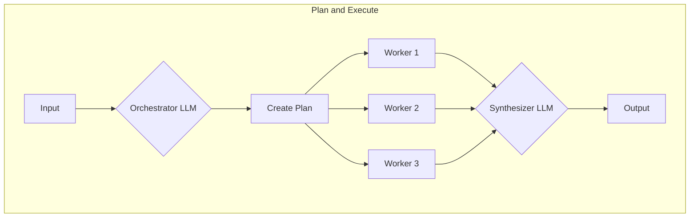
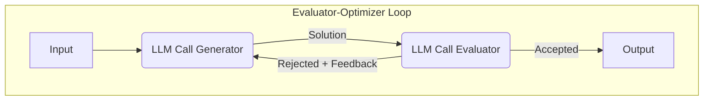
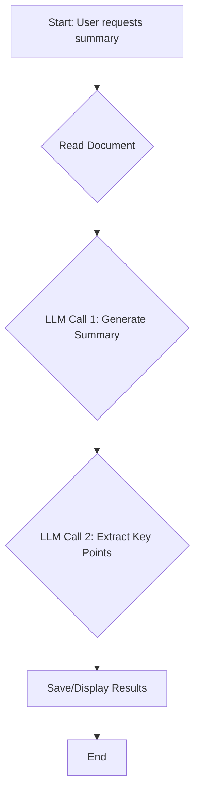
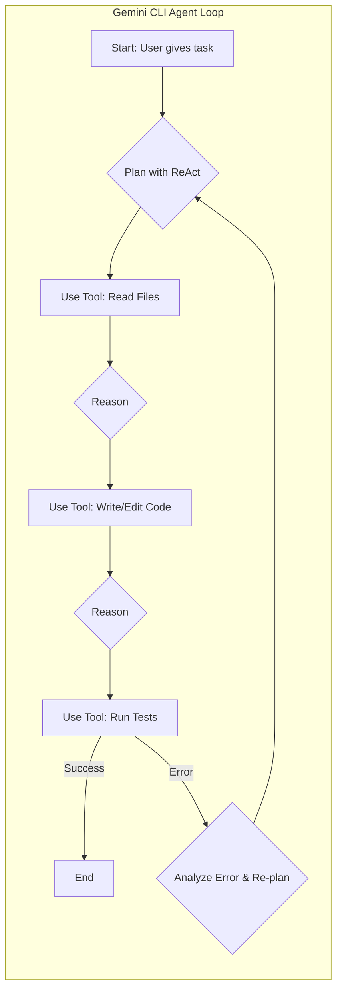
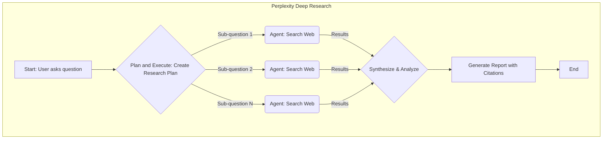

# AI Workflows vs. Agents: Choose Wisely
### Workflows vs. Agents: The AI Engineer's Dilemma

## Introduction: The Critical Decision Every AI Engineer Faces

You’re an AI engineer, and you’re about to build your first real AI application. You have access to powerful Large Language Models (LLMs), a clear problem to solve, and a deadline. But before you write a single line of code, you face a fundamental architectural choice: should you build a predictable, step-by-step workflow, or an autonomous, self-directing agent?

This isn’t a trivial decision. It’s a choice that will dictate your project’s complexity, cost, reliability, and ultimately, its success. Get it wrong, and you risk building a system that’s either too rigid to be useful or too chaotic to be trusted. You could end up with a workflow that shatters the moment a user provides an unexpected input, or an agent that works brilliantly 80% of the time but fails spectacularly on the most critical tasks. Months of development can be wasted, and user trust can be permanently lost.

In the fast-moving world of AI, the line between a thriving product and a failed experiment is often drawn at this exact architectural seam. The most successful AI companies have mastered this balance. They understand that the choice isn’t a binary one between rigid control and total autonomy. Instead, it’s about finding the right point on a spectrum to solve a specific problem.

This lesson will provide a framework to help you make this critical decision with confidence. We’ll break down the trade-offs between orchestrated workflows and autonomous agents, explore real-world examples from leading companies, and show you how to design robust systems that leverage the best of both worlds. By the end, you’ll be equipped to choose the right path for your AI applications.

## Understanding the Spectrum: From Workflows to Agents

Before we can choose between workflows and agents, we need a clear understanding of what they are. While both use LLMs to accomplish tasks, they represent two fundamentally different approaches to building AI systems. Think of it as a spectrum ranging from full developer control to full model autonomy.

An LLM Workflow is a system where developer-written code defines and orchestrates the sequence of tasks. You, the engineer, explicitly define each step, making the logic clear and the control flow predictable. It is like a factory assembly line: each station performs a specific, predetermined task in a set order to build a final product. The path is fixed, reliable, and easy to debug if a station breaks down. In future lessons, we’ll explore the core patterns that make up these workflows, like chaining, routing, and plan-and-execute [[1]](https://www.anthropic.com/engineering/building-effective-agents).

*Figure 1: An LLM workflow with a predefined, sequential path. (Media from [[1]](https://www.anthropic.com/engineering/building-effective-agents))*

On the other end of the spectrum, an Agentic System is one where the LLM dynamically decides the sequence of actions needed to achieve a goal. Instead of following a script, the agent reasons about the problem, selects tools, and adapts its plan based on the results it gets from the environment. This is less like an assembly line and more like a skilled human expert tackling a novel problem. They assess the situation, decide on a course of action, and adjust as they learn more. We'll soon dig into the components that enable this, such as tool use, planning, and memory [[1]](https://www.anthropic.com/engineering/building-effective-agents).

*Figure 2: An AI agent dynamically deciding its own actions in a loop. (Media from [[1]](https://www.anthropic.com/engineering/building-effective-agents))*

Both approaches require an orchestration layer to function, but its role is different. In a workflow, the orchestrator is a manager executing a fixed plan. In an agentic system, the orchestrator is a facilitator, enabling the LLM to create and execute its own dynamic plan.

## Choosing Your Path: PROs and CONs

Now that we have defined the two ends of the spectrum, the practical question is: when should you use which? The choice comes down to a trade-off between predictability and flexibility. There is no single right answer, only what is right for your specific use case.

LLM Workflows are predictable, reliable, and easier to debug. They excel at structured, repeatable tasks like data extraction, automated report generation, or content summarization followed by translation. Workflows are also ideal for regulated environments where traceable steps are crucial, and for high-frequency scenarios where predictable costs and latency are paramount. For startups, Minimum Viable Products (MVPs), and projects focused on rapid deployment, workflows allow you to move fast without heavy infrastructure investment. This stability is why enterprises often prefer them, but this strength is also their main weakness: workflows are rigid and can fail when faced with unexpected inputs [[3]](https://towardsdatascience.com/a-developer-s-guide-to-building-scalable-ai-workflows-vs-agents/).

Agents, in contrast, thrive on ambiguity and complexity. They are ideal for open-ended research, dynamic problem-solving like debugging code, or interactive customer support where the conversation can go in countless directions. Their ability to adapt and reason allows them to handle novel situations that would break a rigid workflow. But this flexibility comes at a cost. Agents are inherently non-deterministic, which can make their performance, latency, and cost vary wildly with each run. This unreliability is why many engineers are hesitant to deploy them in critical production systems [[2]](https://decodingml.substack.com/p/llmops-for-production-agentic-rag), [[3]](https://towardsdatascience.com/a-developer-s-guide-to-building-scalable-ai-workflows-vs-agents/).

*Figure 3: The fundamental trade-off between workflow reliability and agent autonomy. (Media from [[2]](https://decodingml.substack.com/p/llmops-for-production-agentic-rag))*

In reality, most production AI systems are not purely one or the other. They exist on a spectrum, blending both approaches into a hybrid system. A great way to think about this is the "autonomy slider." When you build an application, you are deciding how much control to give the LLM versus the human user. As you lean towards more manual control, you typically use an LLM workflow with human verification steps. As you move towards more automation, you give more control to the agent with fewer human-in-the-loop steps [[4]](https://www.youtube.com/watch?v=LCEmiRjPEtQ).

For example, a coding assistant like Cursor offers different levels of autonomy. You can use simple tab-completion (low autonomy, workflow-like), ask it to edit a selected block of code (medium autonomy), or let it attempt a change across the entire repository (high autonomy, agent-like). Similarly, Perplexity lets you do a quick search (workflow), a guided "Research" (hybrid), or a "Deep Research" where the agent works for several minutes on its own (agent). The ultimate goal is to speed up the AI generation and human verification loop, often achieved through a smart architecture and a well-designed user interface [[4]](https://www.youtube.com/watch?v=LCEmiRjPEtQ).

## Exploring Common Patterns

To build an intuition for how these systems are constructed, let's look at some of the most common patterns used in AI engineering. You don’t need to understand the deep technical details right now; the goal is to get a feel for the building blocks we'll explore in-depth in future lessons.

For LLM Workflows, engineers often rely on a few key patterns. The simplest is **chaining**, where the output of one LLM call becomes the input for the next. A more advanced version is **routing**, where an initial LLM call classifies the user's request and directs it to one of several specialized sub-workflows. A more sophisticated pattern is **plan-and-execute**, where an orchestrator LLM first breaks down a complex task into a series of smaller steps, which are then executed by worker models or tools [[1]](https://www.anthropic.com/engineering/building-effective-agents).

*Figure 4: The plan-and-execute pattern, where an orchestrator creates a plan for workers to execute.*

Another powerful workflow is the **evaluator-optimizer loop**. In this pattern, one LLM acts as a "generator," creating a solution, while a second LLM acts as an "evaluator," critiquing it based on a set of criteria. If the solution is rejected, the feedback is sent back to the generator to create a better version. This loop continues until the output is accepted [[1]](https://www.anthropic.com/engineering/building-effective-agents).

*Figure 5: The evaluator-optimizer loop, which uses one LLM to critique and refine the output of another.*

For AI Agents, the patterns focus on giving the LLM the ability to reason and interact with the world. This includes planning its actions and reflecting on its work to improve. The most fundamental pattern is **tool usage**, where tools (functions or APIs) allow the agent to get information or perform actions like searching the web or querying a database. This lets the agent go beyond its internal knowledge and affect its environment [[5]](https://blog.dailydoseofds.com/p/5-agentic-ai-design-patterns), [[6]](https://orq.ai/blog/ai-agent-architecture).

*Figure 6: The core components of an AI agent, including memory, planning, and tools. (Media from [[2]](https://decodingml.substack.com/p/llmops-for-production-agentic-rag))*

Agents also need memory to function effectively. **Short-term memory** is like a computer's RAM; it holds the context of the current task, often managed by the LLM's context window. For information that needs to persist across sessions, agents use **long-term memory**, typically implemented with a vector database to recall facts or past interactions [[7]](https://www.lindy.ai/blog/ai-agent-architecture).

## Looking at State-of-the-Art (SOTA) Examples (2025)

Let's look at some real-world examples from 2025 to see how these concepts are applied in practice. In enterprise environments, LLM workflows are standard for their reliability. **Gemini in Google Workspace** uses structured workflows to summarize emails and documents [[8]](https://www.merrittgrp.com/mg-blog/gemini-for-google-workspace-analysis/). Companies like **Geotab** and **Kinaxis** also use workflows for data analytics and supply chain optimization, translating natural language into complex queries for real-time insights [[9]](https://cloud.google.com/transform/101-real-world-generative-ai-use-cases-from-industry-leaders/), [[10]](https://arize.com/blog/how-geotab-and-arize-ai-revolutionized-fleet-management-with-generative-ai/).

Workflows also transform creative and legal industries. **Adobe's Firefly** integrates generative AI for on-brand image and marketing content creation using predefined templates. In the legal sector, firms like **FreshFields** deploy AI workflows to automate legal document analysis and contract drafting, increasing accuracy through auditable, step-by-step automation [[9]](https://cloud.google.com/transform/101-real-world-generative-ai-use-cases-from-industry-leaders/), [[11]](https://business.adobe.com/resources/webinars/supercharge-content-creation-with-gen-ai-in-cc.html).

Now, let's shift our focus to agentic systems, designed for more open-ended tasks. **Perplexity's Deep Research** feature acts as an autonomous agent, performing searches and synthesizing findings into comprehensive reports, mimicking a human researcher's iterative process [[12]](https://www.infoq.com/news/2025/02/perplexity-deep-research/).

In the developer world, coding assistants like **Google's Gemini Command Line Interface (CLI)** and **Cursor** function as agents. They understand a codebase, write new features, fix bugs, and interact with the file system and terminal. These agents use a "Reason and Act" (ReAct) loop, an iterative process where the agent reasons about a problem, takes action using tools, and repeats as necessary to dynamically solve complex coding tasks [[13]](https://cloud.google.com/gemini/docs/codeassist/gemini-cli), [[14]](https://www.builder.io/blog/cursor-ai-for-developers).

General task automation agents like **OpenAI's ChatGPT agent** also act as digital assistants that browse the web, plan trips, and generate presentations, breaking down high-level user requests into executable steps. These examples highlight the shift towards more autonomous systems for complex, unpredictable tasks [[15]](https://openai.com/index/introducing-chatgpt-agent/).

## Zooming In on Our Favorite Examples

Let's dig a little deeper into a few key examples to understand how they combine these patterns to create a cohesive user experience. We will keep the explanations simple, focusing on the high-level architecture.

### Document Summarization in Google Workspace
The document summarization feature in Google Workspace perfectly exemplifies a pure, multi-step workflow. When you ask Gemini to summarize a long document, it follows a predictable, hardcoded sequence. This is not an agent thinking for itself; it is a well-defined process designed for reliability and consistency. The workflow uses a simple chain of LLM calls, ensuring that it generates every summary in the same structured way.

*Figure 7: A simple, linear workflow for document summarization.*

### Gemini CLI Coding Assistant
Google's Gemini CLI is a powerful example of an agent built for developers. It uses a pattern similar to ReAct (Reason and Act), operating in a continuous loop of thinking and doing. When you give it a task like "refactor this function," the agent does not just write code. It first plans its approach, then uses tools to read existing files and understand the project structure. After it generates or modifies code, it can use other tools to run tests or a linter to check for errors. If something fails, it analyzes the error, modifies its plan, and tries again. This iterative, tool-driven loop makes it an agent, capable of handling complex and unpredictable coding tasks.

*Figure 8: The ReAct-like operational loop of the Gemini CLI coding agent.*

### Perplexity Deep Research
Perplexity's deep research feature is a fascinating hybrid. It combines a structured workflow with agent-like behavior. At a high level, it uses a plan-and-execute pattern. When you ask a complex question, Perplexity first creates a research plan, breaking the query down into several sub-questions. This is the workflow part. Then, for each sub-question, it acts like an agent, using its search tool to find relevant sources online. After it gathers all the information, it enters a final workflow step, where an LLM synthesizes the findings from all the searches into a single, comprehensive report with citations. This structure provides the reliability of a workflow while allowing for the flexibility of an agent during the search phase.

*Figure 9: Perplexity's hybrid model, using a plan-and-execute workflow to coordinate agentic searches.*

### ChatGPT Agent
The ChatGPT agent represents a significant step towards general-purpose digital assistants. It also uses a ReAct-like pattern to autonomously think and act on your behalf. Its broad range of tools sets it apart. It can browse the web, generate downloadable files like slide decks and spreadsheets, and interact with web pages to complete tasks. This allows it to handle complex, multi-step requests that require coordinating different types of digital work. However, this power also brings significant challenges. Ensuring the agent acts reliably, ethically, and safely is a massive engineering undertaking, as the potential for error or misuse is much higher when an agent can perform actions across the web [[15]](https://openai.com/index/introducing-chatgpt-agent/).

## Conclusion: The Challenges of Every AI Engineer

Now that you understand the spectrum from workflows to agents, it’s crucial to recognize the daily reality of an AI engineer. Whether you're at a small startup or a tech giant, you will face the same fundamental challenges. These are the practical, often frustrating problems that determine whether an AI application succeeds in the wild or remains a fragile demo.

You will constantly battle a **reliability crisis**. Your agent might work flawlessly during testing but become unpredictable with real users, with its reasoning failing in unexpected ways [[16]](https://ragaboutit.com/the-hidden-truth-about-ai-agent-reliability-why-73-of-enterprise-deployments-are-failing/). You will also face **context chaos**, trying to maintain coherence in long conversations while your system gradually loses track of the initial goal.

Then there's the **data integration nightmare**, where you need to pull information from dozens of sources—Slack, APIs, databases, transcripts—and get your system to process it all without tripping over itself [[17]](https://rtslabs.com/challenges-in-ai-deployment/). You will face the **cost-performance trap**, where your highly capable agent costs a fortune per interaction, while your cheap workflow feels clunky and unintelligent [[18]](https://www.edstellar.com/blog/ai-agent-reliability-challenges). And you will live with **security paranoia**, constantly worrying that your autonomous agent, with its powerful write permissions, might delete a critical file, expose sensitive data, or be tricked into performing a harmful action [[19]](https://unit42.paloaltonetworks.com/agentic-ai-threats/).

These aren't just theoretical problems; they are the day-to-day reality of building with AI. But here’s the good news: these challenges are solvable. In fact, they are exactly what this course is designed to address. In the upcoming lessons, we will systematically tackle each of these issues. You will learn battle-tested patterns for building reliable systems, proven strategies for managing context, and practical approaches for handling multimodal data.

We will also cover techniques for optimizing cost and security frameworks that let you deploy with confidence. Your path forward as an AI engineer is about mastering these realities. By the end of this course, you will have the knowledge to architect AI systems that are not only powerful but also robust, efficient, and safe. You'll know when to use a workflow, when to deploy an agent, and how to build effective hybrid systems that work in the messy, unpredictable real world.

## References

- [1] [Building effective agents](https://www.anthropic.com/engineering/building-effective-agents)
- [2] [Build Production Agentic RAG with LLMOps At Its Core](https://decodingml.substack.com/p/llmops-for-production-agentic-rag)
- [3] [A Developer’s Guide to Building Scalable AI: Workflows vs Agents](https://towardsdatascience.com/a-developer-s-guide-to-building-scalable-ai-workflows-vs-agents/)
- [4] [Andrej Karpathy: Software Is Changing (Again)](https://www.youtube.com/watch?v=LCEmiRjPEtQ)
- [5] [5 Agentic AI Design Patterns](https://blog.dailydoseofds.com/p/5-agentic-ai-design-patterns)
- [6] [AI Agent Architecture: The Roadmap to Advanced AI](https://orq.ai/blog/ai-agent-architecture)
- [7] [The Complete Guide to AI Agent Architecture](https://www.lindy.ai/blog/ai-agent-architecture)
- [8] [Gemini for Google Workspace: Analysis and Implications](https://www.merrittgrp.com/mg-blog/gemini-for-google-workspace-analysis/)
- [9] [601 real-world gen AI use cases from the world's leading organizations](https://cloud.google.com/transform/101-real-world-generative-ai-use-cases-from-industry-leaders)
- [10] [How Geotab and Arize AI Revolutionized Fleet Management with Generative AI](https://arize.com/blog/how-geotab-and-arize-ai-revolutionized-fleet-management-with-generative-ai/)
- [11] [Supercharge your content creation with Gen AI in Creative Cloud for enterprise](https://business.adobe.com/resources/webinars/supercharge-content-creation-with-gen-ai-in-cc.html)
- [12] [Perplexity's New "Deep Research" Feature Creates Comprehensive Reports on Any Topic in Minutes](https://www.infoq.com/news/2025/02/perplexity-deep-research/)
- [13] [Gemini CLI](https://cloud.google.com/gemini/docs/codeassist/gemini-cli)
- [14] [Cursor: The AI-First Code Editor for Developers](https://www.builder.io/blog/cursor-ai-for-developers)
- [15] [Introducing ChatGPT agent: bridging research and action](https://openai.com/index/introducing-chatgpt-agent/)
- [16] [The Hidden Truth About AI Agent Reliability: Why 73% of Enterprise Deployments Are Failing](https://ragaboutit.com/the-hidden-truth-about-ai-agent-reliability-why-73-of-enterprise-deployments-are-failing/)
- [17] [Top 10 AI Deployment Challenges & Solutions](https://rtslabs.com/challenges-in-ai-deployment)
- [18] [AI Agent Reliability: Top 5 Challenges & Solutions in 2025](https://www.edstellar.com/blog/ai-agent-reliability-challenges)
- [19] [AI Agents Are Here. So Are the Threats.](https://unit42.paloaltonetworks.com/agentic-ai-threats/)