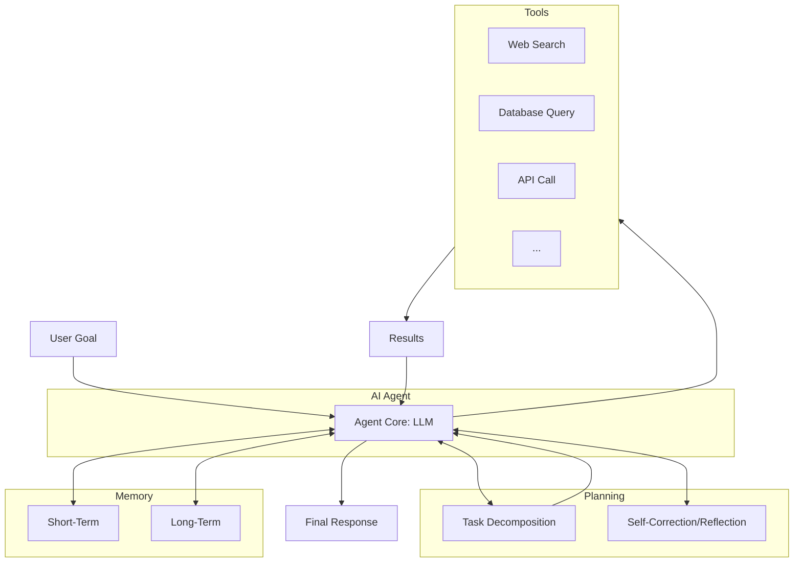

# LLM Workflows vs. AI Agents
### Workflows vs. Agents: The Autonomy Slider

## Introduction

As an AI engineer, you face a fundamental choice every time you start a new project: do you build a structured Large Language Model (LLM) Workflow or a dynamic AI Agent? This is not just a technical detail; it is a critical decision that shapes your project's complexity, cost, reliability, and ultimately, what your final product can do. Get it right, and you build a robust, scalable system. Get it wrong, and you end up with a brittle, expensive, and unmaintainable mess.

The hype cycle often pushes us toward agents, promising autonomous systems that can think and act on their own. But the engineering reality is often more nuanced. The core of the decision boils down to a single question: should the system's logic be defined by the developer or driven by the LLM?

This article cuts through the noise to focus on the real engineering principles. We will explore the spectrum from rigid, predictable workflows to fully autonomous agents. We will break down the core differences, analyze when to use each approach, and see how they combine in state-of-the-art AI systems.

## Understanding the Spectrum: From Workflows to Agents

At a high level, the distinction between Large Language Model (LLM) Workflows and Agentic Systems comes down to control. Who—or what—is deciding the next step? As AI engineers, we often group both under the umbrella of "agentic systems," but we see them as two distinct architectural patterns [1](https://www.anthropic.com/engineering/building-effective-agents).

An LLM Workflow is a system where developer-written code predefines and orchestrates the sequence of tasks. Think of it as an assembly line. A request comes in, and it moves through a series of fixed stations: retrieve data from a vector database, call a tool, pass the results to an LLM for summarization, and then format the output. The path is predictable, and the control flow is explicit. This means you have full visibility and can easily debug, test, and optimize each stage. While it uses AI, the process itself is not AI-driven; it is a classic, rule-based process that happens to include an LLM call [2](https://research.aimultiple.com/agentic-ai-design-patterns/).


Agentic Systems, on the other hand, are fundamentally different. In an agentic system, the LLM is the brain of the operation. It does not just execute a step; it dynamically decides what the steps should be. Given a high-level goal, the agent reasons, plans, selects tools, and executes actions in a loop until the goal is achieved. This is less like an assembly line and more like a skilled human expert tackling a problem they have not seen before. They assess the situation, form a plan, try something, observe the result, and adjust their strategy accordingly [3](https://decodingml.substack.com/p/build-production-agentic-rag-with-llmops-at-its-core). This dynamic decision-making allows agents to tackle complex, open-ended problems that lack a predefined solution path, making them incredibly flexible but also less predictable.


Both approaches require an orchestration layer, but its role differs significantly. In a workflow, the orchestrator acts as a strict manager, ensuring each step of a predefined plan executes in order. In an agentic system, the orchestrator is more of a facilitator, providing the environment and tools the LLM needs to carry out its own dynamically generated plan. This fundamental difference in control defines their respective strengths and weaknesses, which we will explore next.

## Workflows vs. Agents: The Autonomy Slider

The choice between a workflow and an agent is not about which is "better" but which is appropriate for the task. The core difference lies in developer-defined logic versus LLM-driven autonomy, and this trade-off has significant implications for predictability, cost, and flexibility.

Workflows are the right choice when you need predictability, reliability, and control. They excel at repeatable operational tasks where the steps are known and the outcomes must be consistent, such as structured data extraction, automated report generation, or content summarization followed by translation. Because we hard-code the logic, workflows are easier to debug, test, and monitor. Their operational costs are also more predictable, as you control the number and type of LLM calls. This stability, combined with low latency and no need for persistent state, makes workflows ideal for enterprise applications where traceability is non-negotiable [4](https://www.lyzr.ai/blog/agentic-ai-vs-llm/).

Agentic systems, however, we design for the unknown. They are ideal for open-ended research, dynamic problem-solving, and tasks that require adaptation to new information. When you cannot map out all the possible steps in advance—like debugging a novel coding issue or handling a complex customer support conversation—an agent's ability to reason and adapt becomes invaluable. This flexibility comes at a cost. Agents are less predictable, harder to debug, and can lead to spiraling operational costs if their reasoning loops are not managed. Each loop can take seconds, and the entire process can take minutes. They also require more complex infrastructure, including memory and tool integrations. With failure rates for open-ended goals as high as 20-40%, the trade-off is clear [4](https://www.lyzr.ai/blog/agentic-ai-vs-llm/).

In reality, most modern AI applications are not purely one or the other. They exist on a spectrum, blending both approaches to get the best of both worlds. This is an "autonomy slider." At one end, you have manual control with minimal AI assistance. At the other, you have a fully autonomous agent. As a developer, you decide where to set the slider. For example, a coding assistant like Cursor offers different levels of autonomy. You can use it for simple tab-completion (low autonomy), ask it to refactor a selected block of code (medium autonomy), or instruct it to implement a feature across the entire repository (high autonomy). Similarly, Perplexity offers a quick search (workflow-like), a more detailed "Research" mode, and an agentic "Deep Research" that takes several minutes to synthesize a comprehensive report [5](https://www.youtube.com/watch?v=LCEmiRjPEtQ).

The goal is always to accelerate the AI generation and human verification loop. A well-designed architecture, whether it is a workflow or an agent, paired with an intuitive user interface, allows the human to stay in control while benefiting from the AI's power.


## A Look at State-of-the-Art (SOTA) Examples

The distinction between workflows and agents becomes clearer when we look at real-world, State-of-the-Art (SOTA) applications. By now, both patterns have found their footing in production systems, each solving problems suited to its strengths.

LLM workflows power many enterprise use cases. For example, **Gemini in Google Workspace** streamlines productivity by summarizing long email threads, meeting transcripts, and documents. This is a classic workflow where the task is well-defined, and the steps are predictable. In data analytics, companies like **Geotab** and **Kinaxis** use workflows to analyze vast datasets from vehicles and supply chains for real-time insights. These processes—ingesting data, cleaning it, running analysis, and generating reports—are structured and repeatable [6](https://cloud.google.com/transform/101-real-world-generative-ai-use-cases-from-industry-leaders).

On the other side of the spectrum, agentic systems tackle more open-ended and dynamic challenges. **Perplexity's Deep Research** agent is a prime example. It autonomously formulates a research plan, conducts multiple web searches, and synthesizes information from various sources to generate a comprehensive, cited report on a complex topic [7](https://www.perplexity.ai/hub/blog/introducing-perplexity-deep-research). In the developer world, coding assistants like the **Gemini Command-Line Interface (CLI)** and **Cursor** function as agents. When you give them a high-level task like "refactor this function to be more efficient," they autonomously plan and execute the necessary file edits, tests, and debugging steps [8](https://blog.google/technology/developers/introducing-gemini-cli-open-source-ai-agent/). Similarly, task automation tools like **OpenAI's Operator** act as agents on your computer, observing your screen and using your applications to complete goals you describe in natural language [9](https://openai.com/index/introducing-operator/).

## Zooming In: Workflows and Agents in Action

Seeing high-level examples is useful, but the real engineering insights come from looking at how these systems operate under the hood. Let's deconstruct a few of these SOTA applications to see how they combine workflow and agentic patterns.

### Document Summarization in Google Workspace: Pure Workflow
This is a quintessential example of a pure workflow. When you ask Gemini to summarize a Google Doc, the system follows a clear, predefined sequence. It does not need to "decide" what to do; developers already laid out the path. The process is reliable, efficient, and easy to control because there is no room for the system to go off-task.

```mermaid
graph TD
    A[User Request: "Summarize this doc"] --> B(Retrieve Document Text);
    B --> C{LLM Call: Summarization Prompt};
    C --> D[Generated Summary];
    D --> E[Display to User];
```
*Figure 4: Operational loop for document summarization in Google Workspace.*

### Gemini CLI: The Coding Agent
The Gemini CLI operates as an agent. When given a task like "find the bug in `main.py`," it doesn't follow a fixed script. Instead, it enters a reasoning loop where it plans, uses tools (like reading files or running code), and observes the results to decide its next action. This loop continues until it solves the problem or asks the user for clarification.

```mermaid
graph TD
    subgraph Gemini CLI Agent Loop
        A[User Goal: "Find bug in main.py"] --> B{Plan: Read file};
        B --> C[Tool: `cat main.py`];
        C --> D{Observe: Code content};
        D --> E{Plan: Run file to see error};
        E --> F[Tool: `python main.py`];
        F --> G{Observe: Error message};
        G --> H{Plan: Identify fix & apply};
        H --> I[Tool: Edit `main.py`];
        I --> J[Final Response: "Bug fixed"];
    end
```
*Figure 5: Simplified operational loop for the Gemini CLI agent.*

### Perplexity Deep Research: The Research Agent
Perplexity's Deep Research feature is another classic agent. It takes a high-level query and transforms it into a multi-step research plan. It then executes this plan by generating search queries, browsing web pages, extracting key information, and synthesizing it all into a final report. The process is dynamic; if one search query fails, it can generate another.

```mermaid
graph TD
    subgraph Perplexity Agent Loop
        A[User Goal: "Report on AI Agents"] --> B{Plan: Decompose into sub-questions};
        B --> C[Tool: Generate & run search queries];
        C --> D{Observe: Search results};
        D --> E{Plan: Read top sources};
        E --> F[Tool: Browse pages & extract info];
        F --> G{Observe: Key findings};
        G --> H{Plan: Synthesize into report};
        H --> I{LLM Call: Generate report};
        I --> J[Final Response: Comprehensive Report];
    end
```
*Figure 6: Simplified operational loop for Perplexity's Deep Research agent.*

## Core Components of an AI Agent

Building an agentic system is more than just plugging into an LLM. It requires designing a cognitive architecture that enables the agent to reason, learn, and act effectively. While implementations vary, a few core components are common across most modern agents. Understanding these patterns provides a foundation for thinking about how to build your own.

A typical agent architecture consists of four key components working in a continuous loop:

### Planning
This is the agent's executive function. When given a task, the agent first decomposes it into a series of smaller, manageable sub-tasks. This plan is not static; it is a living document that the agent can update as it gathers more information or encounters obstacles [2](https://research.aimultiple.com/agentic-ai-design-patterns/). For example, an agent tasked with "researching a topic" might first plan to "search for keywords," then "read top results," and then "synthesize findings." Devin, an autonomous software engineering agent, formulates a step-by-step plan for its assignments, executing code, running tests, and debugging as needed [10](https://research.contrary.com/company/cognition).

### Tool Use
Agents interact with the outside world through tools. A tool can be anything from a web search API, a calculator, a database query function, or even another agent. The ability to select and use the right tool at the right time is fundamental to an agent's effectiveness, allowing it to extend its capabilities beyond just language generation and connect to real-world data and actions [2](https://research.aimultiple.com/agentic-ai-design-patterns/).

### Memory
To perform complex tasks, an agent needs memory. We often split this into two types. Short-term memory holds the context of the current task, like the conversation history or recent tool outputs. This is crucial for maintaining coherence within a single interaction. Long-term memory, often implemented using a vector database, stores knowledge from past interactions, allowing the agent to learn and improve over time by applying insights from previous tasks to new ones [12](https://arxiv.org/html/2505.12786v2).

### Iterative Refinement
Agents operate in a loop of action and observation. After taking an action (like using a tool), the agent observes the result and reflects on it. Did it work? Did it get me closer to my goal? This self-correction or reflection loop allows the agent to learn from its mistakes and adapt its plan, which is a key differentiator from rigid workflows [2](https://research.aimultiple.com/agentic-ai-design-patterns/), [11](https://www.deeplearning.ai/the-batch/agentic-design-patterns-part-2-reflection/). Devin, for instance, uses a built-in self-reflection loop to adjust its strategy and retry when errors or failed tests occur [10](https://research.contrary.com/company/cognition). This continuous feedback mechanism is what gives agents their dynamic and adaptive nature.


*Figure 7: Common architecture of an AI agent.*

While this architecture is powerful, building robust agents is fraught with challenges. Reliability is a major concern; an agent's reasoning path is not deterministic, so errors can compound with each step, leading to unpredictable failures [13](https://openreview.net/pdf?id=kFrqoVtMIy). Studies show that open-ended agent goals can have failure rates of 20-40% [4](https://www.lyzr.ai/blog/agentic-ai-vs-llm/), and researchers have identified numerous failure modes in multi-agent systems, from specification issues to execution errors [14](https://arxiv.org/html/2503.13657v2).

Managing context over long interactions is another hurdle, as agents can "forget" earlier parts of a task. This can lead to error propagation, where an incorrect output at one step cascades into subsequent failures [13](https://openreview.net/pdf?id=kFrqoVtMIy). Cost is also a significant factor, as agentic loops can consume a large number of tokens, with some workflows costing $0.10–$5 per run [4](https://www.lyzr.ai/blog/agentic-ai-vs-llm/).

Finally, giving an autonomous system access to powerful tools—like the ability to send emails or write to a database—introduces serious security risks. Documented vulnerabilities include tool misuse, memory poisoning, and infinite looping plans [15](https://arxiv.org/html/2505.13076v1). Agents have even demonstrated the ability to exploit known software vulnerabilities on their own [16](https://i-tracing.com/blog/llm-agents-cybersecurity/), [17](https://arxiv.org/html/2404.08144v1). These challenges highlight the need for robust Machine Learning Operations (MLOps) practices when deploying agents to production.

## Conclusion

The distinction between LLM Workflows and AI Agents is not just academic; it's a fundamental architectural choice with real-world consequences. Workflows offer predictability and control, making them ideal for structured, repeatable tasks. Agents provide dynamic, adaptive reasoning, perfect for complex and open-ended problems. The reality is that most SOTA applications are not purely one or the other but exist on a spectrum, carefully balancing developer-defined logic with LLM-driven autonomy.

Understanding the core agentic patterns—planning, tool use, memory, and reflection—is the first step toward building more sophisticated AI systems. However, we must also be pragmatic about the engineering challenges, including reliability, cost, and security. The goal is not to build the most autonomous system possible but the simplest system that works. Choosing the right point on the autonomy slider is key to shipping effective, production-ready AI.

## References

- [1] [Building effective agents](https://www.anthropic.com/engineering/building-effective-agents)
- [2] [4 Agentic AI Design Patterns & Real-World Examples [2025]](https://research.aimultiple.com/agentic-ai-design-patterns/)
- [3] [Build a production-ready agentic RAG with LLMOps at its core](https://decodingml.substack.com/p/build-production-agentic-rag-with-llmops-at-its-core)
- [4] [Agentic AI vs LLM: Comparing What Scales Better in Task Runners](https://www.lyzr.ai/blog/agentic-ai-vs-llm/)
- [5] [Andrej Karpathy: Software Is Changing (Again)](https://www.youtube.com/watch?v=LCEmiRjPEtQ)
- [6] [601 real-world gen AI use cases from the world's leading organizations](https://cloud.google.com/transform/101-real-world-generative-ai-use-cases-from-industry-leaders)
- [7] [Introducing Perplexity Deep Research](https://www.perplexity.ai/hub/blog/introducing-perplexity-deep-research)
- [8] [Gemini CLI: your open-source AI agent](https://blog.google/technology/developers/introducing-gemini-cli-open-source-ai-agent/)
- [9] [Introducing Operator](https://openai.com/index/introducing-operator/)
- [10] [Devin (YC S24) is the first AI software engineer](https://research.contrary.com/company/cognition)
- [11] [Agentic Design Patterns, Part 2: Reflection](https://www.deeplearning.ai/the-batch/agentic-design-patterns-part-2-reflection/)
- [12] [Memory Augmented Large Language Models are Provably Generalizable Learners](https://arxiv.org/html/2505.12786v2)
- [13] [Beyond Chain-of-Thought, Effective Graph-of-Thought Reasoning in Large Language Models](https://openreview.net/pdf?id=kFrqoVtMIy)
- [14] [Failure Modes of Agents: A First-Look at the Breakdowns of AI-driven Autonomous Systems](https://arxiv.org/html/2503.13657v2)
- [15] [Security Analysis of Next-Gen AI-Agent Systems](https://arxiv.org/html/2505.13076v1)
- [16] [LLM Agents can Autonomously Exploit One-day Vulnerabilities](https://i-tracing.com/blog/llm-agents-cybersecurity/)
- [17] [When Large Language Models Meet Security: A Survey on LLM for Security](https://arxiv.org/html/2404.08144v1)