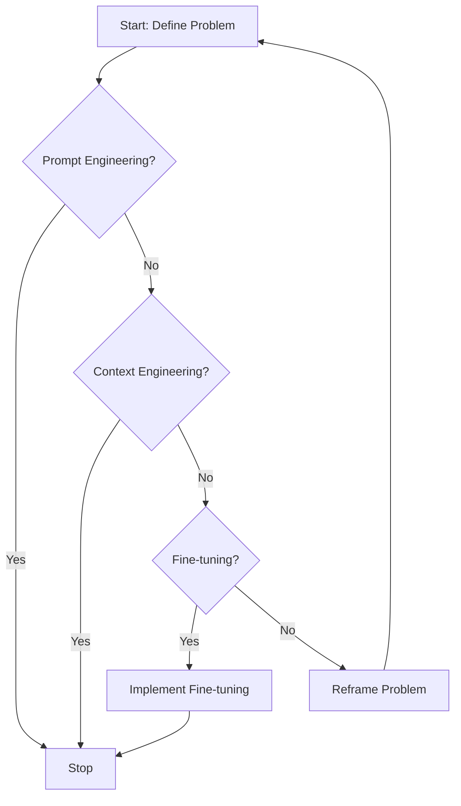
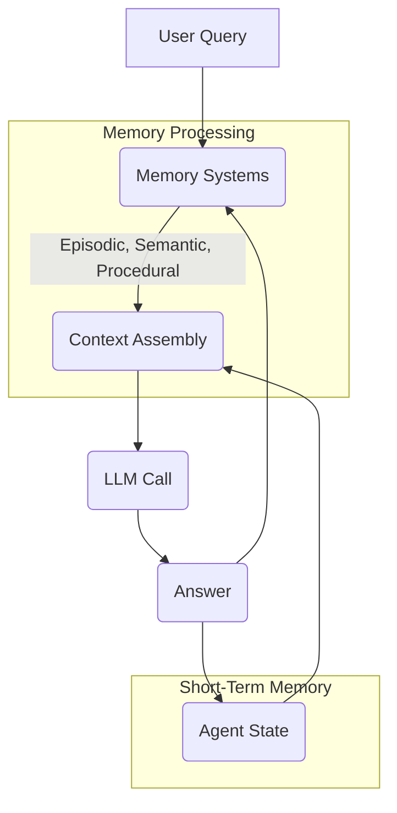

# Context Engineering: Own Your LLM
### Mastering the art of context for LLMs

## From Prompt to Context Engineering

In the early days of Large Language Models (LLMs), we primarily interacted with them through prompt engineering. This worked well for simple chatbots handling one question at a time. However, as AI applications evolved—from Retrieval-Augmented Generation (RAG) systems accessing domain knowledge to tool-using agents performing actions, and now memory-enabled agents maintaining state and building relationships—the limitations of single-shot prompting became clear.

Prompt engineering is optimized for a single interaction. It doesn’t account for sustained, multi-turn conversations where context grows with each exchange. This leads to a few critical problems. First is context decay. As a conversation gets longer, the LLM can get lost in the noise, struggling to find the "needle in the haystack" and often producing misguided answers or hallucinations. Second is the context window itself. While models now boast massive context windows, research shows that performance can degrade long before the limit is reached, as irrelevant information creates distraction.

Finally, practical constraints like cost and latency become significant. Every token passed to an LLM makes inference slower and more expensive. The naive approach of just throwing everything into the context window—sometimes called "Context-Augmented Generation" (CAG)—is a recipe for slow, expensive, and inaccurate systems. This kind of "context stuffing" is a prime example of how not to build production-grade AI. I learned this the hard way on a project where I stuffed all my research, guidelines, and examples into the context. The result was a workflow that took 30 minutes to run and produced low-quality output.

This is where context engineering comes in. It addresses these limitations by treating AI applications not as a series of isolated prompts, but as systems that operate on a dynamic stream of information from past conversations, databases, and tools. As an AI Engineer, your job is to curate this stream, ensuring the LLM receives only what is essential to make it accurate, fast, and cost-effective. In the following sections, we will break down what context engineering truly means, its components, and how to tackle its challenges in real-world applications.

## What is Context Engineering?

So, what exactly is context engineering? The formal definition is that it’s an optimization problem: finding the ideal assembly of information to get the best possible answer from an LLM [[1]](https://arxiv.org/pdf/2507.13334). But let’s keep it simple. Context engineering is the practice of strategically selecting and organizing information from an application's short-term and long-term memory to solve a specific task without overwhelming the model. It's about figuring out what the model needs to see, right now, to perform its function optimally.

Imagine you're building a cooking agent. When a user asks for a pasta recipe, you wouldn't feed the entire cookbook into the LLM's context. That would be inefficient and likely lead to confusion. Instead, you’d retrieve the specific pasta recipe, along with the user's known allergies or taste preferences, and present just that essential information. This is the core idea of context engineering: precision over volume.

Andrej Karpathy offered a useful analogy, comparing the LLM to a new kind of operating system. The model is the CPU, and its context window is the RAM [[2]](https://x.com/karpathy/status/1937902205765607626). Just as an operating system manages what goes into RAM to keep applications running smoothly, context engineering curates what occupies the model's working memory. It’s a carefully chosen subset of the system's total memory, selected specifically for the task at hand.

It’s important to understand that context engineering doesn’t replace prompt engineering; it absorbs it. You still need to write clear, effective instructions within your prompts. The difference is that these instructions now operate within a rich, managed ecosystem of information. Prompt engineering focuses on *how* you ask the question, while context engineering focuses on *what* information you provide alongside that question.

| Dimension | Prompt Engineering | Context Engineering |
|-----------|-------------------|---------------------|
| Scope | Single interaction optimization | Entire information ecosystem |
| Complexity | O(1) context assembly | O(n) multi-component optimization |
| State Management | Stateless function | Stateful with memory |
| Focus | How to phrase tasks | What information to provide |
Table 1: A comparison of Prompt Engineering and Context Engineering paradigms.

Context engineering is also becoming the new fine-tuning. With modern LLMs generalizing so well, the need for costly and time-consuming fine-tuning is diminishing. Fine-tuning should be the last resort for most problems. For many real-world scenarios, a well-designed context engineering pipeline is more flexible, cheaper, and faster to implement [[3]](https://www.glean.com/blog/retrieval-augemented-generation-vs-fine-tuning), [[4]](https://www.vktr.com/ai-technology/rag-vs-fine-tuning-a-practical-guide-to-llm-customization/). For instance, when processing Slack messages from your company, you can often use a reasoning LLM as the core of your agent, combined with various mechanisms to retrieve specific Slack messages and take actions like creating action points or writing emails. This approach allows you to adapt your AI application to new data or requirements without retraining a massive model.

Your decision-making process for building an AI application should follow a clear path from simple to complex. Start with prompt engineering. If that doesn't solve the problem, move to context engineering. Only if that fails should you consider the heavy lift of fine-tuning. This pragmatic approach ensures you build efficient and effective AI systems without unnecessary complexity or cost.

Figure 1: The recommended workflow for tackling AI engineering problems, prioritizing simpler solutions first.

## What Makes Up the Context

Now that we've defined context engineering and its place in your toolkit, let's break down what actually goes into the context. The context is everything you pass to an LLM in a single call. Your system dynamically computes this payload for every turn in a conversation, assembling it from various memory sources. Think of it as constructing the perfect briefing for an expert before they tackle a problem. This briefing must be concise, relevant, and structured to maximize the expert's understanding and performance.

Here are the core components that typically make up the context:

*   **The System Prompt:** This procedural long-term memory contains high-level instructions, rules, and the persona that guides the agent’s behavior. Here, you define the AI's role and constraints.
*   **Agent's State:** This short-term working memory includes the user's latest input, recent message history, and for complex agents, internal thoughts or tool use sequences (like an action and its resulting observation). This component captures the immediate conversation flow.
*   **Long-Term Memory:** Agents store information that persists across sessions here. We can break this down into types based on cognitive science [[5]](https://www.nature.com/articles/s41593-023-01496-2):
    *   **Episodic Memory:** This stores past experiences, like user preferences or previous conversations. We often keep this in vector or graph databases, allowing the agent to remember specific interactions.
    *   **Semantic Memory:** This holds factual knowledge from internal knowledge bases (e.g., company documents) or external sources (e.g., real-time Application Programming Interfaces (APIs)). It provides the agent with domain-specific information. RAG is a key technique for accessing this type of memory.
    *   **Procedural Memory:** This contains knowledge about how to do things, including the design of instructions and the format for desired outputs. It encompasses schemas for available tools and the specific structure for responses you want the model to generate.


Figure 2: A conceptual view of Context Engineering, where Prompt Engineering, RAG, State/History, Memory, and Structured Outputs all contribute to the final context [[6]](https://github.com/humanlayer/12-factor-agents/blob/main/content/factor-03-own-your-context-window.md).


Figure 3: Examples of Fully-Specified Instructions versus Sharded Instructions, demonstrating different approaches to structuring prompts for LLMs [[6]](https://github.com/humanlayer/12-factor-agents/blob/main/content/factor-03-own-your-context-window.md).

These components are not static. With each user query, the system dynamically re-evaluates what information it needs. The message history expands, new knowledge is retrieved, and user preferences update. This creates a continuous cycle. A user's query triggers retrieval from long-term memory, which combines with short-term memory to form the context. The LLM processes this context to generate an answer. This interaction updates both short-term and long-term memory, preparing the system for the next conversation turn.

Figure 4: The cyclical flow of information in a context-engineered system.

## Challenges in Context Engineering

While context engineering offers immense power, implementing it in production brings unique challenges. You might think a large context window solves everything, but simply relying on it without proper engineering often leads to inefficient and unreliable systems.

First, your context window is finite. Even with LLMs now claiming millions of tokens, this "RAM" fills up quickly in complex, long-running applications. Performance often degrades long before you hit the hard limit due to **information overload**, also known as context decay or distraction. As context grows, the LLM can get confused, losing track of its primary goal and focusing on irrelevant details. Research shows model correctness drops significantly once context exceeds 32,000 tokens, even with higher theoretical limits [[7]](https://www.databricks.com/blog/long-context-rag-performance-llms). This highlights that more context is not always better; *relevant* context is crucial.

Another challenge you will face is **context drift** or poisoning. This happens when incorrect or conflicting information enters the context and persists over time. For example, an agent might hallucinate a fact, then continue referencing that false information, leading to a nonsensical path and confusing the model [[8]](https://www.dbreunig.com/2025/06/22/how-contexts-fail-and-how-to-fix-them.html). Imagine telling your AI assistant, "My cat is white," and later, "My cat is black." This isn't quantum physics; it simply confuses the LLM and prevents it from knowing what to pick.

Finally, **tool confusion** arises when your agent has access to many tools with unclear descriptions or overlapping functionalities. It struggles to select the correct one, leading to failed tasks or inefficient workflows [[8]](https://www.dbreunig.com/2025/06/22/how-contexts-fail-and-how-to-fix-them.html). These challenges underscore the need for deliberate context management strategies.

## Context Optimization Strategies

In the early days of AI applications, most systems were simple chatbots or RAG setups doing question-answering over a single knowledge base. Today, we build complex agents that juggle multiple tools and data sources. This requires more sophisticated strategies for managing the LLM context window. The goal is to maximize the signal-to-noise ratio, giving the LLM precisely what it needs and nothing more. This is where the real engineering work comes in.

Here are some key strategies for context optimization:

### Context Selection
A common mistake is providing all available context when only a fraction is needed. Instead of the naive "Context-Augmented Generation" approach, you should be selective. You can use RAG techniques not just for documents, but also for selecting the most relevant tools for a given task. Studies have shown that limiting the number of tools presented to the model can dramatically improve its accuracy [[9]](https://arxiv.org/abs/2505.03275). Using structured outputs also helps, as you can parse the LLM's response and pass only the necessary pieces of information to downstream components. This selective approach ensures the LLM focuses on the most pertinent data.

### Context Compression
As conversations get longer, the message history in your short-term memory can quickly overflow the context window. To manage this, you can compress the history. One way is to use an LLM to periodically create summaries of the conversation so far, distilling key facts and decisions. Another is to move key facts from the short-term working memory into a long-term episodic memory store, freeing up the immediate context. You can also implement deduplication techniques to avoid repeating the same information, ensuring efficiency [[10]](https://www.datacamp.com/tutorial/prompt-compression). These methods aim to retain essential context while reducing input size, which is crucial for applications with high token demands or cost constraints [[10]](https://www.datacamp.com/tutorial/prompt-compression).

### Context Ordering
The position of information in the context matters significantly. LLMs tend to pay more attention to the beginning and the end of the context, with information in the middle often getting lost. This is known as the "lost-in-the-middle" or "needle in a haystack" problem. To combat this, you can reorder the context based on relevance. Prioritize the most critical information by placing it at the start or end of the prompt. For time-sensitive tasks, you can order information chronologically and trim older, less relevant data, ensuring the LLM processes the most important details first [[1]](https://arxiv.org/pdf/2507.13334).

### Context Isolation
For very complex tasks, you can isolate context by splitting the workload across multiple specialized agents. Each agent maintains its own focused context window, collaborating with others to solve the larger problem. This prevents a single agent from becoming overwhelmed with too much information from different domains, leading to more robust and manageable systems. This is a practical approach to scaling complex AI applications.

### Format Optimization
The way you format the context can significantly impact the model's ability to understand it. Using structured formats like XML or YAML can help clearly delineate different parts of the prompt, such as instructions, examples, and retrieved data [[6]](https://github.com/humanlayer/12-factor-agents/blob/main/content/factor-03-own-your-context-window.md). This makes it easier for the model to parse the input and respond correctly, reducing ambiguity and improving output quality.

Figure 5: A study from Microsoft and Salesforce shows how providing information in stages (sharded) degrades performance compared to providing it all at once in a well-structured format, highlighting the importance of context optimization [[11]](https://arxiv.org/pdf/2505.06120).

Ultimately, the key is to **own your context**. Do not let a framework abstract this critical part of your application away from you. Being able to see and control exactly what goes into the LLM at every step is fundamental to building reliable and performant AI systems [[6]](https://github.com/humanlayer/12-factor-agents/blob/main/content/factor-03-own-your-context-window.md). This hands-on approach is what separates production-grade AI from mere prototypes.

## Practical Application: Healthcare AI Assistant

Let's ground these concepts in a practical example. While context engineering transforms many industries, from financial services agents that integrate with Customer Relationship Management (CRM) systems to project managers that automate task tracking, healthcare provides a particularly clear use case. An AI assistant in healthcare might need to access patient history, current symptoms, and the latest medical literature to provide a safe and personalized recommendation.

Consider a user asking the following query: `I have a headache. What can I do to stop it? I would prefer not to take any medicine.`

A simple chatbot might give a generic answer. A system built with context engineering, however, follows a more sophisticated process before ever calling the LLM:

1.  **Retrieve Episodic Memory:** The system first queries its long-term memory to retrieve the user's patient history, known allergies, lifestyle habits, and any previously stated preferences. This ensures the advice is tailored to the individual.
2.  **Retrieve Semantic Memory:** It then consults its knowledge base of medical literature to find non-medicinal remedies for headaches that are consistent with the user's profile. This provides the factual basis for the recommendations.
3.  **Extract Key Information:** The system uses various tools to extract only the most relevant units of information from these sources. This step is crucial for avoiding information overload and ensuring conciseness.
4.  **Format the Context:** Finally, it assembles this curated information into an optimized prompt to guide the LLM toward a helpful and safe response. The structure and order of this information are critical for the LLM's performance.

The resulting system prompt passed to the LLM might look something like this. Notice the deliberate ordering: high-level instructions first, then specific user data, followed by relevant knowledge, and finally the user's immediate query. This structured approach maximizes the LLM's ability to generate a precise and safe answer.
```python
# This is a simplified representation of a dynamically generated prompt.

SYSTEM_PROMPT = """
You are a helpful and cautious AI healthcare assistant. Your goal is to provide safe, non-medicinal suggestions based on the user's history and established medical knowledge. Do not provide a medical diagnosis. Always advise the user to consult a doctor for serious or persistent symptoms.

--- USER PROFILE ---
Name: Jane Doe
Age: 34
Allergies: None reported
Preferences: Avoids pharmaceutical medication unless necessary. Prefers natural remedies.
Recent History: Reported high stress levels from work in a conversation last week.

--- RETRIEVED MEDICAL KNOWLEDGE ---
- Dehydration is a common cause of tension headaches. Suggesting fluid intake is a safe first step.
- Applying a cold compress to the forehead can help constrict blood vessels and reduce headache pain.
- Gentle neck stretches can alleviate tension in the neck and shoulder muscles, which often contributes to headaches.
- Mindfulness and deep breathing exercises can help manage stress-related headaches.

--- CURRENT CONVERSATION ---
User: I have a headache. What can I do to stop it? I would prefer not to take any medicine.

What is your suggestion?
"""
```
We orchestrate this entire process with a stack of tools. You might use a model from **Gemini** for its reasoning capabilities, **LangChain** to structure the agent's logic, and a combination of databases like **PostgreSQL** or **Neo4j** for storing different types of memory. Frameworks like **mem0** can help manage the memory components specifically, and **Opik** can provide observability for your agent's performance. This engineered context sets the LLM up for success, allowing it to generate a personalized, relevant, and safe answer.

## Conclusion

Context engineering is more than just a technical skill; it is an art form focused on intuitively understanding what an LLM needs to perform effectively. It demands that you constantly ask: "What are the most crucial input tokens for this specific step?" and "How can I present them for maximum clarity?" This practice is not learned in isolation. It seamlessly integrates expertise from several key engineering disciplines, making it a truly interdisciplinary field.

This complex practice brings together:

*   **AI Engineering:** This is the core. You need to understand LLMs, RAG, and how to build AI agents that can reason and act.
*   **Software Engineering:** You need to write scalable, maintainable code to aggregate all the dynamic context components, design robust architectures, and wrap your agents in APIs. This ensures your AI applications are production-ready systems.
*   **Data Engineering:** You are responsible for building the data pipelines that feed your RAG systems and LLM workflows, ensuring the semantic and episodic memory is fresh, accurate, and accessible. Data quality directly impacts context quality and the reliability of your AI.
*   **Ops:** You need to deploy your agents on the right infrastructure, making them reproducible, observable, and scalable. This includes writing Continuous Integration/Continuous Delivery (CI/CD) pipelines to automate the process, ensuring smooth operations from development to production.

The most effective way to develop your context engineering skills is through hands-on practice. Start building AI agents or LLM workflows that combine the three main pillars of long-term memory: RAG for semantic knowledge, tools for procedural knowledge, and user preferences for episodic knowledge. By wrestling with the real-world challenges of selecting, compressing, and ordering context, you will build the intuition needed to create truly intelligent and reliable AI systems. This practical experience is invaluable for any AI engineer looking to ship production-grade applications.

## References

- [1] [A Survey of Context Engineering for Large Language Models](https://arxiv.org/pdf/2507.13334)
- [2] [+1 for "context engineering" over "prompt engineering".](https://x.com/karpathy/status/1937902205765607626)
- [3] [Retrieval-Augmented Generation vs. Fine-Tuning: Which Is Best?](https://www.glean.com/blog/retrieval-augemented-generation-rag-vs-fine-tuning)
- [4] [RAG vs. Fine-tuning: A Practical Guide to LLM Customization](https://www.vktr.com/ai-technology/rag-vs-fine-tuning-a-practical-guide-to-llm-customization/)
- [5] [Human-like memory in AI agents](https://www.nature.com/articles/s41593-023-01496-2)
- [6] [Own your context window](https://github.com/humanlayer/12-factor-agents/blob/main/content/factor-03-own-your-context-window.md)
- [7] [Long-Context RAG Is A Data-Quality Problem (Not a Model Problem)](https://www.databricks.com/blog/long-context-rag-performance-llms)
- [8] [How Contexts Fail (and How to Fix Them)](https://www.dbreunig.com/2025/06/22/how-contexts-fail-and-how-to-fix-them.html)
- [9] [Tool-Llama: A RAG-based approach to large-scale, open-domain tool use for large language models](https://arxiv.org/abs/2505.03275)
- [10] [Prompt Compression](https://www.datacamp.com/tutorial/prompt-compression)
- [11] [Can Large Language Models Really Be Sharded? A Case Study on the MMLU Benchmark](https://arxiv.org/pdf/2505.06120)