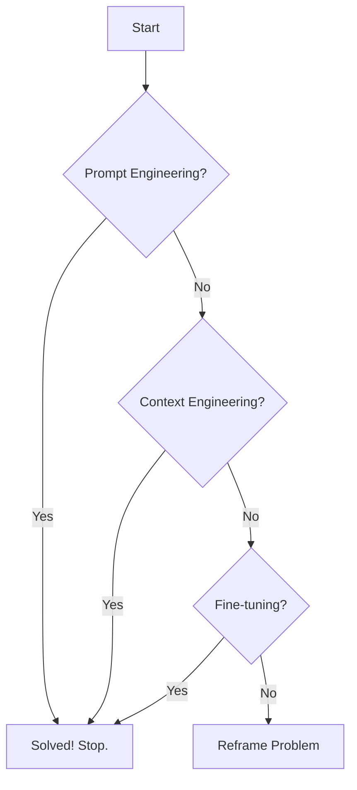
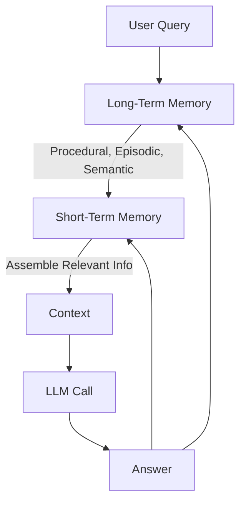

# Context Engineering: The New Frontier
### Beyond prompt engineering for LLMs

## From Prompt to Context Engineering

Let's be blunt: if you are still just "prompt engineering," you are building AI systems with outdated tools. Tweaking a single string of text to get a better response was a necessary first step, but it is no longer enough for building production-grade AI. We have seen AI applications evolve rapidly, from simple chatbots in 2022 to sophisticated Retrieval-Augmented Generation (RAG) systems in 2023, then to powerful tool-using agents in 2024, and now to complex, memory-enabled agents. Our engineering practices must evolve with this rapid pace.

The limitations of pure prompt engineering become obvious in any complex application. It optimizes for single interactions, not for sustained, multi-turn conversations. As you cram more information into the prompt—documents, chat history, tool definitions—you hit a wall. This context overload leads to what is known as context decay. The Large Language Model (LLM) gets confused, its performance drops, and it starts making things up [[2]](https://www.databricks.com/blog/long-context-rag-performance-llms).

I once built a workflow that took 30 minutes to run because I naively threw all my research, guidelines, and examples into the context. The model drowned in the noise. Even with massive, million-token context windows, the problem does not disappear. The context window is the AI's working memory, or RAM. It is finite and expensive.

Every token adds latency and cost. Simply throwing everything at the model is lazy, inefficient, and ineffective. This is where context engineering comes in. It is the necessary evolution, a discipline focused on orchestrating the entire information ecosystem to make AI applications accurate, fast, and cost-effective. It treats AI not as a magic box that responds to prompts, but as a system that requires a well-managed flow of information.

## Context Engineering: The New Frontier in LLM Optimization

Context engineering is an optimization problem. It aims to find the ideal set of information to maximize an LLM's output quality for a given task, while respecting cost and latency constraints [[3]](https://arxiv.org/pdf/2507.13334). Simply put, context engineering is the art and science of managing an AI's memory. It decides what information—from conversation history, documents, or user data—to pull into the prompt. This ensures the best result without confusing the model.

Andrej Karpathy famously compared Large Language Models to a new kind of operating system. In this analogy, the LLM acts as the CPU, and its context window serves as the RAM [[1]](https://x.com/karpathy/status/1937902205765607626). Just as an operating system carefully manages what resides in RAM, context engineering oversees what information occupies the model's limited working memory. It focuses on the logistics of information, not just clever phrasing.

This does not mean prompt engineering is dead. It is just one piece of a much larger puzzle. You still need to write clear instructions. However, those instructions now operate on a carefully curated set of data. Context engineering subsumes prompt engineering.

| Dimension | Prompt Engineering | Context Engineering |
|-----------|-------------------|---------------------|
| Scope | Single interaction optimization | Entire information ecosystem |
| Complexity | O(1) context assembly | O(n) multi-component optimization |
| State Management | Stateless function | Stateful with memory |
| Focus | How to phrase tasks | What information to provide |
Table 1: A comparison of Prompt Engineering and Context Engineering paradigms [[3]](https://arxiv.org/pdf/2507.13334).

In fact, context engineering is the new fine-tuning. Modern LLMs generalize exceptionally well, reducing the need for frequent fine-tuning. While powerful for deep domain adaptation, fine-tuning is often expensive. It requires specialized datasets and significant computational resources for retraining [[4]](https://www.glean.com/blog/retrieval-augemented-generation-vs-fine-tuning), [[5]](https://orq.ai/blog/finetuning-vs-rag).

Fine-tuning is also slow and inflexible. Any update to domain knowledge demands retraining the model. This increases maintenance overhead, especially in fast-changing environments [[4]](https://www.glean.com/blog/retrieval-augemented-generation-vs-fine-tuning), [[6]](https://fabrix.ai/blog/fine-tuning-or-retrieval-augmented-generation-when-dealing-with-multi-domain-datasets/).

For most use cases, you can achieve superior results faster and cheaper by mastering the flow of context. Context engineering, especially through RAG, offers greater flexibility. It incorporates new information in real-time without needing model retraining [[4]](https://www.glean.com/blog/retrieval-augemented-generation-vs-fine-tuning), [[7]](https://www.oracle.com/ca-en/artificial-intelligence/generative-ai/retrieval-augmented-generation-rag/rag-fine-tuning/). RAG also substantially outperforms fine-tuning for tasks involving rare or dynamic knowledge, provided you use a high-quality retriever [[8]](https://arxiv.org/html/2403.01432v3). This makes context engineering your primary tool for building robust AI applications. Your decision-making process for solving a problem should look like this:

Figure 1: A practical decision-making workflow for building AI applications.

## The Dynamic Context Window

The context you provide to an LLM is never a single, static prompt. Instead, it dynamically assembles various information types. Each type serves a distinct purpose, drawing from different forms of memory. Think of this as a carefully constructed payload, assembled on the fly for every single interaction.


Figure 2: Everything is Context Engineering! [[9]](https://github.com/humanlayer/12-factor-agents/blob/main/content/factor-03-own-your-context-window.md)

Here are the core components that make up the context:

*   **Procedural Memory:** This is the "how-to" knowledge. It includes the main **system prompt**, which defines the AI's persona and rules of engagement. It also includes **tool and output schemas** that tell the model what functions it can call and how to structure its response [[10]](https://www.ibm.com/think/topics/ai-agent-memory).
*   **Short-Term Memory:** This is the working memory of the conversation. It contains the recent **message history**, including user inputs and the agent's internal monologue (like thought-action-observation loops in ReAct) [[10]](https://www.ibm.com/think/topics/ai-agent-memory).
*   **Episodic Memory:** This is the memory of specific past events and user interactions. It stores things like **user preferences** and historical data, often in a vector or graph database. This allows the AI to build a relationship over time [[11]](https://techsee.com/blog/understanding-ai-memory-a-deep-dive-into-the-cognitive-layers-of-service-automation/).
*   **Semantic Memory:** This is the AI's general knowledge base. It includes facts retrieved from internal documents via RAG or from external sources like real-time APIs [[11]](https://techsee.com/blog/understanding-ai-memory-a-deep-dive-into-the-cognitive-layers-of-service-automation/).

These components are not static; instead, we dynamically compute them for each conversation turn. For every user query, we adapt the query itself, the conversation history grows, and user preferences from episodic memory can change. These components interconnect in a continuous cycle. Each user query triggers a process that retrieves information from long-term memory, assembles it in short-term memory, and constructs the final context before we even call the LLM. The context passed to the LLM is a subset of its overall short-term working memory; your AI might hold other information in its working memory, but we select only the most relevant parts for the prompt.

Figure 3: The cyclical flow of information in a context-engineered system.

## Challenges of Context Engineering

While context engineering is powerful, implementing it in production introduces a new set of technical hurdles. It is not as simple as just gathering data. You must manage it effectively to avoid creating new problems.

The most fundamental issue is the **context window limit**. Every AI model has a finite context window, which is the maximum amount of information it can process simultaneously. Even with recent advances reaching millions of tokens, this space fills up fast with chat history, documents, and tool definitions.

More importantly, research shows that model performance starts to degrade long before the window is full. This phenomenon is known as **context decay** or information overload [[2]](https://www.databricks.com/blog/long-context-rag-performance-llms). Models get lost in the noise, miss key instructions, and their accuracy plummets. This is also known as the "lost-in-the-middle" problem, where information presented at the beginning or end of a prompt is recalled far better than anything in between.

Another challenge is **context drift**. Over long conversations, an agent can accumulate conflicting information. For example, it might record "my cat is white" in one turn and "my cat is black" in another. This creates a confused state of truth that prevents the model from making reliable decisions [[12]](https://www.dbreunig.com/2025/06/22/how-contexts-fail-and-how-to-fix-them.html).

Finally, there is **tool confusion**. When you provide an agent with a large number of tools, especially if their descriptions are vague or overlapping, the model struggles to choose the right one. This is a common failure point in agentic systems. An LLM will either pick the wrong tool or fail to act at all because it is overwhelmed by choice [[12]](https://www.dbreunig.com/2025/06/22/how-contexts-fail-and-how-to-fix-them.html).

## Advanced Context Engineering Strategies

Solving the challenges of production context engineering requires moving beyond simple RAG. You must adopt a more sophisticated toolkit. Early AI applications were often just question-answering bots over a single database. Today's agents must juggle multiple knowledge sources and tools, and that requires deliberate strategies for optimizing the context.

A primary strategy is **advanced retrieval and selection**. Instead of naively stuffing all retrieved documents into the prompt (a pattern sometimes called "Context-Augmented Generation" or CAG), you must be selective. Use techniques like re-ranking to prioritize the most relevant chunks of information. Pass only those key facts to the LLM [[13]](https://www.pinecone.io/learn/refine-with-rerank/). This avoids overcrowding the context with low-signal data.

Next is **context compression**. As a conversation grows, the short-term memory can quickly overflow. To manage this, you can use an LLM to periodically create summaries of past interactions, condensing the history into a more compact form [[14]](https://www.datacamp.com/tutorial/prompt-compression). You can also implement deduplication to remove repetitive information or move key facts from the working memory into a long-term episodic memory store.

**Context ordering** is also critical. Models pay more attention to the beginning and end of the context. Therefore, you should place the most important information, like the system prompt and the final instruction, in these high-attention zones. For retrieved documents or chat history, use temporal or semantic relevance to order them, ensuring the most critical data is prioritized [[2]](https://www.databricks.com/blog/long-context-rag-performance-llms).

Finally, consider architectural patterns like **isolating context**. You can split a complex task across multiple specialized agents, each with its own focused context window. This prevents a single agent from becoming overloaded. Using structured data formats like XML or YAML within the prompt also helps the model clearly distinguish between different types of information, such as instructions, retrieved data, and tool outputs [[9]](https://github.com/humanlayer/12-factor-agents/blob/main/content/factor-03-own-your-context-window.md).


Figure 4: Context engineering strategies like summarization and re-ranking help prune context before it reaches the LLM [[15]](https://www.pinecone.io/learn/context-engineering/).

## Context Engineering in Practice

Let's make this concrete with a healthcare example. Imagine a user asks: `I have a headache. What can I do to stop it? I would prefer not to take any medicine.` A simple chatbot might give a generic, unhelpful answer. A context-engineered system, however, performs a series of steps before calling the LLM.

First, the system queries its episodic memory (a patient database) to retrieve the user's history, known allergies, and stated preferences. It then queries its semantic memory (a medical knowledge base) for non-pharmacological headache remedies. Using various tools, it extracts the most relevant facts from both sources. Finally, it assembles this information into a highly-structured prompt for the LLM.

Here’s a simplified Python example of what that final system prompt might look like, demonstrating how different context components are ordered and formatted for clarity.
```python
def create_system_prompt(user_query, patient_history, medical_facts, available_tools):
    # 1. System instruction and persona at the top
    system_prompt = """
You are a helpful and cautious medical assistant. Your goal is to provide safe,
non-pharmacological advice based on the user's history and verified medical knowledge.
Do not provide a diagnosis. Always advise consulting a doctor for serious issues.
"""

    # 2. Retrieved knowledge (semantic and episodic memory)
    context = f"""
<context>
  <patient_history>
    {patient_history}
  </patient_history>
  <medical_facts>
    {medical_facts}
  </medical_facts>
</context>
"""

    # 3. Available tools (procedural memory)
    tools = f"""
<tools>
  {available_tools}
</tools>
"""

    # 4. The user's query at the very end for maximum attention
    final_prompt = f"""
{system_prompt}
{context}
{tools}

Here is the user's request:
<user_query>
{user_query}
</user_query>

What is your step-by-step recommendation?
"""
    return final_prompt

```
This approach is not limited to healthcare. In finance, an agent could access Customer Relationship Management (CRM) data and real-time Application Programming Interface (API) calls to provide personalized investment advice. In project management, an agent could integrate with Slack, Jira, and calendars to automate task creation and updates. The core principle is the same: build a system that intelligently gathers and formats context. Key tools for this include orchestrators like LangChain, databases like PostgreSQL or Neo4j, memory solutions like Mem0, and observability platforms like Opik.

## Connecting Context Engineering to AI Engineering

Context engineering is not just a niche skill; it is a core competency of modern AI Engineering. It is more art than science, requiring intuition for prompt writing, information passing, and data ordering to squeeze the best performance out of a model. You cannot learn it in isolation. It is a multidisciplinary field that sits at the intersection of several domains:

1.  **AI Engineering:** Understanding LLMs, RAG, and AI agents is the foundation.
2.  **Software Engineering (SWE):** You need solid SWE skills to aggregate context components into scalable, maintainable code and design robust system architectures.
3.  **Data Engineering:** Building the data pipelines that feed your RAG and memory systems is a data engineering challenge.
4.  **Ops:** Deploying agents on the right infrastructure so they are reproducible, observable, and scalable is an Ops problem.
5.  **AI Research:** Knowing when context engineering is not enough and fine-tuning might be necessary requires a connection to research.

The best way to level up your skills is by building. Create an AI agent that integrates RAG for semantic knowledge, tools for procedural actions, and a database for user preferences. This hands-on experience is the fastest way to develop the intuition that separates a basic prompter from a true context engineer.

## References

- [1] Andrej Karpathy on X: https://x.com/karpathy/status/1937902205765607626
- [2] Long-context performance of LLMs: https://www.databricks.com/blog/long-context-rag-performance-llms
- [3] A Survey of Context Engineering for Large Language Models: https://arxiv.org/pdf/2507.13334
- [4] Retrieval-Augmented Generation vs. Fine-Tuning: https://www.glean.com/blog/retrieval-augemented-generation-vs-fine-tuning
- [5] Finetuning vs RAG: https://orq.ai/blog/finetuning-vs-rag
- [6] Fine-Tuning or Retrieval-Augmented Generation?: https://fabrix.ai/blog/fine-tuning-or-retrieval-augmented-generation-when-dealing-with-multi-domain-datasets/
- [7] Retrieval-Augmented Generation (RAG) vs. fine-tuning: https://www.oracle.com/ca-en/artificial-intelligence/generative-ai/retrieval-augmented-generation-rag/rag-fine-tuning/
- [8] RAG is more powerful than fine-tuning: https://arxiv.org/html/2403.01432v3
- [9] 12-Factor Agents - Own your context window: https://github.com/humanlayer/12-factor-agents/blob/main/content/factor-03-own-your-context-window.md
- [10] What is AI agent memory?: https://www.ibm.com/think/topics/ai-agent-memory
- [11] Understanding AI Memory: A Deep Dive Into the Cognitive Layers of Service Automation: https://techsee.com/blog/understanding-ai-memory-a-deep-dive-into-the-cognitive-layers-of-service-automation/
- [12] How Contexts Fail (And How To Fix Them): https://www.dbreunig.com/2025/06/22/how-contexts-fail-and-how-to-fix-them.html
- [13] Refine search results with Rerank: https://www.pinecone.io/learn/refine-with-rerank/
- [14] Prompt Compression: A Tutorial With Examples: https://www.datacamp.com/tutorial/prompt-compression
- [15] What is Context Engineering?: https://www.pinecone.io/learn/context-engineering/