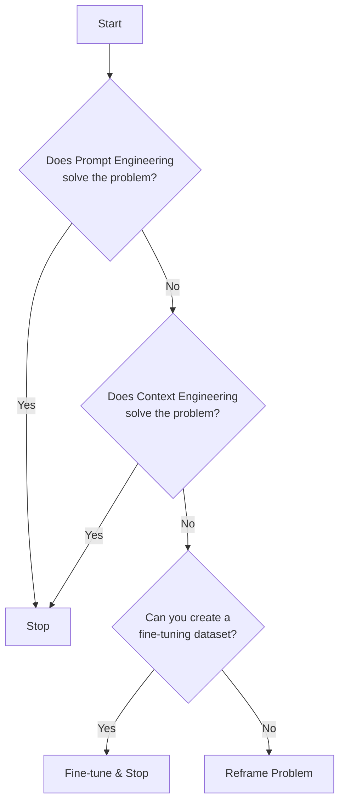
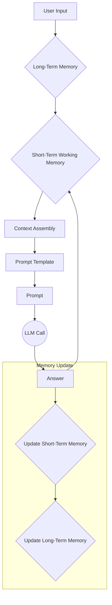
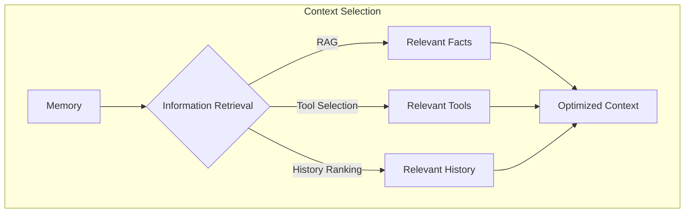
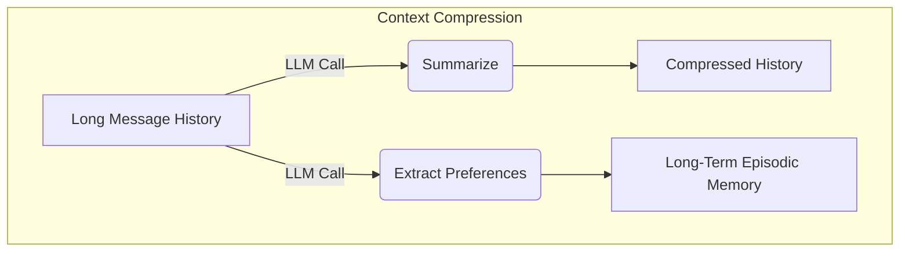

# TITLE NOT AVAILABLE
### SUBTITLE NOT AVAILABLE

## When prompt engineering breaks

AI applications have evolved rapidly over the last few years. In 2022, we had simple chatbots for question-answering. By 2023, Retrieval-Augmented Generation (RAG) systems allowed us to connect Large Language Models (LLMs) to domain-specific knowledge. 2024 brought us tool-using agents that could perform actions. Now, we are building memory-enabled agents that can remember past interactions and build relationships over time (more on memory in Lesson 9).

In our last lesson, we looked at the high-level differences between AI agents and LLM workflows and how to choose between them when designing a system. As these applications grow more complex, a practice that once served us well—prompt engineering—is starting to show its limits.

Prompt engineering is great for optimizing single LLM calls, but it falls short when you need to manage a system with memory, actions, and a long history of interactions. The sheer volume of information an agent might need—past conversations, user data, documents, and descriptions of actions it can take—has grown exponentially. Simply stuffing all this into a prompt is not a viable strategy. This is where context engineering comes in. It is the discipline of orchestrating this entire information ecosystem to ensure the LLM gets exactly what it needs, when it needs it.

## From prompt to context engineering

The core issue with relying solely on prompt engineering for modern AI systems is that it is designed for single, stateless interactions. It treats each LLM call as a new interaction. This approach breaks down in stateful applications where context must be preserved and managed across multiple turns.

As a conversation or task progresses, the context grows. Without a strategy to manage this growth, the LLM’s performance degrades. This is context decay: the model gets confused by the noise of an ever-expanding history and starts to lose track of the original instructions or key information. Even with large context windows, there is a physical limit to what you can include. Every token adds to the cost and latency of an LLM call. Simply putting everything into the context creates a slow, expensive, and unreliable system.

On a recent project, we learned this the hard way. We were working with a model that supported a two-million-token context window, so we thought, "What could go wrong?" We stuffed everything in: our research, guidelines, examples, and user history. The result was an LLM workflow that took 30 minutes to run and produced low-quality outputs.

Context engineering becomes essential here. It shifts the focus from crafting static prompts to building dynamic systems that manage information flow. As AI engineers, our job is to select only the most critical pieces of context for each LLM call. This makes our applications accurate, fast, and cost-effective.

## Understanding context engineering

Context engineering is the process of finding the best way to arrange information from your memory into the context passed to an LLM. It is an optimization problem: you need to retrieve the right parts from your short-term and long-term memory to solve a specific task without overwhelming the model. For example, when you ask a cooking agent for a recipe, you do not give it the entire cookbook. You retrieve the specific recipe, along with personal context like allergies or taste preferences.

Andrej Karpathy explains that LLMs are like a new kind of operating system where the model is the CPU and its context window is the RAM [[36]](https://addyo.substack.com/p/context-engineering-bringing-engineering). Just as an operating system manages what fits into your computer’s limited RAM, context engineering manages what information occupies the model’s limited context window.

This does not mean prompt engineering is dead. It is a subset of context engineering. You still need to write effective prompts, but you must also design a system that feeds the right context into those prompts.

| Dimension | Prompt Engineering | Context Engineering |
|-----------|-------------------|---------------------|
| Scope | Single interaction optimization | Entire information ecosystem |
| State Management | Stateless function | Stateful due to memory |
| Focus | How to phrase tasks | What information to provide |
Table 1: A comparison of prompt engineering and context engineering.

Context engineering is also the new fine-tuning. Fine-tuning has its place, but it is expensive, time-consuming, and inflexible in a world where data constantly changes [[41]](https://www.tabnine.com/blog/your-ai-doesnt-need-more-training-it-needs-context/). It should be your last resort. For most enterprise use cases, you can get better results faster and more cheaply with solid context engineering [[43]](https://www.tribe.ai/applied-ai/fine-tuning-vs-prompt-engineering).

When you start a new AI project, your decision-making process for guiding the LLM should look like this:


Figure 1: A decision-making workflow for choosing between prompt engineering, context engineering, and fine-tuning.

For instance, if you are building an agent to process internal Slack messages, you do not need to fine-tune a model on your company’s communication style. It is more effective to use a powerful reasoning model and engineer the context to retrieve specific messages and enable actions like creating tasks or drafting emails. Throughout this course, we will show you how to solve most industry problems using context engineering.

## What makes up the context

To master context engineering, you first need to understand what "context" actually is. It is more than just the user’s last message. The context is everything the LLM sees in a single turn, and it is dynamically assembled from various memory components before being passed to the model.

We will walk through the high-level workflow. It starts with a user input, which triggers the system to pull relevant information from both long-term and short-term memory. This information is assembled into the final context, inserted into a prompt template, and sent to the LLM. The LLM’s answer then updates the memory, and the cycle repeats (more on memory in Lesson 9).


Figure 2: The high-level workflow of how context is assembled and used in an AI system.

These components can be grouped into two main categories. Because we have not formally introduced these concepts yet, we will explain them intuitively for now.

**Short-term working memory** is the state of the agent for the current task or conversation. It is volatile and changes with each interaction. It includes:
*   **User input:** The most recent query or command from the user.
*   **Message history:** The log of the current conversation.
*   **Agent's internal thoughts:** The reasoning steps the agent takes to decide on its next action.
*   **Action calls and outputs:** The results from any actions the agent has performed.

**Long-term memory** is more persistent and stores information across sessions. It is divided into three types, drawing parallels from human memory [[16]](https://arxiv.org/html/2504.15965v1):
*   **Procedural memory:** This is knowledge encoded directly in the system's design, like the system prompt, the definitions of available actions, and schemas for structured outputs (more on structured outputs in Lesson 4). It is the agent's instincts or built-in skills.
*   **Episodic memory:** This is memory of specific past experiences, like user preferences or previous interactions. It helps the agent personalize its responses. This is stored in vector or graph databases.
*   **Semantic memory:** This is the agent’s general knowledge base. It can be internal, like company documents stored in a vector database, or external, accessed via the internet through API calls or web scraping (more on RAG in Lesson 10).


Figure 3: Context engineering encompasses a variety of techniques and information sources. (Media from [[2]](https://github.com/humanlayer/12-factor-agents/blob/main/content/factor-03-own-your-context-window.md))

If this seems like a lot, bear with us. We will cover all these concepts in-depth in future lessons, including structured outputs (Lesson 4), actions (Lesson 6), memory (Lesson 9), and RAG (Lesson 10).

The key takeaway is that these components are not static. They are dynamically re-computed for every single interaction. Context engineering involves knowing how to select the right pieces from this vast memory pool to construct the most effective prompt for the task at hand.

## Production implementation challenges

Now that we understand what context engineering is, let's look at the core challenges when implementing it in AI agents and LLM workflow solutions. All of these challenges revolve around a single question: "How can I keep my context as small as possible while providing enough information to the LLM?"

Here are four of the most common issues that come up when building AI applications:

1.  **The context window challenge:** Every AI model has a limited context window, which is the maximum amount of information (tokens) it can process simultaneously. This is similar to your computer's RAM. If you have only 32GB RAM on your machine, that's all you can process at a point in time. While context windows are getting larger, they are not infinite, and treating them as such leads to other problems.

2.  **Information overload:** Just because you can fit a lot of information into the context does not mean you should. Too much context reduces the performance of the LLM by confusing it. This is known as the "lost-in-the-middle" or "needle in the haystack" problem, where LLMs are well-known for mostly remembering what is at the top and bottom of the context window. Processing what's in the middle is always a lottery. Performance often drops long before the physical context limit is reached [[55]](https://www.unite.ai/why-large-language-models-forget-the-middle-uncovering-ais-hidden-blind-spot/), [[8]](https://openreview.net/forum?id=5sB6cSblDR).

3.  **Context drift:** This occurs when conflicting views of truth accumulate in the memory over time [[28]](https://viso.ai/deep-learning/concept-drift-vs-data-drift/). For example, you can have conflicting statements about the same concept such as "My cat is white" and "My cat is black." This is not quantum physics or the Schrödinger Cat experiment, but it confuses the LLM and prevents it from knowing what to pick. Without a mechanism to resolve these conflicts, the LLM becomes confused and its responses become unreliable [[31]](https://erikjlarson.substack.com/p/context-drift-and-the-illusion-of).

4.  **Tool confusion:** This problem arises in two main ways. First, if we add too many actions to an AI agent or workflow (e.g., implementing the orchestrator-worker pattern, which we will learn more about in Lesson 5), it will start confusing the LLM about what is the best action for the job. Usually this starts with 100+ actions [[38]](https://support.talkdesk.com/hc/en-us/articles/39096730105115--Preview-AI-Agent-Platform-Best-Practices). Secondly, it can appear when the actions' descriptions are poorly written or there are unclear separations between them. If the descriptions are not clearly separated or have overlaps between them, it is a recipe for disaster. In that case, even a human would not know what to pick [[49]](https://www.forrester.com/blogs/the-state-of-ai-agents-lots-of-potential-and-confusion/).

## Key strategies for context optimization

At the beginning, most AI apps were chatbots over single knowledge bases. But for most AI applications today, this is no longer the case. Modern AI solutions require access to multiple knowledge bases and actions, and manage complex histories. Context engineering is all about managing this complexity while staying within the desired performance, latency, and cost requirements.

Here are four of the most popular context engineering strategies used across the industry:

### Selecting the right context

The art of retrieving the right information from the memory as context to solve a given task. A common mistake we see people make when building AI products is providing everything into the context at once. Often, their reasoning is that if they work with models that can handle up to 2 million input tokens, the model can handle all that input. But as mentioned in the previous section, due to the "lost-in-the-middle" problem this often results in poor performance. Also, it translates to increased latency and costs.

To solve this:
*   **Use structured outputs:** Define clear schemas for what the LLM should return. This allows you to pass only the necessary, structured information to downstream steps, rather than a verbose natural language response. We will cover this in detail in Lesson 4.
*   **Use RAG:** Instead of providing entire documents, use retrieval-augmented generation to fetch only the specific chunks of text needed to answer a user's question. This is a core topic we will explore in Lesson 10.
*   **Reducing the number of available actions:** Rather than giving an agent access to every available action, use a RAG-based approach to dynamically select a small, relevant subset of actions for each task. Studies have shown that limiting the selection to under 30 actions can triple action selection accuracy [[45]](https://productschool.com/blog/artificial-intelligence/ai-agents-product-managers).
*   **Temporal Relevance:** For time-sensitive data, rank information by date and filter out anything that is no longer relevant.
*   **Repeat core instructions at both the start and the end:** Unintuitively, for the most important instructions, it is recommended to repeat yourself across the prompt, even if it translates into more tokens. This leverages the model's tendency to pay more attention to the start and end of the context, ensuring core directives are not lost [[56]](https://promptmetheus.com/resources/llm-knowledge-base/lost-in-the-middle-effect).


Figure 4: A workflow for selecting the right context from various memory sources.

### Context compression

As the message history grows in the short-term working memory, you have to carefully manage past interactions to keeping your context window in check. The trick is that you cannot just drop past conversation turns, as the LLM still needs to remember what happened. Thus, we need ways to compress key facts from the past, while shrinking the short-term memory.

We can do that through:
*   **Creating summaries of past interactions using an LLM:** This replaces a long, detailed history with a concise overview.
*   **Moving preferences about the user, from the working memory into the long-term memory, which is most often labeled as the episodic memory (more on episodic memory in Lesson 9):** This keeps the working context clean while ensuring the preference is remembered for future sessions.
*   **Deduplication to avoid repetition:** This helps remove redundant information from the context.


Figure 5: Compressing context by summarizing history and extracting preferences to long-term memory.

### Isolating context

Another powerful strategy is to isolate context by splitting information across multiple agents or LLM workflows. Instead of one agent with a massive, cluttered context window, you can have a team of agents, each with a smaller, focused context.

This is often implemented using an orchestrator-worker pattern, where a central orchestrator agent breaks down a problem and assigns sub-tasks to specialized worker agents (more on the orchestrator-worker pattern in Lesson 5) [[12]](https://www.confluent.io/blog/event-driven-multi-agent-systems/). Each worker operates in its own isolated context, improving focus and allowing for parallel processing.

```mermaid
graph TD
    A[User Request] --> B(Orchestrator Agent);
    B --> C{Worker Agent 1<br>(Context A)};
    B --> D{Worker Agent 2<br>(Context B)};
    B --> E{Worker Agent 3<br>(Context C)};
    C --> F[Results];
    D --> F;
    E --> F;
```
Figure 6: The orchestrator-worker pattern isolates context across multiple specialized agents.

### Format optimization

Finally, the way you format the context matters. Models are sensitive to structure. Using clear delimiters can improve performance.
*   **XML Tags:** Wrapping different pieces of context in XML-like tags (e.g., `<user_query>`, `<documents>`) helps the model distinguish between different types of information [[5]](https://milvus.io/ai-quick-reference/what-modifications-might-be-needed-to-the-llms-input-formatting-or-architecture-to-best-take-advantage-of-retrieved-documents-for-example-adding-special-tokens-or-segments-to-separate-context).
*   **YAML over JSON:** When providing structured data as input, YAML is often more token-efficient than JSON, which can help you save space in your context window.

💡 **A final note:** Do not let frameworks abstract away the context from you. Owning your context window—seeing exactly what is passed to the LLM at every step—is key to understanding the context engineering process at every step of the LLM app.

## Here is an example

We will connect these theories and strategies with some concrete examples. Context engineering is the backbone of many advanced AI applications that require memory and statefulness across interactions.

Some real-world use cases that often require keeping the context into memory between multiple conversation turns or user sessions include:
*   **Healthcare:** An AI assistant that accesses a patient's medical history (episodic memory), current symptoms (working memory), and the latest medical literature (semantic memory) to provide personalized diagnostic support [[52]](https://www.akira.ai/blog/context-engineering).
*   **Financial Services:** AI systems that integrate with enterprise tools like Customer Relationship Management (CRM) systems and calendars, combined with real-time market data and client portfolio information, to generate tailored financial advice [[50]](https://66degrees.com/building-a-business-case-for-ai-in-financial-services/).
*   **Project Management:** AI systems that have access to enterprise infrastructure such as Customer Relationship Management (CRM) systems, Slack, Zoom, and Calendars, and task managers to automatically understand project requirements, add and update project tasks.
*   **Content Creator Assistant:** An AI agent that has access to your research, past content, personality traits, and lesson guidelines to understand what and how to create the given piece of content.

We will walk through a specific query to see context engineering in action. A user asks their healthcare assistant: `I have a headache. What can I do to stop it? I would prefer not to take any medicine.`

Before the AI even attempts to answer, a context engineering system performs several steps:
1.  It retrieves the user's patient history, known allergies, and lifestyle habits from **episodic memory**.
2.  It queries a medical database for non-pharmacological headache remedies, retrieving relevant information from **semantic memory**.
3.  It uses various actions to assemble the key units of information from both memory types into the final context (more on actions in Lesson 6).
4.  It formats this information into a structured prompt and calls the LLM.
5.  Finally, it presents a personalized, context-aware answer to the user.

Here is a simplified Python example showing how you might structure the prompt for the LLM, using XML tags to format the different context elements. Notice the order and clarity provided by the structure. We used XML to differentiate pieces from the context.

```python
# This is a simplified example to illustrate prompt structure.
# In a real system, this would be built dynamically.

user_query = "I have a headache. What can I do to stop it? I would prefer not to take any medicine."

# Retrieved from Episodic Memory (e.g., a vector database)
patient_history = """
- Patient: John Doe, 45M
- Known Conditions: Mild hypertension
- Allergies: None
- Preferences: Avoids medication unless necessary. Prefers natural remedies.
- Habits: Reports high stress from work, drinks 3-4 cups of coffee daily.
"""

# Retrieved from Semantic Memory (e.g., RAG from a medical DB)
medical_literature = """
- Article 1: Dehydration is a common cause of tension headaches. Rehydration can alleviate symptoms within 30 minutes to three hours.
- Article 2: Applying a cold compress to the forehead and temples can constrict blood vessels and reduce inflammation, helping to relieve migraine pain.
- Article 3: Caffeine withdrawal can trigger headaches. For individuals who consume caffeine regularly, a small amount may alleviate a withdrawal headache.
- Article 4: Stress-relief techniques such as deep breathing, meditation, or a short walk can be effective for tension headaches.
"""

# The final prompt passed to the LLM
prompt = f"""
<system_prompt>
You are a helpful AI medical assistant. Your role is to provide safe, helpful, and personalized health advice based on the provided context. Do not give advice outside of the provided context. Prioritize non-medicinal options as per user preference.
</system_prompt>

<patient_history>
{patient_history}
</patient_history>

<medical_literature>
{medical_literature}
</medical_literature>

<user_query>
{user_query}
</user_query>

<instructions>
Based on all the information above, provide a step-by-step plan for the user to relieve their headache. Structure your response clearly.
</instructions>
"""

print(prompt)
```
It outputs:
```
<system_prompt>
You are a helpful AI medical assistant. Your role is to provide safe, helpful, and personalized health advice based on the provided context. Do not give advice outside of the provided context. Prioritize non-medicinal options as per user preference.
</system_prompt>

<patient_history>
- Patient: John Doe, 45M
- Known Conditions: Mild hypertension
- Allergies: None
- Preferences: Avoids medication unless necessary. Prefers natural remedies.
- Habits: Reports high stress from work, drinks 3-4 cups of coffee daily.
</patient_history>

<medical_literature>
- Article 1: Dehydration is a common cause of tension headaches. Rehydration can alleviate symptoms within 30 minutes to three hours.
- Article 2: Applying a cold compress to the forehead and temples can constrict blood vessels and reduce inflammation, helping to relieve migraine pain.
- Article 3: Caffeine withdrawal can trigger headaches. For individuals who consume caffeine regularly, a small amount may alleviate a withdrawal headache.
- Article 4: Stress-relief techniques such as deep breathing, meditation, or a short walk can be effective for tension headaches.
</medical_literature>

<user_query>
I have a headache. What can I do to stop it? I would prefer not to take any medicine.
</user_query>

<instructions>
Based on all the information above, provide a step-by-step plan for the user to relieve their headache. Structure your response clearly.
</instructions>
```

To build such a system, you would need a robust tech stack. Here’s a potential stack we recommend and will use throughout this course:
*   **LLM:** Gemini as a multimodal, reasoning, and cheap LLM API provider (more on multimodal LLMs in Lesson 11).
*   **Orchestration:** LangGraph for defining the stateful, agentic workflows.
*   **Databases:** PostgreSQL, MongoDB, Redis, Qdrant, Neo4j as databases. Often, it is recommended to keep it simple as you can get very far with only PostgreSQL or MongoDB.
*   **Observability:** Opik or LangSmith for observability, such as evaluation and monitoring (more on evaluations in future lessons).

## Connecting context engineering to AI engineering

Context engineering is more of an art than a science. It is the skill of building intuition on how to write prompts, how to pass the right information from the memory into the context, and how to order the context into the prompt for best results. It is about answering questions such as "What is the least amount of information I should pass to the LLM to get the best results out of it?" or "What does the model need or doesn't need to see?"

We cannot learn context engineering in isolation, as it is a complex but beautiful discipline that combines [[35]](https://www.llamaindex.ai/blog/context-engineering-what-it-is-and-techniques-to-consider):
1.  **AI Engineering:** LLM workflows, RAG, AI Agents. Implement evaluation pipelines (more on evaluations in future lessons).
2.  **SWE:** Aggregates all the context elements into scalable and maintainable code. Design scalable architectures. Wrap the agents as APIs.
3.  **Data Engineering:** Building data pipelines to feed data into the long-term memory.
4.  **Ops:** Deploy your agents on the right piece of infrastructure to make them reproducible, maintainable, observable, and scalable. Automate it. Write Continuous Integration/Continuous Delivery (CI/CD) pipelines.

Our goal is to teach you how to do that. In the world of AI coding assistant, we should all think in systems rather than in isolated components.

To transition from this lesson to the next, we will learn about structured outputs in Lesson 4. Next, we will learn about actions (Lesson 6), memory (Lesson 9), and RAG (Lesson 10).

## References

- [2] https://github.com/humanlayer/12-factor-agents/blob/main/content/factor-03-own-your-context-window.md
- [5] https://milvus.io/ai-quick-reference/what-modifications-might-be-needed-to-the-llms-input-formatting-or-architecture-to-best-take-advantage-of-retrieved-documents-for-example-adding-special-tokens-or-segments-to-separate-context
- [8] https://openreview.net/forum?id=5sB6cSblDR
- [12] https://www.confluent.io/blog/event-driven-multi-agent-systems/
- [16] https://arxiv.org/html/2504.15965v1
- [28] https://viso.ai/deep-learning/concept-drift-vs-data-drift/
- [31] https://erikjlarson.substack.com/p/context-drift-and-the-illusion-of
- [35] https://www.llamaindex.ai/blog/context-engineering-what-it-is-and-techniques-to-consider
- [36] https://addyo.substack.com/p/context-engineering-bringing-engineering
- [38] https://support.talkdesk.com/hc/en-us/articles/39096730105115--Preview-AI-Agent-Platform-Best-Practices
- [41] https://www.tabnine.com/blog/your-ai-doesnt-need-more-training-it-needs-context/
- [43] https://www.tribe.ai/applied-ai/fine-tuning-vs-prompt-engineering
- [45] https://productschool.com/blog/artificial-intelligence/ai-agents-product-managers
- [49] https://www.forrester.com/blogs/the-state-of-ai-agents-lots-of-potential-and-confusion/
- [50] https://66degrees.com/building-a-business-case-for-ai-in-financial-services/
- [52] https://www.akira.ai/blog/context-engineering
- [55] https://www.unite.ai/why-large-language-models-forget-the-middle-uncovering-ais-hidden-blind-spot/
- [56] https://promptmetheus.com/resources/llm-knowledge-base/lost-in-the-middle-effect