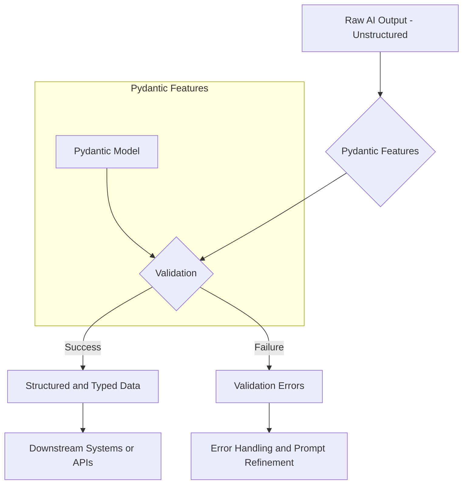

# LLM Structured Output: A Deep Dive
### From messy text to clean data

## Why Structured Outputs are Your Best Friend in Production AI

If you're building any AI application that goes beyond a simple chatbot, you'll quickly run into a fundamental problem: Large Language Models (LLMs) are probabilistic, but the software they connect to is deterministic. LLMs generate text, which can be inconsistent, malformed, or just plain wrong. Your Python code, on the other hand, expects data in a predictable, reliable format.

This is where structured outputs come in. Forcing an LLM to return data in a specific format like JSON, and then validating it with a tool like Pydantic, is the most critical skill for building a robust bridge between the AI and your application logic. It turns the model's unpredictable text into clean, reliable data that you can easily parse, manipulate, and validate.

This article is for AI Engineers who want to move beyond basic prototypes and ship production-ready applications. We'll cut through the hype and show you the engineering reality of making LLMs work reliably. We'll start from the ground up, showing you how to force JSON output with prompt engineering, then level up with Pydantic for validation, and finally, use the production-grade features of the Gemini API.

## The Engineering Case for Structured Outputs

The core challenge of integrating LLMs into software is managing their inherent unpredictability. Relying on raw text output and then trying to parse it with fragile methods like regular expressions is a recipe for disaster in a production environment. This approach frequently leads to malformed data, type mismatches, and unpredictable formatting that causes downstream failures. Even with clear prompts, LLMs can produce incomplete or malformed outputs, which might include type mismatches or extra conversational text, leading to runtime errors and system failures.

Structured outputs solve this by creating a clear contract between the LLM and your application. When you enforce a schema, you guarantee that the output will be consistent, machine-readable, and reliably type-safe. This makes it easy to programmatically manipulate the data, monitor its quality, and debug issues. Instead of dealing with a messy string, you are working with a clean Python dictionary or object, where you can access fields directly and ensure the data conforms to your expectations.

This approach is essential for a wide range of use cases. For example, in entity extraction, you can use structured outputs to pull specific pieces of information like names, dates, and locations from a block of text. This is a foundational step for advanced applications like knowledge graphs or Graph Retrieval-Augmented Generation (GraphRAG) pipelines. In these systems, parsing precision directly impacts utility and reliability. When the output follows a schema, the system can map extracted entities directly to knowledge graph nodes and edges, which avoids extensive post-processing and improves context-aware generation.

The true advantage, however, comes from using Pydantic models to define your output schema. Pydantic is a robust validation engine. If the LLM returns a string instead of an integer or misses a required field, Pydantic raises a `ValidationError`. This error provides detailed messages about the failure, including its location and a human-readable explanation. This acts as a powerful, type-safe bridge between the LLM and your Python code, preventing malformed data from ever reaching your downstream systems. This also mitigates security risks like prompt injection. By validating the data structure, you isolate malformed inputs before they can cause security vulnerabilities.

The following diagram shows the typical workflow for handling LLM outputs. Your application takes the raw, unstructured output and sends it through a validation layer. This layer uses a Pydantic model to check for correctness. If the validation succeeds, your application then uses the structured data in downstream systems. If it fails, your application catches and handles the errors, often by refining the prompt and retrying the request.

Figure 1: A workflow for validating unstructured AI output and converting it into structured data for downstream systems.

## From Scratch: Forcing LLM Outputs to JSON

Before we jump into advanced libraries and native API features, it is essential to understand the fundamentals. The simplest way to get structured data from an LLM is to force it to generate a JSON object through careful prompt engineering. This from-scratch approach gives you a deep appreciation for what libraries and APIs do for you under the hood.

The core technique is to be painfully explicit in your prompt. You need to tell the model not only to generate JSON but also to provide a clear example or schema of the exact structure you expect [[1]](https://build5nines.com/how-to-write-ai-prompts-that-output-valid-json-data/). A good practice is to wrap distinct parts of your prompt, like the document to be analyzed or the example schema, in XML tags (e.g., `<document>` and `<json>`). This helps the model clearly distinguish between instructions and content, reducing the chances of it getting confused and generating malformed output.

Let's walk through an example. Suppose we want to extract metadata from a financial report. We can construct a prompt that provides the document and a template of the desired JSON output. First, we define our document and the prompt. Notice how we provide a clear JSON structure for the model to follow.
```python
import json

DOCUMENT = """
# Q3 2023 Financial Performance Analysis

The Q3 earnings report shows a 20% increase in revenue and a 15% growth in user engagement, 
beating market expectations. These impressive results reflect our successful product strategy 
and strong market positioning.

Our core business segments demonstrated remarkable resilience, with digital services leading 
the growth at 25% year-over-year. The expansion into new markets has proven particularly 
successful, contributing to 30% of the total revenue increase.

Customer acquisition costs decreased by 10% while retention rates improved to 92%, 
marking our best performance to date. These metrics, combined with our healthy cash flow 
position, provide a strong foundation for continued growth into Q4 and beyond.
"""

prompt = f"""
Analyze the following document and extract metadata from it. 
The output must be a single, valid JSON object with the following structure:
<json>
{{ 
    "summary": "A concise summary of the article.", 
    "tags": ["list", "of", "relevant", "tags"], 
    "keywords": ["list", "of", "key", "concepts"],
    "quarter": "Q3",
    "growth_rate": "15%",
}}
</json>

Here is the document:
<document>
{DOCUMENT}
</document>
"""
```
Next, we send this prompt to the Gemini model.
```python
response = client.models.generate_content(model=MODEL_ID, contents=prompt)
```
The model often wraps its JSON output in markdown code blocks, so we need a simple helper function to clean it up before parsing.
```python
def extract_json_from_response(response: str) -> dict:
    """
    Extracts JSON from a response string that is wrapped in <json> or ```json tags.
    """
    response = response.replace("<json>", "").replace("</json>", "")
    response = response.replace("```json", "").replace("```", "")
    return json.loads(response)

parsed_repsonse = extract_json_from_response(response.text)
print(f"Type of the parsed response: `{type(parsed_repsonse)}`")
```
The output is now a standard Python dictionary, which you can easily work with in your code.
```json
{
    "summary": "The Q3 2023 earnings report showcases strong financial performance, exceeding market expectations with a 20% revenue increase and 15% growth in user engagement. This success is attributed to effective product strategy, strong market positioning, and successful expansion into new markets, particularly in digital services. The company also improved customer acquisition costs by 10% and achieved a 92% retention rate, indicating a solid foundation for future growth.",
    "tags": [
        "Financial Performance",
        "Q3 2023",
        "Earnings Report",
        "Business Growth",
        "Market Expansion",
        "User Engagement",
        "Customer Retention"
    ],
    "keywords": [
        "revenue increase",
        "user engagement growth",
        "product strategy",
        "market positioning",
        "digital services",
        "new markets",
        "customer acquisition costs",
        "retention rates",
        "cash flow",
        "Q3 2023"
    ],
    "quarter": "Q3",
    "growth_rate": "15%"
}
```
💡 **A note on token efficiency:** While JSON is universally supported, it can be verbose. For applications where cost and latency are critical, consider a more concise format like YAML. Studies have shown that YAML can reduce token usage by up to 50% compared to JSON, as it avoids repetitive characters like curly braces and commas [[2]](https://wiserli.com/blogs/optimizing-generation-process-with-large-language-models-for-specific-formats/), [[3]](https://betterprogramming.pub/yaml-vs-json-which-is-more-efficient-for-language-models-5bc11dd0f6df). You can ask the model for YAML and then convert it to JSON in your code.

## The Pydantic Advantage: Adding a Validation Layer

While prompting for JSON is a good start, it’s still brittle. You are simply hoping the LLM returns a string that can be parsed. A more robust approach is to use Pydantic to define your data structures as Python classes. Pydantic is the industry standard for data validation in Python, going beyond simple `TypedDict` or `dataclasses` by enforcing runtime type checking [[4]](https://docs.pydantic.dev/1.10/usage/models/). This gives you a single source of truth for your schema and, most importantly, provides powerful, out-of-the-box validation.

Pydantic is more than a type checker; it's a data guardian. If an LLM returns a string instead of an integer or misses a required field, Pydantic raises a `ValidationError` with a clear explanation of what went wrong and where. This prevents bad data from propagating through your application. This validation also acts as a security layer, mitigating risks like prompt injection by ensuring only well-formed data enters your system [[5]](https://betterstack.com/community/guides/scaling-python/pydantic-explained/).

We can improve our previous example by replacing the raw JSON template with a Pydantic model. We can then generate a JSON schema directly from this model and inject it into the prompt. This is a more formal and reliable way to communicate the desired output structure to the LLM. In fact, major APIs like Gemini and OpenAI use this technique internally to power their structured output features [[6]](https://ai.google.dev/gemini-api/docs/structured-output).

First, let's define our `DocumentMetadata` class using Pydantic. Notice how we can add descriptions to each field, which provides additional context to the LLM.
```python
from pydantic import BaseModel, Field

class DocumentMetadata(BaseModel):
    """A class to hold structured metadata for a document."""
    summary: str = Field(description="A concise, 1-2 sentence summary of the document.")
    tags: list[str] = Field(description="A list of 3-5 high-level tags relevant to the document.")
    keywords: list[str] = Field(description="A list of specific keywords or concepts mentioned.")
    quarter: str = Field(description="The quarter of the financial year described in the document (e.g, Q3 2023).")
    growth_rate: str = Field(description="The growth rate of the company described in the document (e.g, 10%).")
```
Next, we generate the JSON schema from our model and insert it into the prompt.
```python
schema = DocumentMetadata.model_json_schema()

prompt = f"""
Please analyze the following document and extract metadata from it. 
The output must be a single, valid JSON object that conforms to the following JSON Schema:
<json>
{json.dumps(schema, indent=2)}
</json>

Here is the document:
<document>
{DOCUMENT}
</document>
"""

response = client.models.generate_content(model=MODEL_ID, contents=prompt)
parsed_repsonse = extract_json_from_response(response.text)
```
The real magic happens now. We can validate the parsed dictionary against our Pydantic model. If the output is valid, we get a `DocumentMetadata` object. If not, Pydantic raises an error.
```python
try:
    document_metadata = DocumentMetadata.model_validate(parsed_repsonse)
    print("\nValidation successful!")
    print(f"Type of the validated response: `{type(document_metadata)}`")
    print(document_metadata.model_dump_json(indent=2))
except Exception as e:
    print(f"\nValidation failed: {e}")
```
It outputs:
```
Validation successful!
Type of the validated response: `<class '__main__.DocumentMetadata'>`
{
  "summary": "The Q3 2023 earnings report indicates strong financial performance with a 20% revenue increase and 15% growth in user engagement, surpassing market expectations. This success is attributed to robust digital services growth, successful market expansion, reduced customer acquisition costs, and improved retention rates.",
  "tags": [
    "Financial Performance",
    "Earnings Report",
    "Business Growth",
    "Revenue Analysis",
    "Market Expansion"
  ],
  "keywords": [
    "Q3 2023",
    "revenue increase",
    "user engagement",
    "market expectations",
    "product strategy",
    "market positioning",
    "digital services",
    "new markets",
    "customer acquisition costs",
    "retention rates",
    "cash flow"
  ],
  "quarter": "Q3 2023",
  "growth_rate": "20%"
}
```
This creates a perfect, type-safe bridge between the probabilistic world of the LLM and the deterministic world of your Python code, making Pydantic objects the de facto standard for modeling domain objects in AI applications [[7]](https://www.arecadata.com/pydanticai-for-building-agentic-ai-based-llm-applications/), [[8]](https://xebia.com/blog/enforce-and-validate-llm-output-with-pydantic/).

## Production-Grade Structured Outputs with the Gemini API

So far, we have implemented structured outputs from scratch to understand the underlying mechanics. While this foundational knowledge is invaluable, for production systems, it is almost always better to leverage the native features of your LLM provider's API. Implementing structured outputs yourself demands intricate prompt engineering and often requires manual validation. In contrast, native API support is typically more accurate, reliable, and token-efficient. This approach ensures type-safety, simplifies prompting, and can lead to more explicit refusals from the model when a request cannot be fulfilled according to the schema [[9]](https://www.tamingllms.com/notebooks/structured_output.html).

The Gemini API, for instance, offers a streamlined way to enforce structured output by directly accepting a Pydantic model in its generation configuration. This means you do not need to manually craft a JSON schema or embed it within your prompt. The Gemini client library handles this conversion automatically, forcing the model to return a valid JSON object that strictly conforms to your defined Pydantic schema [[6]](https://ai.google.dev/gemini-api/docs/structured-output). This out-of-the-box integration simplifies your code and reduces the potential for errors.

This native integration is the most direct and robust method for achieving structured outputs in real-world applications. Let's refactor our previous example to demonstrate how simple it is to use Gemini's native capabilities. First, we define our Pydantic model, exactly as we did before.
```python
class DocumentMetadata(BaseModel):
    """A class to hold structured metadata for a document."""
    summary: str = Field(description="A concise, 1-2 sentence summary of the document.")
    tags: list[str] = Field(description="A list of 3-5 high-level tags relevant to the document.")
    keywords: list[str] = Field(description="A list of specific keywords or concepts mentioned.")
    quarter: str = Field(description="The quarter of the financial year described in the document (e.g, Q3 2023).")
    growth_rate: str = Field(description="The growth rate of the company described in the document (e.g, 10%).")
```
Next, we create a `GenerateContentConfig` object. We set the `response_mime_type` to `"application/json"` and pass our `DocumentMetadata` class directly to the `response_schema` parameter. This tells the Gemini API to enforce the Pydantic schema for the output.
```python
from google.genai import types

config = types.GenerateContentConfig(
    response_mime_type="application/json",
    response_schema=DocumentMetadata
)

prompt = f"""
Analyze the following document and extract its metadata.

Document:
---
{DOCUMENT}
---
"""
```
Finally, we call the model with this configuration. The response object will contain a `.parsed` attribute that is already a validated `DocumentMetadata` instance. This eliminates the need for any manual parsing or validation steps on your end.
```python
response = client.models.generate_content(
    model=MODEL_ID,
    contents=prompt,
    config=config
)

print(f"Type of the response: `{type(response.parsed)}`")
print(response.parsed.model_dump_json(indent=2))
```
It outputs:
```
Type of the response: `<class '__main__.DocumentMetadata'>`
{
  "summary": "The Q3 2023 earnings report reveals a 20% increase in revenue and 15% growth in user engagement, surpassing market expectations due to successful product strategy and market expansion. The company demonstrated strong performance with improved customer acquisition costs and retention rates.",
  "tags": [
    "Financial Performance",
    "Earnings Report",
    "Business Growth",
    "Market Expansion",
    "Customer Metrics"
  ],
  "keywords": [
    "Q3 2023",
    "revenue increase",
    "user engagement",
    "product strategy",
    "market positioning",
    "digital services",
    "new markets",
    "customer acquisition costs",
    "retention rates"
  ],
  "quarter": "Q3 2023",
  "growth_rate": "20%"
}
```

## Conclusion

Building reliable AI applications requires bridging the gap between the probabilistic nature of LLMs and the deterministic world of traditional software. Structured outputs are the fundamental tool for creating this bridge. By forcing an LLM to generate data in a predictable format, you transform its output from messy, unreliable text into clean, machine-readable data that your application can depend on.

In this article, we walked you through the entire process, from the ground up. We started by implementing structured outputs from scratch using JSON and prompt engineering to build a solid foundational understanding. We then leveled up by introducing Pydantic, the industry-standard tool for adding a crucial validation layer that ensures data quality and type safety. Finally, we showed you the production-grade approach: using the native structured output capabilities of the Gemini API, which offers the most accurate and efficient solution.

While building from scratch is an invaluable learning experience, leveraging native API support is almost always the right choice for real-world systems. Understanding these techniques is not just a "nice-to-have"—it is a core competency for any AI Engineer serious about shipping robust, production-ready AI applications.

## References

- [1] [How to Write AI Prompts That Output Valid JSON Data](https://build5nines.com/how-to-write-ai-prompts-that-output-valid-json-data/)
- [2] [Optimizing the Generation Process with Large Language Models for Specific Formats](https://wiserli.com/blogs/optimizing-generation-process-with-large-language-models-for-specific-formats/)
- [3] [YAML vs. JSON: Which Is More Efficient for Language Models?](https://betterprogramming.pub/yaml-vs-json-which-is-more-efficient-for-language-models-5bc11dd0f6df)
- [4] [Models - Pydantic](https://docs.pydantic.dev/1.10/usage/models/)
- [5] [Pydantic Explained](https://betterstack.com/community/guides/scaling-python/pydantic-explained/)
- [6] [Structured output](https://ai.google.dev/gemini-api/docs/structured-output)
- [7] [PydanticAI for Building Agentic AI-Based LLM Applications](https://www.arecadata.com/pydanticai-for-building-agentic-ai-based-llm-applications/)
- [8] [Enforce and validate LLM output with Pydantic](https://xebia.com/blog/enforce-and-validate-llm-output-with-pydantic/)
- [9] [Structured Output](https://www.tamingllms.com/notebooks/structured_output.html)