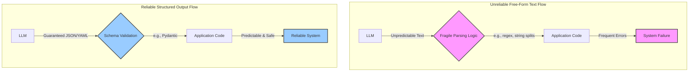

# LLM Structured Outputs: A Guide
### From chaotic text to predictable data

## Beyond Text: Engineering Reliable LLM Outputs

Building AI applications that actually work in the real world is tough. Large Language Models (LLMs) are powerful, but their free-form text outputs are inherently probabilistic and unpredictable. This clashes directly with the deterministic world of traditional software. How do you bridge this critical gap between the LLM (Software 3.0) and Python (Software 1.0) worlds?

The answer lies in structured outputs. By forcing an LLM to return data in a specific, predefined format like JSON or YAML, you create a reliable contract. This technique is essential for parsing, validating data, and manipulating it programmatically, transforming chaotic text into predictable data structures.

For any AI Engineer, mastering structured outputs is a fundamental skill. It moves you beyond basic prompts to building robust, production-ready systems that you can trust. This article will show you exactly how to achieve that, from implementing structured outputs from scratch to leveraging industry-standard API features.

## Why Structured Outputs are Critical for Production AI Systems

When building AI applications, especially those that integrate with other software components, the free-form text generated by a Large Language Model can be a significant liability. The probabilistic nature of these models means their output can be unpredictable, making it difficult to build reliable downstream systems. This is where structured outputs come in. By compelling the LLM to format its response according to a predefined schema, like JSON or YAML, we create a reliable contract between the AI and our application code.

This structured approach acts as a robust bridge between the unstructured, often messy world of natural language and the deterministic, rule-based world of Python. Instead of relying on fragile string matching or complex regular expressions that often break with slight variations in LLM output, you can directly parse the LLM's response into familiar Python data structures like dictionaries or custom objects. This makes the data incredibly easy to manipulate programmatically, allowing you to access specific fields with dot notation, apply transformations, and integrate seamlessly with other parts of your application. Furthermore, structured outputs simplify monitoring for data quality and debugging when issues arise, as you have a predictable format to inspect.

In production environments, this reliability is not a luxury; it is a necessity. Failures caused by malformed free-form text can lead to system crashes, inaccurate data propagation, and a poor user experience. For instance, research shows that even minor issues like typos can cause severe performance degradation in LLMs, and analyzing unstructured failure reports is labor-intensive and error-prone. Structured formats directly mitigate these risks by ensuring consistency and enabling automated validation, which can catch errors early and prevent them from cascading through your system [2](https://arxiv.org/html/2404.09754v1), [3](https://arxiv.org/html/2406.08221v2), [4](https://pmc.ncbi.nlm.nih.gov/articles/PMC10884375/), [5](https://arxiv.org/html/2503.14996v1).

One of the most powerful use cases for structured outputs is entity extraction. Imagine you need to pull names, dates, organizations, or keywords from a block of text. Forcing the LLM to return these entities in a structured format is the first step in many advanced systems, such as building a knowledge graph for a Graph Retrieval-Augmented Generation (GraphRAG) application. In a GraphRAG system, a knowledge graph stores information as interconnected entities and relationships. The extracted entities become the nodes and relationships in this graph, enabling more sophisticated and context-aware retrieval by traversing the graph rather than just relying on keyword matching [6](https://arxiv.org/html/2412.15256v1), [7](https://www.ernestchiang.com/en/notes/general/knowledge-graph/), [8](https://neo4j.com/blog/developer/knowledge-graph-extraction-challenges/).

Furthermore, structured outputs provide robust data and type validation, especially when paired with libraries like Pydantic. While Python's built-in `TypedDict` or `dataclasses` offer type hints, they do not enforce type validation at runtime. Pydantic, on the other hand, automatically validates and coerces types during object creation, making it the de facto method for modeling domain objects in Python [9](https://www.speakeasy.com/blog/pydantic-vs-dataclasses), [10](https://codetain.com/blog/validators-approach-in-python-pydantic-vs-dataclasses/). This ensures that the data you receive from the LLM is not only in the right format but also of the correct type (e.g., an integer is an integer, not a string). This out-of-the-box validation guards against common LLM errors and hallucinations, preventing bad data from propagating through your system [11](https://www.evidentlyai.com/blog/llm-hallucination-examples).

For many data extraction tasks, using structured outputs is a simpler and more direct alternative to the more complex function calling APIs, which are better suited for triggering actions rather than just formatting data [12](https://ai.google.dev/gemini-api/docs/function-calling).

To visualize this, consider the flow of information in a typical AI application.

Figure 1: Comparison of unreliable free-form text flow and reliable structured output flow.

Ultimately, mastering structured outputs is a fundamental skill for moving from AI prototypes to production-ready systems that are robust, maintainable, and predictable.

## From Scratch: Forcing LLM Outputs to JSON

To build a solid foundation for understanding structured outputs, we start by implementing them from the ground up. This hands-on approach helps you grasp what happens behind the scenes when you compel an LLM to generate data in a specific format. By forcing the LLM to adhere to a predefined structure, you gain control over its output, making it predictable and machine-readable. The most straightforward method involves using prompt engineering to instruct an LLM to generate its output in a specific format, such as JSON. This technique does not rely on any special API features; instead, it depends entirely on providing clear, explicit instructions and concrete examples directly within the prompt.

The core idea is to tell the model precisely what you expect. In your prompt, you define the desired JSON structure, detailing the keys, the expected data types for each value, and any required fields [13](https://blog.promptlayer.com/how-json-schema-works-for-structured-outputs-and-tool-integration/). To further guide the model and ensure reliable output, it is a best practice to provide a concrete example of the desired JSON or YAML string within the system prompt and explicitly instruct the model to mimic this structure [14](https://www.tribe.ai/applied-ai/a-gentle-introduction-to-structured-generation-with-anthropic-api), [15](https://www.leeboonstra.dev/prompt-engineering/prompt_engineering_guide6/). For instance, you can wrap distinct parts of your prompt, like the context document or the example schema, in unique XML tags (e.g., `<document>` and `</document>`). This technique is powerful because it creates clear boundaries for the model, helping it to differentiate between instructions and the content it needs to process, thereby making the extraction of structured data more reliable [16](https://docs.squiz.net/funnelback/docs/latest/build/data-sources/web/delimited-text-xml-and-json-data-sources.html), [17](https://learn.microsoft.com/en-us/dotnet/framework/wcf/feature-details/mapping-between-json-and-xml). While effective, relying solely on prompt engineering can sometimes be fragile, as the model's probabilistic nature means it might occasionally deviate from the exact format, requiring robust error handling in your application.

Let's walk through an example. Imagine we want to extract metadata from a financial document. We can craft a prompt that provides the document and specifies the exact JSON object we want back.

First, we define the document we want to analyze and construct the prompt.
```python
DOCUMENT = """
# Q3 2023 Financial Performance Analysis

The Q3 earnings report shows a 20% increase in revenue and a 15% growth in user engagement, 
beating market expectations. These impressive results reflect our successful product strategy 
and strong market positioning.

Our core business segments demonstrated remarkable resilience, with digital services leading 
the growth at 25% year-over-year. The expansion into new markets has proven particularly 
successful, contributing to 30% of the total revenue increase.

Customer acquisition costs decreased by 10% while retention rates improved to 92%, 
marking our best performance to date. These metrics, combined with our healthy cash flow 
position, provide a strong foundation for continued growth into Q4 and beyond.
"""

prompt = f"""
Analyze the following document and extract metadata from it. 
The output must be a single, valid JSON object with the following structure:
<json>
{{ 
    "summary": "A concise summary of the article.", 
    "tags": ["list", "of", "relevant", "tags"], 
    "keywords": ["list", "of", "key", "concepts"],
    "quarter": "Q3",
    "growth_rate": "15%",
}}
</json>

Here is the document:
<document>
{DOCUMENT}
</document>
"""
```

Next, we send this prompt to the model. The LLM will often wrap its JSON response in markdown code blocks, so we'll need a simple helper function to clean up the string before parsing it.
```python
response = client.models.generate_content(model=MODEL_ID, contents=prompt)

def extract_json_from_response(response: str) -> dict:
    """
    Extracts JSON from a response string that is wrapped in <json> or ```json tags.
    """

    response = response.replace("<json>", "").replace("</json>", "")
    response = response.replace("```json", "").replace("```", "")

    return json.loads(response)

parsed_repsonse = extract_json_from_response(response.text)
print(type(parsed_repsonse))
```

The output will be:
```
<class 'dict'>
```

Once the LLM generates the JSON string, we parse it into a standard Python dictionary. This transformation is crucial because it converts the LLM's raw text output into a familiar, deterministic Python data structure. With a dictionary, you can easily access specific fields using key-value pairs, apply programmatic manipulations, and integrate the data seamlessly into other parts of your application. While this prompt-based method works, JSON can be verbose due to its explicit syntax, including curly brackets, quotes, and commas. For applications where token count and latency are critical, using a more concise format like YAML or even XML can be significantly more efficient.

💡 **A Note on Efficiency:** Research shows that YAML can reduce token costs by nearly 50% compared to JSON for the same data. This is because YAML's reliance on indentation and whitespace is more token-efficient for LLMs than JSON's explicit delimiters. For high-volume applications, this can translate into substantial cost and time savings. Requesting YAML and converting it to a Python dictionary (or even JSON) on your end can often be a more reliable and cost-effective strategy than requesting JSON directly from the LLM [1](https://betterprogramming.pub/yaml-vs-json-which-is-more-efficient-for-language-models-5bc11dd0f6df).


Figure 2: Comparison of JSON and YAML token and character counts for a simple list of months.


Figure 3: Benchmarking results showing runtime and token differences between JSON and YAML for various completion sizes.


Figure 4: Visual comparison of JSON and YAML performance metrics, including runtime and completion tokens.

## The Pydantic Bridge: Adding Validation and Type Safety

While prompting for JSON gets us a Python dictionary, this approach is still fragile. There is no guarantee that the LLM will include all the required fields or that the data types will be correct. A more robust solution is to use Pydantic, a library that has become the industry standard for data validation in Python.

Pydantic allows you to define your data structures as Python classes. This creates a single source of truth for your expected output. Unlike standard Python `dataclasses` or `TypedDict`, which only provide type hints without runtime enforcement, Pydantic models validate data and coerce types automatically when an object is created [9](https://www.speakeasy.com/blog/pydantic-vs-dataclasses), [10](https://codetain.com/blog/validators-approach-in-python-pydantic-vs-dataclasses/). This means you get out-of-the-box data and type validation. This is exactly what we need to build a reliable bridge between the probabilistic LLM and our deterministic Python code.

Let's refactor our previous example using a Pydantic model. We will define a `DocumentMetadata` class that mirrors our desired JSON structure. Notice how we can add descriptions to each field, which will help guide the LLM.
```python
from pydantic import BaseModel, Field

class DocumentMetadata(BaseModel):
    """A class to hold structured metadata for a document."""

    summary: str = Field(description="A concise, 1-2 sentence summary of the document.")
    tags: list[str] = Field(description="A list of 3-5 high-level tags relevant to the document.")
    keywords: list[str] = Field(description="A list of specific keywords or concepts mentioned.")
    quarter: str = Field(description="The quarter of the financial year described in the document (e.g, Q3 2023).")
    growth_rate: str = Field(description="The growth rate of the company described in the document (e.g, 10%).")
```

The real power comes from Pydantic's ability to auto-generate a JSON Schema from this model. We can inject this schema directly into our prompt, providing the LLM with a formal, machine-readable definition of the expected output. This is the same underlying technique used by major APIs like OpenAI and Gemini to power their structured output features [18](https://docs.pydantic.dev/latest/api/json_schema/), [19](https://docs.pydantic.dev/1.10/usage/schema/).
```python
# Generate the JSON schema from the Pydantic model
schema = DocumentMetadata.model_json_schema()

# Create a new prompt with the schema
prompt = f"""
Please analyze the following document and extract metadata from it. 
The output must be a single, valid JSON object that conforms to the following JSON Schema:
<json>
{json.dumps(schema, indent=2)}
</json>

Here is the document:
<document>
{DOCUMENT}
</document>
"""

response = client.models.generate_content(model=MODEL_ID, contents=prompt)
parsed_repsonse = extract_json_from_response(response.text)
```

The result is still a dictionary, but now we can validate it against our `DocumentMetadata` model with a single line of code.
```python
try:
    document_metadata = DocumentMetadata.model_validate(parsed_repsonse)
    print("\nValidation successful!")
    print(f"Type of the validated response: {type(document_metadata)}")
except Exception as e:
    print(f"\nValidation failed: {e}")
```

The output will be:
```
Validation successful!
Type of the validated response: <class '__main__.DocumentMetadata'>
```

If the LLM's output is missing a required field or has an incorrect data type, Pydantic will raise a validation error, allowing you to handle the issue gracefully. This makes Pydantic the de facto method for modeling domain objects and creating a robust connection between the LLM and the Python world.

## Industry Standard: Using Gemini for Native Structured Outputs

So far, we have implemented structured outputs from scratch using prompt engineering. While this is a great way to understand the underlying mechanics, modern LLM APIs offer native support for this functionality, which is almost always the better choice for production systems.

When you use a native feature like Google Gemini's `response_schema`, you leverage a capability fine-tuned for accuracy and efficiency. Gemini constrains the model at a deeper level, producing valid, schema-adherent JSON. This significantly reduces the chances of formatting errors, hallucinations, or missing fields compared to manual prompting [20](https://developers.googleblog.com/en/mastering-controlled-generation-with-gemini-15-schema-adherence/), [21](https://dylancastillo.co/posts/function-calling-structured-outputs.html). This native enforcement is more reliable and often more cost-effective, as it minimizes the need for error-handling logic and retries on your end. You also gain benefits like guaranteed type safety and less post-processing, as the output directly matches your defined schema [22](https://googleapis.github.io/python-genai/), [23](https://ai.google.dev/gemini-api/docs/structured-output).

Let's see how to achieve the same result as before, but this time using the Gemini API and our Pydantic model directly. The process is remarkably simple. We just need to configure the generation request to specify the desired MIME type and provide our `DocumentMetadata` class as the response schema. The Gemini Python SDK handles the conversion of the Pydantic model to a JSON schema and configures the API call for you.
```python
from google.genai import types

# Use the same Pydantic model as before
class DocumentMetadata(BaseModel):
    # ... (definition is the same as the previous section)

# Configure the Gemini client to use our Pydantic model as the response schema
config = types.GenerateContentConfig(response_mime_type="application/json", response_schema=DocumentMetadata)

prompt = f"""
Analyze the following document and extract its metadata.

Document:
--- 
{DOCUMENT}
--- 
"""

response = client.models.generate_content(model=MODEL_ID, contents=prompt, config=config)
```

The magic happens in the response. The Gemini API does not just return a string; it returns a parsed object that is already an instance of our `DocumentMetadata` Pydantic class.
```python
# The response is already a validated Pydantic object
document_metadata = response.parsed

print(f"Type of the response: {type(document_metadata)}")
```

The output is:
```
Type of the response: <class '__main__.DocumentMetadata'>
```

You avoid manual JSON parsing or validation. This process is cleaner, more reliable, and less error-prone. When you work with an API that offers native structured output capabilities, leveraging them becomes the industry-standard approach for building dependable, production-grade applications. It ensures your AI systems are robust, maintainable, and predictable, moving beyond fragile prototypes.

## Conclusion

In this article, we've explored the critical role of structured outputs in building reliable AI systems. We've seen that forcing an LLM to generate data in a specific format like JSON or YAML is the essential bridge between the unstructured, probabilistic world of language models and the structured, deterministic world of our Python applications.

We began by implementing structured outputs from scratch, using prompt engineering to coax a model into generating JSON. We then elevated this approach by introducing Pydantic, which provides a robust framework for defining data schemas and validating LLM outputs for both structure and type correctness.

Finally, we transitioned to the industry-standard method: leveraging the native structured output capabilities of modern APIs like Google Gemini. This final step showed how to get validated Pydantic objects directly from the API, eliminating manual parsing and improving reliability.

Mastering these techniques isn't just theory; it's a fundamental skill for any AI Engineer serious about shipping production-grade AI. Whether you're extracting entities, formatting data for downstream tasks, or ensuring data quality, a solid grasp of structured outputs moves you beyond prototypes to robust systems you can truly trust.

## References

- [1] [YAML vs. JSON: Which Is More Efficient for Language Models?](https://betterprogramming.pub/yaml-vs-json-which-is-more-efficient-for-language-models-5bc11dd0f6df)
- [2] [On the Resilience of Large Language Models](https://arxiv.org/html/2404.09754v1)
- [3] [FAIL: An Automated Pipeline for Fine-grained Analysis of Public Software Failure Reports](https://arxiv.org/html/2406.08221v2)
- [4] [Large language models to automate network meta-analyses: a case study in psoriasis](https://pmc.ncbi.nlm.nih.gov/articles/PMC10884375/)
- [5] [On the Inconsistencies of In-Context Learning for Reasoning: A Comprehensive Benchmark and a New Method](https://arxiv.org/html/2503.14996v1)
- [6] [Structured entity extraction as a precursor to building a patient knowledge graph](https://arxiv.org/html/2412.15256v1)
- [7] [Knowledge Graph Construction Pipeline](https://www.ernestchiang.com/en/notes/general/knowledge-graph/)
- [8] [LLM Knowledge Graph Extraction Challenges](https://neo4j.com/blog/developer/knowledge-graph-extraction-challenges/)
- [9] [Pydantic vs. Dataclasses](https://www.speakeasy.com/blog/pydantic-vs-dataclasses)
- [10] [Validators approach in Python — Pydantic vs. Dataclasses](https://codetain.com/blog/validators-approach-in-python-pydantic-vs-dataclasses/)
- [11] [LLM Hallucinations: 8+ Real-World Examples and How to Prevent Them](https://www.evidentlyai.com/blog/llm-hallucination-examples)
- [12] [Function calling](https://ai.google.dev/gemini-api/docs/function-calling)
- [13] [How JSON Schema works for structured outputs and tool integration](https://blog.promptlayer.com/how-json-schema-works-for-structured-outputs-and-tool-integration/)
- [14] [A Gentle Introduction to Structured Generation with Anthropic API](https://www.tribe.ai/applied-ai/a-gentle-introduction-to-structured-generation-with-anthropic-api)
- [15] [Prompt Engineering Guide](https://www.leeboonstra.dev/prompt-engineering/prompt_engineering_guide6/)
- [16] [Delimited text, XML and JSON data sources](https://docs.squiz.net/funnelback/docs/latest/build/data-sources/web/delimited-text-xml-and-json-data-sources.html)
- [17] [Mapping Between JSON and XML](https://learn.microsoft.com/en-us/dotnet/framework/wcf/feature-details/mapping-between-json-and-xml)
- [18] [pydantic.json_schema](https://docs.pydantic.dev/latest/api/json_schema/)
- [19] [JSON Schema](https://docs.pydantic.dev/1.10/usage/schema/)
- [20] [Mastering Controlled Generation with Gemini 1.5: Schema Adherence](https://developers.googleblog.com/en/mastering-controlled-generation-with-gemini-15-schema-adherence/)
- [21] [Function Calling vs. Structured Outputs with LLMs](https://dylancastillo.co/posts/function-calling-structured-outputs.html)
- [22] [Google AI Python SDK](https://googleapis.github.io/python-genai/)
- [23] [Structured output](https://ai.google.dev/gemini-api/docs/structured-output)