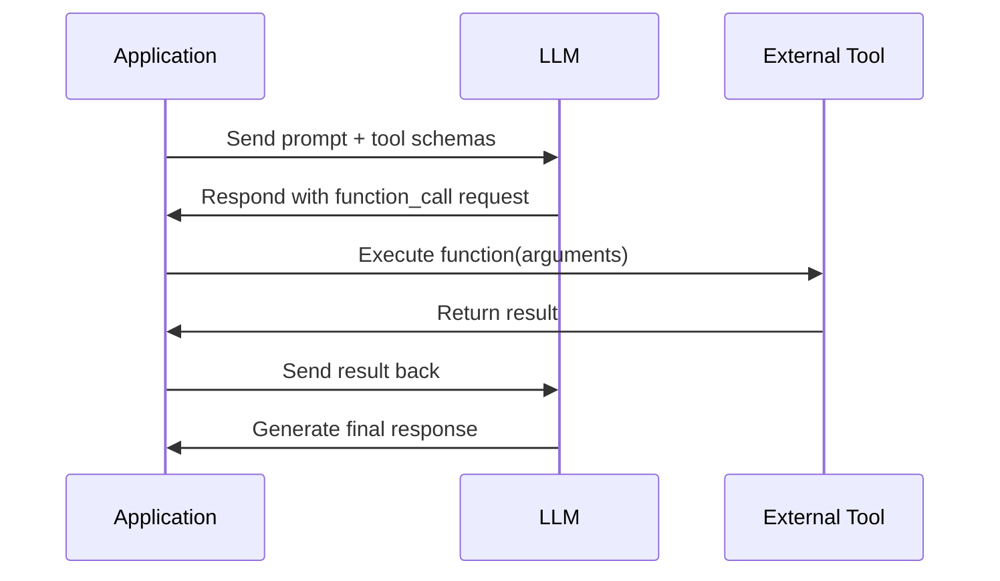
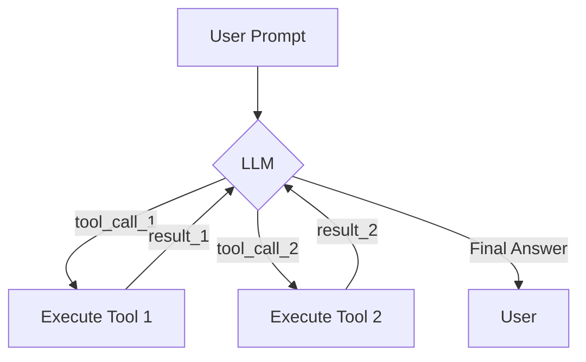

# LLMs: The Brains, Tools: The Hands
### LLMs are useless without tools. Here's why.

## Introduction: LLMs are Cool, But They Can't Do Anything

This article will cut through the hype surrounding AI agents and focus on a core engineering truth: their power comes from their ability to interact with the world through tools. We will explore why Large Language Models (LLMs), in their raw form, are limited. Tools provide them with the 'hands and senses' to become capable agents.

You will learn the fundamental mechanics of tool use, starting from a from-scratch implementation to understand the entire process. We will then progress to using production-grade APIs like Gemini. By the end, you will have a practical, no-nonsense understanding of how to empower LLMs to take meaningful actions, a critical skill for any AI Engineer.

## Why Agents Need Tools: From Text Generators to World Interactors

Large Language Models are powerful text generators, trained on vast but static datasets. This core design leads to a fundamental limitation: they are disconnected from the real world. An LLM's knowledge is frozen at the time of its last training run, preventing it from accessing real-time information, checking the latest news, or interacting with your specific data.

Their architecture is optimized for processing and generating text within a closed system, not for dynamic interaction with external environments. This means a raw LLM cannot execute code for precise calculations, use external APIs to book a meeting, or maintain long-term memory beyond its context window. In essence, a raw LLM is a brain in a jar, capable of reasoning but unable to perceive or act on its own [1], [2], [3], [4].

This is where tools come in. Tools are external functions and APIs that an LLM can learn to call. They serve as the essential bridge between the LLM's reasoning capabilities and the external world, giving it the "hands and senses" needed to become a functional agent. The LLM acts as the agent's core, or "brain," deciding what to do, while the tools provide the means to do it [3], [4]. For example, a `get_weather` tool allows the agent to fetch real-time weather data, and a code interpreter tool enables it to perform complex calculations.

This combination of a reasoning engine (the LLM) and a set of actions (the tools) is what constitutes an AI agent. By providing the LLM with a list of available tools, we empower it to move beyond simple text generation and become a system that can take meaningful actions. For any AI Engineer, this foundational understanding is the first step toward building practical, production-ready AI applications that can solve real-world problems.


## Opening the Black Box: Implementing Tool Calls From Scratch

To truly understand how agents use tools, we need to look past the abstractions of popular frameworks and build the mechanism from scratch. This hands-on approach reveals the underlying mechanics, showing you exactly how an LLM interacts with the world through code. The process involves a clear, cyclical flow: your application provides the LLM with tool definitions, the LLM requests a tool call, your application executes it, and the result is fed back to the LLM.

Here is a diagram illustrating this fundamental loop:

Figure 2: The fundamental tool-calling loop.

Let's break down this process step-by-step using code. First, define some Python functions that your agent can use as tools. The function's docstring is crucial here, as the LLM uses it to understand the tool's purpose and how to use it. We will implement three simple functions: one to search a file, one to send a message, and one to summarize a report.

1.  **Define a document for searching.**
    ```python
    DOCUMENT = """
    # Q3 2023 Financial Performance Analysis

    The Q3 earnings report shows a 20% increase in revenue and a 15% growth in user engagement, 
    beating market expectations. These impressive results reflect our successful product strategy 
    and strong market positioning.

    Our core business segments demonstrated remarkable resilience, with digital services leading 
    the growth at 25% year-over-year. The expansion into new markets has proven particularly 
    successful, contributing to 30% of the total revenue increase.

    Customer acquisition costs decreased by 10% while retention rates improved to 92%,
    marking our best performance to date. These metrics, combined with our healthy cash flow 
    position, provide a strong foundation for continued growth into Q4 and beyond.
    """
    ```

2.  **Implement the `search_google_drive` tool.**
    ```python
    def search_google_drive(query: str) -> dict:
        """
        Searches for a file on Google Drive and returns its content or a summary.

        Args:
            query (str): The search query to find the file, e.g., 'Q3 earnings report'.

        Returns:
            dict: A dictionary representing the search results, including file names and summaries.
        """
        return {
            "files": [
                {
                    "name": "Q3_Earnings_Report_2024.pdf",
                    "id": "file12345",
                    "content": DOCUMENT,
                }
            ]
        }
    ```

3.  **Implement the `send_discord_message` tool.**
    ```python
    def send_discord_message(channel_id: str, message: str) -> dict:
        """
        Sends a message to a specific Discord channel.

        Args:
            channel_id (str): The ID of the channel to send the message to, e.g., '#finance'.
            message (str): The content of the message to send.

        Returns:
            dict: A dictionary confirming the action, e.g., {"status": "success"}.
        """
        return {
            "status": "success",
            "status_code": 200,
            "channel": channel_id,
            "message_preview": f"{message[:50]}...",
        }
    ```

4.  **Implement the `summarize_financial_report` tool.**
    ```python
    def summarize_financial_report(text: str) -> str:
        """
        Summarizes a financial report.

        Args:
            text (str): The text to summarize.

        Returns:
            str: The summary of the text.
        """
        return "The Q3 2023 earnings report shows strong performance across all metrics with 20% revenue growth, 15% user engagement increase, 25% digital services growth, and improved retention rates of 92%."
    ```

When defining tools, you use a JSON Schema to describe each function. This schema acts as a contract, informing the LLM about the tool's capabilities and how to invoke it. This approach is an industry standard when working with major LLM providers. The schema defines the tool's `name`, a `description` of what it does, and its `parameters`. 💡 The `description` is particularly crucial, as the LLM relies heavily on it to decide when and how to use the tool effectively [5], [22].

5.  **Define the JSON schema for `search_google_drive`.**
    ```python
    search_google_drive_schema = {
        "name": "search_google_drive",
        "description": "Searches for a file on Google Drive and returns its content or a summary.",
        "parameters": {
            "type": "object",
            "properties": {
                "query": {
                    "type": "string",
                    "description": "The search query to find the file, e.g., 'Q3 earnings report'.",
                }
            },
            "required": ["query"],
        },
    }
    ```

6.  **Define the JSON schema for `send_discord_message`.**
    ```python
    send_discord_message_schema = {
        "name": "send_discord_message",
        "description": "Sends a message to a specific Discord channel.",
        "parameters": {
            "type": "object",
            "properties": {
                "channel_id": {
                    "type": "string",
                    "description": "The ID of the channel to send the message to, e.g., '#finance'.",
                },
                "message": {
                    "type": "string",
                    "description": "The content of the message to send.",
                },
            },
            "required": ["channel_id", "message"],
        },
    }
    ```

7.  **Define the JSON schema for `summarize_financial_report`.**
    ```python
    summarize_financial_report_schema = {
        "name": "summarize_financial_report",
        "description": "Summarizes a financial report.",
        "parameters": {
            "type": "object",
            "properties": {
                "text": {
                    "type": "string",
                    "description": "The text to summarize.",
                },
            },
            "required": ["text"],
        },
    }
    ```

8.  **Group all tool schemas.**
    ```python
    TOOLS_SCHEMA = [search_google_drive_schema, send_discord_message_schema, summarize_financial_report_schema]
    ```

With our tools defined, we now instruct the LLM on how to use them by creating a system prompt that includes the JSON schemas. This guides the LLM to analyze the user's request and, if appropriate, output a specific `tool_call` format. LLMs are fine-tuned to interpret these schemas and generate structured tool calls, making this a reliable mechanism.

9.  **Define the system prompt for tool calling.**
    ```python
    TOOL_CALLING_SYSTEM_PROMPT = """
    You are a helpful AI assistant with access to tools.
    <tool_definitions>
    {tools}
    </tool_definitions>
    When you need to use a tool, respond with a `tool_call` block containing the tool's name and arguments.
    For example:
    ```tool_call
    {"name": "tool_name", "args": {"arg1": "value1", "arg2": "value2"}}
    ```
    """
    ```

10. **Prepare the user prompt and messages for the LLM.**
    ```python
    USER_PROMPT = "Please find the Q3 earnings report on Google Drive and send a summary of it to the #finance channel on Discord."
    messages = [TOOL_CALLING_SYSTEM_PROMPT.format(tools=str(TOOLS_SCHEMA)), USER_PROMPT]
    # response = client.models.generate_content(...)
    ```

The LLM responds with:
```text
```tool_call
{"name": "search_google_drive", "args": {"query": "Q3 earnings report"}}```
```

Your application code then parses this structured output. It identifies the tool's `name` and `arguments`, allowing your application to reliably extract the necessary information and execute the corresponding Python function.

11. **Implement the `call_tool` function to execute the LLM's request.**
    ```python
    import json
    from typing import Any, Callable, Dict

    def call_tool(response_text: str, tools_by_name: dict) -> Any:
        """Call a tool based on the response from the LLM."""
        tool_call_str = response_text.split("```tool_call")[1].split("```")[0].strip()
        tool_call = json.loads(tool_call_str)
        tool_name = tool_call["name"]
        tool_args = tool_call["args"]
        tool = tools_by_name[tool_name]
        return tool(**tool_args)

    # Assuming TOOLS_BY_NAME is a dictionary mapping tool names to their functions
    # tools_by_name = {
    #     "search_google_drive": search_google_drive,
    #     "send_discord_message": send_discord_message,
    #     "summarize_financial_report": summarize_financial_report,
    # }
    # tool_result = call_tool(response.text, tools_by_name=tools_by_name)
    ```

The result of this function call is then sent back to the LLM. The model uses this new information to determine the next step or formulate a final answer. This cycle is the fundamental mechanism that powers all tool-using agents.

## From Manual to Modular: Building a Tool-Calling Framework with Decorators

Manually creating and maintaining JSON schemas for every tool is tedious and error-prone. This approach quickly becomes unmanageable as your agent's toolkit grows. A more robust solution, common in production frameworks, is to automate schema generation. We can achieve this by creating a simple Python decorator, which helps us adhere to the Don't Repeat Yourself (DRY) software engineering principle [6], [7].

A decorator is a function that wraps another function, extending its behavior without modifying its code. We can design a `@tool` decorator that inspects a function's signature and docstring to automatically generate the required JSON schema. This centralizes the schema creation logic, making our agent's toolkit easier to manage and expand [8], [9].

Let's implement a basic `@tool` decorator. This decorator will create a `ToolFunction` class that holds both the original function and its auto-generated schema.

1.  First, we define the `ToolFunction` class. This class acts as a container, wrapping the original Python function and its automatically generated schema.

    ```python
    from inspect import Parameter, signature
    from typing import Any, Callable, Dict, Optional

    class ToolFunction:
        def __init__(self, func: Callable, schema: Dict[str, Any]) -> None:
            self.func = func
            self.schema = schema
            self.__name__ = func.__name__
            self.__doc__ = func.__doc__

        def __call__(self, *args: Any, **kwargs: Any) -> Any:
            return self.func(*args, **kwargs)
    ```

2.  Next, we implement the `tool` decorator itself. It uses Python's `inspect` module to read the wrapped function's signature and docstring, automatically building the JSON schema.

    ```python
    def tool(description: Optional[str] = None) -> Callable[[Callable], ToolFunction]:
        """A decorator that creates a tool schema from a function."""
        def decorator(func: Callable) -> ToolFunction:
            sig = signature(func)
            properties = {}
            required = []

            for param_name, param in sig.parameters.items():
                if param_name == "self":
                    continue
                param_schema = {"type": "string", "description": f"The {param_name} parameter"}
                if param.default == Parameter.empty:
                    required.append(param_name)
                properties[param_name] = param_schema

            schema = {
                "name": func.__name__,
                "description": description or func.__doc__ or f"Executes the {func.__name__} function.",
                "parameters": {"type": "object", "properties": properties, "required": required},
            }
            return ToolFunction(func, schema)
        return decorator
    ```

Now, we can apply this decorator to our functions. The function's name becomes the tool name, the docstring becomes its description, and the parameters are inferred from the function signature. This approach significantly cleans up our code.
```python
@tool()
def search_google_drive_example(query: str) -> dict:
    """Search for files in Google Drive."""
    return {"files": ["Q3 earnings report"]}

@tool()
def send_discord_message_example(channel_id: str, message: str) -> dict:
    """Send a message to a Discord channel."""
    return {"message": "Message sent successfully"}

tools = [search_google_drive_example, send_discord_message_example]
tools_by_name = {tool.schema["name"]: tool.func for tool in tools}
tools_schema = [tool.schema for tool in tools]
```

The underlying logic remains the same. We still pass the generated `tools_schema` to the LLM, which returns a `tool_call` request for our application to execute. The only difference is that our codebase is now more modular, maintainable, and less repetitive. This decorator-based approach is a foundational pattern for building scalable agentic systems.

## Production-Grade Tool Use with the Gemini API

While building a tool-calling framework from scratch provides a great understanding of the mechanics, in a production environment, you will leverage the native APIs of LLM providers like Google, OpenAI, or Anthropic. These APIs optimize tool use and abstract away the need for complex prompt engineering, ensuring better performance and reliability [22].

Let's refactor our example to use Google Gemini's native tool-calling API. Instead of manually inserting tool schemas into a system prompt, we pass them directly to the API via a `config` object. The Gemini backend injects these definitions into the model's context in the most efficient way [11].

First, we define our tools using the `google.genai.types` library, passing the same JSON schemas we created earlier.
```python
from google.genai import types

# Assuming search_google_drive_schema and send_discord_message_schema are defined as before
tools = [
    types.Tool(
        function_declarations=[
            types.FunctionDeclaration(**search_google_drive_schema),
            types.FunctionDeclaration(**send_discord_message_schema),
        ]
    )
]
config = types.GenerateContentConfig(
    tools=tools,
    tool_config=types.ToolConfig(function_calling_config=types.FunctionCallingConfig(mode="ANY")),
)
```

Next, we call the `generate_content` method with our user prompt and the new configuration. We no longer need our custom system prompt.
```python
USER_PROMPT = "Please find the Q3 earnings report on Google Drive and send a summary of it to the #finance channel on Discord."

# Assuming 'client' and 'MODEL_ID' are initialized
# response = client.models.generate_content(
#     model=MODEL_ID,
#     contents=USER_PROMPT,
#     config=config,
# )
```

The API now returns a structured `FunctionCall` object, which you can parse directly without needing to extract it from a markdown block.
```
FunctionCall(name='search_google_drive', args={'query': 'Q3 earnings report'})
```

The rest of the flow is identical: you execute the function and feed the result back to the model. While the API simplifies the process, the core concepts remain the same. You still define tool schemas, execute function calls, and handle the results. This pattern is consistent across all major LLM providers, making these skills transferable.

## Beyond Actions: Using Pydantic Models as Tools for Structured Output

Tool calling is not just for executing external actions; it is also a powerful technique for forcing an LLM to generate structured output on demand. A common pattern is to define a Pydantic model as a "tool." This allows the agent to decide when to respond with a validated, structured JSON object, which is invaluable for data quality and downstream processing [7], [11].

By defining a Pydantic model and passing its schema as a tool, we instruct the LLM to "call" this tool when it needs to extract specific information. The arguments for the call will perfectly match the fields of our Pydantic model. This is especially useful in workflows where you might have several intermediate, unstructured steps before producing a final, structured answer. This ensures that the data passed between different parts of your system is consistent and reliable [5], [6].

Let's define a `DocumentMetadata` Pydantic model and use it as a tool to extract information from a document.
```python
from pydantic import BaseModel, Field
from google.genai import types

class DocumentMetadata(BaseModel):
    """A class to hold structured metadata for a document."""
    summary: str = Field(description="A concise, 1-2 sentence summary of the document.")
    tags: list[str] = Field(description="A list of 3-5 high-level tags relevant to the document.")
    quarter: str = Field(description="The quarter of the financial year described in the document (e.g., Q3 2023).")
    growth_rate: str = Field(description="The growth rate of the company described in the document (e.g., 10%).")

# The Pydantic model's schema creates the tool declaration.
extraction_tool = types.Tool(
    function_declarations=[
        types.FunctionDeclaration(
            name="extract_metadata",
            description="Extracts structured metadata from a financial document.",
            parameters=DocumentMetadata.model_json_schema(),
        )
    ]
)
```
When we prompt the model to analyze a document with this tool available, it will generate a function call with arguments that we can directly validate and parse into a `DocumentMetadata` instance. This ensures the output is not only structured but also type-safe, making it reliable for use in downstream applications or for clear communication between multiple agents.

## Chaining and Its Chains: The Power and Pitfalls of Multi-Tool Execution

A single tool call is useful, but real-world problems often require multiple steps. An agent might need to find a report, summarize it, and then send that summary. This requires chaining tool calls together, where the output of one tool can be used as the input for the next. This is typically handled by running the agent in a loop, allowing it to make multiple tool calls until the task is complete.


Figure 3: A multi-step tool-calling loop.

This loop enables agents to tackle complex, multi-step tasks. It also opens the door for efficiency gains. If an agent needs to perform multiple independent actions—like looking up the weather in three different cities—it can request parallel tool calls, executing them all at once instead of sequentially. This is a feature supported by modern LLM APIs and is crucial for building responsive agents [12], [13], [14].

But let's be honest, this simple loop is brittle. It's a basic form of reasoning that often fails in the real world. The agent has no mechanism for planning or self-correction. If it gets stuck, makes a mistake, or chooses the wrong tool, it will likely continue failing without a way to reflect on its actions and change strategy. This is a fundamental limitation of basic agentic loops and a key reason why many agent demos are practically useless [16], [17], [18]. This is what drives the need for more advanced patterns like ReAct (Reason and Act), which incorporate explicit reasoning steps to build more robust systems.

## An AI Agent's Toolkit: A Survey of Essential Industry Tools

As we have seen, tools are what give agents their power. In the industry, these tools generally fall into a few key categories, each designed to overcome a specific limitation of LLMs. Understanding these categories provides a map of the modern agent's capabilities.

### Knowledge and Memory Access
A common limitation of LLMs is their static, outdated knowledge. This is why tools that access external information are essential.

*   **Retrieval-Augmented Generation (RAG) Tools:** These are perhaps the most critical tools for enterprise agents. The "retrieve" step in a RAG pipeline is a tool that queries a knowledge base—like a vector database or document store—to fetch relevant context. This allows your agent to answer questions using up-to-date, proprietary information [19], [20], [21].
*   **Database Query Tools:** For structured data, you will use tools that can construct and execute SQL or NoSQL queries. This "text-to-SQL" capability allows your agent to interact directly with traditional databases, answering complex analytical questions [21].

### Interaction with the Digital World
To be useful, agents need to interact with the same digital environment as humans.

*   **Web Search and Browsing Tools:** These tools connect to search engine APIs or use web scrapers to fetch live information from the internet. This is crucial for tasks requiring current events or information not contained in a private knowledge base. A browsing tool allows your agent to "read" a webpage and extract specific data, mimicking human research [22], [23].

### Computation and Data Manipulation
LLMs are not calculators and struggle with precise mathematical or logical operations.

*   **Code Execution Tools:** A code interpreter, typically a sandboxed Python environment, is an incredibly versatile tool. It allows your agent to perform accurate calculations, manipulate data with libraries like Pandas, or run any algorithm that can be expressed in code [19], [24]. ⚠️ **Security is paramount here;** code execution must always happen in a secure, isolated sandbox to prevent your agent from accessing the host system [25].

These categories form the foundational toolkit for most production agents today, enabling them to reason, retrieve, and act in a way that provides real-world value. Combining these tools, whether sequentially or in parallel, allows your agents to tackle complex, multi-step problems.

## Conclusion

This article has taken you on a journey through the core of what makes an AI agent truly functional: its tools. We started by establishing why LLMs, despite their impressive reasoning abilities, are inherently limited without a way to interact with the external world. Tools are the critical bridge that transforms LLMs from text generators into active participants in solving problems.

We opened the black box of tool calling by building the entire mechanism from scratch, seeing firsthand how an LLM selects and executes a function. We then refined this into a more modular, production-ready framework using a decorator, before transitioning to a professional-grade API like Gemini.

Beyond the basics, we explored advanced techniques like using Pydantic models for structured output and chaining multiple tools for complex tasks. We also surveyed the essential categories of tools—from RAG and web search to code execution—that form the backbone of modern agentic systems. This journey provides you with a solid, practical understanding of why and how tools are a fundamental component of building capable AI agents.

## References

- [1] [LLM Limitations](https://www.projectpro.io/article/llm-limitations/1045)
- [2] [The limitations and challenges of large language models (LLMs)](https://www.intuitivedataanalytics.com/gne-blogs/the-limitations-and-challenges-of-large-language-models-llms/)
- [3] [LLMs need real-time data to deliver contextual results](https://www.decodable.co/blog/llms-need-real-time-data-to-deliver-contextual-results)
- [4] [A Practical Primer on Large Language Models](https://arxiv.org/html/2412.04503v1)
- [5] [Mastering function calling with OpenAI](https://wandb.ai/onlineinference/genai-research/reports/Mastering-function-calling-with-OpenAI--VmlldzoxMzQ1MDk1NQ)
- [6] [LangChain Tools Concepts](https://python.langchain.com/docs/concepts/tools/)
- [7] [LangChain OpenTutorial - Tools](https://langchain-opentutorial.gitbook.io/langchain-opentutorial/15-agent/01-tools)
- [8] [LangChain Custom Tools](https://langchain-cn.readthedocs.io/en/latest/modules/agents/tools/custom_tools.html)
- [9] [LangChain Core Tools Convert Tool API Reference](https://python.langchain.com/api_reference/core/tools/langchain_core.tools.convert.tool.html)
- [10] [PydanticAI Model Providers](https://ai.pydantic.dev/models/)
- [11] [Gemini API Structured Output](https://ai.google.dev/gemini-api/docs/structured-output)
- [12] [Parallel Function Calling with Instructor](https://python.useinstructor.com/concepts/parallel/)
- [13] [Parallel Function Calling in OpenAI using ChatGPT](https://www.pragnakalp.com/parallel-function-calling-in-openai-using-chatgpt/)
- [14] [Parallel tool use documentation for API models](https://community.openai.com/t/parallel-tool-use-documentation-for-api-models/1304519)
- [15] [ToTTo: A Controlled Table-To-Text Generation Benchmark](https://arxiv.org/html/2409.00920v1)
- [16] [Building and Evaluating LLM-Powered Applications](https://queue.acm.org/detail.cfm?id=3676287)
- [17] [LLM Agents vs. Function Calling](https://blog.promptlayer.com/llm-agents-vs-function-calling/)
- [18] [Autonomous Tool-use in Language Models: A Survey](https://aclanthology.org/2024.lrec-main.1427.pdf)
- [19] [What Are LLM Agents? (Benefits, Examples, and More)](https://www.superannotate.com/blog/llm-agents)
- [20] [What is Retrieval-Augmented Generation?](https://www.pinecone.io/learn/retrieval-augmented-generation/)
- [21] [A Survey on Large Language Model based Autonomous Agents](https://www.promptingguide.ai/research/llm-agents)
- [22] [Survey of Available Tool Categories](https://apxml.com/courses/intro-llm-agents/chapter-4-equipping-agents-with-tools/survey-of-available-tool-categories)
- [23] [AI Agent Tools: 20+ Tools for Building Autonomous Agents](https://research.aimultiple.com/ai-agent-tools/)
- [24] [Code Sandboxes for LLM AI Agents](https://amirmalik.net/2025/03/07/code-sandboxes-for-llm-ai-agents)
- [25] [Setting up a secure Python sandbox for LLM agents](https://dida.do/blog/setting-up-a-secure-python-sandbox-for-llm-agents)