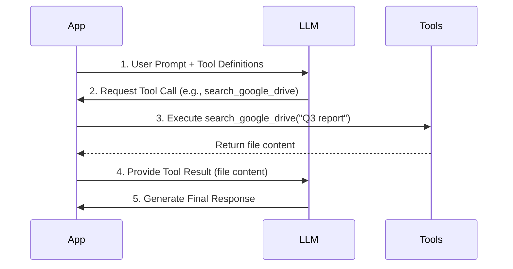
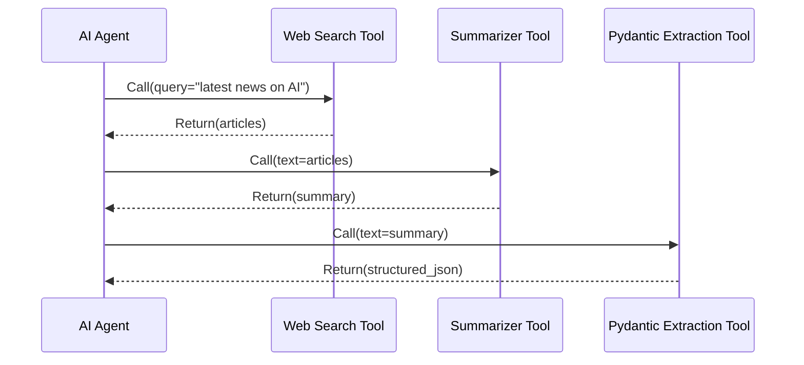
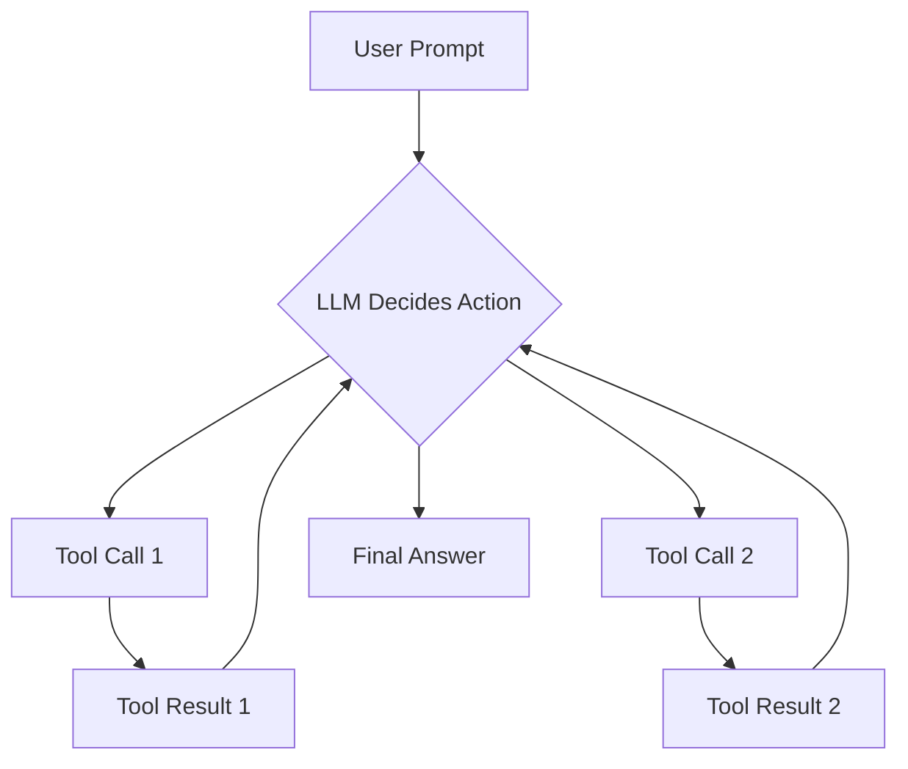

# TITLE NOT AVAILABLE
### SUBTITLE NOT AVAILABLE

## Introduction

In our previous lessons, we covered the fundamentals of building Large Language Model (LLM) workflows. You learned about context engineering to manage information flow, implemented structured outputs to get reliable data, and orchestrated basic patterns like chaining and routing. Now, we move to a concept that transforms an LLM from a text generator into a functional AI agent: tools. This lesson is about giving your LLM the ability to take action. Understanding how to equip an LLM with tools is a foundational skill for any AI Engineer looking to build, debug, and monitor applications that do more than just talk.

## Understanding why agents need tools

At their core, LLMs are sophisticated pattern matchers trained on vast amounts of text. Their fundamental limitation is that they cannot interact with the outside world on their own; they cannot browse the web, access a database, or even check the current time [3], [4], [5], [6]. Their knowledge is static, frozen at the time of their last training run [5], [6]. This is why tools are essential.

Think of the LLM as the "brain" of an operation—it can reason, plan, and generate language. Tools act as its "hands and senses," providing the connection to the external environment. They are the bridge that allows an LLM's internal reasoning to result in external action, turning it into a true AI agent.

Figure 1: An LLM using a retrieval tool to access external data before replying to the user. (Media from <https://www.mercity.ai/blog-post/guide-to-integrating-tools-and-apis-with-language-models>)

By giving an agent access to a set of functions, we empower it to overcome its inherent limitations. The common categories of tools integrated into production agents include [7], [8]:
*   **API Access:** Interacting with external services to get real-time information, like today's weather or the latest news from a search engine [9].
*   **Database Interaction:** Querying structured databases (e.g., PostgreSQL, Snowflake) to retrieve specific business data.
*   **Memory Access:** Connecting to a vector database to retrieve relevant information from its long-term memory, a process central to Retrieval-Augmented Generation (RAG).
*   **Code Execution:** Running code, typically in a sandboxed Python environment, to perform precise calculations, data manipulation, or statistical analysis [10].

## Implementing tool calls from scratch

The best way to understand how tools work is to build the mechanism from the ground up. In this section, we will implement tool calling from scratch to see what happens under the hood. We will define our tools, create schemas for them, instruct the LLM on how to use them, and finally, parse its output to execute the corresponding action.

Our goal is to give the LLM a list of available tools and let it decide which one to use and what arguments to pass based on the user's prompt. The high-level flow looks like this:

1.  **You:** Provide the LLM with a list of available tools and their descriptions via a system prompt.
2.  **LLM:** Analyzes the user's query and responds with a `function_call` request, specifying the tool's name and the arguments in a structured format like JSON.
3.  **You:** Parse this request and execute the corresponding function in your code.
4.  **You:** Send the function's output back to the LLM as additional context.
5.  **LLM:** Uses the tool's output to formulate a final, user-facing response [11], [12].

This request-execute-respond loop is the fundamental pattern for tool use in AI agents.


Figure 2: The five-step flow of an LLM tool call, from initial prompt to final response.

Now, let's get into the code. We will build a simple agent that can search for a mock document on Google Drive, summarize it, and send the summary to a Discord channel.

First, we will set up our environment by importing the necessary libraries and initializing the Gemini client. We will use a sample financial document to simulate the content of a file found on Google Drive.

```python
import json
from google import genai
from google.genai import types

client = genai.Client()
MODEL_ID = "gemini-1.5-flash"

DOCUMENT = """
# Q3 2023 Financial Performance Analysis

The Q3 earnings report shows a 20% increase in revenue and a 15% growth in user engagement, 
beating market expectations. These impressive results reflect our successful product strategy 
and strong market positioning.
...
"""
```

Next, we define our three tools as simple Python functions. For this example, they are mocked to return predefined data, which allows us to focus on the tool-calling logic itself.

1.  The `search_google_drive` function simulates finding a file and returning its content.
    ```python
    def search_google_drive(query: str) -> dict:
        """
        Searches for a file on Google Drive and returns its content or a summary.
    
        Args:
            query (str): The search query to find the file, e.g., 'Q3 earnings report'.
    
        Returns:
            dict: A dictionary representing the search results, including file names and summaries.
        """
        return {
            "files": [
                {
                    "name": "Q3_Earnings_Report_2024.pdf",
                    "id": "file12345",
                    "content": DOCUMENT,
                }
            ]
        }
    ```

2.  The `send_discord_message` function simulates sending a message to a channel.
    ```python
    def send_discord_message(channel_id: str, message: str) -> dict:
        """
        Sends a message to a specific Discord channel.
    
        Args:
            channel_id (str): The ID of the channel to send the message to, e.g., '#finance'.
            message (str): The content of the message to send.
    
        Returns:
            dict: A dictionary confirming the action, e.g., {"status": "success"}.
        """
        return {
            "status": "success",
            "status_code": 200,
            "channel": channel_id,
            "message_preview": f"{message[:50]}...",
        }
    ```

3.  The `summarize_financial_report` function simulates summarizing a text.
    ```python
    def summarize_financial_report(text: str) -> str:
        """
        Summarizes a financial report.
    
        Args:
            text (str): The text to summarize.
    
        Returns:
            str: The summary of the text.
        """
        return "The Q3 2023 earnings report shows strong performance across all metrics..."
    ```

For the LLM to understand these tools, we must provide a schema for each one. This schema, typically in JSON format, describes the tool's name, its purpose, and the parameters it accepts, including their types and whether they are required [13]. This is the industry standard used by major providers like OpenAI, Google, and Anthropic.

1.  Here is the schema for `search_google_drive`.
    ```python
    search_google_drive_schema = {
        "name": "search_google_drive",
        "description": "Searches for a file on Google Drive and returns its content or a summary.",
        "parameters": {
            "type": "object",
            "properties": {
                "query": {
                    "type": "string",
                    "description": "The search query to find the file, e.g., 'Q3 earnings report'.",
                }
            },
            "required": ["query"],
        },
    }
    ```

2.  And here are the schemas for the other two functions.
    ```python
    send_discord_message_schema = {
        "name": "send_discord_message",
        "description": "Sends a message to a specific Discord channel.",
        "parameters": { ... },
    }
    
    summarize_financial_report_schema = {
        "name": "summarize_financial_report",
        "description": "Summarizes a financial report.",
        "parameters": { ... },
    }
    ```

We then create a tool registry to map tool names to their handler functions and aggregate the schemas.

```python
TOOLS = {
    "search_google_drive": {
        "handler": search_google_drive,
        "declaration": search_google_drive_schema,
    },
    "send_discord_message": { ... },
    "summarize_financial_report": { ... },
}
TOOLS_BY_NAME = {tool_name: tool["handler"] for tool_name, tool in TOOLS.items()}
TOOLS_SCHEMA = [tool["declaration"] for tool in TOOLS.values()]
```

The `TOOLS_BY_NAME` mapping looks like this:
```
Tool name: search_google_drive
Tool handler: <function search_google_drive at 0x104c7df80>
---------------------------------------------------------------------------
Tool name: send_discord_message
Tool handler: <function send_discord_message at 0x104c7de40>
---------------------------------------------------------------------------
...
```

And an entry in `TOOLS_SCHEMA` is the JSON we defined earlier:
```json
 {
    "name": "search_google_drive",
    "description": "Searches for a file on Google Drive and returns its content or a summary.",
    "parameters": {
      "type": "object",
      "properties": {
        "query": {
          "type": "string",
          "description": "The search query to find the file, e.g., 'Q3 earnings report'."
        }
      },
      "required": [
        "query"
      ]
    }
  }
```

Now, we need a system prompt to instruct the LLM on how to use these tools. This prompt explains the guidelines, the expected output format for a tool call, and provides the list of available tools enclosed in XML tags.

```python
TOOL_CALLING_SYSTEM_PROMPT = """
You are a helpful AI assistant with access to tools that enable you to take actions and retrieve information...</content>
</section>

### Tool Call Format
When you need to use a tool, output ONLY the tool call in this exact format:

<tool_call>
{{"name": "tool_name", "args": {{"param1": "value1", "param2": "value2"}}}}
</tool_call>

...

### Available Tools
<tool_definitions>
{tools}
</tool_definitions>
"""

In practice, the LLM uses the `description` field from the tool schema to *decide* if a tool is appropriate for the user's query. This is why clear, unambiguous descriptions are important for building reliable agents. If you have two tools with similar descriptions like "Tool used to search documents" and "Tool used to search files," the LLM will get confused. You must be explicit: "Tool used to search documents on Google Drive" versus "Tool used to search files on the local disk." Clear tool descriptions and explicit user prompts ensure the agent makes the right choice. This becomes important as you scale to dozens of tools per agent.

Once a tool is selected, the LLM *generates* the function name and arguments as a structured output. This capability is not magic; models are specifically instruction fine-tuned to interpret these schemas and produce valid tool call requests.

Let's test it. We will ask the model to find the latest quarterly report.

```python
USER_PROMPT = "Can you help me find the latest quarterly report and share key insights with the team?"
messages = [TOOL_CALLING_SYSTEM_PROMPT.format(tools=str(TOOLS_SCHEMA)), USER_PROMPT]

response = client.generative_models.get_model(MODEL_ID).generate_content(
    contents=messages,
)
```

The model correctly identifies the `search_google_drive` tool and generates the necessary arguments:
```
<tool_call>
  {"name": "search_google_drive", "args": {"query": "latest quarterly report"}}
</tool_call>
```

Now, let's parse this response and execute the function.

1.  First, we extract the JSON string from the LLM's response.
    ```python
    def extract_tool_call(response_text: str) -> str:
        """
        Extracts the tool call from the response text.
        """
        return response_text.split("<tool_call>")[1].split("</tool_call>")[0].strip()
    
    tool_call_str = extract_tool_call(response.text)
    # '{"name": "search_google_drive", "args": {"query": "Q3 earnings report"}}'
    ```

2.  Next, we parse the string into a Python dictionary.
    ```python
    import json
    tool_call = json.loads(tool_call_str)
    # {'name': 'search_google_drive', 'args': {'query': 'Q3 earnings report'}}
    ```

3.  We retrieve the actual Python function from our `TOOLS_BY_NAME` registry.
    ```python
    tool_handler = TOOLS_BY_NAME[tool_call["name"]]
    # <function search_google_drive at 0x104c7df80>
    ```

4.  Finally, we execute the function with the arguments provided by the LLM.
    ```python
    tool_result = tool_handler(**tool_call["args"])
    ```
    This returns our mocked document content:
    ```json
    {
      "files": [
        {
          "name": "Q3_Earnings_Report_2024.pdf",
          "id": "file12345",
          "content": "\n# Q3 2023 Financial Performance Analysis\n\nThe Q3 earnings report shows..."
        }
      ]
    }
    ```

We can wrap this logic in a helper function, `call_tool`, to streamline the process.

```python
def call_tool(response_text: str, tools_by_name: dict):
    tool_call_str = extract_tool_call(response_text)
    tool_call = json.loads(tool_call_str)
    tool_name = tool_call["name"]
    tool_args = tool_call["args"]
    tool = tools_by_name[tool_name]
    return tool(**tool_args)

# Using the helper function
call_tool(response.text, tools_by_name=TOOLS_BY_NAME)
```

The final step in the loop is to send the `tool_result` back to the LLM. This allows it to either formulate a final answer for the user or decide on the next action to take.

```python
response = client.generative_models.get_model(MODEL_ID).generate_content(
    contents=f"Interpret the tool result: {json.dumps(tool_result, indent=2)}",
)
```

The LLM then provides a natural language summary based on the tool's output:
```
The tool result provides the content of a file named `Q3_Earnings_Report_2024.pdf`.

This document is a **Q3 2023 Financial Performance Analysis** and details exceptionally strong results, significantly beating market expectations.

**Key highlights from the report include:**
*   **Revenue Growth:** A 20% increase in revenue.
*   **User Engagement:** 15% growth in user engagement.
...
```

This is the basic concept behind tool calling. We have successfully implemented the entire tool-calling loop from scratch.

## Implementing a tool calling framework from scratch

Manually defining a JSON schema for every function is tedious and violates the Don't Repeat Yourself (DRY) principle. As you add more tools, this approach becomes unscalable. That is why modern agentic frameworks like LangGraph use decorators like `@tool` to automate this process [1], [2].

We can build a small framework to do the same. Our goal is to create a `@tool` decorator that automatically generates the schema by inspecting a function's signature, type hints, and docstring. This centralizes the schema generation logic, making our code cleaner and easier to maintain.

Let's refactor our previous implementation.

1.  First, we define a `ToolFunction` class to hold both the callable function and its generated schema.
    ```python
    from typing import Any, Callable, Dict
    
    class ToolFunction:
        def __init__(self, func: Callable, schema: Dict[str, Any]) -> None:
            self.func = func
            self.schema = schema
            self.__name__ = func.__name__
            self.__doc__ = func.__doc__
    
        def __call__(self, *args: Any, **kwargs: Any) -> Any:
            return self.func(*args, **kwargs)
    ```

2.  Next, we implement the `@tool` decorator. It inspects the decorated function's signature and docstring to build the JSON schema automatically.
    ```python
    from inspect import Parameter, signature
    
    def tool(description: str = None) -> Callable[[Callable], ToolFunction]:
        """
        A decorator that creates a tool schema from a function.
        """
        def decorator(func: Callable) -> ToolFunction:
            sig = signature(func)
            properties = {}
            required = []
    
            for param_name, param in sig.parameters.items():
                param_schema = {
                    "type": "string",  # Default, can be enhanced
                    "description": f"The {param_name} parameter",
                }
                if param.default == Parameter.empty:
                    required.append(param_name)
                properties[param_name] = param_schema
    
            schema = {
                "name": func.__name__,
                "description": description or func.__doc__ or f"Executes the {func.__name__} function.",
                "parameters": {
                    "type": "object",
                    "properties": properties,
                    "required": required,
                },
            }
            return ToolFunction(func, schema)
        return decorator
    ```

3.  Now, we can redefine our tools by simply applying the decorator. The boilerplate for manual schema creation is gone.
    ```python
    @tool()
    def search_google_drive_example(query: str) -> dict:
        """Search for files in Google Drive."""
        # Mock implementation
        return {"files": ["Q3 earnings report"]}
    
    @tool()
    def send_discord_message_example(channel_id: str, message: str) -> dict:
        """Send a message to a Discord channel."""
        return {"message": "Message sent successfully"}
    
    @tool()
    def summarize_financial_report_example(text: str) -> str:
        """Summarize the contents of a financial report."""
        return "Financial report summarized successfully"
    ```

The decorated function is now a `ToolFunction` object. We can inspect its auto-generated schema, which is identical to the one we wrote manually.

```python
tools = [
    search_google_drive_example,
    send_discord_message_example,
    summarize_financial_report_example,
]
tools_by_name = {tool.schema["name"]: tool.func for tool in tools}
tools_schema = [tool.schema for tool in tools]

# Let's inspect the first tool
print(type(search_google_drive_example))
# <class '__main__.ToolFunction'>

print(json.dumps(search_google_drive_example.schema, indent=2))
```
The schema is generated correctly:
```json
{
  "name": "search_google_drive_example",
  "description": "Search for files in Google Drive.",
  "parameters": {
    "type": "object",
    "properties": {
      "query": {
        "type": "string",
        "description": "The query parameter"
      }
    },
    "required": [
      "query"
    ]
  }
}
```

We can now use this auto-generated `tools_schema` with our LLM call, and the rest of the flow remains the same. This decorator-based approach provides a scalable and maintainable way to manage tools, just like production-grade frameworks.

## Implementing production-level tool calls with Gemini

While building from scratch is insightful, production systems benefit from the robustness and optimization of native APIs. Let's switch to using the Gemini API for tool calling, which simplifies the process.

Instead of crafting a detailed system prompt, we can pass our tool definitions directly to the model using its `GenerateContentConfig`. This offloads the instruction-following logic to the API provider, who has fine-tuned the model specifically for this task, leading to more reliable behavior.

1.  First, we define our tools and configuration for the Gemini model. We use the same schemas we created earlier. The key difference is that we pass them inside a `types.Tool` object and set the `tool_config` to force the model to call a function.
    ```python
    from google.genai import types
    
    tools = [
        types.Tool(
            function_declarations=[
                types.FunctionDeclaration(**search_google_drive_schema),
                types.FunctionDeclaration(**send_discord_message_schema),
            ]
        )
    ]
    config = types.GenerateContentConfig(
        tools=tools,
        tool_config=types.ToolConfig(function_calling_config=types.FunctionCallingConfig(mode="ANY")),
    )
    ```

2.  Now, we can call the model with just the user prompt. The complex system prompt is no longer needed.
    ```python
    USER_PROMPT = """
    Please find the Q3 earnings report on Google Drive and send a summary of it to 
    the #finance channel on Discord.
    """
    
    response = client.generative_models.get_model(MODEL_ID).generate_content(
        contents=[USER_PROMPT],
        generation_config=config,
    )
    ```

3.  The Gemini API returns a structured `FunctionCall` object directly, eliminating the need for manual parsing.
    ```python
    response_message_part = response.candidates[0].content.parts[0]
    function_call = response_message_part.function_call
    # FunctionCall(name='search_google_drive', args={'query': 'Q3 earnings report'})
    ```

4.  We can then extract the handler and arguments to execute the tool, just as before.
    ```python
    tool_handler = TOOLS_BY_NAME[function_call.name]
    tool_result = tool_handler(**function_call.args)
    ```

The Gemini Python SDK simplifies this even further by automatically creating schemas from Python functions. You can pass the function callables directly into the `tools` configuration, reducing lines of schema definition and decorator code to just a few [25].

This native approach is not unique to Gemini. Other major APIs from providers like OpenAI and Anthropic follow a similar logic, allowing you to transfer these skills across different platforms [25]. By using the native SDK, you write less code, reduce potential errors, and build more robust, production-ready agents.

## Using Pydantic models as tools for on-demand structured outputs

Connecting back to Lesson 4 on structured outputs, we can explore a powerful pattern: using Pydantic models as tools. This provides an elegant way to get validated, structured data on-demand within an agentic workflow. Instead of always forcing a structured output, the agent can perform several intermediate steps using unstructured text—which is easier for an LLM to reason with—and then dynamically decide to call the Pydantic "tool" only when it needs to generate a structured final answer [14].

This pattern is useful for agents that need to interact with downstream systems that expect a specific, validated schema.


Figure 3: An agent using multiple tools sequentially, with the final step being a Pydantic tool for structured data extraction.

Let's see how to implement this.

1.  First, we define our `DocumentMetadata` Pydantic model, which specifies the exact structure we want to extract.
    ```python
    from pydantic import BaseModel, Field
    
    class DocumentMetadata(BaseModel):
        """A class to hold structured metadata for a document."""
        summary: str = Field(description="A concise, 1-2 sentence summary of the document.")
        tags: list[str] = Field(description="A list of 3-5 high-level tags relevant to the document.")
        keywords: list[str] = Field(description="A list of specific keywords or concepts mentioned.")
        quarter: str = Field(description="The quarter of the financial year...")
        growth_rate: str = Field(description="The growth rate of the company...")
    ```

2.  Next, we define this Pydantic model as a tool. We create a function declaration named `extract_metadata` and pass its schema to the `parameters` field using `DocumentMetadata.model_json_schema()`.
    ```python
    extraction_tool = types.Tool(
        function_declarations=[
            types.FunctionDeclaration(
                name="extract_metadata",
                description="Extracts structured metadata from a financial document.",
                parameters=DocumentMetadata.model_json_schema(),
            )
        ]
    )
    config = types.GenerateContentConfig(
        tools=[extraction_tool],
        tool_config=types.ToolConfig(function_calling_config=types.FunctionCallingConfig(mode="ANY")),
    )
    ```

3.  We prompt the LLM to analyze our document and extract the metadata.
    ```python
    prompt = f"""
    Please analyze the following document and extract its metadata.
    
    Document:
    --- 
    {DOCUMENT}
    --- 
    """
    
    response = client.generative_models.get_model(MODEL_ID).generate_content(contents=[prompt], generation_config=config)
    ```

4.  The LLM responds with a `function_call` to `extract_metadata`, with the arguments perfectly matching our Pydantic schema. We can then instantiate the Pydantic object, which automatically validates the structure and types of the extracted data [15].
    ```python
    function_call = response.candidates[0].content.parts[0].function_call
    # FunctionCall(name='extract_metadata', args={'growth_rate': '20%', 'summary': '...', ...})
    
    try:
        document_metadata = DocumentMetadata(**function_call.args)
        print("Validation successful!")
        print(document_metadata.model_dump_json(indent=2))
    except Exception as e:
        print(f"Validation failed: {e}")
    ```

This pattern is a robust way to ensure that an agent's final output is structured, validated, and ready for reliable use in downstream applications.

## The downsides of running tools in a loop

So far, we have focused on single tool calls. A true agent, however, often needs to perform multi-step tasks that require chaining multiple tools together. The natural progression is to run tools in a loop, allowing the LLM to decide which tool to call at each step based on the output of the previous one. This gives the agent flexibility and the ability to handle complex user requests.


Figure 4: A diagram illustrating the iterative tool-calling loop.

Let's implement a loop to handle a request that requires finding a report, summarizing it, and then sending the summary.

1.  First, we set up our tools and config, making all three functions available.
    ```python
    tools = [
        types.Tool(
            function_declarations=[
                types.FunctionDeclaration(**search_google_drive_schema),
                types.FunctionDeclaration(**send_discord_message_schema),
                types.FunctionDeclaration(**summarize_financial_report_schema),
            ]
        )
    ]
    config = types.GenerateContentConfig(
        tools=tools,
        tool_config=types.ToolConfig(function_calling_config=types.FunctionCallingConfig(mode="ANY")),
    )
    ```

2.  We start a conversation with the user's multi-step request and make the first call to the LLM.
    ```python
    USER_PROMPT = """
    Please find the Q3 earnings report on Google Drive and send a summary of it to 
    the #finance channel on Discord.
    """
    messages = [types.Content(role="user", parts=[types.Part.from_text(USER_PROMPT)])]
    
    response = client.generative_models.get_model(MODEL_ID).generate_content(
        contents=messages,
        generation_config=config,
    )
    ```
    The LLM correctly identifies the first step: `search_google_drive`.

3.  Now, we loop. At each step, we execute the tool call, append the result to our message history, and send it back to the LLM to decide the next action.
    ```python
    max_iterations = 3
    while response.candidates[0].content.parts[0].function_call and max_iterations > 0:
        # Append the model's function call request to history
        messages.append(response.candidates[0].content)
        
        # Execute the tool
        function_call = response.candidates[0].content.parts[0].function_call
        tool_result = call_tool(function_call)
    
        # Append the tool result to history
        function_response_part = types.Part.from_function_response(
            name=function_call.name,
            response={"result": tool_result},
        )
        messages.append(types.Content(role="model", parts=[function_response_part]))
    
        # Call the model again to decide the next step
        response = client.generative_models.get_model(MODEL_ID).generate_content(
            contents=messages,
            generation_config=config,
        )
        max_iterations -= 1
    ```

The agent successfully chains the tools: `search_google_drive` -> `summarize_financial_report` -> `send_discord_message`.

However, this simple loop is not robust and can be inefficient. It immediately moves to the next action without giving the LLM a chance to *reason* about the intermediate results. This can lead to several problems [16]:
*   **Lack of Planning:** The agent cannot plan ahead or consider alternative strategies. It just reacts to the last output.
*   **Inefficiency:** It might get stuck in repetitive loops, calling the same tool without making progress.
*   **Error Handling:** It struggles to recover from a failed tool call because it cannot reflect on what went wrong.

💡 When tool calls are independent, modern APIs like Gemini support parallel function calling, where the model can request multiple tools in a single turn. This can reduce latency by executing independent tasks simultaneously [17], [18].

The limitations of simple loops motivated researchers to develop more sophisticated agentic patterns. The most notable is **ReAct (Reason + Act)**, which explicitly prompts the model to interleave reasoning (thought) with actions (tool calls). This allows the agent to plan, track progress, and adapt its strategy, leading to much more robust behavior. We will dive deep into the theory and implementation of ReAct in Lessons 7 and 8 [19].

## Going through popular tools used within the industry

To ground these concepts in real-world applications, let's survey the common categories of tools that power production AI agents.

1.  **Knowledge & Memory Access:**
    These tools allow an agent to retrieve information from external knowledge sources. This is the foundation for building agents that can answer questions about private data or recent events. Examples include tools for querying vector databases, document stores, or graph databases. A more advanced pattern, text-to-SQL, involves a tool that can construct and execute SQL queries against traditional databases based on natural language. These capabilities are core to agentic RAG, which we will cover in Lesson 10, and agent memory, which is the focus of Lesson 9.

2.  **Web Search & Browsing:**
    This is one of the most visible applications of tool use. Agents like Google's Gemini, Perplexity AI, and Microsoft Copilot integrate tools that interface with search engine APIs to fetch up-to-date information from the internet [23], [24]. More advanced versions include web scraping tools that can extract and parse content directly from web pages, enabling agents to perform in-depth research.

3.  **Code Execution:**
    Giving an agent a code interpreter, usually a sandboxed Python environment, unlocks powerful capabilities for data analysis, computation, and visualization [22]. Instead of trying to perform math with its limited reasoning abilities, the agent can write and execute code to get a precise answer. ⚠️ However, this is also the most dangerous tool, as executing LLM-generated code poses security risks. It is important to run it in a secure, isolated sandbox to prevent arbitrary code execution or unauthorized system access [20], [21].

## Conclusion

Tool calling is the mechanism that elevates an LLM from a passive text generator to an active agent capable of interacting with the world. Understanding how to define, implement, and orchestrate tools is a core skill for building, monitoring, and debugging any serious AI application. We have seen how to build this capability from scratch, use production APIs, and chain tools together to solve complex problems. We also identified the limitations of simple loops, which sets the stage for our next topic. In Lesson 7, we will explore the theory behind planning and the ReAct pattern. We will also learn about agent memory in Lesson 9 and RAG in Lesson 10.

## References

- [1] [Concepts - Tools](https://python.langchain.com/docs/concepts/tools/)
- [2] [Tools](https://langchain-opentutorial.gitbook.io/langchain-opentutorial/15-agent/01-tools)
- [3] [10 Major Limitations of Large Language Models (LLMs) in 2024](https://www.projectpro.io/article/llm-limitations/1045)
- [4] [LLM Limitations: Why LLMs Can't Query Your Enterprise Data](https://memgraph.com/blog/llm-limitations-query-enterprise-data)
- [5] [Pre-training of Large Language Models](https://arxiv.org/html/2412.04503v1)
- [6] [Pitfalls](https://learnprompting.org/docs/basics/pitfalls)
- [7] [Athena: A Framework for the Integration of External Tools with Large Language Models](https://arxiv.org/html/2507.08034v1)
- [8] [Comprehensive Guide to Integrating Tools and APIs with Language Models](https://www.mercity.ai/blog-post/guide-to-integrating-tools-and-apis-with-language-models)
- [9] [Microsoft brings Copilot AI-powered web search mode on Bing: How it works](https://www.business-standard.com/technology/tech-news/microsoft-brings-copilot-ai-powered-web-search-mode-on-bing-how-it-works-125022500477_1.html)
- [10] [AI Agents Primer (Part 1)](https://aman.ai/primers/ai/agents/)
- [11] [How to use tools with LLMs](https://python.langchain.com/docs/how_to/function_calling/)
- [12] [LLMs and Function/Tool Calling](https://blog.christoolivier.com/p/llms-and-functiontool-calling)
- [13] [Function Calling](https://www.promptingguide.ai/applications/function_calling)
- [14] [Enforce and validate LLM output with Pydantic](https://xebia.com/blog/enforce-and-validate-llm-output-with-pydantic/)
- [15] [Models - Pydantic](https://docs.pydantic.dev/latest/concepts/models/)
- [16] [An Empirical Study of Failure Modes in Multi-Agent LLM Systems](https://arxiv.org/pdf/2503.13657)
- [17] [A Deep Dive into Function Calling in Gemini](https://atamel.dev/posts/2024/08-06_deepdive_function_calling_gemini/)
- [18] [Function calling](https://cloud.google.com/vertex-ai/generative-ai/docs/multimodal/function-calling)
- [19] [ReAct](https://www.promptingguide.ai/techniques/react)
- [20] [Setting Up a Secure Python Sandbox for LLM Agents](Dida.do)
- [21] [Setting up a secure Python sandbox for LLM agents](https://dida.do/blog/setting-up-a-secure-python-sandbox-for-llm-agents)
- [22] [Deep Research Agents: The Future of Scientific Discovery](https://arxiv.org/html/2506.18096v1)
- [23] [Perplexity AI vs Google Gemini vs ChatGPT: The Ultimate Comparison](https://gaper.io/perplexity-ai-vs-google-gemini-vs-chatgpt/)
- [24] [Copilot in Bing: Our approach to responsible AI](https://support.microsoft.com/en-us/topic/copilot-in-bing-our-approach-to-responsible-ai-45b5eae8-7466-43e1-ae98-b48f8ff8fd44)
- [25] [Function calling](https://platform.openai.com/docs/guides/function-calling)