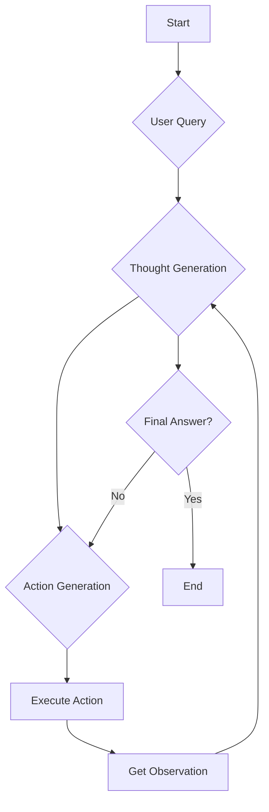
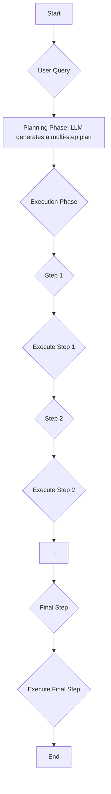

# LLM Agents: Think, Plan, Act
### Give your LLM a brain with ReAct & Plan-and-Execute

## Introduction: Giving LLMs a Blueprint for Thought

Large Language Models (LLMs) are incredibly powerful at generating human-like text, but let's be blunt: they don't think. In their raw form, LLMs are next-token predictors, not strategic planners. This becomes painfully obvious when you try to build an autonomous AI agent to handle a complex, multi-step task. Ask a naive agent to do anything requiring structured thought, and it will likely fail, getting lost in a loop of irrelevant actions or hallucinating its way to a dead end.

This limitation raises a critical engineering question: How do we give these models a cognitive architecture to think, plan, and adapt? How do we move beyond simple prompt-response cycles and build agents that can systematically tackle complex problems?

This article will cut through the hype and dissect two foundational strategies that provide a blueprint for agentic thought: ReAct and Plan-and-Execute. We will explore why LLMs need this external scaffolding. These core patterns provide the structure necessary for building agents that can reason, self-correct, and achieve long-horizon goals. For AI engineers, this isn't just theory; it's the essential toolkit for designing systems that work.

## The Agent's Dilemma: Why LLMs Struggle with Complex Planning Tasks

To understand the problem, let's consider a practical scenario: a "Technical Research Assistant Agent." You task it with creating a comprehensive report on the "latest developments in edge AI deployment." A naive approach, simply feeding this goal to a Large Language Model (LLM), would be a disaster. The model might confidently generate a list of "recent breakthroughs" that sound plausible but are entirely fabricated, complete with non-existent paper titles and authors.

The LLM would lack any mechanism to search for real academic papers. It could not verify claims against external databases. Furthermore, it would not remember which sources it had already "consulted." The output would be a confident, yet utterly useless, piece of fiction.

This failure is not a bug; this is how LLMs are designed. An agent is a dynamic, goal-oriented system. However, a standalone LLM lacks the fundamental components to support this behavior. Its architecture inherently limits its ability to handle complex tasks.

First, Large Language Models are fundamentally stateless. They are next-token predictors with a finite context window. This means they have no built-in memory or state-tracking capabilities across multiple interactions. Without an external system to manage what it has done and what it has learned, an LLM is like a researcher with severe short-term memory loss. It constantly forgets which papers it has already read. It cannot build a coherent understanding of a complex problem over time, nor can it track its progress towards a goal [1](https://pmc.ncbi.nlm.nih.gov/articles/PMC11756841/), [2](https://formative.jmir.org/2025/1/e51319), [3](https://pmc.ncbi.nlm.nih.gov/articles/PMC11751060/), [4](https://direct.mit.edu/qss/article/5/3/736/120940/A-critical-review-of-large-language-models).

Second, LLMs have no default planning capabilities. They do not spontaneously create and follow a multi-step plan to achieve a distant goal. Their reasoning is impressive but implicit. An engineer must explicitly structure it to be useful for a complex task [5](https://openreview.net/forum?id=jK4dbpEEMo), [6](https://openreview.net/forum?id=kFrqoVtMIy), [7](https://arxiv.org/html/2406.14283v1), [8](https://news.mit.edu/2025/researchers-teach-llms-to-solve-complex-planning-challenges-0402).

This is why traditional solutions fall short. Simple prompting, like our naive research assistant example, cannot handle multi-step dependencies or ensure factual accuracy. Chain-of-Thought (CoT) prompting helps an LLM break down a single complex query into logical steps. However, it remains an internal monologue. CoT does not inherently connect the LLM to the outside world or provide persistent memory of past actions and observations. This static, internal reasoning limits its ability to reactively explore or update knowledge, leading to hallucination and error propagation [9](https://arxiv.org/pdf/2210.03629).

Similarly, action-only approaches lack the abstract reasoning needed to stay focused on the high-level goal. They also struggle to maintain a working memory for long-horizon tasks [9](https://arxiv.org/pdf/2210.03629).

Finally, LLMs have no innate ability to interact with the world. They cannot use tools, browse the web, or access a database without an external system enabling these actions [10](https://www.anthropic.com/research/building-effective-agents), [11](https://developer.nvidia.com/blog/introduction-to-llm-agents/), [12](https://ppc.land/content/files/2025/01/Newwhitepaper_Agents2.pdf), [13](https://agentsprotocol.gitbook.io/whitepaper/core-architecture-and-technology-stack).

This is why we need an "Orchestrating Agent System," sometimes called an "Agent Core." This is the software loop you, the engineer, build around the LLM. This orchestrator is the true "agent." It manages the overall goal and maintains the agent's state and memory (like a scratchpad). It calls the LLM (the "brain") to make decisions. It also provides the interface to tools and the external environment. Without this orchestrator, you do not have an agent; you just have a powerful but aimless model [10](https://www.anthropic.com/research/building-effective-agents), [11](https://developer.nvidia.com/blog/introduction-to-llm-agents/), [12](https://ppc.land/content/files/2025/01/Newwhitepaper_Agents2.pdf), [13](https://agentsprotocol.gitbook.io/whitepaper/core-architecture-and-technology-stack).

Figure 1: An orchestrating agent system provides the control loop and external memory that LLMs lack [14](https://arxiv.org/html/2504.16563v1).

## Blueprints for Thinking: Foundational Planning & Reasoning Strategies

Once you accept that an external orchestrator is necessary, the next question is how to structure your agent's "thought process." Historically, two foundational strategies emerged to solve this: ReAct and Plan-and-Execute. Understanding these patterns is essential, as they provide the mental models for how agents can reason and act methodically.

### The Birth of ReAct
Before ReAct, agent design was stuck between two paradigms. On one side, you had Chain-of-Thought (CoT) prompting, which allowed models to "reason" but kept them trapped inside their own heads. This meant they were disconnected from real-world information and prone to hallucination. On the other, you had action-only models that could interact with tools but lacked the high-level reasoning to form a coherent strategy [9](https://arxiv.org/pdf/2210.03629). Researchers at Google saw this gap and proposed ReAct (Reason + Act) to synergize these two functions. The key insight was to create an interleaved process where reasoning informs actions, and the results of those actions (observations) inform the next round of reasoning. This creates a powerful feedback loop that grounds the agent in reality [9](https://arxiv.org/pdf/2210.03629), [15](https://ai.googleblog.com/2022/11/react-synergizing-reasoning-and-acting.html).

Figure 2: ReAct combines reasoning and acting, addressing the limitations of approaches that focus on only one.

### Solution 1: ReAct (Reason + Act)
The core concept of ReAct is an iterative loop: **Thought -> Action -> Observation**. The Large Language Model (LLM) first generates a thought, which is an explicit piece of reasoning about what it needs to do next. This "Thought" step is crucial; it's where the LLM explicitly articulates its reasoning, allowing you, the engineer, to inspect its decision-making process. This transparency is invaluable for debugging and understanding why an agent behaves the way it does. Based on that thought, it generates an action, like calling a tool. The orchestrator executes this action and feeds the result—the observation—back to the LLM. The "Observation" is the feedback from that action, grounding the agent in reality and informing its next "Thought." This cycle continues until the task is complete.

Let's see how your Technical Research Assistant would use ReAct:
*   **Thought 1:** "I need to find recent papers on the latest developments in edge AI deployment. I'll start with a broad search to get an overview."
*   **Action 1:** `Search("latest developments in edge AI deployment 2024 papers")`
*   **Observation 1:** "[List of 5 search results with titles and snippets]"
*   **Thought 2:** "The first result, 'Advances in Quantization for Edge AI,' seems highly relevant. I should read its abstract to understand its key contributions."
*   **Action 2:** `ReadAbstract("Advances in Quantization for Edge AI")`
*   **Observation 2:** "[Abstract text, mentioning novel 4-bit quantization techniques]"
*   **Thought 3:** "This paper focuses on quantization, which seems to be a key trend. I should refine my research to find more sources on this specific topic to identify if this is a broader trend. I also need to ensure I'm not missing other major developments."
*   **Action 3:** `Search("edge AI quantization techniques review 2024")`
*   **Observation 3:** "[List of 3 new search results, including a survey paper]"
*   **Thought 4:** "The survey paper looks promising for a comprehensive overview. I will read its full content to understand the current state and future directions of edge AI deployment, especially regarding quantization."
*   **Action 4:** `ReadFullPaper("Comprehensive Survey of Edge AI Deployment Trends")`

This loop continues, with each step building on the last. Your agent's "internal monologue" is made explicit, which is great for debugging and ensuring the agent stays on track. It provides a natural way to integrate tool use and react to new information.

Figure 3: The cyclical Thought-Action-Observation loop of a ReAct agent.

### Solution 2: Plan-and-Execute
The Plan-and-Execute strategy takes a different approach by separating planning from execution into two distinct phases. This framework is designed to address complex, long-term planning tasks [16](https://blog.langchain.com/plan-and-execute-agents/), [17](https://www.promptlayer.com/glossary/plan-and-execute-agents).

1.  **Planning Phase:** First, the LLM creates a complete, high-level plan to achieve the goal. This plan is a sequence of steps that outlines the entire strategy from start to finish. The planning phase is where the LLM acts as a high-level strategist, laying out the entire sequence of operations before any execution begins. This upfront planning can prevent the agent from getting sidetracked or falling into unproductive loops, which can happen with more reactive approaches [17](https://www.promptlayer.com/glossary/plan-and-execute-agents).
2.  **Execution Phase:** The agent then executes each step of the plan sequentially. While the initial plan provides a strong backbone, a robust Plan-and-Execute agent can also incorporate mechanisms for dynamic re-planning if an execution step fails or new information invalidates part of the original strategy. This explicit separation allows one LLM to focus solely on planning, and another to focus on execution, enhancing reliability and modularity [16](https://blog.langchain.com/plan-and-execute-agents/).

Here's how your research assistant would tackle the same task with a Plan-and-Execute approach:

*   **Planning Phase:**
    1.  Search for academic papers and industry reports on "edge AI deployment" published in the last 18 months, prioritizing highly cited works.
    2.  Filter the top 10 most relevant sources based on abstract review and initial relevance scoring.
    3.  For each selected source, extract and summarize its key findings, focusing on novel techniques, challenges, and future trends.
    4.  Synthesize all summaries to identify the top 3-5 overarching trends in edge AI deployment, noting any conflicting information.
    5.  Identify any reported gaps, open problems, or future research directions mentioned across the sources.
    6.  Structure and write the final report, including an introduction, detailed sections on key trends, an analysis of gaps, and a concluding summary.

*   **Execution Phase:** The agent now works through this checklist, executing each step one by one. For example, it would first complete the search, then move on to filtering, then summarizing, and so on. If, during the summarization of a paper, it finds a critical new sub-topic not covered in the initial plan, it might trigger a re-planning step to incorporate additional research on that sub-topic before proceeding.

This strategy is particularly useful for tasks where a high-level approach can be determined upfront. It provides a clear, structured workflow that is less likely to get sidetracked.

Figure 4: The two-phase workflow of a Plan-and-Execute agent.

### Comparison: When to Use Which
So, which blueprint is better? It depends entirely on the task you're trying to solve.

*   **Use ReAct for exploratory or dynamic tasks** where the path forward is uncertain. ReAct excels when your agent needs to react to unpredictable information and adjust its strategy on the fly. Consider a task like "diagnose a complex network issue." This is highly exploratory and unpredictable, making ReAct a strong candidate. Your agent needs to react to diagnostic outputs, error messages, and user input in real-time.
*   **Use Plan-and-Execute for well-defined or long-horizon tasks** where the overall strategy can be mapped out in advance. Conversely, "generate a quarterly financial report based on provided data" is a well-defined task with clear steps, where Plan-and-Execute would likely be more efficient and reliable. Your agent can map out data extraction, calculation, and report generation steps upfront.

Studies comparing the two have shown that Plan-and-Execute tends to achieve higher task completion accuracy for complex tasks, but at the cost of higher latency and token consumption. ReAct is generally faster and cheaper but may struggle with maintaining focus on a long-term goal. The choice is an engineering trade-off between flexibility and structured execution [18](https://dev.to/jamesli/react-vs-plan-and-execute-a-practical-comparison-of-llm-agent-patterns-4gh9).

## Advanced Capabilities: Goal Decomposition and Self-Correction

Foundational strategies like ReAct and Plan-and-Execute provide the basic structure for agentic behavior, but building truly robust agents requires more advanced capabilities. Two of the most critical are goal decomposition and self-correction. These are not just add-ons; they are essential for enabling agents to handle real-world complexity and recover from the inevitable errors they will encounter.

### Advanced Capability 1: Goal Decomposition
At its core, all planning is about breaking down large, vague goals into smaller, concrete actions. We call this goal decomposition. Both ReAct and Plan-and-Execute rely on this, but for complex tasks, this decomposition needs to be hierarchical. Instead of a flat list of steps, the agent builds a tree of goals and sub-goals. Recent research has formalized this with frameworks that use continuously updated global plans and construct subgoal trees to systematically reduce gaps in planning, enabling LLMs to function more effectively on long-horizon tasks [14](https://arxiv.org/html/2504.16563v1), [19](https://arxiv.org/html/2506.21030v1).

For our Technical Research Assistant, this hierarchical decomposition would look like:

*   **Main Goal:** Create a technical report on edge AI deployment.
    *   **Sub-Goal 1: Research**
        *   **Sub-sub-goal 1.1:** Find recent academic papers via search tools.
        *   **Sub-sub-goal 1.2:** Find industry whitepapers and blog posts.
        *   **Sub-sub-goal 1.3:** Identify key experts and summarize their recent talks or articles.
    *   **Sub-Goal 2: Analysis**
        *   **Sub-sub-goal 2.1:** Synthesize findings from all sources.
        *   **Sub-sub-goal 2.2:** Identify the top 3 recurring trends.
    *   **Sub-Goal 3: Writing**
        *   **Sub-sub-goal 3.1:** Draft the introduction and conclusion.
        *   **Sub-sub-goal 3.2:** Write the main body detailing the trends.

This hierarchical structure allows the agent to maintain focus on the big picture while working on granular tasks. It simplifies planning at each level, as the LLM only needs to reason about the immediate sub-goals rather than the entire complex task at once.

### Advanced Capability 2: Self-Correction
Real-world tasks are messy. Information can be contradictory, tools can fail, and initial assumptions can be wrong. An agent that cannot detect and recover from these issues is brittle and unreliable. Self-correction is the mechanism that allows an agent to adapt when things go wrong. Frameworks like Reflexion and Self-Refine explore this by having an agent reflect on its actions and feedback to improve its performance iteratively. While these frameworks offer significant improvements, self-correction is most effective when reliable external feedback is available or when models are fine-tuned specifically for this purpose. Relying solely on an LLM's internal self-evaluation can sometimes limit the effectiveness of correction [1](https://pmc.ncbi.nlm.nih.gov/articles/PMC11756841/), [20](https://arxiv.org/pdf/2303.11366), [21](https://reflectedintelligence.com/2025/05/20/self-refine/).

In our research assistant scenario, self-correction might happen if the agent finds conflicting information:

*   **Observation:** Paper A, from a 2023 conference, claims that 8-bit quantization is the standard for edge devices. However, a 2024 industry blog post claims 4-bit techniques are now widespread.
*   **Thought (Self-Correction):** "There is a conflict between these two sources. The blog post is more recent, but the paper is a peer-reviewed source. I need to verify which is more accurate or if the landscape has recently changed. I will search for a recent survey paper or a meta-analysis on quantization for edge AI."
*   **Action:** `Search("review of quantization techniques for edge AI 2024")`

This ability to recognize a problem, reason about a solution, and adjust the plan is what separates a robust agent from a simple script. Self-correction can be triggered by tool errors, conflicting data, or an evaluation step where the agent critiques its own output against the original goal. The "Observation" step in ReAct, for instance, provides crucial feedback that enables this corrective behavior.

### Why These Patterns Remain Valuable
It's tempting to think that as models like GPT-4o become more powerful, they will simply "learn" to plan, making explicit frameworks obsolete. This perspective, however, misunderstands the engineering reality. While models will undoubtedly improve, the fundamental patterns for structuring agentic systems remain critical for several reasons.

First, they provide essential mental models for you as an AI engineer. Understanding goal decomposition helps you design better prompts and structure the agent's control loop. When an agent fails, an explicit thought process or plan allows you to trace the error back to its source—a faulty reasoning step or an incorrect observation. This transparency is invaluable for debugging. Without it, you are left trying to fix an opaque black box. Forcing the model to externalize its reasoning through these patterns gives you more control and predictability, which is non-negotiable for any production-grade system.

These foundational patterns are not just historical artifacts; they are the building blocks for more sophisticated agent architectures. As we move toward systems with long-term memory and multi-agent coordination, a solid grasp of how a single agent plans, acts, and corrects itself is more important than ever.

## Conclusion

Building autonomous agents that can reliably handle complex tasks is one of the most significant challenges in AI engineering today. As we have seen, simply relying on the raw intelligence of an LLM is not enough. Standalone models are stateless, lack innate planning abilities, and cannot interact with the world without help. To truly harness their power, you need a well-designed external orchestration system.

This article has introduced two of the most foundational blueprints for that system: ReAct and Plan-and-Execute. These strategies provide the essential mental models for structuring an agent's thought process, allowing it to move from a simple goal to a series of coherent actions. ReAct offers flexibility for dynamic tasks, while Plan-and-Execute provides structure for well-defined workflows.

Building on these, advanced capabilities like hierarchical goal decomposition and self-correction are what make an agent robust and adaptable. Understanding these core patterns—how an agent breaks down problems, reasons about its actions, and recovers from failure—is crucial for any engineer aiming to build truly autonomous systems. Regardless of how powerful future models become, these principles of structured reasoning will remain the bedrock of reliable and effective agent design.

## References

- [1] Large language models in health care education: a paradigm shift from traditional to innovative learning (https://pmc.ncbi.nlm.nih.gov/articles/PMC11756841/)
- [2] The Rise of Large Language Models: A Critical Review of Their Applications, Benefits, and Limitations in Medical Education (https://formative.jmir.org/2025/1/e51319)
- [3] Large language models in scientific discovery (https://pmc.ncbi.nlm.nih.gov/articles/PMC11751060/)
- [4] A critical review of large language models for communication research (https://direct.mit.edu/qss/article/5/3/736/120940/A-critical-review-of-large-language-models)
- [5] Position: Limitations of LLMs Can Be Overcome by Carefully Designed Multi-Agent Collaboration (https://openreview.net/forum?id=jK4dbpEEMo)
- [6] Can Large Language Models Plan? A Sobering Survey (https://openreview.net/forum?id=kFrqoVtMIy)
- [7] Large Language Models are not Yet Human-Level General Problem Solvers (https://arxiv.org/html/2406.14283v1)
- [8] Researchers teach LLMs to solve complex planning challenges (https://news.mit.edu/2025/researchers-teach-llms-to-solve-complex-planning-challenges-0402)
- [9] ReAct: Synergizing Reasoning and Acting in Language Models (https://arxiv.org/pdf/2210.03629)
- [10] Building effective AI agents (https://www.anthropic.com/research/building-effective-agents)
- [11] Introduction to LLM Agents (https://developer.nvidia.com/blog/introduction-to-llm-agents/)
- [12] The Next Wave of AI: Intelligent Agents (https://ppc.land/content/files/2025/01/Newwhitepaper_Agents2.pdf)
- [13] Agents Protocol Whitepaper (https://agentsprotocol.gitbook.io/whitepaper/core-architecture-and-technology-stack)
- [14] Enhancing LLM-Based Agents via Global Planning and Hierarchical Execution (https://arxiv.org/html/2504.16563v1)
- [15] ReAct: Synergizing Reasoning and Acting in Language Models (https://ai.googleblog.com/2022/11/react-synergizing-reasoning-and-acting.html)
- [16] Plan-and-Execute Agents (https://blog.langchain.com/plan-and-execute-agents/)
- [17] Plan-and-Execute Agents (https://www.promptlayer.com/glossary/plan-and-execute-agents)
- [18] ReAct vs Plan and Execute: A Practical Comparison of LLM Agent Patterns (https://dev.to/jamesli/react-vs-plan-and-execute-a-practical-comparison-of-llm-agent-patterns-4gh9)
- [19] STEP Planner: Constructing cross-hierarchical subgoal tree as an embodied long-horizon task planner (https://arxiv.org/html/2506.21030v1)
- [20] Reflexion: Language Agents with Verbal Reinforcement Learning (https://arxiv.org/pdf/2303.11366)
- [21] Self-Refine: Iterative Refinement with Self-Feedback (https://reflectedintelligence.com/2025/05/20/self-refine/)