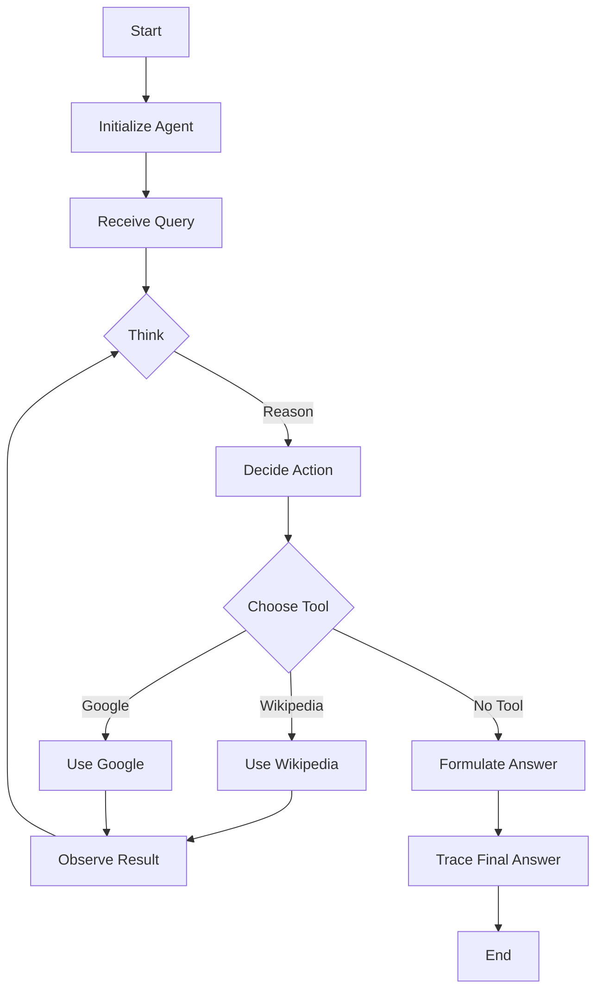

# ReAct Agent: From Hype to Practice
### Build a ReAct agent from scratch with Gemini

## Building a ReAct Agent From Scratch: A No-Hype, 100% Practice Guide

This article cuts through the hype, getting straight to the engineering truth of AI agents. We will get our hands dirty and build a minimal ReAct agent from scratch using Python and the Gemini API.

You will implement the full Thought → Action → Observation loop. This gives you a concrete mental model of how these systems actually work. By the end, you will have a working agent you can extend, debug, and customize with confidence, moving from abstract concepts to practical, real-world skills.

## Setup and Environment

This first section ensures your environment is ready for the hands-on work ahead. We will walk through loading environment variables, importing the necessary libraries like `google-genai` and `pydantic`, and initializing the Gemini client. The objective is to make sure your setup runs the provided notebook seamlessly and that your outputs match the expected traces. This foundational step is crucial before we can define the tools our agent will use.

To begin, set up your Python environment to ensure the code runs smoothly. This involves loading necessary credentials, importing libraries, and initializing the Gemini client. Loading your API key from an environment file is a standard and secure practice to keep secrets out of your source code.
```python
from lessons.utils import env

env.load(required_env_vars=["GOOGLE_API_KEY"])
```
It outputs:
```
Trying to load environment variables from `/Users/fabio/Desktop/course-ai-agents/.env`
Environment variables loaded successfully.
```
Next, import the required libraries. We bring in `enum` and `pydantic` for creating structured data classes, which are essential for defining clear message types and tool requests later. The `google-genai` library provides the client for interacting with the Gemini model, and `lessons.utils.pretty_print` helps us visualize the agent's internal steps.
```python
from enum import Enum
from pydantic import BaseModel, Field
from typing import List

from google import genai
from google.genai import types

from lessons.utils import pretty_print
```
With the API key loaded, initialize the `genai.Client` and select the model that will power our agent's reasoning. For this lesson, we use `gemini-1.5-flash`, a model known for its speed and capabilities, making it well-suited for the tasks we will perform.
```python
client = genai.Client()
```
It outputs:
```
Both GOOGLE_API_KEY and GEMINI_API_KEY are set. Using GOOGLE_API_KEY.
```
Finally, define a constant for the model ID. This practice keeps our code clean and makes it easy to modify the model if needed.
```python
MODEL_ID = "gemini-2.5-flash"
```
With your client and model ready, the next step is to give our agent a capability—a tool it can use to interact with the world.

## Tool Layer: Mock Search Implementation

To demonstrate how external capabilities integrate with the ReAct framework, we will create a mock `search` tool. This approach simplifies our focus to the core ReAct mechanics. By removing the need for external Application Programming Interface (API) keys and complex integrations, we can concentrate on how the agent reasons and acts. A mock tool also provides consistent, predictable responses, which is crucial for reliable testing and understanding the agent's behavior.

Our mock tool is a straightforward Python function that simulates looking up information. It is designed to recognize a few specific queries and return a predefined answer. If it receives a query it does not recognize, it will return a "not found" message, demonstrating a basic fallback mechanism.

Pay close attention to the docstring in the implementation. As we will see later, Gemini's function calling feature uses this docstring to understand what the tool does and how to use it, automatically extracting its purpose and parameters.
```python
def search(query: str) -> str:
    """Search for information about a specific topic or query.

    Args:
        query (str): The search query or topic to look up.
    """
    query_lower = query.lower()

    # Predefined responses for demonstration
    if all(word in query_lower for word in ["capital", "france"]):
        return "Paris is the capital of France and is known for the Eiffel Tower."
    elif "react" in query_lower:
        return "The ReAct (Reasoning and Acting) framework enables LLMs to solve complex tasks by interleaving thought generation, action execution, and observation processing."

    # Generic response for unhandled queries
    return f"Information about '{query}' was not found."
```
The docstring is vital because it serves as the primary description for the tool. When designing tools, ensure their descriptions are clear, concise, and unambiguous, specifying input/output formats and any usage constraints. This clarity helps the large language model (LLM) choose the correct tool and use it properly, reducing errors and simplifying the transition from mock to real-world APIs [[1]](https://docs.getdynamiq.ai/low-code-builder/llm-agents/guide-to-implementing-llm-agents-react-and-simple-agents), [[2]](https://arize.com/blog-course/react-agent-llm/), [[3]](https://www.anthropic.com/research/building-effective-agents).

To manage our agent's tools, we use a tool registry, which is a simple Python dictionary that maps a tool's name to its function. This design allows the model to plan with symbolic tool names, while our code can safely resolve those names to the functions to be executed. This separation is a key practice for building modular and maintainable agents.
```python
TOOL_REGISTRY = {
    search.__name__: search,
}
```
In a real-world application, you could easily replace this mock function with a call to an actual search API, a database query, or any other external data source. This is possible because we design our tools with modularity and a standardized interface in mind. The agent's logic interacts with the tool through a consistent input/output structure, meaning only the tool's underlying implementation needs to change, not the agent's core reasoning or prompt logic [[4]](https://blog.motleycrew.ai/blog/reliable-ai-at-your-fingertips-how-we-built-universal-react-agents-that-just-work), [[5]](https://www.promptingguide.ai/techniques/react), [[6]](https://technofile.substack.com/p/how-to-build-a-react-ai-agent-with), [[7]](https://www.youtube.com/watch?v=Lvrv9I276ps), [[8]](https://maven.com/rakeshgohel/ai-agent-engineering-react-rag-multi-agent).

Now that our agent has a tool, we need to enable it to "think" about when and how to use it.

## Thought Phase: Prompt Construction and Generation

This section focuses on the 'Thought' phase, the initial step in the ReAct loop. We will construct a prompt template that includes tool descriptions and a placeholder for the conversation history. You will learn how this prompt guides the LLM to produce a concise, purposeful thought, directing the agent’s next action.

In the ReAct framework, the 'Thought' phase is where the agent processes the user's input, breaks down complex queries, and determines the best immediate course of action [[9]](https://shafiqulai.github.io/blogs/blog_3.html). This internal monologue, or verbal reasoning trace, is crucial because it makes the agent explicitly state its reasoning before taking any action. This promotes transparency and multi-step problem-solving [[5]](https://www.promptingguide.ai/techniques/react), [[11]](https://arize.com/docs/phoenix/cookbook/prompt-engineering/react-prompting). The LLM is prompted to interpret the request, break it into actionable parts, and formulate an initial plan [[10]](https://www.wordware.ai/blog/why-the-react-agent-matters-how-ai-can-now-reason-and-act).

To help the LLM reason about and select tools, we format their descriptions into an XML-like structure. This helps the model clearly distinguish between tools and understand their functionalities [[12]](https://ai.gopubby.com/react-ai-agent-from-scratch-using-deepseek-handling-memory-tools-without-frameworks-cabda9094273).

1.  We define the `build_tools_xml_description` function. This function takes our `TOOL_REGISTRY` and generates an XML string describing each available tool, using its name and docstring. This XML is then embedded into our main prompt template, giving the LLM an up-to-date overview of its capabilities.
    ```python
    def build_tools_xml_description(tools: dict[str, callable]) -> str:
        """Build a minimal XML description of tools using only their docstrings."""
        lines = []
        for tool_name, fn in tools.items():
            doc = (fn.__doc__ or "").strip()
            lines.append(f"\t<tool name=\"{tool_name}\">")
            if doc:
                lines.append(f"\t\t<description>")
                for line in doc.split("\n"):
                    lines.append(f"\t\t\t{line}")
                lines.append(f"\t\t</description>")
            lines.append(f"\t</tool>")
        return "\n".join(lines)
    
    tools_xml = build_tools_xml_description(TOOL_REGISTRY)
    
    PROMPT_TEMPLATE_THOUGHT = f"""
    You are deciding the next best step for reaching the user goal. You have some tools available to you.
    
    Available tools:
    <tools>
    {tools_xml}
    </tools>
    
    Conversation so far:
    <conversation>
    {{conversation}}
    </conversation>
    
    State your next thought about what to do next as one short paragraph focused on the next action you intend to take and why.
    Avoid repeating the same strategies that didn't work previously. Prefer different approaches.
    """.strip()
    ```

2.  The `PROMPT_TEMPLATE_THOUGHT` guides the LLM's reasoning. It states the agent's role, includes the `<tools>` XML block, and contains a `<conversation>` placeholder for the dialogue history. This allows the agent to consider all previous interactions when formulating its next step. The final instruction directs the LLM to produce a short paragraph about its intended action and reasoning.
    ```python
    print(PROMPT_TEMPLATE_THOUGHT)
    ```
    It outputs:
    ```
    You are deciding the next best step for reaching the user goal. You have some tools available to you.
    
    Available tools:
    <tools>
    	<tool name="search">
    		<description>
    			Search for information about a specific topic or query.
    			
    			Args:
    			    query (str): The search query or topic to look up.
    		</description>
    	</tool>
    </tools>
    
    Conversation so far:
    <conversation>
    {conversation}
    </conversation>
    
    State your next thought about what to do next as one short paragraph focused on the next action you intend to take and why.
    Avoid repeating the same strategies that didn't work previously. Prefer different approaches.
    ```
    When we print the prompt, we see exactly how information is presented to the LLM. The output shows the agent's objective, the `search` tool's details, and the dynamic `<conversation>` placeholder. This structured prompt design is fundamental for effective reasoning, as it provides the LLM with all necessary context to generate a coherent thought [[5]](https://www.promptingguide.ai/techniques/react).

3.  Finally, we wrap this logic in a function, `generate_thought`. This function takes the current conversation history, formats the prompt, sends it to the Gemini model, and returns the model's response as the agent's thought.
    ```python
    def generate_thought(conversation: str, tool_registry: dict[str, callable]) -> str:
        """Generate a thought as plain text (no structured output)."""
        tools_xml = build_tools_xml_description(tool_registry)
        prompt = PROMPT_TEMPLATE_THOUGHT.format(conversation=conversation, tools_xml=tools_xml)
    
        response = client.models.generate_content(
            model=MODEL_ID,
            contents=prompt
        )
        return response.text.strip()
    ```
With a thought generated, the agent must translate this intention into a concrete action.

## Action Phase: Function Calling and Parsing

In this section, we build the 'Action' component, which determines the agent's next move using Gemini's function calling. We will analyze the system prompt strategy and explain how Gemini automatically uses function docstrings as tool descriptions. The focus is on the implementation, from configuring Gemini to parsing the response to differentiate between a tool call and a final answer.

The "Action" phase is where the agent decides its next move: call a tool or provide a final answer. We use Gemini's native function calling for this. Instead of returning text, the model can return a structured `FunctionCall` object specifying the tool and its arguments [[13]](https://ai.google.dev/gemini-api/docs/function-calling). This is more reliable than parsing free-form text and reduces error risk [[14]](https://www.leewayhertz.com/react-agents-vs-function-calling-agents/).

Our action-generation prompt is simpler than the thought prompt. We pass tool functions directly to the Gemini API, which automatically extracts the name, description, and parameters from the function's signature and docstring [[15]](https://developers.googleblog.com/en/building-agents-google-gemini-open-source-frameworks/). This keeps our prompt clean and separates strategic guidance from technical details [[12]](https://ai.gopubby.com/react-ai-agent-from-scratch-using-deepseek-handling-memory-tools-without-frameworks-cabda9094273), [[16]](https://ai.google.dev/gemini-api/docs/langgraph-example).

Here are the prompt templates for the action phase:
```python
PROMPT_TEMPLATE_ACTION = """
You are selecting the best next action to reach the user goal.

Conversation so far:
<conversation>
{conversation}
</conversation>

Respond either with a tool call (with arguments) or a final answer if you can confidently conclude.
""".strip()

# Dedicated prompt used when we must force a final answer
PROMPT_TEMPLATE_ACTION_FORCED = """
You must now provide a final answer to the user.

Conversation so far:
<conversation>
{conversation}
</conversation>

Provide a concise final answer that best addresses the user's goal.
""".strip()
```
We also define Pydantic models to structure the two possible outcomes: a `ToolCallRequest` or a `FinalAnswer`. This ensures the output is predictable and easy to parse.
```python
class ToolCallRequest(BaseModel):
    """A request to call a tool with its name and arguments."""
    tool_name: str = Field(description="The name of the tool to call.")
    arguments: dict = Field(description="The arguments to pass to the tool.")


class FinalAnswer(BaseModel):
    """A final answer to present to the user when no further action is needed."""
    text: str = Field(description="The final answer text to present to the user.")
```
The core of this phase is the `generate_action` function. It configures the Gemini client with the appropriate prompt and tools. The model will either return a text response (a final answer) or a `FunctionCall` object. Our function parses this output into a structured `ToolCallRequest` or `FinalAnswer`. We also include a `force_final` flag to handle cases where the agent must conclude, preventing infinite loops and ensuring a graceful exit [[1]](https://docs.getdynamiq.ai/low-code-builder/llm-agents/guide-to-implementing-llm-agents-react-and-simple-agents).

The diagram below illustrates this process, showing how the application and model interact.


Figure 1: Overview of Gemini's function calling mechanism. (Media from [[13]](https://ai.google.dev/gemini-api/docs/function-calling))

Here is the implementation of the `generate_action` function:
```python
def generate_action(conversation: str, tool_registry: dict[str, callable] | None = None, force_final: bool = False) -> (ToolCallRequest | FinalAnswer):
    """Generate an action by passing tools to the LLM and parsing function calls or final text.

    When force_final is True or no tools are provided, the model is instructed to produce a final answer and tool calls are disabled.
    """
    # Use a dedicated prompt when forcing a final answer or no tools are provided
    if force_final or not tool_registry:
        prompt = PROMPT_TEMPLATE_ACTION_FORCED.format(conversation=conversation)
        response = client.models.generate_content(
            model=MODEL_ID,
            contents=prompt
        )
        return FinalAnswer(text=response.text.strip())

    # Default action prompt
    prompt = PROMPT_TEMPLATE_ACTION.format(conversation=conversation)

    # Provide the available tools to the model; disable auto-calling so we can parse and run ourselves
    tools = list(tool_registry.values())
    config = types.GenerateContentConfig(
        tools=tools,
        automatic_function_calling={"disable": True}
    )
    response = client.models.generate_content(
        model=MODEL_ID,
        contents=prompt,
        config=config
    )

    # Extract the function call from the response (if present)
    candidate = response.candidates[0]
    parts = candidate.content.parts
    if parts and getattr(parts[0], "function_call", None):
        name = parts[0].function_call.name
        args = dict(parts[0].function_call.args) if parts[0].function_call.args is not None else {}
        return ToolCallRequest(tool_name=name, arguments=args)
    
    # Otherwise, it's a final answer
    final_answer = "".join(part.text for part in candidate.content.parts)
    return FinalAnswer(text=final_answer.strip())
```
Now we have all the individual components. It is time to assemble them into a cohesive control loop that orchestrates the entire ReAct process.

## Control Loop: Messages, Scratchpad, Orchestration

This is where we implement the core engine that drives our ReAct agent: the control loop. This loop orchestrates the Thought → Action → Observation cycle. You will learn how to use a 'scratchpad' to maintain conversation history and how the loop integrates observations from tool execution back into the agent's reasoning process. We will present the full `react_agent_loop` function, detailing its logic, state management, and termination.

The control loop is the heart of our agent, managing the iterative flow of the ReAct cycle until the user's question is answered or a limit is reached. A crucial component is the 'scratchpad,' which maintains the conversation history and the agent's internal state. This running log of thoughts, actions, and observations provides the agent with a memory of its past steps, which is essential for informing its subsequent reasoning and ensuring transparency [[17]](https://www.dailydoseofds.com/ai-agents-crash-course-part-10-with-implementation/), [[18]](https://geekyants.com/blog/implementing-ai-agents-from-scratch-using-langchain-and-openai).


Figure 2: Overview of ReAct Agent Design. (Media from [[12]](https://ai.gopubby.com/react-ai-agent-from-scratch-using-deepseek-handling-memory-tools-without-frameworks-cabda9094273))

To manage this history, we first define a structured data system. We use an `Enum` for `MessageRole` to categorize interactions and a `Pydantic` model for `Message` to ensure every entry is structured. This systematic logging provides a transparent and traceable history of the agent’s decision-making process [[19]](https://airbyte.com/data-engineering-resources/using-langchain-react-agents).

1.  We define the `MessageRole` enumeration to clearly distinguish between message types.
    ```python
    class MessageRole(str, Enum):
        """Enumeration for the different roles a message can have."""
        USER = "user"
        THOUGHT = "thought"
        TOOL_REQUEST = "tool request"
        OBSERVATION = "observation"
        FINAL_ANSWER = "final answer"
    ```

2.  Next, the `Message` Pydantic model encapsulates the role and content of each message.
    ```python
    class Message(BaseModel):
        """A message with a role and content, used for all message types."""
        role: MessageRole = Field(description="The role of the message in the ReAct loop.")
        content: str = Field(description="The textual content of the message.")
    
        def __str__(self) -> str:
            """Provides a user-friendly string representation of the message."""
            return f"{self.role.value.capitalize()}: {self.content}"
    ```
We also add a helper function for pretty-printing messages, which makes it easy to follow the agent's trace during testing. This verbose logging is a key debugging strategy [[22]](https://www.neradot.com/post/building-a-python-react-agent-class-a-step-by-step-guide).

3.  This helper function formats and prints each message with a clear title and color-coding.
    ```python
    def pretty_print_message(message: Message, turn: int, max_turns: int, header_color: str = pretty_print.Color.YELLOW, is_forced_final_answer: bool = False) -> None:
        if not is_forced_final_answer:
            title = f"{message.role.value.capitalize()} (Turn {turn}/{max_turns}):"
        else:
            title = f"{message.role.value.capitalize()} (Forced):"
    
        pretty_print.wrapped(
            text=message.content,
            title=title,
            header_color=header_color,
        )
    ```
The `Scratchpad` class will manage the list of messages, providing a method to append new messages and an option to print them verbosely.

4.  The `Scratchpad` class acts as a container for our `Message` objects.
    ```python
    class Scratchpad:
        """Container for ReAct messages with optional pretty-print on append."""
    
        def __init__(self, max_turns: int) -> None:
            self.messages: List[Message] = []
            self.max_turns: int = max_turns
            self.current_turn: int = 1
    
        def set_turn(self, turn: int) -> None:
            self.current_turn = turn
    
        def append(self, message: Message, verbose: bool = False, is_forced_final_answer: bool = False) -> None:
            self.messages.append(message)
            if verbose:
                role_to_color = {
                    MessageRole.USER: pretty_print.Color.RESET,
                    MessageRole.THOUGHT: pretty_print.Color.ORANGE,
                    MessageRole.TOOL_REQUEST: pretty_print.Color.GREEN,
                    MessageRole.OBSERVATION: pretty_print.Color.YELLOW,
                    MessageRole.FINAL_ANSWER: pretty_print.Color.CYAN,
                }
                header_color = role_to_color.get(message.role, pretty_print.Color.YELLOW)
                pretty_print_message(
                    message=message,
                    turn=self.current_turn,
                    max_turns=self.max_turns,
                    header_color=header_color,
                    is_forced_final_answer=is_forced_final_answer,
                )
    
        def to_string(self) -> str:
            return "\n".join(str(m) for m in self.messages)
    ```
Now, we build the main `react_agent_loop` function. This function manages the iterative cycle, ensuring the agent progresses toward its goal while maintaining a clear state. This systematic approach to state management is crucial for the agent's coherence [[20]](https://dylancastillo.co/posts/react-agent-langgraph.html).

The following diagram illustrates the flow of our ReAct agent's control loop.

Figure 3: Flowchart of the ReAct agent control loop.

1.  The `react_agent_loop` function begins by initializing the `Scratchpad` and adding the user's initial question.
    ```python
    def react_agent_loop(initial_question: str, tool_registry: dict[str, callable], max_turns: int = 5, verbose: bool = False) -> str:
        """
        Implements the main ReAct (Thought -> Action -> Observation) control loop.
        Uses a unified message class for the scratchpad.
        """
        scratchpad = Scratchpad(max_turns=max_turns)
    
        # Add the user's question to the scratchpad
        user_message = Message(role=MessageRole.USER, content=initial_question)
        scratchpad.append(user_message, verbose=verbose)
    
        for turn in range(1, max_turns + 1):
            scratchpad.set_turn(turn)
    ```

2.  Within the main loop, the agent generates a `Thought` based on the current `scratchpad` content. This thought is then appended to the `scratchpad`, making the agent's reasoning explicit [[17]](https://www.dailydoseofds.com/ai-agents-crash-course-part-10-with-implementation/).
    ```python
            # Generate a thought based on the current scratchpad
            thought_content = generate_thought(
                scratchpad.to_string(),
                tool_registry,
            )
            thought_message = Message(role=MessageRole.THOUGHT, content=thought_content)
            scratchpad.append(thought_message, verbose=verbose)
    ```

3.  Following the thought, the agent generates an `Action` by calling `generate_action`, which decides whether to use a tool or provide a final answer.
    ```python
            # Generate an action based on the current scratchpad
            action_result = generate_action(
                scratchpad.to_string(),
                tool_registry=tool_registry,
            )
    ```

4.  If the `action_result` is a `FinalAnswer`, the loop terminates, and the answer is returned.
    ```python
            # If the model produced a final answer, return it
            if isinstance(action_result, FinalAnswer):
                final_answer = action_result.text
                final_message = Message(role=MessageRole.FINAL_ANSWER, content=final_answer)
                scratchpad.append(final_message, verbose=verbose)
                return final_answer
    ```

5.  If the `action_result` is a `ToolCallRequest`, the agent executes the tool. The tool's output becomes the `Observation`, which is added back to the `scratchpad`. This feedback is critical because it directly influences the agent's subsequent steps, enabling it to dynamically adapt its strategy [[17]](https://www.dailydoseofds.com/ai-agents-crash-course-part-10-with-implementation/), [[20]](https://dylancastillo.co/posts/react-agent-langgraph.html), [[23]](https://www.nutrient.io/blog/rewoo-vs-react-choosing-right-agent-architecture/). We also include robust error handling to gracefully manage tool failures.
    ```python
            # Otherwise, it is a tool request
            if isinstance(action_result, ToolCallRequest):
                action_name = action_result.tool_name
                action_params = action_result.arguments
    
                # Add the action to the scratchpad
                params_str = ", ".join([f"{k}='{v}'" for k, v in action_params.items()])
                action_content = f"{action_name}({params_str})"
                action_message = Message(role=MessageRole.TOOL_REQUEST, content=action_content)
                scratchpad.append(action_message, verbose=verbose)
    
                # Run the action and get the observation
                observation_content = ""
                tool_function = tool_registry[action_name]
                try:
                    observation_content = tool_function(**action_params)
                except Exception as e:
                    observation_content = f"Error executing tool '{action_name}': {e}"
    
                # Add the observation to the scratchpad
                observation_message = Message(role=MessageRole.OBSERVATION, content=observation_content)
                scratchpad.append(observation_message, verbose=verbose)
    ```
Finally, the loop includes a crucial termination condition. If the `max_turns` limit is reached, the agent is forced to generate a final answer. This mechanism is vital for preventing infinite loops and ensuring a graceful exit, balancing performance and accuracy [[1]](https://docs.getdynamiq.ai/low-code-builder/llm-agents/guide-to-implementing-llm-agents-react-and-simple-agents), [[21]](https://dev.to/jamesli/react-vs-plan-and-execute-a-practical-comparison-of-llm-agent-patterns-4gh9). For debugging, verbose logging is an effective strategy to trace state transitions and identify issues early [[20]](https://dylancastillo.co/posts/react-agent-langgraph.html), [[22]](https://www.neradot.com/post/building-a-python-react-agent-class-a-step-by-step-guide).

6.  This final block ensures that if the maximum number of turns is reached, the agent will provide a conclusive answer.
    ```python
            # Check if the maximum number of turns has been reached. If so, force the action selector to produce a final answer
            if turn == max_turns:
                forced_action = generate_action(
                    scratchpad.to_string(),
                    force_final=True,
                )
                if isinstance(forced_action, FinalAnswer):
                    final_answer = forced_action.text
                else:
                    final_answer = "Unable to produce a final answer within the allotted turns."
                final_message = Message(role=MessageRole.FINAL_ANSWER, content=final_answer)
                scratchpad.append(final_message, verbose=verbose, is_forced_final_answer=True)
                return final_answer
    ```
The example below illustrates a ReAct agent in action, demonstrating how it interleaves thoughts, actions, and observations to solve a multi-hop question.


Figure 4: A ReAct agent in action. (Media from [[24]](https://arxiv.org/abs/2210.03629))

With the full loop implemented, it is time to test our agent and see it in action.

## Tests and Traces: Success and Graceful Fallback

To conclude our hands-on implementation, we will validate the complete ReAct agent with two distinct tests. The first uses a factual question to demonstrate a successful run, while the second uses an unsupported query to show how the agent handles failure and forced termination. We will analyze the printed traces for both runs to ensure the loop, tool integration, and fallback mechanisms behave as designed.

### Test Case 1: A Factual Question (Success Path)
First, let's ask a question our mock `search` tool knows how to answer: "What is the capital of France?" We will limit the agent to two turns and run the loop with `verbose=True` to see the full trace of its thought process.
```python
# A straightforward question requiring a search.
question = "What is the capital of France?"
final_answer = react_agent_loop(question, TOOL_REGISTRY, max_turns=2, verbose=True)
```
The output trace clearly shows the ReAct cycle in action:
```
----------------------------------------- User (Turn 1/2): ----------------------------------------- 
What is the capital of France?
---------------------------------------------------------------------------------------------------- 
--------------------------------------- Thought (Turn 1/2): --------------------------------------- 
I need to find the capital of France to answer the user's question. The `search` tool can be used to retrieve this factual information.
---------------------------------------------------------------------------------------------------- 
------------------------------------- Tool request (Turn 1/2): ------------------------------------- 
search(query='capital of France')
---------------------------------------------------------------------------------------------------- 
------------------------------------- Observation (Turn 1/2): ------------------------------------- 
Paris is the capital of France and is known for the Eiffel Tower.
---------------------------------------------------------------------------------------------------- 
--------------------------------------- Thought (Turn 2/2): --------------------------------------- 
I have successfully found the capital of France using the search tool. The next step is to communicate this answer to the user.
---------------------------------------------------------------------------------------------------- 
------------------------------------- Final answer (Turn 2/2): ------------------------------------- 
Paris is the capital of France.
---------------------------------------------------------------------------------------------------- 
```
This trace validates that the entire end-to-end loop works as intended. The agent correctly identifies the need for a tool, generates a valid tool call, executes it, processes the observation, and then uses that new information to formulate a final answer.

### Test Case 2: An Unknown Question (Graceful Fallback)
Now, let's test the agent's ability to handle a query our mock tool does not know about: "What is the capital of Italy?" This will test the agent's reasoning when a tool fails and demonstrate the forced termination logic.
```python
# A question about a concept the mock search tool doesn't know.
question = "What is the capital of Italy?"
final_answer = react_agent_loop(question, TOOL_REGISTRY, max_turns=2, verbose=True)
```
The trace for this query demonstrates the agent's ability to adapt and handle failure gracefully:
```
----------------------------------------- User (Turn 1/2): ----------------------------------------- 
What is the capital of Italy?
---------------------------------------------------------------------------------------------------- 
--------------------------------------- Thought (Turn 1/2): --------------------------------------- 
I need to find the capital of Italy to answer the user's question. The `search` tool can provide this information efficiently. I will use the `search` tool to find the capital of Italy.
---------------------------------------------------------------------------------------------------- 
------------------------------------- Tool request (Turn 1/2): ------------------------------------- 
search(query='capital of Italy')
---------------------------------------------------------------------------------------------------- 
------------------------------------- Observation (Turn 1/2): ------------------------------------- 
Information about 'capital of Italy' was not found.
---------------------------------------------------------------------------------------------------- 
--------------------------------------- Thought (Turn 2/2): --------------------------------------- 
The previous search query "capital of Italy" did not return information, which is unexpected for a common fact. I will try a broader search query like "Italy" to see if more general information or a list of facts about Italy can provide the capital, as the tool might respond better to less specific phrasing or have had a temporary issue with the exact previous query.
---------------------------------------------------------------------------------------------------- 
------------------------------------- Tool request (Turn 2/2): ------------------------------------- 
search(query='Italy')
---------------------------------------------------------------------------------------------------- 
------------------------------------- Observation (Turn 2/2): ------------------------------------- 
Information about 'Italy' was not found.
---------------------------------------------------------------------------------------------------- 
-------------------------------------- Final answer (Forced): -------------------------------------- 
I'm sorry, but I couldn't find information about the capital of Italy.
---------------------------------------------------------------------------------------------------- 
```
This test confirms that our agent does not get stuck in a loop when its tools fail, preventing common failure modes like improper loop termination or error propagation [[1]](https://docs.getdynamiq.ai/low-code-builder/llm-agents/guide-to-implementing-llm-agents-react-and-simple-agents), [[25]](https://huyenchip.com/2025/01/07/agents.html). It recognizes the failure, attempts an alternative strategy, and provides a sensible final response after hitting the `max_turns` limit. This resilience is a key feature of a well-designed agent. Using verbose logging, as we have done here, is also a crucial debugging strategy to trace the agent's internal state and identify issues early [[22]](https://www.neradot.com/post/building-a-python-react-agent-class-a-step-by-step-guide).

## Conclusion: From a Loop to a Foundation

By building this agent piece by piece, you have moved beyond abstract diagrams and hype. You have implemented the core engine that powers autonomous agents: a control loop that iteratively reasons, acts, and observes. You now have a concrete mental model of how an agent uses prompts to think, leverages function calling to act, and incorporates feedback to refine its approach. This is not magic; it is engineering.

This foundational understanding is critical. You can now debug, customize, and extend agentic systems with confidence. We will build upon this foundation in upcoming lessons to explore more advanced topics. For instance, Lesson 9: Agent Memory & Knowledge will show you how to give your agent memory to recall past interactions.

Lesson 10: RAG Deep Dive will teach you to use Retrieval-Augmented Generation (RAG) to augment its knowledge. This transforms a simple loop into a powerful, production-ready system.

## References

- [[1]](https://docs.getdynamiq.ai/low-code-builder/llm-agents/guide-to-implementing-llm-agents-react-and-simple-agents) Guide to Implementing LLM Agents: ReAct and Simple Agents - DynamiQ
- [[2]](https://arize.com/blog-course/react-agent-llm/) How to Build a ReAct Agent from Scratch with LLMs - Arize AI
- [[3]](https://www.anthropic.com/research/building-effective-agents) Building effective agents - Anthropic
- [[4]](https://blog.motleycrew.ai/blog/reliable-ai-at-your-fingertips-how-we-built-universal-react-agents-that-just-work) Reliable AI at Your Fingertips: How We Built Universal ReAct Agents That Just Work - Motley Crew AI
- [[5]](https://www.promptingguide.ai/techniques/react) ReAct - Prompting Guide
- [[6]](https://technofile.substack.com/p/how-to-build-a-react-ai-agent-with) How to build a ReAct AI agent with Python from scratch - Technofile
- [[7]](https://www.youtube.com/watch?v=Lvrv9I276ps) LangChain Crash Course for Beginners - Custom Tools for Agents - Patrick Loeber
- [[8]](https://maven.com/rakeshgohel/ai-agent-engineering-react-rag-multi-agent) AI Agent Engineering: ReAct, RAG, & Multi-Agent - Rakesh Gohel
- [[9]](https://shafiqulai.github.io/blogs/blog_3.html) ReAct: The Future of AI-Powered Problem Solving - Shafiqul Islam
- [[10]](https://www.wordware.ai/blog/why-the-react-agent-matters-how-ai-can-now-reason-and-act) Why the ReAct Agent Matters: How AI Can Now Reason and Act - Wordware
- [[11]](https://arize.com/docs/phoenix/cookbook/prompt-engineering/react-prompting) ReAct Prompting - Arize AI
- [[12]](https://ai.gopubby.com/react-ai-agent-from-scratch-using-deepseek-handling-memory-tools-without-frameworks-cabda9094273) ReAct AI Agent from Scratch using DeepSeek: Handling Memory & Tools without Frameworks - GoPubby
- [[13]](https://ai.google.dev/gemini-api/docs/function-calling) Function calling with the Gemini API - Google AI for Developers
- [[14]](https://www.leewayhertz.com/react-agents-vs-function-calling-agents/) ReAct Agents vs. Function Calling Agents: A Comparative Analysis - LeewayHertz
- [[15]](https://developers.googleblog.com/en/building-agents-google-gemini-open-source-frameworks/) Building agents with Google Gemini and open source frameworks - Google for Developers Blog
- [[16]](https://ai.google.dev/gemini-api/docs/langgraph-example) ReAct agent from scratch with Gemini 2.5 and LangGraph - Google AI for Developers
- [[17]](https://www.dailydoseofds.com/ai-agents-crash-course-part-10-with-implementation/) AI Agents Crash Course (Part 10): The ReAct Agentic Pattern - Daily Dose of DS
- [[18]](https://geekyants.com/blog/implementing-ai-agents-from-scratch-using-langchain-and-openai) Implementing AI Agents from Scratch Using LangChain and OpenAI - GeekyAnts
- [[19]](https://airbyte.com/data-engineering-resources/using-langchain-react-agents) Using LangChain ReAct Agents for Data Engineering Tasks - Airbyte
- [[20]](https://dylancastillo.co/posts/react-agent-langgraph.html) Building a ReAct Agent in LangGraph - Dylan Castillo
- [[21]](https://dev.to/jamesli/react-vs-plan-and-execute-a-practical-comparison-of-llm-agent-patterns-4gh9) ReAct vs. Plan-and-Execute: A Practical Comparison of LLM Agent Patterns - James Li
- [[22]](https://www.neradot.com/post/building-a-python-react-agent-class-a-step-by-step-guide) Building a Python ReAct Agent Class: A Step-by-Step Guide - Nerando
- [[23]](https://www.nutrient.io/blog/rewoo-vs-react-choosing-right-agent-architecture/) ReWOO vs. ReAct: Choosing the Right Agent Architecture for Your Needs - Nutrient
- [[24]](https://arxiv.org/abs/2210.03629) ReAct: Synergizing Reasoning and Acting in Language Models - Yao et al., 2022
- [[25]](https://huyenchip.com/2025/01/07/agents.html) LLM Agents - Lilian Weng