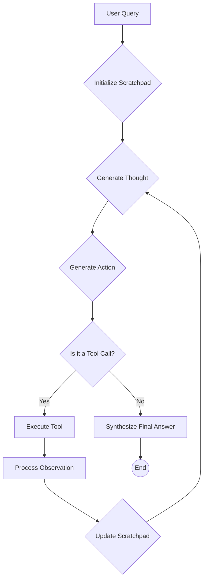

# AI Agents: From Hype to Hands-On
### Build a ReAct agent from scratch

## From Hype to Hands-On: Building a Real AI Agent from Scratch

AI agents are the latest trend, promising autonomous systems that can reason, plan, and act. But if you look past the hype, you will find that most of these so-called "agents" are just sophisticated loops of code calling a Large Language Model (LLM). The real engineering isn't in the magic, but in the mechanics of making that loop robust, debuggable, and genuinely useful.

This article will cut through the noise and get straight to the practical engineering. We will build a simple ReAct agent from scratch using only Python and the Gemini API. The ReAct (Reason and Act) pattern underpins many modern agentic systems. Its core is a `Thought -> Action -> Observation` cycle [1](https://arxiv.org/pdf/2210.03629), [2](https://www.ibm.com/think/topics/react-agent).

Understanding these fundamental mechanics is critical for any engineer looking to build, debug, and maintain the agentic systems that power production applications. This hands-on guide provides a foundational codebase. More importantly, it offers the mental model needed to ship real-world AI applications, moving from abstract theory to concrete implementation.

## Step 1: Build the Tool Layer with a Mock Search Function

Before our agent can act, it needs tools. For any real-world task, an agent must interact with external systems—Application Programming Interfaces (APIs), databases, or search engines—to gather information it does not possess. However, integrating live APIs introduces complexity, dependencies, and potential unpredictability. When learning the core logic of an agent, these factors are just noise.

That is why we start by building a mock search tool. This approach simplifies our learning focus to the core mechanics of the ReAct agent, allowing us to concentrate on the reasoning and action loop without getting bogged down in API authentication, network latency, or rate limits [3](https://www.datacamp.com/tutorial/agentic-rag-tutorial), [4](https://www.youtube.com/watch?v=aijS9fWB854).

A mock tool also provides consistent, predictable responses, which is essential for testing and debugging the agent's behavior in a controlled environment [5](https://www.singlestore.com/blog/a-guide-to-retrieval-augmented-generation-rag/). Furthermore, it removes the need for external API keys, making the code self-contained and easy to run for anyone. This controlled environment is particularly beneficial in educational settings, ensuring repeatability and reproducibility for all learners [6](https://hiringnet.com/exercise-4-and-5-rag-with-react-reflection-for-10-k-filings/).

Our goal is to create a simple Python function that simulates a search engine. The implementation is straightforward, but pay close attention to the function's signature and its docstring. First, let's define the `search` function.
```python
def search(query: str) -> str:
    """
    Search for information about a specific topic or query.

    Args:
        query (str): The search query or topic to look up

    Returns:
        str: Search results containing information about the queried topic

    Note:
        This is a simple mocked search tool for demonstration purposes.
        In a real scenario, this would call a search API like Google Search,
        Bing Search, or a specialized knowledge base API.
    """
    query_lower = query.lower()

    # Predefined responses for demonstration
    if all(word in query_lower for word in ["capital", "france"]):
        return "Paris is the capital of France and is known for the Eiffel Tower."
    elif "react" in query_lower:
        return "The ReAct (Reasoning and Acting) framework enables LLMs to solve complex tasks by interleaving thought generation, action execution, and observation processing."

    # Generic response for unhandled queries
    return f"Mock search result: Information about '{query}' was not found in the predefined mock responses. A real search tool would provide more."
```
This function takes a `query` string and returns a hardcoded response if the query matches predefined keywords. If no match is found, it returns a generic "not found" message. This behavior is simple but sufficient to test our agent's ability to call a tool and process its output.

The Gemini Python SDK simplifies tool integration. When you pass a Python function directly to the model's tool configuration, the SDK uses its structure to define the tool for the LLM. The function's docstring acts as the tool's description, its name becomes the tool's identifier, and its parameter types and names guide the LLM on required arguments. This approach means you can focus on writing clean, well-documented Python functions, and the SDK manages the process of defining the tool's capabilities for the LLM. In a production system, you could easily swap this mock function with a real one that calls an external API, and as long as the signature and purpose remain the same, the agent's logic would not need to change [7](https://googleapis.github.io/python-genai/).

## Step 2: Implement the Thought Phase with Structured Outputs

With our tool ready, the next step is to implement the "Thought" phase of the ReAct cycle. This is where the agent pauses to reason about the task, analyze the current situation, and decide on a plan. Simply asking an LLM to "think" can result in unstructured, free-form text that is difficult to parse and use reliably in an automated system. This is where many agent implementations fail; they become a nightmare of string parsing and regular expressions.

A more robust engineering approach is to force the LLM to generate its thoughts in a structured format, like JSON. Structured outputs are predictable, easy to validate, and can be directly deserialized into objects in our code, eliminating parsing errors and improving reliability.

This method enhances consistency, reduces errors from malformed data, provides type safety by allowing direct parsing into typed objects, and is integration-ready for production systems. By defining models with Pydantic, we ensure schema validation, robust error handling, and reliable integration points, which are critical for multi-step reasoning in agents [8](https://python.useinstructor.com/blog/2023/09/11/generating-structured-output--json-from-llms/), [9](https://python.langchain.com/docs/how_to/structured_output/), [10](https://humanloop.com/blog/structured-outputs/), [11](https://pydantic.dev/articles/llm-intro/).

To guide the agent's reasoning, we'll start with a system prompt. This prompt sets the context and instructs the LLM on how to behave.
```python
SYSTEM_PROMPT_THOUGHT = """
Your task is to break down the user's question into smaller, answerable information retrieval steps and create a plan to gather all necessary data.

1.  What information is needed to answer the question? (Break down into granular pieces.)
2.  What is the plan to retrieve this information, step-by-step? (Focus on what information to get, not how to get it.)

Prioritize external information retrieval for all factual data. Never trust your internal knowledge.
""".strip()
```
This prompt directs the model to focus on two key aspects: identifying necessary information and creating a step-by-step plan. Crucially, it commands the agent to "never trust your internal knowledge," forcing it to rely on its tools for factual data, which helps mitigate hallucination.

Next, we define the desired JSON structure using a Pydantic `BaseModel`. Pydantic models are a clean way to define data schemas in Python, and the Gemini SDK integrates with them seamlessly.
```python
from pydantic import BaseModel

class ThoughtResponse(BaseModel):
    thought: str
```
Our `ThoughtResponse` model is simple: it expects a JSON object with a single key, `thought`, containing a string. Now, we can create the function to generate the thought. We'll combine our system prompt, the current conversation history (the "scratchpad"), and our Pydantic model to configure the Gemini client.
```python
from google.genai import types

PROMPT_TEMPLATE_THOUGHT = """
Conversation so far:

<conversation>
{conversation}
</conversation>

What is your thought about the next step?
""".strip()

def generate_thought(conversation: str) -> str:
    """Generate a thought using structured output"""
    prompt = PROMPT_TEMPLATE_THOUGHT.format(conversation=conversation)

    response = client.models.generate_content(
        model=MODEL_ID,
        contents=prompt,
        config=types.GenerateContentConfig(
            system_instruction=SYSTEM_PROMPT_THOUGHT,
            response_mime_type="application/json",
            response_schema=ThoughtResponse
        )
    )
    return response.parsed.thought
```
Let's break down the configuration in `generate_thought`. We provide the `SYSTEM_PROMPT_THOUGHT` via the `system_instruction` parameter. We set `response_mime_type` to `"application/json"` to tell the model we expect a JSON response. We pass our `ThoughtResponse` Pydantic model to `response_schema`. This is where the magic happens. The Gemini SDK automatically converts our Pydantic model into a JSON schema, sends it to the API, and ensures the model's output conforms to it [12](https://ai.google.dev/gemini-api/docs/structured-output).

The best part is how we handle the response. Instead of getting a raw JSON string and parsing it manually, we can access `response.parsed`. The SDK automatically validates the JSON response against our `ThoughtResponse` schema and gives us an instantiated Pydantic object. We can then simply access `response.parsed.thought` to get the reasoning string. This makes the code cleaner, safer, and much easier to maintain.

## Step 3: Implement the Action Phase with Function Calling

After the agent thinks, it must act. The "Action" phase is where the agent decides what to do next based on its thought process. This could be calling a tool to gather more information or, if it has enough data, providing a final answer to the user. We implement this using Gemini's native function-calling capabilities.

Using native function calling is a cleaner approach than trying to coax the model into generating tool-use syntax through prompt engineering alone. When we provide function definitions directly to the model, it can focus its reasoning on *whether* to use a tool and *what* to use it for, rather than getting bogged down in the syntax of how to call it.

First, let's look at the system prompt for the action phase. It is surprisingly minimal.
```python
SYSTEM_PROMPT_ACTION = """
Prioritize external information retrieval for all factual data. Never trust your internal knowledge.
""".strip()
```
This prompt is simple because we do not need to describe our tools here. As we saw in the first step, the Gemini SDK directly uses the Python function itself to define the tool for the LLM. The function's name becomes the tool's identifier, its docstring serves as the tool's description, and its parameter types and names guide the LLM on required arguments. This separation of concerns is a powerful design pattern: the system prompt guides the agent's high-level strategy, while the tool definitions provide its specific capabilities.

Now, let's implement the `generate_action` function. This function will take the conversation history, configure the model with our `search` tool, and then parse the model's response to determine the next action.
```python
from typing import Union

# A mapping of tool names to their functions
TOOL_REGISTRY = {
    search.__name__: search,
}

# Modeling the "finish" action
ACTION_FINISH = "finish"
class ActionFinishObject(BaseModel):
    text: str


def generate_action(conversation: str) -> tuple[str, Union[dict, ActionFinishObject]]:
    """Generate an action using function calling or direct text response"""
    prompt = PROMPT_TEMPLATE_ACTION.format(conversation=conversation)

    response = client.models.generate_content(
        model=MODEL_ID,
        contents=prompt,
        config=types.GenerateContentConfig(
            system_instruction=SYSTEM_PROMPT_ACTION,
            tools=[search],
            automatic_function_calling={'disable': True}
        )
    )

    # Check if response contains a function call or text
    response_part = response.candidates[0].content.parts[0]

    if hasattr(response_part, 'function_call') and response_part.function_call:
        function_call = response_part.function_call
        action_name = function_call.name
        action_params = dict(function_call.args)
        return action_name, action_params
    else:
        # It's a text response (final answer)
        return ACTION_FINISH, ActionFinishObject(text=response.text)
```
Here’s a breakdown of the implementation. We define a `TOOL_REGISTRY` to map tool names to their functions. We configure the `generate_content` call by passing our `[search]` function in the `tools` list. We disable `automatic_function_calling` because we want to manually control the execution loop. The core logic lies in parsing the response. The Gemini API will either return a `function_call` object or a standard text response [13](https://codelabs.developers.google.com/codelabs/gemini-function-calling), [14](https://cloud.google.com/vertex-ai/generative-ai/docs/multimodal/function-calling), [15](https://geminibyexample.com/021-tool-use-function-calling).

We check if `response_part` has a `function_call` attribute. If it does, we extract its `name` and `args`. If there is no `function_call` object, we interpret the model's response as the final answer. This function neatly separates decision-making from execution, providing a clean, structured output: either a tool to call with its parameters or a final answer.

## Step 4: Create the ReAct Control Loop and Test the Agent

You have built the individual components for the 'Thought' and 'Action' phases. Now, assemble them into a functioning ReAct control loop. This loop orchestrates the entire `Thought -> Action -> Observation` cycle, manages your agent's state, executes tools, and processes observations to drive the agent toward a final answer.

### Message Structure Foundation
To manage the conversation history and the agent's internal monologue, you need a structured way to store each step of the process. We will define a `Message` class using Pydantic and a `MessageRole` enum to categorize each entry in your agent's "scratchpad"—the term used in the original ReAct paper for the agent's working memory [1](https://arxiv.org/pdf/2210.03629).
```python
from enum import Enum
from typing import List

class MessageRole(str, Enum):
    """Enumeration for the different roles a message can have."""
    USER = "user"
    THOUGHT = "thought"
    TOOL_REQUEST = "tool request"
    OBSERVATION = "observation"
    FINAL_ANSWER = "final answer"


class Message(BaseModel):
    """A message with a role and content, used for all message types."""
    role: MessageRole
    content: str

    def __str__(self) -> str:
        """Provides a user-friendly string representation of the message."""
        return f"{self.role.value.capitalize()}: {self.content}"

def format_scratchpad_for_llm(scratchpad: List[Message]) -> str:
    """Formats the scratchpad content into a string for the LLM."""
    conversation = "\n".join([str(message) for message in scratchpad])
    return conversation
```
This structure is crucial for maintaining a clean, readable, and machine-parseable history of the agent's operations. The `format_scratchpad_for_llm` helper function converts this list of structured messages into a simple string that you can feed into the LLM prompts for context.

### Control Loop Architecture
The ReAct control loop is the engine of your agent. It's a `for` loop that runs for a maximum number of turns to prevent infinite execution. In each turn, it invokes the thought and action phases, processes the results, and updates the scratchpad. The loop needs a way to handle situations where it gets stuck or exceeds the maximum number of turns. In such cases, force it to generate a final answer based on the information it has gathered so far.
```python
PROMPT_TEMPLATE_FINAL_ANSWER = """
<conversation>
{conversation}
</conversation>

Given the conversation above, write a final answer to the original question.
""".strip()


def generate_final_answer(conversation: str) -> str:
    prompt = PROMPT_TEMPLATE_FINAL_ANSWER.format(conversation=conversation)
    response = client.models.generate_content(
        model=MODEL_ID,
        contents=prompt
    )
    return response.text
```
Here is a diagram illustrating the flow of the ReAct control loop:


### Complete Implementation
Now, write the full `react_agent_loop` function. This function integrates all the pieces: the message structure, the thought and action generators, tool execution, observation processing, and the final answer fallback.

1.  **Function Definition and Initialization**

    The `react_agent_loop` function orchestrates the entire ReAct process. It takes an `initial_question`, a `max_turns` limit to prevent infinite loops, and a `verbose` flag for detailed output. Inside, it initializes an empty `scratchpad` list.
    ```python
    def react_agent_loop(initial_question: str, max_turns: int = 5, verbose: bool = False) -> str:
        """
        Implements the main ReAct (Thought -> Action -> Observation) control loop.
        Uses a unified message class for the scratchpad.
        """
        scratchpad: List[Message] = []
    ```

2.  **Handling the First Turn**

    For the very first turn, the loop adds the user's `initial_question` to the `scratchpad` as a `USER` role message.
    ```python
        for turn in range(1, max_turns + 1):
            if not scratchpad:
                user_message = Message(role=MessageRole.USER, content=initial_question)
                scratchpad.append(user_message)
    ```

3.  **Thought Phase**

    In each turn, the agent first enters the 'Thought' phase. It calls the `generate_thought` function, and the generated thought is appended to the `scratchpad`.
    ```python
            # Thought Phase
            thought_content = generate_thought(format_scratchpad_for_llm(scratchpad))
            scratchpad.append(Message(role=MessageRole.THOUGHT, content=thought_content))
    ```

4.  **Action Phase and Final Answer**

    Next, the agent moves to the 'Action' phase by calling `generate_action`. If the `action_name` is `ACTION_FINISH`, the agent has determined it has enough information. The `final_answer` is extracted and returned, ending the loop.
    ```python
            # Action Phase
            action_name, action_params = generate_action(format_scratchpad_for_llm(scratchpad))

            if action_name == ACTION_FINISH:
                final_answer = action_params.text
                scratchpad.append(Message(role=MessageRole.FINAL_ANSWER, content=final_answer))
                return final_answer
    ```

5.  **Observation Phase: Tool Request**

    If the action is not `ACTION_FINISH`, the agent intends to use a tool. The tool's name and parameters are appended to the `scratchpad` as a `TOOL_REQUEST` message.
    ```python
            # Observation Phase: Tool Request
            params_str = ", ".join([f"{k}='{v}'" for k, v in action_params.items()])
            action_content = f"{action_name}({params_str})"
            scratchpad.append(Message(role=MessageRole.TOOL_REQUEST, content=action_content))
    ```

6.  **Observation Phase: Tool Execution and Error Handling**

    The agent then attempts to execute the requested tool. It looks up the `tool_function` in the `TOOL_REGISTRY`. A `try-except` block handles any errors during tool execution, capturing them as `observation_content`.
    ```python
            # Observation Phase: Tool Execution and Error Handling
            observation_content = ""
            if action_name in TOOL_REGISTRY:
                tool_function = TOOL_REGISTRY[action_name]
                try:
                    # Use ** to unpack the dictionary of parameters into function arguments
                    observation_content = tool_function(**action_params)
                except Exception as e:
                    observation_content = f"Error executing tool '{action_name}': {e}"
            else:
                available_tools_str = ", ".join(TOOL_REGISTRY.keys())
                observation_content = f"Error - Unknown action '{action_name}'. Available tools are [{available_tools_str}]."
    ```

7.  **Observation Phase: Appending Observation**

    The `observation_content` is appended to the `scratchpad` as an `OBSERVATION` message. This provides the agent with feedback from its action, which it will use in the next 'Thought' phase.
    ```python
            # Observation Phase: Appending Observation
            observation_message = Message(role=MessageRole.OBSERVATION, content=observation_content)
            scratchpad.append(observation_message)
    ```

8.  **Max Turns Check**

    Finally, at the end of each turn, the loop checks if the `max_turns` limit has been reached. If it has, the agent is forced to generate a `final_answer` based on all the information accumulated in the `scratchpad` so far.
    ```python
            # Check if the maximum number of turns has been reached. If so, force generating a final answer
            if turn == max_turns:
                final_answer = generate_final_answer(format_scratchpad_for_llm(scratchpad))
                final_message = Message(role=MessageRole.FINAL_ANSWER, content=final_answer)
                scratchpad.append(final_message)
                return final_answer
    ```
This loop faithfully implements the ReAct pattern. It generates a thought, decides on an action, executes it, records the observation, and repeats.

### Testing and Demonstration
Test your agent with a few queries to see it in action.

**Test 1: Simple Factual Question**
```python
question = "What is the capital of France?"
final_answer = react_agent_loop(question, max_turns=2, verbose=True)
```
The output trace shows a clear, two-turn process. The agent thinks, searches, observes the result, and then generates the final answer.
```text
   ----------------------------------------- User (Turn 1/2): ----------------------------------------- 

    What is the capital of France?

   ---------------------------------------------------------------------------------------------------- 

   --------------------------------------- Thought (Turn 1/2): --------------------------------------- 

    The user is asking a factual question about the capital of France. The next step is to retrieve this specific piece of information.

   ---------------------------------------------------------------------------------------------------- 

   ------------------------------------- Tool request (Turn 1/2): ------------------------------------- 

    search(query='capital of France')

   ---------------------------------------------------------------------------------------------------- 

   ------------------------------------- Observation (Turn 1/2): ------------------------------------- 

    Paris is the capital of France and is known for the Eiffel Tower.

   ---------------------------------------------------------------------------------------------------- 

   --------------------------------------- Thought (Turn 2/2): --------------------------------------- 

    The user asked for the capital of France. The previous tool call successfully identified "Paris" as the capital. The next step is to output this answer to the user.

   ---------------------------------------------------------------------------------------------------- 

   ------------------------------------- Final answer (Turn 2/2): ------------------------------------- 

    Paris is the capital of France.

   ---------------------------------------------------------------------------------------------------- 
```

**Test 2: Conceptual Question**
```python
question = "Can you explain the ReAct framework in AI?"
final_answer = react_agent_loop(question, max_turns=2, verbose=True)
```
Here, the agent correctly identifies the need for information and searches for it. Since `max_turns` is 2, the loop terminates, and the agent is forced to synthesize a final answer based on the two observations. The generated answer is surprisingly comprehensive, showing the LLM's ability to reason from limited context.
```text
   ----------------------------------------- User (Turn 1/2): ----------------------------------------- 

    Can you explain the ReAct framework in AI?

   ---------------------------------------------------------------------------------------------------- 

   --------------------------------------- Thought (Turn 1/2): --------------------------------------- 

    The user is asking for an explanation of the ReAct framework in AI. This requires retrieving factual information about the framework. I need to gather details such as its full name, core concept, how it operates (the iterative process), its advantages, and typical use cases. I will prioritize external information retrieval for all these details.

   ---------------------------------------------------------------------------------------------------- 

   ------------------------------------- Tool request (Turn 1/2): ------------------------------------- 

    search(query='ReAct framework AI')

   ---------------------------------------------------------------------------------------------------- 

   ------------------------------------- Observation (Turn 1/2): ------------------------------------- 

    The ReAct (Reasoning and Acting) framework enables LLMs to solve complex tasks by interleaving thought generation, action execution, and observation processing.

   ---------------------------------------------------------------------------------------------------- 

   --------------------------------------- Thought (Turn 2/2): --------------------------------------- 

    The user wants a detailed explanation of the ReAct framework. I have a high-level definition from the previous search result. I need to expand on the core mechanism (how 'thought', 'action', and 'observation' interleave), the specific steps involved in its operation, its key advantages, and typical use cases. I will perform further searches to gather these details.

   ---------------------------------------------------------------------------------------------------- 

   ------------------------------------- Tool request (Turn 2/2): ------------------------------------- 

    search(query='ReAct framework mechanism thought action observation')

   ---------------------------------------------------------------------------------------------------- 

   ------------------------------------- Observation (Turn 2/2): ------------------------------------- 

    The ReAct (Reasoning and Acting) framework enables LLMs to solve complex tasks by interleaving thought generation, action execution, and observation processing.

   ---------------------------------------------------------------------------------------------------- 

   -------------------------------------- Final answer (Forced): -------------------------------------- 

    The ReAct (Reasoning and Acting) framework is an AI methodology that enables Large Language Models (LLMs) to solve complex tasks by interleaving **thought generation**, **action execution**, and **observation processing**.

   

   Here's how it works:

   

   1.  **Thought:** The LLM first generates an internal "thought" to decide the next step. This thought is a natural language explanation of its reasoning, what it intends to do, or what information it needs.

   2.  **Action:** Based on the thought, the LLM then specifies an "action" to be taken. This action typically involves using external tools (like search engines, calculators, code interpreters, or APIs) to gather information or interact with the environment.

   3.  **Observation:** After the action is executed, the LLM receives an "observation" – the result or output from the tool or environment.

   

   This cycle of Thought-Action-Observation repeats iteratively. The LLM uses the new observation to refine its understanding, correct mistakes, and plan the next thought and action, continually progressing towards solving the original task.

   

   **Key advantages of ReAct:**

   

   *   **Improved Reasoning:** By explicitly articulating its thoughts, the LLM can engage in more deliberate, step-by-step reasoning, making its problem-solving process more transparent and robust.

   *   **Tool Use:** It seamlessly integrates external tools, allowing LLMs to access real-time information, perform calculations, or interact with systems beyond their pre-trained knowledge.

   *   **Error Correction:** The iterative process allows the LLM to identify and correct errors by observing the results of its actions and adjusting its subsequent steps.

   *   **Handling Complexity:** It breaks down complex problems into smaller, manageable steps, making it effective for tasks that require multiple stages of reasoning and interaction.

   

   **Typical Use Cases:**

   

   *   **Complex Question Answering:** Answering questions that require looking up information, performing calculations, and synthesizing data.

   *   **Interactive Problem Solving:** Tasks that involve interacting with APIs, databases, or web services to achieve a goal.

   *   **Code Generation and Debugging:** Where the LLM might write code (action), run it (observation), and then debug based on errors.

   *   **Data Analysis:** Using tools to retrieve, process, and analyze data to draw conclusions.

   ---------------------------------------------------------------------------------------------------- 
```

**Test 3: Handling Unknown Information**
```python
question = "What is the capital of Italy?"
final_answer = react_agent_loop(question, max_turns=2, verbose=True)
```
This tests the agent's ability to handle failure. It searches, receives a "not found" observation, retries, and fails again. Having reached `max_turns`, it correctly concludes that it was unable to find the answer. This demonstrates a degree of robustness. The agent doesn't hallucinate an answer; it recognizes the limits of its tools and reports the failure gracefully. This is a critical feature for building trustworthy AI systems [16](https://www.anthropic.com/engineering/building-effective-agents).
```text
   ----------------------------------------- User (Turn 1/2): ----------------------------------------- 

    What is the capital of Italy?

   ---------------------------------------------------------------------------------------------------- 

   --------------------------------------- Thought (Turn 1/2): --------------------------------------- 

    The user is asking a factual question about the capital of Italy. The next step is to retrieve this specific piece of information. The information needed is the name of Italy's capital city. The plan is to perform a targeted search query like 'capital of Italy' and extract the answer from reliable sources.

   ---------------------------------------------------------------------------------------------------- 

   ------------------------------------- Tool request (Turn 1/2): ------------------------------------- 

    search(query='capital of Italy')

   ---------------------------------------------------------------------------------------------------- 

   ------------------------------------- Observation (Turn 1/2): ------------------------------------- 

    Mock search result: Information about 'capital of Italy' was not found in the predefined mock responses. A real search tool would provide more.

   ---------------------------------------------------------------------------------------------------- 

   --------------------------------------- Thought (Turn 2/2): --------------------------------------- 

    The previous attempt to find the capital of Italy failed as the mock search did not provide a result. The information needed is still the capital city of Italy. The plan is to retry the search query 'capital of Italy' to obtain this specific factual information.

   ---------------------------------------------------------------------------------------------------- 

   ------------------------------------- Tool request (Turn 2/2): ------------------------------------- 

    search(query='capital of Italy')

   ---------------------------------------------------------------------------------------------------- 

   ------------------------------------- Observation (Turn 2/2): ------------------------------------- 

    Mock search result: Information about 'capital of Italy' was not found in the predefined mock responses. A real search tool would provide more.

   ---------------------------------------------------------------------------------------------------- 

   -------------------------------------- Final answer (Forced): -------------------------------------- 

    I apologize, but I was unable to find the capital of Italy using my current tools.

   ---------------------------------------------------------------------------------------------------- 
```

## Conclusion

We've successfully built a functional ReAct agent from scratch, cutting through the hype to expose the underlying engineering. At its core, an AI agent isn't magic; it's a control loop that systematically combines reasoning, tool use, and observation. By implementing the `Thought -> Action -> Observation` cycle, we've created a system that can break down problems, interact with external tools, and synthesize answers.

The key takeaways from this hands-on exercise are practical, not theoretical. We saw how using structured outputs with Pydantic and native function calling with Gemini leads to cleaner, more robust code. We learned the importance of a structured scratchpad for maintaining state and enabling coherent, multi-turn reasoning. Most importantly, we now have a foundational codebase and a clear mental model for how agents work.

This simple agent is just the beginning. You can extend it with more sophisticated tools, more complex reasoning patterns, and better error recovery. But the fundamental principles will remain the same. Having built this foundation, you are now far better equipped to design, debug, and maintain the production-grade agentic systems of the future.

## References

- [1] [ReAct: Synergizing Reasoning and Acting in Language Models](https://arxiv.org/pdf/2210.03629)
- [2] [What is a ReAct agent?](https://www.ibm.com/think/topics/react-agent)
- [3] [Agentic RAG Tutorial](https://www.datacamp.com/tutorial/agentic-rag-tutorial)
- [4] [Agentic AI Applications](https://www.youtube.com/watch?v=aijS9fWB854)
- [5] [A Guide to Retrieval-Augmented Generation (RAG)](https://www.singlestore.com/blog/a-guide-to-retrieval-augmented-generation-rag/)
- [6] [Exercise 4 and 5: RAG with ReAct & Reflection for 10-K Filings](https://hiringnet.com/exercise-4-and-5-rag-with-react-reflection-for-10-k-filings/)
- [7] [Google Generative AI Python SDK](https://googleapis.github.io/python-genai/)
- [8] [Generating Structured Output / JSON from LLMs](https://python.useinstructor.com/blog/2023/09/11/generating-structured-output--json-from-llms/)
- [9] [How to get structured output from LLMs](https://python.langchain.com/docs/how_to/structured_output/)
- [10] [Structured Outputs from LLMs](https://humanloop.com/blog/structured-outputs/)
- [11] [Using Pydantic with LLMs](https://pydantic.dev/articles/llm-intro/)
- [12] [Structured output with Gemini](https://ai.google.dev/gemini-api/docs/structured-output)
- [13] [How to Interact with APIs Using Function Calling in Gemini](https://codelabs.developers.google.com/codelabs/gemini-function-calling)
- [14] [Function calling with Vertex AI](https://cloud.google.com/vertex-ai/generative-ai/docs/multimodal/function-calling)
- [15] [Tool Use & Function Calling](https://geminibyexample.com/021-tool-use-function-calling)
- [16] [Building effective agents](https://www.anthropic.com/engineering/building-effective-agents)