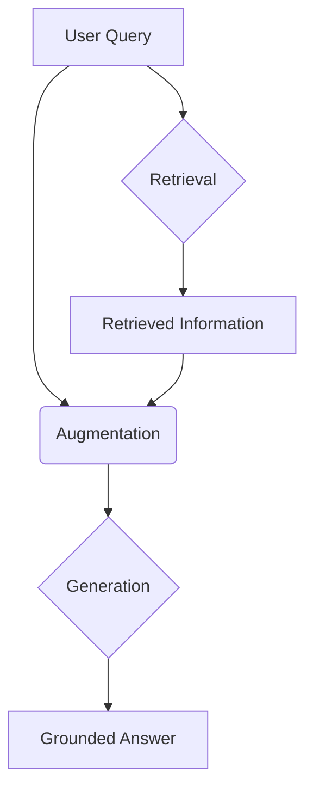
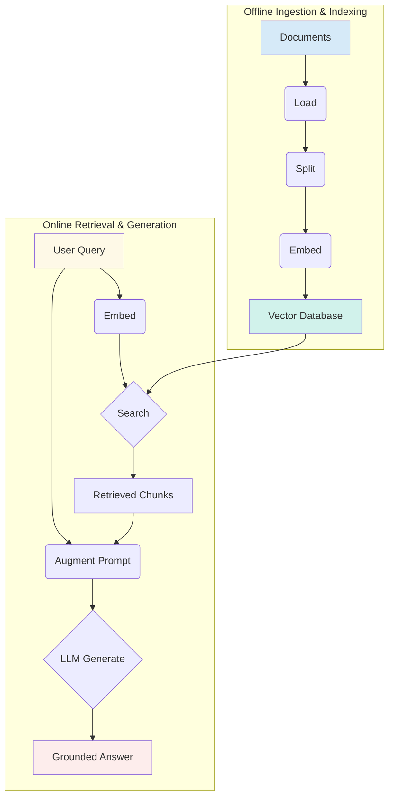
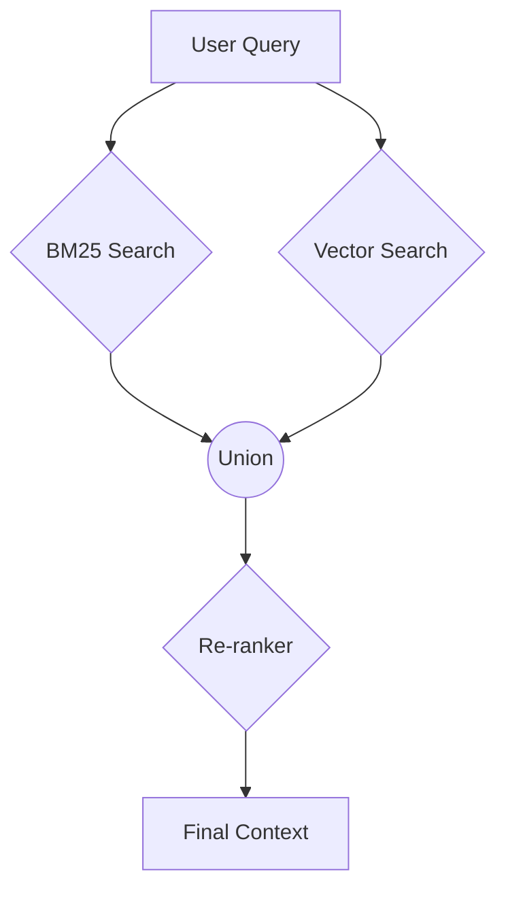
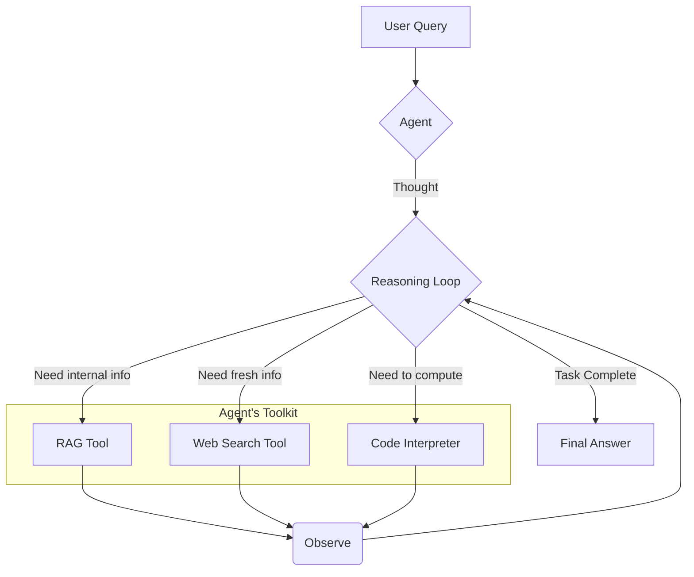

# RAG: LLMs' Open-Book Exam
### From pipelines to agentic RAG

## Introduction: Giving LLMs an Open-Book Exam

Large Language Models (LLMs) are powerful, but they have a fundamental limitation: their knowledge is static. They are trained on a fixed dataset, meaning they take a "closed-book exam" on the world's information up to a specific point in time. We currently lack efficient techniques for models to continuously learn new information after deployment. While fine-tuning is an option, it is not the same as the effortless learning humans do from experience.

This static knowledge is a primary cause of "hallucinations," where an LLM confidently generates incorrect or outdated information, eroding trust in AI systems [[1]](https://blogs.nvidia.com/blog/what-is-retrieval-augmented-generation/). For anyone shipping production-grade AI, this is a problem that must be solved. The most practical solution is Retrieval-Augmented Generation (RAG). Instead of forcing the LLM to memorize everything, RAG gives it an "open-book exam." We connect the LLM to external, up-to-date knowledge sources, allowing it to retrieve relevant information on the fly before generating a response. This empowers LLMs to provide accurate, grounded, and verifiable answers [[2]](https://the-rise-of-rag).

In Lesson 3, we introduced Context Engineering as the practice of curating the information you feed into an LLM's context window. RAG is one of the most important methods in this process, allowing you to dynamically build that context with external data. It is important to distinguish retrieval from agent memory. Retrieval finds external information for a specific task. Memory, which we will cover in Lesson 10, is about an agent's ability to retain information from past interactions. Both are vital for intelligent agents.

This lesson focuses on the engineering behind RAG. We will start by breaking down its core components and pipeline structure. Then, we will explore advanced techniques for building production-ready systems. Finally, we will connect RAG to the agentic patterns from previous lessons, showing how it transforms agents from relying on static knowledge to reasoning over dynamic, external data.

## The RAG System: Core Components

To engineer effective RAG systems, you first need to understand its three conceptual pillars. This is the first step in the Context Engineering process we introduced in Lesson 3.

The first pillar is **Retrieval**. This is the engine that finds relevant information. Most modern RAG systems use vector embeddings to represent the semantic meaning of text. These embeddings are numerical representations stored in a specialized vector database. When a user asks a question, the system converts the query into an embedding and searches the database for text chunks with the most similar embeddings, a process known as semantic similarity search.

The second pillar is **Augmentation**. This step takes the raw information found by the retriever and prepares it for the LLM. It involves formatting the retrieved text chunks and integrating them into a prompt alongside the original user query. The goal is to create a clear, context-rich prompt that guides the LLM toward a relevant and accurate answer.

The final pillar is **Generation**. Here, the LLM receives the augmented prompt and produces a final answer. Because the prompt now contains grounded information from your knowledge source, the LLM's response is based on facts, not just its internal, pre-trained knowledge. This makes the output more reliable and trustworthy.

Figure 1: The conceptual flow of a RAG system, from query to grounded answer.

Now that you can name each moving part, let’s see how they line up across the two phases of a real system.

## The RAG Pipeline: Ingestion and Retrieval

A complete RAG system operates in two distinct phases: an offline phase for preparing data and an online phase for answering user queries. This separation helps you build and maintain a scalable RAG pipeline.

The first phase is **Offline Ingestion & Indexing**. This is where you process your knowledge base for efficient searching. You start by **loading** documents from sources like PDFs or APIs. After loading, you **split** these documents into smaller, meaningful chunks to ensure you retrieve concise, semantically relevant pieces of text [[3]](https://python.langchain.com/docs/tutorials/rag/). Next, you **embed** each chunk using a model like OpenAI's `text-embedding-3-large` or Google's `gemini-text-embedding-004` to create a vector representation. Finally, you **store** these embeddings and their text in a vector database like Milvus, Qdrant, or Pinecone for fast similarity lookups [[4]](https://decodingml.substack.com/p/rag-fundamentals-first?utm_source=publication-search).

The second phase, **Online Retrieval & Generation**, happens in real-time. It begins when a user submits a **query**. The system then **embeds** this query using the *exact same* embedding model from the ingestion phase. The resulting query vector is used to **search** the vector database to find the top-k most similar document chunks. Once the relevant chunks are retrieved, the system moves to the **generate** step. It constructs a prompt containing the user's query and the retrieved context, then calls the LLM to produce a final, grounded answer. You can use structured outputs, which we covered in Lesson 4, to ensure the response includes citations and is formatted consistently [[5]](https://developer.nvidia.com/blog/rag-101-demystifying-retrieval-augmented-generation-pipelines/), [[6]](https://www.ibm.com/think/topics/retrieval-augmented-generation).

Figure 2: The two phases of a RAG pipeline, from offline data ingestion to online answer generation.

With the end-to-end path in place, the next question is quality. Let's look at advanced techniques to make retrieval more accurate across messy, real-world data.

## Advanced RAG Techniques

While a basic RAG pipeline works for simple cases, production-ready systems require advanced techniques to improve retrieval accuracy. These methods address the limitations of basic vector similarity search.

One effective technique is **Hybrid Search**, which combines keyword-based search (like BM25) with vector search. Keyword search excels at finding exact term matches, while vector search captures semantic meaning. Using both combines precision with contextual relevance. For example, a keyword search can find a specific error code, while a vector search finds articles discussing related symptoms [[7]](https://www.elastic.co/what-is/hybrid-search).

Another key technique is **Re-ranking**. The initial retrieval returns a set of candidate documents, which a re-ranker then re-orders for relevance. A cross-encoder model, for instance, evaluates the user query and each document chunk together to provide a more accurate relevance score. This ensures the most relevant information is prioritized for the LLM [[8]](https://sbert.net/examples/sentence_transformer/applications/retrieve_rerank/README.html).

You can also use **Query Transformations**. For a complex query, you can decompose it into sub-questions, retrieve answers for each, and synthesize a final response. Another method is Hypothetical Document Embeddings (HyDE), where an LLM first generates a hypothetical "ideal" answer. You then embed this hypothetical answer and use its vector for the search, which often aligns better with relevant documents [[9]](https://www.pondhouse-data.com/blog/advanced-rag-hypothetical-document-embeddings).

**Advanced Chunking Strategies** are also important. Instead of simple fixed-size chunks, semantic chunking groups text by topic, and layout-aware chunking preserves tables and headers in complex documents. This ensures retrieved chunks are self-contained and contextually complete [[10]](https://www.pinecone.io/learn/chunking-strategies/). For questions about complex relationships, **GraphRAG** uses knowledge graphs to trace connections between entities that would be lost in isolated text chunks, helping to answer questions about the "how" and "why" between data points [[11]](https://weaviate.io/blog/graph-rag).

Figure 3: Flow diagram of a hybrid retrieval system with a re-ranking stage.

These techniques increase retrieval quality. Next, we’ll see how retrieval becomes one tool that an agent can choose to use as it reasons.

## Agentic RAG

So far, we have treated RAG as a linear workflow. Now, we connect this to the ReAct framework from Lessons 7 and 8. **Agentic RAG** is a ReAct-style agent equipped with a retrieval tool. Instead of following a fixed path, the agent reasons about when and how to retrieve information, making the process adaptive.

The core distinction is between a rigid pipeline and a dynamic one. A standard RAG system is reactive; it retrieves, augments, and generates in a fixed sequence. An Agentic RAG system integrates autonomous agents that can plan, analyze retrieved information, and determine the next action, creating a feedback loop [[12]](https://galileo.ai/blog/agentic-rag-integration-ai-architecture). The agent decides when retrieval is needed, how to reformulate a query, which knowledge source to use, and whether to chain multiple steps. Retrieval is just one of many tools an agent might have, alongside others like web search or a code interpreter.

This agentic approach offers powerful capabilities. An agent can **iteratively** use the RAG tool, refining its query if initial results are insufficient. For example, if a first pass returns a vague policy, the agent can reason that it needs more specific information, refine its query to "2024 updates for EU customers," and retrieve again. The agent can also **choose** which knowledge base to search, prioritizing sources based on the query's context [[13]](https://weaviate.io/blog/what-is-agentic-rag). For an outage inquiry, it might select `search_incident_runbooks` over `search_marketing_pages`.

Agents can also **fuse** information from the RAG tool with data from other tools. For instance, it could retrieve an internal policy on expense limits and then use a web search tool to check the current currency conversion rate before giving a final answer. This transforms RAG from a simple database lookup into a dynamic reasoning process.

Here is a conceptual thought process for an agent:
*   **Thought:** "The user is asking about '2024 EU data retention rules.' Our internal policy is from 2023 and might be outdated."
*   **Action:** `retrieve(internal_policy, query="EU data retention 2024")`
*   **Observation:** "The document mentions upcoming amendments but lacks details."
*   **Thought:** "I need to verify this externally."
*   **Action:** `web_search("EU data retention rules 2024 official directive")`
*   **Observation:** "Found the official 2024 directive with updated clauses."
*   **Thought:** "Now I can synthesize an answer using both sources, highlighting the changes."

Figure 4: An agent's reasoning loop, deciding which tool to use for a given task.

You now understand both a linear RAG pipeline and how an agent can control retrieval when needed. Let’s wrap up by situating RAG in the wider AI Engineering toolkit.

## Conclusion

We have covered the journey from basic RAG to a more sophisticated, agent-driven approach. The key takeaway is that RAG is the most practical solution to the LLM's knowledge limitations. While a simple pipeline can get you started, advanced techniques like hybrid search and re-ranking are essential for building production-grade systems that deliver reliable answers.

The core benefits of RAG are clear: it reduces hallucinations, allows you to customize LLMs with proprietary data, and builds user trust by providing verifiable, source-based responses. For any AI Engineer, mastering RAG is a foundational competency and a critical part of the broader discipline of Context Engineering.

With this understanding of retrieval, we are ready to explore the other side of an agent's knowledge: its memory. In our next lesson, Lesson 10, we will dive into Memory for Agents, covering how short-term and long-term memory stores complement the real-time retrieval capabilities of RAG. We have also touched on the importance of quality, and we will cover topics like evaluation and monitoring in detail later in the course.

## References

- [1] [What Is Retrieval-Augmented Generation, aka RAG?](https://blogs.nvidia.com/blog/what-is-retrieval-augmented-generation/)
- [2] [The Rise of RAG](https://highlearningrate.substack.com/p/the-rise-of-rag)
- [3] [RAG Tutorial](https://python.langchain.com/docs/tutorials/rag/)
- [4] [Retrieval-Augmented Generation (RAG) Fundamentals First](https://decodingml.substack.com/p/rag-fundamentals-first?utm_source=publication-search)
- [5] [RAG 101: Demystifying Retrieval-Augmented Generation Pipelines](https://developer.nvidia.com/blog/rag-101-demystifying-retrieval-augmented-generation-pipelines/)
- [6] [What is Retrieval-Augmented Generation (RAG)?](https://www.ibm.com/think/topics/retrieval-augmented-generation)
- [7] [What is hybrid search?](https://www.elastic.co/what-is/hybrid-search)
- [8] [Retrieve & Re-Rank](https://sbert.net/examples/sentence_transformer/applications/retrieve_rerank/README.html)
- [9] [Advanced RAG: Hypothetical Document Embeddings](https://www.pondhouse-data.com/blog/advanced-rag-hypothetical-document-embeddings)
- [10] [Chunking Strategies](https://www.pinecone.io/learn/chunking-strategies/)
- [11] [GraphRAG](https://weaviate.io/blog/graph-rag)
- [12] [Agentic RAG Integration in AI Architecture](https://galileo.ai/blog/agentic-rag-integration-ai-architecture)
- [13] [What is Agentic RAG?](https://weaviate.io/blog/what-is-agentic-rag)