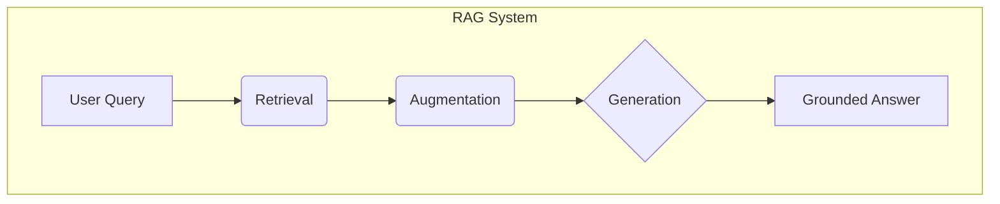
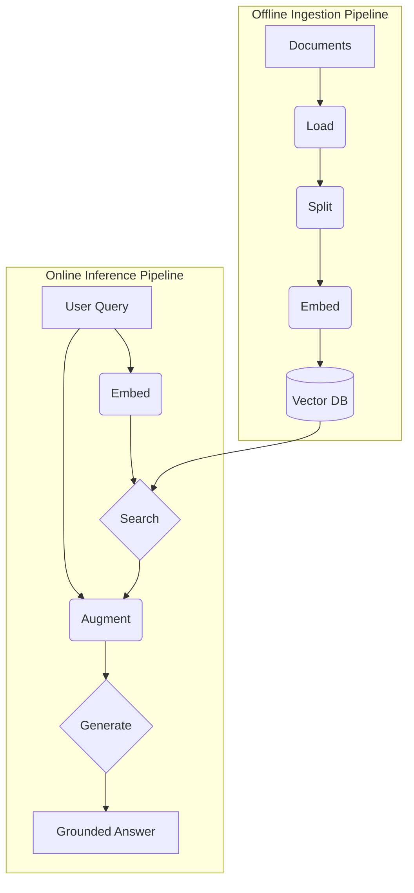
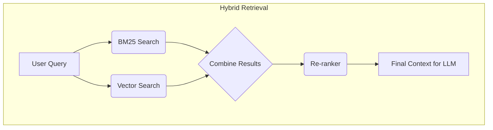
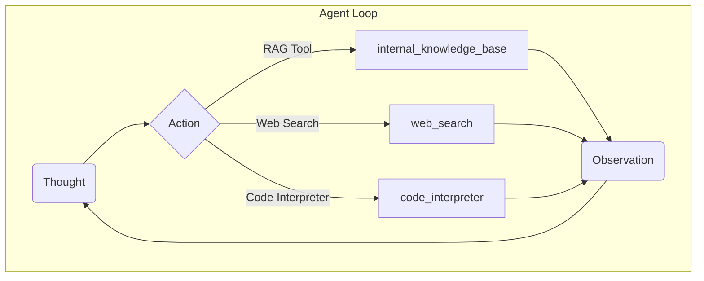

# RAG: The LLM Open-Book Exam
### From fundamentals to agentic systems

## Introduction: Giving LLMs an Open-Book Exam

As we have covered, Large Language Models (LLMs) are trained on a fixed dataset, rendering their knowledge static. This creates a fundamental problem: LLMs are essentially taking a "closed-book exam" on the world's information. They cannot learn new facts or access real-time data once trained, leading to hallucinations and an inability to answer questions about recent events or proprietary information [[1]](https://decodingml.substack.com/p/rag-fundamentals-first?utm_source=publication-search), [[2]](https://highlearningrate.substack.com/p/the-rise-of-rag). Fine-tuning can update a model, but it is an inefficient and expensive process, unlike continuous human learning.

A practical solution to this knowledge problem is Retrieval-Augmented Generation (RAG). Instead of trying to force an LLM to memorize everything, we give it an "open-book exam." RAG connects the LLM to external knowledge sources, allowing it to retrieve relevant information on-demand and use it to construct an answer [[3]](https://blogs.nvidia.com/blog/what-is-retrieval-augmented-generation/). This approach is a core method within the Context Engineering process we discussed in Lesson 3, where we focused on curating the information flow to an LLM.

With RAG, we do not need to cram every piece of information into the model's parameters. Instead, we teach it how to look things up in manuals, documents, or databases when it encounters a question it cannot answer from its internal knowledge. This makes the system more accurate, verifiable, and trustworthy, as it can cite its sources [[3]](https://blogs.nvidia.com/blog/what-is-retrieval-augmented-generation/). It is important to distinguish this retrieval process from an agent's memory, which deals with storing and recalling past interactions and learned procedures. We will cover memory in detail in Lesson 10.

In this lesson, we will build a solid understanding of RAG, starting with its fundamental components and architecture. From there, we will explore the advanced techniques required to build production-ready systems and see how RAG evolves into a powerful tool within the agentic frameworks you have already learned about. With the problem and motivation clear, we will first decompose RAG into its core components so you can see where each responsibility lives.

## The RAG System: Core Components

To properly design and implement a RAG system, you first need to understand its three conceptual pillars. These components work together as part of the Context Engineering process we discussed in Lesson 3 to ground an LLM's response in external facts. By breaking the system into these distinct parts, you can isolate responsibilities, troubleshoot issues more effectively, and ensure that the LLM always receives the most relevant and accurate information.

The first pillar is **Retrieval**. This component acts as the search engine of your RAG system. Its primary job is to take a user's query and efficiently find the most relevant pieces of information from a vast knowledge base [[4]](https://towardsai.net/p/l/a-complete-guide-to-rag).

The dominant technique for this is semantic search, which relies on vector embeddings. These are numerical representations of text where words and phrases with similar meanings are mapped to nearby points in a high-dimensional space. An embedding model processes text, capturing its semantic meaning and converting it into these dense vectors.

We create these embeddings for all your documents during an offline ingestion process and store them in a specialized vector database. When a user query arrives, we convert it into a vector using the same embedding model. Then, we compare this query vector against the document vectors in the database to find the ones that are semantically closest, often using a metric like cosine similarity [[1]](https://decodingml.substack.com/p/rag-fundamentals-first?utm_source=publication-search).

The next pillar is **Augmentation**. Once the retrieval component finds the most relevant document chunks, we prepare this information for the LLM. Augmentation is the process of taking the retrieved text and carefully formatting it into the prompt we send to the language model. This step plays a key role in effective Context Engineering, as it involves creating a structured prompt that includes the original user query, the retrieved context, and clear instructions for the LLM on how to use that context to generate an accurate answer [[4]](https://towardsai.net/p/l/a-complete-guide-to-rag).

Finally, we have the **Generation** phase. We send the augmented prompt, now rich with relevant external information, to the LLM. The model's task is to synthesize this information and generate a coherent, factually grounded answer to the user's original question [[1]](https://decodingml.substack.com/p/rag-fundamentals-first?utm_source=publication-search). The quality of the final output depends heavily on the relevance of the retrieved context and the clarity of the instructions we provide in the augmented prompt.

*Figure 1: The three core components of a Retrieval-Augmented Generation system.*

Understanding these three components is the first step. Now, let us see how they fit into the end-to-end operational pipeline of a real-world RAG system.

## The RAG Pipeline: Ingestion and Retrieval

A production-ready RAG system operates in two distinct phases: an offline process for preparing data and an online process for answering queries in real-time. Separating these workflows is important for efficiency and scalability, as it allows you to handle computationally intensive data preparation independently from the low-latency demands of user interactions [[5]](https://learn.microsoft.com/en-us/azure/developer/ai/advanced-retrieval-augmented-generation).

The first phase is **Offline Ingestion & Indexing**. This is where you build your knowledge base. The process begins with **Loading** documents from various sources like PDFs, websites, or databases. Next, you **Split** these documents into smaller, manageable chunks. This step is important because smaller chunks lead to more precise retrieval and fit within the LLM's context window. You can use rule-based chunkers, like LangChain's `RecursiveCharacterTextSplitter`, or semantic chunkers to ensure that you do not cut ideas in half [[1]](https://decodingml.substack.com/p/rag-fundamentals-first?utm_source=publication-search).

After splitting, we pass each chunk to an embedding model to **Embed** it, converting the text into a numerical vector that captures its semantic meaning. Popular embedding models include OpenAI's `text-embedding-3-large/small`, Google's `gemini-text-embedding-004`, or Voyage. Finally, you **Store** these embeddings and their corresponding text chunks in a vector database, creating an index that can be searched quickly. You can use local options like FAISS, or production-grade vector databases such as Milvus, Qdrant, or Pinecone [[1]](https://decodingml.substack.com/p/rag-fundamentals-first?utm_source=publication-search).

The second phase is **Online Retrieval & Generation**, which happens every time a user submits a query. The user's **Query** is the starting point. We then transform this query into a vector using the same embedding model from the ingestion phase to ensure consistency. The system then uses this query vector to **Search** the vector database for the top-k most similar document chunks.

Once the relevant chunks are retrieved, we use them to augment the user's query in a prompt. Finally, the LLM **Generates** an answer based on this augmented prompt. As we saw in Lesson 4, you can use structured outputs here to ensure the answer includes citations or is formatted in a specific way [[1]](https://decodingml.substack.com/p/rag-fundamentals-first?utm_source=publication-search).

*Figure 2: The end-to-end RAG pipeline, split into its offline ingestion and online inference phases.*

With this end-to-end path in place, the next challenge is ensuring quality. A naive RAG pipeline often struggles with the messiness of real-world data, which is why we need advanced techniques to improve retrieval accuracy.

## Advanced RAG Techniques

While a basic RAG pipeline is a good starting point, production systems need more advanced techniques to handle diverse data and complex queries. These methods improve the quality of the retrieved context, which directly impacts the accuracy of the final answer.

### Hybrid Search
Hybrid search combines traditional keyword-based search, such as BM25, with modern vector search. BM25 excels at finding exact matches for specific terms, while vector search captures semantic meaning and synonyms [[6]](https://www.elastic.co/what-is/hybrid-search). For example, if a user asks about a "bill rollover," keyword search finds documents with that exact phrase. Vector search also finds articles about "carryover balances" because it understands the meaning. Combining both approaches provides more comprehensive and relevant results [[7]](https://blog.vectorchord.ai/hybrid-search-with-postgres-native-bm25-and-vectorchord).

### Re-ranking
Re-ranking adds a second stage to the retrieval process. After an initial retrieval fetches a broad set of candidate documents, a more advanced model, like a cross-encoder, re-evaluates and re-orders these candidates. The cross-encoder examines the query and each document together to produce a more accurate relevance score, ensuring the most relevant documents are placed at the top [[8]](https://sbert.net/examples/sentence_transformer/applications/retrieve_rerank/README.html). This is important for the LLM's attention and improves the signal-to-noise ratio of the context [[9]](https://www.pinecone.io/learn/series/rag/rerankers/).

### Query Transformations
Query transformations modify the user's input to improve retrieval. One method is **decomposition**, which breaks a complex question into simpler sub-questions [[10]](https://wandb.ai/site/articles/rag-techniques/). Another method is **Hypothetical Document Embeddings (HyDE)**. Here, an LLM first generates a hypothetical ideal answer to the query. The embedding of this hypothetical answer is then used for the search, which often retrieves more relevant documents than the original, sometimes ambiguous, query [[11]](https://www.pondhouse-data.com/blog/advanced-rag-hypothetical-document-embeddings).

### Advanced Chunking Strategies
Advanced chunking strategies move beyond fixed-size splitting, which can awkwardly cut sentences or ideas in half. **Semantic chunking** splits documents based on topical shifts, keeping related sentences together. For structured documents like PDFs or tables, **layout-aware chunking** preserves the document's inherent structure. Another approach is **context-enriched chunking**, which adds explanatory context to each chunk before embedding, improving retrieval accuracy [[12]](https://www.anthropic.com/news/contextual-retrieval).

### GraphRAG
GraphRAG uses knowledge graphs to answer questions about complex relationships often lost in unstructured text. Instead of retrieving isolated chunks, it traverses a graph of entities and their connections. This is ideal for **multi-hop questions** that require reasoning across multiple entities or steps [[13]](https://www.zyphra.com/post/understanding-graph-based-rag-and-multi-hop-question-answering). For example, to answer "Which incidents were caused by weekend deployments that also touched the login service?", GraphRAG connects change records, deploy times, affected services, and incident tickets to find the answer [[14]](https://arxiv.org/html/2404.16130v2).

*Figure 3: A hybrid retrieval flow combining keyword and vector search, followed by a re-ranking step.*

These techniques improve retrieval quality. Next, we will see how retrieval becomes one of many tools an intelligent agent can choose to use as it reasons through a problem.

## Agentic RAG

As we explored in Lessons 7 and 8, the ReAct framework enables an agent to reason, act, and observe in a loop. Agentic RAG is the practical application of this concept, where RAG is not a rigid pipeline but a dynamic tool that a ReAct-style agent can choose to use. The core distinction is the shift from a linear workflow to an adaptive, iterative process controlled by an agent [[15]](https://www.digitalocean.com/community/conceptual_articles/rag-ai-agents-agentic-rag-comparative-analysis).

In a standard RAG system, every query follows the same fixed path: Retrieve, Augment, Generate. This approach is effective but inflexible. In an Agentic RAG system, an agent decides when to retrieve information, how to formulate the query, which knowledge source to consult, and whether one retrieval is enough [[16]](https://weaviate.io/blog/what-is-agentic-rag). The agent might reason that a user's question requires information from multiple sources or that an initial search was insufficient and needs refinement [[17]](https://arize.com/blog/understanding-agentic-rag/).

This agentic approach enables several advanced capabilities. The agent can iteratively use the RAG tool, refining its query based on initial results. It can also choose which knowledge base to search. For an IT outage, it might query `search_incident_runbooks` instead of `search_marketing_materials`. Furthermore, the agent can fuse information from its RAG tool with outputs from other tools, like a web search or a code interpreter [[18]](https://workativ.com/ai-agent/blog/agentic-rag). The agent can even decide to update its knowledge base with new information it learns, a concept related to memory that we will explore in Lesson 10.

Consider this conceptual thought process for an agent:
*   **Thought:** The user is asking about "2024 EU data retention rules." Our internal policy cites 2023, which is likely outdated.
*   **Action:** `retrieve(internal_policy, query="EU data retention 2024")`
*   **Observation:** The retrieved document mentions amendments but is missing citations.
*   **Thought:** I need external verification.
*   **Action:** `web_search("EU data retention 2024 official")`
*   **Observation:** Found a new directive published by the EU.
*   **Thought:** I will synthesize and cite both, highlighting changes from 2023.

This transforms RAG from a simple database lookup into a conversation with a knowledgeable research assistant.

*Figure 4: An agent's reasoning loop, showing its ability to choose between multiple tools, including a RAG tool for internal knowledge.*

You now understand both a linear RAG pipeline and how an agent can control retrieval when needed. Let us wrap up by situating RAG in the wider AI Engineering toolkit and previewing what comes next.

## Conclusion

We have covered a lot of ground, from the fundamentals of RAG to its role in advanced agentic systems. The key takeaway is that RAG is the primary and most reliable solution to the LLM knowledge problem. It addresses core limitations like knowledge cutoffs and hallucinations by grounding models in external, verifiable data. This not only improves accuracy but also builds user trust by enabling systems to cite their sources.

For production-grade applications, moving beyond a naive implementation is necessary. Advanced techniques like hybrid search, re-ranking, and sophisticated chunking are important for achieving the quality and relevance needed in the real world. As we have seen, the future of knowledge retrieval is agentic. By treating RAG as a tool within an intelligent agent's toolkit, we move from rigid, linear pipelines to dynamic, adaptive systems that can reason about their information needs.

Mastering RAG is a foundational competency for any AI Engineer. It is an important part of the broader discipline of Context Engineering, which is central to building effective and trustworthy AI applications.

This lesson sets the stage for our next topic. In Lesson 10, we will explore Memory for Agents, examining how short-term and long-term memory systems complement the on-demand retrieval capabilities of RAG. We have also touched on concepts like retrieval quality evaluations and production monitoring, which are important for maintaining high-performing systems and will be covered in detail later in the course.

## References

- [1] [Retrieval-Augmented Generation (RAG) Fundamentals First](https://decodingml.substack.com/p/rag-fundamentals-first?utm_source=publication-search)
- [2] [The Rise of RAG](https://highlearningrate.substack.com/p/the-rise-of-rag)
- [3] [What Is Retrieval-Augmented Generation, aka RAG?](https://blogs.nvidia.com/blog/what-is-retrieval-augmented-generation/)
- [4] [A Complete Guide to RAG](https://towardsai.net/p/l/a-complete-guide-to-rag)
- [5] [Build advanced retrieval-augmented generation systems](https://learn.microsoft.com/en-us/azure/developer/ai/advanced-retrieval-augmented-generation)
- [6] [What is Hybrid Search?](https://www.elastic.co/what-is/hybrid-search)
- [7] [Hybrid Search with Postgres Native BM25 and VectorChord](https://blog.vectorchord.ai/hybrid-search-with-postgres-native-bm25-and-vectorchord)
- [8] [Retrieve & Re-Rank](https://sbert.net/examples/sentence_transformer/applications/retrieve_rerank/README.html)
- [9] [What Are Rerankers?](https://www.pinecone.io/learn/series/rag/rerankers/)
- [10] [Query Transformations for RAG](https://wandb.ai/site/articles/rag-techniques/)
- [11] [Advanced RAG: Hypothetical Document Embeddings](https://www.pondhouse-data.com/blog/advanced-rag-hypothetical-document-embeddings)
- [12] [Introducing Contextual Retrieval](https://www.anthropic.com/news/contextual-retrieval)
- [13] [Understanding Graph-Based RAG and Multi-Hop Question Answering](https://www.zyphra.com/post/understanding-graph-based-rag-and-multi-hop-question-answering)
- [14] [From Local to Global: A GraphRAG Approach to Query-Focused Summarization](https://arxiv.org/html/2404.16130v2)
- [15] [RAG vs. AI Agents vs. Agentic RAG: A Comparative Analysis](https://www.digitalocean.com/community/conceptual_articles/rag-ai-agents-agentic-rag-comparative-analysis)
- [16] [What is Agentic RAG?](https://weaviate.io/blog/what-is-agentic-rag)
- [17] [Understanding Agentic RAG](https://arize.com/blog/understanding-agentic-rag/)
- [18] [Agentic RAG: The Future of RAG-Based Applications](https://workativ.com/ai-agent/blog/agentic-rag)