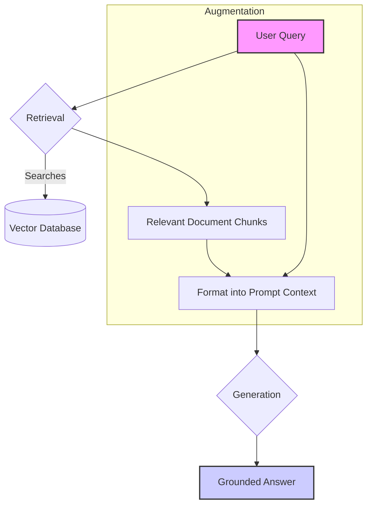
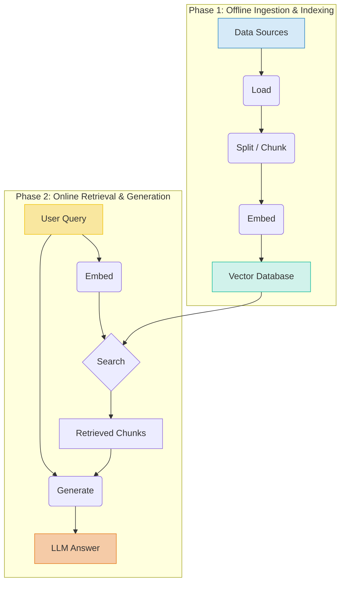
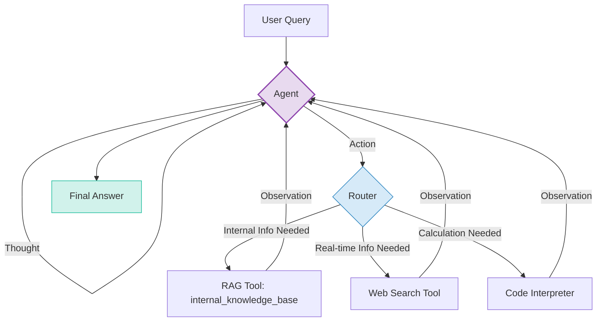

# RAG: LLMs' Open-Book Exam
### From basics to agentic RAG

## Giving LLMs an Open-Book Exam

Large Language Models (LLMs) are powerful, but they operate on a fixed set of knowledge. Their understanding of the world freezes at the moment their training data was collected, making their knowledge static. When you ask an LLM a question, it’s like it's taking a closed-book exam; it relies only on memorized information.

This presents two significant problems for us as AI engineers. First, the LLM's knowledge quickly becomes outdated. Second, if it cannot answer a question from its training data, it often makes things up. We call this phenomenon hallucination. This fundamental limitation stems from how we build these models.

One might immediately think of constantly retraining these models with new information. However, for a model with billions of parameters, this is simply not practical. The computational and financial costs of frequently retraining such massive models are enormous.

This makes it infeasible to keep the model updated with every new piece of data. A fixed training dataset cannot keep pace with the real world, whether it is the latest news, evolving scientific discoveries, or your company's rapidly changing internal documents. We need a more elegant and reliable solution that allows LLMs to access dynamic, up-to-date information without constant, expensive retraining cycles [[1]](https://blogs.nvidia.com/blog/what-is-retrieval-augmented-generation/).

That solution is Retrieval-Augmented Generation (RAG). Instead of forcing the model to memorize everything, RAG gives it an open-book exam. It connects the LLM to external, real-time knowledge sources, allowing it to retrieve relevant information on-demand and use it to formulate a grounded, trustworthy, and accurate answer.

This process is a core part of a broader practice we call "Context Engineering." Here, we design and build systems that provide the right context to the LLM at the right time. RAG is the primary method we use to make this happen, ensuring our AI applications are not only intelligent but also verifiable.

This article will take you from the fundamentals of RAG to the advanced and agentic patterns that define the future of AI. We will start with the basic anatomy of a RAG system and its two-phase pipeline. Then, we will explore the advanced techniques that make it production-ready and, finally, make the leap to Agentic RAG, where the system itself decides when and how to seek knowledge.

## The Anatomy of a RAG System: Core Components

At its core, a Retrieval-Augmented Generation system is straightforward. We can break it down into three conceptual pillars: Retrieval, Augmentation, and Generation. Understanding these components is the first step to mastering how to build and optimize these systems. They work together in a sequential flow to transform a user's query into a factually grounded response.

### Retrieval
The first pillar is Retrieval. This is the engine responsible for finding relevant information from an external knowledge base. When a user asks a question, the retrieval system's job is to search through potentially vast amounts of data to find the specific snippets that can help answer it.

We achieve this most commonly through semantic search, which relies on vector embeddings. We convert large documents into smaller, manageable chunks and convert each chunk into a numerical representation—an embedding—that captures its semantic meaning. We store these embeddings in a specialized vector database. When a user query comes in, we convert it into an embedding and search the database for chunks with the most similar meanings, typically using a metric like cosine similarity [[2]](https://decodingml.substack.com/p/rag-fundamentals-first?utm_source=publication-search).

### Augmentation
The second pillar is Augmentation. Once the retrieval system has found the most relevant document chunks, we prepare this information for the LLM. Augmentation is the process of taking this retrieved data and formatting it into the context section of a prompt. We combine the user's original query with this new context, creating an "augmented prompt." This step is critical for grounding the model and steering it away from hallucination by providing a verifiable source of truth.

### Generation
The final pillar is Generation. We send the augmented prompt, containing both the original query and the retrieved context, to the LLM. The model then uses its powerful reasoning capabilities to synthesize an answer based *only* on the information provided in the prompt. The LLM does not just repeat the context; it understands, integrates, and reformulates the information to directly address the user's question. The result is a response that is not only relevant but also grounded in a verifiable source, building trust and reliability into the AI application [[1]](https://blogs.nvidia.com/blog/what-is-retrieval-augmented-generation/).

Figure 1: The high-level conceptual flow of a RAG system, moving from user query to a grounded answer through retrieval, augmentation, and generation.

## The Two-Phase RAG Pipeline: Ingestion and Retrieval

A production-ready RAG system does not just happen at query time. We split the entire workflow into two distinct phases: an offline phase for preparing the knowledge base and an online phase for answering user queries. Thinking about the process in these two stages—Ingestion and Retrieval—is key to designing and building an effective RAG pipeline that can scale.

### Offline Ingestion & Indexing Pipeline
This is the preparatory work that happens before any user interacts with the system. Its goal is to take raw data and transform it into a searchable index. This pipeline typically runs as a batch process and consists of four main steps.

First, we **Load** the data. This involves reading documents from their original sources, which could be anything from PDFs and text files to a Confluence wiki or records in a database [[3]](https://lakefs.io/blog/what-is-rag-pipeline/).

Second, we **Split** the loaded documents. Because LLMs have context limits and we want to retrieve only the most relevant information, we break documents into smaller, manageable pieces, a process known as chunking [[4]](https://www.amazee.io/blog/post/data-pipelines-for-rag/). The strategy for chunking is critical; a naive split can separate related ideas, so we often need advanced strategies that respect the document's structure.

Third, we **Embed** these chunks. An embedding model converts each text chunk into a vector—a numerical representation of its semantic meaning. The choice of embedding model directly determines the quality of our retrieval [[2]](https://decodingml.substack.com/p/rag-fundamentals-first?utm_source=publication-search).

Fourth, we **Store** the results. We load the embeddings and their corresponding text chunks into a vector database. This database becomes the central, queryable knowledge base for our RAG system.

### Online Retrieval & Generation Pipeline
The second phase is what happens in real-time when a user submits a query. It is the "live" part of the RAG system and also consists of four sequential steps.

It starts with the user's **Query**. The user submits a question to the application, initiating the process.

Next, we **Embed** the query. We apply the same embedding model used during ingestion to the user's query to generate a query vector [[2]](https://decodingml.substack.com/p/rag-fundamentals-first?utm_source=publication-search).

Then, we **Search**. We use the query vector to search the vector database, which returns the top-k most similar chunks of information relevant to the user's question.

Finally, we **Generate** the answer. We format the retrieved chunks and the original query into an augmented prompt and pass it to an LLM. The LLM then synthesizes the final answer, grounding its response in the retrieved data.

Figure 2: The two-phase RAG pipeline, showing the offline ingestion process and the online retrieval and generation flow.

## Beyond the Basics: A Tour of Advanced RAG Techniques

A simple RAG pipeline is a good start, but to build a production-grade system, we need to move beyond the basics. The field has developed a range of advanced techniques that address the limitations of a naive implementation. These methods optimize every stage of the pipeline to ensure higher quality and reliability.

### Hybrid Search
**Hybrid Search** is one of the most effective techniques. While vector search excels at semantic meaning, it can miss precise keyword matches. Hybrid search solves this by combining the strengths of keyword-based search, like the classic BM25 algorithm, with vector search [[5]](https://www.chitika.com/hybrid-retrieval-rag/).

BM25 excels at exact term matching, while vector search handles conceptual understanding. By running both searches and fusing their results, we get the best of both worlds: precision for specific terms and relevance for overall meaning [[6]](https://blog.vectorchord.ai/hybrid-search-with-postgres-native-bm25-and-vectorchord), [[7]](https://arxiv.org/html/2502.16767v1).

### Re-ranking
Another critical optimization is **Re-ranking**. The initial retrieval from a vector database is fast but not perfectly accurate. Re-ranking introduces a second, more powerful model, like a cross-encoder, to refine this initial set [[8]](https://www.chitika.com/re-ranking-in-retrieval-augmented-generation-how-to-use-re-rankers-in-rag/).

This process is computationally expensive, so we apply it only to a smaller candidate set of documents [[9]](https://zilliz.com/learn/optimize-rag-with-rerankers-the-role-and-tradeoffs). By re-ordering the documents based on a more accurate relevance score, we ensure the most relevant information is passed to the LLM, significantly improving the final answer's quality [[10]](https://adasci.org/how-to-select-the-best-re-ranking-model-in-rag/), [[11]](https://adasci.org/a-hands-on-guide-to-enhance-rag-with-re-ranking/).

### Query Transformations
We can also improve performance by focusing on the query itself through **Query Transformations**. These techniques use an LLM to refine a user's query before it hits the retrieval system. One approach is to break a complex question into several simpler sub-queries, run a search for each, and then synthesize the results [[12]](https://www.swiftorial.com/swiftlessons/rag/advanced-techniques/multi-query-rag). This method, often seen in patterns like RAG-Fusion, increases the likelihood of retrieving all pertinent context [[13]](https://docsbot.ai/article/advanced-rag-techniques-multiquery-and-rank-fusion), [[14]](https://ai.gopubby.com/rag-fusion-redefining-search-using-multi-query-retrieval-and-reranking-88da68783d26).

Other methods include Hypothetical Document Embeddings (HyDE), where an LLM generates a hypothetical answer to search against, and multi-step RAG, which performs iterative retrieval and reasoning cycles [[15]](https://www.f22labs.com/blogs/what-is-multi-step-rag-a-complete-guide/).

### Advanced Chunking Strategies
The quality of retrieval also heavily depends on **Advanced Chunking Strategies**. Moving beyond simple fixed-size chunking is essential, as arbitrary splits can break logical units of information [[16]](https://www.dailydoseofds.com/p/5-chunking-strategies-for-rag/).

Semantic chunking groups related sentences together, ensuring a complete idea is in one chunk [[17]](https://airbyte.com/data-engineering-resources/chunk-text-for-rag). For documents like PDFs, layout-aware chunking parses content based on its visual structure, preserving tables and figures [[18]](https://www.ibm.com/think/tutorials/chunking-strategies-for-rag-with-langchain-watsonx-ai). Other strategies include recursive chunking or even using an LLM to determine optimal split points, all of which lead to more coherent retrieved context [[19]](https://community.databricks.com/t5/technical-blog/the-ultimate-guide-to-chunking-strategies-for-rag-applications/ba-p/113089).

### GraphRAG
For data where relationships are key, **GraphRAG** offers a powerful alternative. Instead of flat text chunks, GraphRAG builds a knowledge graph where entities are nodes and their relationships are edges [[20]](https://ragaboutit.com/graph-rag-vs-vector-rag-a-comprehensive-tutorial-with-code-examples/). This is perfect for queries that ask about connections, causes, and influences.

GraphRAG excels at understanding the "how" and "why" between data points, enabling multi-hop reasoning that traditional vector RAG struggles with [[21]](https://www.chitika.com/graph-rag-vs-vector-rag/). By leveraging the graph structure, it can synthesize information across multiple nodes, providing a much richer and more contextualized answer [[22]](https://wandb.ai/byyoung3/Generative-AI/reports/GraphRAG-Enhancing-LLMs-with-knowledge-graphs-for-superior-retrieval--VmlldzoxMDY0OTU0MA).

## The Agentic Leap: Standard vs. Agentic RAG

So far, we have treated RAG as a linear, rigid pipeline. This is Standard RAG. It is powerful but inflexible, forcing every query down the same path. The real breakthrough is the shift to a dynamic, adaptive process controlled by an intelligent agent. This is Agentic RAG.

The core distinction is one of control and reasoning. In Agentic RAG, an AI agent, powered by an LLM, acts as an orchestrator. It decides *if*, *when*, and *how* to use its knowledge retrieval tools. RAG is no longer the entire process; it is a tool in the agent's toolkit, just like a web search or a code interpreter [[23]](https://weaviate.io/blog/what-is-agentic-rag).

This agentic approach unlocks a new level of capability. An agent can **iteratively** use its RAG tool, refining its query and searching again if the initial results are insufficient. This process, often incorporating reflection, allows the agent to self-correct and dig deeper [[24]](https://langchain-ai.github.io/langgraph/concepts/agentic_concepts/). The agent can also **choose** which knowledge source to search, routing a query to the most appropriate RAG tool based on its content [[25]](https://www.ibm.com/think/topics/agentic-rag).

Beyond choosing and iterating, an agent can **fuse** information from multiple tools, combining internal data from RAG with public data from a web search. Some advanced agents can even **update** their knowledge base, allowing them to learn and improve over time.

Frameworks like LangGraph are designed to build these agentic systems. We build a stateful graph where nodes represent actions and edges define the logic for transitions. This allows RAG to be deeply integrated into the agent's reasoning loop: reason, act, and observe [[26]](https://blog.lancedb.com/agentic-rag-using-langgraph-building-a-simple-customer-support-autonomous-agent/).

Consider a user asking, "Based on our latest internal performance metrics, what was the public reaction to our Q4 product launch?" An agent's "thought process" might be:
1.  **Thought:** I need internal metrics and public reaction. I will use two different tools.
2.  **Action:** Call the `internal_knowledge_base` RAG tool for performance metrics.
3.  **Observation:** Receive internal data.
4.  **Thought:** Now I need public reaction. I will use the `web_search` tool.
5.  **Action:** Call the `web_search` tool for public reaction to the launch.
6.  **Observation:** Receive news articles and sentiment analysis.
7.  **Thought:** I have all the information. I will now synthesize a final answer.
8.  **Action:** Generate a response combining both internal and external data.

This is the difference between a simple lookup and a conversation with a research assistant. Agentic RAG is about reasoning, planning, and dynamically interacting with knowledge to solve complex problems.

Figure 3: A conceptual diagram of an agent's reasoning loop, where it chooses between multiple tools, including a RAG tool for internal knowledge.

## Why RAG is a Pillar of Modern AI Engineering

Retrieval-Augmented Generation is more than just a technique; it is a foundational pillar for building reliable and trustworthy AI systems. It directly addresses the core limitations of LLMs—static knowledge and hallucination—by grounding them in external, verifiable facts.

For the modern AI Engineer, mastering RAG is a core competency. Advanced techniques are crucial for production-grade quality, and the future of knowledge retrieval is undeniably agentic. This makes RAG a fundamental part of Context Engineering. By leveraging RAG, we build knowledgeable systems that are customizable with proprietary data and transparent through verifiable sources, ultimately earning user trust.

## References

- [1] [What Is Retrieval-Augmented Generation, aka RAG?](https://blogs.nvidia.com/blog/what-is-retrieval-augmented-generation/)
- [2] [Retrieval-Augmented Generation (RAG) Fundamentals First](https://decodingml.substack.com/p/rag-fundamentals-first?utm_source=publication-search)
- [3] [What is a RAG pipeline and why do you need one?](https://lakefs.io/blog/what-is-rag-pipeline/)
- [4] [Data pipelines for RAG](https://www.amazee.io/blog/post/data-pipelines-for-rag/)
- [5] [Hybrid Retrieval in RAG: A Practical Guide](https://www.chitika.com/hybrid-retrieval-rag/)
- [6] [Hybrid Search with Postgres Native BM25 and VectorChord](https://blog.vectorchord.ai/hybrid-search-with-postgres-native-bm25-and-vectorchord)
- [7] [Hybrid Search for RAG](https://arxiv.org/html/2502.16767v1)
- [8] [Re-ranking in Retrieval-Augmented Generation: How to Use Re-rankers in RAG](https://www.chitika.com/re-ranking-in-retrieval-augmented-generation-how-to-use-re-rankers-in-rag/)
- [9] [Optimize RAG with Rerankers: The Role and Tradeoffs](https://zilliz.com/learn/optimize-rag-with-rerankers-the-role-and-tradeoffs)
- [10] [How to Select the Best Re-ranking Model in RAG](https://adasci.org/how-to-select-the-best-re-ranking-model-in-rag/)
- [11] [A Hands-on Guide to Enhance RAG with Re-ranking](https://adasci.org/a-hands-on-guide-to-enhance-rag-with-re-ranking/)
- [12] [Multi-Query RAG: An Advanced Technique for Complex Queries](https://www.swiftorial.com/swiftlessons/rag/advanced-techniques/multi-query-rag)
- [13] [Advanced RAG Techniques: MultiQuery and Rank Fusion](https://docsbot.ai/article/advanced-rag-techniques-multiquery-and-rank-fusion)
- [14] [RAG-Fusion: Redefining Search Using Multi-Query Retrieval and Reranking](https://ai.gopubby.com/rag-fusion-redefining-search-using-multi-query-retrieval-and-reranking-88da68783d26)
- [15] [What is Multi-Step RAG? A Complete Guide](https://www.f22labs.com/blogs/what-is-multi-step-rag-a-complete-guide/)
- [16] [5 Chunking Strategies For RAG](https://www.dailydoseofds.com/p/5-chunking-strategies-for-rag/)
- [17] [How to chunk text for RAG](https://airbyte.com/data-engineering-resources/chunk-text-for-rag)
- [18] [Chunking strategies for RAG with LangChain and watsonx.ai](https://www.ibm.com/think/tutorials/chunking-strategies-for-rag-with-langchain-watsonx-ai)
- [19] [The Ultimate Guide to Chunking Strategies for RAG Applications](https://community.databricks.com/t5/technical-blog/the-ultimate-guide-to-chunking-strategies-for-rag-applications/ba-p/113089)
- [20] [Graph RAG vs. Vector RAG: A Comprehensive Tutorial with Code Examples](https://ragaboutit.com/graph-rag-vs-vector-rag-a-comprehensive-tutorial-with-code-examples/)
- [21] [Graph RAG vs. Vector RAG: Which Is Right for You?](https://www.chitika.com/graph-rag-vs-vector-rag/)
- [22] [GraphRAG: Enhancing LLMs with knowledge graphs for superior retrieval](https://wandb.ai/byyoung3/Generative-AI/reports/GraphRAG-Enhancing-LLMs-with-knowledge-graphs-for-superior-retrieval--VmlldzoxMDY0OTU0MA)
- [23] [What is Agentic RAG?](https://weaviate.io/blog/what-is-agentic-rag)
- [24] [Agentic Concepts in LangGraph](https://langchain-ai.github.io/langgraph/concepts/agentic_concepts/)
- [25] [What is agentic RAG?](https://www.ibm.com/think/topics/agentic-rag)
- [26] [Agentic RAG using LangGraph: Build autonomous Customer support agent](https://blog.lancedb.com/agentic-rag-using-langgraph-building-a-simple-customer-support-autonomous-agent/)