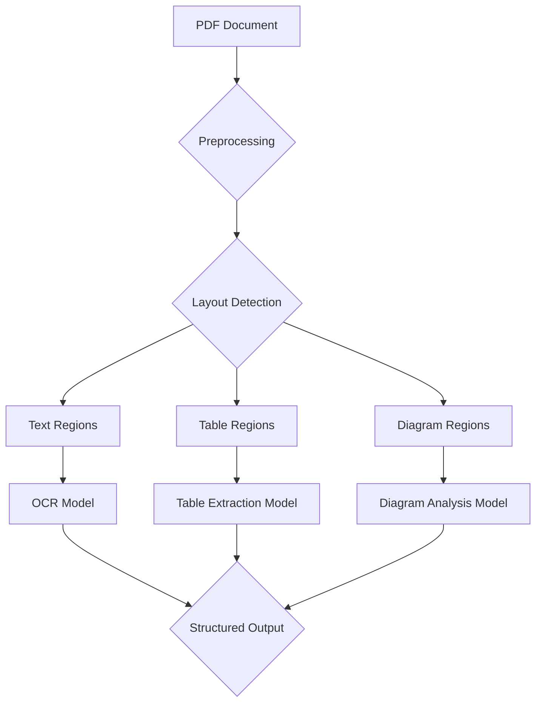
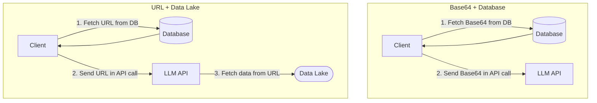
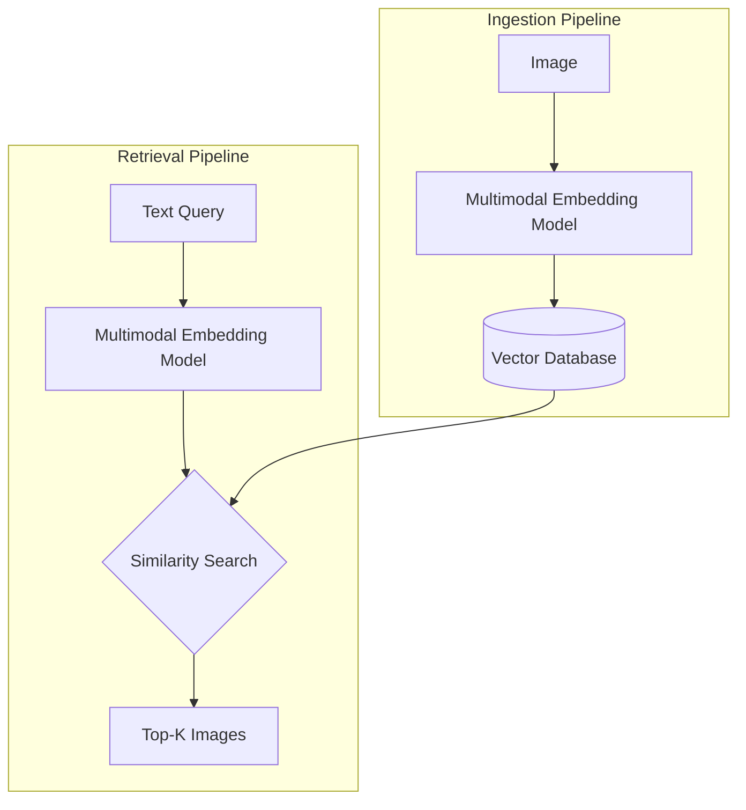
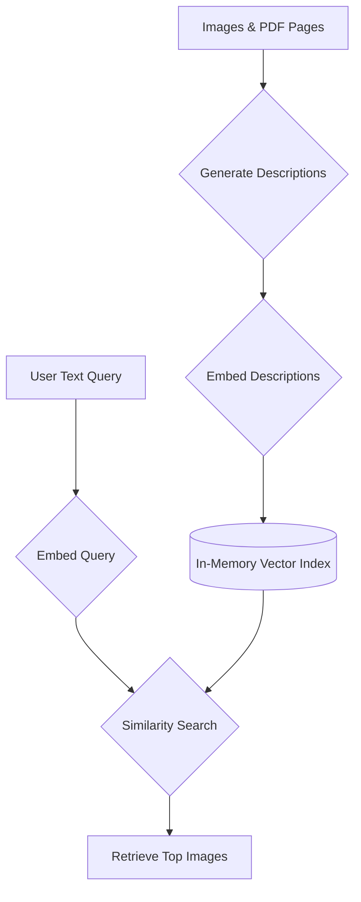
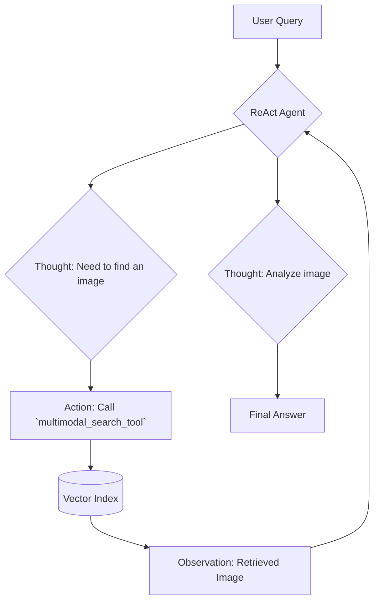

# TITLE NOT AVAILABLE
### SUBTITLE NOT AVAILABLE

## Introduction: The need for multimodal AI

In the previous lessons, we built a solid foundation for creating AI applications. You learned the difference between structured workflows and autonomous agents, mastered context engineering, and implemented core patterns like ReAct and Retrieval-Augmented Generation (RAG). We have covered the essentials of building systems that can reason and access external knowledge. Now, it is time to add the final piece of the puzzle for this part of the course: multimodal data.

Real-world, enterprise-grade AI applications rarely deal with text alone. They need to understand and process a mix of images, documents, charts, and tables. Text-only systems are limited when faced with a financial report full of diagrams or a technical manual with complex sketches. To build truly useful AI, you need to equip it with the ability to see and interpret the rich, visual world of information. This lesson will show you how to do just that.

## Limitations of traditional document processing

For years, the standard approach to handling complex documents like invoices, reports, or technical manuals in AI systems was to normalize everything to text. This process typically relies on Optical Character Recognition (OCR) and involves a convoluted, multi-step pipeline. Suppose you need to process a PDF that contains a mix of text, tables, and diagrams. The traditional workflow is a house of cards.

First, the system needs to perform layout detection to identify different regions within the document—this is a title, this is a paragraph, this is a table. Then, it sends the text regions to an OCR model for extraction. For other structures, it needs specialized models: one for tables, another for charts, and so on. The final output is a structured format, like JSON, that pieces together the extracted text and metadata.


Figure 1: A traditional, multi-step document processing pipeline.

This entire process is fundamentally flawed. It is rigid because it fails if it encounters a new data structure it was not trained on. It is slow and costly, requiring multiple model calls for a single document. Most importantly, it is fragile. Errors compound at each stage; a mistake in layout detection cascades into the OCR step, leading to garbled text that makes downstream RAG systems useless [[1]](https://www.mixedbread.com/blog/the-hidden-ceiling). Even the best OCR systems struggle with handwritten notes, poor-quality scans, or complex layouts like architectural drawings, with performance dropping [[2]](https://arxiv.org/html/2412.02210v2), [[3]](https://www.dataunboxed.io/blog/ocr-vs-vlm-ocr-naive-benchmarking-accuracy-for-scanned-documents).


Figure 2: Complex layouts like this floor plan are a significant challenge for traditional OCR systems. (Media from [Hackernoon](https://hackernoon.com/complex-document-recognition-ocr-doesnt-work-and-heres-how-you-fix-it))

This approach might work for niche, highly-specialized tasks, but it does not scale for the flexible and fast AI agents we need today. That is why modern AI solutions use multimodal Large Language Models (LLMs) that can directly interpret images and PDFs as native inputs, completely bypassing this brittle OCR workflow. Let us explore how they work.

## Foundations of multimodal LLMs

Before we dive into the code, you need a high-level intuition for how multimodal LLMs operate. You do not need to be a researcher to use them, but understanding the basics will help you build, deploy, and optimize them effectively. There are two common architectural patterns for building models that can process both text and images.

The first is the **Unified Embedding Decoder Architecture**, where image and text data are converted into a shared format and fed into a standard LLM decoder together. The second is the **Cross-modality Attention Architecture**, which uses a special mechanism to inject visual information directly into the LLM's attention layers [[5]](https://magazine.sebastianraschka.com/p/understanding-multimodal-llms).


Figure 3: The two primary architectural approaches for building multimodal LLMs. (Media from [Sebastian Raschka's Magazine](https://magazine.sebastianraschka.com/p/understanding-multimodal-llms))

Let us look closer at the Unified Embedding Decoder approach, which is simpler and more common. in this setup, the image information is passed to the LLM as a sequence of input tokens, just like text. The main components are an image encoder, a projector, and the LLM backbone itself [[6]](https://www.nvidia.com/en-us/glossary/multimodal-large-language-models/).


Figure 4: The Unified Embedding Decoder Architecture concatenates image and text embeddings as input to the LLM. (Media from [Sebastian Raschka's Magazine](https://magazine.sebastianraschka.com/p/understanding-multimodal-llms))

The Cross-Modality Attention architecture takes a different route. Instead of adding image tokens to the input sequence, it injects the visual information directly into the attention mechanism of the LLM. This allows the model to dynamically "look" at the image features while processing the text [[7]](https://blog.premai.io/multimodal-llms-architecture-techniques-and-use-cases/).


Figure 5: The Cross-modality Attention Architecture integrates visual data via attention mechanisms. (Media from [Sebastian Raschka's Magazine](https://magazine.sebastianraschka.com/p/understanding-multimodal-llms))

Both approaches rely on an **image encoder**, which is conceptually similar to a text tokenizer. While a tokenizer breaks text into sub-words, an image encoder divides an image into smaller patches. Each patch is then converted into a numerical vector, or embedding [[5]](https://magazine.sebastianraschka.com/p/understanding-multimodal-llms).

Figure 6: Image patching is analogous to text tokenization, converting visual data into a sequence of embeddings. (Media from [Sebastian Raschka's Magazine](https://magazine.sebastianraschka.com/p/understanding-multimodal-llms))

This process is often handled by a Vision Transformer (ViT), which processes these patches to create embeddings that capture the visual information [[8]](https://www.ionio.ai/blog/a-comprehensive-guide-to-multimodal-llms-and-how-they-work).

Figure 7: A Vision Transformer converts image patches into embeddings. (Media from [Sebastian Raschka's Magazine](https://magazine.sebastianraschka.com/p/understanding-multimodal-llms))

The magic happens when these image embeddings and text embeddings are aligned in the same vector space. This alignment is achieved through a technique called contrastive learning, which trains the model to place semantically similar images and text descriptions close to each other in the embedding space [[9]](https://github.com/openai/CLIP). Models like CLIP (Contrastive Language-Image Pre-Training) are prime examples of this. This shared space is what enables semantic similarity searches across different data types; you can use a text query to find a relevant image because their vector representations are close to one another [[10]](https://huggingface.co/docs/transformers/v4.22.1/en/model_doc/clip).

Figure 8: Multimodal embeddings align text and image representations in a shared vector space. (Media from [Towards Data Science](https://towardsdatascience.com/multimodal-embeddings-an-introduction-5dc36975966f))

Each architectural approach has its trade-offs. The Unified Embedding model is generally simpler to implement and often performs better on OCR-related tasks. The Cross-Attention model can be computationally efficient, especially with high-resolution images, as it avoids lengthening the input sequence with image tokens [[5]](https://magazine.sebastianraschka.com/p/understanding-multimodal-llms). Hybrid approaches also exist, aiming to combine the best of both worlds.

Today, most state-of-the-art models are multimodal. In the open-source community, we have models like Llama 3.2, Gemma, and Qwen2. In the proprietary space, models like OpenAI's GPT-4o, Google's Gemini, and Anthropic's Claude series all have strong multimodal capabilities. This modular encoder-based design also allows for extension to other data types like audio or video by simply adding the appropriate encoder [[7]](https://blog.premai.io/multimodal-llms-architecture-techniques-and-use-cases/).

It is important to distinguish these multimodal LLMs from generative diffusion models like Midjourney or Stable Diffusion. While models like GPT-4o can generate images, their core architecture is different from diffusion models, which are specialized for synthesis. For our purposes in building AI agents, we focus on multimodal LLMs for their reasoning and understanding capabilities, though diffusion models can be integrated as tools [[16]](https://blog.google/technology/ai/google-gemini-ai/).

The field of multimodal AI is evolving rapidly. The goal of this section was not to be exhaustive but to give you a solid intuition for why these models are superior to older OCR-based methods. Now that you understand how LLMs can directly process images and documents, let us see how it works in practice.

## Applying multimodal LLMs to images and PDFs

To see multimodal LLMs in action, let us walk through some practical examples using Gemini. First, you need to understand the three primary ways to pass multimodal data to an LLM API: as raw bytes, as Base64-encoded strings, or as URLs.

**Raw bytes** are the most direct way to handle files and work well for simple, one-off API calls. However, storing raw binary data in many databases can be problematic, as they often interpret the input as text, leading to data corruption.

**Base64 encoding** solves this storage problem by converting binary data into a string format. This is a common practice for embedding images directly in web pages, and for our use case, it ensures that images or documents can be safely stored in a text-friendly database like PostgreSQL or MongoDB. The main downside is that Base64 strings are about 33% larger than the original binary data, which can increase latency and storage costs [[11]](https://www.turing.com/resources/building-high-quality-multimodal-data-pipelines-for-llms).

**URLs** are the most efficient method for enterprise-scale applications. Instead of passing large files back and forth over the network, you can store your data in a private data lake like Amazon S3 or Google Cloud Storage and simply pass a secure URL to the LLM. The model's server then fetches the data directly, reducing client-side bandwidth and improving performance [[12]](https://arxiv.org/html/2506.06579v1). This is also useful for public data, as some models can directly access and process content from a public URL.


Figure 9: Comparison of data flow for Base64 vs. URL-based multimodal data handling.

💡 **Tip:** Use raw bytes for quick, local tests. Use Base64 when you need to store media files directly in a traditional database. Use URLs for scalable, production systems that leverage cloud storage or need to access public web content.

Now, let us get into the code. We will start by processing an image as raw bytes to generate a caption.

1.  First, we will display our sample image: a cat interacting with a robot.

    ```python
    from pathlib import Path
    from IPython.display import Image as IPythonImage, display
    
    def display_image(image_path: Path) -> None:
        image = IPythonImage(filename=image_path, width=400)
        display(image)
    
    display_image(Path("images") / "image_1.jpeg")
    ```

    


2.  Next, we define a function to load the image as bytes. We convert it to the `WEBP` format because it is generally efficient.

    ```python
    import io
    from typing import Literal
    from PIL import Image as PILImage
    
    def load_image_as_bytes(
        image_path: Path, format: Literal["WEBP", "JPEG", "PNG"] = "WEBP", max_width: int = 600, return_size: bool = False
    ) -> bytes | tuple[bytes, tuple[int, int]]:
        image = PILImage.open(image_path)
        if image.width > max_width:
            ratio = max_width / image.width
            new_size = (max_width, int(image.height * ratio))
            image = image.resize(new_size)
    
        byte_stream = io.BytesIO()
        image.save(byte_stream, format=format)
    
        if return_size:
            return byte_stream.getvalue(), image.size
    
        return byte_stream.getvalue()
    
    image_bytes = load_image_as_bytes(image_path=Path("images") / "image_1.jpeg", format="WEBP")
    ```

3.  With the image loaded as bytes, we can pass it to the Gemini model along with a text prompt to generate a caption.

    ```python
    import google.generativeai as genai
    from google.generativeai import types
    
    # Configure your Gemini client
    # genai.configure(api_key="YOUR_GOOGLE_API_KEY")
    client = genai.Client()
    MODEL_ID = "gemini-2.5-flash"
    
    response = client.models.generate_content(
        model=MODEL_ID,
        contents=[
            types.Part.from_bytes(
                data=image_bytes,
                mime_type="image/webp",
            ),
            "Tell me what is in this image in one paragraph.",
        ],
    )
    print(response.text)
    ```

    The model returns a detailed description:
    ```
    This striking image features a massive, dark metallic robot, its powerful form detailed with intricate circuit patterns on its head and piercing red glowing eyes. Perched playfully on its right arm is a small, fluffy grey tabby kitten, its front paw raised as if exploring or batting at the robot's armored limb, while its gaze is directed slightly off-frame. The robot's large, segmented hand is visible beneath the kitten. The background suggests an industrial or workshop environment, with hints of metal structures and natural light filtering in from an unseen window, creating a dramatic contrast between the soft, vulnerable kitten and the formidable, mechanical sentinel.
    ```

4.  We can follow a similar process for Base64 encoding. We define a helper function to convert the image bytes to a Base64 string.

    ```python
    import base64
    from typing import cast
    
    def load_image_as_base64(
        image_path: Path, format: Literal["WEBP", "JPEG", "PNG"] = "WEBP", max_width: int = 600
    ) -> str:
        image_bytes = load_image_as_bytes(image_path=image_path, format=format, max_width=max_width)
        return base64.b64encode(cast(bytes, image_bytes)).decode("utf-8")
    
    image_base64 = load_image_as_base64(image_path=Path("images") / "image_1.jpeg", format="WEBP")
    ```
    As expected, the Base64 string is about 33% larger than the raw bytes. The API call is nearly identical, simply passing the `image_base64` data instead.

5.  For public URLs, Gemini has a built-in `url_context` tool that can automatically parse content from a link. Here, we ask it to summarize the original ReAct paper directly from its arXiv URL.

    ```python
    response = client.models.generate_content(
        model=MODEL_ID,
        contents="Based on the provided paper as a PDF, tell me how ReAct works: https://arxiv.org/pdf/2210.03629",
        config=types.GenerateContentConfig(tools=[{"url_context": {}}]),
    )
    print(response.text)
    ```

6.  A more advanced use case is object detection. We can ask the model to identify prominent items in an image and return their bounding box coordinates. We define a Pydantic schema to ensure the output is structured correctly.

    ```python
    from pydantic import BaseModel, Field
    
    class BoundingBox(BaseModel):
        ymin: float
        xmin: float
        ymax: float
        xmax: float
        label: str
    
    class Detections(BaseModel):
        bounding_boxes: list[BoundingBox]
    
    prompt = """
    Detect all of the prominent items in the image. 
    The box_2d should be [ymin, xmin, ymax, xmax] normalized to 0-1000.
    Also, output the label of the object found within the bounding box.
    """
    image_bytes, image_size = load_image_as_bytes(
        image_path=Path("images") / "image_1.jpeg", format="WEBP", return_size=True
    )
    
    config = types.GenerateContentConfig(
        response_mime_type="application/json",
        response_schema=Detections,
    )
    
    response = client.models.generate_content(
        model=MODEL_ID,
        contents=[
            types.Part.from_bytes(data=image_bytes, mime_type="image/webp"),
            prompt,
        ],
        config=config,
    )
    
    detections = cast(Detections, response.parsed)
    ```
    The model correctly identifies the "robot" and "kitten" and provides their coordinates. We can then use a helper function to visualize these boxes on the original image.

    


7.  Working with PDFs follows the same principles. We can load a PDF as bytes or Base64 and ask the model to summarize it. We can even perform object detection on a specific page of a PDF by treating that page as an image. For example, we can ask the model to find the main diagram in the "Attention Is All You Need" paper.

    


These examples show how easily modern LLMs can ingest and reason over visual data, making complex, multi-step OCR pipelines redundant for many use cases.

## Foundations of multimodal RAG

One of the most powerful applications of multimodal embeddings is in RAG systems. As we discussed in Lesson 10, stuffing massive amounts of context into an LLM is inefficient. This problem is even more pronounced with large files like high-resolution images or multi-page PDFs. Trying to fit thousands of document pages into a context window is a recipe for high latency, soaring costs, and degraded performance. RAG is the solution.

A generic multimodal RAG architecture for text and images involves two main pipelines: ingestion and retrieval.

During ingestion, we use a multimodal embedding model (like CLIP) to convert a collection of images into vector embeddings. These embeddings are then stored in a vector database for efficient searching.

During retrieval, a user's text query is converted into an embedding using the same model. The system then queries the vector database to find the `top-k` image embeddings that are most similar to the query embedding, typically using cosine similarity. Because the text and image embeddings exist in a shared vector space, this cross-modal search is effective. This is the core technology behind image search engines like Google Images or Apple Photos.


Figure 10: A generic multimodal RAG architecture for text-to-image retrieval.

For enterprise use cases focused on documents, the state-of-the-art architecture as of 2024 is **ColPali** [[13]](https://milvus.io/docs/use_ColPali_with_milvus.md). ColPali represents a paradigm shift because it completely bypasses the traditional OCR pipeline. Instead of extracting text, it treats each document page as an image and processes it directly with a Vision Language Model (VLM). This preserves all the rich visual context—tables, figures, charts, and layout—that is lost during text extraction [[14]](https://dev.to/aws/beyond-text-building-intelligent-document-agents-with-vision-language-models-and-colpali-and-oc).

ColPali's architecture is built on a few key innovations. It uses a late-interaction mechanism called MaxSim, where each token in the query embedding is compared against all the patch embeddings of a document image to find the maximum similarity. These scores are then summed up to rank documents. Instead of creating a single embedding for an entire page, ColPali generates a "bag-of-embeddings" or "multi-vector" representation, one for each image patch. This captures fine-grained details within the document [[15]](https://learnopencv.com/multimodal-rag-with-colpali/). This approach has proven to be faster and more accurate than OCR-based pipelines, outperforming them on complex document retrieval benchmarks [[2]](https://arxiv.org/html/2412.02210v2).

Figure 11: Comparison of a standard retrieval pipeline vs. the ColPali architecture. (Media from [arXiv](https://arxiv.org/pdf/2407.01449v6))

ColPali is ideal for any RAG application involving visually complex PDFs, such as financial reports with charts and tables or technical manuals with diagrams. It streamlines indexing and retrieval, leading to more accurate and context-aware answers. Now that we have covered the theory, let us build a simple multimodal RAG system from scratch.

## Implementing multimodal RAG for images, PDFs and text

Let us connect the dots and build a simple multimodal RAG system. For this mini-project, we will populate an in-memory vector database with a mix of images, including pages from the "Attention Is All You Need" paper treated as images. This will demonstrate how to handle diverse visual content in a single retrieval system.

Our simplified RAG system will work as follows: for each image, we will generate a textual description. Then, we will embed this description to create a vector representation. These vectors will be stored in our in-memory index. When a user provides a text query, we will embed it and perform a similarity search against the vectors in our index to find the most relevant images.


Figure 12: Architecture of our simplified multimodal RAG example.

Let us get to the code.

1.  First, we define a function `create_vector_index` that takes a list of image paths, generates a description for each using Gemini, and then creates a text embedding for that description.

    ⚠️ **A Quick Note on a Necessary Workaround:** The Gemini API via the `google-genai` library does not currently support creating embeddings directly from images. To keep this example self-contained, we are generating a text description and embedding that. In a production system, you should use a true multimodal embedding model (like Google's embeddings on Vertex AI, Voyage, or open-source CLIP models) to create embeddings directly from the image bytes. The rest of the RAG pipeline would remain the same, as the core principle is that text and image embeddings reside in the same vector space.

    ```python
    # This is how it would look with a true multimodal model:
    # image_embedding = embed_with_multimodal_model(image_bytes)
    ```

    Here is our implementation using the description workaround:

    ```python
    import numpy as np
    from typing import cast
    
    def generate_image_description(image_bytes: bytes) -> str:
        # ... (implementation uses Gemini to describe the image)
        # ... for brevity, the full function is in the notebook
        try:
            img = PILImage.open(io.BytesIO(image_bytes))
            prompt = "Describe this image in detail for semantic search purposes."
            response = client.models.generate_content(model=MODEL_ID, contents=[prompt, img])
            return response.text.strip() if response and response.text else ""
        except Exception:
            return ""

    def embed_text_with_gemini(content: str) -> np.ndarray | None:
        # ... (implementation uses gemini-embedding-001)
        # ... for brevity, the full function is in the notebook
        try:
            result = client.models.embed_content(model="gemini-embedding-001", contents=[content])
            return np.array(result.embeddings[0].values) if result and result.embeddings else None
        except Exception:
            return None
    
    def create_vector_index(image_paths: list[Path]) -> list[dict]:
        vector_index = []
        for image_path in image_paths:
            image_bytes = cast(bytes, load_image_as_bytes(image_path, format="WEBP"))
            image_description = generate_image_description(image_bytes)
            image_embedding = embed_text_with_gemini(image_description)
    
            if image_embedding is not None:
                vector_index.append({
                    "content": image_bytes,
                    "filename": image_path,
                    "description": image_description,
                    "embedding": image_embedding,
                })
        return vector_index
    
    image_paths = list(Path("images").glob("*.jpeg"))
    vector_index = create_vector_index(image_paths)
    ```

2.  Next, we define our `search_multimodal` function. It takes a text query, embeds it, and then calculates the cosine similarity against all the embeddings in our `vector_index` to find the top `k` results.

    ```python
    from sklearn.metrics.pairwise import cosine_similarity
    
    def search_multimodal(query_text: str, vector_index: list[dict], top_k: int = 3) -> list[dict]:
        query_embedding = embed_text_with_gemini(query_text)
        if query_embedding is None:
            return []
    
        embeddings = [doc["embedding"] for doc in vector_index]
        similarities = cosine_similarity([query_embedding], embeddings).flatten()
    
        top_indices = np.argsort(similarities)[::-1][:top_k]
        
        results = []
        for idx in top_indices.tolist():
            results.append({**vector_index[idx], "similarity": similarities[idx]})
        
        return results
    ```

3.  Now, let us test it. We will search for the architecture of the Transformer network. The system correctly retrieves the page from the paper containing the model diagram.

    ```python
    query = "what is the architecture of the transformer neural network?"
    results = search_multimodal(query, vector_index, top_k=1)
    
    if results:
        display_image(Path(results[0]["filename"]))
    ```
    


4.  Let us try another query: "a kitten with a robot." Again, the system finds the correct image with high similarity.

    ```python
    query = "a kitten with a robot"
    results = search_multimodal(query, vector_index, top_k=1)
    
    if results:
        display_image(Path(results[0]["filename"]))
    ```
    


This simple implementation shows the power of multimodal RAG. By treating all visual content as images and leveraging a shared embedding space, we can build a unified search system that handles diverse data types.

## Building multimodal AI agents

Now, let us integrate our RAG system into a ReAct agent, consolidating the core skills from Part 1 of this course. Multimodal capabilities can be incorporated into agents in three main ways: through the model's inputs and outputs, by leveraging specialized multimodal tools, or by interacting with external systems that handle multimodal data. In this example, we will focus on the first two.

We will build a ReAct agent that uses our `search_multimodal` function as a tool. The agent's task will be to answer a question that requires finding a specific image and reasoning about its content. This creates a complete, albeit simple, agentic RAG workflow.


Figure 13: The workflow of our multimodal ReAct agent.

Let us implement this.

1.  First, we wrap our `search_multimodal` function into a tool that the agent can call. The tool's output will include both the image description and the image itself, which the multimodal LLM can process.

    ```python
    from langchain_core.tools import tool
    from typing import Any
    
    @tool
    def multimodal_search_tool(query: str) -> dict[str, Any]:
        """
        Search through a collection of images to find relevant content based on a text query.
        """
        results = search_multimodal(query, vector_index, top_k=1)
    
        if not results:
            return {"role": "tool_result", "content": "No relevant content found."}
        
        result = results[0]
        content = [
            {"type": "text", "text": f"Image description: {result['description']}"},
            types.Part.from_bytes(data=result["content"], mime_type="image/jpeg"),
        ]
        return {"role": "tool_result", "content": content}
    ```

2.  Next, we use LangGraph to create the ReAct agent. We will cover LangGraph in detail in Part 2 of the course, but for now, you can think of it as a powerful way to define agentic workflows. We provide the agent with our search tool and a system prompt guiding its behavior.

    ```python
    from langchain_google_genai import ChatGoogleGenerativeAI
    from langgraph.prebuilt import create_react_agent
    
    def build_react_agent() -> Any:
        tools = [multimodal_search_tool]
        system_prompt = "You are a helpful AI assistant that can search through images and text to answer questions..."
        llm = ChatGoogleGenerativeAI(model="gemini-1.5-pro-latest", convert_system_message_to_human=True)
        agent_executor = create_react_agent(llm, tools, messages_modifier=system_prompt)
        return agent_executor
    
    react_agent = build_react_agent()
    ```
    

    Figure 14: A high-level view of the LangGraph ReAct agent architecture. (Media from [Google Cloud Blog](https://cloud.google.com/blog/products/ai-machine-learning/build-multimodal-agents-using-gemini-langchain-and-langgraph))

3.  Finally, we ask the agent a question: "what color is my kitten?". The agent correctly reasons that it needs to search for an image of a kitten, calls our tool, receives the image, and then analyzes it to provide the final answer.

    ```python
    test_question = "what color is my kitten?"
    
    for chunk in react_agent.stream({"messages": [("user", test_question)]}):
        print(chunk)
        print("---")
    ```
    The agent's thought process is transparent: it first decides to call the search tool with the query "kitten," then receives the image and its description, and finally formulates the answer based on the visual evidence. The final answer is "The kitten is a grey tabby."

This example brings together structured outputs, tools, ReAct, RAG, and multimodal processing to create a functional multimodal agentic RAG proof-of-concept.

## Conclusion

This lesson completes our journey through the fundamentals of AI engineering in Part 1. We have seen how to move beyond text-only systems and build powerful multimodal agents that can see and interpret the world more like humans do. By combining concepts like structured outputs, tools, ReAct, and RAG, we constructed a proof-of-concept that can reason about visual data.

These skills will be important for the capstone project in Part 2, where we will build a multi-agent system. The research agent will need to process PDFs and images, passing that rich visual information to the writer agent. This avoids the information loss inherent in text-only pipelines. With the foundations now firmly in place, you are ready to move from individual components to building a complete, production-grade agentic pipeline.

## References

- [1] [The Hidden Ceiling of OCR in RAG](https://www.mixedbread.com/blog/the-hidden-ceiling)
- [2] [CC-OCR: A Comprehensive Benchmark for Chinese Commercial OCR](https://arxiv.org/html/2412.02210v2)
- [3] [OCR vs VLM-OCR: A Naive Benchmarking of Accuracy for Scanned Documents](https://www.dataunboxed.io/blog/ocr-vs-vlm-ocr-naive-benchmarking-accuracy-for-scanned-documents)
- [4] [Complex Document Recognition: OCR Doesn’t Work and Here’s How You Fix It](https://hackernoon.com/complex-document-recognition-ocr-doesnt-work-and-heres-how-you-fix-it)
- [5] [Understanding Multimodal LLMs](https://magazine.sebastianraschka.com/p/understanding-multimodal-llms)
- [6] [What are Vision Language Models (VLMs)?](https://www.nvidia.com/en-us/glossary/vision-language-models/)
- [7] [Multimodal LLMs: Architectures, Techniques, and Use Cases](https://blog.premai.io/multimodal-llms-architecture-techniques-and-use-cases/)
- [8] [A Comprehensive Guide to Multimodal LLMs and How They Work](https://www.ionio.ai/blog/a-comprehensive-guide-to-multimodal-llms-and-how-they-work)
- [9] [OpenAI CLIP GitHub](https://github.com/openai/CLIP)
- [10] [Hugging Face Transformers: CLIP](https://huggingface.co/docs/transformers/v4.22.1/en/model_doc/clip)
- [11] [Building high-quality multimodal data pipelines for LLMs](https://www.turing.com/resources/building-high-quality-multimodal-data-pipelines-for-llms)
- [12] [Efficient Multi-LLM Inference: A Survey](https://arxiv.org/html/2506.06579v1)
- [13] [Use ColPali with Milvus](https://milvus.io/docs/use_ColPali_with_milvus.md)
- [14] [Beyond Text: Building Intelligent Document Agents with Vision Language Models and ColPali](https://dev.to/aws/beyond-text-building-intelligent-document-agents-with-vision-language-models-and-colpali-and-oc)
- [15] [Multimodal RAG with ColPali](https://learnopencv.com/multimodal-rag-with-colpali/)
- [16] [Google Gemini: The next generation of AI](https://blog.google/technology/ai/google-gemini-ai/)
- [17] [LangChain RAG Tutorial](https://python.langchain.com/docs/tutorials/rag/)
- [18] [Build multimodal agents using Gemini, LangChain, and LangGraph](https://cloud.google.com/blog/products/ai-machine-learning/build-multimodal-agents-using-gemini-langchain-and-langgraph)