# Lesson 13: Choosing Your AI Agent Framework

### A practical guide to navigating the landscape, avoiding production traps, and selecting the right tools for the job.

In the previous lessons, you learned the fundamentals of AI engineering, from context engineering and structured outputs to building a ReAct agent from scratch. We have covered the difference between rule-based LLM workflows and autonomous agents, and in Lesson 12, we introduced the two capstone projects we will build: an adaptable research agent and a reliable writing agent.

Now, we face a critical decision: which framework should we use? The ecosystem is new, evolving quickly, and crowded with options. Choosing for the wrong reasons can lock you into brittle abstractions; choosing too late can stall a project. This lesson is a guide to making that decision. We will compare the most popular libraries—LangGraph, OpenAI Agents SDK, CrewAI, PydanticAI, AutoGen, Claude Agent SDK, and FastMCP—by focusing on their philosophies, abstractions, and trade-offs, not just their APIs.

We will anchor this comparison in our capstone architecture. You will learn how we evaluated the options, why we changed direction mid-build, and how to reason about framework choice under uncertainty. Keep two concepts in mind as you read: LangGraph’s interrupts and checkpoints for auditable, resumable work, and the Model Context Protocol (MCP) as your interoperability layer—think "USB-C for AI"—so tools you build today can plug into multiple runtimes tomorrow. We will show how this plays out in practice: our research agent ships as a FastMCP server, while our writing system uses a LangGraph workflow that calls MCP tools.


Image 1: High-level architecture diagram illustrating two capstone builds: an adaptable research agent and a reliable writing hybrid agent, showing their client-server interactions.

## Framework Choice Under Uncertainty and Why Some Selection Strategies Fail in Production

The AI agent ecosystem is new and evolving quickly, and no universal framework exists that will satisfy every use case. This landscape is often confusing because different types of tools are frequently lumped together. To make an informed choice, you must first understand the distinct roles these tools play.

A **runtime** (e.g., LangGraph, CrewAI, PydanticAI, OpenAI Agents SDK, AutoGen) orchestrates an agent's behavior, managing its state and control flow. A **protocol** (e.g., Model Context Protocol, MCP) standardizes how agents access tools and resources, ensuring that a tool built for one runtime can be used by another. Finally, a **tooling framework** (e.g., FastMCP) helps you implement that protocol, making it easier to build and deploy these interoperable tools.


Image 2: Diagram illustrating the relationships and functionalities of Runtime, Protocol, and Tooling Framework.

These components solve different production problems. A runtime like LangGraph provides reliability features like checkpoints and interrupts for durable, auditable execution. A protocol like MCP provides tool portability, freeing you from vendor lock-in. A tooling framework like FastMCP gives you the servers, clients, and transports to make that protocol production-ready.

A common mistake is to choose a framework based on hype or a simple "Hello, World" example, without considering the real demands of a production system. This often leads to one of two traps: either you pick a framework that is too simple and lacks the reliability primitives for your use case, or you choose one that is too complex and imposes unnecessary overhead.

We learned this firsthand. We initially planned to build our research agent with a static LangGraph workflow. However, we quickly realized that research is an interactive and divergent process. We needed to add tools, pivot strategy, and replan on the fly. A rigid graph was the wrong fit. Instead, we moved the "work" into portable MCP tools and kept the orchestration light. For the writing agent, which required a repeatable, auditable process, we did the opposite: we used LangGraph for its explicit state management and checkpoints, ensuring a durable and observable workflow.

## A Theory for Choosing: Decision Axes Instead of Brands

To avoid these traps, you need a way to evaluate frameworks based on principles, not just brand names. Here are four decision axes that can help you analyze any new library and determine if it fits your project's needs.

```mermaid
graph TD
    A["AI Agent Framework Evaluation"]
    A --> B["Control-flow explicitness <br/> ↔ LLM-driven autonomy"]
    A --> C["Reliability primitives <br/> (checkpointing, HITL, durable execution)"]
    A --> D["Abstraction level & DX <br/> (minimal vs. opinionated constructs)"]
    A --> E["Tooling interoperability <br/> (MCP)"]
```


Image 3: A diagram illustrating the four key decision axes for evaluating AI agent frameworks.

1.  **Control-Flow Explicitness vs. LLM-Driven Autonomy**: Frameworks exist on a spectrum of control. At one end, graph-based systems like LangGraph give you explicit control over every state transition. This is ideal for deterministic, auditable workflows where you need to know exactly why the system made a particular decision. At the other end, agent loops with minimal primitives, like the OpenAI Agents SDK, favor LLM-driven autonomy. This is better for exploratory tasks where the path to a solution is not known in advance. The question to ask is: does your application require repeatable, auditable steps, or does it need to navigate an unpredictable environment?
2.  **Reliability Primitives**: Production systems fail. A good framework provides tools to handle those failures gracefully. Look for features like **checkpointing** (saving the agent's state), **time-travel/replay** (re-running a process from a saved state), **human-in-the-loop (HITL) interrupts** (pausing for human approval), and **durable execution** (surviving restarts). LangGraph emphasizes interrupts and persistence, while PydanticAI integrates with systems like Temporal and DBOS for durable execution.
3.  **Abstraction Level and Developer Experience (DX)**: Frameworks offer different levels of abstraction. Some, like the OpenAI Agents SDK, provide a minimal set of primitives (Agents, Tools, Guardrails), giving you flexibility at the cost of more boilerplate. Others, like CrewAI, offer opinionated constructs (Crews, Flows) that speed up development but may be less flexible. High-level abstractions are great for building quickly, but the ability to drop to a lower level for fine-grained control is critical when you encounter edge cases.
4.  **Tooling Interoperability (MCP)**: To avoid rewriting your integrations every time you switch runtimes, treat your tools as standalone components. The Model Context Protocol (MCP) acts like a "USB-C for AI," providing a standard interface for tools. By building your tools as MCP servers (for example, with FastMCP), you can plug them into any framework that speaks the protocol, including LangGraph, the OpenAI Agents SDK, or even IDEs like Cursor.

Our capstone projects map clearly to these axes. The research agent requires autonomy and interoperable tools for its exploratory nature, making a lightweight loop with MCP a good fit. The writing agent demands an explicit, auditable workflow with reliability primitives, making LangGraph the better choice.

## The Landscape Today: Frameworks, Philosophies & Adoption Snapshot

With these decision axes in mind, let's survey the current landscape of agent frameworks.

-   **LangGraph**: Best for stateful, auditable workflows. It uses a graph-based model with built-in support for checkpoints and interrupts, making it ideal for processes that need to be resumable and traceable.
-   **OpenAI Agents SDK**: A lightweight, production-ready framework with a small surface area: Agents, Tools, Guardrails, Handoffs, and Sessions. It is a fast path to production if you prefer minimal abstractions and letting the LLM drive the planning.
-   **CrewAI**: Designed for multi-agent collaboration. It uses "Crews" for role-based autonomous work and "Flows" for deterministic orchestration, with a strong emphasis on developer experience through its CLI and YAML configurations.
-   **PydanticAI**: The "FastAPI for agents." It prioritizes type safety, data validation, and durable execution through integrations with Temporal and DBOS. It shines when correctness and structured data are critical.
-   **AutoGen**: A flexible framework with a layered design. AutoGen Studio provides a GUI for no-code prototyping, making it an excellent exploration lab. However, Studio is explicitly not for production; for that, you would use the underlying AgentChat or Core libraries.
-   **Claude Agent SDK**: A newer entrant from Anthropic, designed to integrate tightly with Claude models. It focuses on providing robust tool use and orchestration capabilities tailored to the strengths of their model family.
-   **FastMCP**: Not a runtime, but a framework for building MCP servers and clients. It provides the "USB-C ports" for your tools, ensuring they are portable across different runtimes and stacks. It also includes production-ready features like authentication and cloud deployment.

To get a sense of community energy, we can look at GitHub stars as of September 17, 2025. While stars do not equal quality, they can be a useful proxy for ecosystem maturity and hiring risk.


Image 4: Bar chart showing GitHub star counts for AI agent frameworks as of September 17, 2025.

## Framework Deep Dive: LangGraph

LangGraph is designed for building stateful, auditable applications. Its core philosophy is that you model your logic as a graph, where each node is a function and edges represent the transitions between them. This structure allows you to create complex, multi-step workflows that can be paused, inspected, and resumed at any point.

The key production features are interrupts and persistence. With **interrupts**, you can pause the graph to wait for human approval before proceeding. With **persistence** (or checkpointing), the state of the graph is saved at each step. This enables not only long-running work but also **time-travel debugging**, where you can replay a workflow from any previous checkpoint to understand how it reached a certain state.

LangGraph offers two ways to define these graphs: a "graph API" and a "functional API." The graph API is more explicit, requiring you to define a `StateGraph` object and then add nodes and edges step-by-step (e.g., `workflow.add_node(...)`, `workflow.add_edge(...)`). The functional API is a more recent, concise alternative that uses decorators to define the graph, making the code look more like a standard Python application while still compiling down to the same stateful graph.

However, this power comes at a cost. Modeling control flow as an explicit graph is more work than simply letting an LLM plan its own steps. The learning curve is steeper, but the payoff is determinism and safety. For simple scripts or one-off flows, LangGraph may be overkill, but for the repeatable and auditable process of our writing agent, it is the right tool for the job. Here is a simple example of a joke-writing workflow from the official documentation, illustrating how nodes and conditional edges define the process [[1]](https://docs.langchain.com/oss/python/langgraph/workflows-agents).

```mermaid
graph TD
    A["Start"] --> B["Generate Joke"]
    B --> C{"Check Punchline"}
    C -->| "No Punchline" | D["Improve Joke"]
    C -->| "Has Punchline" | E["Polish Joke"]
    D --> E
    E --> F["End"]
```
Image 5: A flowchart illustrating a simple LangGraph prompt chaining workflow for joke generation and refinement.

## Framework Deep Dive: OpenAI Agents SDK

In contrast to LangGraph's explicit graph model, the OpenAI Agents SDK offers a minimal set of primitives, designed to be lightweight and easy to learn. Its philosophy is to provide just enough structure to build powerful applications without a steep learning curve.

The SDK is built around five core concepts:

-   **Agents**: LLMs equipped with instructions and tools.
-   **Tools**: Python functions that agents can call to interact with the outside world.
-   **Guardrails**: Mechanisms for validating agent inputs and outputs to ensure safety and correctness.
-   **Handoffs**: A way for agents to delegate tasks to other, more specialized agents.
-   **Sessions**: Automatically manage conversation history across multiple runs.


Image 6: Mermaid diagram illustrating the core primitives of the OpenAI Agents SDK and their relationships.

The fundamental difference between the OpenAI Agents SDK and LangGraph's functional API lies in the execution model. The OpenAI SDK uses a simple, Python-native agent loop that you control directly. Orchestration is handled with standard Python code (e.g., `if/else` statements, `for` loops). In contrast, even with the decorator-based functional API, LangGraph compiles your code into an explicit, stateful graph. This underlying state machine manages execution, persistence, and interruptions, providing a more robust but also more constrained environment than the SDK's straightforward loop.

The SDK keeps orchestration lightweight, allowing you to either let the LLM plan its actions or route logic with your own Python code. This makes it a fast path to production for teams that value a small conceptual surface and good defaults. The trade-off is that you will have to build some reliability features yourself, like durable pause and resume, that come out-of-the-box in more opinionated frameworks. Here is a "Hello, World" example from the official documentation that shows how quickly you can get started [[3]](https://openai.github.io/openai-agents-python/).

```python
from agents import Agent, Runner

agent = Agent(name="Assistant", instructions="You are a helpful assistant")

result = Runner.run_sync(agent, "Write a haiku about recursion in programming.")
print(result.final_output)
```

## Framework Deep Dive: CrewAI

CrewAI is a framework designed for orchestrating teams of autonomous AI agents. It introduces a powerful duality with its two main concepts: **Crews** and **Flows**.

-   **Crews** are for role-based, autonomous collaboration. You define agents with specific roles, goals, and tools, and they work together to solve a problem, much like a human team.
-   **Flows** are for event-driven, deterministic orchestration. They give you fine-grained control over the workflow, allowing you to define precise execution paths.

This dual architecture allows you to start with an autonomous crew for rapid prototyping and then introduce a flow to add structure and control as your requirements become more defined.


Image 7: Architectural Duality of CrewAI

The developer experience is a major focus for CrewAI. It offers a command-line interface (CLI) for scaffolding projects and uses YAML files for defining agents and tasks, which makes configuration fast and readable. It shines in multi-agent automations where role clarity is important, such as a research agent handing off findings to a writer agent for drafting.

The trade-off for this speed and high-level abstraction is the configuration overhead. To build robust systems, you need to work within CrewAI's constructs, which involves defining Crews, writing Flows, configuring memory (short-term, long-term, and entity-based), choosing a persistence mechanism (e.g., using `@persist`), and specifying state schemas. For very simple tasks, this might feel like more setup than a minimal SDK requires. Here is a look at how you define agents and tasks in `agents.yaml` and `tasks.yaml` from the official quickstart [[5]](https://docs.crewai.com/quickstart).

```yaml
# agents.yaml
researcher:
  role: '{topic} Senior Data Researcher'
  goal: 'Uncover cutting-edge developments in {topic}'
  backstory: "You're a seasoned researcher..."

# tasks.yaml
research_task:
  description: 'Conduct a thorough research about {topic}'
  expected_output: 'A list with 10 bullet points...'
  agent: researcher
```

## Framework Deep Dive: PydanticAI

PydanticAI brings the developer experience of FastAPI to agent development. Its philosophy is built on type safety and data validation, using Pydantic models to define the inputs and outputs of every component. This creates a strong contract between your code and the LLM, moving many potential runtime errors to compile-time.


Image 8: Diagram illustrating PydanticAI's design philosophy.

The framework has two key features for production systems. First, it supports **durable execution** through integrations with workflow engines like Temporal and DBOS. This allows agents to survive restarts, pause for human input, and resume long-running tasks. Second, it has built-in **graph support** for modeling complex, non-linear control flow.

PydanticAI's ergonomics are excellent for developers who value explicit schemas. Type hints automatically define tool schemas, docstrings become tool descriptions, and structured outputs guide automatic retries if the LLM's output fails validation. The trade-off is that you must define these schemas upfront, which can feel like more initial setup. Teams unfamiliar with dependency injection or durable workflows will have a short learning curve. Here is a concise example from the official documentation showing how an agent is defined with input dependencies and a typed output [[7]](https://ai.pydantic.dev/).

```python
class SupportOutput(BaseModel):
    support_advice: str
    block_card: bool
    risk: int

support_agent = Agent(
    'openai:gpt-4o',
    deps_type=SupportDependencies,
    output_type=SupportOutput,
    instructions=(
        'You are a support agent in our bank...'
    ),
)
```

## Framework Deep Dive: AutoGen

AutoGen, from Microsoft Research, is a powerful framework with a layered design that makes it an excellent laboratory for exploring multi-agent patterns.

-   **AutoGen Studio** is a low-code GUI that allows you to prototype agent teams and workflows without writing any code. You can visually compose agents, configure their tools, and test their interactions.
-   **AgentChat** is a programming framework for building conversational multi-agent applications.
-   **Core** provides low-level, event-driven primitives for building scalable, custom agent systems.


Image 9: AutoGen's layered design

The typical journey with AutoGen is to use Studio to quickly explore and validate an idea, then export the configuration and harden the architecture in code using AgentChat or Core. It is critical to understand that **Studio is a research prototype and is not intended for production**.

The trade-off with AutoGen is its focus on experimentation. While it is incredibly flexible for research and development, you will need to re-implement many production necessities like reliability, security, and observability yourself when you move to a production environment. Here's a simple example from the official documentation showing how to create a basic two-agent chat [[9]](https://microsoft.github.io/autogen/stable/).

```python
import asyncio
from autogen_agentchat.agents import AssistantAgent
from autogen_ext.models.openai import OpenAIChatCompletionClient

async def main() -> None:
    agent = AssistantAgent("assistant", OpenAIChatCompletionClient(model="gpt-4o"))
    print(await agent.run(task="Say 'Hello World!'"))

asyncio.run(main())
```

## Framework Deep Dive: Claude Agent SDK

As a newer entrant from Anthropic, the Claude Agent SDK is designed for tight integration with the Claude family of models. While the ecosystem is still maturing compared to more established frameworks, its philosophy centers on leveraging the specific strengths of Claude, such as its large context windows, strong reasoning capabilities, and low-level tool use control.

The SDK aims to provide a robust and ergonomic way to build agents that can reliably call tools and orchestrate complex tasks. For teams already committed to the Anthropic ecosystem, this framework offers the promise of a more optimized and native development experience. The trade-off is a smaller community and fewer third-party integrations at this stage. As with any newer framework, early adoption means navigating a rapidly evolving API, but it also offers the opportunity to build applications that are finely tuned to the underlying models.

## Framework Deep Dive: FastMCP

Finally, we come to the tooling layer. FastMCP is not an agent runtime; it is a framework for building servers and clients that speak the Model Context Protocol (MCP). Think of it as the "USB-C for AI." It provides a standard way for agents to discover and use tools, regardless of which runtime they are built on.


Image 10: FastMCP Architecture and Interoperability

You use FastMCP to build an MCP server that exposes your tools, resources, and prompts. This server can then be called by any MCP-compliant client, whether it is a LangGraph agent, an IDE plugin, or a simple script. This interoperability is its key strength. You write your tools once and can reuse them across your entire stack, drastically reducing lock-in and duplicate work.

FastMCP also provides production-grade features that go beyond the basic protocol, such as authentication, server composition, and a cloud platform for easy deployment. For our capstone project, we adopted FastMCP to ensure our tools were portable. Our research agent is a FastMCP server, and its tools can be called from any MCP client.

<aside>
💡 **Pattern: tools-as-workflows (Brown).** We wrap each Brown workflow entry point as a **coarse-grained MCP tool** (e.g., `brown.write_from_scratch`, `brown.edit_selection`, `brown.edit_full_article`). The MCP tool handler simply **kicks off the corresponding LangGraph run**, returns progress/messages, and finally yields artifacts and diffs. This gives you MCP portability (Cursor, Claude Code) **without** losing LangGraph’s durability and auditability.
</aside>

The developer experience is designed to be simple and Pythonic. You can expose a function as a tool with a single decorator, and FastMCP handles the schema generation and transport details. Here is a quick example from the official docs [[12]](https://gofastmcp.com/getting-started/quickstart).

```python
from fastmcp import FastMCP

mcp = FastMCP("My MCP Server")

@mcp.tool
def greet(name: str) -> str:
    return f"Hello, {name}!"

if __name__ == "__main__":
    mcp.run()
```

## Choosing for Your Project: Decision Matrix & Tentative Forecasts

To turn these principles into practical guidance, we can use a decision matrix to map common project needs to the frameworks that are a natural fit.

Table 1: Decision matrix comparing AI agent frameworks against common needs
| Need | LangGraph | PydanticAI | OpenAI SDK | CrewAI | AutoGen | FastMCP |
| :--- | :---: | :---: | :---: | :---: | :---: | :---: |
| **Durability/HITL/Replay** | ✅ | | | | ✅ | |
| **Typed Contracts + Durable Execution** | | ✅ | | | | ✅ |
| **Few Primitives + Guardrails/Handoffs** | ✅ | | ✅ | | | ✅ |
| **Role-based Teams + Quick Scaffolding** | | | | ✅ | ✅ | |
| **Exploration Lab** | | | ✅ | ✅ | ✅ | |
| **Tool Portability Across Stacks** | | ✅ | | | | ✅ |

Based on this, we can make a tentative forecast. LangGraph and PydanticAI are strong candidates for production workflows where reliability, auditability, and correctness are the primary concerns. The OpenAI Agents SDK will appeal to a broad developer base that values simple mental models. CrewAI is well-suited for rapid multi-agent prototyping with a clear path to more structured control. FastMCP will remain the durable tooling substrate that connects these different runtimes, and AutoGen will continue to serve as the R&D lab for exploring new multi-agent patterns.

Remember to combine these axes. It is common to use FastMCP tools inside a LangGraph workflow or to start in AutoGen Studio before migrating to a more production-hardened framework. If you want an IDE-native user experience for a long-running workflow, you can keep LangGraph for orchestration but front it with FastMCP by exposing each workflow as an MCP command. This gives you MCP portability for the user experience and LangGraph’s durability for reliability.

## Complex Example — Our Capstone Pivots: FastMCP for Research, LangGraph for Writing

Let's apply this matrix to our capstone project. Our decision-making process evolved as we built, highlighting the importance of choosing the right tool for the job.


Image 12: Architecture diagram showing the evolution of the capstone project, including Research Agent, Writing Agent, Brown's Workflows, and IDE clients interacting with MCP services.

We began by planning to use LangGraph for both the research and writing agents. However, early experiments showed that research is an interactive and divergent process. We needed to add tools, change our approach mid-run, and replan frequently. A rigid graph was not the right fit. To maximize portability and flexibility, we moved the research workload into MCP tools and implemented our research agent, Nova, as a **FastMCP server**. Any MCP client, whether it is an IDE or another agent runtime, can now steer it.

The writing agent, Brown, took the opposite path. The writing process was repeatable and needed to be auditable. We required checkpoints for long drafts, HITL interrupts for editing, and the ability to replay the process for debugging. We kept Brown as a **LangGraph workflow**, but its tools are also served by FastMCP. In short: **LangGraph for orchestration; FastMCP for tools**. To provide a seamless developer experience, we also expose Brown's core workflows as coarse-grained MCP tools. This allows an IDE like Cursor to trigger an entire writing or editing process with a single command, while LangGraph manages the durable, auditable execution behind the scenes. Brown currently exposes three commands: `Write from scratch`, `Edit selection`, and `Edit full article`.

We also considered alternatives. The OpenAI Agents SDK was a solid contender for its lightweight primitives, and it remains a great option for projects that value a minimal surface area. However, we ultimately centered the capstone on LangGraph and FastMCP to leverage their first-class support for persistence, HITL, and MCP-backed portability, which are critical for our complex, long-running tasks.

## Conclusion

The key lesson is to prioritize concepts over brands. The ideas that will last—stateful graphs, typed contracts, durable execution, and tool standardization (MCP)—will allow you to adapt as frameworks rise and fall. The agent landscape will continue to evolve, but a solid understanding of these core principles will enable you to make informed decisions. Share one closing pointer so students can keep learning: the MCP specification is short and worth skimming; understanding it once pays dividends across every agent stack.

Prototype, measure, and iterate. Start with the decision axes, pick the smallest stack that meets your current needs, and keep your tooling interface portable with MCP to avoid lock-in. It is common to start a pattern in AutoGen Studio for speed, migrate your tools to FastMCP for portability, and anchor your long-running flows in LangGraph or PydanticAI as your requirements solidify.

In the next lesson (14), you’ll formalize the **system‑design decision framework**—how to choose models, balance cost/latency, and place human‑in‑the‑loop gates. Later in Part 2 (Lessons 15–22), you’ll build both agents end‑to‑end: **Nova** with **FastMCP** (server/client, ingestion, Perplexity loops, filtering, `research.md`) and **Brown** with **LangGraph + FastMCP** (workflow + MCP tools, profiles via context engineering, reflection/self‑critique, HITL editing).

## References

1.  LangChain. (n.d.). *Workflows and agents*. LangChain Documentation. https://docs.langchain.com/oss/python/langgraph/workflows-agents
2.  LangChain. (n.d.). *Persistence*. LangChain Documentation. https://docs.langchain.com/oss/python/langgraph/persistence
3.  OpenAI. (n.d.). *OpenAI Agents SDK*. OpenAI. https://openai.github.io/openai-agents-python/
4.  CrewAI. (n.d.). *Introduction*. CrewAI Documentation. https://docs.crewai.com/introduction
5.  CrewAI. (n.d.). *Quickstart*. CrewAI Documentation. https://docs.crewai.com/quickstart
6.  CrewAI. (n.d.). *Build your first Flow*. CrewAI Documentation. https://docs.crewai.com/guides/flows/first-flow
7.  Pydantic. (n.d.). *Pydantic AI*. Pydantic. https://ai.pydantic.dev/
8.  Pydantic. (n.d.). *Durable Execution*. Pydantic AI Documentation. https://ai.pydantic.dev/durable_execution/overview/
9.  Microsoft. (n.d.). *AutoGen*. Microsoft. https://microsoft.github.io/autogen/stable/
10. Microsoft. (n.d.). *AutoGen Studio User Guide*. AutoGen Documentation. https://microsoft.github.io/autogen/stable/user-guide/autogenstudio-user-guide/index.html
11. Prefect Technologies, Inc. (n.d.). *FastMCP*. FastMCP. https://gofastmcp.com/
12. Prefect Technologies, Inc. (n.d.). *Quickstart*. FastMCP Documentation. https://gofastmcp.com/getting-started/quickstart