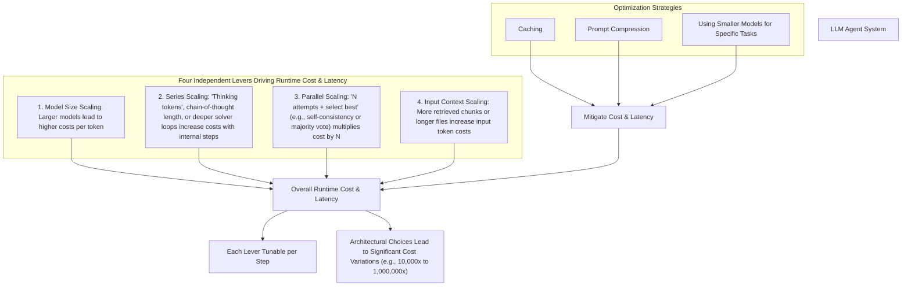
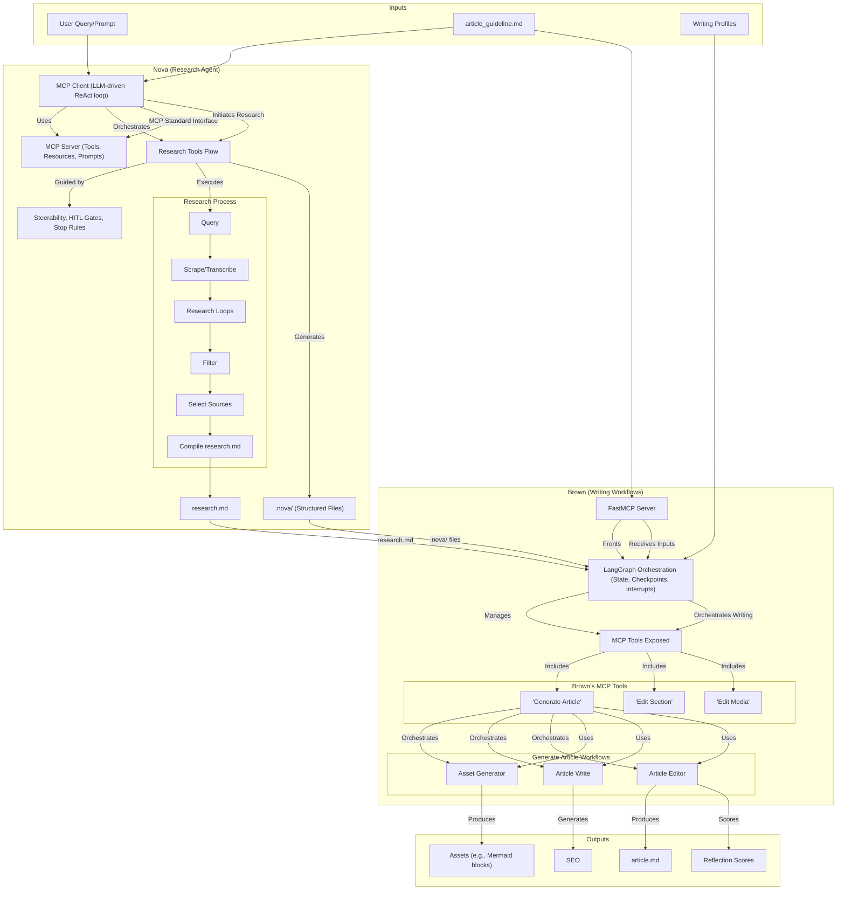
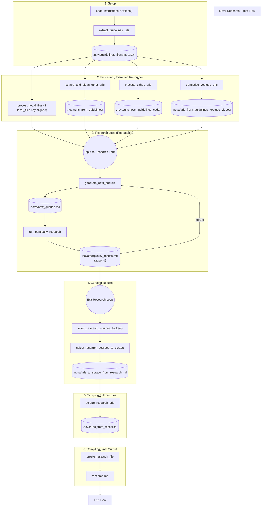
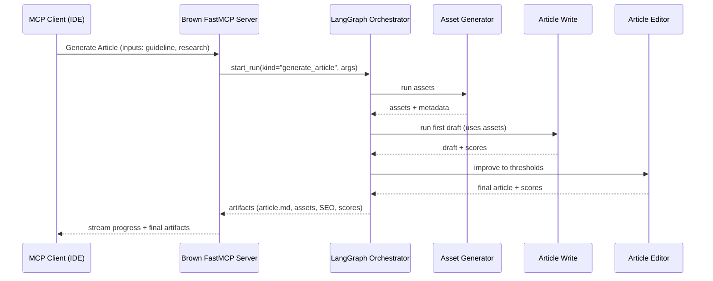

# Lesson 14: A Practical Guide to LLM Agent System Design

In our previous lessons, we covered the foundational building blocks of AI engineering. We moved from the high-level landscape of agents and workflows to the practical mechanics of context engineering, structured outputs, planning, and memory. You learned how to orchestrate workflows with LangGraph and ensure tool portability with the Model Context Protocol (MCP). Now, it’s time to zoom out and address the bigger picture: system design.

The same LLM can feel brilliant or brittle depending on the engineering choices you make. How much you let it “think,” how many parallel attempts you allow, how much context you feed it, and where you place human approval gates are all critical decisions. These choices create order-of-magnitude swings in cost, latency, and reliability. Modern reasoning models allow you to trade test-time compute for quality, but this capability comes at a price. This is not just a theoretical concern; it is a practical reality that directly impacts the feasibility and performance of any AI product.

We learned this firsthand while building our two-agent capstone system. Early end-to-end runs of our research agent (Nova) and writing workflow (Brown) sometimes took 20–30 minutes and burned through tokens at an alarming rate. The initial results were slow, expensive, and unreliable. The system felt more like a costly experiment than a production-ready tool. By systematically tightening reasoning budgets, shrinking context, adding human-in-the-loop (HITL) gates at expensive steps, and fronting our writing workflows with a FastMCP server, we brought cost and latency under control without sacrificing the quality of the final output. This experience reinforced a core principle: thoughtful system design is not optional. It is the discipline that separates successful AI products from failed prototypes.

This lesson gives you a repeatable decision framework that you can reuse on any agent project. We will break down the complex process of agent design into a series of clear, actionable steps. We will also provide a high-resolution map of our capstone’s architecture so you know exactly how the upcoming implementation lessons plug into the big picture.

## A General AI Engineering Decision Framework

Building a reliable agent system requires a structured approach. Simply picking the latest model and hoping for the best is a recipe for failure. Instead, we use a step-by-step playbook to move from a problem statement to a robust system design that balances capability, cost, and reliability.

1.  **Define Value, Constraints, Cost & Latency:** Start by defining the success criteria for your project. What is the quality bar for the output? Are there specific privacy or compliance requirements to consider? Establish your expected volume, latency objectives (SLA), and, most importantly, your per-task spending limits. This initial step grounds your design in business reality and provides clear constraints to work within.
2.  **Choose Model Family & Capability Mix:** Your infrastructure and business needs often dictate the first choice between closed APIs and open-weight models. Closed APIs from providers like OpenAI, Anthropic, and Google offer state-of-the-art capability with low operational overhead. Open-weight models such as Llama, Qwen, and DeepSeek provide maximum control, customization, and data locality. They can be self-hosted or accessed via third-party APIs. Next, match the model's reasoning depth to your task. Exploratory, planning-heavy tasks need a dedicated reasoning model (e.g., GPT-5-Thinking, Anthropic's extended thinking, Gemini 2.5), while straightforward extraction or classification can use a faster, cheaper model. Finally, if your application needs to process images, documents, or video, select a model family with strong multimodal capabilities.
3.  **Define Your Context Strategy:** As we learned in Lessons 3 and 9, a large context window is not a free lunch. It is a common mistake to dump full documents into the prompt, assuming the model can handle it. This approach often leads to the "lost-in-the-middle" problem, where performance degrades long before the context limit is reached. Instead, prioritize selective retrieval, compression, and structured summaries to manage cost and improve reliability.
4.  **Pick an Orchestration Style:** Your choice of orchestration, which we covered in Lesson 2, depends on the predictability of your task. Use a **workflow** for predictable, auditable processes with defined steps. Use an **agent** for open-ended exploration that requires dynamic tool use. A **hybrid** approach, like the one in our capstone, is often the most practical solution for complex problems.
5.  **Establish a HITL & Evaluation Loop:** Human-in-the-loop is essential for preventing runaway costs, injecting domain expertise, and steering the agent through ambiguity. Define clear triggers for human intervention, such as low-confidence scores, sensitive actions, or policy flags. Your evaluation plan should start with small, task-specific tests that measure utility, factuality, and safety. Public leaderboards are a useful signal, but they are no substitute for custom evaluations tailored to your specific use case.
6.  **Set Tool Boundaries & Portability:** Keep heavy lifting inside your tools. Functions for scraping, data transformation, or complex calculations should be executed in your application code, not by the LLM. Design your tools for portability using a standard like MCP. This makes them reusable across different runtimes and clients, such as IDEs, saving significant development effort over time.
7.  **Choose Durability & Observability:** For complex, stateful tasks, select a runtime like LangGraph that provides checkpoints, resumability, and detailed tracing out of the box. These features are non-negotiable for production systems where reliability and debuggability are critical.

## Inference-Time Scaling and the Cost/Latency Calculus

Modern LLM systems have four independent levers that you can tune at runtime to balance cost, latency, and quality. Understanding how they interact and multiply is central to effective system design. Each can be adjusted on a per-step basis within your workflow.

1.  **Model Size Scaling:** This is the most straightforward lever. Larger, more capable models like GPT-4.5 have higher per-token costs than smaller, optimized models like Gemini 2.5 Flash-Lite. The difference can be substantial.
2.  **Series Scaling:** This refers to increasing the internal computational steps a model takes before answering, often called "thinking tokens" or a longer chain of thought. Reasoning models like OpenAI's o-series and Anthropic's models with "extended thinking" enable this, but the added reasoning comes at the cost of higher latency and token usage.
3.  **Parallel Scaling:** This involves running the same prompt multiple times in parallel and selecting the best response, typically through a majority vote (a technique known as self-consistency). This approach can significantly improve reliability for complex reasoning tasks but multiplies the cost by the number of parallel runs. Interestingly, recent research suggests that for many o1-like models, parallel scaling is more effective and efficient than serial scaling.
4.  **Input Context Scaling:** The more information you provide in the prompt—whether from retrieved documents or long files—the higher your input token costs [[1]](https://www.oreilly.com/radar/llm-system-design-and-model-selection/), [[2]](https://openai.com/index/learning-to-reason-with-llms/?utm_source=chatgpt.com), [[3]](https://docs.claude.com/en/docs/build-with-claude/extended-thinking), [[8]](https://arxiv.org/html/2502.12215v1).

Image 1: The four independent levers that drive runtime cost and latency in LLM agent systems, along with optimization strategies.

These levers multiply, meaning that architectural choices can lead to 10,000x or greater differences in the cost to solve a problem. Let's consider a toy example. Suppose a task requires analyzing a 10,000-token document.

A **naïve approach** might use a large reasoning model, feed the entire document into the context, and run three parallel attempts for reliability.
*   **Model:** GPT-5-pro (Input: $15/M, Output: $120/M)
*   **Input Tokens:** 10,000
*   **Output Tokens (with reasoning):** 2,000
*   **Parallel Runs:** 3
*   **Calculation:** (10,000 tokens * $15/1,000,000 + 2,000 tokens * $120/1,000,000) * 3 = ($0.15 + $0.24) * 3 = **$1.17 per task**

A **budgeted approach** might use RAG to select the most relevant 1,000 tokens, use a cheaper "mini" model, and skip parallelism.
*   **Model:** GPT-5-mini (Input: $0.25/M, Output: $2.00/M)
*   **Input Tokens:** 1,000 (from RAG) + 100 (prompt) = 1,100
*   **Output Tokens:** 500
*   **Parallel Runs:** 1
*   **Calculation:** (1,100 tokens * $0.25/1,000,000 + 500 tokens * $2.00/1,000,000) * 1 = $0.000275 + $0.001 = **$0.001275 per task** [[7]](https://openai.com/api/pricing/)

By making smarter system design choices, we reduced the cost by nearly 1,000x. This is the power of a disciplined engineering approach. You can further optimize by capping reasoning tokens, trimming context aggressively, caching repeated prompts, and preferring to do heavy lifting in tools to keep the LLM's context small and focused.

## Our Capstone: Global System Design

Now, let's apply this framework to our capstone project. This section provides a higher-resolution architectural map than we saw in Lesson 12, cementing the intuition for how our two agents, Nova and Brown, work together to automate the research and writing process.

Image 2: Global architecture of the two-agent capstone system, Nova and Brown, and their interfaces.

### Research Agent (Nova)

Nova is an agent designed for comprehensive, automated research. Its architecture is built around the Model Context Protocol (MCP) to ensure its tools are portable and reusable. An **MCP server** exposes a suite of research tools, resources, and prompts. A simple **MCP client** then runs an LLM-driven loop that follows a "Research Recipe"—a master prompt retrieved from the server. This recipe guides the agent through a multi-step process: query sources, scrape and transcribe them, run iterative research loops with Perplexity, filter the results, select top sources for a full scrape, and finally compile everything into a `research.md` file. The entire process is steerable, with configurable HITL gates and a critical stop rule to prevent failures [[5]](https://modelcontextprotocol.io/docs/getting-started/intro).

Image 3: End-to-end agent flow for the Nova Research Agent

### Writing Workflows (Brown)

Brown is a stateful writing system built with LangGraph for orchestration. It manages state, checkpoints, and interrupts, making it a durable and reliable workflow engine. We front this powerful engine with a **FastMCP server**, which exposes Brown's capabilities as three coarse-grained MCP tools. This hybrid architecture allows any MCP-compatible client, like an IDE, to trigger complex, long-running writing tasks with a simple tool call [[4]](https://langchain-ai.github.io/langgraph/concepts/human_in_the_loop/).

The exposed tools are:
*   **Generate Article:** This orchestrates three internal workflows in sequence: an **Asset Generator** to create media and structured data, an **Article Write** workflow for the first draft, and an **Article Editor** that performs iterative improvements until quality thresholds are met.
*   **Edit Section:** This runs the **Article Editor** on a specific part of the document, allowing for targeted revisions.
*   **Edit Media:** This reruns the **Asset Generator** for specific items like diagrams or tables, using the latest text as context.

Image 4: Sequence diagram illustrating the interaction flow for the Brown agent's "Generate Article" workflow.

The handoff between Nova and Brown is simple and file-based. Nova produces `research.md` and a structured `.nova/` directory. Brown takes these, along with the original `article_guideline.md` and writing profiles, as inputs. The final outputs are a polished `article.md`, a folder of assets, SEO metadata, and reflection scores. This clean separation of concerns makes the system modular, debuggable, and easier to maintain.

## Decision Matrix & Defaults for the Capstone

Applying our decision framework to the capstone project yields a concrete set of architectural choices. This matrix summarizes our defaults and the rationale behind them, providing a clear blueprint for the system we will build in the upcoming lessons. It translates the abstract principles from Section 2 into specific, practical decisions that balance performance, cost, and reliability for our research and writing tasks. Each choice reflects a deliberate trade-off, optimized for the specific requirements of our two-agent system.

| Decision Dimension | Our Default Choice | Rationale |
| :--- | :--- | :--- |
| **Model Family & Tiers** | - **Research Agent Thinking:** Gemini 2.5 Pro (reasoning-capable) with budgeted thinking.   - **Tools (Scrape/Clean):** Fast, cheap models or non-LLM logic.   - **Writing:** Reliable mid-tier model. | This tiered approach balances exploratory capability with cost-efficiency. Heavy lifting is delegated to specialized, cheaper tools, reserving the powerful and more expensive LLM for complex reasoning and planning tasks where its capabilities are most needed. This directly addresses the cost levers by using the right model for the right job. |
| **Reasoning Budgets** | - **Reasoning Effort:** Medium by default, with capped thinking tokens.   - **Parallel Attempts:** Off by default. | This strategy controls cost and latency while providing sufficient reasoning power for most tasks. Parallelism is a powerful but expensive tool for reliability, so we reserve it for critical validation steps only if simpler methods prove insufficient. This is a direct application of managing the series and parallel scaling levers. |
| **Context Strategy** | Strict summaries and selective retrieval. Caching for boilerplate prompts, summaries, and retrieval features. | We aggressively manage the context window to avoid the "lost-in-the-middle" problem and minimize token costs. By keeping the context lean and highly relevant at each step, we improve both performance and efficiency. This is our primary method for controlling the input context scaling lever. |
| **Orchestration & Portability** | - **Research (Nova):** MCP-driven agent loop (FastMCP server + client).   - **Writing (Brown):** LangGraph for durability, fronted by FastMCP for tool access. | MCP provides a standard, portable interface for tools, decoupling them from a specific agent implementation. LangGraph ensures the complex, multi-step writing workflow is stateful, resumable, and auditable, which is critical for production reliability and allows for sophisticated HITL patterns. |
| **HITL Policy** | Approve next research queries, the full-scrape URL list, and the final article. Critical stop on tool failures (e.g., 0/N scrapes successful). | This policy provides key control points to manage cost, ensure quality, and steer the agents through ambiguous decision points without requiring constant human micromanagement. It strikes a balance between autonomy and oversight, preventing costly errors before they happen. |
| **Artifacts & Contracts** | Guaranteed file-based handoffs (`research.md`, `article.md`, assets, scores) with a stable on-disk layout. | A clear, file-based contract between system components ensures a clean separation of concerns. This makes the system modular, simplifies debugging, and enables easy replayability for evaluation and auditing, which is essential for iterative development and quality assurance. |

Table 1: Decision matrix for the capstone project.

## Conclusion

You now have a structured decision framework for designing LLM agent systems, covering everything from model selection and reasoning budgets to orchestration style and HITL policies. You have also seen this framework applied to our capstone project, giving you a high-resolution global architecture of the Nova and Brown agents. This system-level understanding is the foundation upon which we will build in the coming lessons.

We will keep referring back to the decisions and diagrams in this lesson to connect our specific implementation choices to the broader system-level goals of managing cost, latency, and reliability. A solid architecture is the difference between a brittle prototype and a scalable, production-ready AI product.

In the next lesson, we will begin the hands-on implementation of our research agent, Nova. You will build the FastMCP server and client, define the core research tools, and orchestrate the multi-round research and filtering process that produces the final `research.md` file. Later, in Lessons 19–22, you will build the writing system, Brown, using LangGraph and exposing its workflows as MCP tools for generating and editing articles.

## References

1.  LLM System Design & Model Selection. (n.d.). O'Reilly. [https://www.oreilly.com/radar/llm-system-design-and-model-selection/](https://www.oreilly.com/radar/llm-system-design-and-model-selection/)
2.  OpenAI. (n.d.). Learning to reason with LLMs (o1). [https://openai.com/index/learning-to-reason-with-llms/?utm_source=chatgpt.com](https://openai.com/index/learning-to-reason-with-llms/?utm_source=chatgpt.com)
3.  Anthropic. (n.d.). Extended thinking & interleaved thinking docs. Claude Docs. [https://docs.claude.com/en/docs/build-with-claude/extended-thinking](https://docs.claude.com/en/docs/build-with-claude/extended-thinking)
4.  LangChain. (n.d.). Human-in-the-loop. [https://langchain-ai.github.io/langgraph/concepts/human_in_the_loop/](https://langchain-ai.github.io/langgraph/concepts/human_in_the_loop/)
5.  Model Context Protocol. (n.d.). What is the Model Context Protocol (MCP)?. [https://modelcontextprotocol.io/docs/getting-started/intro](https://modelcontextprotocol.io/docs/getting-started/intro)
6.  OpenAI. (n.d.). Introducing OpenAI o3 and o4-mini. [https://openai.com/index/introducing-o3-and-o4-mini/](https://openai.com/index/introducing-o3-and-o4-mini/)
7.  OpenAI. (n.d.). API Pricing. [https://openai.com/api/pricing/](https://openai.com/api/pricing/)
8.  Revisiting the Test-Time Scaling of o1-like Models: Do they Truly Possess Test-Time Scaling Capabilities?. (n.d.). arXiv. [https://arxiv.org/html/2502.12215v1](https://arxiv.org/html/2502.12215v1)
9.  Perplexity. (n.d.). Introducing Perplexity Deep Research. [https://www.perplexity.ai/hub/blog/introducing-perplexity-deep-research](https://www.perplexity.ai/hub/blog/introducing-perplexity-deep-research)
10. Google. (n.d.). Gemini Deep Research & Gemini 2.5 overview. [https://gemini.google/overview/deep-research/](https://gemini.google/overview/deep-research/)