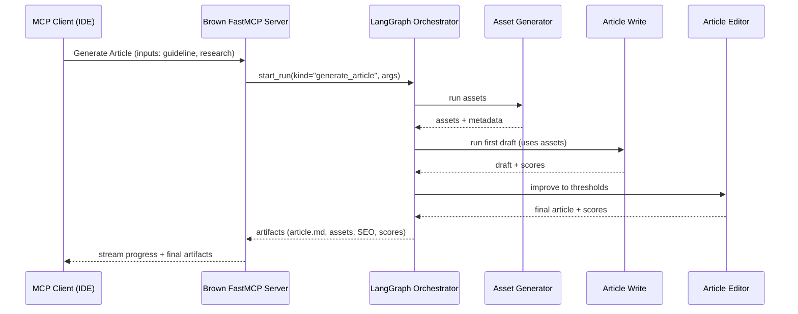

# Lesson 14 Guidelines

## Global Context of the Lesson

### What we share (overview)

This lesson gives students a **practical, reusable system‑design framework** for building LLM‑powered agents and workflows. We:

- **Zoom out** from frameworks (lesson 13) to the **engineering choices** that most determine reliability, latency, and cost.
- Teach a **step‑by‑step decision process**: problem framing → open vs. closed models → need for reasoning (and *how much*) → latency/cost budgets → orchestration style (workflow vs. agent vs. hybrid) → HITL & safety policy → evaluation plan.
- Explain the **four inference‑time scaling levers** (model size, *series* reasoning, *parallel* attempts, input context size) and how they multiply cost/latency when you turn them up.
- Introduce a **day‑one decision matrix** for AI engineering projects and then **instantiate it** for our capstone (research agent + writing workflows).
- Present a **more detailed global system design** (than lesson 12) of both agents: components, interfaces, contracts, and how they communicate—**without going too deep into algorithms we’ll cover later.** This lesson will keep things at the “dynamics of the system”.

### Why We Think It’s Valuable

In 2025, **system choices** (reasoning depth, parallelism, context strategy, human gates) often dwarf model choice, driving **10×–100×** variation in cost/latency and determining debuggability and safety. This lesson gives a **mental model, checklist, and defaults** so later lessons (15–23) slot cleanly into a coherent architecture.

### Expected Length of the Lesson

**2,500–3000 words** (body only), where we assume that 200–250 words ≈ 1 minute of reading time.

### Theory / Practice Ratio

**100% theory**.

---

## Anchoring the Lesson in the Course

### Details About the Course

This piece is part of a broader course on AI agents and LLM workflows. The course consists of **4 parts**, each with multiple lessons.

Thus, it’s essential to always anchor this piece into the broader course, understanding where the reader is in their journey. You will be careful to consider the following:

- The points of view
- To not reintroduce concepts already taught in the previous lessons
- To be careful when talking about concepts introduced only in future lessons
- To always reference previous and future lessons when discussing topics outside the piece’s scope

### Lesson Scope

This is **Lesson 14 of the course,** which is the third lesson of part 2 (out of 4 parts) of the course on **AI Agents & LLM Workflows**. Part 2 of the course has 22 lessons. This lesson 14 **does not** include a notebook; it is **conceptual** and **systems‑level**. It explains the rationale behind **system design choices** for the capstone (research + writing) and provides a step‑by‑step process to go from a problem to a workable agent system. We **do not** go into per‑tool code or algorithms; we stay at **system dynamics** and interfaces.

### Point of View

The course is created by a team writing for a single reader, also known as the student. Thus, for voice consistency across the course, we will always use **“we,” “our,” and “us”** to refer to the team who creates the course, and **“you” or “your”** to address the reader. Avoid singular first person and don’t use **“we”** to refer to the student.

**Example of correct point of view:**

- Instead of “Before we can choose between workflows and agents, we need a clear understanding of what they are,” write “To choose between workflows and agents, you need a clear understanding of what they are.”

### Who Is the Intended Audience

Aspiring AI engineers, first-time learners of **system design for agentic LLM systems**.

### Concepts Introduced in Previous Lessons

In previous lessons of the course, we introduced the following concepts:

**Part 1:**

- **Lesson 1 - AI Engineering & Agent Landscape**: Understanding the role, the stack, and why agents matter now
- **Lesson 2 - Workflows vs. Agents**: Grasping the crucial difference between predefined logic and LLM-driven autonomy
- **Lesson 3 - Context Engineering**: The art of managing information flow to LLMs
- **Lesson 4 - Structured Outputs**: Ensuring reliable data extraction from LLM responses
- **Lesson 5 - Basic Workflow Ingredients**: Implementing chaining, routing, parallel and the orchestrator-worker patterns
- **Lesson 6 - Agent Tools & Function Calling**: Giving your LLM the ability to take action
- **Lesson 7 - Planning & Reasoning**: Understanding patterns like ReAct (Reason + Act)
- **Lesson 8 - Implementing ReAct**: Building a reasoning agent from scratch
- **Lesson 9 - RAG Deep Dive**: Advanced retrieval techniques for knowledge-augmented agents
- **Lesson 10 - Agent Memory & Knowledge**: Short-term vs. long-term memory (procedural, episodic, semantic)
- **Lesson 11 - Multimodal Processing**: Working with documents, images, and complex data

Part 2:

- Lesson 12 - Capstone overview—**Nova** (research, MCP/FastMCP), **Brown** (writing, LangGraph + MCP)
- Lesson 13 - Frameworks overview & comparison; why we emphasize **LangGraph** for workflows; **MCP/FastMCP** for tool portability

### Concepts That Will Be Introduced in Future Lessons

In future lessons of the course, we will introduce the following concepts:

**Part 2:**

- **Lessons 15–18 — Building the Research Agent** with **FastMCP + MCP** (server/client, tools, prompt; ingestion; multi‑round research; filtering; `research.md`).
- **Lessons 19–22 — Building the Writing System** with **LangGraph + FastMCP** (MCP‑fronted workflows, writing profiles via context engineering, reflection/self‑critique, HITL editing via MCP clients).

**Part 3:**

- Evaluation, observability, optimization, deployment:
With the agent system built, this section focuses on the engineering practices required for production. You will learn to design and implement robust evaluation frameworks to measure and guarantee agent reliability, moving far beyond simple demos. We will cover AI observability, using specialized tools to trace, debug, and understand complex agent behaviors. Finally, you’ll explore optimization techniques for cost and performance and learn the fundamentals of deploying your agent system, ensuring it is scalable and ready for real-world use.

**Part 4:**

- Final project and certification:
In this final part of the course, you will build and submit your own advanced LLM agent, applying what you've learned throughout the previous sections. We provide a complete project template repository, enabling you to either extend our agent pipeline or build your own novel solution. Your project will be reviewed to ensure functionality, relevance, and adherence to course guidelines for the awarding of your course certification.

As lesson on the core foundation of AI engineering, we will have to make references to new terms that haven't been introduced yet. We will discuss them in a highly intuitive manner, being careful not to confuse the reader with too many terms that haven't been introduced yet in the course.

### Anchoring the Reader in the Educational Journey

Within the course, we teach the reader multiple topics and concepts. Thus, understanding where the reader is in their educational journey is critical for this piece. You must use only previously introduced concepts, while being cautious about using concepts that haven't been introduced yet.

When discussing the **concepts introduced in previous lessons** listed in the `Concepts Introduced in Previous Lessons` section, avoid reintroducing them to the reader. Especially don't reintroduce the acronyms. Use them as if the reader already knows what they are.

Avoid using all the **concepts that haven't been introduced in previous lessons,** listed in the `Concepts That Will Be Introduced in Future Lessons` subsection. Whenever another concept requires references to these banned concepts, instead of directly using them, use intuitive analogies or explanations that are more general and easier to understand, as you would explain them to a 7-year-old. For example:

- If the "tools" concept hasn't been introduced yet and you have to talk about agents, refer to them as "actions".
- If the "routing" concept isn't introduced yet and you have to talk about it, refer to it as "guiding the workflow between multiple decisions". You can use the concepts that haven't been introduced in previous lessons, listed in the `Concepts That Will Be Introduced in Future Lessons` subsection only if we explicitly specify them. Still, even in that case, as the reader doesn't know how that concept works, you are only allowed to use the term, while keeping the explanation extremely high-level and intuitive, as if you were explaining it to a 7-year-old. Whenever you use a concept from the `Concepts That Will Be Introduced in Future Lessons` subsection, explicitly specify in what lesson it will be explained in more detail, leveraging the particulars from the subsection. If not explicitly specified in the subsection, simply state that we will cover it in future lessons without providing a concrete lesson number.

In all use cases, avoid using acronyms that aren't explicitly stated in the guidelines. 

---

## Narrative Flow (macro)

Follow the next narrative flow when writing the end‑to‑end lesson:

1. Problem & stakes →
2. Why common approaches fall short →
3. Our theoretical solution (framework + levers) →
4. Simple examples/diagram(s) →
5. Deeper theory →
6. More complex example →
7. Connect to broader AI Engineering + next steps in the course.

---

## Lesson Outline

1. **Section 1 — Introduction**
2. **Section 2 — A general AI engineering decision framework**
3. **Section 3 — Inference‑time scaling and the cost/latency calculus (the four levers)**
4. **Section 4 — Our capstone: global system design**
5. **Section 5 — Decision matrix & defaults for the capstone**
6. **Section 6 — Conclusion**

---

## Section 1 — Introduction

- **Quick reference to what we've learned in previous lessons:** Pull the key takeaways from L1–L13 (see lists above) **without** re‑explaining them.
- **Transition to what we'll learn in this lesson:** After presenting what we learned in the past, make a transition to what we will learn in this lesson. Take the core ideas of the lesson from the `What We Are Planning to Share` subsection and highlight the importance and existence of the lesson from the `Why We Think It's Valuable` subsection of the `Global Context of the Lesson` section.
    - **Problem framing:** The same LLM can feel brilliant or brittle based on **system design choices**: how much you let it “think,” how many parallel attempts you allow, how much context you feed, and where you place human approval gates. These create **order‑of‑magnitude** swings in cost/latency and govern reliability. Modern reasoning models allow trading **test‑time compute** for quality, but you pay for it.
    - **Relate to the capstone:** Early end‑to‑end runs of our **two‑agent** system (research + writing) sometimes took **20–30 minutes** and burned tokens. Tightening **reasoning budgets**, shrinking context, adding **HITL gates** at expensive steps, and—on the writing side—**fronting the writing workflows with a FastMCP server** (so you can launch **Generate Article / Edit Section / Edit Media** from an MCP client like an IDE, basically each workflow becomes an MCP tool) brought cost and latency under control **without** sacrificing quality.
    - **What this lesson gives you:** A **repeatable decision framework** you can reuse on any agent project, plus a **high‑resolution map** of our capstone’s architecture so you know how later lessons plug into the big picture.
- **Section length:** 400 **words**

---

## Section 2 — A general AI engineering decision framework

Teach a concrete, 9**‑step playbook** to go **from problem to system design**. Keep language simple; emphasize cause‑and‑effect.

1. **Define value, constraints, cost & latency**
    - Success/quality bar, SLA, privacy/compliance, expected volume, scale.
    - Latency objective, parallelism & retry policy, cache strategy, and per-task/per-step spend limits.
2. **Choose model family & capability mix**
    - **Model class (business/infra first):**
    Closed APIs (OpenAI, Anthropic, Google) → capability & low ops.
    Open-weight (Llama, Qwen, DeepSeek, …) → control/fine-tune/data-local; can be hosted via third-party APIs.
    - **Reasoning depth:**
    Exploratory/planning-heavy → reasoning model or “thinking” mode (GPT-5-Thinking; Anthropic extended thinking; Gemini 2.5).
    Straightforward extraction/classification → fast non-reasoning (or “mini reasoning”).
    - **Modality**
    If PDFs/images/video matter, pick strong vision+text families (connect back to Lesson 11).
3. **Context window & *effective* context**
    - Long context ≠ free lunch. Prefer selective retrieval, compression, structured summaries (recall L3 & L9).
    - Avoid dumping full scrapes; define eligibility rules for what enters context.
4. **Pick orchestration style (link back to Lesson 2).**
    - **Workflow** for predictable steps, checkpoints, and auditability.
    - **Agent** for flexibility, open‑ended exploration with tool use.
    - **Hybrid** is common (our capstone, see the writer agent).
5. **HITL & evaluation loop**
    - **HITL & safety policy:**
        
        Why: prevent runaway cost/actions, inject domain expertise, protect tone/style, steer ambiguity.
        Where: triggers (low confidence, sensitive actions, policy flags), critical stops.
        Examples: approve next queries and full-scrape URL lists in research; approve final messaging for customer-facing flows.
        
    - **Evaluation plan:**
    Start with small task-mirroring evals; measure utility, precision/recall, factuality, safety. Public leaderboards = signal, not verdict; prioritize task-specific metrics.
6. **Tool boundaries & portability**
    - Keep heavy lifting in **tools** (scrape/transcribe/transform), and prefer **protocol portability** (e.g., MCP) so tools are reusable across runtimes and clients (IDEs).
7. **Durability & observability choices**
    - Checkpoints, resumability, traceability—select a runtime (e.g., LangGraph) that gives you these where needed.
- **Deliverable for each decision:** a one-sentence default + one sentence trade-off rationale (feeds Section 5 matrix).
- **Section length:** 500 **words**

---

## Section 3 — Inference‑time scaling and the cost/latency calculus (the four levers)

- Teach the **four independent levers** that drive runtime cost/latency. Each can be tuned per step:
    1. **Model size scaling** *(bigger → costlier per token).*
    2. **Series scaling** *(“thinking tokens” / chain‑of‑thought length / deeper solver loops).*
        - Enabled by modern reasoning models (e.g., o‑series; Anthropic extended thinking). Costs grow with internal steps.
    3. **Parallel scaling** *(n attempts + select best)*.
        - Classic **self‑consistency** / majority‑vote improves reliability but multiplies cost ≈ *n*. Recent work argues **parallel beats sequential** scaling in many o1‑like models.
    4. **Input context scaling** *(more retrieved chunks/longer files → more input tokens)*.
- **Mini calculator:** Show a toy budget example:
    - **Cost ≈** Σ_steps *(input_tokens × price_in + output_tokens × price_out)* × *(parallel_k)*;
    - add **reasoning tokens** to output for models that bill them; include cache hits for repeated boilerplate (many providers offer **cached input** discounts).
    - Reference official pricing/announcements for concrete intuition (GPT-5‑mini examples).
    - Show clearly all the computations leading to the final result indicating the estimated total costs.
- Practical levers that can be easily tuned:
    - Cap **max_thinking_tokens / reasoning effort**.
    - Limit **parallel_k** except for critical checks.
    - **Trim context** with retrieval, summaries, and file‑level cleaning.
    - Prefer **work in tools** (where a tool has its own context, separated from the context of the LLM agent that is orchestrating the workflow) to keep **LLM context small.**
    - Cache repeated instructions.
- Include a **Cost Levers diagram** + a **worked example** (1–2 paragraphs) that computes the delta between “naïve” vs. “budgeted” settings. It should show that this optimization step is important and that there can be big differences in costs and performance if this step is done badly.
- **Section length:** 500 **words**

---

## Section 4 — Our capstone: global system design

- **Goal:** Cement intuition for all components of the two agents and their interfaces, without diving into per‑tool code (that’s lessons 15–22).
- **Macro architecture (higher‑resolution than L12):**
    - **Include and explain a global architecture diagram of both Nova and Brown (Mermaid)**:
    - **Research Agent (Nova)**: **MCP server** exposes tools/resources/prompts; a simple **MCP client** runs an LLM‑driven loop that first gets the Research Recipe (an MCP ressource, a prompt) which tells the LLM-drive loop, how to call those research tools (query → scrape/transcribe sources → research loops (generating questions and getting grounded answers with Perplexity) → filter Perplexity answers → select top sources and scrape them → compile final file with the full research `research.md`). This is **steerable**, with configurable **HITL** gates and a **critical stop** rule. MCP acts as a **standard interface** so any MCP‑speaking client can drive the server.
        - Talk in detail about the research agent design, leveraging the “SYSTEM_DESIGN.md” source file.
        - Include a Mermaid diagram summarizing the agent flow.
    - **Writing Workflows (Brown):** A **LangGraph‑orchestrated** workflow with **state, checkpoints, and interrupts**, now **fronted by a FastMCP server** so it can be triggered from MCP clients (e.g., Cursor). Brown exposes **three coarse‑grained MCP tools** that map to its internal workflows:
        - **Generate Article (MCP tool)** → orchestrates **three internal workflows** in sequence:
        Asset Generator (derive/produce media and structured assets from inputs) →
        Article Write (first pass draft under constraints) →
        Article Editor (targeted improvement cycles to reach score thresholds).
        - **Edit Section (MCP tool)** → runs **Article Editor** on a specified span/section, optionally with user notes.
        - **Edit Media (MCP tool)** → runs **Asset Generator** for specific assets (e.g., diagrams, tables, figures) using the latest text context.

- **Interfaces & artifacts between agents:**
    
    Shared inputs: `article_guideline.md` (topic, audience, length, outline, style notes).
    
    Research outputs: structured files under `.nova/` plus `research.md` with curated notes/citations.
    
    Writing inputs: `article_guideline.md` +  `research.md`  + writing profiles.
    
    Writing outputs: `article.md` + assets (e.g., mermaid blocks, images), SEO, reflection scores.
    
- **HITL & execution model (writer)**: HITL interrupts live in LangGraph; when invoked via MCP tools, tool arguments control where to pause (e.g., “pause before publish,” “pause before editor passes,” “require approval on banned‑words cleanups”). The FastMCP layer provides client reach and a simple launch surface; the durability (checkpoints/resume) remains in LangGraph.
- **Section length:** 500**–700 words**

---

## Section 5 — Decision matrix & defaults for the capstone

- Present a **project‑specific matrix** that maps key decisions → our chosen defaults → rationale. Keep this high‑level, as the next lessons will dive into the actual implementation of the two agents and so we’ll have space there to explain the specific choices better.
- Dimensions to decide:
    - **Model family & tiers**
        - *Research agent thinking tasks:* **Reasoning‑capable** tier (e.g., Gemini 2.5 Pro) with **budgeted** thinking; tool work done outside the LLM for efficiency. Rationale: exploration + long context when needed at acceptable cost.
        - *Scrape/clean/transcribe tools:* **Fast, cheap** models (or no LLM) inside tools; concurrency inside tools.
        - *Writing stages:* **Reliable mid‑tier** model; escalate only for global checks if needed.
    - **Reasoning budgets**
        - Default **reasoning effort**: *medium*; cap thinking tokens (when supported).
        - **Parallel attempts**: off by default;
    - **Context strategy**
        - Strict **summaries & selective retrieval**; avoid dumping full scrapes in context.
        - **Caching:** Cache **boilerplate/system prompts**, reusable **summaries**, and **retrieval features** where supported.
    - **Orchestration & portability**
        - **Research:** MCP‑driven agent loop (FastMCP server + client).
        - **Writing:** **LangGraph** for durability (state, checkpoints, interrupts) **fronted by FastMCP** for **MCP tool access** (Generate Article / Edit Section / Edit Media) from IDEs and other clients.
    - **HITL policy**
        - Approve **next queries**, **full‑scrape URL list**, and **final article**. This is not directly specified in the MCP prompt with the agentic workflow, but the MCP prompt is structured so that, at start, it would ask the user if he wants to run the workflow with modifications: here, the user can specify where he’d like to have HITL gates.
        - **Critical stop** when a tool reports 0/N success (e.g., failed scraping batch).
    - **Artifacts & contracts**
        - Guaranteed handoffs: `research.md` and `article.md` + assets + scores; stable on‑disk layout for replay and audits.
- **Section length:** **400 words**

---

## Section 6 — Conclusion

- **Big picture:** You now have a **decision framework** for model choice, reasoning budgets, orchestration style, and HITL policy; you’ve also seen our **global architecture** at higher resolution than lesson 12.
- To transition from this lesson to the next, specify what we will learn in future lessons. First mention what we will learn in next lesson, which is Lesson 15. Next leverage the concepts listed in subsection `Concepts That Will Be Introduced in Future Lessons` to make slight references to other topics we will learn during this course. To stay focused, specify only the ones that are present in this current lesson.
    - **Lesson 15 (next):** You’ll start implementing the **research agent (Nova)** with **FastMCP + MCP** server/client, ingestion, multi‑round research, filtering, and `research.md`.
    - **Lessons 19–22:** You’ll build the **writing system (Brown)** with **LangGraph + FastMCP**, including MCP‑fronted entry points (**Generate Article / Edit Section / Edit Media**), writing profiles via context engineering, reflection/self‑critique loops, and HITL editing via MCP clients.
    - We’ll keep referring back to **this lesson** to connect local decisions to system‑level goals (cost, latency, reliability).
- **Section length:** **200 words**

---

## Article Code

**No notebook or code** for this lesson.

---

## Golden Sources

0. Local files to use during research and writing:
    - [NOVA_SYSTEM_DESIGN]("/Users/omar/Documents/ai_repos/course-ai-agents/lessons/14_agent_system_design/nova_system_design_notes.md")
1. [LLM System Design & Model Selection](https://www.oreilly.com/radar/llm-system-design-and-model-selection/)
2. [Learning to reason with LLMs (o1)](https://openai.com/index/learning-to-reason-with-llms/?utm_source=chatgpt.com)
3. [Anthropic — Extended thinking & interleaved thinking docs](https://docs.claude.com/en/docs/build-with-claude/extended-thinking)
4. [LangGraph docs — HITL](https://langchain-ai.github.io/langgraph/concepts/human_in_the_loop/)
5. [Model Context Protocol (MCP) — official site](https://modelcontextprotocol.io/docs/getting-started/intro)
6. [OpenAI — o3 & o4‑mini announcement](https://openai.com/index/introducing-o3-and-o4-mini/)
7. [OpenAI API pricing](https://openai.com/api/pricing/)
8. [Parallel vs. sequential test‑time scaling](https://arxiv.org/html/2502.12215v1)
9. [Perplexity — Deep Research announcement](https://www.perplexity.ai/hub/blog/introducing-perplexity-deep-research)
10. [Gemini Deep Research & Gemini 2.5 overview](https://gemini.google/overview/deep-research/)