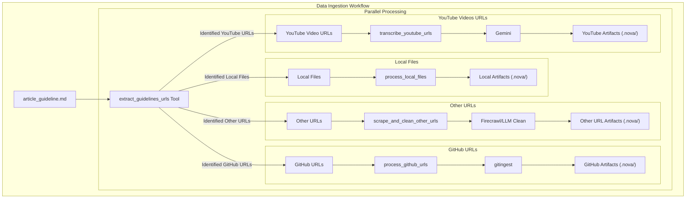
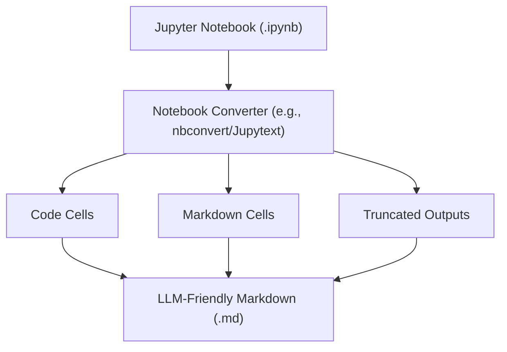
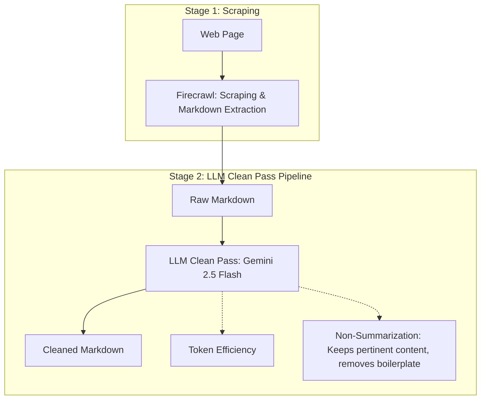
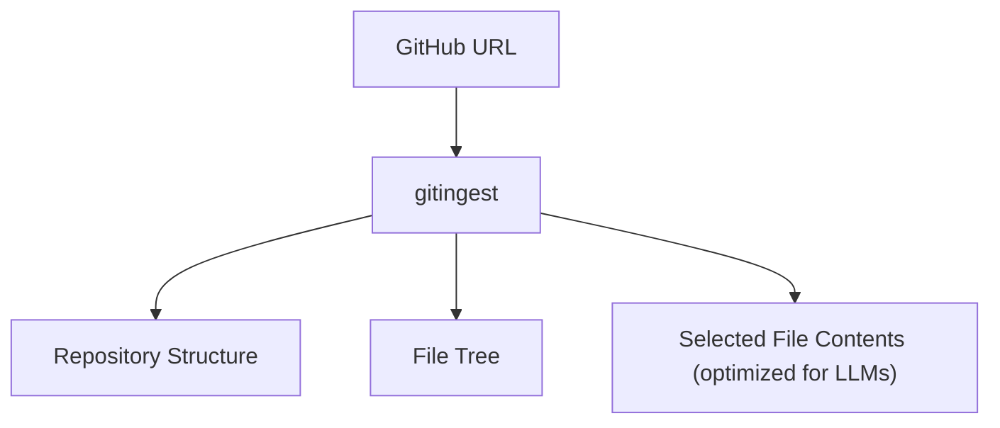
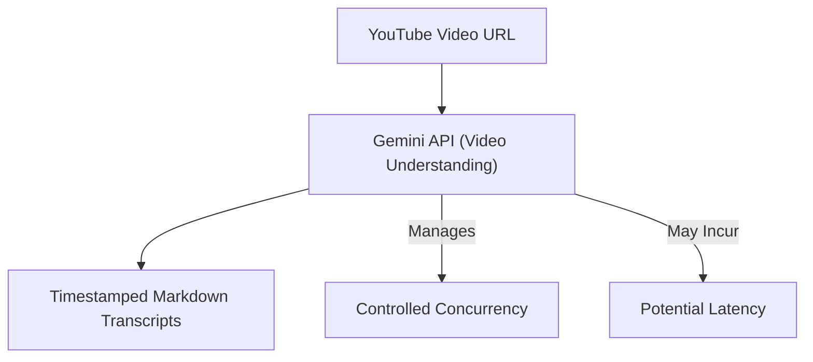
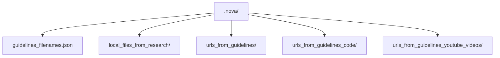
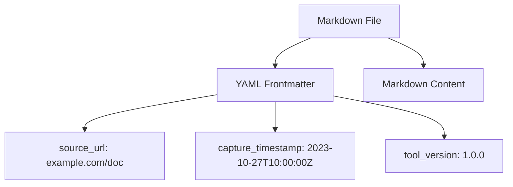
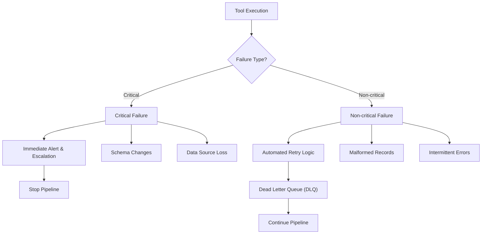

# Lesson 17: Building a Production-Ready Data Ingestion Layer

In our last lesson, we set up the foundation for our research agent by building an MCP server and client. We learned how to define and discover tools, resources, and server-hosted prompts, establishing a standard way for our agent to interact with its environment. Now, it is time to build the first essential component of the research workflow: the data ingestion layer.

The performance of a research agent depends directly on the quality of its data inputs. Many agent projects fail not because of flawed reasoning but because their data inputs are noisy, redundant, and expensive to process. This problem of "ingestion debt" leads to high costs, slow performance, and unreliable outputs. To avoid this, we will engineer a reliable ingestion pipeline guided by a file-first, tool-light philosophy. Instead of returning large data payloads, our tools will write structured, LLM-ready markdown files to disk and return only short, concise summaries to the agent. This design keeps the agent's context window clean, reduces token consumption, and makes the entire workflow more reliable and auditable.

## From MCP Setup to Ingestion: The Plan

Before diving into the implementation, it is important to understand the anti-patterns that lead to ingestion debt. Real-world research agents often fail by adopting naive data-handling strategies. We want to avoid these common pitfalls:
*   **Dumping entire pages into prompts:** This is the most common mistake. It explodes token costs and hits context window limits, a core issue we discussed in **Lesson 14**.
*   **Using simple scrapers:** Relying on basic HTTP requests or simple browser automation fails on modern websites with dynamic JavaScript rendering and anti-bot protections.
*   **Returning full content from tools:** When a tool returns a large block of text, it bloats the agent's context, makes retrying failed steps difficult, and increases latency.
*   **Inconsistent file naming and paths:** Without a clear convention, artifacts can overwrite each other, and it becomes impossible to trace data back to its source.
*   **Sequential processing of independent sources:** Running ingestion tasks one after another when they could be parallelized creates unnecessary bottlenecks and slows down the entire workflow.

Our approach directly counters these problems. By building on the MCP framework from **Lesson 16**, we will create a set of specialized ingestion tools. This architecture is a direct application of the system design principles we covered in **Lesson 14**, where we emphasized a file-first contract to manage costs and complexity. It also reflects the agent/workflow split and framework trade-offs discussed in **Lessons 12 and 13**, where we separated the heavy lifting of data processing from the agent's core reasoning loop.

## The Ingestion Workflow and Endpoints

Our ingestion strategy is defined within the server-hosted prompt we explored in **Lesson 16**, specifically in `mcp_server/src/prompts/research_instructions_prompt.py`. This prompt acts as a discoverable recipe that any MCP client can execute. Steps 1 and 2 of this recipe form our data ingestion layer.


Image 1: Flowchart illustrating the overall data ingestion workflow for the MCP-based research agent, emphasizing a file-first approach and parallel processing for various data sources leading to respective artifact folders.

The workflow begins by extracting all data sources from the `article_guideline.md` file. Then, it processes each source type in parallel. It uses specialized tools for local files, web pages, GitHub repositories, and YouTube videos.

These tools are registered as endpoints in our MCP server. If you open `mcp_server/src/routers/tools.py`, you will find the five tools that power our ingestion pipeline:
1.  `extract_guidelines_urls`
2.  `process_local_files`
3.  `scrape_and_clean_other_urls`
4.  `process_github_urls`
5.  `transcribe_youtube_urls`

Each tool is designed to perform a specific task, write its output to a designated file or folder, and return a compact JSON object with a status, counts, and output path. This approach ensures the agent orchestrating the workflow remains lightweight and token-efficient, as discussed in **Lesson 14**.

## Extracting URLs and Local References

The entire workflow kicks off with a single tool: `extract_guidelines_urls`. Its job is to parse the `article_guideline.md`, identify all external and internal resource links, and create a structured JSON file that the subsequent tools will use as their input. This creates a stable, on-disk contract that decouples the extraction logic from the processing logic.

The implementation, found in `extract_guidelines_urls_tool.py`, uses regular expressions to find URLs and categorizes them by domain (GitHub, YouTube, other). It also identifies local file paths, filtering for specific extensions like `.py`, `.ipynb`, and `.md`.

1.  The tool reads the `article_guideline.md` file to get its content.
2.  It uses a regular expression, `r"https?://[^\s)>\"',]+"`, to find all HTTP and HTTPS links in the text [[12]](https://www.tomarkdown.org/guides/markdown-best-practice). These are then sorted into categories: `github_urls`, `youtube_videos_urls`, and `other_urls`.
3.  The extracted data is written to `.nova/guidelines_filenames.json`.
4.  Finally, it returns a concise summary dictionary to the agent.

Let's run this tool on a sample research folder.

1.  Here is the code to run the tool.
    ```python
    from research_agent_part_2.mcp_server.src.tools import extract_guidelines_urls_tool
    
    research_folder = "/path/to/research_folder"
    result = extract_guidelines_urls_tool(research_folder=research_folder)
    print(result)
    ```
    It outputs:
    ```json
    {
        "status": "success",
        "github_sources_count": 1,
        "youtube_sources_count": 1,
        "web_sources_count": 2,
        "local_files_count": 0,
        "output_path": "/path/to/research_folder/.nova/guidelines_filenames.json",
        "message": "Successfully extracted URLs from article guidelines..."
    }
    ```

This small, structured response gives the agent everything it needs to proceed to the next steps without cluttering its context with the URLs themselves.

## Organizing Local Files for LLMs

Once the guideline references are extracted, the `process_local_files` tool takes over for any local file paths found. Its primary function is to gather these files and convert them into a consistent, LLM-friendly format.

A key challenge with local files is handling different formats, especially Jupyter Notebooks. A raw `.ipynb` file is a JSON structure that is not ideal for an LLM to read. This tool converts notebooks into clean Markdown, including both code and text cells, while truncating long cell outputs to conserve tokens. This makes the notebook's content accessible and digestible for the agent [[13]](https://dev.to/coderatul/converting-jupyter-notebooks-to-markdown-made-easy-with-nbconvert-8dl), [[14]](https://jupyterbook.org/file-types/myst-notebooks.html).


Image 2: Flowchart showing the conversion of Jupyter Notebooks to LLM-friendly Markdown, emphasizing the retention of code, markdown, and truncated outputs.

The tool, implemented in `process_local_files_tool.py`, reads the `local_file_paths` from the JSON registry, copies each file into the `.nova/local_files_from_research/` directory, and performs the notebook-to-Markdown conversion where needed. If no local files are referenced, it returns a success status with zero counts, which is a non-critical outcome that allows the workflow to continue.

## Scraping and Cleaning Web Pages in Parallel

Processing web pages is often the most unreliable part of data ingestion. Websites are dynamic, protected by anti-bot measures, and filled with boilerplate content like ads, navigation bars, and footers. Building a scraper to handle this complexity is a significant engineering challenge.

Instead of building a complex scraper from scratch, we use Firecrawl, a specialized service designed to turn websites into clean, LLM-ready data [[5]](https://www.firecrawl.dev/). Our `scrape_and_clean_other_urls` tool implements a reliable, two-stage pipeline for this task.


Image 3: A two-stage LLM clean pass pipeline for scraped web content, highlighting token efficiency and non-summarization.

1.  **Stage 1: Firecrawl Scraping**. The `scrape_url` function calls the Firecrawl API to fetch a webpage's content as Markdown. It includes logic for retries with exponential backoff and sets a `maxAge` cache parameter, which can speed up repeated scrapes of the same URL [[15]](https://www.shaped.ai/blog/10-best-practices-in-data-ingestion).

2.  **Stage 2: LLM Clean Pass**. After getting the raw markdown, the `clean_markdown` function invokes a Gemini model with a specific prompt: "*clean markdown content scraped from a webpage by only removing all irrelevant sections... Do not summarize or rewrite the original content*." This step strips away the noise, leaving only the core information pertinent to the research guidelines [[16]](https://www.tigerdata.com/blog/document-loading-parsing-and-cleaning-in-ai-applications), [[17]](https://arxiv.org/html/2502.01968v1).

This entire process runs concurrently for all URLs in the `other_urls` list, with a configurable `concurrency_limit` to manage load and respect API rate limits [[15]](https://www.shaped.ai/blog/10-best-practices-in-data-ingestion), [[18]](https://learn.microsoft.com/en-us/answers/questions/1283307/azure-data-factory-best-practices).

All cleaned content is saved to the `.nova/urls_from_guidelines/` directory, and the tool returns a summary of successful and failed scrapes.

## Ingesting Content from GitHub

Code repositories are another unique data source that requires a specialized approach. A generic web scraper cannot effectively parse directory structures, identify relevant code files, or understand dependencies. For this, we use `gitingest`, a tool built to turn any Git repository into a simple text digest optimized for LLMs [[7]](https://gitingest.com/).


Image 4: Flowchart illustrating the ingestion of GitHub repository content for LLM analysis using gitingest.

The `process_github_urls` tool iterates through the `github_urls` from our JSON registry and calls `gitingest` for each. This tool can handle both public and private repositories (if a GitHub token is provided). It generates a Markdown file containing the repository's file tree and the content of key files, which is then saved to `.nova/urls_from_guidelines_code/`. This structured approach provides the agent with a comprehensive yet concise overview of the codebase without overwhelming its context window [[19]](https://arxiv.org/html/2406.01422v1).

## Transcribing YouTube Videos

Video content is a rich source of information, and modern multimodal models like Gemini can process it directly. Our `transcribe_youtube_urls` tool uses Gemini's video understanding capabilities to transcribe YouTube videos.


Image 5: Flowchart depicting the process of transcribing YouTube videos using Gemini's multimodal capabilities, including considerations for concurrency and latency.

The core logic resides in the `transcribe_youtube` helper function. It makes a `generate_content` call to the Gemini API, passing the YouTube URL directly as a `file_uri` part [[6]](https://ai.google.dev/gemini-api/docs/video-understanding). No manual downloading or audio extraction is needed. The prompt asks the model to provide a transcript with timestamps at a specified interval.

1.  Here is the code that calls the Gemini API to transcribe a video.
    ```python
    prompt = PROMPT_YOUTUBE_TRANSCRIPTION.format(timestamp=timestamp)
    
    parts: list[types.Part] = [
        types.Part(
            file_data=types.FileData(file_uri=url)  # YouTube URL - no download needed
        ),
        types.Part(text=prompt),
    ]
    
    response: types.GenerateContentResponse = await client.aio.models.generate_content(
        model=model_name,
        contents=types.Content(parts=parts),
    )
    
    output_path.write_text(response.text, encoding="utf-8")
    ```

It is important to note that video transcription can be time-consuming. A 40-minute video might take several minutes to process. To manage this, the tool processes videos concurrently but with a conservative limit to avoid hitting API rate limits. The resulting transcripts are saved as Markdown files in the `.nova/urls_from_guidelines_youtube_videos/` directory.

## Run Steps 1–2 End-to-End: Inspect .nova/, Handle Failures, and Wrap-Up

With all the tools wired, we can now drive the workflow, explore the generated artifacts, and see how the agent handles both success and failure.

First, we will drive the workflow using the server-hosted prompt. Start the in-memory client from the notebook and issue the following commands:
1.  `/prompt/full_research_instructions_prompt`: This loads the workflow. The agent will explain the steps and ask for the `research_directory`.
2.  Provide the path and instruct the agent: “**Run only Steps 1–2 and stop**.”

You will see the agent execute the tool calls in sequence: `extract_guidelines_urls` runs first, followed by the parallel execution of the processing tools. The key advantage of server-hosted prompts is that any MCP client can discover and run this same recipe, making our workflow portable [[3]](https://modelcontextprotocol.io/docs/concepts/prompts).

After the run completes, you can explore the artifacts in the `.nova/` directory.

Image 6: Directory tree diagram of the '.nova/' folder and its key subfolders and files.

This file-based approach provides two key benefits. First, it enhances token efficiency. The agent's context remains small because it only deals with short JSON summaries, not the full content of the ingested sources. Second, it improves auditability. All intermediate artifacts are stored on disk, making it easy to debug the pipeline and trace data back to its origin. For even better traceability, we can embed metadata like the source URL, capture timestamp, and tool version directly into the markdown files using YAML frontmatter [[20]](https://www.ssw.com.au/rules/best-practices-for-frontmatter-in-markdown/).


Image 7: Diagram illustrating the structure of a Markdown file with YAML Frontmatter for auditability metadata.

In a production system, things will inevitably go wrong. A key part of our design is a clear policy for handling critical versus non-critical failures [[15]](https://www.shaped.ai/blog/10-best-practices-in-data-ingestion), [[21]](https://airbyte.com/data-engineering-resources/data-ingestion-pipeline-best-practices-for-modern-organizations).


Image 8: Flowchart illustrating the decision-making process for handling critical versus non-critical failures in the data ingestion pipeline.

Here are the concrete failure triggers for our ingestion tools:
*   **`extract_guidelines_urls`**: Fails critically if `article_guideline.md` is missing or unreadable. It is a non-critical event if any source category count is zero.
*   **`process_local_files`**: Fails critically if it cannot write to the destination directory. It is non-critical if there are no files to process or if individual files fail to copy.
*   **`scrape_and_clean_other_urls`**: Fails critically only if there are URLs to process and every single one fails. It is non-critical if some fail but at least one succeeds, or if there were no URLs to begin with.
*   **`process_github_urls`**: Follows the same critical failure logic as the web scraping tool.
*   **`transcribe_youtube_urls`**: Also follows the same critical failure logic.

This distinction makes the agent resilient and prevents minor issues from derailing the entire research process.

## Conclusion

In this lesson, we built the complete data ingestion layer for our MCP-based research agent. We implemented a suite of specialized tools that follow a file-first, token-efficient design pattern. By using external services like Firecrawl and native Gemini capabilities, we created a pipeline that is reliable, scalable, and auditable.

The structured artifacts now stored in the `.nova/` directory are the clean, LLM-ready foundation upon which our agent will build its research. With this ingestion layer complete, we are ready to move on to the next phase of the workflow: the iterative research loop. In the upcoming lessons, we will see how the agent uses these artifacts to generate new queries, run deeper investigations, and ultimately synthesize a comprehensive research document.

## References

1. (n.d.). NOVA_SYSTEM_DESIGN. [file:///Users/omar/Documents/ai_repos/agentic-ai-engineering-course/lessons/14_agent_system_design/nova_system_design_notes.md](file:///Users/omar/Documents/ai_repos/agentic-ai-engineering-course/lessons/14_agent_system_design/nova_system_design_notes.md)
2. Tools. (n.d.). Model Context Protocol. [https://modelcontextprotocol.io/docs/concepts/tools](https://modelcontextprotocol.io/docs/concepts/tools)
3. Prompts. (n.d.). Model Context Protocol. [https://modelcontextprotocol.io/docs/concepts/prompts](https://modelcontextprotocol.io/docs/concepts/prompts)
4. Resources. (n.d.). Model Context Protocol. [https://modelcontextprotocol.io/docs/concepts/resources](https://modelcontextprotocol.io/docs/concepts/resources)
5. (n.d.). Firecrawl - The Web Data API for AI. [https://www.firecrawl.dev/](https://www.firecrawl.dev/)
6. Video understanding. (n.d.). Google AI for Developers. [https://ai.google.dev/gemini-api/docs/video-understanding](https://ai.google.dev/gemini-api/docs/video-understanding)
7. (n.d.). gitingest. [https://gitingest.com/](https://gitingest.com/)
8. Video understanding. (n.d.). Google Cloud. [https://cloud.google.com/vertex-ai/generative-ai/docs/multimodal/video-understanding](https://cloud.google.com/vertex-ai/generative-ai/docs/multimodal/video-understanding)
9. Model context protocol (MCP). (n.d.). OpenAI. [https://openai.github.io/openai-agents-python/mcp/](https://openai.github.io/openai-agents-python/mcp/)
10. Roth, E. (2024, November 25). Anthropic launches tool to connect AI systems directly to datasets. The Verge. [https://www.theverge.com/2024/11/25/24305774/anthropic-model-context-protocol-data-sources](https://www.theverge.com/2024/11/25/24305774/anthropic-model-context-protocol-data-sources)
11. (n.d.). Notebook — L17 Data Ingestion. [file:///Users/omar/Documents/ai_repos/agentic-ai-engineering-course/lessons/17_data_ingestion/notebook.ipynb](file:///Users/omar/Documents/ai_repos/agentic-ai-engineering-course/lessons/17_data_ingestion/notebook.ipynb)
12. (n.d.). Markdown Best Practice. [https://www.tomarkdown.org/guides/markdown-best-practice](https://www.tomarkdown.org/guides/markdown-best-practice)
13. Coder, A. (2023, September 21). Converting Jupyter Notebooks to Markdown Made Easy with nbconvert. DEV Community. [https://dev.to/coderatul/converting-jupyter-notebooks-to-markdown-made-easy-with-nbconvert-8dl](https://dev.to/coderatul/converting-jupyter-notebooks-to-markdown-made-easy-with-nbconvert-8dl)
14. MyST Notebooks. (n.d.). Jupyter Book. [https://jupyterbook.org/file-types/myst-notebooks.html](https://jupyterbook.org/file-types/myst-notebooks.html)
15. Murrell, T. (2025, June 11). 10 Best Practices in Data Ingestion: A Scalable Framework for Real-Time, Reliable Pipelines. Shaped. [https://www.shaped.ai/blog/10-best-practices-in-data-ingestion](https://www.shaped.ai/blog/10-best-practices-in-data-ingestion)
16. (n.d.). Document Loading, Parsing, and Cleaning in AI Applications. [https://www.tigerdata.com/blog/document-loading-parsing-and-cleaning-in-ai-applications](https://www.tigerdata.com/blog/document-loading-parsing-and-cleaning-in-ai-applications)
17. (n.d.). Token Cleaning: Fine-Grained Data Selection for LLM Supervised Fine-Tuning. arXiv. [https://arxiv.org/html/2502.01968v1](https://arxiv.org/html/2502.01968v1)
18. (n.d.). Azure Data Factory Best Practices. [https://learn.microsoft.com/en-us/answers/questions/1283307/azure-data-factory-best-practices](https://learn.microsoft.com/en-us/answers/questions/1283307/azure-data-factory-best-practices)
19. Ma, Y., Yang, Q., Cao, R., Li, B., Huang, F., & Li, Y. (n.d.). How to Understand Whole Software Repository? arXiv. [https://arxiv.org/html/2406.01422v1](https://arxiv.org/html/2406.01422v1)
20. (n.d.). Do you know the best practices for Frontmatter in markdown? [https://www.ssw.com.au/rules/best-practices-for-frontmatter-in-markdown/](https://www.ssw.com.au/rules/best-practices-for-frontmatter-in-markdown/)
21. (n.d.). Data Ingestion Pipeline Best Practices for Modern Organizations. Airbyte. [https://airbyte.com/data-engineering-resources/data-ingestion-pipeline-best-practices-for-modern-organizations](https://airbyte.com/data-engineering-resources/data-ingestion-pipeline-best-practices-for-modern-organizations)
22. (n.d.). Scrape API. Firecrawl. [https://docs.firecrawl.dev/features/scrape?utm_source=chatgpt.com](https://docs.firecrawl.dev/features/scrape?utm_source=chatgpt.com)
23. (n.d.). Metadata best practices. [https://experienceleague.adobe.com/en/docs/experience-manager-cloud-service/content/assets/best-practices/metadata-best-practices](https://experienceleague.adobe.com/en/docs/experience-manager-cloud-service/content/assets/best-practices/metadata-best-practices)
24. Chai, D., Li, P., Zhang, F., Jin, Y., Tian, H., Zhang, J., & Chen, K. (n.d.). Enhancing Token Filtering Efficiency in Large Language Model Training with Collider. arXiv. [https://arxiv.org/html/2502.00340v1](https://arxiv.org/html/2502.00340v1)
25. (n.d.). gitingest. [https://gitingest.com/?utm_source=chatgpt.com](https://gitingest.com/?utm_source=chatgpt.com)
