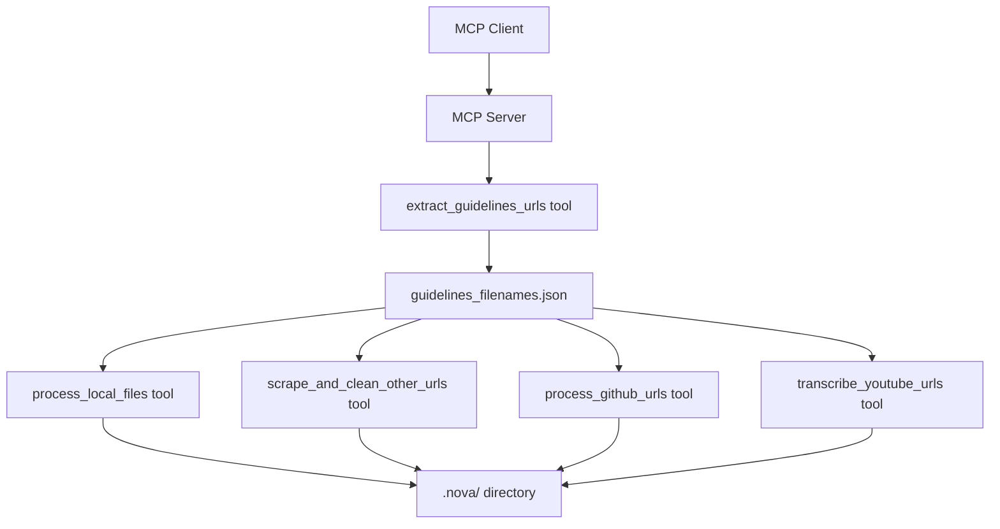
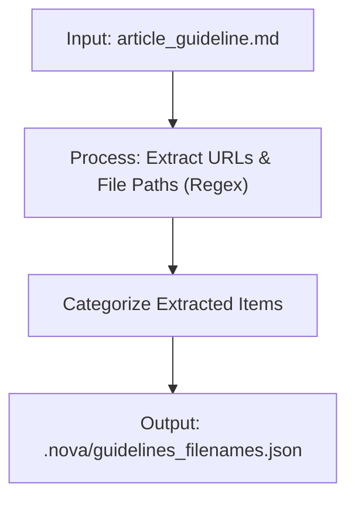
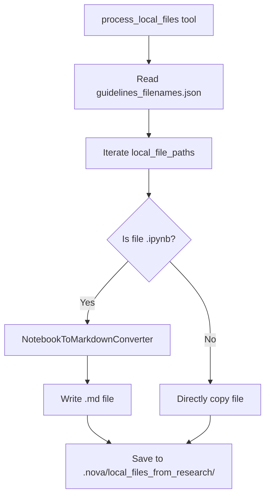
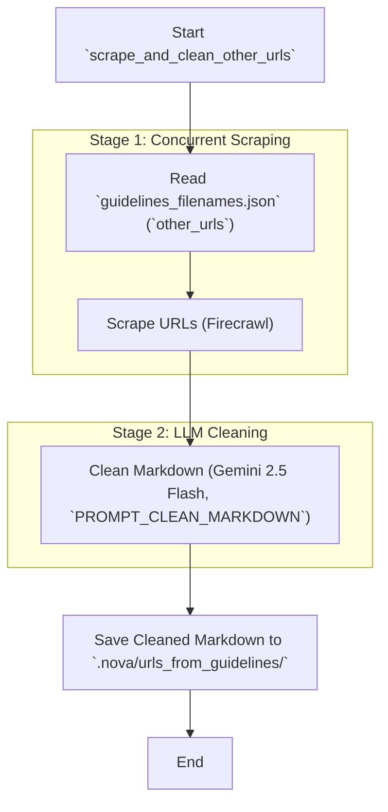
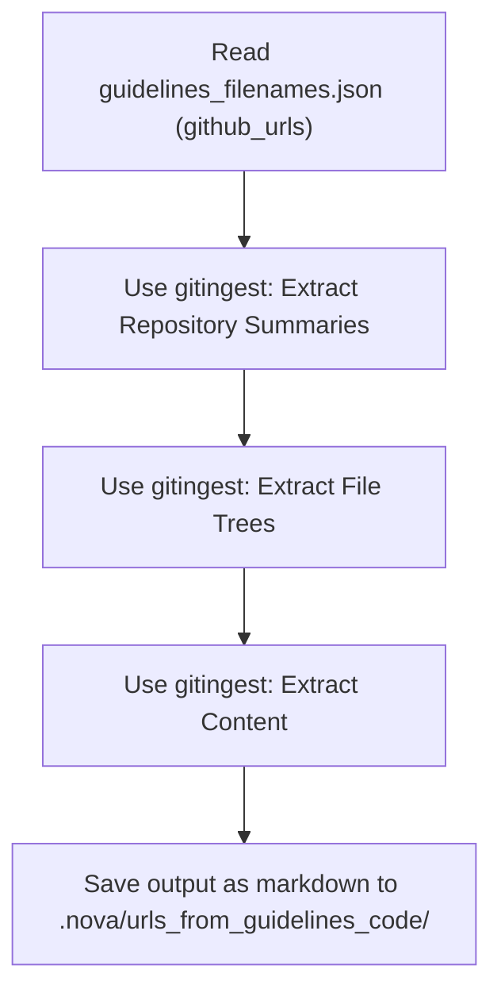
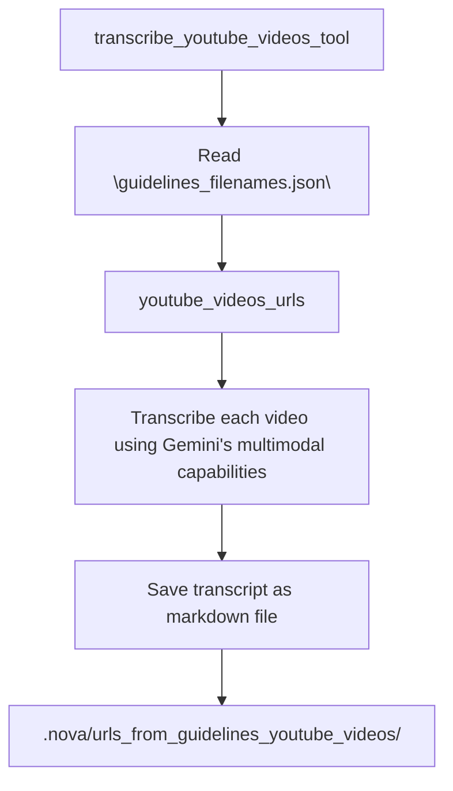
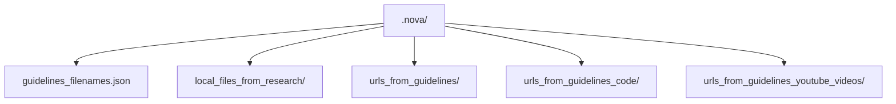
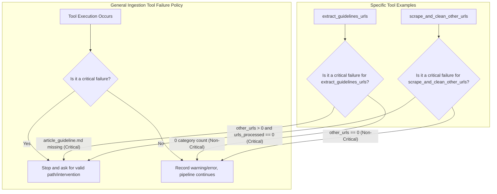

# Lesson 17: Data Ingestion for AI Research Agents

In our last lesson, we built the foundation for our research agent by setting up a Model Context Protocol (MCP) client and server. We learned how MCP acts as a universal standard, allowing an AI agent to discover and use tools hosted on a server. This design separates the agent's reasoning logic from the heavy lifting of tool execution, a key pattern for building scalable AI systems.

Now, we will build the first set of essential tools for that server: the data ingestion layer. Real-world research agents often fail not because their reasoning is flawed, but because their inputs are noisy, redundant, and expensive to process. Simply dumping raw web pages or entire codebases into a prompt leads to high token costs, slow response times, and confused LLMs. This is what we call "ingestion debt."

Without a proper ingestion strategy, you will encounter several anti-patterns. These include dumping entire web pages into prompts, which explodes token costs; using generic scrapers that fail on dynamic sites and introduce HTML noise; returning full, unprocessed content from tools, which bloats the agent's context; and using inconsistent file naming conventions that make auditing impossible.

To avoid this, we will build a robust ingestion pipeline that follows a file-first, tool-light philosophy. Each tool will perform a specific task, like scraping a webpage or transcribing a video. It will persist the heavy content to a local file and return only a short, structured summary to the agent. This keeps the agent's context window clean and its decision-making sharp.

In this lesson, you will implement the tools to execute the first two steps of our server-hosted research workflow. You will build tools to extract sources from an article guideline, process local files, scrape web pages, ingest GitHub repositories, and transcribe YouTube videos. By the end, you will have a functioning ingestion layer that turns diverse, unstructured data into clean, LLM-ready markdown, setting the stage for the advanced research cycles in our upcoming lessons.

## From MCP Setup to Ingestion: the Plan

Before we begin, ensure you have completed the setup from the previous lessons. We assume you have a running MCP server and client and understand the basics of MCP transports and capability discovery. For a refresher, you can always refer back to **Lesson 16**. Our focus here is on building the tools that will power our agent's research capabilities.

The core principle guiding our design is token efficiency. As discussed in **Lesson 14**, passing large data payloads directly to an LLM is costly and often counterproductive. Our ingestion tools will instead write their outputs to files and return only concise summaries to the agent. This file-first contract is essential for managing context and keeping inference costs down.

Let's start by setting up our environment.

1.  To run this lesson, you will need several API keys.
    ```python
    from utils import env
    
    env.load(required_env_vars=["GOOGLE_API_KEY", "FIRECRAWL_API_KEY", "GITHUB_TOKEN"])
    ```
    It outputs:
    ```text
    Environment variables loaded from /path/to/your/.env
    Environment variables loaded successfully.
    ```
    You need a Gemini API Key, a Firecrawl API Key for web scraping, and an optional GitHub token for processing private repositories. Firecrawl’s free tier is sufficient for our purposes.

2.  Next, we import the necessary packages. We use `nest_asyncio` to allow nested asynchronous operations within our Jupyter Notebook environment.
    ```python
    import nest_asyncio
    nest_asyncio.apply() # Allow nested async usage in notebooks
    ```

## Workflow & Endpoints: where the ingestion tools live

Our research agent’s workflow is defined by a server-hosted prompt, ensuring any MCP client can discover and execute the same research recipe. The first two steps focus entirely on data ingestion.

First, the agent extracts all source URLs and local file paths from the `article_guideline.md` file. This includes GitHub repositories, YouTube videos, web articles, and local notebooks or scripts. Second, it processes all these extracted resources in parallel, using a specialized tool for each source type.

Here is the excerpt from our MCP prompt that outlines these initial steps:
```markdown
1. Setup:

    1.1. Explain to the user the numbered steps of the workflow. Be concise. Keep them numbered so that the user
    can easily refer to them later.
    
    1.2. Ask the user for the research directory, if not provided. Ask the user if any modification is needed for the
    workflow (e.g. running from a specific step, or adding user feedback to specific steps).

    1.3 Extract the URLs from the ARTICLE_GUIDELINE_FILE with the "extract_guidelines_urls" tool. This tool reads the
    ARTICLE_GUIDELINE_FILE and extracts three groups of references from the guidelines:
    • "github_urls" - all GitHub links;
    • "youtube_videos_urls" - all YouTube video links;
    • "other_urls" - all remaining HTTP/HTTPS links;
    • "local_files" - relative paths to local files mentioned in the guidelines (e.g. "code.py", "src/main.py").
    Only extensions allowed are: ".py", ".ipynb", and ".md".
    The extracted data is saved to the GUIDELINES_FILENAMES_FILE within the NOVA_FOLDER directory.

2. Process the extracted resources in parallel:

    You can run the following sub-steps (2.1 to 2.4) in parallel. In a single turn, you can call all the
    necessary tools for these steps.

    2.1 Local files - run the "process_local_files" tool to read every file path listed under "local_files" in the
    GUIDELINES_FILENAMES_FILE and copy its content into the LOCAL_FILES_FROM_RESEARCH_FOLDER subfolder within
    NOVA_FOLDER, giving each copy an appropriate filename (path separators are replaced with underscores).

    2.2 Other URL links - run the "scrape_and_clean_other_urls" tool to read the `other_urls` list from the
    GUIDELINES_FILENAMES_FILE and scrape/clean them. The tool writes the cleaned markdown files inside the
    URLS_FROM_GUIDELINES_FOLDER subfolder within NOVA_FOLDER.

    2.3 GitHub URLs - run the "process_github_urls" tool to process the `github_urls` list from the
    GUIDELINES_FILENAMES_FILE with gitingest and save a Markdown summary for each URL inside the
    URLS_FROM_GUIDELINES_CODE_FOLDER subfolder within NOVA_FOLDER.

    2.4 YouTube URLs - run the "transcribe_youtube_urls" tool to process the `youtube_videos_urls` list from the
    GUIDELINES_FILENAMES_FILE, transcribe each video, and save the transcript as a Markdown file inside the
    URLS_FROM_GUIDELINES_YOUTUBE_FOLDER subfolder within NOVA_FOLDER.
        Note: Please be aware that video transcription can be a time-consuming process. For reference,
        transcribing a 39-minute video can take approximately 4.5 minutes.
```
This prompt acts as a discoverable recipe that instructs the agent on how to use the available tools to achieve its goal.

### Registering the Tools

The tools themselves are registered on our MCP server in `mcp_server/src/routers/tools.py`. This file defines the five ingestion endpoints that correspond to the steps in our prompt.
```python
def register_mcp_tools(mcp: FastMCP) -> None:
    """Register all MCP tools with the server instance."""
    
    # Step 1: Extract URLs and file references from guidelines
    @mcp.tool()
    async def extract_guidelines_urls(research_directory: str) -> Dict[str, Any]:
        """
        Extract URLs and local file references from article guidelines.
        
        Reads the ARTICLE_GUIDELINE_FILE file in the research directory and extracts:
        - GitHub URLs
        - Other HTTP/HTTPS URLs  
        - Local file references (files mentioned in quotes with extensions)
        
        Results are saved to GUIDELINES_FILENAMES_FILE in the research directory.
        """
        result = extract_guidelines_urls_tool(research_directory)
        return result

    # Step 2.1: Process local files
    @mcp.tool()
    async def process_local_files(research_directory: str) -> Dict[str, Any]:
        """Process local files referenced in the article guidelines."""
        result = process_local_files_tool(research_directory)
        return result
        
    # Step 2.2: Scrape web URLs
    @mcp.tool() 
    async def scrape_and_clean_other_urls(research_directory: str, concurrency_limit: int = 4) -> Dict[str, Any]:
        """Scrape and clean other URLs from GUIDELINES_FILENAMES_FILE."""
        result = await scrape_and_clean_other_urls_tool(research_directory, concurrency_limit)
        return result

    # Step 2.3: Process GitHub repositories
    @mcp.tool()
    async def process_github_urls(research_directory: str) -> Dict[str, Any]:
        """
        Process GitHub URLs from GUIDELINES_FILENAMES_FILE using gitingest.
        
        Reads the GUIDELINES_FILENAMES_FILE file and processes each URL listed
        under 'github_urls' using gitingest to extract repository summaries, file trees,
        and content. The results are saved as markdown files in the
        URLS_FROM_GUIDELINES_CODE_FOLDER subfolder.
        """
        result = await process_github_urls_tool(research_directory)
        return result
        
    # Step 2.4: Transcribe YouTube videos
    @mcp.tool()
    async def transcribe_youtube_urls(research_directory: str) -> Dict[str, Any]:
        """
        Transcribe YouTube video URLs from GUIDELINES_FILENAMES_FILE using Gemini 2.5 Pro.
        
        Reads the GUIDELINES_FILENAMES_FILE file and processes each URL listed
        under 'youtube_videos_urls'. Each video is transcribed, and the results are
        saved as markdown files in the URLS_FROM_GUIDELINES_YOUTUBE_FOLDER subfolder.
        """
        result = await transcribe_youtube_videos_tool(research_directory)
        return result
```
Each tool is decorated with `@mcp.tool()`, which exposes it to any connected MCP client. The function signatures and docstrings serve as the schema and description that the agent uses to understand what each tool does and how to call it.


Image 1: High-level flowchart illustrating the data ingestion workflow for the MCP Research Agent, covering Steps 1 and 2.

### Design Rationale: Short Returns and File-Based Outputs

Notice how each tool returns a concise dictionary, such as `{status, counts, output_path, message}`, rather than the full content it processes. This design is intentional and offers several advantages for building production-grade agents.

First, it enhances token efficiency. The agent receives only the essential metadata needed for its next reasoning step, not large blocks of text that would quickly fill its context window. Second, it improves context management. By keeping the agent's immediate context clean, we reduce the risk of the "lost-in-the-middle" problem and help the model stay focused on the task. Third, it enables selective reading. The agent can decide whether it needs to inspect the contents of an output file, but it is not forced to process it. This gives it more control over its own context. Finally, it simplifies error handling. A clear status message allows the agent to immediately understand whether a tool succeeded or failed and decide how to proceed.

## Tool to extract URLs & local references from the guideline

The first tool in our pipeline, `extract_guidelines_urls`, is responsible for parsing the initial `article_guideline.md` file. It programmatically finds all URLs and local file paths, categorizes them, and saves the results to a structured JSON file that will be used by all subsequent tools.

The implementation reads the guideline file, applies regular expressions to find URLs and local paths, and then writes a JSON object to a predefined location within the agent's working directory.


Image 2: A flowchart detailing the `extract_guidelines_urls` tool, showing input, processing steps, and output.

### URLs Extraction

To extract URLs, we use a simple but effective regular expression.
```python
def extract_urls(text: str) -> list[str]:
    """Extract all HTTP/HTTPS URLs from the given text."""
    url_pattern = re.compile(r"https?://[^\s)>\"',]+")
    return url_pattern.findall(text)
```
This pattern matches both `http://` and `https://` protocols and captures characters until it hits a space or other common delimiters. This ensures that URLs are extracted cleanly from various contexts, including plain text and Markdown links. After extraction, the URLs are sorted into categories like GitHub, YouTube, and others to enable specialized processing.

### Local File Path Extraction

The tool also identifies references to local files within the guidelines. It specifically looks for file paths with extensions like `.py`, `.ipynb`, or `.md`, while intelligently ignoring anything that resembles a URL. This allows you to include code samples, notebooks, or other documents directly in your research materials.

### Running the Tool

Let's test the tool to see its output.
```python
from research_agent_part_2.mcp_server.src.tools import extract_guidelines_urls_tool

# Update this path to your actual sample research folder
research_folder = "/path/to/research_folder"
result = extract_guidelines_urls_tool(research_folder=research_folder)
print(result)
```
It outputs:
```text
{'status': 'success', 'github_sources_count': 1, 'youtube_sources_count': 1, 'web_sources_count': 2, 'local_files_count': 0, 'output_path': '/path/to/research_folder/.nova/guidelines_filenames.json', 'message': "Successfully extracted URLs from article guidelines in '/path/to/research_folder'. Found 1 GitHub URLs, 1 YouTube videos URLs, 2 other URLs, and 0 local file references. Results saved to: /path/to/research_folder/.nova/guidelines_filenames.json"}
```
The tool returns a dictionary containing counts for each category and the path to the output JSON file. The expected JSON output has a clear structure:
```json
{
  "github_urls": ["https://github.com/..."],
  "youtube_videos_urls": ["https://youtube.com/..."],
  "other_urls": ["https://some-other-url.com/..."],
  "local_file_paths": ["path/to/local/file.py"]
}
```
This compact summary gives the agent everything it needs to know to proceed to the next step without having to parse the URLs itself. This file-first approach establishes a stable, on-disk contract that the rest of the workflow relies on.

## Tool to organize local files for LLMs (incl. Jupyter→Markdown)

Next, the `process_local_files` tool takes the file paths extracted in the previous step and prepares them for LLM consumption. For standard files like `.py` or `.md`, it simply copies them into a dedicated folder. The real value, however, comes from its handling of Jupyter Notebooks (`.ipynb`).

Notebooks are a rich source of information, containing code, markdown explanations, and cell outputs. To make this content accessible to an LLM, the tool converts each notebook into a clean, single Markdown file. This process preserves the code blocks, text, and even the outputs of executed cells, providing the agent with a complete and readable context.


Image 3: A flowchart illustrating the `process_local_files` tool.

Here is the implementation of the tool.
```python
def process_local_files_tool(research_directory: str) -> Dict[str, Any]:
    """
    Process local files referenced in the article guidelines.

    Reads the guidelines JSON file and copies each referenced local file
    to the local files subfolder. Path separators in filenames are
    replaced with underscores to avoid creating nested folders.

    Args:
        research_directory: Path to the research directory containing the guidelines JSON file

    Returns:
        Dict with status, processing results, and file paths
    """
    # ... (path setup and file reading logic) ...

    # Load JSON metadata
    data = json.loads(metadata_path.read_text(encoding="utf-8"))
    local_files = data.get("local_files", [])

    if not local_files:
        # ... (return success if no files to process) ...

    # Create destination folder
    dest_folder = nova_path / LOCAL_FILES_FROM_RESEARCH_FOLDER
    dest_folder.mkdir(parents=True, exist_ok=True)

    # ... (initialize counters and lists) ...

    # Initialize notebook converter
    notebook_converter = NotebookToMarkdownConverter(include_outputs=True, include_metadata=False)

    for rel_path in local_files:
        src_path = research_path / rel_path
        dest_name = rel_path.replace("/", "_").replace("\\", "_")

        try:
            if src_path.suffix.lower() == ".ipynb":
                dest_name = dest_name.rsplit(".ipynb", 1)[0] + ".md"
                dest_path = dest_folder / dest_name
                markdown_content = notebook_converter.convert_notebook_to_string(src_path)
                dest_path.write_text(markdown_content, encoding="utf-8")
            else:
                dest_path = dest_folder / dest_name
                shutil.copy2(src_path, dest_path)

            processed += 1
            processed_files.append(dest_name)
        except Exception as e:
            errors.append(f"Failed to process {rel_path}: {str(e)}")

    # ... (build result message and return dictionary) ...
```
The implementation details for the conversion are handled by a `NotebookToMarkdownConverter` class, which uses libraries like `nbformat` and `nbconvert` under the hood. By converting notebooks to a standardized Markdown format, we make their content predictable and easy for the agent to parse, reducing token waste and improving the reliability of information extraction.

## Tool to scrape & clean web pages in parallel

Web scraping is a complex task. Modern websites are filled with dynamic JavaScript-rendered content, anti-bot measures, and inconsistent HTML structures.

Our `scrape_and_clean_other_urls` tool uses a two-stage process that delegates the hard parts to specialized services.
```python
async def scrape_and_clean_other_urls_tool(research_directory: str, concurrency_limit: int = 4) -> Dict[str, Any]:
    """
    Scrape and clean other URLs from guidelines file in the research folder.
    
    Reads the guidelines file and scrapes/cleans each URL listed
    under 'other_urls'. The cleaned markdown content is saved to the
    URLS_FROM_GUIDELINES_FOLDER subfolder with appropriate filenames.
    """    
    # Convert to Path object
    research_path = Path(research_directory)
    nova_path = research_path / NOVA_FOLDER
    
    # Look for GUIDELINES_FILENAMES_FILE file
    guidelines_file_path = nova_path / GUIDELINES_FILENAMES_FILE
    
    # Read the guidelines filenames file
    guidelines_data = json.loads(read_file_safe(guidelines_file_path))
    urls_to_scrape = guidelines_data.get("other_urls", [])
    
    if not urls_to_scrape:
        return {
            "status": "success",
            "message": "No other URLs found to scrape in the guidelines filenames file."
        }
    
    # Read article guidelines for context
    guidelines_path = research_path / ARTICLE_GUIDELINE_FILE
    guidelines_content = read_file_safe(guidelines_path)
    
    # Scrape URLs concurrently
    completed_results = await scrape_urls_concurrently(
        urls_to_scrape, 
        concurrency_limit, 
        guidelines_content
    )
    
    # Write results to files
    output_dir = nova_path / URLS_FROM_GUIDELINES_FOLDER
    saved_files, successful_scrapes = write_scraped_results_to_files(completed_results, output_dir)
    
    # ... (calculate statistics and return dictionary) ...
```


Image 4: A flowchart depicting the `scrape_and_clean_other_urls` tool's two-stage process.

### The Two-Stage Cleaning Process

1.  **Firecrawl for Initial Scraping:** We use Firecrawl, a service designed specifically for turning websites into LLM-ready data. It handles JavaScript rendering, proxy management, and boilerplate removal, returning clean Markdown content. We also configure it with a one-week cache to speed up repeated requests for the same URL.
    ```python
    async def scrape_url(url: str, firecrawl_app: AsyncFirecrawl) -> dict:
        """
        Scrape a URL using Firecrawl with retries and return a dict with url, title, markdown.
    
        Uses maxAge=1 week for 500% faster scraping by leveraging cached data when available.
        This optimization significantly improves performance for documentation, articles, and
        relatively static content while maintaining freshness within acceptable limits.
        """
        max_retries = 3
        base_delay = 5  # seconds
        timeout_seconds = 120000  # 2 minutes timeout per request
    
        for attempt in range(max_retries):
            try:
                # Add timeout to individual Firecrawl request
                # Use maxAge=1 week for 500% faster scraping with cached data
                res = await firecrawl_app.scrape(
                    url, formats=["markdown"], maxAge=MAX_AGE_ONE_WEEK, timeout=timeout_seconds
                )
                title = res.metadata.title if res and res.metadata and res.metadata.title else "N/A"
                markdown_content = res.markdown if res and res.markdown else ""
                return {"url": url, "title": title, "markdown": markdown_content, "success": True}
            except asyncio.TimeoutError:
                # Manage retries
                ...
            except Exception as e:
                # Manage retries
                ...
        
        return {
            "url": url,
            "title": "Scraping Failed",
            "markdown": f"⚠️ Error scraping {url} after {max_retries} attempts.",
            "success": False,
        }
    ```

2.  **LLM for Content Refinement:** While Firecrawl provides a good starting point, we refine the content further with an LLM clean pass. We use Gemini 2.5 Flash with a specific prompt to remove any remaining irrelevant sections like navigation bars, ads, or footers.
    ```python
    async def clean_markdown(
        markdown_content: str, article_guidelines: str, url_for_log: str, chat_model: BaseChatModel
    ) -> str:
        """Clean markdown content via LLM and convert image syntax to URLs."""
        if not markdown_content.strip():
            return markdown_content
    
        prompt_text = PROMPT_CLEAN_MARKDOWN.format(article_guidelines=article_guidelines, markdown_content=markdown_content)
        timeout_seconds = 180  # 3 minutes timeout for LLM call
    
        try:
            # Add timeout to LLM API call
            response = await asyncio.wait_for(chat_model.ainvoke(prompt_text), timeout=timeout_seconds)
            cleaned_content = response.content if hasattr(response, "content") else str(response)
    
            if isinstance(cleaned_content, list):
                cleaned_content = "".join(str(part) for part in cleaned_content)
    
            # Post-process: convert markdown images to just URLs
            cleaned_content = convert_markdown_images_to_urls(cleaned_content)
    
            return cleaned_content
        except asyncio.TimeoutError:
            logger.error(f"LLM API call timed out after {timeout_seconds}s for {url_for_log}. Using original content.")
            return markdown_content
        except Exception as e:
            logger.error(f"Error cleaning markdown for {url_for_log}: {e}. Using original content.", exc_info=True)
            return markdown_content
    ```
    The key instruction in the prompt is to *only remove* content, not to summarize or rewrite it, ensuring the final text is traceable to the original source.
    ```markdown
    Your task is to clean markdown content scraped from a webpage by *only removing* all irrelevant sections such as
    headers, footers, navigation bars, advertisements, sidebars, self-promotion, call-to-actions, etc.
    Focus on keeping only the core textual content (and code content if there are code sections) that is pertinent to
    the article guidelines provided below.
    Return *only* the cleaned markdown.
    Do not summarize or rewrite the original content. This task is only about *removing* irrelevant content.
    Good content should be kept as is, do not touch it.
    
    Here are the article guidelines:
    <article_guidelines>
    {article_guidelines}
    </article_guidelines>
    
    Here is the markdown content to clean:
    <markdown_content>
    {markdown_content}
    </markdown_content>
    ```
    This two-stage approach combines the robustness of a dedicated scraping service with the contextual understanding of an LLM, producing high-quality, relevant content for our agent. The tool processes URLs concurrently to improve performance, with a configurable limit to avoid overwhelming the services.

### Why Use External Scraping Services?

Rather than building a robust scraper from scratch, which would require significant effort and still fall short, using a specialized service like Firecrawl allows us to focus on our core research logic, get reliable results across diverse websites, and benefit from ongoing improvements to the scraping infrastructure [[4]](https://www.firecrawl.dev/).

## Tool to ingest content from GitHub

Processing entire code repositories presents a unique challenge. A simple file concatenation would lose the structural context of the repository, such as the file tree and dependencies. To address this, we use a specialized tool called `gitingest`.

The `process_github_urls` tool takes a list of GitHub URLs and uses `gitingest` to create an "LLM-friendly codebase digest" for each one. This digest is a Markdown file that includes a summary of the repository, its file tree, and the concatenated content of its files. This provides the agent with a comprehensive yet structured overview of the code, which is far more useful than a raw dump of files [[6]](https://gitingest.com/).


Image 5: Flowchart illustrating the `process_github_urls` tool.

The tool supports both public and private repositories (if a GitHub token is provided) and, like our other tools, saves its output to a file and returns a concise summary to the agent.

## Tool to transcribe and structure YouTube videos

Videos are an increasingly valuable source of information, and our agent needs a way to process them. The `transcribe_youtube_urls` tool leverages the powerful multimodal capabilities of the Gemini API to handle this.


Image 6: A flowchart illustrating the transcribe_youtube_videos_tool process.

The implementation is surprisingly simple. Instead of downloading the video, we can pass the YouTube URL directly to the Gemini API as a `FileData` part in our request [[5]](https://ai.google.dev/gemini-api/docs/video-understanding).
```python
async def transcribe_youtube(
    url: str,
    output_path: Path,
    timestamp: int = 30,
) -> None:
    """
    Transcribes a public YouTube video using a Gemini model and saves the
    result to a file.

    Args:
        url: The public URL of the YouTube video.
        output_path: The path to save the transcription markdown file.
        timestamp: The interval in seconds for inserting timestamps in the
                   transcription.
    """
    # Create client internally using settings and track with Opik if configured
    base_client = genai.Client(api_key=settings.google_api_key.get_secret_value())
    client = track_genai_client(base_client)
    model_name = settings.youtube_transcription_model

    prompt = PROMPT_YOUTUBE_TRANSCRIPTION.format(timestamp=timestamp)

    parts: list[types.Part] = [
        types.Part(
            file_data=types.FileData(file_uri=url)  # YouTube URL - no download needed
        ),
        types.Part(text=prompt),
    ]

    ...
    response: types.GenerateContentResponse = await client.aio.models.generate_content(
        model=model_name,
        contents=types.Content(parts=parts),
    )
    ...

    output_path.write_text(response.text, encoding="utf-8")
```
We provide a prompt that instructs the model to generate a structured transcript with timestamps, which helps the agent navigate the content later. This process can be time-consuming; a 40-minute video can take several minutes to transcribe. To manage this, the tool processes videos concurrently but with a controlled limit to respect API quotas.

## A Worked Example with Multiple Sources

Let's walk through a complete example. Suppose our `article_guideline.md` contains references to a GitHub repository, two web pages, a local Jupyter notebook, and a YouTube video.

1.  **Extraction:** The `extract_guidelines_urls` tool runs first and produces the following `.nova/guidelines_filenames.json`:
    ```json
    {
      "github_urls": ["https://github.com/example/repo"],
      "youtube_videos_urls": ["https://www.youtube.com/watch?v=..."],
      "other_urls": ["https://blog.example.com/article1", "https://docs.example.com/page2"],
      "local_file_paths": ["notebooks/analysis.ipynb"]
    }
    ```

2.  **Parallel Processing:** The agent then calls the four processing tools.
    *   `process_local_files` converts `notebooks/analysis.ipynb` to markdown and saves it.
    *   `process_github_urls` uses `gitingest` on the repo.
    *   `transcribe_youtube_urls` sends the video to Gemini.
    *   `scrape_and_clean_other_urls` starts scraping the two web URLs.

3.  **Handling a Failure:** During scraping, let's say `https://docs.example.com/page2` fails to load after multiple retries. The `scrape_and_clean_other_urls` tool records this failure but continues processing the other URL. Its final return message will be:
    ```json
    {
      "status": "success",
      "successful_urls_count": 1,
      "failed_urls_count": 1,
      "urls_failed": ["https://docs.example.com/page2"],
      "message": "Successfully processed 1/2 URLs..."
    }
    ```
    This is a **non-critical** failure. The agent sees that one URL failed but others succeeded, so it continues the workflow. If *all* scrapes had failed, it would trigger the **critical failure** policy and stop to ask for user intervention.

4.  **Final Artifacts:** After all tools complete, the `.nova/` directory is fully populated with the ingested content, ready for the next research steps.

## Run Steps 1–2 end‑to‑end: inspect `.nova/`, handle failures, and wrap‑up

With all our ingestion tools in place, we can now run the first part of our research workflow. We will start the MCP client, load our server-hosted prompt, and instruct the agent to execute only Steps 1 and 2.

You can start the client by running the following code in your notebook.
```python
from research_agent_part_2.mcp_client.src.client import main as client_main
import sys

async def run_client():
    _argv_backup = sys.argv[:]
    sys.argv = ["client"]
    try:
        await client_main()
    finally:
        sys.argv = _argv_backup

# Start client with in-memory server 
await run_client()
```
Once the client is running, follow these steps in the interactive terminal:
1.  **Start the workflow:** Type `/prompt/full_research_instructions_prompt` to load the instructions. The agent will respond by explaining the workflow and asking for the research directory.
2.  **Provide the directory:** Respond with a message like: `The research folder is /path/to/your/research_folder. Run only the first two steps of the workflow and stop after that, and ask me how to proceed.`
3.  **Observe the agent:** The agent will now execute the tools. You will see its "thoughts" as it calls `extract_guidelines_urls` first, followed by the parallel execution of the processing tools for local files, web URLs, GitHub repos, and YouTube videos.

Here is a sample of the agent's output after you provide the directory:
```text
🤔 LLM's Thoughts: 
**Executing the Next Phase of the Workflow**

Okay, so I'm ready to move forward. My focus right now is definitely on steps 1 and 2 of this workflow. I remember step 1.3 is all about pulling those guidelines URLs, which is straightforward enough. But step 2, that's where the real action is. It's calling for some serious parallel processing! I've got four distinct sub-steps within step 2 that need to run concurrently: `process_local_files`, `scrape_and_clean_other_urls`, `process_github_urls`, and `transcribe_youtube_urls`.  

All of these tools, the core tools for these steps and sub-steps, need to be executed while taking into account the `research_directory`.  I'll manage the inputs and outputs, and make sure everything is coordinated.  Time to get these functions moving!

🔧 Function Call (Tool): 
  Tool:  extract_guidelines_urls 
...
```

### Exploring Generated Files

After the agent completes Steps 1 and 2, you can inspect the working directory. You will find a hidden `.nova/` folder containing all the processed artifacts, neatly organized into subdirectories.


Image 7: A directory tree diagram showing the structure of the `.nova/` folder and its contents after Steps 1-2 of the ingestion workflow.

This file-based approach ensures that all ingested content is persistent, auditable, and easily accessible for both the agent and for human inspection. To enhance auditability, each saved markdown file includes front-matter metadata, such as the source URL, a capture timestamp, and the tool version used for processing. This makes it easy to trace every piece of information back to its origin. In a production system, these files could be replaced by a database, but the principle of separating heavy content from the agent's immediate context remains the same.

### Handling Failures: Critical vs. Non-critical

Not all failures are equal. A robust agent must be able to distinguish between critical errors that should halt the workflow and non-critical ones that can be logged as warnings. Our server-hosted prompt includes a policy for this.


Image 8: Flowchart illustrating critical vs. non-critical failure policy for ingestion tools, with specific examples.

Here are some examples of this policy in action for our ingestion tools:
*   **`extract_guidelines_urls`:** If the `article_guideline.md` file is missing, this is a **critical** failure, and the agent must stop and ask the user for a valid path. However, if the file is present but contains no URLs, this is **non-critical**; the agent simply proceeds with empty lists.
*   **`scrape_and_clean_other_urls`:** If the guidelines contain URLs to scrape but every single scrape attempt fails, this is a **critical** failure. It suggests a systemic issue (like a network problem or invalid API key) that requires user intervention. If there are no URLs to scrape, it is a **non-critical** event.

This simple but effective policy makes the agent more resilient and less likely to fail silently.

## Conclusion

In this lesson, we built a robust and token-efficient data ingestion layer for our MCP-based research agent. We implemented five specialized tools to handle diverse data sources, from local files and Jupyter notebooks to web pages, GitHub repositories, and YouTube videos. By adopting a file-first architecture and designing tools that return only concise summaries, we have laid a foundation that is scalable, cost-effective, and reliable.

You have seen how server-hosted prompts can define a discoverable and reproducible workflow, and how a clear failure policy can make an agent more resilient. The clean, structured, and on-disk artifacts generated by this ingestion layer are now ready to be used in the next phase of our agent's workflow.

In the upcoming lessons, we will build on this foundation as we implement the research loops. The agent will use the ingested content to generate new search queries, run them through research APIs, and curate the results to build a comprehensive knowledge base, all leading to the final `research.md` file.

## References

1.  Model Context Protocol. (n.d.). *Tools*. [https://modelcontextprotocol.io/docs/concepts/tools](https://modelcontextprotocol.io/docs/concepts/tools)
2.  Model Context Protocol. (n.d.). *Prompts*. [https://modelcontextprotocol.io/docs/concepts/prompts](https://modelcontextprotocol.io/docs/concepts/prompts)
3.  Model Context Protocol. (n.d.). *Resources*. [https://modelcontextprotocol.io/docs/concepts/resources](https://modelcontextprotocol.io/docs/concepts/resources)
4.  Firecrawl. (n.d.). *Firecrawl - The Web Data API for AI*. [https://www.firecrawl.dev/](https://www.firecrawl.dev/)
5.  Google AI for Developers. (n.d.). *Video understanding*. [https://ai.google.dev/gemini-api/docs/video-understanding](https://ai.google.dev/gemini-api/docs/video-understanding)
6.  gitingest. (n.d.). *Prompt-friendly codebase*. [https://gitingest.com/](https://gitingest.com/)
7.  Google Cloud. (n.d.). *Video understanding*. [https://cloud.google.com/vertex-ai/generative-ai/docs/multimodal/video-understanding](https://cloud.google.com/vertex-ai/generative-ai/docs/multimodal/video-understanding)
8.  OpenAI. (n.d.). *Model context protocol (MCP)*. OpenAI Agents SDK. [https://openai.github.io/openai-agents-python/mcp/](https://openai.github.io/openai-agents-python/mcp/)
9.  Roth, E. (2024, November 25). Anthropic launches tool to connect AI systems directly to datasets. *The Verge*. [https://www.theverge.com/2024/11/25/24305774/anthropic-model-context-protocol-data-sources](https://www.theverge.com/2024/11/25/24305774/anthropic-model-context-protocol-data-sources)
10. (n.d.). *NOVA_SYSTEM_DESIGN*.
11. (n.d.). *Notebook — L17 Data Ingestion*.
