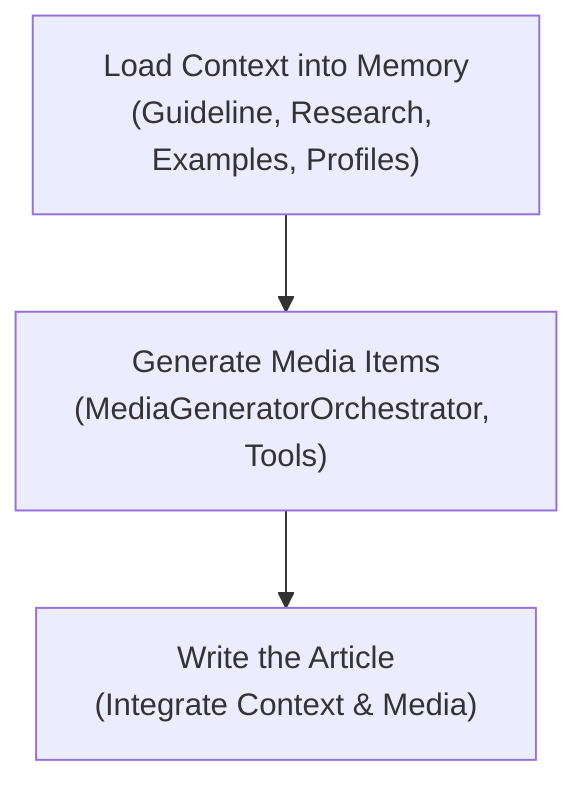

# Lesson 22: Implementing the Foundations of Brown the Writing Workflow

In the previous lessons, specifically Lesson 20 and 21, we explored the project structure and system design of Brown, our AI writing agent. We defined the scope, the architecture, and the trade-offs between a monolithic workflow and a modular agentic system.

Now, we move from design to implementation. In this lesson, we will lay the code foundations for Brown. We think this is an amazing exercise to learn how to properly do context engineering for complex problems that require you to write huge system prompts following multiple dimensions. Learning how to guide the LLM to reason through these massive prompts is not straightforward. To get there, we will model multiple domain objects—such as writing profiles, few-shot examples, and user inputs—using Pydantic and learn how to aggregate them into well-structured prompts that adhere to good context engineering practices. Additionally, we will write the orchestrator-worker pattern from scratch to dynamically generate the media items required for the final article.

By the end of this lesson, you will learn how to:
- **Model domain entities** using Pydantic to create structured context for LLMs.
- **Implement the ContextMixin interface** to standardize how Python objects are converted to prompt context.
- **Use writing profiles** to programmatically enforce voice, tone, and structure.
- **Build an Orchestrator-Worker workflow** to dynamically generate media assets like Mermaid diagrams.
- **Structure complex system prompts** following the "anatomy of a prompt" best practices.

## The Writing Workflow Architecture

Before writing code, let's look at the high-level workflow we are building. The process consists of three distinct steps:

1.  **Context Loading:** We gather all necessary information into memory. This includes the user's article guideline, the research material, few-shot examples (our "training set"), and specific writing profiles that define our voice and style.
2.  **Media Generation:** Using the **Orchestrator-Worker** pattern, we analyze the content requirements and spin up specialized workers (tools) to generate assets like Mermaid diagrams or data tables.
3.  **Article Generation:** We aggregate the context and the generated media into a massive, structured system prompt and pass it to the `ArticleWriter` node to produce the final draft.


Image 1: The three-step high-level overview of the Brown writing workflow.

In this lesson, we will implement these three steps hands-on.

## Modeling our Domain Entities as Context for LLMs

Based on the project structure we defined in Lesson 20, our domain entities sit at the bottom of the dependency graph. These entities, such as `ArticleGuideline`, `Research`, and `Profile`, are the primary way we pass information between our Python code (Software 1.0) and the LLM (Software 3.0).

To make this communication seamless, we need a standard way to convert a Python object into a string format that the LLM understands as a distinct context block. We achieve this using a `ContextMixin`.

### The ContextMixin Interface

The `ContextMixin` is a simple interface that forces every entity to implement a `to_context()` method. This method wraps the entity's content in XML tags derived from the class name.

```python
from abc import abstractmethod
from brown.utils.s import camel_to_snake


class ContextMixin:
    @property
    def xml_tag(self) -> str:
        return camel_to_snake(self.__class__.__name__)

    @abstractmethod
    def to_context(self) -> str:
        """Context representation of the object."""
        pass
```

This abstraction ensures consistency. Whether we are passing research data or a character profile, the LLM always receives clearly delimited XML blocks. This helps the model distinguish between instructions, data, and examples.

### The Article Guideline Entity

The `ArticleGuideline` represents the user's intent. It contains the outline, specific instructions, and constraints for the article.

```python
from pydantic import BaseModel
from brown.entities.mixins import ContextMixin


class ArticleGuideline(BaseModel, ContextMixin):
    content: str

    def to_context(self) -> str:
        return f"""
<{self.xml_tag}>
    <content>{self.content}</content>
</{self.xml_tag}>
"""
```

When we load a guideline and convert it to context, it looks like this:

```python
from brown.loaders import MarkdownArticleGuidelineLoader

guideline_loader = MarkdownArticleGuidelineLoader(uri=Path("article_guideline.md"))
article_guideline = guideline_loader.load(working_uri=SAMPLE_DIR)

print(article_guideline.to_context())
```

It outputs:

```xml
<article_guideline>
    <content>## Outline
1. Introduction...
## Section 1...
    </content>
</article_guideline>
```

### The Research Entity

The `Research` entity holds the factual data generated by the Nova researcher (from Part 2B). Besides storing text, this entity also handles extracting and validating image URLs from the raw markdown, allowing us to pass visual context to multimodal models later.

```python
import re
from functools import cached_property
from pydantic import BaseModel
from brown.entities.mixins import ContextMixin

class Research(BaseModel, ContextMixin):
    content: str
    max_image_urls: int = 30

    @cached_property
    def image_urls(self) -> list[str]:
        # Logic to extract and validate URLs...
        return urls

    def to_context(self) -> str:
        return f"""
<{self.xml_tag}>
    {self.content}
</{self.xml_tag}>
"""
```

Let's see how this looks in practice. We load the research file and convert it to context:

```python
from brown.loaders import MarkdownResearchLoader

research_loader = MarkdownResearchLoader(uri=Path("research.md"))
research = research_loader.load(working_uri=SAMPLE_DIR)

print(research.to_context()[:500]) # Printing first 500 chars
```

It outputs:

```xml
<research>
    https://github.com/google-gemini/gemini-cli/actions/workflows/ci.yml 
  
   ./docs/assets/gemini-screenshot.png 
  
  This repository contains the Gemini CLI, a command-line AI workflow tool that connects to your
  tools, understands your code and accelerates your workflows.
...
</research>
```

### The Article Examples Entity

Few-shot prompting is one of the most effective ways to steer an LLM. The `ArticleExamples` entity acts as our on-demand training set. Instead of fine-tuning a model, we provide it with examples of what "good" looks like.

```python
class ArticleExample(BaseModel, ContextMixin):
    content: str

    def to_context(self) -> str:
        return f"""
<{self.xml_tag}>
    {self.content}
</{self.xml_tag}>
"""

class ArticleExamples(BaseModel, ContextMixin):
    examples: list[ArticleExample]

    def to_context(self) -> str:
        return f"""
<{self.xml_tag}>
        {"\n".join([example.to_context() for example in self.examples])}
</{self.xml_tag}>
"""
```

This structure allows us to pass a list of examples, nested within `<article_examples>` tags. The LLM uses these to infer style, formatting, and depth without explicit instruction overload.

```python
from brown.loaders import MarkdownArticleExampleLoader

examples_loader = MarkdownArticleExampleLoader(uri=EXAMPLES_DIR)
article_examples = examples_loader.load()

print(article_examples.to_context()[:500])
```

It outputs:

```xml
<article_examples>
    <article_example>
      # Lesson 3: Context Engineering
      AI applications have evolved rapidly...
    </article_example>
    
    <article_example>
      # Lesson 4: Structured Outputs
      In our previous lessons...
    </article_example>
</article_examples>
```

## Understanding the Secret Sauce of Writing Professional Articles: The Writing Profiles

While the guideline tells the LLM *what* to write, the profiles tell it *how* to write. We separate these into six distinct profiles to give us granular control over every aspect of the generation process. 

We store these profiles as Markdown files under `inputs/profiles` directory and the model them as Pydantic entities inheriting from a base `Profile` class.

```python
class Profile(BaseModel, ContextMixin):
    name: str
    content: str

    def to_context(self) -> str:
        return f"""
<{self.xml_tag}>
    <name>{self.name}</name>
    <content>{self.content}</content>
</{self.xml_tag}>
"""

class CharacterProfile(Profile): pass
class ArticleProfile(Profile): pass
class StructureProfile(Profile): pass
class MechanicsProfile(Profile): pass
class TerminologyProfile(Profile): pass
class TonalityProfile(Profile): pass
```

Now, let's see how we load these profiles and transform them into context. We use a specialized loader to read the markdown files from disk:

```python
from brown.loaders import MarkdownArticleProfilesLoader

# Load all profiles
profiles_loader = MarkdownArticleProfilesLoader(uri=PROFILES_DIR)
article_profiles = profiles_loader.load()
```

Let's inspect the raw content of the `ArticleProfile`:

```python
print(article_profiles.article.content[:400])
```

It outputs the raw markdown instructions:

```text
## Tonality

You should write in a humanized way as writing a blog article or book.

Write the description of ideas as fluid as possible...
```

Now, let's call the `to_context()` method. This is where the `ContextMixin` shines. It automatically wraps the content in the specific XML tag derived from the class name (`ArticleProfile` -> `<article_profile>`):

```python
print(article_profiles.article.to_context()[:400])
```

It outputs:

```xml
<article_profile>
    <name>article</name>
    <content>## Tonality

You should write in a humanized way as writing a blog article or book...
    </content>
</article_profile>
```

If we do the same for the `StructureProfile`, the XML tag changes automatically, ensuring the LLM can distinguish between different types of instructions:

```python
print(article_profiles.structure.to_context()[:400])
```

It outputs:

```xml
<structure_profile>
    <name>structure</name>
    <content>## Sentence and paragraph length patterns

Write sentences 5–25 words; allow occasional 30-word 'story' sentences...
    </content>
</structure_profile>
```

Now, let's better understand the role of each profile.

### 1. Mechanics Profile (General)
This profile controls the technical mechanics of writing, from word choice to paragraph structure. It ensures the text is readable, consistent, and grammatically aligned with our standards.

*   **Active vs. passive voice usage:** "Always strive for an active voice."
*   **Point of View:** "The course is created by a team writing for a single reader... always use 'we,' 'our,' and 'us' to refer to the team... and 'you' or 'your' to address the reader."
*   **Punctuation preferences:** "Avoid semicolons ';' or em-dashes '—' to add phauses... Instead, split it into two sentences."

See the full profile at [inputs/profiles/mechanics_profile.md](inputs/profiles/mechanics_profile.md)

### 2. Structure Profile (General)
This profile defines how the content is organized visually and logically to ensure readability. It governs the hierarchy of headers, the formatting of lists and code, and the placement of media.

*   **Sentence and paragraph length patterns:** "Write sentences 5–25 words... Keep paragraphs ≤ 80 words."
*   **Sections Sub-Heading Formatting:** "Use at maximum H3... sub-headers... avoid using H4/H5/H6 sub-headings at all costs."
*   **Formatting Media:** "We handle 3 types of media: Tables... Diagrams... Images... All the media items have a unique identifier... and a small description."
*   **Formatting Code:** "Avoid describing big chunks of code that go over 35 lines... split the code into logical groups."

See the full profile at [inputs/profiles/structure_profile.md](inputs/profiles/structure_profile.md)

### 3. Terminology Profile (General)
This profile guides word choice to ensure we speak the reader's language without sounding robotic. It strictly enforces a ban on "AI Slop"—the fluffy, distinctive style often generated by default LLM outputs.

*   **Word Choice Patterns:** "Avoid using complex words... Use a casual and direct vocabulary... Use a concrete, hands-on language."
*   **Descriptive Language Patterns:** "Be excited and personal about positive outcomes... Be realistic, pragmatic and resilient about negative outcomes."
*   **AI Slop Banned Expressions List:** Avoid words like "delve", "paramount", "thrive", "realm", "dive deep into", "unlock", "unleash", "game-changer".

See the full profile at [inputs/profiles/terminology_profile.md](inputs/profiles/terminology_profile.md)

### 4. Tonality Profile (General)
This profile sets the emotional resonance and personality of the text. It ensures the writing feels human, technical, and approachable rather than corporate or purely academic.

*   **Primary voice characteristics:** "human, technical, informative, casual, friendly, confident, direct, professional, concise."
*   **Formality level:** "7/10 - As we write technical professional content, keep it somewhat formal, but NOT too formal."
*   **On-Brand Tones (Desired):** "Joyful, Excited... Friendly, Sincere... Diplomatic, Empathetic... Direct, Assertive."
*   **Off-Brand Tones (Undesired):** "Dissatisfied, Dismissive... Disapproving, Accusatory... Overconfident... Informal."

See the full profile at[inputs/profiles/tonality_profile.md](inputs/profiles/tonality_profile.md)

### 5. Article Profile (Specific)

This profile contains rules specific to the article format, ensuring a consistent narrative arc. It dictates how to construct hooks, transition between sections, and handle citations.

*   **General Article Structure:** "The article is a collection of blocks that flow naturally... It starts with one introduction, continues with multiple sections... and wrap-ups with a conclusion."
*   **Introduction, Section, Conclusion Guidelines:** "Introduction: short summary... presenting the 'why' and 'what'... Sections: present the 'how'... Conclusion: very short wrap-up."
*   **Narrative Flow of the Article:** "Problem -> Why other solutions fail -> Theoretical solution -> Examples -> Advanced theory -> Complex example -> Connection to field."
*   **Referencing Ideas Between Sections:** "Avoid repeating the same idea twice... You may, however, revisit a prior point from a different perspective."
*   **References:** "References wrriten in APA 7th edition format."

You can swap this profile with a LinkedIn post or video transcript profile to create different type of outputs.

See the full profile at [inputs/profiles/article_profile.md](inputs/profiles/article_profile.md)

### 6. Character Profile (Specific)
This injects a specific persona into the writing to make it feel authentic and authoritative. For this course, we use the "Paul Iusztin" profile, but this can be swapped for other voices.

*   **About Paul Iusztin:** "Senior AI Engineer... Author of the bestseller LLM Engineer's Handbook... Founder of the Decoding AI Magazine."
*   **Similar Personas:** "Andrew Ng, Chip Huyen, Sebastian Raschka, Louis-François Bouchard, Maxime Labonne, Jason Liu, Lex Fridman, Aleksa Gordic."
*   **Style:** "Real... Trust... Minimalist... Simple... Controversy."

You can switch this from the Paul Iusztin voice to your own voice or another popular character such as Richard Feynman to inject different personalities and backgrounds.

See the full profile at [inputs/profiles/character_profiles/paul_iusztin.md](inputs/profiles/character_profiles/paul_iusztin.md)

## Unifying LLM Calls

Before connecting these entities into a workflow, we need a unified way to interact with LLMs. In `brown/models`, we implement a factory pattern to manage model instantiation and configuration [[5]](https://reference.langchain.com/python/langchain/models/).

The `get_model` function serves as our single point of entry.

1. First, we define the imports and a mapping to handle API keys for different models.
   ```python
   import json

   from langchain.chat_models import init_chat_model
   from langchain_core.language_models import BaseChatModel

   from brown.config import get_settings
   from brown.models.config import DEFAULT_MODEL_CONFIGS, ModelConfig, SupportedModels
   from brown.models.fake_model import FakeModel

   MODEL_TO_REQUIRED_API_KEY = {
       SupportedModels.GOOGLE_GEMINI_30_PRO: "GOOGLE_API_KEY",
       SupportedModels.GOOGLE_GEMINI_25_PRO: "GOOGLE_API_KEY",
       SupportedModels.GOOGLE_GEMINI_25_FLASH: "GOOGLE_API_KEY",
       SupportedModels.GOOGLE_GEMINI_25_FLASH_LITE: "GOOGLE_API_KEY",
   }
   ```

2. Then, we implement the factory function itself. It handles the `FakeModel` for testing, merges the default configuration with any overrides, and initializes the chat model using LangChain's `init_chat_model`.
   ```python
   def get_model(model: SupportedModels, config: ModelConfig | None = None) -> BaseChatModel:
       if model == SupportedModels.FAKE_MODEL:
           if config and config.mocked_response is not None:
               if hasattr(config.mocked_response, "model_dump"):
                   mocked_response_json = config.mocked_response.model_dump(mode="json")
               else:
                   mocked_response_json = json.dumps(config.mocked_response)
               return FakeModel(responses=[mocked_response_json])
           else:
               return FakeModel(responses=[])

       config = config or DEFAULT_MODEL_CONFIGS.get(model) or ModelConfig()
       model_kwargs = {
           "model": model.value,
           **config.model_dump(),
       }

       required_api_key = MODEL_TO_REQUIRED_API_KEY.get(model)
       if required_api_key:
           settings = get_settings()
           if not getattr(settings, required_api_key):
               raise ValueError(f"Required environment variable `{required_api_key}` is not set")
           else:
               model_kwargs["api_key"] = getattr(settings, required_api_key)

       return init_chat_model(**model_kwargs)
   ```

We use a `ModelConfig` Pydantic model to define parameters like temperature, max tokens, and retries. This allows us to configure different models for different nodes in the workflow. For example, we might use a faster, cheaper model (`gemini-2.5-flash`) for the orchestrator and a more capable reasoning model (`gemini-2.5-pro`) for the actual writing.

1. Here we define the `SupportedModels` enum and the `ModelConfig` class.
   ```python
   from enum import StrEnum
   from typing import Any

   from pydantic import BaseModel, Field


   class SupportedModels(StrEnum):
       GOOGLE_GEMINI_30_PRO = "google_genai:gemini-3-pro-preview"
       GOOGLE_GEMINI_25_PRO = "google_genai:gemini-2.5-pro"
       GOOGLE_GEMINI_25_FLASH = "google_genai:gemini-2.5-flash"
       GOOGLE_GEMINI_25_FLASH_LITE = "google_genai:gemini-2.5-flash-lite"
       FAKE_MODEL = "fake"


   class ModelConfig(BaseModel):
       temperature: float = 0.7
       top_k: int | None = None
       n: int = 1
       response_modalities: list[str] | None = None
       include_thoughts: bool = False
       thinking_budget: int | None = Field(
           default=None,
           ge=0,
           description="If reasoning is available, the maximum number of tokens the model can use for thinking.",
       )
       max_output_tokens: int | None = None
       max_retries: int = 6

       mocked_response: Any | None = None
   ```

2. Finally, we define `DEFAULT_MODEL_CONFIGS` to provide sensible defaults for specific models.
   ```python
   DEFAULT_MODEL_CONFIGS = {
       "google_genai:gemini-2.5-pro": ModelConfig(
           temperature=0.7,
           include_thoughts=False,
           thinking_budget=1000,
           max_retries=3,
       ),
       "google_genai:gemini-2.5-flash": ModelConfig(
           temperature=1,
           thinking_budget=1000,
           include_thoughts=False,
           max_retries=3,
       ),
       "google_genai:gemini-2.0-flash-exp": ModelConfig(
           temperature=0.7,
           thinking_budget=1000,
           include_thoughts=False,
           max_retries=3,
       ),
   }
   ```

This decoupling ensures that our application logic (the nodes) doesn't care which specific provider or model is running under the hood. Here is how we use it in practice:

```python
from brown.models import ModelConfig, SupportedModels, get_model

# Create a model instance with custom configuration
model_config = ModelConfig(temperature=0.5, max_output_tokens=100)
model = get_model(SupportedModels.GOOGLE_GEMINI_25_FLASH, config=model_config)

# Test it with a simple prompt
response = await model.ainvoke([{"role": "user", "content": "Say hello in one sentence!"}])
print(f"Model response: {response.content}")
```

It outputs:

```text
Model response: Hello there!
```

## Generating Media Items Using the Orchestrator-Worker Pattern

Now we enter the application layer. We need to generate media items (like diagrams) based on the article guideline. We use the **Orchestrator-Worker** pattern here to dynamically delegate work.

### The Node, Toolkit, and ToolCall Abstractions

Before diving into the orchestrator, we must define the base abstractions shared across all our nodes. These interfaces ensure that every component in our workflow speaks the same language.

1.  **ToolCall:** A simple `TypedDict` representing a request from the LLM to execute a tool. It contains the tool's name, arguments, and a unique ID.
2.  **Toolkit:** An abstract base class that manages a collection of tools. It provides methods to retrieve tools by name or get the full list, acting as a registry for the node.
3.  **Node:** The base class for all workflow components. It holds the LLM instance and the toolkit. It also handles model extension (like binding tools) and multimodal input construction.

```python
from abc import ABC, abstractmethod
from typing import Any, Iterable, Literal, TypedDict

from langchain_core.runnables import Runnable
from langchain_core.tools import BaseTool


class ToolCall(TypedDict):
    name: str
    args: dict[str, Any]
    id: str
    type: Literal["tool_call"]


class Toolkit(ABC):
    """Base class for toolkits following LangChain's toolkit pattern."""

    def __init__(self, tools: list[BaseTool]) -> None:
        self._tools: list[BaseTool] = tools
        self._tools_mapping: dict[str, BaseTool] = {tool.name: tool for tool in self._tools}

    def get_tools(self) -> list[BaseTool]:
        """Get all registered media item generation tools."""
        return self._tools.copy()

    def get_tool_by_name(self, name: str) -> BaseTool | None:
        """Get a specific tool by name."""
        return self._tools_mapping.get(name)


class Node(ABC):
    def __init__(self, model: Runnable, toolkit: Toolkit) -> None:
        self.toolkit = toolkit
        self.model = self._extend_model(model)
    
    # ... methods for building multimodal input ...

    @abstractmethod
    async def ainvoke(self) -> Any:
        pass
```

### The Orchestrator: MediaGeneratorOrchestrator

The `MediaGeneratorOrchestrator` analyzes the guideline and research. Its job is not to draw the diagram, but to *decide* if a diagram is needed and delegate the task to the correct worker.

It binds the available tools (workers) to the LLM. When the LLM decides a tool is needed, it outputs a tool call.

1. We start by defining the necessary imports and the detailed system prompt that guides the orchestrator.
   ```python
   from typing import cast
   from langchain_core.messages import AIMessage
   from langchain_core.runnables import Runnable
   from langchain_core.language_models import BaseChatModel

   from brown.entities import ArticleGuideline, Research
   from brown.nodes.base import Node, ToolCall, Toolkit

   MEDIA_GENERATOR_PROMPT = """You are an Media Generation Orchestrator responsible for analyzing article 
   guidelines and research to identify what media items need to be generated for the article.

   Your task is to:
   1. Carefully analyze the article guideline and research content provided
   2. Identify ALL explicit requests for media items (diagrams, charts, visual illustrations, etc.)
   3. For each identified media requirement, call the appropriate tool to generate the media item
   4. Provide clear, detailed descriptions for each media item based on the guideline requirements and research context

   ## Analysis Guidelines

   **Look for these explicit indicators in the article guideline:**
   - Direct mentions: "Render a Mermaid diagram", "Draw a diagram", "Create a visual", "Illustrate with", etc.
   - Visual requirements: "diagram visually explaining", "chart showing", "figure depicting", "visual representation"
   - Process flows: descriptions of workflows, architectures, data flows, or system interactions
   - Structural elements: hierarchies, relationships, comparisons, or step-by-step processes

   **Key places to look:**
   - Section requirements and descriptions  
   - Specific instructions mentioning visual elements
   - Complex concepts that would benefit from visual explanation
   - Architecture or system descriptions
   - Process flows or workflows
   """
   ```

2. We continue the prompt with specific instructions on how to use the tools.
   ```python
   MEDIA_GENERATOR_PROMPT += """
   ## Tool Usage Instructions

   You will call multiple tools to generate the media items. You will use the tool that is most appropriate for the media item you are 
   generating.

   For each identified media requirement:

   **When to use MermaidDiagramGenerator:**
   - Explicit requests for Mermaid diagrams
   - System architectures and workflows
   - Process flows and data pipelines  
   - Organizational structures or hierarchies
   - Flowcharts for decision-making processes
   - Sequence diagrams for interactions
   - Entity-relationship diagrams
   - Class diagrams for software structures
   - State diagrams for system states
   - Mind maps for concept relationships

   **Description Requirements:**
   When calling tools, provide detailed descriptions that include:
   - The specific purpose and context from the article guideline
   - Key components that should be included based on the research
   - The type of diagram most appropriate (flowchart, sequence, architecture, etc.)
   - Specific elements, relationships, or flows to highlight
   - Any terminology or technical details from the research

   ## Input Context

   Here is the article guideline:
   {article_guideline}

   Here is the research:
   {research}

   ## Your Response

   Analyze the provided article guideline and research, then call the appropriate tools for each 
   identified media item requirement. Each tool call should include a detailed description that ensures 
   the generated media item will be relevant, accurate, and valuable for the article's educational goals.

   If no explicit media requirements are found in the guideline, respond with: 
   "No explicit media item requirements found in the article guideline."
   """
   ```

3. Next, we define the `MediaGeneratorOrchestrator` class, initializing it with the context and binding the tools.
   ```python
   class MediaGeneratorOrchestrator(Node):
       system_prompt_template = MEDIA_GENERATOR_PROMPT

       def __init__(
           self,
           article_guideline: ArticleGuideline,
           research: Research,
           model: Runnable,
           toolkit: Toolkit,
       ) -> None:
           self.article_guideline = article_guideline
           self.research = research
           super().__init__(model, toolkit)

       def _extend_model(self, model: Runnable) -> Runnable:
           model = cast(BaseChatModel, super()._extend_model(model))
           model = model.bind_tools(self.toolkit.get_tools(), tool_choice="any")
           return model
   ```

4. Finally, we implement the `ainvoke` method which executes the orchestration logic.
   ```python
       async def ainvoke(self) -> list[ToolCall]:
           system_prompt = self.system_prompt_template.format(
               article_guideline=self.article_guideline.to_context(),
               research=self.research.to_context(),
           )
           user_input_content = self.build_user_input_content(
               inputs=[system_prompt], 
               image_urls=self.research.image_urls
           )
           inputs = [{"role": "user", "content": user_input_content}]
           response = await self.model.ainvoke(inputs)
           
           if isinstance(response, AIMessage) and response.tool_calls:
               jobs = cast(list[ToolCall], response.tool_calls)
           else:
               jobs = []
           
           return jobs
   ```

### The Worker: MermaidDiagramGenerator

The worker is a specialized `ToolNode`. It focuses on doing one thing well: generating Mermaid.js code. By isolating this logic, we can craft a specific prompt for diagram generation, handling edge cases and syntax rules without polluting the main orchestrator's context.

1. We define the imports, the structured output model, and the specialized prompt template.
   ```python
   from typing import cast
   from loguru import logger
   from pydantic import BaseModel, Field
   from langchain_core.runnables import Runnable
   from langchain_core.language_models import BaseChatModel

   from brown.entities import MermaidDiagram
   from brown.nodes.base import ToolNode
   from brown.utils.exceptions import InvalidOutputTypeException

   class GeneratedMermaidDiagram(BaseModel):
       content: str = Field(description="The Mermaid diagram code formatted in Markdown format as: ```mermaid\n[diagram content here]\n```")
       caption: str = Field(description="The caption, as a short description of the diagram.")

   MERMAID_GENERATOR_PROMPT = """
   You are a world-class expert in generating Mermaid diagrams.

   Your task is to generate a valid Mermaid diagram based on the user's description.
   The diagram should be clear, professional, and strictly follow Mermaid syntax.

   Description:
   {description_of_the_diagram}
   """
   ```

2. We define the `MermaidDiagramGenerator` class and configure the model to use structured outputs.
   ```python
   class MermaidDiagramGenerator(ToolNode):
       prompt_template = MERMAID_GENERATOR_PROMPT

       def _extend_model(self, model: Runnable) -> Runnable:
           model = cast(BaseChatModel, super()._extend_model(model))
           model = model.with_structured_output(GeneratedMermaidDiagram, include_raw=False)
           return model
   ```

3. We implement the `ainvoke` method to generate the diagram and handle potential errors.
   ```python
       async def ainvoke(self, description_of_the_diagram: str, section_title: str) -> MermaidDiagram:
           """Specialized tool to generate a mermaid diagram from a text description."""
           try:
               response = await self.model.ainvoke(
                   [
                       {
                           "role": "user",
                           "content": self.prompt_template.format(
                               description_of_the_diagram=description_of_the_diagram,
                           ),
                       }
                   ]
               )

           except Exception as e:
               logger.exception(f"Failed to generate Mermaid diagram: {e}")

               return MermaidDiagram(
                   location=section_title,
                   content=f'```mermaid\ngraph TD\n    A["Error: Failed to generate diagram"]\n    A --> B["{str(e)}"]\n```',
                   caption=f"Error: Failed to generate diagram: {str(e)}",
               )

           if not isinstance(response, GeneratedMermaidDiagram):
               raise InvalidOutputTypeException(GeneratedMermaidDiagram, type(response))

           return MermaidDiagram(
               location=section_title,
               content=response.content,
               caption=response.caption,
           )
   ```

In the workflow, the Orchestrator calls the `MermaidDiagramGenerator` tool. The tool executes and returns the diagram. This separation of concerns allows us to easily add new workers (e.g., an ImageGenerator or ChartGenerator) without changing the Orchestrator's core logic.

Let's see this in action. We initialize the orchestrator with the guideline and research, and give it the diagram generator tool.

```python
import asyncio

from brown.entities.media_items import MediaItem, MediaItems
from brown.models import SupportedModels, get_model
from brown.nodes import MediaGeneratorOrchestrator, MermaidDiagramGenerator, Toolkit

# 1. Create worker tool
diagram_model = get_model(SupportedModels.GOOGLE_GEMINI_25_FLASH)
mermaid_generator = MermaidDiagramGenerator(model=diagram_model)
toolkit = Toolkit(tools=[mermaid_generator.as_tool()])

# 2. Create orchestrator
orchestrator_model = get_model(SupportedModels.GOOGLE_GEMINI_25_FLASH)
orchestrator = MediaGeneratorOrchestrator(
    article_guideline=article_guideline,
    research=research,
    model=orchestrator_model,
    toolkit=toolkit,
)

# 3. Run orchestrator to identify required media items
media_jobs = await orchestrator.ainvoke()

print(f"Found {len(media_jobs)} media items to generate")
for i, job in enumerate(media_jobs):
    print(f"Job {i + 1}:")
    print(f"  Tool: {job['name']}")
    print(f"  Description: {job['args'].get('description_of_the_diagram', 'N/A')[:100]}...")
    print(f"  Section: {job['args'].get('section_title', 'N/A')}")
```

Which outputs:

```text
Analyzing article guideline for media requirements...
Found 2 media items to generate
Job 1:
  Tool: mermaid_diagram_generator_tool
  Description: A flowchart showing the parallelization pattern applied to our writing workflow...
  Section: The Writing Workflow Architecture
Job 2:
  Tool: mermaid_diagram_generator_tool
  Description: A sequence diagram showing the interaction between orchestrator and workers...
  Section: Orchestrator-Worker Pattern
Generating media items in parallel...
Generated 2 media items successfully!
```

Next, we call each generated tool call as follows:

```python
# 4. Execute all tool calls in parallel
coroutines = []
for job in media_jobs:
    tool = orchestrator.toolkit.get_tool_by_name(job["name"])
    if tool:
        coroutines.append(tool.ainvoke(**job["args"]))

media_items: list[MediaItem] = await asyncio.gather(*coroutines)

# 5. Build MediaItems entity and display results
media_items = MediaItems.build(media_items=media_items)

# Display the generated diagrams
for media_item in media_items.media_items:
    print(f"\nSection: {media_item.location}")
    print(f"Caption: {media_item.caption}")
    print(f"Diagram Code:\n{media_item.content}")
```

Which outputs the results of the tools, which in our use case are the final diagrams:

```text
Section: The Writing Workflow Architecture
Caption: A flowchart showing the parallelization pattern applied to our writing workflow.
Diagram Code:
``mermaid
graph TD
    A["Start"] --> B["Orchestrator"]
    B --> C["Worker 1"]
    B --> D["Worker 2"]
    C --> E["End"]
    D --> E
``

Section: Orchestrator-Worker Pattern
Caption: A sequence diagram showing the interaction between orchestrator and workers.
Diagram Code:
``mermaid
sequenceDiagram
    participant O as Orchestrator
    participant W1 as Worker 1
    participant W2 as Worker 2
    O->>W1: Generate diagram
    O->>W2: Generate diagram
    W1-->>O: Diagram result
    W2-->>O: Diagram result
``
```

### Modeling Multimodal Inputs

Another important aspect to understand before we dive into the `ArticleWriter` node is how we model multimodal inputs, such as combining text prompts with images extracted from the research.

We handle this through the `build_user_input_content()` method, which is part of the `Node` base class. This method allows us to combine text inputs with image URLs in a structured format that multimodal models like Gemini can process.

Here's how the method works:

```python
def build_user_input_content(self, inputs: Iterable[str], image_urls: list[str] | None = None) -> list[dict[str, Any]]:
    """Build multimodal input content with optional images."""
    messages: list[dict[str, Any]] = []
    if image_urls:
        for image_url in image_urls:
            messages.append({
                "type": "text",
                "text": "Use the following images as <research> context:",
            })
            messages.append({"type": "image_url", "image_url": {"url": image_url}})
    
    # Add the messages last to prioritize focusing on it rather than the images.
    for input_ in inputs:
        messages.append({"type": "text", "text": input_})
    
    return messages
```

When we use it in practice, we combine the system prompt with image URLs from the research:

```python
user_input_content = orchestrator.build_user_input_content(
    inputs=["some random inputs", "some other random inputs"],
    image_urls=orchestrator.research.image_urls[:5]
)
```

This produces a list of dictionaries where each image URL is preceded by a text marker indicating it's part of the `<research>` context:

```python
[
    {'type': 'text', 'text': 'Use the following images as <research> context:'},
    {'type': 'image_url', 'image_url': {'url': 'https://example.com/image1.jpg'}},
    {'type': 'text', 'text': 'Use the following images as <research> context:'},
    {'type': 'image_url', 'image_url': {'url': 'https://example.com/image2.jpg'}},
    {'type': 'text', 'text': 'some random inputs'},
    {'type': 'text', 'text': 'some other random inputs'}
]
```

**Key Design Decisions:**

1. **XML Tag Context**: Each image URL includes a text marker with `<research>` tags. Because we model context as XML tags throughout our system, this provides a unique reference ID that helps the LLM understand the source and purpose of each image.

2. **Text at the End**: We explicitly place text inputs at the bottom of the message list. This avoids the "needle-in-a-haystack" problem—when you have many images, placing the critical text instructions at the end ensures the LLM focuses on them rather than getting lost in the visual content.

3. **Extensibility**: This strategy can easily be extended to include other media types (documents, videos, audio) as long as they can be encoded as base64, URLs, or binary data, as we've seen in multimodal processing lessons.

In the `MediaGeneratorOrchestrator`, we use this method to pass both the system prompt and research images to the model:

```python
user_input_content = self.build_user_input_content(
    inputs=[system_prompt], 
    image_urls=self.research.image_urls
)
inputs = [{"role": "user", "content": user_input_content}]
response = await self.model.ainvoke(inputs)
```

This allows the orchestrator to analyze both textual guidelines and visual research content when deciding what media items to generate.

## The Anatomy of a Prompt

Before we look at the `ArticleWriter`, we need to understand how to construct the massive system prompt it requires. Prompt engineering is not just about asking the model to do something; it is about engineering the context to maximize the probability of a correct response. According to Anthropic's research on effective context engineering [[3]](https://www.anthropic.com/engineering/effective-context-engineering-for-ai-agents), [[4]](https://www.anthropic.com/engineering/building-effective-agents), context is a finite resource. We must curate the "smallest possible set of high-signal tokens" to achieve our desired outcome.

This means we cannot simply dump information into the prompt. We must structure it. A well-engineered prompt acts like a program, guiding the model through a logical flow of information. It establishes the role, provides the necessary data, sets the constraints, and defines the output format before the model even begins to generate text. This structured approach reduces hallucinations and ensures the model adheres to complex requirements, such as our writing profiles.


Image 2: The anatomy of a prompt structure, detailing the 10 key components for effective context engineering. (Source [Prompting 101 | Code w/ Claude](https://www.youtube.com/watch?v=ysPbXH0LpIE))

Here are the 10 most component elements from a prompt's anatomy:

1.  **Task Context:** Who is the agent? (e.g., "You are Brown, a professional writer...")
2.  **Tone Context:** How should it sound?
3.  **Background Data:** The research and domain entities.
4.  **Detailed Task Description & Rules:** Specific rules and constraints.
5.  **Examples:** Few-shot examples (our `ArticleExamples`).
6.  **Conversation History:** Previous interactions (if applicable).
7.  **Immediate Task Description or Request:** The specific user request (the `ArticleGuideline`).
8.  **Thinking Step-by-Step:** Instructions to plan before writing (Chain of Thought).
9.  **Output Formatting:** Rules for Markdown, citations, etc.
10. **Prefilled Response (if any):** Priming the model's output.

To keep this hands-on, let's finally introduce the article writer node and explain how these prompt engineering rules apply to it's system prompt. 

In our `ArticleWriter`, we map our Pydantic entities directly to these sections.

## Understanding the ArticleWriter Node

The `ArticleWriter` is the final node in this flow. It takes all the context we've prepared and generates the article.

The `ainvoke` method is straightforward: it formats the system prompt with all our entities and calls the model.

```python
class ArticleWriter(Node):
    async def ainvoke(self) -> Article | SelectedText:
        # Format the system prompt with all context
        system_prompt = self.system_prompt_template.format(
            article_guideline=self.article_guideline.to_context(),
            research=self.research.to_context(),
            article_profile=self.article_profiles.article.to_context(),
            character_profile=self.article_profiles.character.to_context(),
            mechanics_profile=self.article_profiles.mechanics.to_context(),
            structure_profile=self.article_profiles.structure.to_context(),
            terminology_profile=self.article_profiles.terminology.to_context(),
            tonality_profile=self.article_profiles.tonality.to_context(),
            media_items=self.media_items.to_context(),
            article_examples=self.article_examples.to_context(),
        )
        
        # Build multimodal input (text + images from research)
        user_input_content = self.build_user_input_content(
            inputs=[system_prompt], 
            image_urls=self.research.image_urls
        )
        
        inputs = [{"role": "user", "content": user_input_content}]
        
        # Generate the article
        written_output = await self.model.ainvoke(inputs)
        if not isinstance(written_output, AIMessage):
            raise InvalidOutputTypeException(AIMessage, type(written_output))
        written_output = cast(str, written_output.text)
        
        return Article(content=written_output)
```

The `system_prompt_template` is where the logic is executed. We structure it using the anatomy we just discussed. Notice how we use the XML tags generated by our `ContextMixin` to keep the prompt clean and structured.

1.  **Role & Task:** We start by defining the persona and the high-level objective.
    ```python
    system_prompt_template = """
    You are Brown, a professional human writer specialized in writing technical, educative and informational articles
    about AI. 
    
    Your task is to write a high-quality article, while providing you the following context:
    - **article guideline:** the user intent describing how the article should look like. Specific to this particular article.
    - **research:** the factual data used to support the ideas from the article guideline. Specific to this particular article.
    ...
    """
    ```

2.  **Character Profile:** We inject the character profile to anchor the identity. Note the correction of the typo "impersonate".
    ```python
    """
    ## Character Profile
    
    To make the writing more personable, you will impersonate the following character profile. The character profile 
    will anchor your identity and specify things such as your:
    - **personal details:** name, age, location, etc.
    ...
    Here is the character profile:
    {character_profile}
    """
    ```

3.  **Data & Examples:** We inject the research data and few-shot examples.
    ```python
    """
    ## Research
    ...
    Here is the research you will use as factual data for writing the article:
    {research}
    
    ## Article Examples
    
    Here is a set of article examples you will use to understand how to write the article:
    {article_examples}
    """
    ```

4.  **Profiles:** We inject the specific writing profiles (Tonality, Terminology, Mechanics, Structure).
    ```python
    """
    ## Tonality Profile
    ...
    {tonality_profile}
    
    ## Terminology Profile
    ...
    {terminology_profile}
    
    ## Mechanics Profile
    ...
    {mechanics_profile}
    
    ## Structure Profile
    ...
    {structure_profile}
    """
    ```

5.  **Media & Article Profile:** We inject the generated media items and the article-specific rules.
    ```python
    """
    ## Media Items
    ...
    Thus, here is the list of media items that we already generated before writing the article that should be included as they are:
    {media_items}
    ...
    ## Article Profile
    ...
    {article_profile}
    """
    ```

6.  **The Directive:** We inject the `ArticleGuideline` last, instructing the model that this represents the user's explicit intent and overrides other general rules if there is a conflict.
    ```python
    """
    ## Article Guideline: 
    
    Here is the article guideline, representing the user intent, describing how the actual article should look like:
    {article_guideline}
    
    You will always start understand what to write by reading the <article_guideline>.
    ...
    """
    ```

7.  **Chain of Thought:** We explicitly instruct the model to "Plan the article outline" before writing the full content.
    ```python
    """
    ## Chain of Thought
    
    1. Plan the article outline
    2. Write the article following the article outline and all the other constraints.
    3. Check if all the constraints are respected. Edit the article if not.
    4. Return ONLY the final version of the article.
    """
    ```

This massive prompt acts as the "brain" of our writer, ensuring it considers every constraint we've defined.

## Context Engineering Introspection

You might wonder: Why do we dump everything into one massive prompt for the writer? Why not use a chain of smaller prompts?

There is a fundamental trade-off between **context isolation** (V1) and **unified context** (V2). In V1 architectures, we might split the writing process into paragraph-by-paragraph generation. This isolates context, keeping prompts small and focused, but it fragments the narrative flow—the model forgets what it wrote in the previous section. By moving to a unified context (V2), we give the model the full picture. It can reference the introduction in the conclusion and ensure tone consistency across sections. However, this requires a model with a large context window and strong reasoning capabilities.

As you introduce more specialized LLM calls or agents, you inevitably fragment the context. You must find the right balance to avoid high latency, ballooning costs, and overcomplicating the solution.

**The lesson:** Always start simple, as close to one-shot LLM calls as possible. A single, well-engineered prompt is often better than a complex chain of agents. You should add specialized LLM calls or agents only when the performance starts to degrade. Never start the other way around: from specialized to simple! Finally, you might ask how to know when performance degrades. How can you truly measure performance more than just vibe checks? You do this based on AI Evals, which we will learn in Part 3.

## Running the Writing Workflow

Let's put it all together. Here is how we run the workflow end-to-end using the code we've built. We will use the `inputs/tests/01_sample_small` directory as our working environment.

1. First, we load all the necessary context into memory. We use our specialized loaders to read the markdown files and convert them into Pydantic entities.
   ```python
   from pathlib import Path
   from brown.loaders import (
       MarkdownArticleExampleLoader,
       MarkdownArticleGuidelineLoader,
       MarkdownArticleProfilesLoader,
       MarkdownResearchLoader,
   )

   # Define directories
   SAMPLE_DIR = Path("inputs/tests/01_sample_small")
   PROFILES_DIR = Path("inputs/profiles")
   EXAMPLES_DIR = Path("inputs/examples/course_lessons")

   # Load Guideline and Research
   guideline_loader = MarkdownArticleGuidelineLoader(uri=Path("article_guideline.md"))
   article_guideline = guideline_loader.load(working_uri=SAMPLE_DIR)

   research_loader = MarkdownResearchLoader(uri=Path("research.md"))
   research = research_loader.load(working_uri=SAMPLE_DIR)

   # Load Profiles and Examples
   profiles_loader = MarkdownArticleProfilesLoader(uri=PROFILES_DIR)
   article_profiles = profiles_loader.load()

   examples_loader = MarkdownArticleExampleLoader(uri=EXAMPLES_DIR)
   article_examples = examples_loader.load()
   ```

2. Next, we initialize the Orchestrator-Worker system to identify what media items need to be generated. We create the worker tool, wrap it in a toolkit, and pass it to the orchestrator. Then, we run the orchestrator to identify the jobs.
   ```python
   from brown.models import SupportedModels, get_model
   from brown.nodes import MediaGeneratorOrchestrator, MermaidDiagramGenerator, Toolkit

   # 1. Create worker tool
   diagram_model = get_model(SupportedModels.GOOGLE_GEMINI_25_FLASH)
   mermaid_generator = MermaidDiagramGenerator(model=diagram_model)
   toolkit = Toolkit(tools=[mermaid_generator.as_tool()])

   # 2. Create orchestrator
   orchestrator_model = get_model(SupportedModels.GOOGLE_GEMINI_25_FLASH)
   orchestrator = MediaGeneratorOrchestrator(
       article_guideline=article_guideline,
       research=research,
       model=orchestrator_model,
       toolkit=toolkit,
   )

   # 3. Run orchestrator to identify required media items
   media_jobs = await orchestrator.ainvoke()

   print(f"Found {len(media_jobs)} media items to generate")
   for i, job in enumerate(media_jobs):
       print(f"Job {i + 1}:")
       print(f"  Tool: {job['name']}")
       print(f"  Description: {job['args'].get('description_of_the_diagram', 'N/A')[:100]}...")
       print(f"  Section: {job['args'].get('section_title', 'N/A')}")
   ```
   It outputs the identified jobs:
   ```text
   Found 2 media items to generate
   Job 1:
     Tool: mermaid_diagram_generator_tool
     Description: A flowchart showing the parallelization pattern applied to our writing workflow...
     Section: The Writing Workflow Architecture
   Job 2:
     Tool: mermaid_diagram_generator_tool
     Description: A sequence diagram showing the interaction between orchestrator and workers...
     Section: Orchestrator-Worker Pattern
   ```

3. Now we execute all the identified jobs in parallel to generate the actual media items.
   ```python
   import asyncio
   from brown.entities.media_items import MediaItem, MediaItems

   # Execute all tool calls in parallel
   coroutines = []
   for job in media_jobs:
       tool = orchestrator.toolkit.get_tool_by_name(job["name"])
       if tool:
           coroutines.append(tool.ainvoke(**job["args"]))

   media_items_list: list[MediaItem] = await asyncio.gather(*coroutines)

   # Build MediaItems entity
   media_items = MediaItems.build(media_items=media_items_list)
   
   # Display the generated diagrams
   for media_item in media_items.media_items:
       print(f"\nSection: {media_item.location}")
       print(f"Caption: {media_item.caption}")
       print(f"Diagram Code:\n{media_item.content}")
   ```
   It outputs the final generated diagrams:
   ```text
   Section: The Writing Workflow Architecture
   Caption: A flowchart showing the parallelization pattern applied to our writing workflow.
   Diagram Code:
   ```mermaid
   graph TD
       A["Start"] --> B["Orchestrator"]
       B --> C["Worker 1"]
       B --> D["Worker 2"]
       C --> E["End"]
       D --> E
   ```

   Section: Orchestrator-Worker Pattern
   Caption: A sequence diagram showing the interaction between orchestrator and workers.
   Diagram Code:
   ```mermaid
   sequenceDiagram
       participant O as Orchestrator
       participant W1 as Worker 1
       participant W2 as Worker 2
       O->>W1: Generate diagram
       O->>W2: Generate diagram
       W1-->>O: Diagram result
       W2-->>O: Diagram result
   ```
   ```

4. Finally, we instantiate the `ArticleWriter` with all the loaded context and the generated media items, and run it to produce the final article.
   ```python
   from brown.nodes import ArticleWriter

   # Initialize Writer
   writer = ArticleWriter(
       article_guideline=article_guideline,
       research=research,
       article_profiles=article_profiles,
       article_examples=article_examples,
       media_items=media_items,
       model=get_model(SupportedModels.GOOGLE_GEMINI_25_PRO)
   )

   # Generate
   article = await writer.ainvoke()
   print(article.content)
   ```
   It outputs the final article content:
   ```text
   # Lesson 22: Implementing the Foundations of Brown the Writing Workflow

   In the previous lessons, specifically Lesson 20 and 21, we explored the project structure and system design of Brown, our AI writing agent. We defined the scope, the architecture, and the trade-offs between a monolithic workflow and a modular agentic system.

   Now, we move from design to implementation. In this lesson, we will lay the code foundations for Brown. We will focus on two core engineering challenges: applying advanced context engineering principles to instruct an LLM to write high-quality technical content, and implementing the orchestrator-worker pattern to dynamically generate media assets.
   ...
   ```

This application layer code glues our domain components together. It creates a clean separation between the *logic* of writing (the nodes) and the *execution* of the workflow. Also, note how infrastructure elements such as the file loaders, renderers or the models do not pollute the domain objects or the overall application logic, but are just injected into them through composition. Which means, we can easily abstract away the application logic through interfaces and swap them with different implementations, such as using S3 Loaders/Renderers instead of local disk ones.

## Conclusion

In this lesson, we built the engine of our writing agent. We learned:

1.  **Context Engineering:** How to map domain entities to XML-structured context using `ContextMixin`.
2.  **Writing Profiles:** How to enforce style and voice using granular profile entities.
3.  **Orchestrator-Worker:** How to dynamically generate media items by delegating to specialized tools.
4.  **System Prompt Anatomy:** How to structure a massive prompt to ensure high-quality output.

We now have a system that can write a good first draft. However, there are many ways we can further extend this code:
*   **Add image and video generation support** within the Orchestrator-Worker layer to create richer media assets.
*   **Reduce costs and latency** by caching constant inputs (like research and profiles) between LLM calls to avoid recomputing them, and by compressing the research relative to the article guideline.
*   **Extend the writer** to other media formats such as social media posts, email newsletter articles, technical documentation, or video transcripts.
*   **Add different character profiles** alongside our Paul Iusztin one to support multiple voices and personas.

In the next lesson (Lesson 23), we will implement the **Evaluator-Optimizer** pattern. We will build an automated review loop that critiques the article and forces the writer to fix mistakes, gluing everything together into a robust LangGraph workflow. Then, in Lesson 24, we will expose these workflows via MCP to bring humans into the loop.

## References

1. Anthropic. (n.d.). Building effective agents. Anthropic. [https://www.anthropic.com/engineering/building-effective-agents](https://www.anthropic.com/engineering/building-effective-agents)
2. Anthropic. (n.d.). Effective context engineering for AI agents. Anthropic. [https://www.anthropic.com/engineering/effective-context-engineering-for-ai-agents](https://www.anthropic.com/engineering/effective-context-engineering-for-ai-agents)
3. Anthropic just revealed their internal prompt engineering template - here's how to 10x your Claude results. (n.d.). Reddit. [https://www.reddit.com/r/PromptEngineering/comments/1n08dpp/anthropic_just_revealed_their_internal_prompt/](https://www.reddit.com/r/PromptEngineering/comments/1n08dpp/anthropic_just_revealed_their_internal_prompt/)
4. LangChain. (n.d.). Chat models. LangChain. [https://reference.langchain.com/python/langchain/models/](https://reference.langchain.com/python/langchain/models/)
5. Prompting 101 | Code w/ Claude [Video]. (n.d.). YouTube. [https://www.youtube.com/watch?v=ysPbXH0LpIE](https://www.youtube.com/watch?v=ysPbXH0LpIE)
