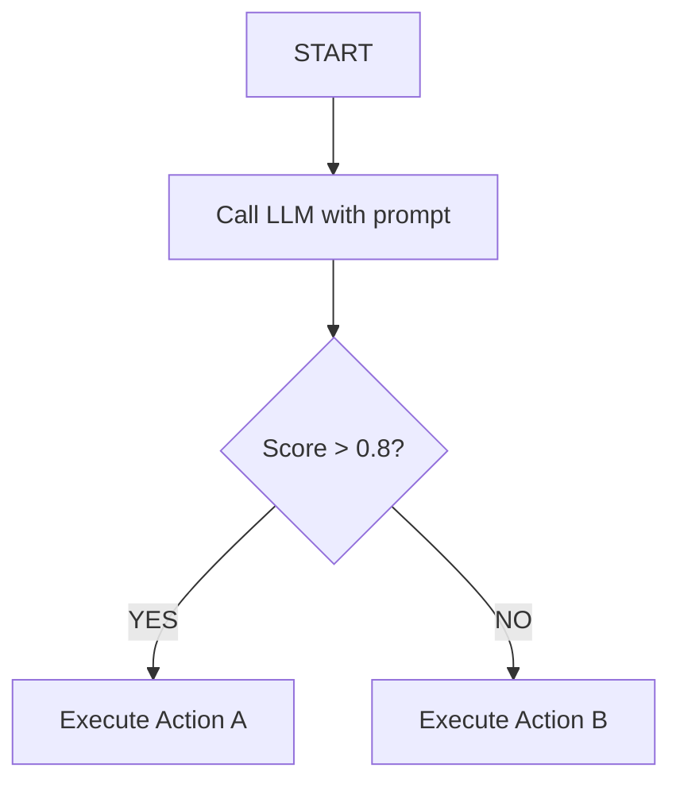
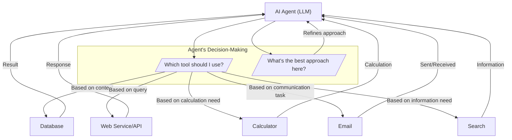
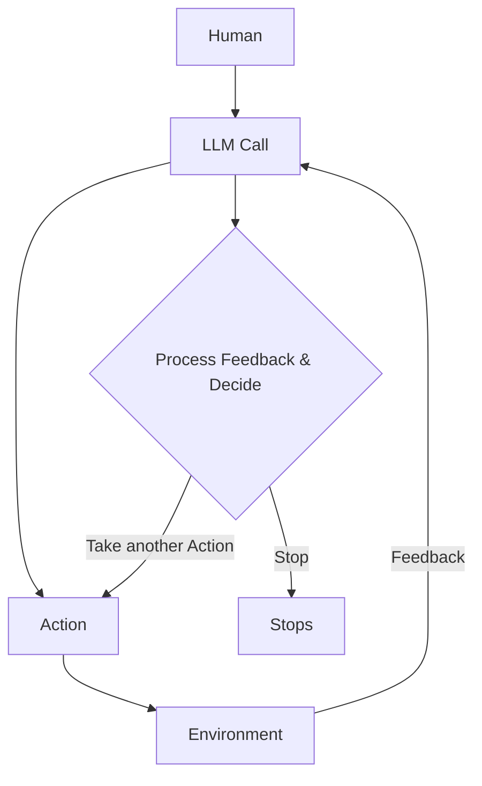
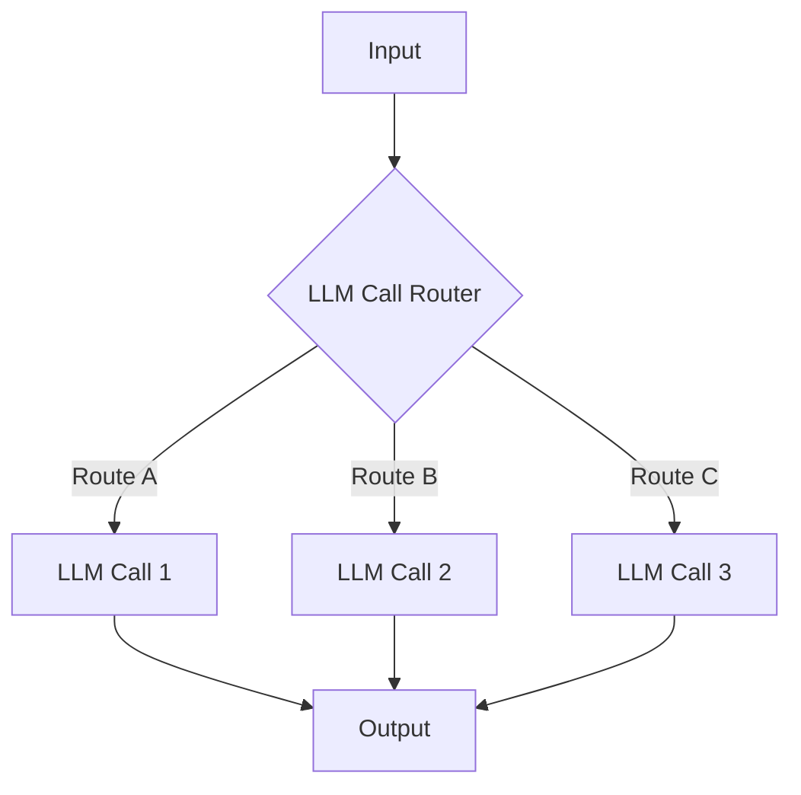
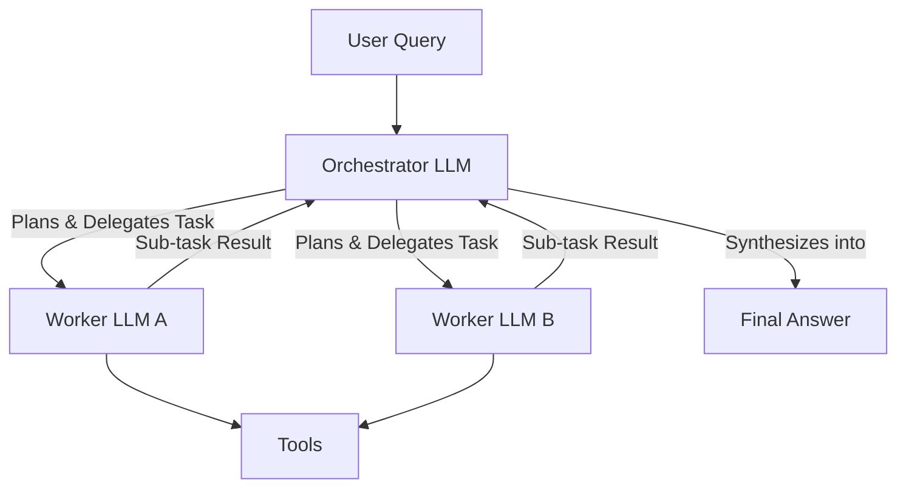
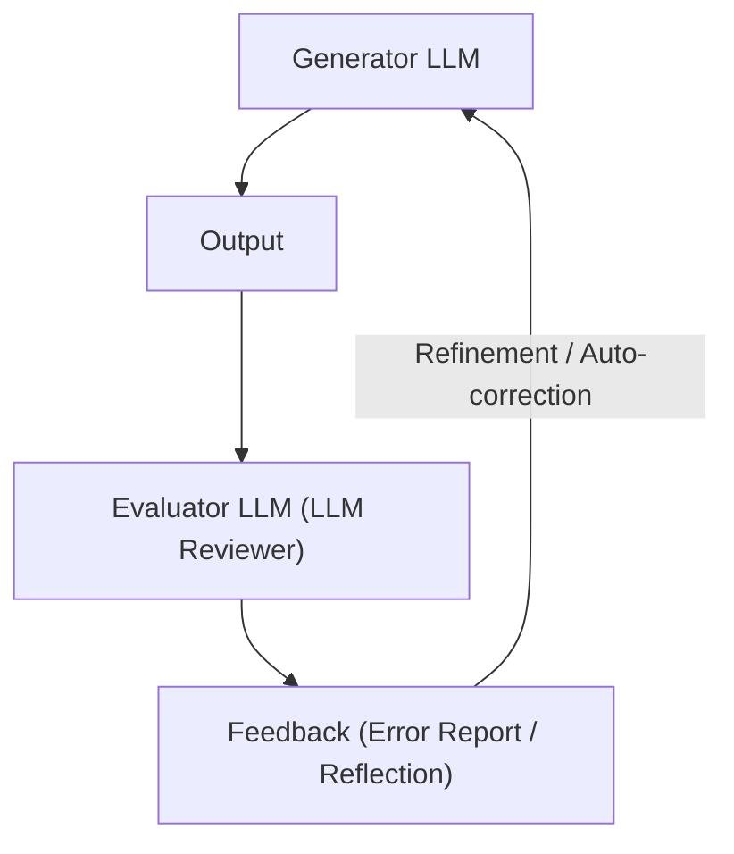
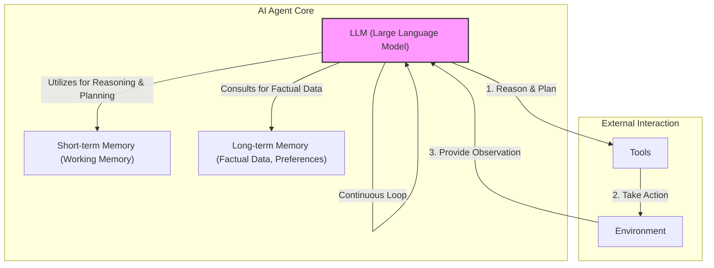
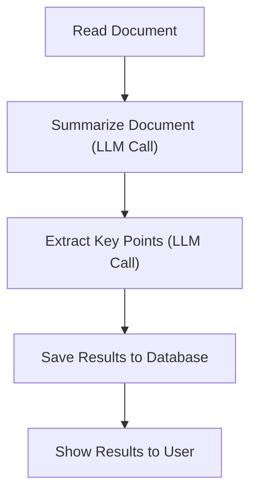
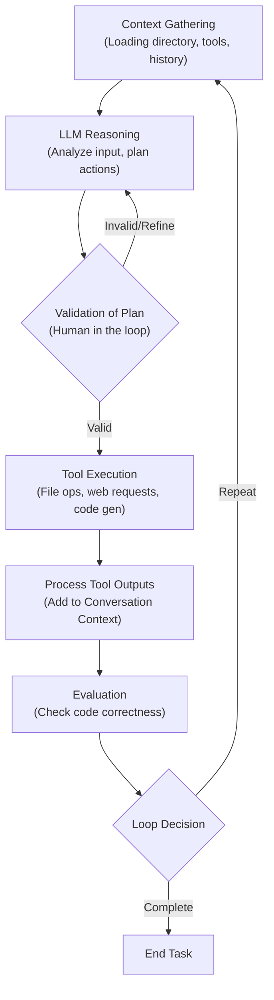
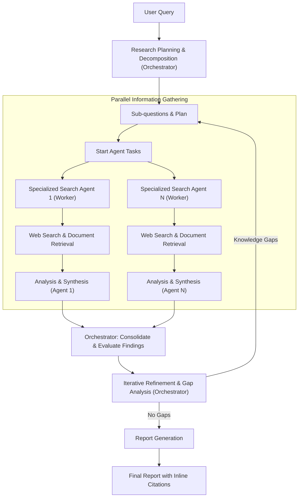

# LLM Workflows vs. AI Agents: The Architectural Decision Shaping Your AI Future
### Navigating the Spectrum of AI Autonomy

When we build AI applications, engineers face a crucial architectural decision early in their development process. Should we create a predictable, step-by-step workflow where we control every action? Or should we build an autonomous agent that can think and decide for itself? This is one of the key decisions that impacts everything from product development time and costs to reliability and user experience.

Choosing the wrong approach can lead to significant problems. We might end up with an overly rigid system that breaks when users deviate from expected patterns, or when developers try to add new features. Conversely, an unpredictable agent might work brilliantly 80% of the time, only to fail catastrophically when it matters most. This can result in months of development time wasted rebuilding the entire architecture, frustrated users who cannot rely on the AI application, and executives facing high running costs relative to profits.

In the real world, billion-dollar AI startups succeed or fail based primarily on this architectural decision. The successful companies, teams, and AI engineers know when to use workflows versus agents. More importantly, they understand how to effectively combine both approaches. By the end of this lesson, you will gain a deep understanding of these two paradigms. You will learn the core differences between predictable LLM workflows and dynamic AI agents, explore common architectural patterns, and see real-world examples that illustrate their strengths and weaknesses. We will also discuss the critical challenges every AI engineer faces when bringing these systems to production.

## Understanding the Spectrum: From Workflows to Agents

To make informed architectural decisions, we first need a clear understanding of what LLM workflows and AI agents are. We will look at their properties and how they are used, without diving into technical specifics just yet.

LLM workflows are sequences of tasks that involve LLM calls or other operations, such as reading or writing data to a database or file system. Developer-written code largely orchestrates these tasks. The steps are defined in advance, resulting in deterministic or rule-based paths with predictable execution and explicit control flow. Think of a workflow as a factory assembly line. In future lessons, we will explore concepts such as chaining, routing, and orchestrator-worker patterns that underpin these workflows.

Here is a simple LLM workflow.



Image 1: A flowchart illustrating a simple LLM workflow, including starting, calling the LLM, making a decision based on the score, and executing one of two possible actions.

AI agents are systems where an LLM plays a central role in dynamically deciding (planning) the sequence of steps, reasoning, and actions to achieve a goal. The steps are not defined in advance. Instead, they are dynamically planned based on the task and current state of the environment. Agents are adaptive and capable of handling novelty, driven by LLM autonomy in decision-making and execution paths. You can imagine an AI agent as a skilled human expert tackling an unfamiliar problem, adapting in the moment after each new insight. We will explore concepts like tools, memory, and ReAct agents in upcoming lessons.

Here is how a simple agentic system looks.



Image 2: Diagram illustrating an AI agent (LLM) interacting with various tools, showcasing dynamic decision-making on tool selection and approach.

Both workflows and agents require an orchestration layer. However, their nature differs significantly. In workflows, the orchestration layer executes a defined plan. In agents, it facilitates the LLM's dynamic planning and execution, allowing it to adapt to unforeseen circumstances.

## Choosing Your Path

We have defined LLM workflows and AI agents independently. Now, we will explore their core differences: developer-defined logic versus LLM-driven autonomy in reasoning and action selection.

Workflows offer predictable execution, explicit error handling, and transparent debugging. They allow for resource optimization, as you know exactly how much each step will cost. This makes them ideal for high-volume, cost-sensitive operations where compute cost is more painful than getting something slightly wrong. Workflows are generally preferred in enterprises or regulated fields that require predictable programs. For example, in finance, a financial report should always contain accurate information due to its direct impact on people's money. Similarly, in healthcare, AI tools require high accuracy as they affect people's lives. Workflows are also suitable for Minimum Viable Products (MVPs) that require rapid deployment by hardcoding features.

However, workflows can require more development time since each step is manually engineered. The user experience can be rigid, as workflows struggle to handle unexpected scenarios. Adding new features can also become complex as the application grows, similar to developing standard software tools.

Agents excel in scenarios demanding flexibility, adaptation, and autonomy. They are well-suited for open-ended problems where it is difficult or impossible to predict the required number of steps. Examples include open-ended research and synthesis, dynamic problem-solving like debugging code, or interactive task completion in unfamiliar environments like booking a flight without specifying the exact sites to use. Agents offer adaptability to new situations and the flexibility to handle ambiguity and complexity because the steps are dynamically decided.

On the other hand, agent systems are more prone to errors [[3]](https://towardsdatascience.com/a-developers-guide-to-building-scalable-ai-workflows-vs-agents). Since an agent is non-deterministic, its performance, latency, and costs can vary with each call, making agents often unreliable. Agents require LLMs that can generalize better, which are bigger and more costly. Adopting an agentic solution usually ends up being more expensive. AI agents often require more LLM calls to understand user intent and take various actions, further increasing costs per call. If not designed well, agents can pose huge security concerns, especially for write operations, where they might delete data or send inappropriate emails. A significant disadvantage of AI agents is their difficulty in debugging and evaluating [[3]](https://towardsdatascience.com/a-developers-guide-to-building-scalable-ai-workflows-vs-agents). Some people have even had their code deleted by agents, jokingly saying, "Anyway, I wanted to start a new project."

In reality, most real-world systems blend elements of both approaches. We have a spectrum, a gradient between LLM workflows and AI agents, where a system adopts the best from both worlds depending on its use cases. This is illustrated in the following diagram.

```mermaid
graph LR
    subgraph "LLM Workflows <--> AI Agents Spectrum"
        direction LR
        A["Workflow"] -- "Higher Application Reliability" & "Lower Agent's Level of Control" --> B["Autonomous Agent"]
    end

    A -- "Reliability High" --> R1["Application Reliability"]
    A -- "Control Low" --> C1["Agent's Level of Control"]

    B -- "Reliability Low" --> R1
    B -- "Control High" --> C1

    style A fill:#f9f,stroke:#333,stroke-width:2px
    style B fill:#bbf,stroke:#333,stroke-width:2px

    %% Conceptual axes to represent the trade-off
    subgraph "Conceptual Reliability Axis"
        direction TD
        Reliability_High["High Reliability"]
        Reliability_Low["Low Reliability"]
    end

    subgraph "Conceptual Control Axis"
        direction LR
        Control_Low["Low Control"]
        Control_High["High Control"]
    end

    A -- "Tends towards" --> Reliability_High
    A -- "Tends towards" --> Control_Low

    B -- "Tends towards" --> Reliability_Low
    B -- "Tends towards" --> Control_High

    Reliability_High -.-> Reliability_Low
    Control_Low -.-> Control_High

    linkStyle 0 stroke-width:0px,fill:none;
    linkStyle 1 stroke-width:0px,fill:none;
    linkStyle 2 stroke-width:0px,fill:none;
    linkStyle 3 stroke-width:0px,fill:none;
    linkStyle 4 stroke-width:0px,fill:none;
    linkStyle 5 stroke-width:0px,fill:none;
    linkStyle 6 stroke-width:0px,fill:none;
    linkStyle 7 stroke-width:0px,fill:none;
    linkStyle 8 stroke-width:0px,fill:none;
    linkStyle 9 stroke-width:0px,fill:none;
    linkStyle 10 stroke-width:0px,fill:none;
    linkStyle 11 stroke-width:0px,fill:none;
    linkStyle 12 stroke-width:0px,fill:none;

```

Image 3: Spectrum between LLM workflows and AI agents showing trade-off between application reliability and agent's level of control.

When building an application, you typically have an "autonomy slider" where you decide how much control to give to the LLM versus the user. Moving towards more manual control usually involves an LLM workflow together with a human who verifies intermediate steps. As you shift towards more automation, you give more control to the agent with fewer human-in-the-loop steps [[4]](https://www.youtube.com/watch?v=BP6d_cT67tA). For example, Cursor, a popular AI coding assistant, offers an autonomy slider, where you can choose `CMD+K` to change a code chunk, `CMD+L` to change the entire file, or `CMD+I` to allow it to modify the entire repository. Similarly, Perplexity, an AI search engine, lets you choose between `search`, `research`, or `deep research`, each representing varying levels of autonomy.

The ultimate goal is to speed up the AI generation and human verification loop. This is often achieved through robust workflow or agentic architectures and well-designed user interfaces and user experiences (e.g., Cursor for coding). The loop works as follows.



Image 4: A flowchart illustrating the AI generation and human verification loop.

## Exploring Common Patterns

To introduce you to the AI engineering world, we will present the most common patterns used to build AI agents and LLM workflows. This is a high-level overview to build intuition; we will dig into the details of each pattern in future lessons.

### LLM Workflows

LLM workflows automate multiple LLM calls together. As a first automation step, they help glue together multiple LLM calls and decide between multiple appropriate options.

#### Chaining and Routing

Chaining and routing classify an input and direct it to a specialized follow-up task. This workflow allows for the separation of concerns, letting you build more specialized prompts. This is ideal for situations where a task can be easily and cleanly decomposed into fixed subtasks, and where classification can be handled accurately by an LLM or a traditional classification model.



Image 5: Flowchart illustrating the Chaining and Routing pattern for LLM workflows.

#### Orchestrator-Worker

The orchestrator-worker pattern uses a central LLM to dynamically break down tasks, delegate them to worker LLMs, and synthesize their results. This pattern allows the AI program to dynamically decide what actions to take based on the given task, making a smooth transition between the workflows and agentic worlds. It is well-suited for complex tasks where you cannot predict the subtasks needed upfront.



Image 6: Flowchart illustrating the Orchestrator-Worker pattern for LLM workflows.

#### Evaluator-Optimizer Loop

The evaluator-optimizer loop auto-corrects the results from an LLM based on automated feedback. LLM outputs can drastically improve when provided with feedback on what went wrong. This pattern automates that by having an "LLM reviewer" that analyzes the output from the LLM who generated the answer, creates an error report (also known as a reflection), and passes it back to the generator to auto-correct itself. Think of a human writer refining a document based on feedback.



Image 7: A feedback loop illustrating the Evaluator-Optimizer pattern for LLM workflows.

### Core Components of a ReAct AI Agent

The ReAct (Reason and Act) pattern is used to automatically decide what action to take, interpret the output of the action, and repeat until the given task is completed. This is the core of a ReAct agent. Almost all modern agents from the industry use the ReAct pattern as it has shown the most potential. We will explain this in detail in Lessons 7 and 8.

An AI agent's core components are:
*   An LLM to take actions and interpret outputs from tools.
*   Tools to take actions within the external environment. We will discuss tools further in Lesson 6.
*   Short-term memory, which is the working memory of the agent, comparable to how RAM works for computers.
*   Long-term memory, used to access factual data about the external world (such as public websites from the internet or private data from a company's databases) and remember user preferences. We will cover memory in Lesson 9.

Here is a diagram showing the dynamics between the core components of an AI agent, illustrating the ReAct pattern at a high level.



Image 8: A diagram illustrating the core components and dynamics of an AI agent using the ReAct (Reason and Act) pattern.

The goal of this section is to build an intuition about various LLM workflow and AI agent patterns that you will learn during the course. In future lessons, we will dig into all the necessary details of each pattern.

## Zooming In on Our Favorite Examples

To better anchor you in the world of LLM workflows and AI agents, we will introduce some concrete examples, from a simple workflow to a single agent system and a more advanced hybrid solution. We will keep this section high-level without any fancy acronyms, explaining everything simply.

### Document Summarization and Analysis Workflow by Gemini in Google Workspace

When working in teams and searching for the right document, it can be a time-consuming process. Many documents are large, making it hard to understand which one contains the right information. A quick, embedded summarization can guide us and our search strategies.

Here is how such a workflow could look. This is a pure and simple workflow as a chain with multiple LLM calls.



Image 9: A flowchart illustrating a simple Document Summarization and Analysis workflow.

This workflow reads the document, uses an LLM call to summarize it, then another LLM call to extract key points. The results are saved to a database and then shown to the user.

### Gemini CLI Coding Assistant

Writing code is a time-consuming process. We have to read documentation or outdated blogs. Understanding new codebases is slow, and mastering a new programming language requires extensive learning before writing industry-level code. A coding assistant can speed up writing code on existing and new codebases.

The Gemini Command Line Interface (CLI) is an open-source AI agent, available on GitHub, that leverages the ReAct (Reason and Act) agent architecture to implement a single-agent system for coding. This is based on our latest research from August 2025 [[5]](https://github.com/google-gemini/gemini-cli/blob/main/README.md), [[6]](https://google-announces-gemini-cli-your-open-source-ai-agent). It helps with use cases like writing code from scratch, assisting an engineer by writing specific functions or classes, supporting documentation writing, and quickly understanding new codebases. Gemini CLI is implemented in TypeScript. Similar tools include Cursor, Windsurf, Claude Code, and Warp.

Here is how Gemini CLI works:
1.  **Context Gathering**: The system loads the directory structure, available tools, and the conversation history into its state, also known as context.
2.  **LLM Reasoning**: The Gemini model analyzes the user input against the current context to understand what actions it requires to take to adapt the code as requested by the user.
3.  **Human in the Loop**: Before taking any actions, it validates the execution plan with the user.
4.  **Tool Execution**: The selected actions, known as tools, are executed. These tools can perform file operations to read the current state of the code, make web requests to documentation, and ultimately generate code. The agent then processes the tool outputs, adding the results to the conversation context for future iterations.
5.  **Evaluation**: The agent dynamically evaluates whether the generated code is correct by running or compiling the code.
6.  **Loop Decision**: The agent determines if the task is completed or if it should repeat steps 2 to 5 by planning and executing more tools.

This operational loop illustrates how the Gemini CLI uses the ReAct pattern.



Image 10: Flowchart illustrating the operational loop of the Gemini CLI coding assistant based on the ReAct pattern.

The tools used can include file system access (e.g., `grep` functions to read specific functions or classes, listing directory structures), coding tools (e.g., code interpreting, generating code diffs, executing generated code for dynamic validation), web search (e.g., documentation, blogs, solutions), and version control (e.g., Git to automatically commit code).

### Perplexity Deep Research

Researching a new topic can be daunting. We often do not know where to start, what blogs, papers, YouTube videos, or courses to read. For more trivial questions, we often lack the time to dig into many resources. A research assistant that quickly scans the internet and synthesizes a report can significantly boost our learning process on scientific, financial, and social topics.

Perplexity's Deep Research agent is a hybrid system that combines ReAct reasoning with LLM workflow patterns to perform autonomous, expert-level research. Unlike single-agent approaches, this system uses multiple specialized agents orchestrated in parallel by workflows, performing dozens of searches across hundreds of sources to synthesize comprehensive research reports within 2-4 minutes. This solution is closed-source; thus, everything written here is an assumption based on available open internet information or speculation. It is an excellent use case for understanding how hybrid systems work.

Here is an oversimplified version of how Perplexity's Deep Research agent could work:
1.  **Research Planning & Decomposition**: The orchestrator analyzes the research question and decomposes it into targeted sub-questions. It leverages the orchestrator-worker pattern to deploy multiple research agents with different sub-questions.
2.  **Parallel Information Gathering**: For each sub-question, to optimize and accelerate the search, specialized search agents run in parallel. These agents use tools such as web searches and document retrieval to gather as much information as possible for their specific questions. Since the research agents are isolated, their input tokens are smaller, helping the LLM stay focused.
3.  **Analysis & Synthesis**: After gathering sources, each agent validates and scores them using strategies like domain credibility or relevance scoring relative to the query. Each source is then ranked by importance, and the top K sources are summarized into a final report.
4.  **Iterative Refinement & Gap Analysis**: The orchestrator gathers information from all parallel agents and identifies knowledge gaps relative to the user's research request. Based on any potential knowledge gaps, it generates follow-up queries by repeating steps 1 to 3 until all knowledge gaps are filled or a maximum number of steps is reached, to avoid infinite loops.
5.  **Report Generation**: The orchestrator takes the results from all the AI agents and generates a final report with inline citations.

This diagram shows how the iterative multi-step process works.



Image 11: A diagram illustrating Perplexity's Deep Research agent's iterative multi-step process, emphasizing parallel execution, iterative refinement, and the orchestrator-worker pattern.

The deep research agent operates as a hybrid between workflows and agents, combining structured planning with dynamic adaptation. The workflow uses the orchestrator-worker pattern to dynamically reason, supervise, and call multiple agents in parallel. These agents specialize in researching only targeted sub-queries until all the user's requested research topics are fulfilled.

## Conclusion: The Challenges of Every AI Engineer

Now that you understand the spectrum from LLM workflows to AI agents, it is important to recognize that every AI engineer—whether working at a startup or a Fortune 500 company—faces these same fundamental challenges when designing a new AI application. These are core decisions that determine whether your AI application succeeds in production or fails spectacularly.

Here are some daily challenges every AI engineer battles:
*   **Reliability Issues**: Your agent works perfectly in demos but becomes unpredictable with real users. LLM reasoning failures can compound through multi-step processes, leading to unexpected and costly outcomes.
*   **Context Limits**: Systems struggle to maintain coherence across long conversations, gradually losing track of their purpose. Ensuring consistent output quality across different agent specializations presents a continuous challenge.
*   **Data Integration**: Building pipelines to pull information from Slack, web APIs, SQL databases, and data lakes while ensuring only high-quality data is passed to your AI system (the garbage-in, garbage-out principle).
*   **Cost-Performance Trap**: Sophisticated agents deliver impressive results but cost a fortune per user interaction, making them economically unfeasible for many applications.
*   **Security Concerns**: Autonomous agents with powerful write permissions could send wrong emails, delete critical files, or expose sensitive data.

The good news is that these challenges are solvable. In upcoming lessons, we will cover patterns for building reliable products through specialized evaluation and monitoring pipelines, strategies for building hybrid systems, and ways to keep costs and latency under control.

Your path forward as an AI engineer is about mastering these realities. In the next lesson, we will explore structured outputs, a fundamental technique for ensuring LLMs return consistent, machine-readable data. Throughout this course, you will gain the knowledge to architect AI systems that are not only powerful but also robust, efficient, and safe. You will know when to use a workflow versus an agent and how to build effective hybrid systems that work in the real world.

## References

1. Anthropic. (n.d.). Building effective agents. [https://www.anthropic.com/engineering/building-effective-agents](https://www.anthropic.com/engineering/building-effective-agents)
2. Iusztin, P. (n.d.). Exploring the difference between agents and workflows. Decoding AI Magazine. [https://decodingml.substack.com/p/llmops-for-production-agentic-rag](https://decodingml.substack.com/p/llmops-for-production-agentic-rag)
3. (n.d.). A Developer’s Guide to Building Scalable AI: Workflows vs Agents. Towards Data Science. [https://towardsdatascience.com/a-developers-guide-to-building-scalable-ai-workflows-vs-agents/](https://towardsdatascience.com/a-developers-s-guide-to-building-scalable-ai-workflows-vs-agents/)
4. Karpathy, A. (n.d.). Andrej Karpathy: Software in the Era of AI. YouTube. [https://www.youtube.com/watch?v=BP6d_cT67tA](https://www.youtube.com/watch?v=BP6d_cT67tA)
5. google-gemini. (n.d.). Gemini CLI. GitHub. [https://github.com/google-gemini/gemini-cli/blob/main/README.md](https://github.com/google-gemini/gemini-cli/blob/main/README.md)
6. (n.d.). Google announces Gemini CLI: Your open-source AI agent. [https://google-announces-gemini-cli-your-open-source-ai-agent](https://google-announces-gemini-cli-your-open-source-ai-agent)