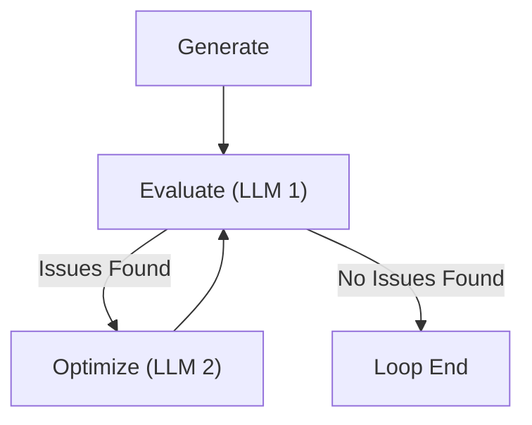
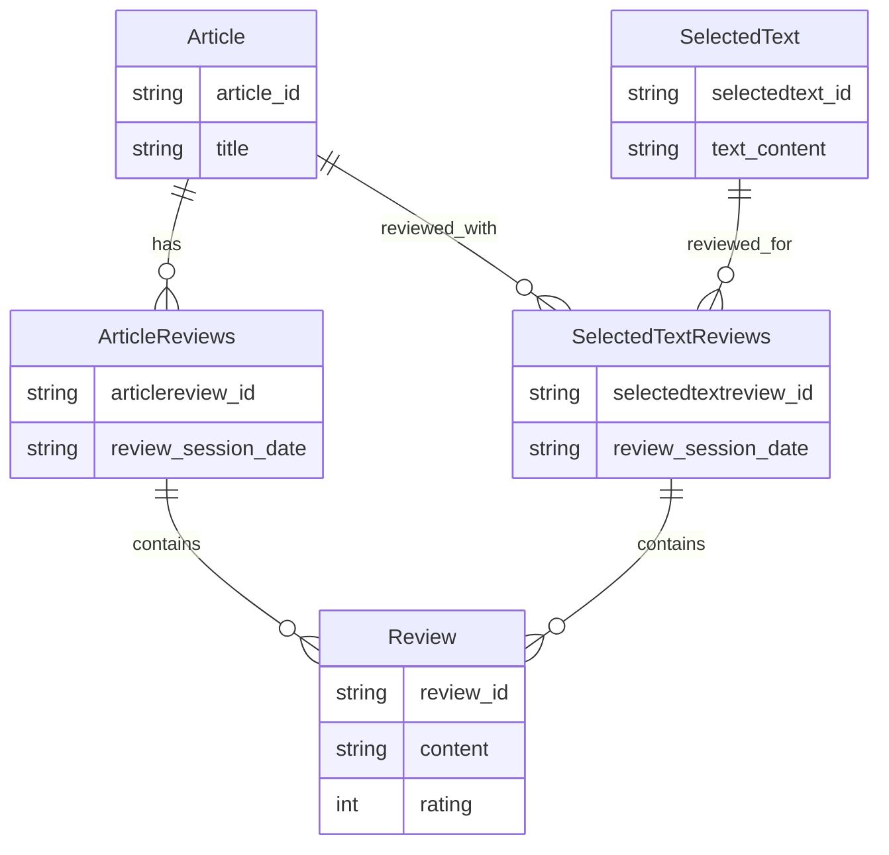

# Lesson 23: Evaluator-Optimizer Pattern — Reviewing and Editing the Brown Agent

In the previous lessons, we built the foundation of our Brown writing workflow. We learned how to structure the project in Lesson 20, designed the system architecture in Lesson 21, and implemented the core drafting logic in Lesson 22 using the orchestrator-worker pattern and context engineering.

However, generating a draft is just the beginning. Any professional writer knows that the real value is created during editing. A first draft rarely meets all quality standards, tone requirements, and structural guidelines perfectly.

In this lesson, we will implement the **Evaluator-Optimizer** pattern to add a self-correcting quality assurance layer to our agent. We will build an automated reviewing system that critiques the generated article against our strict profiles and then feeds those reviews back to the writer to iteratively improve the content. Finally, we will orchestrate this entire process using LangGraph's Functional API and add short-term memory to persist our workflow state.

Here is what we will learn:
- The architecture of the Evaluator-Optimizer pattern and how it differs from Reflection.
- How to model review entities to capture structured feedback.
- Implementing an **Article Reviewer** (Evaluator) that checks content against multiple profiles.
- Upgrading the **Article Writer** (Optimizer) to edit content based on feedback.
- Centralizing application configuration using Pydantic and YAML.
- Orchestrating the review-edit loop with LangGraph's Functional API and checkpointing.

## Explaining the Evaluator-Optimizer Pattern

The **Evaluator-Optimizer** pattern is a workflow design that mimics real-world quality assurance. It separates the generation of content from its evaluation, creating a feedback loop that iteratively refines the output until it meets specific criteria [[1]](https://www.anthropic.com/engineering/building-effective-agents).

The architecture consists of two distinct components:
1.  **Evaluator**: Analyzes the output against a set of requirements and identifies specific issues.
2.  **Optimizer**: Takes the feedback from the evaluator and generates an improved version of the output.

This cycle continues until a stopping condition is met, such as reaching a maximum number of iterations or satisfying a quality threshold [[2]](https://www.decodingai.com/p/stop-building-ai-agents-use-these).

```mermaid
graph TD
    A["Generate initial output"] --> B{"Evaluate output against requirements"}
    B -->| "Issues found" | C["Optimize/edit the output"]
    C --> B
    B -->| "No issues found" | D["Return final output"]
```
<diagram_caption>
Image 1: A flowchart illustrating the generic Evaluator-Optimizer pattern.
</diagram_caption>

This pattern is widely used in engineering tasks where quality is non-negotiable:
- **Code generation:** An LLM writes code, and a separate component (static analysis or another LLM) reviews it for security flaws or style violations.
- **Video script writing:** A script is generated and then reviewed for pacing and brand alignment.
- **Course material creation:** Lessons are drafted and then critiqued for pedagogical effectiveness.
- **Financial reporting:** ensuring outputs adhere to strict data formats and compliance rules.

In our context, this mirrors the professional writing process:
1.  The **Writer** creates an initial draft.
2.  The **Reviewer** provides objective feedback based on guidelines.
3.  The **Editor** (often the writer wearing a different hat) refines the draft based on that feedback.
4.  Steps 2 and 3 repeat until the piece is polished.

## Scoping the New Writing Workflow Architecture

In Lesson 22, we implemented a linear three-step workflow:
1.  **Load Context**: Gather guidelines, research, profiles, and examples.
2.  **Generate Media**: Create diagrams using the orchestrator-worker pattern.
3.  **Write Article**: Generate the first draft.

Now, we are extending this into a five-step workflow by adding a review-edit loop:
4.  **Review Article (Evaluator)**: The `ArticleReviewer` node checks the draft against the article guideline and all writing profiles (tone, style, structure).
5.  **Edit Article (Optimizer)**: The `ArticleWriter` node ingests the reviews and rewrites the article to fix the identified issues.

 https://raw.githubusercontent.com/iusztinpaul/agentic-ai-engineering-course-data/main/images/l23_writing_workflow.png 
<image_caption>
Image 2: The complete writing workflow, adding the review and edit steps to the previous pipeline. (Source [The Agentic AI Engineering Course](https://github.com/towardsai/agentic-ai-engineering-course/tree/dev/lessons/23_evaluator_optimizer))
</image_caption>

This loop runs for a configurable number of iterations.

### Why We Don't Use a Quality Score

The standard definition of the evaluator-optimizer pattern often suggests using a numerical score to decide when to stop the loop. We deliberately avoid this for two reasons.

First, writing quality is subjective and multi-dimensional. Reducing adherence to complex style guides and tonality profiles to a single scalar number is noisy and unreliable. An LLM might hallucinate a high score while missing critical structural requirements, or give a low score for minor stylistic choices, leading to erratic looping behavior.

Second, we prioritize **Human-in-the-Loop (HITL)**. Instead of relying on an arbitrary threshold, we run a fixed number of automated review cycles (e.g., 2 passes) to catch obvious errors. Then, as we will see in Lesson 24, we present the result to a human user who can provide the final "pass" or request specific edits. This approach saves tokens and latency while ensuring the final output actually meets human standards.

## The Evaluator-Optimizer vs. Reflection Pattern

Both the Evaluator-Optimizer and Reflection patterns aim to improve LLM outputs through iteration, but they solve the problem differently.

**The Evaluator-Optimizer Pattern** uses separate LLM calls (or even distinct agents) for generation and evaluation. This separation of concerns allows us to use different prompts, contexts, or even different models for each task. For example, you might use a highly creative model for writing and a stricter, reasoning-heavy model for reviewing [[2]](https://www.decodingai.com/p/stop-building-ai-agents-use-these).


<diagram_caption>
Image 3: A flowchart illustrating the Evaluator-Optimizer pattern.
</diagram_caption>

**The Reflection Pattern**, in contrast, typically happens within a single LLM call or a tight loop using the same model context. The model is prompted to "critique its own thinking" before or after generating the final answer. While efficient, it lacks the transparency and modularity of having a distinct evaluator node [[3]](https://www.newsletter.swirlai.com/p/building-ai-agents-from-scratch-part-8ca), [[4]](https://blog.langchain.com/reflection-agents/).

```mermaid
graph TD
    Generate["Generate"] --> SelfReflect["Self-Reflect (same LLM)"]
    SelfReflect -->| "Revisions needed" | Revise["Revise"]
    Revise --> SelfReflect
    SelfReflect -->| "No revisions needed" | LoopEnd["Loop End"]
```
<diagram_caption>
Image 4: A flowchart illustrating the Reflection pattern with self-reflection and revision loop.
</diagram_caption>

Usually, the Evaluator-Optimizer pattern is used within workflows, while the Reflection pattern is purely agentic. However, as the line between workflows and agents blurs, you can apply the Evaluator-Optimizer pattern to an agentic design. In such a swarm of agents, you would have specialized evaluator and optimizer agents, and the decision to pass information between the two is handled by an orchestrator agent, rather than being hardcoded within the code as we do in a workflow. Ultimately, the biggest difference is whether the evaluation is done by the same entity (Reflection) or by a different, specialized one (Evaluator-Optimizer).

We chose the Evaluator-Optimizer pattern for Brown because:
1.  **Transparency**: We want to inspect the `Reviews` as distinct artifacts. This helps us debug *why* the agent decided to edit the text.
2.  **Configuration**: We can use a high-temperature model for the creative writing phase and a low-temperature, deterministic model for the strict reviewing phase.
3.  **Process**: It aligns with the real-world separation between a writer and an editor.

## Modeling our Review Entities

To implement this pattern, we first need to define structured data models for our feedback. In Lesson 22, we defined `Article` and `ArticleGuideline`. Now, we introduce entities for the reviewing logic.

We support two types of reviews to optimize for cost and speed: **Whole Article Reviews** and **Selected Text Reviews**. Often, you only need to fix a specific section, not rewrite the entire piece.


<diagram_caption>
Image 5: Entity Relationship Diagram showing relationships between Article, ArticleReviews, Review, SelectedText, and SelectedTextReviews.
</diagram_caption>

### The Review Entity

A `Review` captures a single issue found in the text. It links the issue to a specific profile, location, and provides a comment.

```python
from pydantic import BaseModel, Field
from brown.entities.mixins import ContextMixin


class Review(BaseModel, ContextMixin):
    profile: str = Field(
        description="The profile type listing the constraints based on which we will write the comment."
    )
    location: str = Field(
        description="The location from within the article where the comment is made. For example, the title of a section."
    )
    comment: str = Field(
        description="The comment made by the reviewer stating the issue relative to the profile."
    )

    def to_context(self) -> str:
        return f"""
<{self.xml_tag}>
    <profile>{self.profile}</profile>
    <location>{self.location}</location>
    <comment>{self.comment}</comment>
</{self.xml_tag}>
"""
```

### The ArticleReviews Entity

This entity bundles all reviews for a full article pass. It contains the article itself and the list of reviews.

```python
class ArticleReviews(BaseModel, ContextMixin):
    article: Article
    reviews: list[Review]

    def to_context(self, include_article: bool = False) -> str:
        reviews_str = "\n".join([review.to_context() for review in self.reviews])
        return f"""
<{self.xml_tag}>
    {f"<article>{self.article}</article>" if include_article else ""}
    <reviews>
    {reviews_str}
    </reviews>
</{self.xml_tag}>
"""
```

### The SelectedText Entity

To review only a part of the article, we need to define what that part is. The `SelectedText` entity holds the content and its position (line numbers) within the parent article.

```python
class SelectedText(BaseModel, ContextMixin):
    article: Article
    content: str
    first_line_number: int
    last_line_number: int

    def to_context(self) -> str:
        return f"""
<{self.xml_tag}>
    <content>{self.content}</content>
    <first_line_number>{self.first_line_number}</first_line_number>
    <last_line_number>{self.last_line_number}</last_line_number>
</{self.xml_tag}>
"""
```

### The SelectedTextReviews Entity

Finally, this entity groups reviews specific to a text selection. We will see this in action in Lesson 24 when we implement human-in-the-loop editing. It links the reviews to the specific `SelectedText`.

```python
class SelectedTextReviews(BaseModel, ContextMixin):
    article: Article
    selected_text: SelectedText
    reviews: list[Review]

    def to_context(self, include_article: bool = False) -> str:
        reviews_str = "\n".join([review.to_context() for review in self.reviews])
        return f"""
<{self.xml_tag}>
    {f"<article>{self.article.to_context()}</article>" if include_article else ""}
    <selected_text>{self.selected_text.to_context()}</selected_text>
    <reviews>
    {reviews_str}
    </reviews>
</{self.xml_tag}>
"""
```

## Implementing the Article Reviewer (The Evaluator)

We use the same `Node` abstraction from Lesson 22 to ensure consistency. The `ArticleReviewer` node is responsible for generating the feedback.

### The Class and Initialization

The reviewer takes the content to review (polymorphic: `Article` or `SelectedText`) and the requirements (guideline and profiles).

```python
class ArticleReviewer(Node):
    system_prompt_template = """..."""  # We'll see this shortly
    selected_text_system_prompt_template = """..."""

    def __init__(
        self,
        to_review: Article | SelectedText,
        article_guideline: ArticleGuideline,
        model: Runnable,
        article_profiles: ArticleProfiles,
    ) -> None:
        self.to_review = to_review
        self.article_guideline = article_guideline
        self.article_profiles = article_profiles

        super().__init__(model, toolkit=Toolkit(tools=[]))
```
Notice that the toolkit is empty. Reviewing is a pure generation task as the LLM doesn't need external tools to critique the text based on the provided context.

### Model Extension

We use an intermediate Pydantic model `ReviewsOutput` to enforce structured output from the LLM.

```python
class ReviewsOutput(BaseModel):
    reviews: list[Review]

def _extend_model(self, model: Runnable) -> Runnable:
    model = cast(BaseChatModel, super()._extend_model(model))
    model = model.with_structured_output(ReviewsOutput)
    
    return model
```
This decoupling keeps the LLM's output schema simple (`list[Review]`) while allowing the node to return rich domain entities (`ArticleReviews`) that include the original article context.

### The `ainvoke` Method

This method orchestrates the prompt assembly and model call.

1. First, we construct the system prompt by formatting all the profiles and guidelines into context. We also handle the logic for adding specialized instructions if we are reviewing a selected text segment.
    ```python
    async def ainvoke(self) -> ArticleReviews | SelectedTextReviews:
        # Build the main system prompt with all requirements
        system_prompt = self.system_prompt_template.format(
            human_feedback=self.human_feedback.to_context() if self.human_feedback else "",
            article=self.article.to_context(),
            article_guideline=self.article_guideline.to_context(),
            character_profile=self.article_profiles.character.to_context(),
            article_profile=self.article_profiles.article.to_context(),
            structure_profile=self.article_profiles.structure.to_context(),
            mechanics_profile=self.article_profiles.mechanics.to_context(),
            terminology_profile=self.article_profiles.terminology.to_context(),
            tonality_profile=self.article_profiles.tonality.to_context(),
        )
        
        user_input_content = self.build_user_input_content(inputs=[system_prompt])
        inputs = [{"role": "user", "content": user_input_content}]
        
        # If reviewing selected text, add additional instructions
        if self.is_selected_text:
            inputs.extend([
                {
                    "role": "user",
                    "content": self.selected_text_system_prompt_template.format(
                        selected_text=self.to_review.to_context()
                    ),
                }
            ])
    ```

2. Next, we invoke the model to generate the reviews and package the output into the appropriate domain entity.
    ```python
        # Generate reviews
        reviews = await self.model.ainvoke(inputs)
        if not isinstance(reviews, ReviewsOutput):
            raise InvalidOutputTypeException(ReviewsOutput, type(reviews))
        
        # Return appropriate review type
        if self.is_selected_text:
            return SelectedTextReviews(
                article=self.article,
                selected_text=cast(SelectedText, self.to_review),
                reviews=reviews.reviews,
            )
        else:
            return ArticleReviews(
                article=self.article,
                reviews=reviews.reviews,
            )
    ```

We call `to_context()` on every entity. This encapsulates the logic for formatting each profile into XML, keeping the node logic clean.

### The System Prompt

The system prompt is the brain of our evaluator. Let's analyze its anatomy, following best practices for prompt structure [[5]](https://www.youtube.com/watch?v=ysPbXH0LpIE):

1. **Task Context**: Defines the persona.
   `You are Brown, an expert article writer, editor and reviewer specialized in reviewing technical...`
2. **Background Data**: Injects the article, guideline, and all profiles (Character, Tonality, Structure, etc.).
3. **Detailed Task Description**: Defines the rules.
   `Reviewing Rules` establishes a strict hierarchy: Special Rules > Guideline > Article Profile > Others. This prevents the model from prioritizing minor stylistic points over core requirements.
4. **Output Formatting**: Explicitly asks for `profile`, `location`, and `comment`.
5. **Chain of Thought**:
   ```text
   1. Read and analyze the article.
   2. Read and analyze the <human_feedback>.
   3. Read and analyze all the requirements...
   4. Carefully compare the article against the requirements...
   5. For each requirement, create 0 to N reviews
   6. Return the reviews of the article.
   ```
   This explicit reasoning path forces the model to synthesize all inputs before generating the output.

We could further improve this prompt by adding **few-shot examples**. By calling the reviewer on a sample article, manually correcting the generated reviews, and feeding those back into the prompt as examples, we could significantly increase the quality and consistency of the feedback.

### The Selected Text Prompt

When reviewing a specific section, we append a specialized prompt. It instructs the model to locate the selection within the full article and overrides the Chain of Thoughts.

```python
selected_text_system_prompt_template = """
You already reviewed and edited the whole article. Now we want to further review only a specific portion...

## Chain of Thoughts

Here is the new chain of thoughts logic you will follow...
1. Read and analyze the article.
2. Locate the <selected_text> within the <article>...
...
"""
```
By placing this at the end of the prompt chain, we effectively redirect the model's immediate focus while keeping the global context available.

<aside>
💡 Note: Basically, as the chain of thoughts incorporates the immediate task and sits at the bottom of the prompt, it always dictates to the LLM what to do in the current call, while everything else usually sits as context.
</aside>

### Example: Reviewing a Whole Article

Let's see the reviewer in action. We load the context and the article generated in the previous lesson, then run the reviewer.

```python
from brown.loaders import MarkdownArticleGuidelineLoader, MarkdownArticleLoader, MarkdownArticleProfilesLoader
from brown.models import SupportedModels, get_model
from brown.nodes import ArticleReviewer

# Load context (guideline, profiles)
guideline_loader = MarkdownArticleGuidelineLoader(uri=Path("article_guideline.md"))
article_guideline = guideline_loader.load(working_uri=SAMPLE_DIR)

# ... Load profiles ...

# Load article
article_loader = MarkdownArticleLoader(uri=Path("article.md"))
article = article_loader.load(working_uri=SAMPLE_DIR)

# Run reviewer
model = get_model(SupportedModels.GOOGLE_GEMINI_25_FLASH)
reviewer = ArticleReviewer(
    to_review=article,
    article_guideline=article_guideline,
    article_profiles=article_profiles,
    model=model,
)

article_reviews = await reviewer.ainvoke()
```
The output shows specific, actionable feedback:
```text
{
  "Profile": "article_guideline",
  "Location": "Article level - Outline",
  "Comment": "The article's main title is 'Workflows vs. Agents...'. However, the guideline specifies..."
}
```

### Example: Reviewing Selected Text

We can also review just a specific portion of the article. This is useful when a user wants to check if a particular section meets the requirements without reprocessing the entire document.

1. First, we extract the text we want to review and wrap it in a `SelectedText` entity.
    ```python
    from brown.entities.articles import SelectedText

    # Extract lines 11-44 from the article
    article_lines = article.content.split("\n")
    first_line_number = 11
    last_line_number = 44
    selected_content = "\n".join(article_lines[first_line_number:last_line_number])

    selected_text = SelectedText(
        article=article,
        content=selected_content,
        first_line_number=first_line_number,
        last_line_number=last_line_number,
    )
    ```

2. Then, we run the `ArticleReviewer` exactly as before, but passing the `SelectedText` object. The node's polymorphic design handles the rest.
    ```python
    reviewer = ArticleReviewer(
        to_review=selected_text,
        article_guideline=article_guideline,
        article_profiles=article_profiles,
        model=model,
    )

    selected_text_reviews = await reviewer.ainvoke()
    ```
    The output will now contain reviews specific only to that slice of text, anchored by the line numbers.

## Hooking the Reviews to the Article Writer (The Optimizer)

To implement the Optimizer, we don't need a new node. We upgrade the existing `ArticleWriter` to serve a dual purpose: **Writer** (from scratch) and **Editor** (from reviews). This keeps all writing logic in one place.

### Updating the Article Writer

1. We update `__init__` to accept optional reviews.
    ```python
    def __init__(
        self,
        # ... other args
        reviews: ArticleReviews | SelectedTextReviews | None = None,
    ) -> None:
        # ...
        self.reviews = reviews
    ```
    If `reviews` is `None`, it writes a new draft. If provided, it switches to editing mode.

2. We update `ainvoke` to construct a conversation history that simulates the review process.
    ```python
    # Inside ainvoke...
    if self.reviews:
        # Context Engineering for Editing
        inputs = [
            {"role": "user", "content": system_prompt}, # Guidelines & Profiles
            {"role": "assistant", "content": self.reviews.article.to_context()}, # The Draft
            {"role": "user", "content": self.reviews.to_context()}, # The Feedback
        ]
    else:
        # Standard writing inputs
        inputs = [{"role": "user", "content": system_prompt}]
    ```
    This structure anchors the model: "Here are the rules (System), here is what you wrote (Assistant), here is what was wrong (User). Now fix it."

### The Editing Prompts

We use specific prompt templates for editing that are injected when reviews are present. The `article_reviews_prompt_template` directs the model to apply the feedback.

```python
article_reviews_prompt_template = """
...
You will edit the article based on the <reviews>.
...
## Chain of Thoughts
1. Read the <article>...
2. Analyze the <reviews>...
3. Apply the edits...
4. Return the edited article.
"""
```
This prompt overrides the default writing instructions, focusing the model purely on the optimization task.

Similarly, we have a `selected_text_reviews_prompt_template` for editing just a portion of the text. This prompt is crucial because LLMs don't inherently know how to "patch" a file; we must instruct them to return only the edited segment.

```python
selected_text_reviews_prompt_template = """
You are Brown, an expert article writer and editor.

Your task is to edit a specific portion of an article, labeled as <selected_text>, based on a set of reviews.

## Selected Text to Edit

Here is the selected text that needs to be edited:
{selected_text}

## Reviews

Here are the reviews that you need to address:
{reviews}

## Editing Process

You will edit the <selected_text> based on the <reviews>. You will NOT edit the whole article. You will ONLY edit the <selected_text>.

## Chain of Thoughts

1. Read the <article> to understand the context.
2. Locate the <selected_text> within the <article>.
3. Analyze the <reviews> to understand what needs to be fixed.
4. Edit the <selected_text> to address the reviews.
5. Return ONLY the edited <selected_text>.
"""
```

### End-to-End Example

We can now run the full loop manually to verify the logic. This example demonstrates the complete lifecycle: loading context, generating media, writing a draft, reviewing it, and editing it.

1. **Load Context**: We initialize our loaders and fetch all necessary data.
    ```python
    # Load guideline and profiles
    guideline_loader = MarkdownArticleGuidelineLoader(uri=Path("article_guideline.md"))
    article_guideline = guideline_loader.load(working_uri=SAMPLE_DIR)
    
    profiles_loader = MarkdownArticleProfilesLoader(uri=profiles_input)
    article_profiles = profiles_loader.load(working_uri=SAMPLE_DIR)
    ```

2. **Generate Media**: We run the media generation step (simulated here for brevity).
    ```python
    # Assume media items are generated
    media_items = [...] 
    ```

3. **Write Draft**: We invoke the writer to create the first version.
    ```python
    writer = ArticleWriter(
        article_guideline=article_guideline,
        article_profiles=article_profiles,
        media_items=media_items,
        model=model,
        reviews=None # Writing from scratch
    )
    draft = await writer.ainvoke()
    print(f"Draft length: {len(draft.content)} characters")
    ```

4. **Review**: The reviewer analyzes the draft and produces feedback.
    ```python
    reviewer = ArticleReviewer(
        to_review=draft,
        article_guideline=article_guideline,
        article_profiles=article_profiles,
        model=model,
    )
    reviews = await reviewer.ainvoke()
    print(f"Generated {len(reviews.reviews)} reviews")
    ```

5. **Edit**: The writer acts as an editor, applying the reviews to the draft.
    ```python
    editor = ArticleWriter(
        article_guideline=article_guideline,
        article_profiles=article_profiles,
        media_items=media_items,
        model=model,
        reviews=reviews # Editing mode
    )
    final_article = await editor.ainvoke()
    ```

6. **Compare**: We can check the difference between the draft and the final version.
    ```python
    print(f"Original length: {len(draft.content)}")
    print(f"Final length: {len(final_article.content)}")
    # In a real scenario, you would use a diff tool here to see specific changes.
    ```

7. **Save**: Finally, we save the polished article.
    ```python
    with open("final_article.md", "w") as f:
        f.write(final_article.content)
    ```

Checking what actually changed after a review can be tedious. You have to go over the reviews, locate the changes using the `location` field, and use a diff tool to compare files. However, in future lessons, once we integrate the MCP server, this process of checking changes and diffs will be fully automated.

## Centralizing Our App Configuration

As our system grows, hardcoding model names and paths becomes unmanageable. We need a centralized configuration system.

We use Pydantic to define a type-safe schema for our config and YAML for the actual values.

### Configuration Classes

1. **Context**: Defines paths to guidelines, profiles, and research.
    ```python
    class Context(BaseModel):
        base_uri: Path
        # ...
        def build_article_uri(self, iteration: int | None = None) -> Path:
            # Helper to version article files (article_001.md, etc.)
            ...
    ```

2. **ToolConfig**: Configures individual tools, such as the diagram generator.
    ```python
    class ToolConfig(BaseModel):
        enabled: bool = True
        model: str = "gemini-2.5-flash"
        timeout: int = 30
    ```

3. **NodeConfig**: Allows configuring the model and parameters for each node independently.
    ```python
    class NodeConfig(BaseModel):
        model: str
        temperature: float = 0.0
        tools: dict[str, ToolConfig] = {}
    ```

4. **Memory**: Controls the checkpointing strategy.
    ```python
    class Memory(BaseModel):
        type: Literal["in_memory", "sqlite"] = "in_memory"
        path: str = "checkpoints.db"
    ```

5. **AppConfig**: The root configuration object.
    ```python
    class AppConfig(BaseModel):
        num_reviews: int = 2 # Controls the loop iterations
        nodes: dict[str, NodeConfig]
        context: Context
        memory: Memory
    
        @classmethod
        def from_yaml(cls, path: Path) -> "AppConfig":
            # Load and validate YAML
            ...
    ```

### Example YAML

In `configs/course.yaml`, we can fine-tune the behavior of each step.

```yaml
num_reviews: 2
memory:
  type: "sqlite"
  path: "checkpoints.db"
nodes:
  article_writer:
    model: "gemini-1.5-pro"
    temperature: 0.7 # Creative
  article_reviewer:
    model: "gemini-1.5-pro"
    temperature: 0.0 # Strict
  article_editor:
    model: "gemini-1.5-pro"
    temperature: 0.1 # Focused
```
This allows us to use a creative setting for the first draft and a strict, deterministic setting for reviewing and editing, optimizing the performance of each stage.

### Loading and Using Configuration

We load the configuration once at the start of our application.

```python
from brown.config import AppConfig

# Load config from YAML
config = AppConfig.from_yaml(Path("configs/course.yaml"))

print(f"Loaded config with {config.num_reviews} review iterations")
print(f"Writer model: {config.nodes['article_writer'].model}")
```

## Glueing Everything Into Our LangGraph Workflow

We use LangGraph's **Functional API** to orchestrate this process. We chose the Functional API over the Graph API because it allows us to write standard Python loops and logic (`if/else`) while still getting state management and checkpointing [[6]](https://docs.langchain.com/oss/python/langgraph/functional-api), [[7]](https://docs.langchain.com/oss/python/langgraph/use-functional-api).

In the first version of Brown, we used the Graph SDK, and it uselessly overcomplicated the code. Writing simple loops or conditional logic required defining complex edges and state reducers, turning what should have been minutes of coding into hours of debugging graph topology. The Functional API solves this by letting us use native Python control flow.

### The Workflow Definition

We define the workflow using LangGraph's Functional API with `@entrypoint`, `@task`, and a shared `RetryPolicy`. Below is the complete, end-to-end code from the notebook—builder, input schema, each task as its own code block, the orchestrator, and how to run it.

<aside>
💡 For more details on LangGraph's Functional API, check out the documentation for [`@entrypoint`](https://docs.langchain.com/oss/python/langgraph/functional-api#entrypoint), [`get_stream_writer`](https://docs.langchain.com/oss/python/langgraph/streaming), [`@task`](https://docs.langchain.com/oss/python/langgraph/functional-api#task), and [`RetryPolicy`](https://docs.langchain.com/oss/python/langgraph/functional-api#retry-policy).
</aside>

1) **Builder + Input Schema**
This block wires up configuration, declares the retry policy, and exposes `build_generate_article_workflow` plus the `GenerateArticleInput` schema that carries the working directory path into the workflow.
```python
from pathlib import Path
from typing import TypedDict, cast

from langchain_core.runnables import RunnableConfig
from langgraph.checkpoint.base import BaseCheckpointSaver
from langgraph.config import get_stream_writer
from langgraph.func import entrypoint, task
from langgraph.types import RetryPolicy

from brown.base import Loader
from brown.builders import build_article_renderer, build_loaders, build_model
from brown.config_app import get_app_config
from brown.entities.articles import Article, ArticleExamples
from brown.entities.guidelines import ArticleGuideline
from brown.entities.media_items import MediaItem, MediaItems
from brown.entities.profiles import ArticleProfiles
from brown.entities.research import Research
from brown.entities.reviews import ArticleReviews
from brown.nodes.article_reviewer import ArticleReviewer
from brown.nodes.article_writer import ArticleWriter
from brown.nodes.media_generator import MediaGeneratorOrchestrator
from brown.workflows.types import WorkflowProgress

app_config = get_app_config()
retry_policy = RetryPolicy(max_attempts=3, retry_on=Exception)

def build_generate_article_workflow(checkpointer: BaseCheckpointSaver):
    """Create a generate article workflow with optional checkpointer."""
    return entrypoint(checkpointer=checkpointer)(_generate_article_workflow)

class GenerateArticleInput(TypedDict):
    dir_path: Path
```

2) **Task: Generate Media Items**
Generates all diagrams/snippets by fanning out tool calls from the media orchestrator, logging planned jobs, running them in parallel, and returning a typed `MediaItems` collection.
```python
@task(retry_policy=retry_policy)
async def generate_media_items(article_guideline: ArticleGuideline, research: Research) -> MediaItems:
    writer = get_stream_writer()

    model, toolkit = build_model(app_config, node="generate_media_items")
    media_generator_orchestrator = MediaGeneratorOrchestrator(
        article_guideline=article_guideline,
        research=research,
        model=model,
        toolkit=toolkit,
    )
    media_items_to_generate_jobs = await media_generator_orchestrator.ainvoke()

    writer(f"Found {len(media_items_to_generate_jobs)} media items to generate using the following tool configurations:")
    for i, job in enumerate(media_items_to_generate_jobs):
        writer(f"  • Tool {i + 1}: {job['name']} - {job.get('args', {}).get('description_of_the_diagram', 'No description')}")

    coroutines = []
    for media_item_to_generate_job in media_items_to_generate_jobs:
        tool_name = media_item_to_generate_job["name"]
        tool = media_generator_orchestrator.toolkit.get_tool_by_name(tool_name)
        if tool is None:
            writer(f"⚠️ Warning: Unknown tool '{tool_name}', skipping...")
            continue
        coroutine = tool.ainvoke(media_item_to_generate_job["args"])
        coroutines.append(coroutine)

    writer(f"Executing {len(coroutines)} media item generation jobs in parallel.")
    media_items: list[MediaItem] = await asyncio.gather(*coroutines)
    writer(f"Generated {len(media_items)} media items.")

    return MediaItems.build(media_items)
```

3) **Task: Write Article**
Writes the first full draft using the writer node, combining guideline, research, profiles, media items, and examples into an `Article`.
```python
@task(retry_policy=retry_policy)
async def write_article(
    article_guideline: ArticleGuideline,
    research: Research,
    article_profiles: ArticleProfiles,
    media_items: MediaItems,
    article_examples: ArticleExamples,
) -> Article:
    model, _ = build_model(app_config, node="write_article")
    article_writer = ArticleWriter(
        article_guideline=article_guideline,
        research=research,
        article_profiles=article_profiles,
        media_items=media_items,
        article_examples=article_examples,
        model=model,
    )
    article = await article_writer.ainvoke()
    return cast(Article, article)
```

4) **Task: Generate Reviews**
Runs the reviewer on the current article to produce `ArticleReviews` aligned with guidelines and profiles.
```python
@task(retry_policy=retry_policy)
async def generate_reviews(article: Article, article_guideline: ArticleGuideline, article_profiles: ArticleProfiles) -> ArticleReviews:
    model, _ = build_model(app_config, node="review_article")
    article_reviewer = ArticleReviewer(
        to_review=article,
        article_guideline=article_guideline,
        article_profiles=article_profiles,
        model=model,
    )
    reviews = await article_reviewer.ainvoke()
    return cast(ArticleReviews, reviews)
```

5) **Task: Edit Based on Reviews**
Uses the writer in “edit” mode, guided by the generated reviews plus full context, to produce the updated `Article`.
```python
@task(retry_policy=retry_policy)
async def edit_based_on_reviews(
    article_guideline: ArticleGuideline,
    research: Research,
    article_profiles: ArticleProfiles,
    media_items: MediaItems,
    article_examples: ArticleExamples,
    reviews: ArticleReviews,
) -> Article:
    model, _ = build_model(app_config, node="edit_article")
    article_writer = ArticleWriter(
        article_guideline=article_guideline,
        research=research,
        article_profiles=article_profiles,
        media_items=media_items,
        article_examples=article_examples,
        model=model,
        reviews=reviews,
    )
    article = await article_writer.ainvoke()
    return cast(Article, article)
```

6) **Orchestrator (`_generate_article_workflow`)**
Orchestrates the entire flow: load context, generate media, draft, iterative review/edit/render with progress updates, and final render to disk.
```python
async def _generate_article_workflow(inputs: GenerateArticleInput, config: RunnableConfig) -> str:
    dir_path = inputs["dir_path"]
    dir_path.mkdir(parents=True, exist_ok=True)

    writer = get_stream_writer()

    writer(WorkflowProgress(progress=0, message="Loading context").model_dump(mode="json"))
    context = {}
    loaders = build_loaders(app_config)
    for context_name in ["article_guideline", "research", "profiles", "examples"]:
        loader = cast(Loader, loaders[context_name])
        context[context_name] = loader.load(working_uri=dir_path)
    writer(WorkflowProgress(progress=2, message="Loaded context").model_dump(mode="json"))

    writer(WorkflowProgress(progress=3, message="Genererating media items").model_dump(mode="json"))
    media_items = await generate_media_items(context["article_guideline"], context["research"])
    writer(WorkflowProgress(progress=10, message="Generated media items").model_dump(mode="json"))

    writer(WorkflowProgress(progress=15, message="Writing article").model_dump(mode="json"))
    article = await write_article(context["article_guideline"], context["research"], context["profiles"], media_items, context["examples"])
    writer(WorkflowProgress(progress=20, message="Written raw article").model_dump(mode="json"))

    article_path = dir_path / app_config.context.build_article_uri(0)
    article_renderer = build_article_renderer(app_config)
    article_renderer.render(article, output_uri=article_path)
    writer(WorkflowProgress(progress=25, message=f"Rendered raw article to `{article_path}`").model_dump(mode="json"))

    steps_per_iteration = 3  # review, edit, render
    total_steps = max(1, app_config.num_reviews * steps_per_iteration)
    step_size = 75 / total_steps  # remaining percentage after 25
    for i in range(1, app_config.num_reviews + 1):
        base_step_index = (i - 1) * steps_per_iteration

        p_review = int(25 + step_size * (base_step_index + 1))
        p_review = min(p_review, 99)
        writer(WorkflowProgress(progress=p_review, message=f"Rewiewing article [Iteration {i} / {app_config.num_reviews}]").model_dump(mode="json"))
        reviews = await generate_reviews(article, context["article_guideline"], context["profiles"])
        writer(WorkflowProgress(progress=p_review, message="Generated reviews").model_dump(mode="json"))

        p_edit = int(25 + step_size * (base_step_index + 2))
        p_edit = min(p_edit, 99)
        writer(WorkflowProgress(progress=p_edit, message="Editing article").model_dump(mode="json"))
        article = await edit_based_on_reviews(
            context["article_guideline"],
            context["research"],
            context["profiles"],
            media_items,
            context["examples"],
            reviews,
        )
        writer(WorkflowProgress(progress=p_edit, message="Edited article").model_dump(mode="json"))

        p_render = int(25 + step_size * (base_step_index + 3))
        p_render = min(p_render, 99)
        article_path = dir_path / app_config.context.build_article_uri(i)
        article_renderer.render(article, output_uri=article_path)
        writer(WorkflowProgress(progress=p_render, message=f"Rendered article to `{article_path}`").model_dump(mode="json"))

    article_path = dir_path / app_config.context.article_uri
    article_renderer.render(article, output_uri=article_path)
    writer(WorkflowProgress(progress=100, message=f"Final article rendered to `{article_path}`").model_dump(mode="json"))

    return f"Final article rendered to`{article_path}`."
```

7) **Running the Workflow**
Shows how to build the workflow with an in-memory checkpointer, stream events, and capture outputs using a thread-scoped config.
```python
import uuid
from brown.memory import build_in_memory_checkpointer
from brown.workflows.generate_article import build_generate_article_workflow

async with build_in_memory_checkpointer() as checkpointer:
    workflow = build_generate_article_workflow(checkpointer=checkpointer)

    thread_id = str(uuid.uuid4())
    config = {"configurable": {"thread_id": thread_id}}

    async for event in workflow.astream(
        {"dir_path": SAMPLE_DIR},
        config=config,
        stream_mode=["custom", "values"],
    ):
        event_type, event_data = event
        if event_type == "custom":
            print(event_data)
        elif event_type == "values":
            print(event_data)
```

We apply a `RetryPolicy` to tasks. This ensures that if an API call fails or a rate limit is hit, LangGraph automatically retries just that specific step without crashing the whole workflow.

This implementation follows clean code patterns by separating the **app layer** from the **infrastructure layer**. The LangGraph workflow represents our app layer, gluing together entities and nodes into usable business logic. The checkpointer acts as the infrastructure layer, providing short-term memory. Notice how the workflow doesn't care *which* checkpointer we use (in-memory or SQLite), only that a checkpointer is injected at runtime. This keeps our domain logic independent of infrastructure choices.

## Adding Short-Term Memory

To make our workflow resilient, we inject a **Checkpointer**. This component saves the state of the workflow after every task.

We support both in-memory (for testing) and SQLite (for local persistence) checkpointers.

1. **In-Memory Checkpointer**: Best for development and testing where persistence isn't required.
    ```python
    from langgraph.checkpoint.memory import InMemorySaver

    def build_in_memory_checkpointer():
        return InMemorySaver()
    ```

2. **SQLite Checkpointer**: Best for local persistence, allowing you to resume workflows if the process dies.
    ```python
    from langgraph.checkpoint.sqlite import SqliteSaver
    import sqlite3

    def build_sqlite_checkpointer(db_path: str = "checkpoints.db"):
        conn = sqlite3.connect(db_path, check_same_thread=False)
        return SqliteSaver(conn)
    ```

Checkpointing provides:
- **Resilience**: If the script crashes during the 2nd review loop, we can resume exactly from there.
- **Debugging**: We can inspect the state of the article at every iteration.
- **Human-in-the-Loop**: We can pause execution, wait for user input, and resume.

## Running the New Writing Workflow

Now we can run the complete system. We use `astream` to get real-time feedback on the process.

1. **Build the Workflow**: We use our builder function to create the workflow with the desired checkpointer.
    ```python
    # Initialize checkpointer
    checkpointer = build_in_memory_checkpointer()
    
    # Build workflow
    workflow = build_generate_article_workflow(checkpointer)
    ```

2. **Execute**: We generate a unique `thread_id` to track this specific run in the checkpointer and stream the events.
    ```python
    import uuid

    thread_id = str(uuid.uuid4())
    config = {"configurable": {"thread_id": thread_id}}
    input = {"uri": "inputs/tests/02_sample_medium"}

    async for event in workflow.astream(input, config=config):
        # Handle progress events
        print(event)
    ```

The output shows the progression through the stages:
```text
Loaded Context (Progress: 0-2%)
Generated Media (Progress: 3-10%)
Wrote Article (Progress: 15-20%)
Review-Edit Loop (Progress: 25-99%)
Final Save (Progress: 100%)
```

In the output directory, we see the evolution of the article:
- `article_000.md`: The initial draft.
- `article_001.md`: The result after the first review-edit cycle.
- `article_002.md`: The final polished version.

To see the impact of the Evaluator-Optimizer loop, let's look at a concrete example of how a review changed the content.

**Review:**
```json
{
  "Profile": "article_guideline",
  "Location": "Introduction",
  "Comment": "The introduction is too long (150 words) and lacks a clear hook. The guideline specifies a maximum of 100 words and requires an engaging opening."
}
```

**Before (Draft):**
> In the rapidly evolving landscape of artificial intelligence, engineers are often faced with a multitude of architectural choices. One of the most significant decisions is whether to build a deterministic workflow or an autonomous agent. This choice has profound implications for the reliability, cost, and user experience of the final application. While workflows offer control, agents offer flexibility. This article will explore the nuances of this decision... (150 words)

**After (Edited based on review):**
> Building AI applications forces you to make a critical choice early on: control or autonomy? Should you build a predictable workflow where you define every step, or an autonomous agent that thinks for itself? This decision impacts everything from your development costs to your user's experience. In this lesson, we will help you navigate this trade-off and choose the right path for your product. (65 words)

By diffing the files, we can see exactly how the loop tightened the prose and aligned it with our guidelines.

## Conclusion

In this lesson, we transformed our linear writing workflow into a reliable, self-correcting system using the **Evaluator-Optimizer** pattern. We modeled structured reviews, implemented a specialized reviewer node, and upgraded our writer to handle editing tasks. By orchestrating this with LangGraph and adding persistence, we built a resilient engine capable of iteratively refining its own work.

We learned:
- **The Pattern**: How separating evaluation from generation enables quality loops.
- **Architecture**: Why we prefer Evaluator-Optimizer over Reflection for this use case.
- **Implementation**: How to build polymorphic nodes and structured prompts for reviewing.
- **Orchestration**: Using LangGraph's Functional API for complex, stateful loops.

Here are some ideas on how you can further extend this code:
- **Different AI frameworks**: Replace LangGraph with PydanticAI or other frameworks (clean architecture makes swapping easy).
- **Improve the reviewer**: Tweak the reviewer prompts or profiles for better results. Get an intuition on how it affects the final prompts. The biggest change you could do here is to add few-shot-examples to the reviewer.
- **Modify the configuration**: Change models, temperatures, num_reviews from YAML and observe output changes.
- **Add a scoring mechanism to the evaluator**: Even so we advised against it, it will be a good exercise to modify the evaluator-optimizer implementation and see how it behaves.

In the next lesson, we will take this a step further by introducing **Human-in-the-Loop** workflows. We will expose our reviewing and editing capabilities as tools, allowing a human user to intervene, provide specific feedback, and guide the agent to the perfect final draft. Understanding this pattern is **important** for building production-quality AI systems, and the Functional API makes the integration with tools **easy**.

## References

1. Schluntz, E., & Zhang, B. (n.d.). Building effective agents. Anthropic.  https://www.anthropic.com/engineering/building-effective-agents 

2. Iusztin, P. (2025, February 23). Stop Building AI Agents. Use These 5 Patterns Instead. Decoding AI Magazine.  https://www.decodingai.com/p/stop-building-ai-agents-use-these 

3. SwirlAI. (n.d.). Reflection and Working Memory. SwirlAI.  https://www.newsletter.swirlai.com/p/building-ai-agents-from-scratch-part-8ca 

4. LangChain. (n.d.). Reflection Agents. LangChain Blog.  https://blog.langchain.com/reflection-agents/ 

5. Moran, H., & Ryan, C. (n.d.). Prompting 101 | Code w/ Claude. YouTube.  https://www.youtube.com/watch?v=ysPbXH0LpIE 

6. LangChain. (n.d.). Functional API overview. LangChain.  https://docs.langchain.com/oss/python/langgraph/functional-api 

7. LangChain. (n.d.). Use the functional API. LangChain.  https://docs.langchain.com/oss/python/langgraph/use-functional-api
