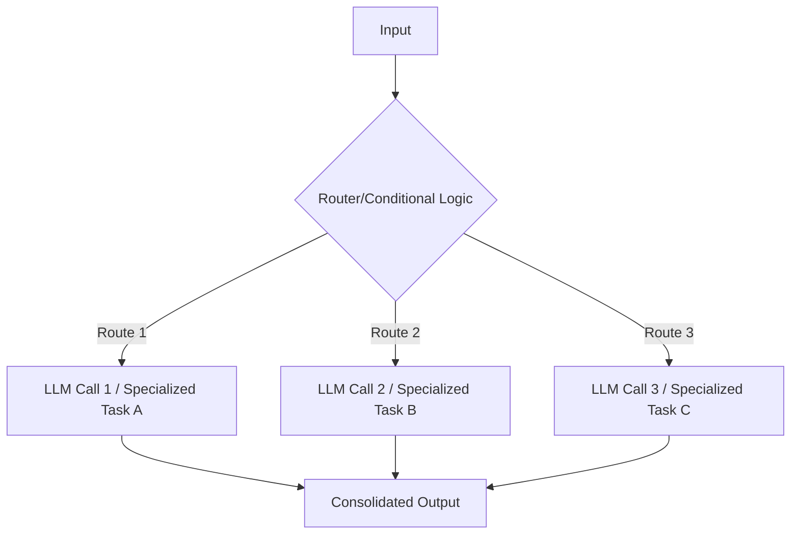
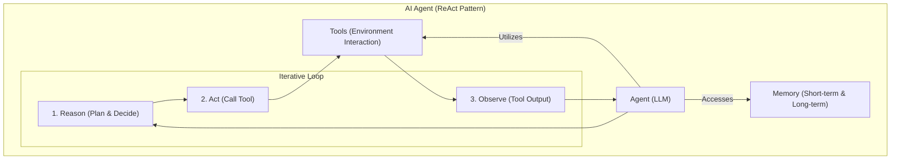
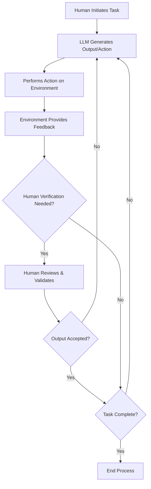
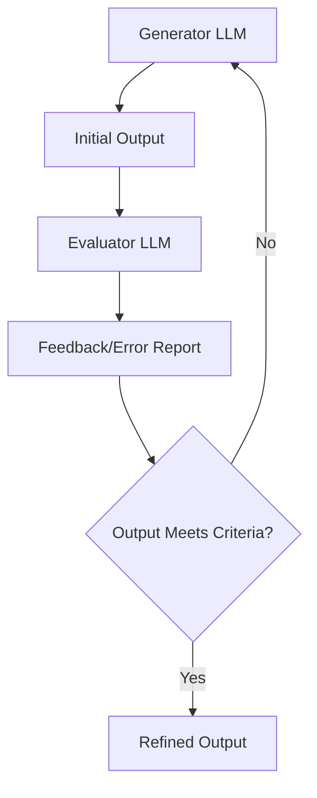
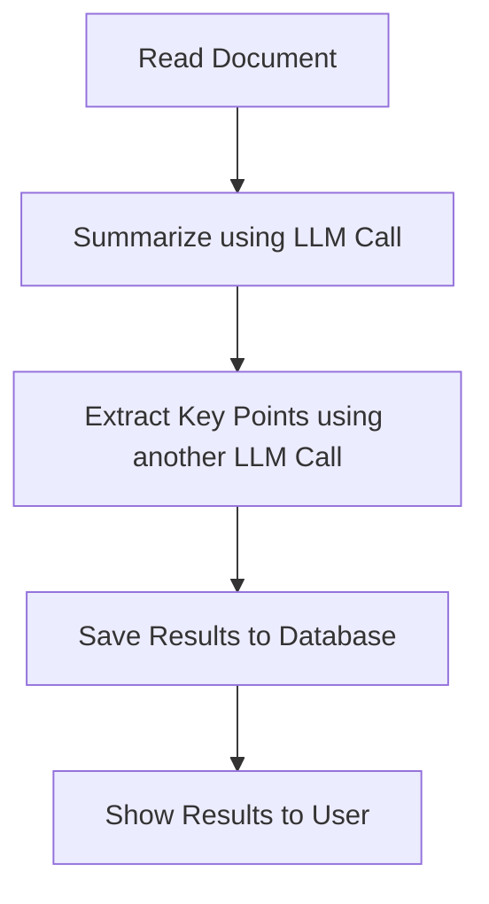
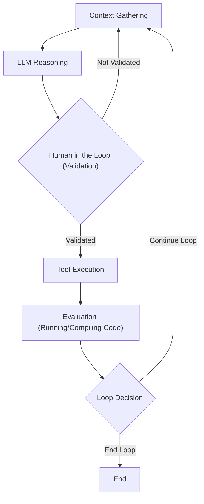
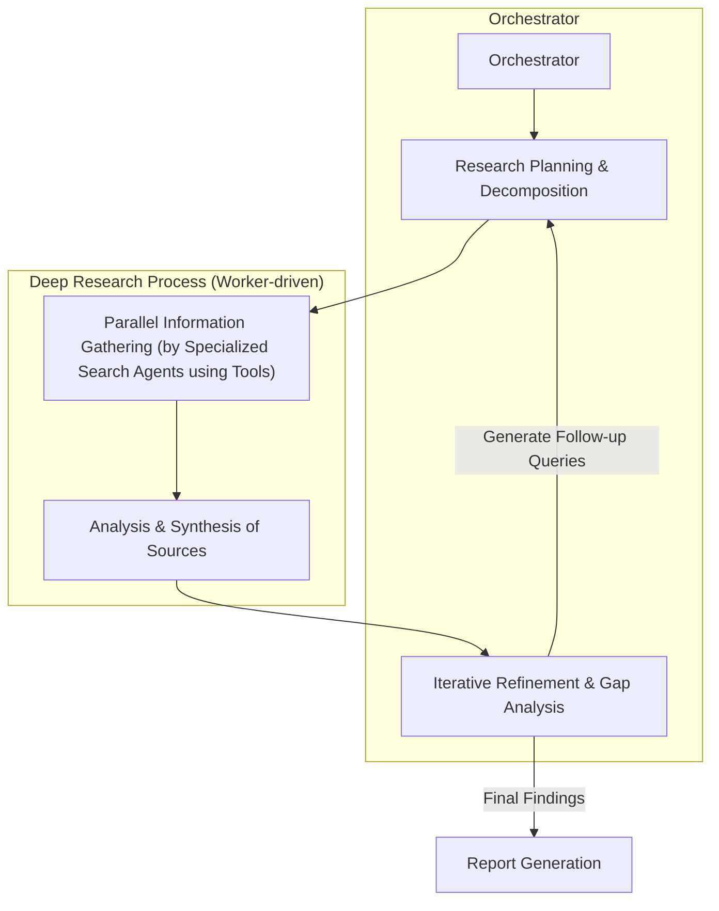

# The Architectural Divide: Workflows vs. AI Agents
### Navigating the core decision for production-ready AI

When building AI applications, engineers face a critical architectural decision early in their development process. Should they create a predictable, step-by-step workflow where they control every action, or should they build an autonomous agent that can think and decide for itself? This is one of the key decisions that will impact everything from development time and costs to reliability and user experience.

I remember a project where we initially opted for a fully agentic system, excited by the promise of autonomy. We quickly found ourselves debugging an unpredictable loop that burned through our token budget and delivered inconsistent results. It became clear that choosing the wrong approach can have severe consequences.

You might end up with an overly rigid system that breaks when users deviate from expected patterns or developers try to add new features. An unpredictable agent might work brilliantly 80% of the time but fails catastrophically when it matters most. This can lead to months of development time wasted rebuilding the entire architecture. It also results in frustrated users who cannot rely on the AI application. Furthermore, executives might find it too costly to keep the AI agent running relative to the profits.

In 2024-2025, billion-dollar AI startups succeed or fail based primarily on this architectural decision. The successful companies, teams, and AI engineers know when to use workflows versus agents, and how to combine both approaches effectively.

By the end of this lesson, you will understand the fundamental differences between LLM workflows and AI agents. We will explore their properties, when to use each approach, and how to combine them into powerful hybrid systems. You will also learn about common architectural patterns and real-world examples that anchor these concepts in practical applications. Finally, we will outline the daily challenges every AI engineer faces when bringing AI applications to production, setting the stage for future lessons in this course.

## Understanding the Spectrum: From Workflows to Agents

To choose between workflows and agents, you need a clear understanding of what they are. At this point, we focus on their properties and how we use them, rather than their technical specifics.

**LLM workflows** are sequences of tasks involving LLM calls or other operations, such as reading or writing data to a database or file system. Developer-written code largely orchestrates these tasks. Their steps are defined in advance, resulting in deterministic or rule-based paths with predictable execution and explicit control flow. A workflow is like a factory assembly line, where each step is predefined and executed in order. In future lessons, we will explore concepts such as chaining, routing, and orchestrator-worker patterns, which are common ways to structure these predictable sequences.



Image 1: A flowchart illustrating the Chaining and Routing pattern for LLM workflows. (Image by author from [the Decoding AI Magazine](https://decodingml.substack.com/p/llmops-for-production-agentic-rag))

**AI agents** are systems where an LLM plays a central role in dynamically deciding the sequence of steps, reasoning, and actions to achieve a goal. The steps are not defined in advance. Instead, they are dynamically planned based on the task and current state of the environment. Agents are adaptive, capable of handling novelty, and feature LLM-driven autonomy in decision-making and execution path. An agent is like a skilled human expert solving a new problem, adapting in the moment after each "Eureka!" moment. Future lessons will cover tools, memory, and ReAct agents, which are fundamental to building these dynamic systems.



Image 2: A diagram illustrating the core components and dynamics of an AI agent using the ReAct (Reason and Act) pattern, showing the iterative loop of Reason, Act, and Observe. (Image by author from [the Decoding AI Magazine](https://decodingml.substack.com/p/llmops-for-production-agentic-rag))

Both workflows and agents require an orchestration layer, but its nature differs between the two. In workflows, the orchestration layer executes a defined plan. In agents, it facilitates the LLM's dynamic planning and execution. Workflows offer predictability and consistency for well-defined tasks, while agents provide flexibility and model-driven decision-making when needed at scale [[1]](https://www.anthropic.com/engineering/building-effective-agents).

## Choosing Your Path

In the previous section, we defined LLM workflows and AI agents independently. Now, we explore their core differences: developer-defined logic versus LLM-driven autonomy in reasoning and action selection. The choice between them often depends on how much control you want to yield to the AI.

))

**LLM workflows** are suitable when the structure is well-defined. This includes pipelines for data extraction and transformation from sources such as the web, messaging tools like Slack, video calls from Zoom, project management tools like Notion, and cloud storage tools like Google Drive. We also use them for automated report or email generation from multiple data sources. They are useful for understanding project requirements and creating or updating tasks in Notion, document summarization followed by translation, repetitive daily tasks like sending emails or posting social media updates, and content generation or repurposing.

Workflows offer predictability and reliability for well-defined tasks. They are easier to debug due to their fixed paths and can have lower operational costs as we use simpler and smaller models specialized in given sub-tasks [[3]](https://towardsdatascience.com/a-developers-s-guide-to-building-scalable-ai-workflows-vs-agents/). Because workflows are predictable, costs and latency are also more predictable. Ultimately, using smaller models reduces the infrastructure overhead.

A weakness of workflows is the potentially higher development time needed as we manually engineer each step. The user experience can be rigid, unable to handle unexpected scenarios. Adding new features can also become complex as the application grows, similar to developing standard software tools. Workflows are usually preferred in enterprises or regulated fields that require predictable programs. For example, in finance, a financial advisor's report must always contain the right information as it directly impacts people's money and lives.

Similarly, in healthcare, AI tools require high accuracy for use in production due to their direct impact on patients. Workflows are ideal for Minimal Viable Products (MVPs) that require rapid deployment by hardcoding features. They are also best for scenarios where cost per request matters more than sophisticated reasoning, handling thousands of requests per minute.

**AI agents** are best for open-ended research and synthesis, such as researching World War II. They excel at dynamic problem-solving like debugging code or complex customer support. They also shine in interactive task completion in new environments, such as booking a flight without specifying the exact sites to use.

Agents offer adaptability to new situations and the flexibility to handle ambiguity and complexity as the steps are dynamically decided. However, the system is more prone to errors. Since the agent is non-deterministic, performance, latency, and costs can vary with each call, making agents often unreliable. Agents require larger LLMs that can generalize better, making agentic solutions more costly. AI agents usually require more LLM calls to understand user intent and take various actions, which can further increase costs per call.

If not designed well, there can be huge security concerns, especially with write operations, potentially deleting data or sending inappropriate emails. Ultimately, a major disadvantage of AI agents is their difficulty in debugging and evaluating. Many engineers joke about agents deleting their code, saying, "Anyway, I wanted to start a new project."

Most real-world systems blend elements of both approaches. In reality, we have a spectrum, a gradient between LLM workflows and AI agents, where a system adopts what is best from both worlds depending on its use cases. This is often called an "autonomy slider" [[4]](https://www.youtube.com/watch?v=kQxr-uOxw2o&t=1s) where you decide how much control to give to the LLM versus the user. As you go more manually, you use an LLM workflow together with a human who verifies intermediate steps. As you go more automatically, you give more control to the agent with fewer human-in-the-loop steps. For example, Cursor, a coding assistant, allows users to choose between `CMD+K` (change a chunk of code), `CMD+L` (change the entire file), or `CMD+I` (full autonomy for the entire repo). Similarly, Perplexity offers "search," "research," and "deep research," representing varying levels of autonomy.

The ultimate goal is to speed up the AI generation <-> Human verification loop. Good workflows or agentic architecture and well-designed user interface/user experience (UI/UX) platforms, like Cursor for coding, often achieve this.



Image 4: A flowchart illustrating the AI generation and human verification loop, emphasizing human supervision and iterative refinement. (Image by author from [the Decoding AI Magazine](https://decodingml.substack.com/p/llmops-for-production-agentic-rag))

## Exploring Common Patterns

To introduce the reader to the AI Engineering world, we present the most common patterns for building AI agents and LLM workflows. We explain them as if this is the first time you are hearing about them.

For **LLM workflows**, we have several patterns:

*   **Chaining and routing** automate multiple LLM calls. As a first automation step, it helps glue together multiple LLM calls and decide between appropriate options. This pattern is ideal for situations where a task can be easily decomposed into fixed subtasks, trading latency for higher accuracy by making each LLM call an easier task [[1]](https://www.anthropic.com/engineering/building-effective-agents). Examples include generating marketing copy and then translating it, or writing an outline, checking it, and then writing the document.


Image 5: A flowchart illustrating the Chaining and Routing pattern for LLM workflows. (Image by author from [the Decoding AI Magazine](https://decodingml.substack.com/p/llmops-for-production-agentic-rag))

*   **Orchestrator-worker** understands user intent, dynamically plans, calls multiple actions, and synthesizes them into a final answer. It allows the AI program to dynamically decide what actions to take based on the given task, making a smooth transition between the workflow and agentic world. This pattern is well-suited for complex tasks where you cannot predict the subtasks needed, such as coding products that make complex changes to multiple files or search tasks that involve gathering and analyzing information from multiple sources [[1]](https://www.anthropic.com/engineering/building-effective-agents).

```mermaid
graph TD
    A["Initial Input"] --> B["Orchestrator LLM"]

    subgraph "Worker Components"
        C["Worker LLM 1"]
        D["Worker LLM 2"]
        E["Specialized Tool"]
    end

    B --> C : "Delegate Sub-task 1"
    B --> D : "Delegate Sub-task 2"
    B --> E : "Delegate Sub-task 3"

    C --> B : "Return Result 1"
    D --> B : "Return Result 2"
    E --> B : "Return Result 3"

    B --> F["Synthesize Results"]
    F --> G["Final Comprehensive Output"]
```

Image 6: A flowchart illustrating the Orchestrator-Worker pattern in LLM workflows. (Image by author from [the Decoding AI Magazine](https://decodingml.substack.com/p/llmops-for-production-agentic-rag))

*   The **evaluator-optimizer loop** auto-corrects the results from an LLM based on automated feedback. LLM outputs can drastically improve by providing feedback on what they did wrong. This pattern automates that by having an "LLM reviewer" that analyzes the output from the LLM who generated the answer, creates an `error report` (also known as a reflection), and passes it back to the generator to auto-correct itself. A human writer refines a document based on feedback. This workflow is effective when clear evaluation criteria exist and iterative refinement provides measurable value, similar to a human writer producing a polished document [[1]](https://www.anthropic.com/engineering/building-effective-agents).



Image 7: A flowchart illustrating the Evaluator-Optimizer Loop pattern for LLM output refinement. (Image by author from [the Decoding AI Magazine](https://decodingml.substack.com/p/llmops-for-production-agentic-rag))

The core components of a **ReAct AI agent** explain at a high level that the pattern automatically decides what action to take, interprets the output of the action, and repeats until the given task is completed. This is the core of a ReAct agent. It consists of:

*   An LLM to take actions and interpret outputs from tools. The LLM acts as the brain, making decisions and understanding the results of its actions.
*   Tools to take actions within the external environment. These tools allow the agent to interact with the real world, whether it is a database, an API, or a file system. We will cover tools in more detail in Lesson 6.
*   Short-term memory, which is the working memory of the agent. This is how RAM works for computers, holding immediate context and recent interactions.
*   Long-term memory, which accesses factual data about the external world, such as public websites from the internet or private data from a company's databases, and remembers user preferences. This provides the agent with persistent knowledge beyond a single interaction. We will cover memory in more detail in Lesson 9.

This is how the ReAct pattern works, which we will explain in detail in Lessons 7 and 8. Almost all modern agents in the industry use the ReAct pattern as it shows the most potential.


Image 8: A diagram illustrating the core components and dynamics of an AI agent using the ReAct (Reason and Act) pattern, showing the iterative loop of Reason, Act, and Observe. (Image by author from [the Decoding AI Magazine](https://decodingml.substack.com/p/llmops-for-production-agentic-rag))

The goal of this section is not for readers to fully understand how these patterns work, but just to build an intuition on various LLM workflows and AI agents patterns that they will learn during the course. In future lessons, you will dig into all the necessary details of each pattern.

## Zooming In on Our Favorite Examples

To better anchor you in the world of LLM workflows and AI agents, we introduce some concrete examples, from a workflow to a single agent system and a more advanced hybrid solution. We keep this section high-level without any fancy acronyms, explaining everything intuitively.

### Document summarization and analysis workflow by Gemini in Google Workspace

When working in teams and looking for the right document, it can be a time-consuming process. Many documents are large, making it hard to understand which document contains the right information. A quick, embedded summarization can guide us and our search strategies.

This is a pure workflow implemented as a chain with multiple LLM calls.



Image 9: A flowchart illustrating a simple LLM workflow for document summarization and analysis for Gemini in Google Workspace. (Image by author from [the Decoding AI Magazine](https://decodingml.substack.com/p/llmops-for-production-agentic-rag))

The workflow involves reading the document, summarizing it using an LLM call, extracting key points using another LLM call, saving the results to a database, and then showing these results to the user. This sequential process is a clear example of an LLM workflow.

### Gemini CLI coding assistant

Writing code is a time-consuming process. You have to read boring documentation or outdated blogs. When working on new codebases, understanding them is a slow process. When working with a new programming language, you first need a bootcamp before writing industry-level code. That is where a coding assistant can help you speed up writing code on existing and new codebases.

To build intuition on agents, we present at a very high and intuitive level how the Gemini CLI tool uses the ReAct (Reason and Act) agent architecture to implement a single-agent system for coding. This is how Gemini CLI works based on our latest research from August 2025. The `gemini-cli` is open-sourced on GitHub [[5]](https://github.com/google-gemini/gemini-cli/blob/main/README.md).

Use cases for Gemini CLI include writing code from scratch, without requiring any coding experience (known as vibe coding). It also assists an engineer to write code faster by writing only specific functions or classes. It supports writing documentation and helps us quickly understand new codebases. We implement it in TypeScript. Similar tools include Cursor, Windsurf, Claude Code, and Warp.

To keep the examples light and intuitive, we use parallels such as tools as actions and context as state or working memory.

Here is a high-level overview of how Gemini CLI uses the ReAct pattern to implement a coding assistant:

1.  **Context Gathering**: The system loads the directory structure, available tools, and the conversation history (context) into its state.
2.  **LLM Reasoning**: The Gemini model analyzes the user input against the current context to understand what actions it requires to adapt the code as requested by the user.
3.  **Human in the Loop**: Before taking any actions, it validates the execution plan with the user.
4.  **Tool Execution**: The system executes the selected actions (tools). Tools can be file operations to read the current state of the code, web requests for documentation, and ultimately generating code. The agent then processes the tool outputs and adds the results into the conversation context for future iterations.
5.  **Evaluation**: The agent dynamically evaluates whether the generated code is correct by running or compiling the code.
6.  **Loop Decision**: The agent determines if the task is completed or if it should repeat steps 2 to 5 by planning and executing more tools.



Image 10: Flowchart illustrating the operational loop of the Gemini CLI coding assistant, using the ReAct agent architecture. (Image by author from [the Decoding AI Magazine](https://decodingml.substack.com/p/llmops-for-production-agentic-rag))

More tool examples for Gemini CLI include file system access (e.g., `grep` functions to read specific functions or classes, listing the directory structure), coding (code interpreting, generating code diffs, executing generated code for dynamic validation), web search (documentation, blogs, solutions), and version control like Git to automatically commit code.

### Perplexity deep research (e.g., for scientific, financial, social research)

Researching a brand new topic can be a scary thing to do. Most of the time, we do not know where to start. What is the right blog, paper, YouTube video, or course to read first? Also, for more trivial questions, most of the time, we do not have the time to dig into too many resources. That is why having a research assistant that quickly scans the internet into a report can provide a huge boost in your learning process on scientific, financial, or social topics.

To build intuition on LLM workflows and AI agents hybrid systems, we present how Perplexity's Deep Research agent works at an intuitive and very high level. Perplexity's Deep Research agent is a hybrid system that combines ReAct reasoning with LLM workflow patterns to do autonomous research at an expert level. Unlike single-agent approaches, this system uses multiple specialized agents. These agents are orchestrated in parallel by workflows, performing dozens of searches across hundreds of sources to synthesize comprehensive research reports within 2-4 minutes. This is how Perplexity Deep Research agent works based on our latest research from August 2025. The solution is closed-source, so everything we write here is an assumption based on what we could find on the open internet or other people's speculations. Still, it is a valuable use case to understand how hybrid systems work.

Here is an oversimplified version of how Perplexity's Deep Research agent could work:

1.  **Research Planning & Decomposition**: The orchestrator analyzes the research question and decomposes it into a set of targeted sub-questions. The orchestrator uses the orchestrator-worker pattern to deploy multiple research agents with different sub-questions.
2.  **Parallel Information Gathering**: For each sub-question, to optimize and move faster in the search space, we run in parallel specialized search agents that use tools such as web searches and document retrieval to gather as much information as possible for that specific question. As the research agents are isolated from each other, the input tokens are smaller, helping the LLM to stay focused.
3.  **Analysis & Synthesis**: After gathering sources, each agent validates and scores each source using strategies such as domain credibility or relevance scoring relative to the query. Then, we rank each source based on its importance. Ultimately, we summarize the top K sources into a final report.
4.  **Iterative Refinement & Gap Analysis**: The orchestrator gathers information from all the agents which ran in parallel and tries to identify knowledge gaps relative to the research requested by the user. Based on any potential knowledge gaps, it generates follow-up queries by repeating steps 1 and 3 until all knowledge gaps are filled or a maximum number of steps is reached to avoid infinite loops.
5.  **Report Generation**: The orchestrator takes the results from all the AI agents and generates a final report with inline citations.



Image 11: Flowchart illustrating Perplexity's Deep Research agent process, highlighting the orchestrator-worker pattern and iterative refinement. (Image by author from [the Decoding AI Magazine](https://decodingml.substack.com/p/llmops-for-production-agentic-rag))

The deep research agent operates as a hybrid between workflows and agents, combining structured planning with dynamic adaptation. The workflow uses the orchestrator-worker pattern to dynamically reason, supervise, and call in parallel multiple agents specialized in researching only a targeted sub-query until all the user-requested research topics are fulfilled.

## Conclusion: The Challenges of Every AI Engineer

Now that you understand the spectrum from LLM workflows to AI agents, it is important to recognize that every AI Engineer, whether working at a startup or a Fortune 500 company, faces these same fundamental challenges whenever designing a new AI application. These are core decisions that determine whether your AI application succeeds in production or fails spectacularly.

Here are some daily challenges every AI engineer battles:

*   **Reliability Issues**: Your agent works perfectly in demos but becomes unpredictable with real users. LLM reasoning failures can compound through multi-step processes, leading to unexpected and costly outcomes.
*   **Context Limits**: Systems struggle to maintain coherence across long conversations, gradually losing track of their purpose. Ensuring consistent output quality across different agent specializations presents a continuous challenge.
*   **Data Integration**: Building pipelines to pull information from Slack, web APIs, SQL databases, and data lakes while ensuring only high-quality data is passed to your AI system, following the garbage-in, garbage-out principle.
*   **Cost-Performance Trap**: Sophisticated agents deliver impressive results but cost a fortune per user interaction, making them economically unfeasible for many applications.
*   **Security Concerns**: Autonomous agents with powerful write permissions could send wrong emails, delete critical files, or expose sensitive data.

These challenges are solvable. In upcoming lessons, we will cover patterns for building reliable products through specialized evaluation and monitoring pipelines, strategies for building hybrid systems, and ways to keep costs and latency under control.

By the end of this course, you will have the knowledge to architect AI systems that are not only powerful but also robust, efficient, and safe. You will know when to use workflows versus agents and how to build effective hybrid systems that work in the real world. In the next lesson, Lesson 3, we will explore context engineering, learning how to feed the right information to an LLM. We will also cover structured outputs for reliable data extraction, actions for external interactions, and memory for persistent knowledge.

## References

1. Building effective agents. (n.d.). Anthropic. https://www.anthropic.com/engineering/building-effective-agents
2. Exploring the difference between agents and workflows. (n.d.). Decoding AI Magazine. https://decodingml.substack.com/p/llmops-for-production-agentic-rag
3. A Developer’s Guide to Building Scalable AI: Workflows vs Agents. (n.d.). Towards Data Science. https://towardsdatascience.com/a-developers-guide-to-building-scalable-ai-workflows-vs-agents/
4. Real Agents vs. Workflows: The Truth Behind AI 'Agents'. (n.d.). YouTube. https://www.youtube.com/watch?v=kQxr-uOxw2o&t=1s
5. google-gemini/gemini-cli. (n.d.). GitHub. https://github.com/google-gemini/gemini-cli/blob/main/README.md