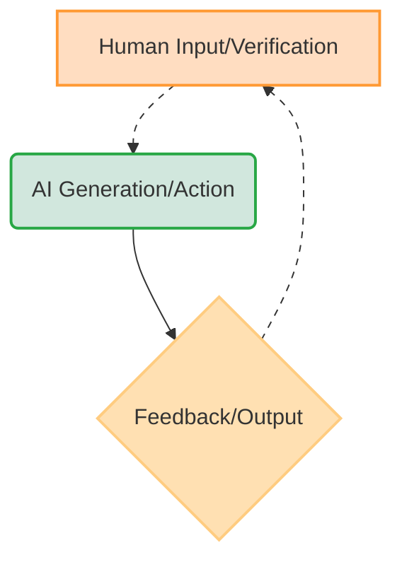
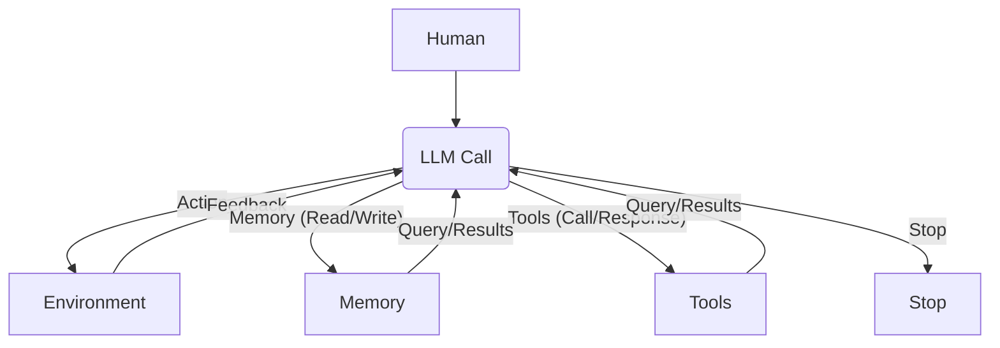
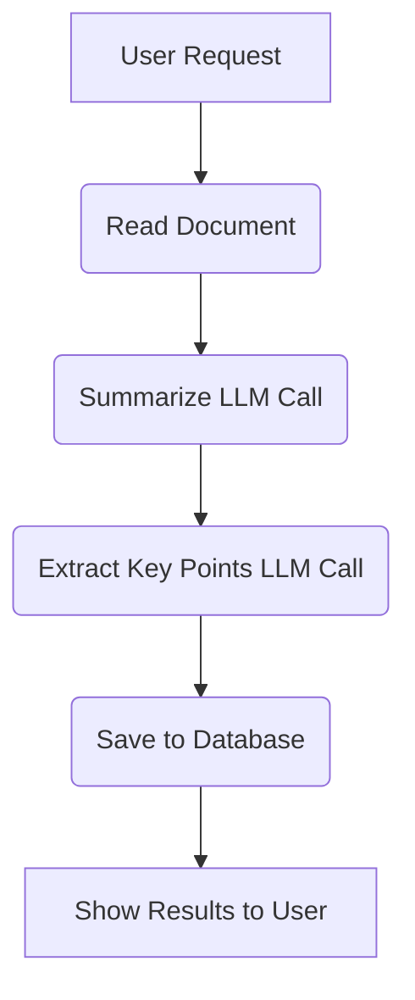
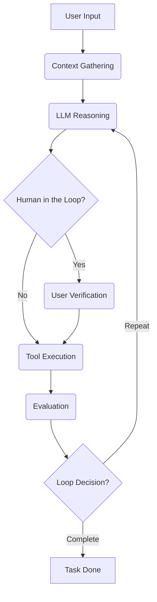
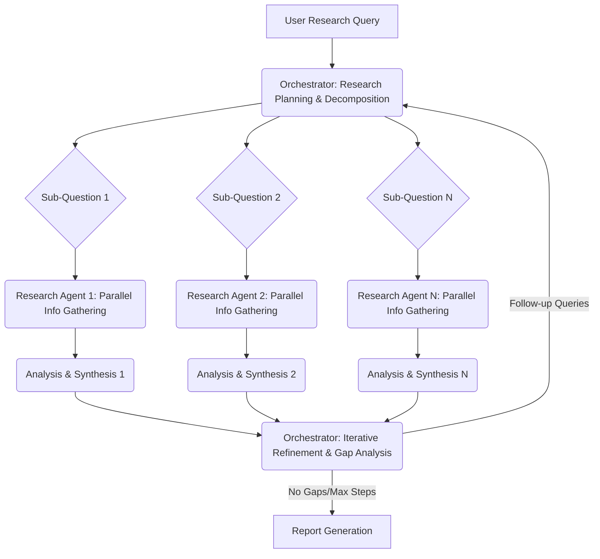

# AI Workflows vs. Agents: The Architectural Decision Every Engineer Faces
### Navigating the Spectrum of AI Autonomy to Build Production-Ready Systems

When you build AI applications, you face a critical architectural decision early in the development process. Will you create a predictable, step-by-step workflow where you control every action, or will you build an autonomous agent that can think and decide for itself? This choice impacts everything from development time and costs to reliability and user experience.

Choosing the wrong approach can lead to real headaches. An overly rigid system might break when users deviate from expected patterns, or developers try to add new features. Conversely, an unpredictable agent might work brilliantly 80% of the time but fail catastrophically when it matters most, leading to frustrated users and executives facing high operational costs. Billion-dollar AI startups in 2024-2025 succeed or fail based primarily on this architectural decision. Successful companies, teams, and AI engineers know when to use workflows versus agents, and more importantly, how to combine both approaches effectively.

By the end of this lesson, you will understand the fundamental differences between LLM workflows and AI agents. We will explore their properties, when to use each approach, and how hybrid systems blend their strengths. You will learn about common patterns like chaining, routing, and the orchestrator-worker model, as well as the core components of a ReAct agent. This knowledge is essential for architecting AI systems that are powerful, robust, efficient, and safe.

## Understanding the Spectrum: From Workflows to Agents

To make informed decisions about your AI architecture, you need a clear understanding of LLM workflows and AI agents. At this stage, we will focus on their core properties and how they are typically used.

### LLM Workflows

An LLM workflow is a sequence of tasks involving LLM calls or other operations, such as reading or writing data to a database or file system. Developer-written code largely orchestrates these tasks. The steps are defined in advance, resulting in deterministic or rule-based paths with predictable execution and explicit control flow. Think of a workflow as a factory assembly line, where each step is precisely engineered and follows a predefined order.

In future lessons, we will explore concepts such as chaining and routing, where multiple LLM calls are automated together. We will also look at orchestrator-worker patterns, which can dynamically plan and call multiple actions.

https://substackcdn.com/image/fetch/$s_!ZnV_!,f_auto,q_auto:good,fl_progressive:steep/https%3A%2F%2Fsubstack-post-media.s3.amazonaws.com%2Fpublic%2Fimages%2F4c59d9df-d60f-47bc-81de-cfd4fdebf5f8_1210x704.png
Image 1: A simple Retrieval-Augmented Generation (RAG) workflow.

### AI Agents

AI agents are systems where an LLM (or multiple LLMs) dynamically decides the sequence of steps, reasoning, and actions to achieve a goal. The steps are not defined in advance. Instead, they are dynamically planned based on the task and the current state of the environment. An agent is adaptive, capable of handling novelty, and driven by LLM autonomy in decision-making and execution path. Consider an agent as a skilled human expert tackling an unfamiliar problem, adapting in real time after each "Eureka!" moment.

Later in this course, we will explore agentic concepts like tools, memory, and ReAct agents.

https://substackcdn.com/image/fetch/$s_!gLNT!,f_auto,q_auto:good,fl_progressive:steep/https%3A%2F%2Fsubstack-post-media.s3.amazonaws.com%2Fpublic%2Fimages%2F67ffe267-55f2-4af7-9910-7410c7605550_1220x754.png
Image 2: The components of an LLM-powered agent (Image by author from [A Developer’s Guide to Building Scalable AI: Workflows vs Agents](https://towardsdatascience.com/a-developers-guide-to-building-scalable-ai-workflows-vs-agents/))

### The Role of Orchestration

Both workflows and agents require an orchestration layer, but their nature differs significantly. In workflows, the orchestration layer executes a predefined plan. For agents, it facilitates the LLM's dynamic planning and execution, acting as a guide rather than a strict controller.

## Choosing Your Path

We have defined LLM workflows and AI agents independently. Now, let's explore their core differences: developer-defined logic versus LLM-driven autonomy in reasoning and action selection.

https://substackcdn.com/image/fetch/$s_!yBni!,f_auto,q_auto:good,fl_progressive:steep/https%3A%2F%2Fsubstack-post-media.s3.amazonaws.com%2Fpublic%2Fimages%2F5e64d5e0-7ef1-4e7f-b441-3bf1fef4ff9a_1276x818.png
Image 3: Differences between workflows and agents (Source [Exploring the difference between agents and workflows](https://decodingml.substack.com/p/llmops-for-production-agentic-rag))

### When to Use LLM Workflows

LLM workflows are best for scenarios where the structure is well-defined. This includes pipelines for data extraction and transformation from sources like the web, messaging tools (Slack), video calls (Zoom), project management tools (Notion), and cloud storage (Google Drive). They are also useful for automated report or email generation from multiple data sources, understanding project requirements and updating tasks in Notion, or document summarization followed by translation. Repeatable daily tasks, such as sending emails, posting social media updates, and responding to messages, also benefit from workflows.

Their strengths include predictability and reliability for well-defined tasks, easier debugging of fixed paths, and potentially lower operational costs because you can use simpler, smaller models specialized in given sub-tasks. Since workflows are predictable, costs and latency are more consistent. Ultimately, using smaller models reduces infrastructure overhead. Workflows are usually preferred in enterprises or regulated fields that require predictable programs. For example, in finance, a financial advisor's report must contain accurate information every time, as it directly impacts people's money and lives. In the health space, AI tools need high accuracy because they directly affect people's lives. Workflows are also ideal for Minimum Viable Products (MVPs) that require rapid deployment by hardcoding features. They excel in scenarios where cost per request matters more than sophisticated reasoning, handling thousands of requests per minute.

However, workflows may require more development time, as each step is manually engineered. The user experience can be rigid, as it cannot handle unexpected scenarios. Adding new features can become complex as the application grows, similar to developing standard software tools.

### When to Use AI Agents

AI agents excel in open-ended research and synthesis, like researching World War II. They are also suitable for dynamic problem-solving, such as debugging code or handling complex customer support interactions. Interactive task completion in unfamiliar environments, like booking a flight without specifying the exact websites to use, is another area where agents shine.

Their strengths lie in adaptability to new situations and the flexibility to handle ambiguity and complexity, as steps are dynamically decided.

On the other hand, agents are more prone to errors. Since an agent is non-deterministic, performance, latency, and costs can vary with each call, making them unreliable. Agents usually require larger LLMs that can generalize better, which are more costly. This often leads to higher adoption costs for an agentic solution. They also often require more LLM calls to understand user intent and take various actions, further increasing costs. If not designed well, agents can pose huge security concerns, especially with write operations, potentially deleting data or sending inappropriate emails. Finally, debugging and evaluating AI agents is challenging. It is like the funny story on the current issues with agents where people had their code deleted by Replit Agent or Claude Code and made jokes about it, saying, "Anyway, I wanted to start a new project."

### Hybrid Approaches

Most real-world systems blend elements of both approaches. In reality, we have a spectrum, a gradient between LLM workflows and AI agents, where a system adopts what is best from both worlds depending on its use cases. When building an application, you usually have an "autonomy slider" where you decide how much control to give to the LLM versus the user. Moving towards more manual control means using an LLM workflow with a human verifying intermediate steps. Moving towards more automatic control means giving more power to the agent with fewer human-in-the-loop steps.

Tools like Cursor use this autonomy slider. For instance, in Cursor, `CMD+K` allows you to change a selected chunk of code, `CMD+L` changes the entire file, and `CMD+I` lets the AI autonomously change the entire repository. Similarly, Perplexity offers varying levels of autonomy with "search," "research," and "deep research" options.

The ultimate goal is to speed up the AI generation and human verification loop. This is often achieved through good workflow or agentic architecture and well-designed user interface (UI) and user experience (UX) platforms, like Cursor for coding [[5]](https://www.youtube.com/watch?v=kQxr-uOxw2o&t=1s).


Image 4: The AI generation and human verification loop.

## Exploring Common Patterns

To introduce you to the AI Engineering world, we will present the most common patterns used to build AI agents and LLM workflows. We explain them as if this is your first time hearing about them.

### LLM Workflows

LLM workflows involve several key patterns:

*   **Chaining and routing** automate multiple LLM calls together. As a first automation step, it helps glue together multiple LLM calls and decide between multiple appropriate options.

    ```mermaid
    graph TD
        A[Input] --> B{LLM Call Router}
        B --> C[LLM Call 1]
        B --> D[LLM Call 2]
        B --> E[LLM Call 3]
        C --> F[Output 1]
        D --> G[Output 2]
        E --> H[Output 3]
        F --> I[Out]
        G --> I
        H --> I
    ```
    Image 5: The chaining and routing pattern for LLM workflows.

*   **Orchestrator-worker** understands user intent, dynamically plans, calls multiple actions, and synthesizes them into a final answer. It allows the AI program to dynamically decide what actions to take based on the given task, making a smooth transition between the workflow and agentic world.

    ```mermaid
    graph TD
        A[User Request] --> B(Orchestrator LLM)
        B -- Decompose Task --> C{Worker LLM 1}
        B -- Decompose Task --> D{Worker LLM 2}
        B -- Decompose Task --> E{Worker LLM 3}
        C -- Sub-task Result --> F[Synthesizer LLM]
        D -- Sub-task Result --> F
        E -- Sub-task Result --> F
        F --> G[Final Answer]
    ```
    Image 6: The orchestrator-worker pattern.

*   **Evaluator-optimizer loop** auto-corrects the results from an LLM based on automated feedback. LLM outputs can drastically improve by providing feedback on what they did wrong. This pattern automates that process by having an "LLM reviewer" that analyzes the output from the LLM who generated the answer, creates an error report (also known as a reflection), and passes it back to the generator to auto-correct itself. An example is a human writer refining a document based on feedback.

    ```mermaid
    graph TD
        A[Initial Prompt] --> B(Generator LLM)
        B --> C[Generated Output]
        C --> D(Evaluator LLM)
        D -- Feedback/Critique --> B
        D -- "Meets Criteria?" --> E{Stop}
        E --> F[Final Output]
        B -- Re-evaluate --> D
    ```
    Image 7: The evaluator-optimizer loop pattern.

### Core Components of a ReAct AI Agent

The ReAct pattern is used to automatically decide what action to take, interpret the output of the action, and repeat until the given task is completed [[3]](https://substack.com/home/post/144675713). This is the core of a ReAct agent. It consists of several components:

*   An LLM that takes actions and interprets outputs from tools.
*   Tools that take actions within the external environment. We will cover more on tools in Lesson 6.
*   Short-term memory, which is the working memory of the agent, similar to how Random Access Memory (RAM) works for computers.
*   Long-term memory, used to access factual data about the external world (such as public websites or private company databases) and remember user preferences. We will cover more on memory in Lesson 9.

Almost all modern agents in the industry use the ReAct pattern because it has shown the most potential. We will explain it in detail in Lessons 7 and 8.


Image 8: The core components of an AI agent, illustrating the ReAct pattern.

The goal of this section is not for you to fully understand how these patterns work. It is to build an intuition on the various LLM workflows and AI agent patterns that you will learn during the course. In future lessons, we will dig into all the necessary details of each pattern.

## Zooming In on Our Favorite Examples

To better anchor you in the world of LLM workflows and AI agents, we introduce some concrete examples, from a simple workflow to a single agent system and a more advanced hybrid solution. We will explain everything as if speaking to a 7-year-old, without any fancy acronyms, since you are only familiar with what was explained previously in this lesson.

### Document Summarization and Analysis Workflow by Gemini in Google Workspace

When working in teams and searching for the right document, it can be a time-consuming process. Many documents are large, making it hard to understand which one contains the right information. A quick, embedded summarization can guide you and your search strategies.

Such a workflow is a pure and simple chain with multiple LLM calls. It reads a document, summarizes it using an LLM call, extracts key points with another LLM call, saves the results to a database, and shows the results to the user.


Image 9: Document summarization and analysis workflow by Gemini in Google Workspace.

### Gemini CLI Coding Assistant

Writing code is a time-consuming process. You have to read documentation or outdated blogs. When working on new code bases, understanding them is a slow process. To write high-quality code in a new programming language, you first need a bootcamp before writing any industry-level code. That is where a coding assistant can help you speed up writing code on existing and new code bases [[4]](https://github.com/google-gemini/gemini-cli/blob/main/README.md), [[6]](https://news.google.com/rss/articles/CBMiRGh0dHBzOi8vZ29vZ2xlZGV2ZWxvcGVyc2kuYmxvZy9nb29nbGUtYWlubm91bmNlcy1nZW1pbmktY2xpLXlvdXItb3Blbi1zb3VyY2UtYWktYWdlbnQv0gEA?oc=5).

The Gemini CLI tool uses the ReAct (Reason and Act) agent architecture to implement a single-agent system for coding [[4]](https://github.com/google-gemini/gemini-cli/blob/main/README.md). This is how Gemini CLI works:

1.  **Context Gathering**: The system loads the directory structure, available tools (actions), and the conversation history (state or working memory) into the state.
2.  **LLM Reasoning**: The Gemini model analyzes the user input against the current context to understand what actions it needs to take to adapt the code as requested by the user.
3.  **Human in the Loop**: Before taking any actions, it validates the execution plan with the user.
4.  **Tool Execution**: The selected actions (tools) are executed. Tools can include file operations to read the current state of the code, web requests for documentation, and generating code. The agent then processes the tool outputs, adding the results into the conversation context for future iterations.
5.  **Evaluation**: The agent dynamically evaluates whether the generated code is correct by running or compiling the code.
6.  **Loop Decision**: The agent determines if the task is completed or if it should repeat steps 2 to 5 by planning and executing more tools.


Image 10: The operational loop of the Gemini CLI coding assistant.

Gemini CLI is open-sourced on GitHub [[4]](https://github.com/google-gemini/gemini-cli/blob/main/README.md). Its use cases include writing code from scratch without requiring coding experience, assisting an engineer to write specific functions or classes faster, supporting documentation writing, and helping to quickly understand new code bases. The tool is implemented in TypeScript. Similar tools include Cursor, Windsurf, Claude Code, and Warp. Tools can involve file system access (e.g., `grep` functions, listing directory structures), coding (e.g., code interpreting, generating code diffs, executing generated code for dynamic validation), web search (e.g., documentation, blogs, solutions), and version control (e.g., Git to automatically commit code).

### Perplexity Deep Research

Researching a new topic can be daunting. You often do not know where to start or which blogs, papers, YouTube videos, or courses to prioritize. For more trivial questions, you may lack the time to dig into many resources. A research assistant that quickly scans the internet and synthesizes a report can significantly boost your learning process on scientific, financial, or social topics.

Perplexity's Deep Research agent is a hybrid system that combines ReAct reasoning with LLM workflow patterns to do autonomous, expert-level research. Unlike single-agent approaches, this system uses multiple specialized agents orchestrated in parallel by workflows, performing dozens of searches across hundreds of sources to synthesize comprehensive research reports within 2-4 minutes. This solution is closed-source, so our understanding is based on observations and speculation [[5]](https://www.youtube.com/watch?v=kQxr-uOxw2o&t=1s). Still, it is an example of how hybrid systems work.

Here is an oversimplified version of how Perplexity's Deep Research agent could work:

1.  **Research Planning & Decomposition**: An orchestrator analyzes the research question and decomposes it into a set of targeted sub-questions. The orchestrator uses the orchestrator-worker pattern to deploy multiple research agents with different sub-questions.
2.  **Parallel Information Gathering**: For each sub-question, specialized search agents run in parallel to optimize and speed up the search. These agents use tools like web searches and document retrieval to gather as much information as possible for that specific question. Because the research agents are isolated from each other, input tokens are smaller, helping the LLM stay focused.
3.  **Analysis & Synthesis**: After gathering bulk sources, each agent validates and scores each source using strategies such as domain credibility or relevance scoring relative to the query. Each source is ranked based on importance. The top K sources are summarized into a final report.
4.  **Iterative Refinement & Gap Analysis**: The orchestrator gathers information from all parallel agents and identifies knowledge gaps relative to the user's requested research. Based on any potential knowledge gaps, it generates follow-up queries by repeating steps 1 to 3 until all knowledge gaps are filled or a maximum number of steps is reached to avoid infinite loops.
5.  **Report Generation**: The orchestrator takes the results from all the AI agents and generates a final report with inline citations.


Image 11: The iterative multi-step process of Perplexity Deep Research.

The deep research agent operates as a hybrid between workflows and agents, combining structured planning with dynamic adaptation. The workflow uses the orchestrator-worker pattern to dynamically reason, supervise, and call in parallel multiple agents specialized in researching only a targeted sub-query until all the user-requested research topics are fulfilled.

## Conclusion: The Challenges of Every AI Engineer

Now that you understand the spectrum from LLM workflows to AI agents, it is important to recognize that every AI Engineer—whether working at a startup or a Fortune 500 company—faces these same fundamental challenges when designing a new AI application. These are core decisions that determine whether your AI application succeeds in production or fails spectacularly.

Here are some daily challenges every AI engineer battles:

*   **Reliability Issues**: Your agent works perfectly in demos but becomes unpredictable with real users. LLM reasoning failures can compound through multi-step processes, leading to unexpected and costly outcomes.
*   **Context Limits**: Systems struggle to maintain coherence across long conversations, gradually losing track of their purpose. Ensuring consistent output quality across different agent specializations presents a continuous challenge.
*   **Data Integration**: Building pipelines to pull information from Slack, web APIs, SQL databases, and data lakes while ensuring only high-quality data is passed to your AI system (the garbage-in, garbage-out principle).
*   **Cost-Performance Trap**: Sophisticated agents deliver impressive results but cost a fortune per user interaction, making them economically unfeasible for many applications.
*   **Security Concerns**: Autonomous agents with powerful write permissions could send incorrect emails, delete critical files, or expose sensitive data.

The good news is that these challenges are solvable. In upcoming lessons, we will cover patterns for building reliable products through specialized evaluation and monitoring pipelines, strategies for building hybrid systems, and ways to keep costs and latency under control.

By the end of this course, you will have the knowledge to architect AI systems that are not only powerful but also robust, efficient, and safe. You will know when to use workflows versus agents and how to build effective hybrid systems that work in the real world. In the next lesson, we will explore context engineering, the discipline of orchestrating an entire information ecosystem to ensure the LLM gets exactly what it needs when it needs it. Future lessons will delve into structured outputs, actions, memory, and Retrieval-Augmented Generation (RAG).

## References

1. Anthropic. (n.d.). Building effective agents. [https://www.anthropic.com/engineering/building-effective-agents](https://www.anthropic.com/engineering/building-effective-agents)
2. Iusztin, P. (n.d.). Exploring the difference between agents and workflows. Decoding AI Magazine. [https://decodingml.substack.com/p/llmops-for-production-agentic-rag](https://decodingml.substack.com/p/llmops-for-production-agentic-rag)
3. Iusztin, P. (n.d.). Real Agents vs. Workflows: The Truth Behind AI 'Agents'. YouTube. [https://www.youtube.com/watch?v=kQxr-uOxw2o&t=1s](https://www.youtube.com/watch?v=kQxr-uOxw2o&t=1s)
4. Google Gemini. (n.d.). Gemini CLI README.md. GitHub. [https://github.com/google-gemini/gemini-cli/blob/main/README.md](https://github.com/google-gemini/gemini-cli/blob/main/README.md)
5. Karpathy, A. (n.d.). Andrej Karpathy: Software in the Era of AI. YouTube. [https://www.youtube.com/watch?v=LqjP7w4g4iY](https://www.youtube.com/watch?v=LqjP7w4g4iY)
6. Google Developers. (n.d.). Google announces Gemini CLI, your open-source AI agent. [https://googledevelopers.blog/google-announces-gemini-cli-your-open-source-ai-agent/](https://googledevelopers.blog/google-announces-gemini-cli-your-open-source-ai-agent/)
7. Towards Data Science. (n.d.). A Developer’s Guide to Building Scalable AI: Workflows vs Agents. [https://towardsdatascience.com/a-developers-guide-to-building-scalable-ai-workflows-vs-agents/](https://towardsdatascience.com/a-developers-s-guide-to-building-scalable-ai-workflows-vs-agents/)