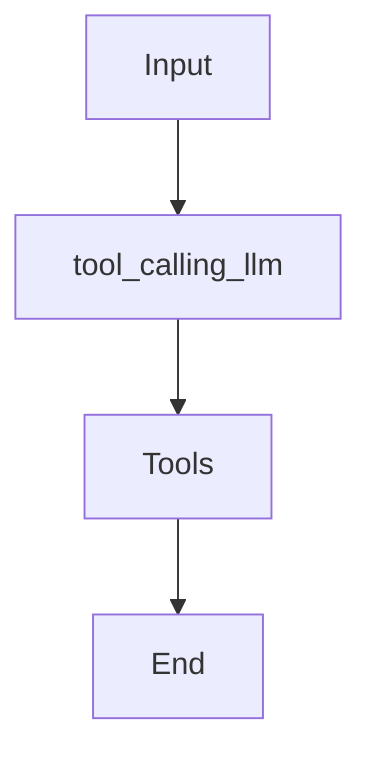
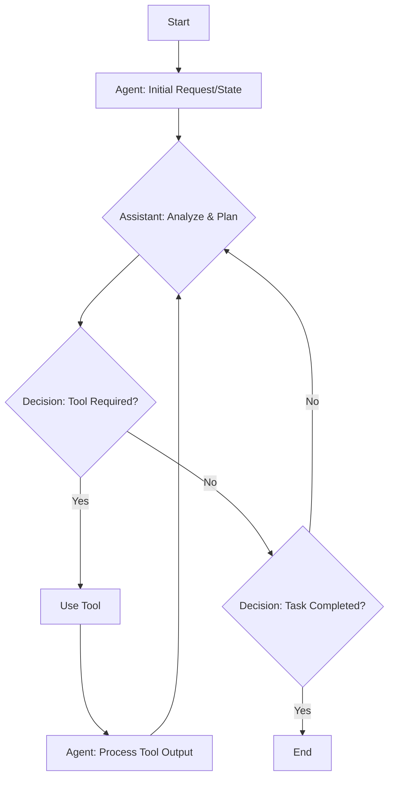
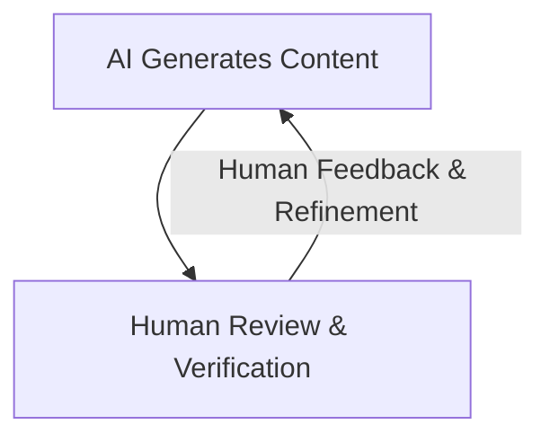
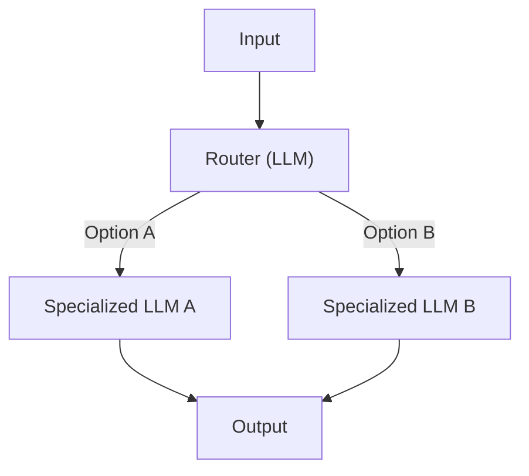
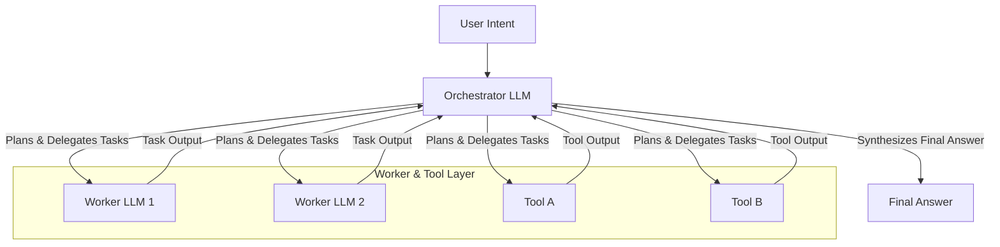
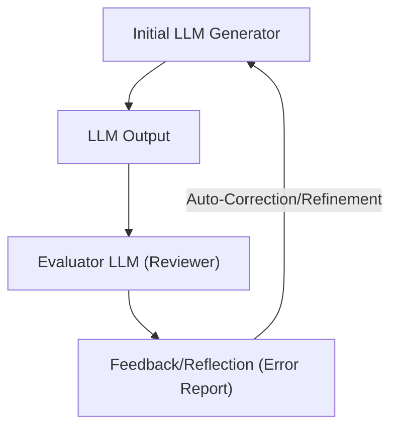
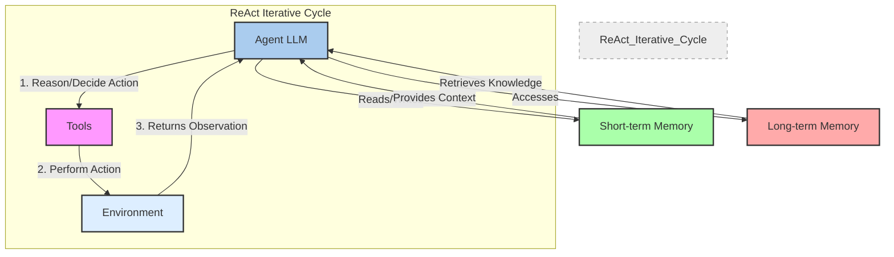
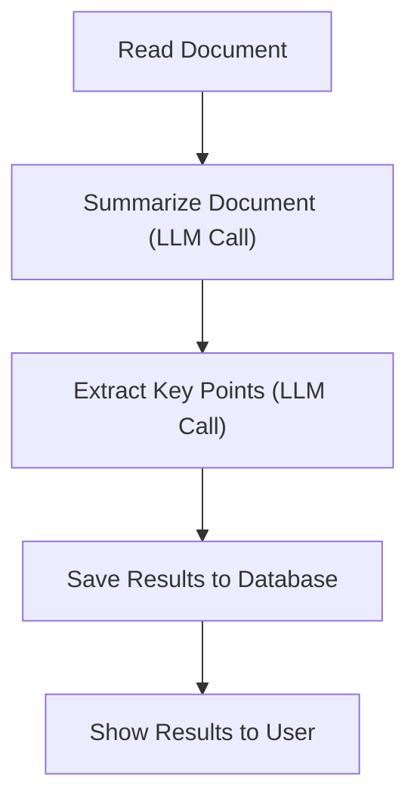
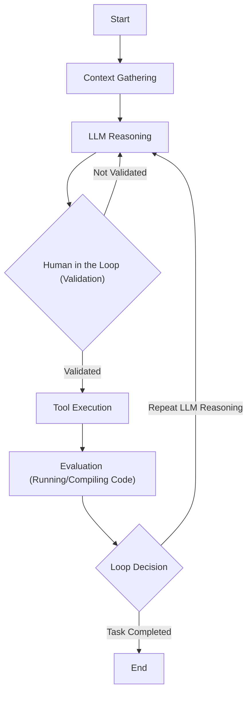
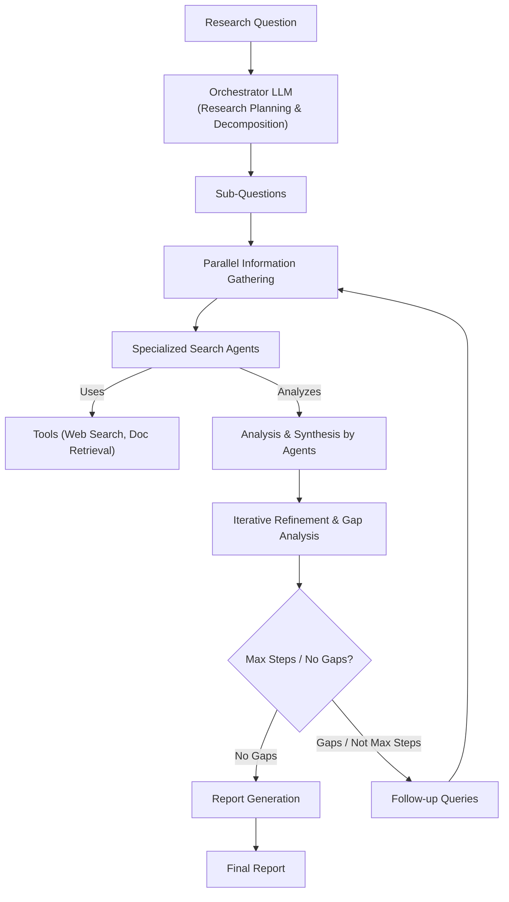

# AI Agents vs. LLM Workflows: The Critical Decision Every AI Engineer Faces
### A pragmatic guide to choosing the right architecture for your AI application.

When building AI applications, engineers face a critical architectural decision early in their development process. Should you create a predictable, step-by-step workflow where you control every action, or should you build an autonomous agent that can think and decide for itself? This is one of the key decisions that will impact everything from development time and costs to reliability and user experience.

Choose the wrong approach, and you might end up with an overly rigid system that breaks when users deviate from expected patterns. Or you could build an unpredictable agent that works brilliantly 80% of the time but fails catastrophically when it matters most. Either path can lead to months of wasted development time, frustrated users, and executives questioning the skyrocketing operational costs.

In the real world of 2024 and 2025, billion-dollar AI startups succeed or fail based primarily on this architectural decision. The successful companies, teams, and AI engineers know when to use workflows versus agents and, more importantly, how to combine both approaches effectively.

This lesson will provide a framework to help you make this critical decision with confidence. We will systematically explore the spectrum from rigid workflows to autonomous agents, helping you understand the trade-offs. By the end, you will have the knowledge to architect AI systems that are not only powerful but also robust, efficient, and safe.

## Understanding the Spectrum: From Workflows to Agents

Before we can choose between workflows and agents, we need a clear understanding of what they are. Rather than focusing on the technical specifics, let's look at their core properties and how they function in practice.

An LLM workflow is a sequence of tasks that involves LLM calls or other operations, such as reading from a database or writing to a file system. It is largely predefined and orchestrated by developer-written code. The steps are defined in advance, resulting in deterministic or rule-based paths with predictable execution and explicit control flow. Think of it like a factory assembly line, where each station performs a specific, repeatable task in a set order.


Image 1: A simple LLM workflow illustrating a sequence of predefined tasks, where an input leads to a tool-calling LLM, which interacts with tools before the workflow ends.

On the other end of the spectrum, we have AI agents. These are systems where an LLM plays a central role in dynamically deciding the sequence of steps, reasoning, and actions to achieve a goal. The steps are not defined in advance but are planned based on the task and the current state of the environment. This makes them adaptive and capable of handling novelty. You can think of an agent as a skilled human expert tackling an unfamiliar problem, adapting their approach with each new piece of information.


Image 2: A simple agentic system illustrating dynamic decision-making and tool usage with an assistant orchestrating the loop.

Both workflows and agents require an orchestration layer, but its role differs significantly. In a workflow, the orchestrator executes a predefined plan, like a conductor following a musical score. In an agentic system, the orchestrator facilitates the LLM's dynamic planning and execution, acting more like a jazz ensemble leader who guides improvisation. We will explore advanced workflow patterns like chaining, routing, and the orchestrator-worker model in future lessons, as well as the core components of agents like tools, memory, and the ReAct framework.

## Choosing Your Path

In the previous section, we defined LLM workflows and AI agents. Now, we will explore their core difference: developer-defined logic versus LLM-driven autonomy in reasoning and action selection. Most real-world systems are not purely one or the other; they exist on a spectrum. The key is to find the right balance for your specific use case.

```mermaid
graph LR
    subgraph "LLM Workflows vs. AI Agents Spectrum"
        W["LLM Workflows"]
        S[/"Spectrum"/]
        A["Autonomous AI Agents"]

        W -- "High Application Reliability" --> S
        W -- "Low Agent's Level of control" -- S
        S -- "Lower Application Reliability" --> A
        S -- "Higher Agent's Level of control" --> A
    end
```
Image 3: A spectrum illustrating the trade-off between application reliability and agent control in LLM workflows versus autonomous AI agents.

Workflows are best for tasks where the structure is well-defined. Examples include pipelines for data extraction, automated report generation, and content repurposing. Their main strength is predictability. Because the paths are fixed, they are reliable, easier to debug, and have more predictable costs and latency. This makes them ideal for enterprise environments or regulated fields like finance and healthcare, where consistent, auditable results are non-negotiable. However, this rigidity means they cannot handle unexpected scenarios, and adding new features can become complex over time.

Agents, on the other hand, excel at open-ended research, dynamic problem-solving like debugging code, and interactive tasks in unfamiliar environments. Their strength lies in their adaptability and flexibility. The downside is that this autonomy makes them less predictable and more prone to errors. Performance, latency, and costs can vary with each run. Since agents often require larger, more powerful LLMs to reason effectively, they are typically more expensive. They also introduce security concerns, especially with write permissions, and are notoriously difficult to debug and evaluate. There are plenty of jokes in the developer community about AI agents deleting entire codebases.

Most real-world systems blend elements of both. Think of it as an "autonomy slider" where you decide how much control to give the LLM versus the user. Andrej Karpathy highlighted this concept in his talks on the new era of software [[1]](https://www.youtube.com/watch?v=y5mdI_aBC4Y). For example, a code editor like Cursor offers different levels of autonomy: simple tab completion (low autonomy), refactoring a selected block of code with `Cmd+K` (medium autonomy), or letting the AI modify the entire repository with `Cmd+I` (high autonomy). Similarly, Perplexity offers a quick search (workflow-like), a more detailed "research" mode, and a "deep research" function that acts as a highly autonomous agent.

The ultimate goal is to accelerate the loop between AI generation and human verification. This is often achieved through a well-designed architecture that combines the reliability of workflows with the flexibility of agents, supported by an intuitive user interface.


Image 4: A flowchart illustrating the cyclical AI generation and human verification loop.

## Exploring Common Patterns

To build an intuition for AI engineering, let's look at the most common patterns used to build workflows and agents. We will cover these in detail in future lessons, but for now, the goal is to understand them at a high level.

### LLM Workflow Patterns

For workflows, we often use patterns that orchestrate multiple LLM calls to build more complex applications.

- **Chaining and Routing:** This is a fundamental pattern where the output of one LLM call becomes the input for the next. A router, which can be another LLM call, directs the workflow to different specialized models or prompts based on the input. This helps break down complex tasks into manageable steps.


Image 5: An LLM workflow using chaining and routing.

- **Orchestrator-Worker:** In this pattern, a central "orchestrator" LLM analyzes the user's intent, breaks the task into sub-tasks, and delegates them to specialized "worker" LLMs or tools. It then synthesizes the results into a final answer. This allows the system to dynamically decide which actions to take, creating a smooth transition from rigid workflows to more agentic behavior [[2]](https://www.anthropic.com/engineering/building-effective-agents).


Image 6: An Orchestrator-Worker pattern for LLM workflows.

- **Evaluator-Optimizer Loop:** This pattern uses one LLM to generate a response and another to act as a "reviewer." The reviewer evaluates the output, creates an error report (often called a reflection), and feeds it back to the generator LLM to auto-correct itself. It mimics the iterative process a human writer uses to refine a document based on feedback.


Image 7: An Evaluator-Optimizer loop for LLM outputs, showing an iterative refinement process.

### Core Components of a ReAct AI Agent

Nearly all modern agents use a pattern called ReAct, which stands for Reason and Act. This framework enables an agent to automatically decide what action to take, interpret the output of that action, and repeat the cycle until the task is complete.

The core components of a ReAct agent include:
- **LLM:** The brain of the agent, responsible for reasoning, planning, and interpreting tool outputs.
- **Tools:** Functions that allow the agent to interact with the external world, such as performing a web search or writing to a file.
- **Short-term memory:** The agent's working memory, similar to a computer's RAM, which holds the context of the current conversation or task.
- **Long-term memory:** A persistent store for factual knowledge and user preferences, allowing the agent to recall information across sessions.


Image 8: A ReAct AI agent diagram illustrating the core components and the iterative 'Act, Observe, Reason' cycle.

We will dive deep into the ReAct pattern in future lessons, but for now, understanding these basic components is enough to build a solid foundation.

## Zooming In on Our Favorite Examples

To anchor these concepts in the real world, let's look at three examples that span the spectrum from a simple workflow to a complex hybrid system. We will keep these explanations high-level, focusing on the intuition behind each architecture.

### Document Summarization in Google Workspace (Workflow)

**The Problem:** Finding the right information in a shared drive can be a time-consuming process, especially when documents are long and numerous. A quick, embedded summary can guide your search and save valuable time.

This is a perfect use case for a pure, multi-step workflow. The process is linear and predictable, involving a chain of LLM calls.


Image 9: Document summarization and analysis workflow by Gemini in Google Workspace

Here is how it works:
1. The system reads the content of a document.
2. An LLM call generates a concise summary.
3. Another LLM call extracts key points or action items.
4. The results are saved to a database for caching and future reference.
5. The summary and key points are displayed to the user.

This workflow is simple, reliable, and cost-effective, making it ideal for a high-frequency, low-complexity task.

### Gemini CLI Coding Assistant (Agent)

**The Problem:** Writing code is a slow process that often involves reading dense documentation or sifting through outdated blog posts. A coding assistant can dramatically speed up development, especially when working with new codebases or unfamiliar languages.

The open-source Gemini CLI is a great example of a single-agent system that uses the ReAct architecture [[3]](https://github.com/google-gemini/gemini-cli/blob/main/README.md). It helps developers write, debug, and understand code by interacting with their local file system and the web.

Here is a high-level overview of its operational loop:
1. **Context Gathering:** The agent loads the directory structure, available tools, and conversation history into its working memory.
2. **LLM Reasoning:** The Gemini model analyzes the user's request and the current context to form a plan of action.
3. **Human in the Loop:** Before executing, the agent often presents its plan to the user for validation.
4. **Tool Execution:** It executes tools, which can include file operations (reading or writing code), running a web search for documentation, or using version control like `git`.
5. **Evaluation:** The agent evaluates the outcome, for instance, by attempting to compile or run the generated code to check for errors.
6. **Loop Decision:** Based on the evaluation, the agent decides whether the task is complete or if it needs to return to the reasoning step to refine its plan.


Image 10: Operational loop of the Gemini CLI coding assistant leveraging the ReAct agent architecture.

This agentic approach provides the flexibility needed to handle the dynamic and complex nature of software development.

### Perplexity's Deep Research (Hybrid System)

**The Problem:** Researching a new topic can be daunting. It is hard to know where to start, which sources are reliable, and how to synthesize information from dozens of articles or papers. A research assistant can provide a massive boost by quickly scanning the internet and compiling a comprehensive report.

Perplexity's Deep Research feature is a powerful hybrid system that combines structured workflows with autonomous agents. It uses multiple specialized agents, orchestrated by a workflow, to perform dozens of searches across hundreds of sources and synthesize a detailed report in minutes. While Perplexity is closed-source, we can infer its likely architecture based on its behavior.

Here is an oversimplified look at how it might work:
1. **Research Planning & Decomposition:** An orchestrator LLM analyzes the research question and breaks it down into targeted sub-questions, leveraging the orchestrator-worker pattern.
2. **Parallel Information Gathering:** Specialized search agents work in parallel on each sub-question, using tools like web search and document retrieval to gather information.
3. **Analysis & Synthesis:** Each agent validates its sources, scores them for relevance and credibility, and summarizes the findings for its sub-question.
4. **Iterative Refinement & Gap Analysis:** The orchestrator gathers the results from all agents and identifies any knowledge gaps. If gaps exist, it generates follow-up queries and repeats the process until the research is complete or a step limit is reached.
5. **Report Generation:** Finally, the orchestrator synthesizes all the information into a single, cohesive report with inline citations.


Image 11: An iterative multi-step process that could power Perplexity's Deep Research agent.

This hybrid approach combines the structured planning of a workflow with the dynamic, adaptive reasoning of multiple agents, allowing it to tackle complex, open-ended research tasks that would be impossible for a single agent or a rigid workflow alone.

## Conclusion: The Challenges of Every AI Engineer

Now that you understand the spectrum from LLM workflows to AI agents, it is important to recognize that every AI engineer faces these same fundamental challenges when designing a new application. This architectural choice is one of the core decisions that determine whether your AI application succeeds in production or fails spectacularly.

As an AI engineer, you will constantly battle a set of common issues:
- **Reliability Issues:** Your agent works perfectly in demos but becomes unpredictable with real users, as LLM reasoning failures can compound through multi-step processes.
- **Context Limits:** Systems struggle to maintain coherence across long conversations, gradually losing track of their purpose.
- **Data Integration:** Building robust pipelines to pull information from various sources while ensuring only high-quality data is passed to your AI system is a constant challenge.
- **Cost-Performance Trap:** Sophisticated agents can deliver impressive results but often cost a fortune per interaction, making them economically unfeasible.
- **Security Concerns:** Autonomous agents with write permissions could send incorrect emails, delete critical files, or expose sensitive data.

The good news is that these challenges are solvable. In upcoming lessons, we will cover patterns for building reliable products through specialized evaluation and monitoring pipelines. We will explore strategies for building hybrid systems and introduce techniques for keeping costs and latency under control.

Your path forward as an AI engineer is about mastering these realities. By the end of this course, you will have the knowledge to architect AI systems that are not only powerful but also robust, efficient, and safe. You will know when to use workflows, when to deploy an agent, and how to build effective hybrid systems that work in the messy, unpredictable real world.

## References

1. Karpathy, A. (2024, May 24). Software in the Era of AI. *YouTube*. https://www.youtube.com/watch?v=y5mdI_aBC4Y
2. Anthropic. (2024, June 26). Building effective agents. *Anthropic*. https://www.anthropic.com/engineering/building-effective-agents
3. Google. (n.d.). Gemini CLI. *GitHub*. https://github.com/google-gemini/gemini-cli/blob/main/README.md