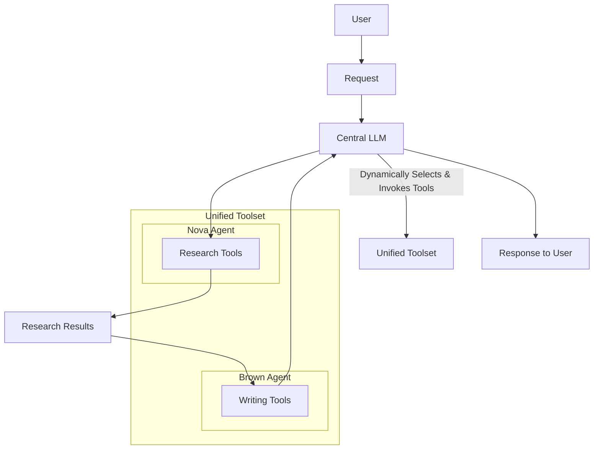
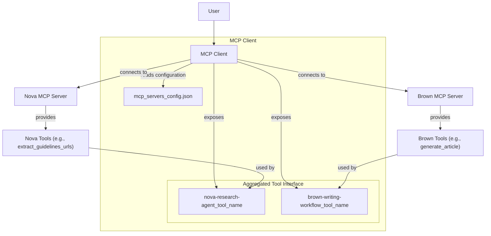
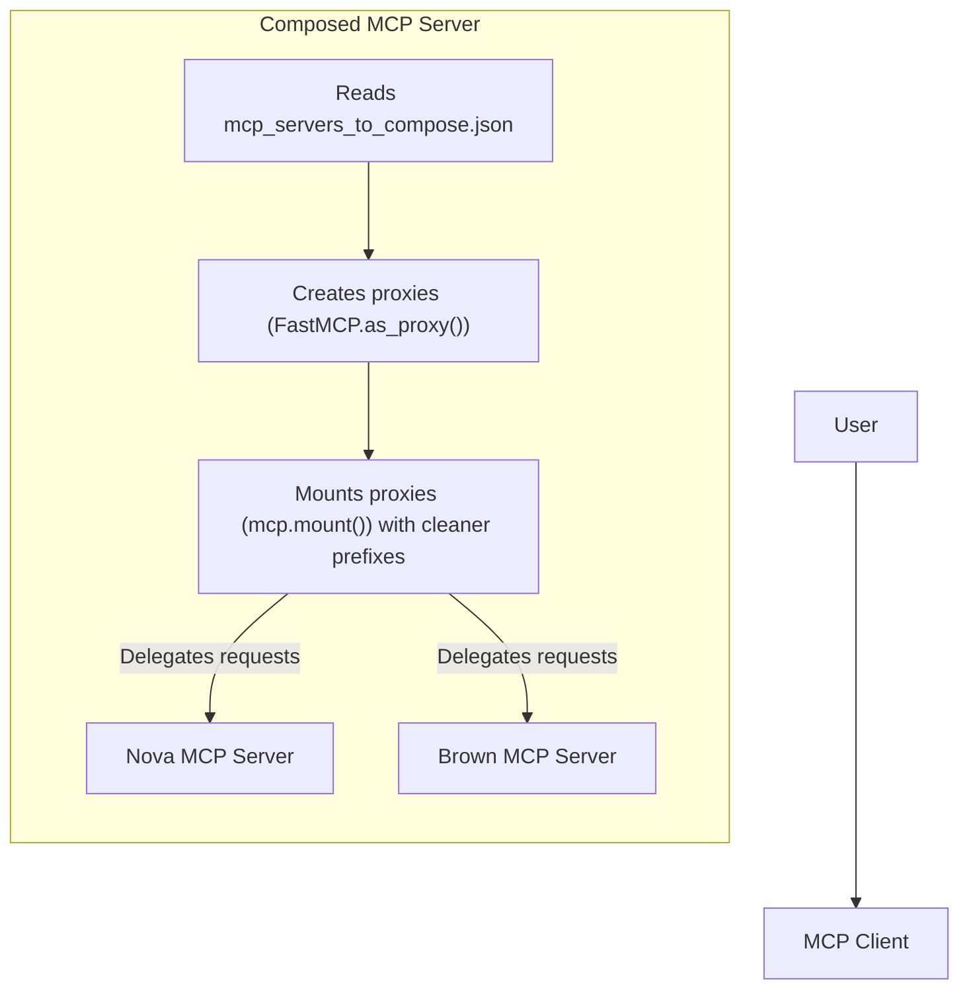

Throughout this course, we have built two specialized agents: Nova for research and Brown for writing. We have run them separately, but they were always designed to work in sequence. Nova gathers the information, and Brown uses that information to write an article. Now it is time to integrate them into a unified system.

In this lesson, we will explore how to orchestrate both agents so a single LLM can use their tools together. The beauty of the Model Context Protocol (MCP) is that it makes this integration straightforward. We will explore two approaches: a multi-server MCP client that connects to multiple independent servers and a composed MCP server that unifies multiple agents into a single endpoint. Both achieve the same goal but differ in their deployment patterns. By the end, you will understand when to use each one.

## Section 1 — Introduction: From Separate Agents to Unified System

Throughout this course, we have built two specialized agents: Nova for research and Brown for writing. We have run them separately, but they were always designed to work in sequence. Nova gathers the information, and Brown uses that information to write an article. Now it is time to integrate them into a unified system so a single LLM can orchestrate both.

The beauty of the Model Context Protocol (MCP) is that it makes this integration straightforward. Because both agents are already MCP servers, we do not need to write custom APIs or adapters. We will explore two approaches: a multi-server MCP client that connects to multiple independent servers and a composed MCP server that unifies multiple agents into a single endpoint. Both achieve the same goal but differ in their deployment patterns.

## Section 2 — Understanding Multi-Agent Orchestration: The MCP Approach

Before we dive into the implementation, let's understand the orchestration model we are using. We are implementing a **Central LLM Orchestration** pattern. In this approach, a single, central LLM, like the one in your IDE, has access to tools from multiple specialized agents. When you give it a task, the LLM dynamically decides which agent's tools to use, maintaining a single conversation context and orchestrating the workflow by selecting the right tools as needed [[1]](https://developer.microsoft.com/blog/designing-multi-agent-intelligence), [[2]](https://xue-guang.com/post/llm-marl/).



Image 1: A flowchart illustrating the Central LLM Orchestration pattern for multi-agent systems.

This pattern is different from others. A **Supervisor Agent** would have one agent explicitly delegate sub-tasks to worker agents [[3]](https://www.fiddler.ai/articles/multi-agent-llm-systems-for-enterprises). A **Sequential Pipeline** would force agents to always execute in a fixed order. In a **Peer-to-Peer** or **Network Architecture**, agents communicate dynamically without a central controller, offering flexibility but increasing coordination complexity [[3]](https://www.fiddler.ai/articles/multi-agent-llm-systems-for-enterprises). Our central LLM orchestration is simpler: the LLM acts as an intelligent tool selector rather than an explicit coordinator [[4]](https://openai.github.io/openai-agents-python/multi_agent/).

This pattern works well with MCP. Both Nova and Brown expose their capabilities as MCP tools with clear descriptions, allowing the central LLM to discover all available tools through a single, standardized protocol [[5]](https://modelcontextprotocol.io/docs/learn/architecture). This unified interface eliminates the need for custom integration code. Because both agents speak MCP, we do not need to write adapters or APIs. The client simply connects to both servers and aggregates their tools.

The LLM's natural reasoning handles the orchestration. It intuitively understands that it should use Nova's research tools first and then use Brown's writing tools with that research as input. There is no need to explicitly program this workflow.

## Section 3 — The Rationale: Why Choose Central LLM Orchestration?

This orchestration pattern offers several advantages that make it ideal for integrating Nova and Brown. The most immediate benefit is **simplicity and maintainability**. All decision-making happens in one place: the central LLM. This means the workflow is transparent and easy to understand. There is no need for complex state management or inter-agent communication protocols, which reduces the cognitive overhead of debugging the system [[6]](https://galileo.ai/blog/architectures-for-multi-agent-systems).

The pattern also enables **natural task decomposition**. The central LLM can break down complex requests on the fly without requiring predefined workflows. More importantly, it can adapt its strategy based on intermediate results. For example, if research reveals unexpected information, the LLM can adjust its writing approach accordingly. This adaptive behavior is valuable for human-in-the-loop workflows common in IDE environments. You can provide feedback at any point, and the LLM incorporates it naturally [[7]](https://arxiv.org/abs/2505.19591).

The central LLM maintains a **single, unified context window**, which means it can reference information from Nova's research when calling Brown's tools without requiring explicit data passing between agents [[8]](https://cdn.openai.com/business-guides-and-resources/a-practical-guide-to-building-agents.pdf). This avoids the "siloed knowledge" problem, where critical information gets trapped in one agent's context and becomes unavailable to others.

Finally, this pattern is perfect for **sequential, interdependent tasks**. Our workflow of research followed by writing is inherently sequential, and the writing task depends heavily on research results. A central orchestrator can easily manage these dependencies because it sees the entire workflow and can make informed decisions about when to transition between phases [[9]](https://www.ibm.com/think/tutorials/llm-agent-orchestration-with-langchain-and-granite), [[10]](https://learn.microsoft.com/en-us/azure/architecture/ai-ml/guide/ai-agent-design-patterns).

## Section 4 — The Trade-offs: Understanding the Limitations

While central LLM orchestration is powerful, it is important to understand its limitations. The first is **tool overload**. As the number of available tools grows, LLMs begin to struggle with reliable tool selection. They may choose suboptimal tools or miss relevant ones entirely. Research shows that performance can degrade significantly when models must choose from a large, diverse set of tools [[11]](https://gorilla.cs.berkeley.edu/leaderboard.html), [[12]](https://blog.quotientai.co/evaluating-tool-calling-capabilities-in-large-language-models-a-literature-review/). Our system, with 14 tools total (11 from Nova and 3 from Brown), is comfortably within the typical limit of 15-20 tools.

Another limitation is the pattern's **sequential execution model**. The LLM executes tools one at a time. If you needed to research 50 companies simultaneously, this approach would be inefficient. In such scenarios, a Supervisor-Worker pattern with parallel execution would be better [[13]](https://www.anthropic.com/engineering/multi-agent-research-system).

The pattern also struggles with **complex inter-agent dependencies**. If agents need to negotiate with each other, engage in debate, or iteratively refine each other's work through back-and-forth exchanges, direct agent-to-agent communication would be more natural. Our pattern handles simple, linear dependencies well, but complex multi-way interactions would become awkward [[2]](https://xue-guang.com/post/llm-marl/).

Despite these limitations, central LLM orchestration is the right default choice for most agent integration scenarios. It is simple, maintainable, and uses the LLM's natural reasoning without adding unnecessary complexity. You should only consider more elaborate patterns when you hit clear scaling limits or have fundamentally different requirements.

## Section 5 — Approach 1: Multi-Server MCP Client

The first approach is to create an MCP client that connects to multiple MCP servers simultaneously. FastMCP's `Client` class supports this out of the box by accepting a configuration object that specifies multiple servers.



Image 2: Architecture diagram depicting the Multi-Server MCP Client approach, showing tool aggregation.

### Multi-Server Configuration File

Let's look at the configuration file that defines both Nova and Brown servers.

```json
{
  "mcpServers": {
    "nova-research-agent": {
      "transport": "stdio",
      "command": "uv",
      "args": [
        "--directory",
        "/absolute/path/to/research_agent_part_2/mcp_server",
        "run",
        "-m",
        "src.server",
        "--transport",
        "stdio"
      ]
    },
    "brown-writing-workflow": {
      "transport": "stdio",
      "command": "uv",
      "args": [
        "--directory",
        "/absolute/path/to/writing_workflow",
        "run",
        "python",
        "-m",
        "brown.mcp.server"
      ]
    }
  }
}
```

This configuration tells the MCP client how to launch both servers. Each server has a unique name, uses the `stdio` transport to communicate via standard input and output, and specifies the command and arguments to start.

### Creating the Multi-Server Client

Now let's see how the client code loads this configuration and connects to both servers.

```python
import json
from pathlib import Path
from fastmcp import Client

# Load configuration from JSON file
config_path = Path("mcp_servers_config.json")
with open(config_path) as f:
    config = json.load(f)

server_names = list(config["mcpServers"].keys())
logging.info(f"Found {len(server_names)} MCP servers in configuration: {', '.join(server_names)}")

# Create a single client with multi-server configuration
client = Client(config)

# Connect and fetch capabilities from all servers
async with client:
    tools = await client.list_tools()
    resources = await client.list_resources()
    prompts = await client.list_prompts()
    
    logging.info(
        f"Total capabilities: {len(tools)} tools, {len(resources)} resources, {len(prompts)} prompts"
    )
```

The key insight here is that `Client(config)` accepts a multi-server configuration. When you call methods like `list_tools()`, the client automatically aggregates capabilities from all connected servers.

### How Capabilities Are Named

When you have multiple servers, you need a way to distinguish which tool belongs to which server. FastMCP handles this by prefixing tool names with the server name from the configuration file. For example, Nova's `extract_guidelines_urls` tool becomes `nova-research-agent_extract_guidelines_urls`, and Brown's `generate_article` tool becomes `brown-writing-workflow_generate_article`. This is a direct consequence of how MCP handles capability discovery in a multi-server environment: each server's capabilities are scoped to their connection, and the client is responsible for aggregation [[14]](https://modelcontextprotocol.io/specification/2025-11-25), [[5]](https://modelcontextprotocol.io/docs/learn/architecture).

The client code can then group these capabilities by extracting the prefixes, making it easy to see which tools come from which server.

```python
def handle_command(processed_input, tools, resources, prompts, server_names):
    # Extract server prefixes from tool names
    server_prefixes = set()
    for tool in tools:
        if "_" in tool.name:
            prefix = tool.name.split("_")[0]
            server_prefixes.add(prefix)
    
    # Group tools by prefix
    if processed_input.input_type == InputType.COMMAND_INFO_TOOLS:
        for prefix in sorted(server_prefixes):
            prefix_tools = [t for t in tools if t.name.startswith(f"{prefix}_")]
            if prefix_tools:
                print_header(f"{prefix} - Tools ({len(prefix_tools)})")
                for i, tool in enumerate(prefix_tools, 1):
                    print_item(tool.name, tool.description, i)
```

### Running from the Terminal

When you run the multi-server client from your terminal, you will see it connect to both servers and aggregate their tools.

```bash
$ cd agents_integration/mcp_client
$ uv run -m src.client
```

It outputs:

```terminal
INFO:root:Loading MCP server configuration from: mcp_servers_config.json
INFO:root:Found 2 MCP servers in configuration: nova-research-agent, brown-writing-workflow
INFO:root:Connecting to MCP servers...
INFO:root:Fetching capabilities from all servers...
INFO:root:Total capabilities: 14 tools, 4 resources, 4 prompts

============================================================
Brown Writing Workflow
============================================================

  - 3 tools available
  - 2 resources available
  - 3 prompts available

============================================================
Nova Research Agent
============================================================

  - 11 tools available
  - 2 resources available
  - 1 prompts available

Available Commands: /tools, /resources, /prompts, /quit
```

### Running the Multi-Server Client in the Notebook

Let's run the multi-server client directly from this notebook. The client will connect to both Nova and Brown servers and display their aggregated capabilities.

```python
import sys

from agents_integration.mcp_client.src.client import main as client_main


async def run_client():
    _argv_backup = sys.argv[:]
    sys.argv = ["client", "--config", "mcp_servers_config.json"]
    try:
        await client_main()
    finally:
        sys.argv = _argv_backup


# Start client with in-memory server
await run_client()
```

After running this cell, you will see both servers start up and an interactive prompt where you can type commands like `/tools` to see all 14 tools from both servers, prefixed with their respective server names.

## Section 6 — Approach 2: Composed MCP Server

The second approach is to create a new MCP server that composes the Nova and Brown servers together. Instead of the client connecting to multiple servers, you create a single composed server that internally proxies requests to the underlying servers. This approach is useful when you want to package multiple agents as a single deployable unit, simplify the client-side configuration, or add a layer of coordination logic between agents.



Image 3: Architecture diagram illustrating the Composed MCP Server approach, showing user interaction, client connection, and internal server processes including configuration reading, proxy creation, mounting, and delegation to underlying Nova and Brown MCP Servers.

### Server Composition Configuration

First, we define which servers to compose in a configuration file, `mcp_servers_to_compose.json`. This file is identical in structure to the one used by the multi-server client, but its purpose is different: it tells the composed server which underlying servers to connect to and mount.

### Creating the Composed Server

Now let's see how to create a composed server using FastMCP's composition features.

```python
import json
import logging
from pathlib import Path
from fastmcp import Client, FastMCP

def load_server_config() -> dict:
    """Load the MCP servers configuration from JSON file."""
    config_path = Path(__file__).parent.parent / "mcp_servers_to_compose.json"
    with open(config_path) as f:
        return json.load(f)

def create_composed_server() -> FastMCP:
    """Create a composed MCP server by mounting Nova and Brown servers."""
    # Create the main composed server
    mcp = FastMCP(
        name="Nova+Brown Composed Server",
        version="0.1.0",
    )
    
    # Load configuration
    config = load_server_config()
    servers_config = config.get("mcpServers", {})
    
    # Create proxies and mount each server
    for server_name, server_config in servers_config.items():
        # Wrap the server config in the structure expected by Client
        client_config = {"mcpServers": {server_name: server_config}}
        
        # Create a client for this server
        client = Client(client_config)
        
        # Create a proxy from the client
        proxy = FastMCP.as_proxy(client)
        
        # Extract prefix: nova-research-agent -> nova
        prefix = server_name.split("-")[0]
        
        # Mount the proxy with the prefix
        mcp.mount(proxy, prefix=prefix)
    
    return mcp

if __name__ == "__main__":
    composed_server = create_composed_server()
    composed_server.run()
```

Let's break down the key steps. We first create a `FastMCP` instance for our composed server. Then, for each server defined in our configuration, we create a `Client` that connects to it, use `FastMCP.as_proxy(client)` to create a proxy object, and finally use `mcp.mount(proxy, prefix=prefix)` to mount it. The `mount()` method is what enables composition; it takes all capabilities from the proxy and adds them to the composed server with a specified prefix [[15]](https://gofastmcp.com/servers/composition), [[16]](https://gofastmcp.com/python-sdk/fastmcp-server-server).

### How Mounting Works

Mounting creates a live, dynamic link between the parent server and the subserver. Instead of copying components, requests for prefixed tools are delegated to the mounted server at runtime. This means any changes to the subserver are immediately reflected in the parent. For our local `stdio` servers, the performance overhead of this delegation is negligible. However, for remote servers connected over HTTP, this can introduce latency [[15]](https://gofastmcp.com/servers/composition).

### Running the Client from the Terminal

To use the composed server, the client configuration is much simpler, pointing to a single endpoint. When you run the client with this new configuration, it connects to the single composed server.

```bash
$ cd agents_integration/mcp_client
$ uv run -m src.client --config mcp_composed_server_config.json
```

It outputs:

```terminal
INFO:root:Loading MCP server configuration from: mcp_composed_server_config.json
INFO:root:Found 1 MCP servers in configuration: nova-brown-composed
INFO:root:Connecting to MCP servers...
INFO:__main__:Starting composed MCP server...
...
INFO:__main__:Composed server created successfully!
INFO:__main__:Running composed server...
INFO:root:Fetching capabilities from all servers...
INFO:root:Total capabilities: 14 tools, 4 resources, 4 prompts
...
```

### Running the Composed Server Client in the Notebook

Now let's run the client with the composed server configuration from the notebook.

```python
import sys

from agents_integration.mcp_client.src.client import main as client_main


async def run_client():
    _argv_backup = sys.argv[:]
    sys.argv = ["client", "--config", "mcp_composed_server_config.json"]
    try:
        await client_main()
    finally:
        sys.argv = _argv_backup


# Start client with in-memory server
await run_client()
```

From the client's perspective, it connects to a single server, `nova-brown-composed`, but that server internally proxies to both Nova and Brown. Notice the cleaner tool prefixes like `nova_` and `brown_`, which we specified in the `mount()` call. This approach hides the complexity of the multi-agent system from the client.

## Section 7 — Comparing the Approaches: When to Use Each

Both approaches achieve the same goal of integrating Nova and Brown, but they have different use cases and trade-offs.

| Aspect | Multi-Server Client | Composed Server |
| --- | --- | --- |
| **How it works** | The client connects to multiple independent servers simultaneously. | A single server internally proxies to multiple underlying servers. |
| **Process management** | Each server runs independently with its own process. | Single server process that manages sub-processes. |
| **Client configuration** | Client needs to know about all servers. | Single endpoint, simplifying client configuration. |
| **Flexibility** | Easy to add or remove servers dynamically by changing the client config. | Requires code changes to modify the server-side composition. |
| **Coordination** | No opportunity for server-side coordination. | Opportunity to add coordination logic between agents in the composed server. |
| **Deployment** | Good for development and testing. | Better for production deployments. |
| **Fault tolerance** | One server can fail without affecting others. | If the composed server fails, all agents become unavailable. |
| **Use when** | • Developing or testing agents<br>• Quickly combining existing agents<br>• Need flexibility to add/remove agents dynamically | • Deploying agents as a unified system<br>• Need coordination logic between agents<br>• Want simpler client experience<br>• Building a product that packages multiple agents |

Table 1: A comparison of the Multi-Server Client and Composed Server approaches.

The multi-server client approach is excellent for development. You can easily start, stop, and debug individual agents without affecting the others. The composed server pattern is better suited for production. It packages the entire multi-agent system into a single, deployable unit with a clean, unified interface, which is ideal for integration into applications like Cursor or Claude Desktop.

## Section 8 — Conclusion

You have integrated Nova and Brown as a unified multi-agent system using MCP. You learned about **Central LLM Orchestration** and implemented it in two ways: **Multi-Server MCP Client** and **Composed MCP Server**. You now understand when to use each approach and the trade-offs involved.

The power of MCP is its ability to make agent integration straightforward. No custom APIs, no adapters, just configuration. Both agents expose their capabilities as MCP tools, and the client or composed server aggregates them into a unified interface. This modularity is a core value of MCP. You can write agents once and integrate them anywhere.

In the next lesson, you will see a video demonstration of using both agents from Cursor to produce an article end-to-end. In Part 3, we will cover production engineering practices like deployment, observability, security, evaluation, and CI/CD.

## References

1. Microsoft. (n.d.). *Designing multi-agent intelligence*. Microsoft Developer Blogs. https://developer.microsoft.com/blog/designing-multi-agent-intelligence
2. Xue, G. (n.d.). *LLM-based multi-agent cooperation*. https://xue-guang.com/post/llm-marl/
3. Fiddler AI. (n.d.). *Multi-agent LLM systems for enterprises*. https://www.fiddler.ai/articles/multi-agent-llm-systems-for-enterprises
4. OpenAI. (n.d.). *Multi-agent orchestration*. OpenAI Agents SDK Documentation. https://openai.github.io/openai-agents-python/multi_agent/
5. Model Context Protocol. (n.d.). *Architecture*. https://modelcontextprotocol.io/docs/learn/architecture
6. Galileo AI. (n.d.). *Architectures for multi-agent systems*. https://galileo.ai/blog/architectures-for-multi-agent-systems
7. Zhang, T., et al. (2025). *Puppeteer: A learned orchestrator for coordinating multiple large language models*. arXiv. https://arxiv.org/abs/2505.19591
8. OpenAI. (n.d.). *A practical guide to building agents*. https://cdn.openai.com/business-guides-and-resources/a-practical-guide-to-building-agents.pdf
9. IBM. (n.d.). *LLM agent orchestration with LangChain and Granite*. https://www.ibm.com/think/tutorials/llm-agent-orchestration-with-langchain-and-granite
10. Microsoft. (n.d.). *AI agent orchestration patterns*. Azure Architecture Center. https://learn.microsoft.com/en-us/azure/architecture/ai-ml/guide/ai-agent-design-patterns
11. Berkeley Function Calling Leaderboard. (n.d.). https://gorilla.cs.berkeley.edu/leaderboard.html
12. Quotient AI. (n.d.). *Evaluating tool-calling capabilities in large language models: A literature review*. https://blog.quotientai.co/evaluating-tool-calling-capabilities-in-large-language-models-a-literature-review/
13. Anthropic. (n.d.). *How we built our multi-agent research system*. https://www.anthropic.com/engineering/multi-agent-research-system
14. Model Context Protocol. (2025). *Specification*. https://modelcontextprotocol.io/specification/2025-11-25
15. FastMCP. (n.d.). *Server composition*. https://gofastmcp.com/servers/composition
16. FastMCP. (n.d.). *FastMCP Server API Reference*. https://gofastmcp.com/python-sdk/fastmcp-server-server