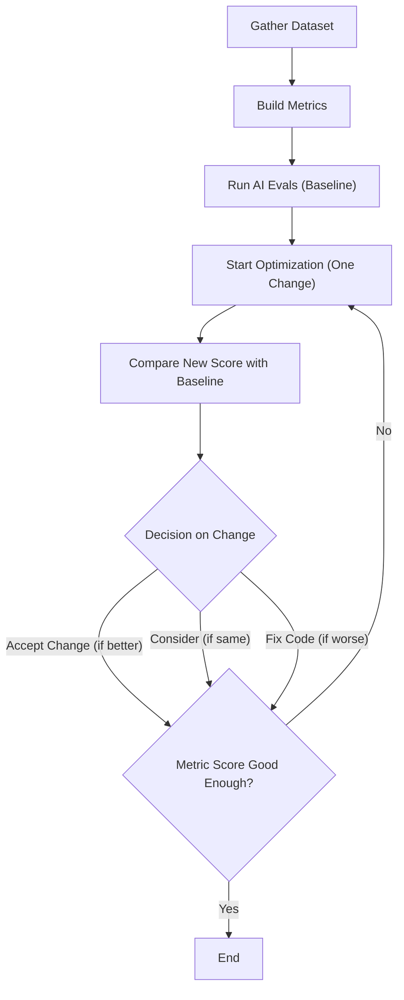
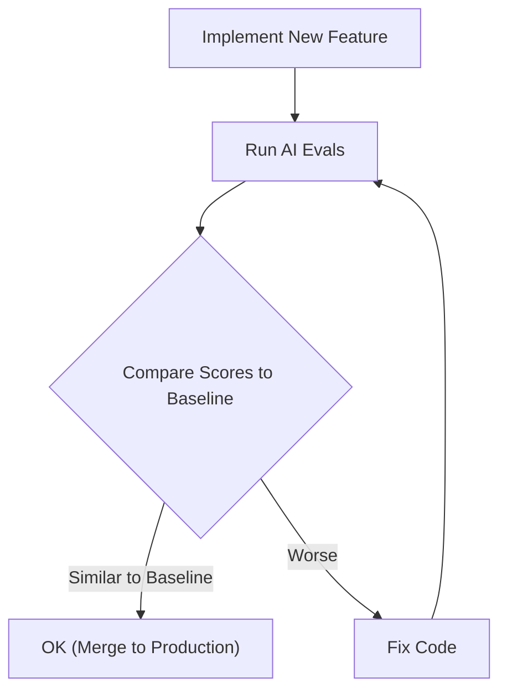

# Lesson 29: Defining the Evaluation Processes and Metrics Theory

In the previous lessons, specifically Lesson 27 and Lesson 28, we introduced the concept of agent observability using Opik and started building our offline evaluation dataset. We learned that to improve a system, you first need to see what it is doing and then capture that data to test against it.

Now, we move to the core theoretical framework of designing the metrics themselves. Evaluation-driven development (EDD) is one of the most underrated methodologies in building AI products. In the traditional machine learning world, rigorous evaluation is the standard. You cannot ship a model without knowing its accuracy, precision, or recall scores. However, in AI Engineering, where we combine software engineering with pre-trained models, many teams skip this step. They rely on "vibe checks" or assume they do not have time for formal testing.

The reality is that investing in an evaluation layer does not translate directly to immediate user-facing features, which makes it hard to prioritize. Yet, in the long run, it speeds up development by a large margin. Without it, you are flying blind, making changes to prompts or code without knowing if you are improving the system or breaking it. With a well-defined evaluation layer, you know exactly what to optimize, and when developing new features, you can easily catch regressions.

We like to say that AI evals act as your *"north star"*, guiding you on what or what not to develop.

In this lesson, we will cover:
*   How to use the optimization flywheel to improve your agents.
*   The different types of metrics available for unstructured data.
*   Why you should prioritize custom business metrics over generic ones.
*   Why binary (pass/fail) metrics are superior to Likert scales (1-5 ratings).

## Using Evals Through the Optimization Flywheel

To build up the intuition, let's look at how we can actually use and integrate AI evaluations into our application development lifecycle. There are three core scenarios where evaluations provide value.

First, they **quantify the quality of your system** on a set of given metrics. This gives you a snapshot of performance. This acts as a baseline to understand where you stand. Without this baseline, you cannot know if your system is ready for production or if it is improving over time.

Second, metrics serve as **guidance when optimizing your system**. Instead of guessing if a prompt change worked, you run your evaluations and check if the metrics are better, worse, or the same as the baseline. In data science, this is known as an experiment. This shifts development from intuition-based ("I think this prompt is better") to evidence-based ("This prompt increased factual accuracy by 15%").

Third, metrics act as **regression tests**. This is similar to optimization, but the goal is stability rather than improvement. When you push a new feature, you use evaluations as tests to ensure you have not broken existing functionality. This is critical in AI engineering because components are often shared; changing a system prompt to help one tool might confuse another.

### The Optimization Process

How does this look in a real-world scenario? Let's look at a step-by-step plan of attack for the optimization flywheel.

1.  **Gather your dataset:** As explained in the previous lesson, you need a representative set of inputs and expected outputs.
2.  **Build your metrics:** This is what we will define in this lesson. These metrics translate abstract qualities like "quality" or "correctness" into computable scores.
3.  **Establish a baseline:** Run the evaluations on your current system. It will likely be imperfect, but it gives you a direction, a "north star" for what "better" looks like. You now have a concrete score (e.g., "65% accuracy") rather than a vague feeling.
4.  **Start the optimization:** Make **one** change to your system that you believe will improve performance. This could be tweaking the prompt, changing the temperature, or updating the retrieval logic.
5.  **Compare:** Measure the new score against the baseline.
6.  **Decide:** If the score is better, accept the change. If it is the same, consider if the complexity is worth it. If it is worse, discard it.
7.  **Repeat:** Continue this cycle until the score is "good enough" for your use case.

It is critical to keep all the components fixed except one variable at a time. If you change the model, the prompt, and the temperature simultaneously, you will not know what caused the change in metrics. You might have improved the prompt but worsened the temperature, resulting in a net zero change, leading you to discard a good prompt. Scientific isolation of variables is key here.

**A Note on Statistical Significance and Business Impact**

In step 6, we mentioned deciding if a change is "better." Often, you want the score not just to be better in a vacuum, but to be statistically significantly better. From our experience, the term "statistical significance" depends a lot on your use case. To keep it simple, we like to keep it anchored in **business impact**.

For example, if your score is within the `[0, 1]` interval and your improvement is only `0.0001`, you might think that is insignificant, right? Well, not always. In some cases, it might be noise. But in other cases, that tiny fraction might translate to a massive real-world gain. If you are running a high-volume support bot handling millions of tickets, a `0.0001` improvement in resolution rate might translate to a cost reduction of 10 million dollars annually. Conversely, for a creative writing assistant used by a few hundred people, such a small lift is likely negligible. Therefore, "better" is always relative to your business use case.

Image 1: The iterative optimization flywheel for AI applications using evaluations.

### Regression Testing

You can also apply a similar strategy for regression tests. Suppose that instead of trying to directly optimize a particular part of your AI app, you push new features that affect multiple parts of your code, such as system prompts, tool descriptions, or orchestration layers.

Your new feature might work perfectly in isolation. But because you touched parts of the code that affect other features, such as modifying a shared `system_prompt` to support a new tool, the chance that you broke other functionality is quite big. That is why running the AI evaluations as regression tests is an extremely powerful technique to ensure your new features don't break old features.

You can modify the strategy from above as follows:

1.  **Implement a new feature:** You write the code and verify it works locally for the new use case.
2.  **Run the AI evaluations:** You run the full suite of evaluations, covering all previous use cases, not just the new one.
3.  **Compare Scores:**
    *   If the scores are similar to the baseline, your feature is OK as it didn't affect any old feature. You can merge the feature into your production codebase.
    *   If the score is worse, you have introduced a regression. You should fix your code. Then repeat steps 2 and 3.

💡 **Note:** You usually run these AI evaluations within your Continuous Integration (CI) pipeline before merging and deploying your code. This acts as a gatekeeper, preventing bad code from ever reaching production. 

Image 2: Integrating AI evaluations into CI pipelines for regression testing.

Basically, AI evaluations can be used in a similar strategy to classic unit or integration tests. But instead of expecting them to "succeed" or "fail" in a binary way (since AI apps are never perfect), we check the score relative to the baseline.

Because we can use AI evals similar to unit or integration tests, you should also expand them whenever you push new features. But instead of writing new tests in code, you expand the tests by adding new samples to the dataset. Thus, for every new feature that you push, you should expand the AI evals dataset with one or more samples that capture the edge cases introduced by your new logic. Rarely, if you build a completely new feature, you will also have to implement new metrics that quantify the new business metrics.

Also, using a similar logic, you can expand your AI evals dataset when debugging your code. For example, you realise that your AI app failed on a specific trace you captured in your LLMOps tool, such as Opik. Along with fixing the edge case, you add that trace within your evals dataset so you ensure you always check for that use case in future iterations. This is a natural way of expanding your dataset with production data that captures real-world regressions.

Now that we understand how to use evaluations to improve our application or keep it in check, let's explore how to define the metrics themselves.

## Exploring Possible Metric Types

We work primarily with unstructured data, such as text and images. Therefore, we need metrics compatible with these data types, which differ from classical machine learning metrics used for structured data.

There are the three core families of metrics:

### 1. BLEU and ROUGE

These are classic metrics primarily used for translation and summarization. They work by comparing n-grams (sequences of words) between the generated text and a reference text [[1]](https://plainenglish.io/blog/evaluating-nlp-models-a-comprehensive-guide-to-rouge-bleu-meteor-and-bertscore-metrics-d0f1b1), [[2]](https://datumo.com/en/blog/insight/key-nlp-evaluation-metrics/).

*   **Pros:** They are fast to compute, widely understood, and provide an objective comparison based on lexical overlap.
*   **Cons:** They are purely lexical. They fail to capture semantic meaning. If a model paraphrases a sentence correctly but uses different words, these metrics will penalize it. They do not measure reasoning or factual accuracy.

### 2. BERTScore

This family of metrics uses embedding similarity. Instead of counting matching words, it embeds both the generated text and the reference text into a high-dimensional vector space and calculates the similarity (e.g., cosine similarity) between them [[3]](https://spotintelligence.com/2024/08/20/bertscore/).

*   **Pros:** It captures semantic meaning better than n-gram metrics. It recognizes that "car" and "automobile" are similar.
*   **Cons:** It is still a comparison metric. It tells you how similar two texts are, but not *why* they are different. It cannot verify if specific business rules were followed or if the logic is correct.

### 3. LLM Judges

This approach uses an LLM to evaluate the quality of another AI's output. You prompt an "evaluator LLM" with the input, the output, and a set of criteria to provide a score or a judgment. This method is highly flexible and customizable, allowing you to evaluate outputs against complex criteria like creativity, tone, or adherence to specific instructions [[4]](https://hamel.dev/blog/posts/llm-judge/), [[5]](https://eugeneyan.com/writing/llm-evaluators/).

*   **Pros:** They can evaluate subjective aspects and provide detailed, human-like critiques. They can be tuned to specific business contexts.
*   **Cons:** Performance depends heavily on the quality of the prompt and the evaluator model. They can be slower and more expensive than automated metrics.

In our capstone projects, we choose **LLM Judges**. They offer the control required to compute concrete business metrics. For our writing workflow, we care about more than just similarity to a reference. We need to check if the generated article follows the guidelines, adheres to the research, and respects the expected structure. We will implement these from scratch in the next lesson.

Now, you kept hearing from us: *"business metrics here, business metrics there"*. Thus, let's understand why defining your own business metrics is such an important and underrated step in building your AI evals strategy.

## Why Business Metrics Over Benchmarks

Benchmarks are the most deceiving type of metrics. We all look at popular leaderboards or open benchmarks like **LMArena, AgentBench, or WebArena** to find the "best LLM," but relying on them for product decisions is often a mistake.

There are two core reasons for this.

First, benchmarks are often marketing tools. Companies directly or indirectly overfit their models to these benchmarks to claim the top spot. There have been instances where models were fine-tuned on these test sets to inflate the final score [[6]](https://openreview.net/forum?id=XbVMiW0jTM). Such as Meta, when they realised the too good to be true latest version of their open-source llama model in ~mid 2025. Still, even without direct cheating, the "hill climbing" effect means models are highly optimized for the specific questions in the benchmark, which may not generalize to other tasks. As the saying goes, "If the test set is public, it is no longer a test set."

Second, benchmarks do not reflect your custom business use case. A model might be the state-of-the-art at solving math problems (GSM8k), but if you need an LLM for creative writing or legal analysis, that math score is irrelevant.

Benchmarks are useful for the broader field to push research forward and for you to filter a list of capable models. However, they are not enough to evaluate your specific application. You need custom metrics that reflect the actual problem you are solving.

## Why Custom Business Metrics Over Generic Metrics

Just as public benchmarks are insufficient, generic business metrics like *"toxicity,"* *"helpfulness,"* or *"hallucination"* are often irrelevant to specific products. Even metrics like ROUGE or BERTScore fall under this umbrella. These generic metrics frequently add more noise than signal, wasting time and adding cognitive load to your decision process. That is why tools such as **RAGAS or pre-built metrics in Opik are pretty useless and misleading**.

As Hamel Husain notes, these prefab evaluations are a *"mirage"*. Relying on them builds false confidence. You might optimize for a high *"helpfulness"* score, but if that metric doesn't align with what your users actually need, you are optimizing for the wrong thing [[7]](https://www.decodingai.com/p/the-mirage-of-generic-ai-metrics).

We need **application-centric evaluations**. A model can score brilliantly on *"helpfulness,"* but fail catastrophically on your specific constraints.

Consider the dashboard below. It looks impressive, with scores for *"Truthfulness"* and *"Personalization."* But what does a 3.7 in Personalization actually mean?

Image 3: A dashboard showing generic metrics like Helpfulness and Truthfulness, labeled "Don't Do This!!" (Source [The 5-Star Lie: You Are Doing AI Evals Wrong [8]](https://www.decodingai.com/p/the-5-star-lie-you-are-doing-ai-evals))

For example, let's assume we want to check if the article written by our Brown agent contains hallucinations. If we use a generic `hallucination` score and it returns "positive," what does that tell us? Did it add information not present in the research? Did it deviate from the article guideline? Or did it simply include a personal story that wasn't in the source text but is factually correct and relevant?

A generic metric might flag that personal story as a hallucination because it wasn't in the source documents. In a strict summarization task, that is wrong. But for a technical blog post where we want to be engaging, that is a feature. A generic metric cannot know this context. It will lead you to "fix" a behavior that is actually desirable, wasting your time and degrading the product's personality. Even worse, it might flag a hallucination, but without telling you *where* in the article it happened, forcing you to hunt for it manually.

The idea is that these generic metrics, in the best case, waste our time, and in the worst case, they create an illusion of confidence that is unjustified.

Again, we don't want to demonize generic metrics completely. The idea is to know **when** to use them. They are usually more useful in the **exploratory phase**, where you want to filter and sort your data to find insights to understand and curate your data. For example, you could use:

1.  **Verbosity:** Sort your outputs by length to reveal if your most verbose answers are rambling and unhelpful. This helps you spot failure modes in long-form generation.
2.  **Similarity Score:** Use this to evaluate your RAG retriever specifically. If the similarity between the user query and the retrieved chunks is low, your retriever is likely failing. This is a valid component-level check.
3.  **BERTScore:** Use this to check the quality of your golden references. If you find a cluster of outputs with low BERTScore against the reference that you expected to be similar, you might realize the LLM found a more creative, or even better, way to solve the problem than your reference answer.

To conclude, even if generic metrics have their purpose, to grade the quality and outcome of your AI app you need custom business metrics deeply anchored into your domain and problem you want to solve.

## Choosing Binary Metrics Over Anything Else

When designing these custom metrics, you will face a choice: should you use a likert scale (e.g., 1-5 stars) or a binary pass/fail?

We strongly recommend **binary metrics**.

Likert scales (1-5) are a seductive trap. They seem to offer more information, but in practice, they introduce significant problems:
1.  **Inconsistent Labeling:** The difference between a "3" and a "4" is subjective. One evaluator's "4" is another's "3." This makes it impossible to compare results reliably across different annotators or even the same annotator on different days.
2.  **Statistical Noise:** This subjectivity masks real issues. If your average score moves from 3.2 to 3.4, is that a real improvement or just noise? It is hard to tell.
3.  **Lazy Decision-Making:** Scales encourage "satisficing." Evaluators often default to the middle value ("3") to avoid making a hard decision. This flattens your signal and hides the very failures you are trying to find [[8]](https://www.decodingai.com/p/the-5-star-lie-you-are-doing-ai-evals).

Binary evaluations work because they **force decisions**.
1.  **Clearer Thinking:** You cannot hide in the middle. You have to define exactly what constitutes a pass or a fail. This forces you to sharpen your definitions of quality.
2.  **Consistency:** It is much easier to get agreement on "Yes/No" than "3 vs 4."
3.  **Actionability:** A "Fail" is a clear signal that something needs fixing. You can immediately investigate why it failed.

💡 **Note:** The 3 points above translate exceptionally well to LLM Judges. Using binary scoring is a key design choice to mitigate the inherent randomness of LLMs. LLMs are much more stable when asked to make a binary decision than when asked to assign a scalar value. A binary metric translates to a more robust and repeatable evaluation pipeline.

### Capturing Nuance

The common objection is, "But I'm losing nuance! A 1-5 scale captures shades of gray."

The right way to capture nuance is not by making your scale fuzzier (1-5), but by making your criteria **more granular**. Instead of a single, subjective rating for a complex quality like "Accuracy," you should break it down into multiple, specific, binary checks.

For our writing agent, instead of rating an article 1-5 for "Quality," we create multiple binary evaluations that capture specific dimensions of quality:
1.  **Content Adherence:** Does the generated article contain the same core concepts as the expected article? (Yes/No)
2.  **Flow of Ideas Adherence:** Does the generated article contain the ideas in the same order as the expected article? (Yes/No)
3.  **Article Guideline Adherence:** Does the generated article follow the flow of ideas from the article guideline input? (Yes/No)
4.  **Research Anchoring:** Is every claim in the article supported by the provided research? (Yes/No)

By aggregating these binary signals, you get a highly nuanced view of performance (e.g., "The model follows the guideline but hallucinates research"), without the noise and subjectivity of a 5-star scale. This approach is simple, intuitive, scalable, and robust in production systems.

## Conclusion

In this lesson, we established the theoretical foundation for evaluating AI applications. We moved away from the idea of "vibe checks" and generic benchmarks toward a rigorous, optimization-driven approach. We learned that custom, binary business metrics provide the clearest signal for improving your agents.

By defining granular pass/fail criteria, we avoid the noise of subjective scales and the irrelevance of public leaderboards. In the next lesson, we will move from theory to practice and implement these LLM Judges from scratch to evaluate our Brown writing workflow.

## References

1.  Harrington, L. (2024, January 4). Evaluating NLP Models: A Comprehensive Guide to ROUGE, BLEU, METEOR, and BERTScore Metrics. Plain English. https://plainenglish.io/blog/evaluating-nlp-models-a-comprehensive-guide-to-rouge-bleu-meteor-and-bertscore-metrics-d0f1b1
2.  Key NLP Evaluation Metrics. (n.d.). Datumo. https://datumo.com/en/blog/insight/key-nlp-evaluation-metrics/
3.  Spot Intelligence. (2024, August 20). BERTScore explained: A modern metric for evaluating text generation. https://spotintelligence.com/2024/08/20/bertscore/
4.  Husain, H. (2024, January 29). Using LLM-as-a-Judge For Evaluation: A Complete Guide. Hamel.dev. https://hamel.dev/blog/posts/llm-judge/
5.  Yan, E. (2023, October 29). Evaluating the Effectiveness of LLM-Evaluators (aka LLM-as-Judge). Eugene Yan. https://eugeneyan.com/writing/llm-evaluators/
6.  Xu, F., Alon, U., Neubig, G., & Hellendoorn, V. J. (2024, May 22). Benchmark Overfitting in Large Language Models. OpenReview. https://openreview.net/forum?id=XbVMiW0jTM
7.  Iusztin, P. (2024, October 29). The Mirage of Generic AI Metrics. Decoding AI Magazine. https://www.decodingai.com/p/the-mirage-of-generic-ai-metrics
8.  Iusztin, P. (2024, November 5). The 5-Star Lie: You Are Doing AI Evals Wrong. Decoding AI Magazine. https://www.decodingai.com/p/the-5-star-lie-you-are-doing-ai-evals
9.  Iusztin, P. (2024, October 22). Escaping POC Purgatory: Evaluation-Driven Development for AI Systems. Decoding AI Magazine. https://www.decodingai.com/p/escaping-poc-purgatory-evaluation
10. Iusztin, P. (2024, November 12). Stop Launching AI Apps Without This Framework. Decoding AI Magazine. https://www.decodingai.com/p/stop-launching-ai-apps-without-this
