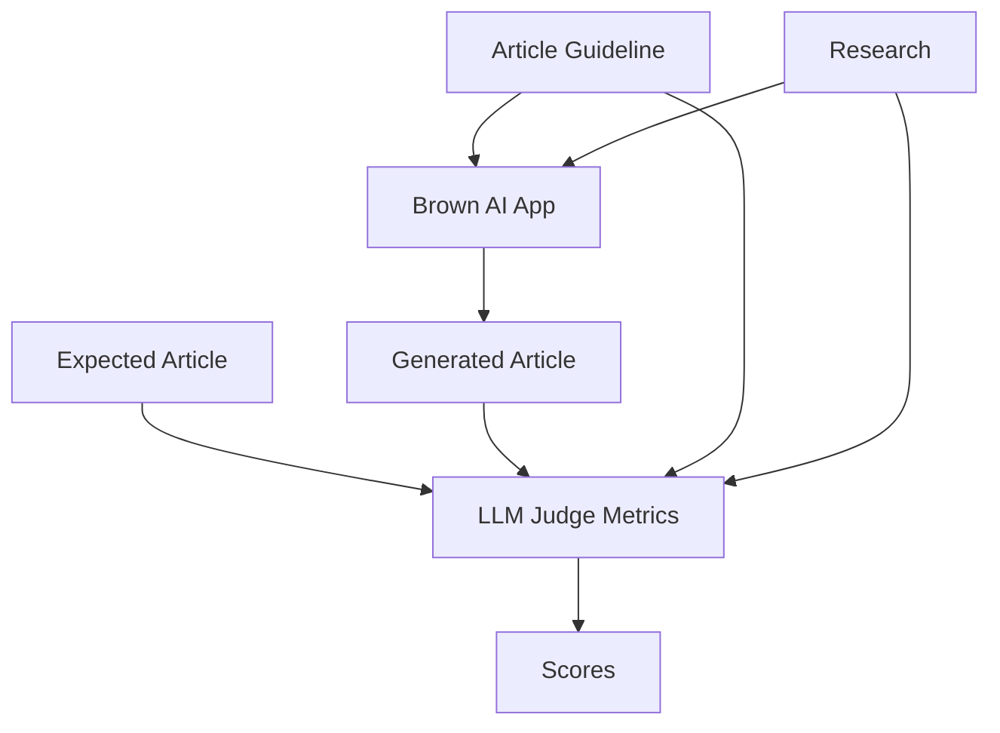
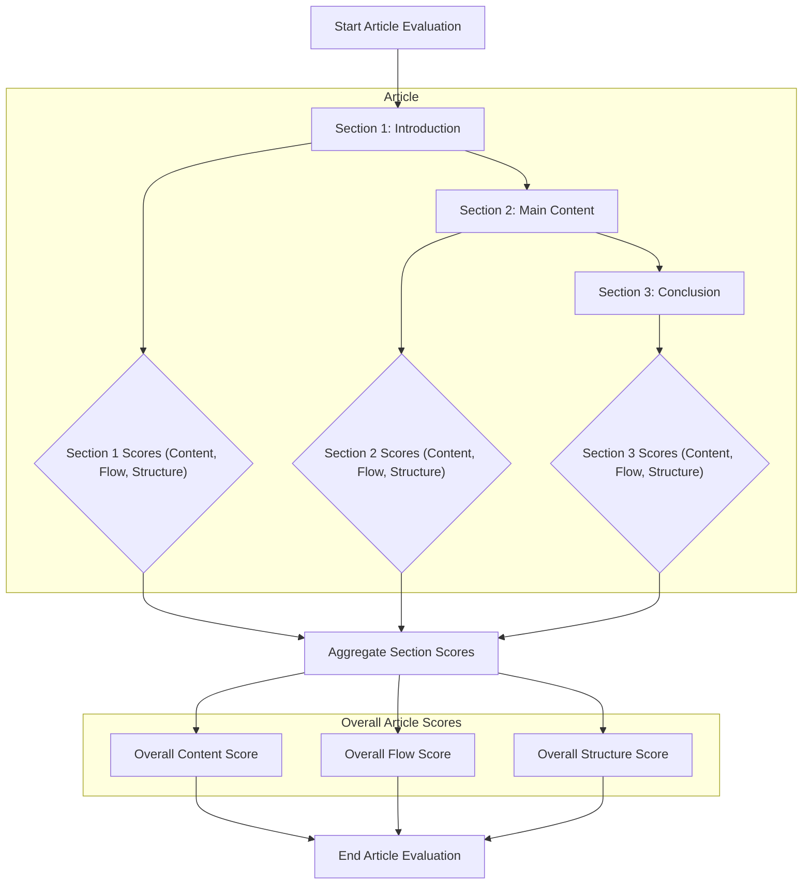
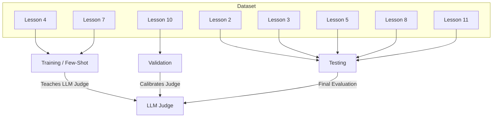

# Lesson 30: Evaluating the Writing Workflow

In previous lessons, we integrated Opik for observability, prepared the AI evals dataset from scratch and learned the theory behind writing good business metrics.

Now, we move from theory to practice. Evaluating AI systems is fundamentally different from testing traditional software. In Software 1.0, you write unit tests with deterministic assertions and structured outputs. In Software 3.0, the output is probabilistic and often under the form of text, images or even audio. A correct answer can take infinite forms. Furthermore, manually reviewing the outputs of the AI systems does not scale. You cannot manually review thousands of logs every time you tweak a prompt or temperature setting. This creates a bottleneck where you cannot iterate fast enough.

This is where LLM Judges come in. They automate human-level evaluation, allowing you to scale semantic checks across your entire dataset. However, building a reliable evaluation pipeline is often as engineering-intensive as building the agent itself. It is an AI application in its own right, requiring its own dataset, context engineering, and iteration cycles. Many teams underestimate this effort, treating evals as an afterthought. Yet, without it, you are flying blind, making critical architectural decisions based on "vibe checks" rather than empirical data [[1]](https://www.patronus.ai/llm-testing/llm-as-a-judge). 

Still, when done right, a robust evaluation pipeline becomes your safety net. It allows you to refactor code, switch models, or optimize prompts with the confidence that you haven't breaked anything or that your new feature has real-world impact.

In this lesson, we will implement the complete evaluation layer for Brown, our writing workflow, where we will cover:
*   **The LLM Judges:** Implementing `FollowsGT` (Ground Truth) and `UserIntent` judges using section-level binary metrics.
*   **Dataset Strategy:** How to use the evaluation dataset created in the previous lesson.
*   **The Pipeline:** Hooking up Brown to Opik to run automated experiments.
*   **Reliability:** Techniques to verify your judges are trustworthy through alignment scores and stability checks.

## Understanding the LLM Judges We Will Build

Before writing any code, we need to clarify what we are building. Let's start with a quick reminder of what our evaluation dataset for Brown looks like. For every sample, we have three static components: the **Article Guideline**, the **Research**, and the **Expected Article** (Ground Truth). The **Generated Article** is created dynamically by Brown every time we run an experiment.


Image 1: The components of an evaluation dataset sample.

On top of this dataset, we will build two specific LLM judges to assess quality on a set of concrete business metrics we truly care about, generating articles with Brown.

1.  **FollowsGT (Follows Ground Truth):** This compares the **generated article** against the **expected article**. It evaluates three dimensions:
    *   **Content:** Does it cover the same topics and ideas (regardless of the order in which they are presented)?
    *   **Flow:** Does it follow the same logical order of ideas and transitions?
    *   **Structure:** Does it use the same formatting patterns (headers, lists, code blocks)?

2.  **UserIntent:** This compares the **generated article** against the **inputs** (Guideline and Research). It evaluates two dimensions:
    *   **Guideline Adherence:** Does the article follow the specific requirements specified by the user within the article guideline? Is every bullet point within the guideline addressed? 
    *   **Research Anchoring:** Is the content derived solely from the provided research (hallucination check)?

Note how these 5 dimensions are completely different from the writing profiles we used during the evaluator-optimizer pattern (except the structure metric). This is done by design. Why? First, because we want our AI evaluation pipeline to be completely decoupled from the writing workflow. We want to treat Brown as a black box, where we know only the inputs, outputs and how the ideal output should look. Like this, we are keeping our evals 100% data-driven, which ultimately makes the LLM judges more flexible. 

Let's zoom in on the data-driven idea. All the writing profiles are embedded indirectly in the expected output. As we carefully manually edited and improved the expected articles, we ensured they adhered to all the writing profiles we use at Brown. Thus, by checking the generated article against the expected article, we *have the potential* to check against all the writing profiles. Why only *"have the potential"*? Because our metrics are carefully scoped to check only a few business dimensions or outcomes that we care about, such as the quality of content, the flow of ideas, or adherence to user input. 

The structure metric doesn't entirely follow the statement we made above. The metric does not have 100% overlap with the structure profile used within Brown, but it does share many commonalities, such as looking for headers, bolded words, code snippets, and bulleted lists. But because of this, we realized it often clashes with the flow dimension, a broader metric that considers multiple aspects at once.

For example, if a code snippet is described within a single block within the generated article, while it's described within three blocks within the expected article, which dimension isn't respected? The flow or structure one? Or both? This is a signal that the structure dimension is adding more noise than signal. Thus, we are considering removing it from our real-world LLM Judge, but we intentionally left it in this lesson to see how easily you can introduce noisy metrics that harm more than help. For transparency, we even added a "mechanics" dimension at first, but realized it was overkill and made the labeling process too complicated and confusing. 

To conclude, when defining your metrics, keep it simple and ruthlessly keep only the CORE dimensions you really care about, ideally independent of each other.

### Section-Level Binary Metrics

A key design decision we made is to score at the **section level** using **binary metrics** (0 or 1), rather than scoring the whole article. Why?

Scoring a 3,000-word article with a single number can lose a lot of signal. Also, scoring it on a 1-5 scale isn't a good strategy, as we presented in the previous lesson.

Thus, by breaking the article into sections (Introduction, Section 1, Section 2, ..., Section N, Conclusion) and scoring each section individually, we achieve higher granularity while fully leveraging the beauty of binary metrics, which are easier to label and calibrate. It is simpler for an LLM to decide "Did this section follow the guideline? Yes/No" than "Rate the adherence on a scale of 1 to 5" [[2]](https://www.evidentlyai.com/llm-guide/llm-as-a-judge).


Image 2: The article evaluation process at the section level, including individual section scoring, aggregation, and overall article scores.

The granularity of evaluating each section individually has huge benefits. Before enumerating them, we have to make a parenthesis on how binary labeling works. To reduce mental load, when using binary metrics, whenever you find the FIRST error, you label the item with 0 and explain the error message in the reasoning field. Imagine the impact of this on a 2000-3000-word article that can be labeled as 0 because of a small error in the introduction.

Thus, by evaluating at the section level:
- The aggregate score is not highly skewed. If only one section is faulty, the rest will be scored as 1.
- We can actually compute the scores for each section. Otherwise, for example, if labeling at the article level, we would just stop if the error is within the introduction.
- While debugging, we can easily localize the issue within the article, as the sections are relatively small.

Now, before digging into the implementation, we have to prepare the evaluation dataset. 

## Splitting the Evals Dataset

To build our LLM Judges reliability without data leakage, we have to apply a standard ML strategy: splitting the dataset [[3]](https://www.lightly.ai/blog/train-test-validation-split) between a:

*   **Training Split (Few-Shot Examples):** We use these samples to *"train"* the LLM judge. We manually label these samples and feed them into the judge's prompt as few-shot examples.
*   **Validation Split:** We use this to **align** the judge. We compare the LLM judge's scores against human scores to ensure the judge is evaluating correctly.
*   **Testing Split:** We use this to compute the final performance metrics of our system. At this point, once the LLM Judges are reliably implemented and aligned, we don't need any human intervention.

As presented in Image 3, here is our concrete split:
- **Training Split:** L4, L7 (These two are flagged as `"is_few_shot_example": true` within the `metadata.json` file and NOT loaded to Opik. Rather, they are stored within the Python code along with the LLM Judges code at `brown.evals.metrics` to be easily loaded at runtime.)
- **Validation Split:** L10
- **Testing Split:** L2, L3, L5, L6, L8, L9, L11

As few-shot examples, we chose `Lesson 4: Structured Outptus` and `L7: Reasoning & Planning Theory` as they act as a perfect mix between text, code and mermaid-rich lessons. Also, to keep the context window in check, we chose L4, which is shorter. For the validation split, we chose `Lesson 10: Memory` because it's a longer lesson that, by itself, contains a mix of everything.


Image 3: The strategic splitting of a dataset for LLM judge development.

Now that we understand our plan of attack, let's dig into the code.

## Implementing the Follows Ground Truth LLM Judge

We will start by implementing the `FollowsGTMetricLLMJudge`. Remember that this metric requires the generated article and the ground truth article to compare against.

### The Base Metric Abstraction

First, we define a base class `BrownBaseMetric`. This handles the initialization of the LLM with structured outputs and provides a standard interface for scoring that will be used across all our LLM Judges.

1. We define the class and initialization logic (Source: `brown.evals.metrics.base`).
    ```python
    class BrownBaseMetric(base_metric.BaseMetric, Generic[FewShotExamplesT, StructuredOutputTypeT], abc.ABC):
        """Abstract base class for Brown evaluation metrics that use LLMs for structured scoring."""

        def __init__(
            self,
            model: SupportedModels,
            name: str,
            structured_output_type: type[StructuredOutputTypeT],
            few_shot_examples: FewShotExamplesT,
            model_config: ModelConfig,
            track: bool = True,
            project_name: str | None = None,
        ) -> None:
            super().__init__(
                name=name,
                track=track,
                project_name=project_name,
            )

            self.model = model
            self.structured_output_type = structured_output_type
            self.model_config = model_config
            self.few_shot_examples = few_shot_examples

            if self.model == SupportedModels.FAKE_MODEL:
                assert self.model_config and self.model_config.mocked_response is not None
    ```

2.  We implement the model initialization and scoring methods.
    ```python
        def init_model(self) -> Runnable:
            """Initialize the language model with structured output capabilities."""
            model_instance = get_model(self.model, self.model_config)
            model_instance = model_instance.with_structured_output(self.structured_output_type)
            return model_instance

        def score(self, *args: Any, **kwargs: Any) -> score_result.ScoreResult | list[score_result.ScoreResult]:
            """Calculate evaluation scores synchronously by wrapping the async implementation."""
            return a.asyncio_run(self.ascore(*args, **kwargs))

        @abc.abstractmethod
        async def ascore(self, *args: Any, **kwargs: Any) -> score_result.ScoreResult | list[score_result.ScoreResult]:
            """Abstract async method for implementing metric-specific evaluation logic."""
            pass
    ```

### The Metric Implementation

Next, we implement the concrete `FollowsGTMetricLLMJudge`. This class prepares the prompt using the generated article (`output`) and the expected article (`expected_output`), invokes the LLM, and parses the result.

1.  We initialize the metric with the specific structured output type and few-shot examples (Source: `brown.evals.metrics.follows_gt.metric`).
    ```python
    class FollowsGTMetricLLMJudge(BrownBaseMetric):
        """A metric that evaluates the quality of article content across multiple sections and dimensions."""

        def __init__(
            self,
            model: SupportedModels = SupportedModels.GOOGLE_GEMINI_25_FLASH,
            name: str = "follows_gt",
            model_config: ModelConfig | None = None,
            track: bool = True,
            project_name: str | None = None,
        ) -> None:
            model_config = model_config or ModelConfig(
                temperature=0.0, thinking_budget=1024 * 4, include_thoughts=False, max_retries=3
            )
            super().__init__(
                model=model,
                name=name,
                structured_output_type=FollowsGTArticleScores,
                few_shot_examples=prompts.DEFAULT_FEW_SHOT_EXAMPLES,
                model_config=model_config,
                track=track,
                project_name=project_name,
            )
    ```

2.  We implement the `ascore` method to generate the prompt and invoke the model.
    ```python
        async def ascore(
            self,
            output: str,
            expected_output: str,
            **ignored_kwargs: Any,
        ) -> score_result.ScoreResult | list[score_result.ScoreResult]:
            # Initialize the model client at the function level to avoid coroutine reuse issues
            model_client = self.init_model()

            llm_query = prompts.get_eval_prompt(
                output=output,
                expected_output=expected_output,
                few_shot_examples=self.few_shot_examples,
            )
            article_response = cast(
                FollowsGTArticleScores,
                await model_client.ainvoke([{"role": "user", "content": llm_query}]),
            )

            if not article_response:
                raise ValueError("Model failed to return a structured response.")

            return article_response.to_score_result(self.name)
    ```

### Defining the Score Structures

We use Pydantic models to define exactly what the LLM should return. This structured output is critical for parsing the results reliably.

1.  We define the top-level container for article scores (Source: `brown.evals.metrics.follows_gt.types`).
    ```python
    class FollowsGTArticleScores(pydantic.BaseModel):
        """Article-level scores for the FollowsGT evaluation metric."""

        sections: list[FollowsGTSectionScores]

        def to_score_result(self, prefix: str) -> list[score_result.ScoreResult]:
            """Convert the evaluation results to ScoreResult objects with dimension-wise scoring."""
            return aggregate_section_scores_to_results(self.sections, prefix)
    ```

2.  We define the scores for a single section and the specific criteria.
    ```python
    class FollowsGTSectionScores(pydantic.BaseModel):
        """Section evaluation with scores across all FollowsGT dimensions."""

        title: str = pydantic.Field(description="The title of the section being evaluated.")
        scores: FollowsGTCriterionScores = pydantic.Field(description="The scores of the section.")

    class FollowsGTCriterionScores(CriteriaScores):
        """Represents scores for all three evaluation dimensions of a section."""

        content: CriterionScore
        flow: CriterionScore
        structure: CriterionScore
    ```

3.  The `CriterionScore` represents the binary decision and the reasoning behind it (Source: `brown.evals.metrics.base`).
    ```python
    class CriterionScore(pydantic.BaseModel):
        """Base model for a single score representing a specific evaluation dimension."""

        score: Annotated[int, Ge(0), Le(1)] = pydantic.Field(description="Binary score of the section.")
        reason: str = pydantic.Field(description="The reason for the given score.")
    ```

4.  We also need the base `CriteriaScores` class which helps format these scores for the LLM context.
    ```python
    class CriteriaScores(pydantic.BaseModel):
        """Abstract base class for scores across multiple evaluation dimensions."""

        def to_context(self) -> str:
            """Convert the scores to a formatted XML string for use as context in prompts."""
            scores_fields = self.__class__.model_fields
            scores_xml = ""
            for field_name in scores_fields.keys():
                field_score = getattr(self, field_name)
                scores_xml += f"""    <{field_name}>
            <score>{field_score.score}</score>
            <reason>{field_score.reason}</reason>
        </{field_name}>
    """
            return scores_xml
    ```

### Aggregating Scores

Since we score every section individually, we need a way to roll these up into a final score for the article. We use a helper function `aggregate_section_scores_to_results` that calculates the mean of the binary scores (0s and 1s) across all sections.

1.  We initialize the aggregation structure by inferring dimensions from the first section (Source: `brown.evals.metrics.base`).
    ```python
    def aggregate_section_scores_to_results(
        section_scores: list,
        prefix: str,
    ) -> list[score_result.ScoreResult]:
        """Convert section-level evaluation results to aggregated ScoreResult objects."""
        if not section_scores:
            return []

        # Automatically infer dimensions from the first section's scores class
        scores_class = type(section_scores[0].scores)
        scores_fields = scores_class.model_fields
        aggregated_scores: dict[str, dict[str, list[int] | str]] = {
            field_name: {"scores": [], "reason": ""}
            for field_name in scores_fields.keys()
        }
    ```

2.  We iterate through sections to collect scores and concatenate reasons.
    ```python
        for section in section_scores:
            for dimension in aggregated_scores.keys():
                dimension_score = getattr(section.scores, dimension)
                aggregated_scores[dimension]["scores"].append(dimension_score.score)
                aggregated_scores[dimension]["reason"] += f"{section.title}:\n"
                aggregated_scores[dimension]["reason"] += f"**{dimension_score.score}:** {dimension_score.reason}\n\n"
    ```

3.  We compute the average score for each dimension and return the results.
    ```python
        results: list[score_result.ScoreResult] = []
        for dimension, scores_data in aggregated_scores.items():
            scores_list = scores_data["scores"]
            aggregated_score = CriterionAggregatedScore(
                name=f"{prefix}_{dimension}",
                score=sum(scores_list) / len(scores_list),
                reason=str(scores_data["reason"]),
            )
            results.append(aggregated_score.to_score_result())

        return results
    ```

4.  The `CriterionAggregatedScore` class is a simple container for the final aggregated result.
    ```python
    class CriterionAggregatedScore(pydantic.BaseModel):
        """Represents an aggregated score for a specific evaluation dimension."""

        name: str
        score: float
        reason: str

        def to_score_result(self) -> score_result.ScoreResult:
            return score_result.ScoreResult(name=self.name, value=self.score, reason=self.reason)
    ```

### Few-Shot Examples and Prompts

To "train" the judge, we provide few-shot examples. We define classes to hold these examples, which map the generated output, expected output, and the manually assigned scores.

1.  We define the specific example class for FollowsGT (Source: `brown.evals.metrics.follows_gt.types`).
    ```python
    class FollowsGTMetricFewShotExample(BaseExample):
        """Represents a single example for the follows_gt evaluation."""

        output: str
        expected_output: str
        scores: FollowsGTArticleScores

        @classmethod
        def from_markdown(
            cls, output_file: Path, expected_output_file: Path, scores: FollowsGTArticleScores
        ) -> "FollowsGTMetricFewShotExample":
            output = output_file.read_text()
            expected_output = expected_output_file.read_text()
            return cls(output=output, expected_output=expected_output, scores=scores)

        def to_context(self) -> str:
            return f"""
    <output>
    {self.output}
    </output>
    <expected_output>
    {self.expected_output}
    </expected_output>
    {self.scores.to_context()}
    """
    ```

2.  We also need the base classes `BaseExample` and `BaseFewShotExamples` that define the common interface (Source: `brown.evals.metrics.base`).
    ```python
    class BaseExample(pydantic.BaseModel, Generic[ExampleT]):
        """Base class for examples used in evaluation metrics."""

        @abc.abstractmethod
        def to_context(self) -> str:
            """Convert the example to a formatted string for use as context in prompts."""
            pass

    class BaseFewShotExamples(pydantic.BaseModel, Generic[ExampleT]):
        """Base class for few-shot examples collections."""

        examples: list[ExampleT]

        def to_context(self) -> str:
            examples = "\n\n".join(
                [f"<example_{i + 1}>\n\t{example.to_context()}\n</example_{i + 1}>\n" 
                 for i, example in enumerate(self.examples)]
            )
            return examples
    ```

The system prompt is the brain of the judge. It contains specific instructions on how to evaluate the "Content", "Flow", and "Structure" dimensions relative to each section of the article. Let's break it down.

1.  **Introduction:** We start by defining the persona and the specific task. The LLM is framed as an NLP evaluation expert whose sole purpose is to assess the quality of the generated article.
    ```python
    """
    You are an expert in Natural Language Processing (NLP) evaluation metrics, specifically trained to 
    assess answer quality in responses provided by LLMs. 

    Your task is to evaluate the quality of a generated article by another LLM relative to 
    an expected article output across multiple criteria: content, flow, structure, and mechanics.
    ...
    """
    ```

2.  **Scoring Instructions:** We provide a comprehensive set of rules to guide the evaluation process. First, we define the judge's role in analyzing the generated article against the expected output, establishing the expected output as the absolute reference standard. To ensure consistent section extraction, we use the expected output as the anchor. If section titles do not match perfectly, the judge must infer connections based on content similarity. If a section from the expected output is missing in the generated version, it automatically receives a score of 0. We technically define a "section" as the content between two H2 headers (`##`), with a specific exception for the introduction, which lies between the title and the first header. Finally, we establish a binary scoring mechanism (0 or 1) where each criterion—content, flow, and structure—is evaluated independently.
    ```python
    """
    ...
    ## INSTRUCTIONS

    1. You must analyze the given expected article (<expected_output>) and generated article (<generated_output>) 
    to determine the most relevant evaluation.
    2. Since the generated output is an answer from another LLM, you must use the expected output as the reference 
    standard to compare and evaluate the quality of the generated output.
    3. Both the generated and expected outputs are in Markdown format.
    4. Instead of comparing the outputs as a whole, you will divide the outputs into sections and compare each section 
    individually. 
    5. You will always use the expected output as the reference point to extract the sections of interest during the
    evaluation. If there is no perfect match between the expected and generated section names, first try to infer
    the corresponding section based on the similarity of section names and their respective content. If you conclude that 
    the expected output contains a section that the generated output lacks, you will assign a score of 0 to the missing 
    section in the generated output.
    6. Sections are divided by H2 headers, marked as "##" in Markdown. You will use these headers as 
    separators. Anything between two H2 headers constitutes a section. The only valid exception to this rule is the first 
    section, the introduction, which sometimes appears between the title and the first H2 header. You will never include 
    the title or subtitle as part of the first section.
    7. When comparing each individual section of the expected output to the generated output, you will assign a binary 
    score for multiple criteria: 0 or 1, where 0 indicates a non-match and 1 indicates a perfect match. Each criterion
    is completely independent of the others, meaning that a score of 0 in one criterion does not affect the score of 
    another criterion.
    8. You must compute binary scores for each section based on the following criteria:
    """
    ```

3.  **Scoring Instructions - Content Criterion:** Next, we define the **Content** criterion. This binary metric focuses purely on substance. We instruct the judge to verify if the core subjects, topics, and arguments are present, regardless of their order or formatting. If the generated section covers the same ideas as the expected one, it gets a 1, even if the phrasing differs.
    ```python
    """
    1. **Content:** Evaluate whether the generated section covers the same content as the expected section:
        - Focus only on evaluating that the substance of the content is the same between the expected and generated section. By content, we 
        mean core subjects, topics, research, ideas, key points or arguments. For example, if both sections discuss the
        fundamentals of RAG, it's valid. But, if the expected section discusses advanced RAG topics, while the generated section
        discusses basic RAG topics, it's invalid.
        - In this criterion, we are not interested in the order, structure, layout, or any other aspect related to the flow of
        ideas, structure or mechanics. For example, if there are missing or additional ideas discussed it's still valid, as
        long as the substance of the content between the expected and generated section is the same.
    """
    ```

4.  **Scoring Instructions - Flow Criterion:** The **Flow** criterion evaluates the narrative logic. Here, the order matters. We check if the generated section follows the same sequence of ideas and transitions as the expected output. This ensures the storytelling remains coherent. We also check for the correct placement of media elements relative to the text.
    ```python
    """
    2. **Flow:** Evaluate whether the generated section follows the same order of ideas as the expected section, such as 
    the flow of:
        - Main ideas covered starting with the beginning, until the end of the section. With special emphasis on the beginning and end of the 
        section as they reflect the transition between the previous and next sections
        - Internal transitions between the main points within the section. We expect a smooth flow of ideas, 
        without any abrupt jumps or breaks.
        - Placement of notes, images, tables, code blocks, or any other media elements within the generated section, 
        relative to the expected section. 
        - We don't expect a perfect one on one match between the paragraphs and sentences between the expected and generated section.
        However, we expect the same ideas and concepts to be discussed in the same way, order, and storyline.
        - Assign a score of 0 if anything is missing from the generated section relative to the expected section, such as missing
        topics, ideas, or media.
        - Assign a score of 0 if anything is additionally added to the generated section relative to the expected section, such 
        as additional topics, ideas or media elements.
        - Accepted differences between the expected and generated section:
            - Mismatching media numbering is accepted. For example, if in the expected section we have a figure with the number 3 and
            in the generated section we have a figure with the number 4, it's valid. It will be invalid, only if the figure would be
            missing altogether.
            - Mismatching or missing emojis. For example, if the excepted section has a 💡 emoji, while the generated section has 
            a 🔑 emoji, it's valid. Also, if the emoji is missing altogether from the generated section, it's valid.
            - Mismatching source reference numbers. For example, if the expected section referes a source with the number 3, 
            while the generated section referes a source with the number 7, it's valid. It will be invalid, only if the generated
            section misses the source altogether. 
            - Different placement of the source in the generated section. For example, if the expected section has the source
            at the end of a sentence within the paragraph, while the generated section has it at the end of the paragraph, it's valid. 
            It will be invalid, only if the generated section would be missing altogether.
            - Mismatching number of source references. For example, if the expected section has 3 source references, while the 
            generated section has 2 source references, it's valid. It will be invalid, only if the generated section would have 
            misses the references altogether. For example if the expected section has 3 source references, while the generated 
            section has 0 source references, it's invalid.
            - Having reference numbers in the generated section, while having none in the expected section. For example, if the 
            expected section has 0 reference numbers, while the generated section has 3 reference number, it's valid. It will be 
            invalid, only the other way around, where the expected section has 3 reference numbers, while the generated section has 0.
    """
    ```

5.  **Scoring Instructions - Structure Criterion:** The **Structure** criterion is about formatting rigor. We check if the generated section uses the same Markdown elements—headers, lists, code blocks, and bolding—as the reference. This ensures the visual hierarchy and technical formatting are preserved.
    ```python
    """
    3. **Structure:** Evaluate whether the generated section follows the same structure as the expected section. By 
    structure, we mean:
        - H3/H4/H5/H6 sub-heading structure and formatting
        - Mismatches in headers formatting and presence. For example, if the expected section doesn't has a header,
        while the generated section has one, it's invalid. It's valid only if there is a one on one match between the headers
        formatting and presence.
        - Use of bulleted lists, numbered lists, callouts, notes, or other layout elements
        - Division of the section when guiding readers through code blocks or diagrams
        - Formatting of notes and code blocks
        - Use of bolding, italicizing, quotes, backticks, or other formatting elements
        - Formatting of citation references across sentences
        - Formatting of images, tables, and Mermaid diagrams and their corresponding citations. If they are missing from
        the generated section, we consider it valid for this criterion, as we are interested ONLY in formatting, which we
        cannot verify when elements are absent. For this criterion, missing elements from the generated sections are 
        considered valid. They are invalid only if present in both sections but formatted differently.
        - Number formatting conventions
    """
    ```

6.  **Scoring Instructions - Reasoning & Rules:** Finally, we require the model to output a reasoning trace alongside the binary score. This is essential for debugging; if a section gets a 0, we need to know exactly why. We also define specific rules for handling media comparisons to avoid false negatives based on content differences in placeholders.
    ```python
    """
    9. Along with the binary scores, you will provide a brief and concise explanation containing the reasoning behind 
    the score for each criterion. The score will be used to debug and monitor the evaluation process. Therefore, it is
    important to provide thorough reasoning for the score. Since we provide binary scores, the reasoning should always 
    contain what is good and what is problematic about the generated section, regardless of the score. For example, if the 
    score is 0, the reasoning should also contain what is good about the generated section, such as "both sections 
    follow the same flow of ideas," and what is problematic, such as "the generated section contains an additional 
    paragraph on AI Evals that is not present in the expected section."
    10. Important rules when comparing the content of sections:
        - Focus on substance, not superficial formatting differences
        - When comparing **media**, you only care about the placement of the media, not the content of the media. 
        Since media can take many forms such as Mermaid diagrams, tables, images, or URLs, you will completely ignore the 
        content of the media and only check whether the media is present in the correct place in the section, has 
        the appropriate citation, and proper numbering.
    ...
    """
    ```

7.  **Chain of Thought:** We enforce a strict Chain of Thought (CoT) process to improve reasoning reliability. The prompt guides the model through specific steps: first, understanding the inputs; second, splitting the text into sections; third, mapping the expected sections to the generated ones; and finally, evaluating each pair in isolation. This step-by-step approach prevents the model from rushing to a hallucinated score without analyzing the full context.
    ```python
    """
    ...
    ## CHAIN OF THOUGHT

    **Understanding Input:**
    1.1. Read, understand, and compare each section of the expected output and generated output.
    1.2. Since we want to compute scores for each section of the expected output Markdown file, split the expected output 
    into sections using the H2 headers as separators.

    **Splitting into Sections:**
    2.1. Using the expected output as the reference point, compare each section of the expected and generated 
    outputs individually and assign a binary score of 0 or 1, where 0 indicates a mismatch and 1 indicates a perfect match.
    2.2. Always use the expected output as the reference point to extract the sections of interest. 
    2.3. When computing the score for an individual section, you will iterate through each section of the expected output, 
    find its associated section in the generated output, and compute the score in isolation, ignoring all other sections.

    **Assigning Scores to Each Section:**
    3.1. Based on all sections of the expected output, assign a binary score of either 0 or 1 
    for all evaluation criteria listed in the instructions:
        - **1:** The generated section matches the expected section perfectly on the given criterion.
        - **0:** The generated section does not match the expected section on the given criterion.
    3.2. Justify why you assigned a score of 0 or 1 with a brief explanation that highlights the reasoning behind the score
    based on the given criterion.
    ...
    """
    ```

8.  **What to Avoid:** To further constrain the model, we explicitly list negative constraints. We warn against common failure modes, such as using the generated output as the reference point for sectioning or allowing the quality of one section to bias the score of another. This isolation is key for granular, accurate metrics.
    ```python
    """
    ...
    ## WHAT TO AVOID

    - Do not provide scores using the generated output as the reference point to divide into sections. You must always 
    use the expected output as the reference point to divide into sections.
    - Do not let other sections influence the score of a section. The score of each section must be determined in complete 
    isolation from any other section.
    - Do not overlap requirements between different criteria. For example, in the content criterion, as are not interested in the flow 
    of ideas, if the ideas are in different order, or something is missing or additional, it's still valid. However, that is an important
    aspect of the flow criterion, which will be invalid.
    ...
    """
    ```

9.  **Few-Shot Examples and Inputs:** Finally, we define the placeholders where our dynamic data will be injected at runtime. This includes the few-shot examples that demonstrate the scoring logic and the actual inputs (generated and expected articles) for the current evaluation.
    ```python
    """
    ...
    ## FEW-SHOT EXAMPLES

    Here are few-shot examples demonstrating how to compute the scores for each section and criterion:
    <few-shot-examples>
    {examples}
    </few-shot-examples>

    ## INPUTS

    <generated_output>
    {output}
    </generated_output>

    <expected_output>
    {expected_output}
    </expected_output>
    ...
    """
    ```

10. And ultimately anchor the task:
    ```python
    """
    ...
    Think through your answer step by step, and provide the requested evaluation.
    """

### Plugging the Few-Shot Examples Into the System Prompt

To create the `DEFAULT_FEW_SHOT_EXAMPLES`, we followed a rigorous manual labeling process. We took the two articles from the training split (Lesson 4 and Lesson 7). Remember that the ground-truth articles in the dataset are manually reviewed, edited, and curated. Then we manually added noise to the generated article by introducing random ideas, dropping sections, or altering the flow of ideas to ensure we covered as many edge cases as possible. Then, we manually labeled each section across the content, flow and structure dimensions with a binary score and a reason message. 

```python
EXAMPLES_DIR = Path(__file__).parent / "examples"
```

Manually typing the reason message for each section and dimension is extremely important, as it indirectly explains to the LLM Judge why we scored that section with 0 or 1, providing a ton of signal. 

You can access the `article_generated.md` and `article_ground_truth.md` files by going to `brown.evals.metrics.follows_gt.examples`, where we store the files directly within the `brown` Python package.

Meanwhile, the labels are stored directly within the `FollowsGTMetricFewShotExample` entity, as follows:

```python
DEFAULT_FEW_SHOT_EXAMPLES = FollowsGTMetricFewShotExamples(
    examples=[
        FollowsGTMetricFewShotExample.from_markdown(
            output_file=EXAMPLES_DIR / "04_structured_outputs" / "article_generated.md",
            expected_output_file=EXAMPLES_DIR / "04_structured_outputs" / "article_ground_truth.md",
            scores=FollowsGTArticleScores(
                sections=[
                    FollowsGTSectionScores(
                        title="Introduction",
                        scores=FollowsGTCriterionScores(
                            content=CriterionScore(
                                score=1,
                                reason=(
                                    "Both sections cover the same core subjects and ideas, discussing the purpose "
                                    "of structured outputs as a bridge between LLMs and traditional applications."
                                ),
                            ),
                            flow=CriterionScore(
                                score=0,
                                reason=(
                                    "The generated section lacks the first sentence, which is used as a smooth "
                                    "transition into the article. Also, it misses the diagram present in the "
                                    "expected output, labeled as Figure 1."
                                ),
                            ),
                            structure=CriterionScore(
                                score=1,
                                reason="Both sections use the same paragraph length patterns.",
                            ),
                        ),
                    ),
                    FollowsGTSectionScores(
                        title="Why Structured Outputs Are Critical",
                        scores=FollowsGTCriterionScores(
                            content=CriterionScore(
                                score=0,
                                reason=(
                                    "Both sections cover the same reasons why structured outputs are critical, "
                                    "including ease of parsing, data validation with Pydantic, and common use "
                                    "cases. Still, the generated section has a section on GraphRAG, which is not "
                                    "related to the specific topic of the section."
                                ),
                            ),
                            flow=CriterionScore(
                                score=0,
                                reason=(
                                    "Follows a similar logical flow, starting with the importance, detailing "
                                    "benefits, discussing use cases, and concluding with a diagram. Still, the "
                                    "generated section contains an additional paragraph on GraphRAG, which "
                                    "doesn't fit with the expected flow. Additionally, it omits the last sentence, "
                                    "which is necessary for a smooth transition to the next section."
                                ),
                            ),
                            structure=CriterionScore(
                                score=1,
                                reason=(
                                    "Both sections use the same paragraph length patterns and have the same usage "
                                    "pattern for backticks and citation references across sentences. Also, the figures "
                                    "and their corresponding citations use the same formatting rules."
                                ),
                            ),
                        ),
                    ),
                    FollowsGTSectionScores(
                        title="Implementing Structured Outputs From Scratch Using JSON",
                        scores=FollowsGTCriterionScores(
                            content=CriterionScore(
                                score=1,
                                reason=(
                                    "Both sections provide a step-by-step guide on implementing structured outputs "
                                    "using JSON from scratch, covering client setup, document definition, prompt "
                                    "crafting, and parsing."
                                ),
                            ),
                            flow=CriterionScore(
                                score=0,
                                reason="The generated section omits the Note callout box present in the expected output.",
                            ),
                            structure=CriterionScore(
                                score=0,
                                reason=(
                                    "The generated section incorrectly formats the JSON code block under point 4), "
                                    "where it misses the closing ```. Also, in the last section, where it outputs "
                                    "the final JSON structure, it doesn't enclose the JSON into Python backticks "
                                    "as expected: ```python <content> ```"
                                ),
                            ),
                        ),
                    ),
                    ... # The rest of the sections 
                    FollowsGTSectionScores(
                        title="Structured Outputs Are Everywhere",
                        scores=FollowsGTCriterionScores(
                            content=CriterionScore(
                                score=0,
                                reason=(
                                    "Both sections serve as a conclusion, summarizing the importance of structured "
                                    "outputs as a fundamental pattern. Still, the generated section misses the last "
                                    "paragraph that presents how structured outputs fit in the course and the AI "
                                    "Engineering field, which is critical for the conclusion."
                                ),
                            ),
                            flow=CriterionScore(
                                score=0,
                                reason=(
                                    "Both sections follow a similar flow, summarizing the key takeaway. Still, the "
                                    "generated section misses the last paragraph on looking ahead to future lessons "
                                    "in the course."
                                ),
                            ),
                            structure=CriterionScore(
                                score=0,
                                reason=(
                                    "Both sections use the same paragraph length patterns. Still, the number "
                                    "formatting of the citation reference from the first paragraph misses the "
                                    "square brackets."
                                ),
                            ),
                        ),
                    ),
                    FollowsGTSectionScores(
                        title="References",
                        scores=FollowsGTCriterionScores(
                            content=CriterionScore(
                                score=1,
                                reason="Both sections contain a list of references, similar in purpose.",
                            ),
                            flow=CriterionScore(
                                score=1,
                                reason="Both sections follow the same flow for referencing the sources, as a numbered list from 1 to n.",
                            ),
                            structure=CriterionScore(
                                score=1,
                                reason=(
                                    "Both sections use the same pattern to structure the references, as a bulleted "
                                    "list, where each element is structured as [<reference_number>] "
                                    "[<reference_name>](<reference_url>)"
                                ),
                            ),
                        ),
                    ),
                ]
            ),
        ),
        FollowsGTMetricFewShotExample.from_markdown(
            output_file=EXAMPLES_DIR / "07_reasoning_planning" / "article_generated.md",
            expected_output_file=EXAMPLES_DIR / "07_reasoning_planning" / "article_ground_truth.md",
            scores=FollowsGTArticleScores(
                sections=[
                    FollowsGTSectionScores(
                        title="Introduction",
                        scores=FollowsGTCriterionScores(
                            content=CriterionScore(
                                score=1,
                                reason=(
                                    "Covers the same core subjects and ideas, discussing the limitations of standard "
                                    "LLMs and the need for planning and reasoning in AI agents."
                                ),
                            ),
                            flow=CriterionScore(
                                score=0,
                                reason=(
                                    "Both sections set the scene of the lesson, dicussing the 'why' behind the need for planning and "
                                    "reasoning in AI agents. However, the generated introduction omits the sentences that talk about "
                                    "the previous lessons and anchor the lesson within the course."
                                ),
                            ),
                            structure=CriterionScore(
                                score=0,
                                reason=(
                                    "The generated output uses an H2 header 'Why Your Agent Needs to Think Before It Acts' "
                                    "as a title for the introduction, while the expected section doesn't."
                                ),
                            ),
                        ),
                    ),
                    FollowsGTSectionScores(
                        title="What a Non-Reasoning Model Does And Why It Fails on Complex Tasks",
                        scores=FollowsGTCriterionScores(
                            content=CriterionScore(
                                score=1,
                                reason=(
                                    "Accurately covers the core subject of why non-reasoning models fail on complex "
                                    "tasks, using the same 'Technical Research Assistant Agent' example and discussing "
                                    "similar failure points."
                                ),
                            ),
                            flow=CriterionScore(
                                score=1,
                                reason=(
                                    "Follows a similar order of ideas, starting with the example, explaining the failure, "
                                    "and then discussing the need for reasoning."
                                ),
                            ),
                            structure=CriterionScore(
                                score=1,
                                reason=(
                                    "Both sections have similar paragraph length patterns and use of images and their "
                                    "corresponding citations."
                                ),
                            ),
                        ),
                    ),
                    ... # The rest of the sections
                    FollowsGTSectionScores(
                        title="ReAct in Depth: The Loop of Thought, Action, and Observation",
                        scores=FollowsGTCriterionScores(
                            content=CriterionScore(
                                score=1,
                                reason=(
                                    "The two sections provide the same detailed explanation of the ReAct framework, "
                                    "its iterative loop, and a step-by-step example using the research assistant agent."
                                ),
                            ),
                            flow=CriterionScore(
                                score=0,
                                reason=(
                                    "Both sections begin with the same flow, introducing ReAct, explaining its loop "
                                    "and presenting the diagram. The generated section has some additional reference numbers, which "
                                    "is correct. Still, the generated sections wrote the primary advantages and disadvantages of "
                                    "ReAct section before the hands-on example, instead of after it, as expected."
                                ),
                            ),
                            structure=CriterionScore(
                                score=0,
                                reason=(
                                    "The generated section employs a similar strategy to format the diagram's "
                                    "citation, references. However, in the expected section, the list is formatted as a "
                                    "numbered list, while in the generated section, it's formatted as a bulleted list. Also, the "
                                    "generated section added backquotes around the text from Action 1, 2, 3, and 4, while the "
                                    "expected section does not."
                                ),
                            ),
                        ),
                    ),
                    FollowsGTSectionScores(
                        title="Plan-and-Execute in Depth: Structure and Predictability",
                        scores=FollowsGTCriterionScores(
                            content=CriterionScore(
                                score=1,
                                reason=(
                                    "Accurately explains the Plan-and-Execute pattern, its two phases "
                                    "(Planning and Execution), and its benefits for predictable tasks."
                                ),
                            ),
                            flow=CriterionScore(
                                score=0,
                                reason=(
                                    "Both sections follow a similar logical flow, introducing the pattern, "
                                    "explaining its efficiency and then detailing the planning and execution "
                                    "phases with an example. The issue is that the Plan-and-Execute pattern "
                                    "diagram was expected before digging into the **Planning Phase** section, and "
                                    "instead, it's placed within the numbered list of the **Planning Phase** section."
                                ),
                            ),
                            structure=CriterionScore(
                                score=0,
                                reason=(
                                    "The generated section employs a similar strategy to format the diagram's "
                                    "citation, number formatting, references and the bulleted list. Still, it formats the planning "
                                    "and execution phases as bolded text instead of as H3 headers."
                                ),
                            ),
                        ),
                    ),
                    ... # The rest of the sections
                    FollowsGTSectionScores(
                        title='Reasoning Models: How LLMs\' "Reasoning and Planning" are Being Internalized in LLMs',
                        scores=FollowsGTCriterionScores(
                            content=CriterionScore(
                                score=0,
                                reason="The generated section is completely empty.",
                            ),
                            flow=CriterionScore(
                                score=0,
                                reason="The generated section is completely empty.",
                            ),
                            structure=CriterionScore(
                                score=0,
                                reason="The generated section is completely empty.",
                            ),
                        ),
                    ),
                    FollowsGTSectionScores(
                        title="Conclusion",
                        scores=FollowsGTCriterionScores(
                            content=CriterionScore(
                                score=1,
                                reason=(
                                    "In both sections, the conclusion summarizes the key takeaways of the article, "
                                    "including the importance of planning and reasoning, and the two foundational "
                                    "patterns (ReAct and Plan-and-Execute)."
                                ),
                            ),
                            flow=CriterionScore(
                                score=1,
                                reason=(
                                    "Follows a similar flow, reiterating the main points within the lesson "
                                    "and setting the scene for future lessons."
                                ),
                            ),
                            structure=CriterionScore(
                                score=1,
                                reason="Both sections have similar paragraph length, number formatting, and citation patterns.",
                            ),
                        ),
                    ),
                    FollowsGTSectionScores(
                        title="References",
                        scores=FollowsGTCriterionScores(
                            content=CriterionScore(
                                score=1,
                                reason="Both sections contain a list of citations, similar in purpose.",
                            ),
                            flow=CriterionScore(
                                score=1,
                                reason="Both sections follow the same flow for referencing the sources, as a numbered list from 1 to n.",
                            ),
                            structure=CriterionScore(
                                score=0,
                                reason=(
                                    "Both sections use a bulleted list to enumerate the citations, "
                                    "but the use of parentheses is not the same. The generated article outputs the references as "
                                    "`- [<number>] <reference_name>(<url>), ` instead of `- [[<number>]](<url>) <article_name>`."
                                ),
                            ),
                        ),
                    ),
                ]
            ),
        ),
    ]
)
```

As we had to label each section across three dimensions, the few-shot example structure is even larger than what you saw above. You can see the full version at `brown.evals.metrics.follows_gt.prompts.py`. 

The final piece of the puzzle is the `get_eval_prompt` function. This function assembles the final prompt by formatting the system prompt with the generated output, expected output, and the few-shot examples.

```python
def get_eval_prompt(
    output: str,
    expected_output: str,
    few_shot_examples: FollowsGTMetricFewShotExamples,
) -> str:
    """Generate the evaluation prompt for the follows_gt metric."""

    return SYSTEM_PROMPT.format(
        examples=few_shot_examples.to_context(),
        output=output,
        expected_output=expected_output,
    )
```

### Running the Judge

Let's see the `FollowsGTMetricLLMJudge` in action. We will use the [01_sample_sample](https://github.com/iusztinpaul/agentic-ai-engineering-course-data/tree/main/data/inputs/tests/01_sample_small), where we have the [article](https://github.com/iusztinpaul/agentic-ai-engineering-course-data/blob/main/data/inputs/tests/01_sample_small/article.md) as the expected article and [a noisy version of it - article_noisy.md](https://github.com/iusztinpaul/agentic-ai-engineering-course-data/blob/main/data/inputs/tests/01_sample_small/article_noisy.md) as the generated article where we intentionally introduced all kind of mistakes such as changed the paragraph order or deleted some sections to see if the judge catches them.

To actually look at the article, either open the links above or run the associated Notebook. Meanwhile, to avoid copying an article within an article, we will assume you looked at the [expected_article.md](https://github.com/iusztinpaul/agentic-ai-engineering-course-data/blob/main/data/inputs/tests/01_sample_small/article.md) and [generated_article.md](https://github.com/iusztinpaul/agentic-ai-engineering-course-data/blob/main/data/inputs/tests/01_sample_small/article_noisy.md).

```python
from brown.evals.metrics import FollowsGTMetricLLMJudge
from brown.models import SupportedModels

EXPECTED_ARTICLE = read_url("https://github.com/iusztinpaul/agentic-ai-engineering-course-data/blob/main/data/inputs/tests/01_sample_small/article.md")

OUTPUT_ARTICLE = read_url("https://github.com/iusztinpaul/agentic-ai-engineering-course-data/blob/main/data/inputs/tests/01_sample_small/article_noisy.md")

follows_gt_metric = FollowsGTMetricLLMJudge(
    model=SupportedModels.GOOGLE_GEMINI_25_FLASH,
    track=False,  # Disable tracking for this demo
)

results = await follows_gt_metric.ascore(
    output=OUTPUT_ARTICLE,
    expected_output=EXPECTED_ARTICLE,
)

print(f"\n✓ Generated {len(results)} score results")
for result in results:
    pretty_print.wrapped(f"{result.name} - Score: {result.value:.2f}", title=result.name)
    print("*** REASON ***\n")
    print(f"{result.reason[:500]}..." if len(result.reason) > 500 else result.reason)
    print("\n")
```

It outputs:
```text
✓ Generated 3 score results

---------------------------------------- follows_gt_content ----------------------------------------
  follows_gt_content - Score: 0.60
----------------------------------------------------------------------------------------------------
*** REASON ***

Introduction:
**1:** Both sections cover the same core subjects and ideas, discussing the critical architectural decision between LLM workflows and AI agents and the lesson's objectives.

Understanding the Spectrum: From Workflows to Agents:
**0:** Both sections introduce LLM workflows and AI agents with their core properties and diagrams. However, the generated section's description of 'LLM Workflows' is significantly less detailed than the expected output, missing key characteristics like dete...

----------------------------------------- follows_gt_flow -----------------------------------------
  follows_gt_flow - Score: 0.60
----------------------------------------------------------------------------------------------------
*** REASON ***

Introduction:
**0:** The generated section reverses the order of the introductory paragraph and the paragraph stating the lesson's objectives compared to the expected output.

Understanding the Spectrum: From Workflows to Agents:
**1:** Both sections follow the same logical flow, introducing the spectrum, then defining LLM workflows and AI agents with their respective diagrams.

...

--------------------------------------- follows_gt_structure ---------------------------------------
  follows_gt_structure - Score: 0.60
----------------------------------------------------------------------------------------------------
*** REASON ***

Introduction:
**1:** Both sections maintain a similar paragraph structure and do not use an H2 header for the introduction.

Understanding the Spectrum: From Workflows to Agents:
**1:** Both sections maintain the same H2 and H3 heading structure, paragraph length patterns, and consistent formatting for Mermaid diagrams and their citations.

...
```

Now that we understand how the `FollowsGTMetricLLMJudge` works, let's move to the one that checks user intent.

## Implementing the User Intent LLM Judge

The `UserIntentMetricLLMJudge` works similarly but compares the output against the **Article Guideline** and **Research** context. This is critical for detecting hallucinations and ensuring the workflow followed user instructions.

### The Metric Implementation

The implementation mirrors `FollowsGT` but takes different inputs (`input` for guidelines, `context` for research).

1.  We initialize the metric with the specific structured output type and few-shot examples (Source: `brown.evals.metrics.user_intent.metric`).
    ```python
    class UserIntentMetricLLMJudge(BrownBaseMetric):
        """A metric that evaluates how well generated articles follow article guidelines and are anchored in research."""

        def __init__(
            self,
            model: SupportedModels = SupportedModels.GOOGLE_GEMINI_25_FLASH,
            name: str = "user_intent",
            model_config: ModelConfig | None = None,
            track: bool = True,
            project_name: str | None = None,
        ) -> None:
            model_config = model_config or ModelConfig(
                temperature=0.0, thinking_budget=1024 * 4, include_thoughts=False, max_retries=3
            )
            super().__init__(
                model=model,
                name=name,
                structured_output_type=UserIntentArticleScores,
                few_shot_examples=prompts.DEFAULT_FEW_SHOT_EXAMPLES,
                model_config=model_config,
                track=track,
                project_name=project_name,
            )
    ```

2.  We implement the `ascore` method to generate the prompt and invoke the model.
    ```python
        async def ascore(
            self,
            input: str,
            context: dict[str, Any],
            output: str,
            **ignored_kwargs: Any,
        ) -> score_result.ScoreResult | list[score_result.ScoreResult]:
            # Extract research from context
            if "research" not in context:
                raise ValueError("Context must contain a 'research' key with research content")

            research_content = context["research"]
            model_client = self.init_model()

            llm_query = prompts.get_eval_prompt(
                input=input,
                context=research_content,
                output=output,
                few_shot_examples=self.few_shot_examples,
            )

            user_intent_response = cast(
                UserIntentArticleScores,
                await model_client.ainvoke([{"role": "user", "content": llm_query}]),
            )

            if not user_intent_response:
                raise ValueError("Model failed to return a structured response.")

            return user_intent_response.to_score_result(self.name)
    ```

### Score Structures and Prompts

We define `UserIntentCriteriaScores` to track:
1.  **Guideline Adherence:** Did the section cover the required topics? Did it respect word counts?
2.  **Research Anchoring:** Is the information supported by the provided research?

Here is the code.

1.  We define the score structures for User Intent (Source: `brown.evals.metrics.user_intent.types`).
    ```python
    class UserIntentCriteriaScores(CriteriaScores):
        """Represents scores for both evaluation dimensions of a section."""

        guideline_adherence: CriterionScore
        research_anchoring: CriterionScore

    class UserIntentSectionScores(pydantic.BaseModel):
        """Section evaluation with scores across all UserIntent dimensions."""

        title: str = pydantic.Field(description="The title of the section being evaluated.")
        scores: UserIntentCriteriaScores = pydantic.Field(description="The scores of the section.")

    class UserIntentArticleScores(pydantic.BaseModel):
        """Article-level scores for the UserIntent evaluation metric."""

        sections: list[UserIntentSectionScores]

        def to_score_result(self, prefix: str) -> list[score_result.ScoreResult]:
            return aggregate_section_scores_to_results(self.sections, prefix)
    ```

2.  We define the few-shot example entity.
    ```python
    class UserIntentMetricFewShotExample(BaseExample):
        """Represents a single example for the user intent evaluation."""

        input: str  # Article guideline
        context: str  # Research
        output: str  # Generated article
        scores: UserIntentArticleScores

        @classmethod
        def from_markdown(
            cls,
            input_file: Path,
            context_file: Path,
            output_file: Path,
            scores: UserIntentArticleScores,
        ) -> "UserIntentMetricFewShotExample":
            input_content = input_file.read_text()
            context_content = context_file.read_text()
            output_content = output_file.read_text()
            return cls(input=input_content, context=context_content, output=output_content, scores=scores)

        def to_context(self) -> str:
            return f"""
    <input>
    {self.input}
    </input>
    <context>
    {self.context}
    </context>
    <output>
    {self.output}
    </output>
    {self.scores.to_context()}
    """
    ```

3. Ultimately, we define the collection class for these examples.
    ```python
    class UserIntentMetricFewShotExamples(BaseFewShotExamples[UserIntentMetricFewShotExample]):
        """Collection of few-shot examples for the UserIntent evaluation metric."""
        pass
    ```

The system prompt instructs the judge to use the **article guideline** as the anchor. It must find the corresponding section in the generated article and verify if all requirements were met. For research anchoring, it checks if any claims in the generated text are unsupported within the research or article guideline context. Let's break it down.

1.  **Introduction:** We start by defining the persona and the specific task. The LLM is framed as an NLP evaluation expert whose sole purpose is to assess if the generated article respects the user's constraints and source material.
    ```python
    """
    You are an expert in Natural Language Processing (NLP) evaluation metrics, specifically trained to 
    assess how well generated content follows specific guidelines and incorporates provided research material. 

    The AI system you will evaluate takes as input an article guideline (<input>) and research material (<context>), and 
    based on these inputs, another large language model (LLM) generates an article (<output>).

    Your task is to evaluate whether the generated article (<output>) adheres to the given
    user intent structured as an article guideline and is properly anchored in the provided research.
    """
    ```

2.  **Instructions:** This is the core logic of the prompt. We explicitly instruct the judge to use the **article guideline** as the source of truth for sectioning. This prevents the judge from hallucinating sections based on the generated output. We establish the general rules for analysis, input formats, and the section-by-section comparison strategy.
    ```python
    """
    ## INSTRUCTIONS 

    1. You must analyze the given article guideline (<input>), research material (<context>), and 
    generated article (<output>) to determine how well the output follows the input guidelines and utilizes the research.
    2. The input, context, and output are in Markdown format.
    3. Instead of comparing the outputs as a whole, you will divide the outputs into sections and compare each section 
    individually. 
    4. Since the article guideline reflects the user expectations and intent, you will always use it as the reference point 
    to understand which sections from the generated article should be evaluated. To find the expected sections, look within 
    the given article guideline for the keyword "Outline" or actual section titles often marked with H2 headers prefixed
    with "Section". You will always use these as the anchor points, the expected sections, when making comparisons between
    sections. 
    5. When associating a section from the article guideline with one from the generated article, you will first look
    for a matching or similar title. If there is no match based solely on the title, you will try to make associations based
    on the content of the section. For example, if the expected section has 3 points on how RAG works and
    the generated section has 3 points on how RAG works as well, then they are associated even if the titles are different.
    If a required section mentioned in the guideline is missing from the generated article, you will assign a score of 
    0 to all evaluation criteria.
    6. Using the article guideline as an anchor, you will divide the generated article into sections and evaluate each section 
    individually against all given criteria.
    7. Sections are divided by H2 headers, marked as "##" in Markdown. You will use the headers as separators. 
    Anything between two H2 headers constitutes a section. The only valid exception to this rule is the first section, 
    the introduction, which sometimes appears between the title and the first H2 header. You will never include the title or 
    subtitle as part of the first section.
    """
    ```

3.  **Scoring Instructions - Guideline Adherence:** We define the strict binary criteria for **Guideline Adherence**. We instruct the judge to check for missing topics, extra topics, or incorrect ordering of ideas compared to the guideline. We also define tolerance levels for length constraints.
    ```python
    """
    8. The score can only be an integer value of 0 or 1. For each section, you will assign a binary integer score (0 or 1) based on 
    two criteria:
       1. **Guideline Adherence**: For each expected section in the article guideline, you will evaluate whether the generated 
       section follows the specific section requirements outlined in the article guideline:
            - We expect a perfect match between the expected section and the generated section. Intuitively, you can
            think of the section guideline as a sketch, a compressed version of the generated section.
            - Less: If any topic from the expected article guideline is missing from the generated article, you will assign 
            a score of 0.
            - More: If the generated section has any additional topics that are not in the expected article guideline, 
            you will assign a score of 0.
            - Different Order: If the order of ideas from the expected article guideline is not followed in the 
            generated article, you will assign a score of 0.
            - If section constraints are provided, we are looking only for a rough approximation of the length. The exact
            section length criterias are present in the article guideline. Errors of ±100 units are acceptable. Units can
            be words, characters, or reading time. For example, if the expected section length is 100 words and the generated section length 
            is 190 words, you will assign a score of 1. But if the generated section is 230 words, as it exceeds the tolerance range,
            you will assign a score of 0.
    """
    ```

4.  **Scoring Instructions - Research Anchoring:** Next, we define the **Research Anchoring** criterion. This checks if the content is derived solely from the provided research and article guideline, effectively acting as a hallucination check.
    ```python
    """
       2. **Research Anchoring**: For each expected section in the article guideline, you will evaluate whether the generated 
       section content is based on or derived from the provided research:
            - We expect each section from the generated article to be generated entirely based on the ideas provided
            in the article guideline and research. Thus, you can consider both the context and article guideline as the 
            "research", the single source of truth.
            - If any idea from the generated section is not present in the research, you will assign a score of 0.
            - The generated section does not have to contain all the ideas from the research, just a subset of them.
            - If no research is explicitly referenced through citations, you will manually check if the generated section content
            it's based solely on the research. Missing explicit citations is valid. What it's critical is all the ideas to
            adhere to the research. Thus, if the generated section content is based solely on the research, while missing citations,
            you will assign a score of 1.
    """
    ```

5.  **Scoring Instructions - Reasoning & Rules:** Finally, we require the model to output a reasoning trace alongside the binary score. This is essential for debugging. We also define specific rules for handling media comparisons to avoid false negatives based on content differences in placeholders.
    ```python
    """
    9. Along with the binary score, you will provide a brief and concise explanation containing the reasoning behind 
    the score for each criterion. The score will be used to debug and monitor the evaluation process. Therefore, it is
    important to provide thorough reasoning for the score. Since we provide binary scores, the reasoning should always 
    contain what is good and what is problematic about the generated section, regardless of the score. For example, if the score 
    is 0, the reasoning should also contain what is good about the generated section, such as "the generated section 
    contains all the bulleted points from the expected section guideline," and what is problematic, such as "however, it contains an 
    additional section on AI Evals that is not present in the guideline." Also, when generating the reasoning for the
    research anchoring criterion, you will always mention if the topic comes from the article guideline, context, or both, while
    supporting every single claim with evidence from the research. For example, the generated section is correctly anchored in the research,
    while the fundamentals on RAG are based on the context, while the specific details on the RAG architecture are based on the article
    guideline.
    10. Important rules when evaluating:
       - Focus on substance, not superficial formatting differences
       - When comparing **media**, you only care about the placement and the caption of the media. 
        Since media can take many forms such as Mermaid diagrams, images, or URLs, you will completely ignore the 
        content of the media. Based on the section guideline, you will check whether the media is present in the 
        correct place. Based on the caption of the media, you will check whether it is properly anchored in the research.
    """
    ```

6.  **Chain of Thought:** We enforce a step-by-step reasoning process. The model must first understand the inputs, then map the expected sections to the generated ones, and finally evaluate them in isolation. This prevents the model from rushing to a score without context.
    ```python
    """
    ## CHAIN OF THOUGHT

    **Understanding Input:**
    1.1. Read and understand the article guideline (<input>) to identify specific requirements, structure, 
    content expectations, constraints, and most importantly the expected sections.
    1.2. Read and understand the context (<context>) to identify available information, sources, and key findings.
    1.3. Label the article guideline and context as the "research", the single source of truth.
    1.4. Read and understand the generated article (<output>) and split it into sections using H2 headers as separators.
    1.5. Connect the expected sections from the article guideline to the sections from the generated article.

    **Section-by-Section Evaluation:**
    2.1. For each section identified in the article guideline, locate its associated section in the generated article, and 
    evaluate it against both criteria. If a section is found in the article guideline and is missing in the generated 
    article, you will assign a score of 0 to all evaluation criteria.
    2.2. Evaluate guideline adherence between each expected section from the article guideline and the associated section 
    from the generated article.
    2.3. Evaluate research anchoring by first selecting the sections to evaluate from the article guideline and then 
    comparing the generated section to the research, found in the context and the associated section guideline.

    **Assigning Scores:**
    3.1. Based on each section expected from the article guideline, assign a binary score of either 0 or 1 
    for all evaluation criteria listed in the instructions:
        - Score 1 if the section clearly follows the requirements detailed in the instructions.
        - Score 0 if it fails to follow the requirements detailed in the instructions.
    3.2. Justify why you assigned a score of 0 or 1 with a brief explanation that highlights the reasoning behind the score
    based on the given criterion.
    """
    ```

7.  **What to Avoid:** We explicitly list negative constraints to prevent common failure modes, such as letting one section's quality influence another's score or using the wrong reference point for sectioning.
    ```python
    """
    ## WHAT TO AVOID

    - Do not provide scores using the generated output as the reference point to divide into sections. You must always 
    use the article guideline as the reference point to divide into sections.
    - Do not let other sections influence the score of a section. The score of each section must be determined in complete 
    isolation from any other section.
    """
    ```

8.  **Few-Shot Examples and Input:** We define the placeholders where our dynamic data will be injected at runtime.
    ```python
    """
    ## FEW-SHOT EXAMPLES

    Here are few-shot examples demonstrating how to compute the scores for each section and criterion:
    <few-shot-examples>
    {examples}
    </few-shot-examples>

    ## INPUTS

    <input>
    {input}
    </input>

    <context>
    {context}
    </context>

    <output>
    {output}
    </output>
    """
    ```

9.  **Conclusion:** A final anchor to trigger the reasoning process.
    ```python
    """
    Think through your answer step by step, and provide the requested evaluation.
    """
    ```

### Plugging the Few-Shot Examples Into the System Prompt

To create the `DEFAULT_FEW_SHOT_EXAMPLES`, we followed the same rigorous manual labeling process as we did for the follows GT LLM Judge. We took the two articles from the training split (Lesson 4 and Lesson 7). For each example, we intentionally introduced violations such as adding unsupported claims, removing ideas from the article that are present in the guideline, changing the order of ideas, or exceeding length constraints. Then, we manually labeled each section across the guideline adherence and research anchoring dimensions with a binary score and a reason message.

```python
EXAMPLES_DIR = Path(__file__).parent / "examples"
```

Remember that manually typing the reason message for each section and dimension is extremely important, as it indirectly explains to the LLM Judge why we scored that section with 0 or 1, providing a ton of signal. For guideline adherence, the reason message must clarify whether the section follows or doesn't meet user expectations. For research anchoring, the reason text must explain whether the content is grounded in the provided sources or introduces hallucinated claims.

You can access the `article_guideline.md`, `research.md`, and `article_generated.md` files by going to `brown.evals.metrics.user_intent.examples`, where we store the files directly within the `brown` Python package for easy access at runtime.

Meanwhile, the labels are stored directly within an instance of a `UserIntentMetricFewShotExample` entity, as follows:

```python
DEFAULT_FEW_SHOT_EXAMPLES = UserIntentMetricFewShotExamples(
    examples=[
        UserIntentMetricFewShotExample.from_markdown(
            input_file=EXAMPLES_DIR / "04_structured_outputs" / "article_guideline.md",
            context_file=EXAMPLES_DIR / "04_structured_outputs" / "research.md",
            output_file=EXAMPLES_DIR / "04_structured_outputs" / "article_generated.md",
            scores=UserIntentArticleScores(
                sections=[
                    UserIntentSectionScores(
                        title="Introduction",
                        scores=UserIntentCriteriaScores(
                            guideline_adherence=CriterionScore(
                                score=0,
                                reason=(
                                    'The section correctly introduces the "bridge" concept but violates three guidelines: '
                                    'it uses the first-person singular ("I remember...") against the point-of-view rule, '
                                    "adds a new anecdote about sentiment analysis and at ~250 words, it exceeds the "
                                    "150-word length constraint."
                                ),
                            ),
                            research_anchoring=CriterionScore(
                                score=0,
                                reason=(
                                    'While the core "bridge" concept between the LLM (software 3.0) and Python '
                                    "(software 1.0) worlds' is anchored in the guideline, the section introduces a "
                                    'significant, un-anchored claim that mastering structured outputs is "the key to '
                                    'unlocking true Artificial General Intelligence (AGI)," which is not supported by '
                                    "the research."
                                ),
                            ),
                        ),
                    ),
                    UserIntentSectionScores(
                        title="Understanding why structured outputs are critical",
                        scores=UserIntentCriteriaScores(
                            guideline_adherence=CriterionScore(
                                score=0,
                                reason=(
                                    "The section correctly covers the required benefits but violates the "
                                    '"Different Order" rule by presenting them in a different sequence than the '
                                    'guideline. It also adds an unrequested benefit ("Improved Token Efficiency"), '
                                    'violating the "More" rule.'
                                ),
                            ),
                            research_anchoring=CriterionScore(
                                score=1,
                                reason=(
                                    "The section is well-anchored. The benefits of parsing, Pydantic validation, "
                                    "avoiding fragile parsing and the GraphRAG/knowledge-graph use-case are all "
                                    "supported in the research and the added point on token efficiency are all "
                                    "directly supported by claims in the provided research material"
                                ),
                            ),
                        ),
                    ),
                    ... # The rest of the sections 
                    UserIntentSectionScores(
                        title="Conclusion: Structured Outputs Are Everywhere",
                        scores=UserIntentCriteriaScores(
                            guideline_adherence=CriterionScore(
                                score=0,
                                reason=(
                                    "The section correctly emphasizes the ubiquity of structured outputs and "
                                    "name-checks later topics as the guideline asks for. However, it does not "
                                    "provide a transition to the requested next Lesson 5."
                                ),
                            ),
                            research_anchoring=CriterionScore(
                                score=1,
                                reason=(
                                    "The section's claims are general and consistent with the course context. "
                                    "It does not introduce new factual claims that require specific anchoring, "
                                    "and therefore contains no information that contradicts the provided research "
                                    "material."
                                ),
                            ),
                        ),
                    ),
                ]
            ),
        ),
        UserIntentMetricFewShotExample.from_markdown(
            input_file=EXAMPLES_DIR / "07_reasoning_planning" / "article_guideline.md",
            context_file=EXAMPLES_DIR / "07_reasoning_planning" / "research.md",
            output_file=EXAMPLES_DIR / "07_reasoning_planning" / "article_generated.md",
            scores=UserIntentArticleScores(
                sections=[
                    UserIntentSectionScores(
                        title="Introduction",
                        scores=UserIntentCriteriaScores(
                            guideline_adherence=CriterionScore(
                                score=1,
                                reason=(
                                    "The introduction aligns with the guideline. It sets the stage by introducing "
                                    "planning and reasoning, explains the problem with standard LLMs, previews ReAct "
                                    "and Plan-and-Execute, and mentions the advanced capabilities, all while staying "
                                    "within the specified word count."
                                ),
                            ),
                            research_anchoring=CriterionScore(
                                score=1,
                                reason=(
                                    "The section is fully anchored in the research. All the high-level concepts it "
                                    "introduces—planning, reasoning, ReAct, Plan-and-Execute, and self-correction—are "
                                    "the central themes of the provided research material and are presented accurately."
                                ),
                            ),
                        ),
                    ),
                    UserIntentSectionScores(
                        title="What a Non-Reasoning Model Does And Why It Fails on Complex Tasks",
                        scores=UserIntentCriteriaScores(
                            guideline_adherence=CriterionScore(
                                score=1,
                                reason=(
                                    "The section meets all requirements from the outline, including the correct agent "
                                    "example, consequences, and transitions. The addition of context on the 'black box "
                                    "problem' is brief and does not detract from or replace any of the mandated points."
                                ),
                            ),
                            research_anchoring=CriterionScore(
                                score=0,
                                reason=(
                                    "While the core concepts are based on the guideline, the section's added discussion "
                                    "on the 'black box problem' and its relation to 'enterprise adoption' is not "
                                    "supported by any evidence within the provided research material."
                                ),
                            ),
                        ),
                    ),
                    UserIntentSectionScores(
                        title='Teaching Models to "Think": Chain-of-Thought and Its Limits',
                        scores=UserIntentCriteriaScores(
                            guideline_adherence=CriterionScore(
                                score=0,
                                reason=(
                                    "The section uses the correct prompt example and most request topics but it fails "
                                    "to address the specific limitation required by the guideline, which is that the "
                                    "'plan and the answer appear in the same text'. Instead, it substitutes this with "
                                    "an unrequested point about computational cost."
                                ),
                            ),
                            research_anchoring=CriterionScore(
                                score=1,
                                reason=(
                                    "The section's description of Chain-of-Thought is correctly aligned with the "
                                    "foundational concepts presented in the research materials, such as the canonical "
                                    "paper Sourced."
                                ),
                            ),
                        ),
                    ),
                    ... # The rest of the sections
                    UserIntentSectionScores(
                        title="Plan-and-Execute in Depth: Structuring the Path from Goal to Action",
                        scores=UserIntentCriteriaScores(
                            guideline_adherence=CriterionScore(
                                score=0,
                                reason=(
                                    "Includes mermaid diagram and maps out the plan and execute example as requested. "
                                    "The section fails to adhere to the content guideline for its 'Pros'. It incorrectly "
                                    "emphasizes 'fostering model creativity' instead of the specified advantages of "
                                    "efficiency and reliability for structured tasks."
                                ),
                            ),
                            research_anchoring=CriterionScore(
                                score=0,
                                reason=(
                                    "A source for inflexibility is found correctly but the primary advantage "
                                    "presented—creativity—is not supported by the research set. The provided sources "
                                    "frame the benefits of this pattern in terms of cost, reliability, and efficiency."
                                ),
                            ),
                        ),
                    ),
                    ... # The rest of the sections
                    UserIntentSectionScores(
                        title="Conclusion",
                        scores=UserIntentCriteriaScores(
                            guideline_adherence=CriterionScore(
                                score=1,
                                reason=(
                                    "The conclusion adheres to the guideline. It effectively summarizes the lesson's "
                                    "key takeaways, recaps the ReAct and Plan-and-Execute patterns, and provides a "
                                    "clear, accurate preview of the next lessons (8, 9, and 10), all within the "
                                    "specified length"
                                ),
                            ),
                            research_anchoring=CriterionScore(
                                score=1,
                                reason=(
                                    "The section is fully anchored. The summary accurately recaps the core concepts "
                                    "supported by the research, and the preview of future lessons (8, 9, and 10) is "
                                    "taken directly from the article guideline."
                                ),
                            ),
                        ),
                    ),
                ]
            ),
        ),
    ]
)
```

As we had to label each section across two dimensions, the few-shot example structure is larger than what you saw above. You can see the full version at `brown.evals.metrics.user_intent.prompts.py`.

Similar to the `FollowsGTMetricLLMJudge`, the final piece of the puzzle is the `get_eval_prompt` function. This function assembles the final prompt by formatting the system prompt with the article guideline (input), research (context), generated article (output), and the few-shot examples.

```python
def get_eval_prompt(
    input: str,
    context: str,
    output: str,
    few_shot_examples: UserIntentMetricFewShotExamples,
) -> str:
    """Generate the evaluation prompt for the user intent metric."""

    return SYSTEM_PROMPT.format(
        examples=few_shot_examples.to_context(),
        input=input,
        context=context,
        output=output,
    )
```

### Running the Judge

Let's see the `UserIntentMetricLLMJudge` in action. We will use the same [01_sample_small](https://github.com/iusztinpaul/agentic-ai-engineering-course-data/tree/main/data/inputs/tests/01_sample_small) as in the previous example. For this sample we available the [article_guideline.md](https://github.com/iusztinpaul/agentic-ai-engineering-course-data/blob/main/data/inputs/tests/01_sample_small/article_guideline.md) and [research.md](https://github.com/iusztinpaul/agentic-ai-engineering-course-data/blob/main/data/inputs/tests/01_sample_small/research.md) as input context, and [a noisy version of the article - article_noisy.md](https://github.com/iusztinpaul/agentic-ai-engineering-course-data/blob/main/data/inputs/tests/01_sample_small/article_noisy.md) as the generated article where we intentionally introduced the specified violations such as hallucinated claims and guideline deviations to see if the judge catches them.

To view the files, either open the links above or run the associated Notebook. Meanwhile, to avoid copying an article within an article, we will assume you looked at the [article_guideline.md](https://github.com/iusztinpaul/agentic-ai-engineering-course-data/blob/main/data/inputs/tests/01_sample_small/article_guideline.md), [research.md](https://github.com/iusztinpaul/agentic-ai-engineering-course-data/blob/main/data/inputs/tests/01_sample_small/research.md), and [article_noisy.md](https://github.com/iusztinpaul/agentic-ai-engineering-course-data/blob/main/data/inputs/tests/01_sample_small/article_noisy.md).

```python
from brown.evals.metrics import UserIntentMetricLLMJudge
from brown.models import SupportedModels

ARTICLE_GUIDELINE = read_url("https://github.com/iusztinpaul/agentic-ai-engineering-course-data/blob/main/data/inputs/tests/01_sample_small/article_guideline.md")

RESEARCH = read_url("https://github.com/iusztinpaul/agentic-ai-engineering-course-data/blob/main/data/inputs/tests/01_sample_small/research.md")

OUTPUT_ARTICLE = read_url("https://github.com/iusztinpaul/agentic-ai-engineering-course-data/blob/main/data/inputs/tests/01_sample_small/article_noisy.md")

user_intent_metric = UserIntentMetricLLMJudge(
    model=SupportedModels.GOOGLE_GEMINI_25_FLASH,
    track=False,  # Disable tracking for this demo
)

results = await user_intent_metric.ascore(
    input=ARTICLE_GUIDELINE,
    context={"research": RESEARCH},
    output=OUTPUT_ARTICLE,
)

print(f"\n✓ Generated {len(results)} score results")
for result in results:
    pretty_print.wrapped(f"{result.name} - Score: {result.value:.2f}", title=result.name)
    print("*** REASON ***\n")
    print(f"{result.reason[:1000]}..." if len(result.reason) > 1000 else result.reason)
    print("\n")
```

It outputs:
```text
✓ Generated 2 score results

--------------------------------- user_intent_guideline_adherence ---------------------------------
  user_intent_guideline_adherence - Score: 0.50
----------------------------------------------------------------------------------------------------
*** REASON ***

Introduction: The Critical Decision Every AI Engineer Faces:
**1:** The section correctly introduces the problem of architectural decisions in AI, and provides a quick walkthrough of what will be learned. The length is approximately 90 words, which is within the 100-word limit (allowing for a 10% tolerance).

Understanding the Spectrum: From Workflows to Agents:
**1:** The section correctly defines LLM workflows and AI agents, focusing on their properties and usage rather than technical specifics. It includes both required Mermaid diagrams and adheres to the approximate 200-word length constraint (excluding diagrams).

Choosing Your Path:
**0:** The section fails to adhere to the guideline's instruction to explore the core difference as 'Developer-defined logic vs LLM-driven autonomy in reasoning and action selection.' Instead, it incorrectly states the core difference is 'use RAG or not.' While it includes the required image and discusses hybrid approaches, this fundamental misreprese...


---------------------------------- user_intent_research_anchoring ----------------------------------
  user_intent_research_anchoring - Score: 0.75
----------------------------------------------------------------------------------------------------
*** REASON ***

Introduction: The Critical Decision Every AI Engineer Faces:
**1:** The content of this introductory section is high-level and aligns with the overall framing of the lesson as presented in the guideline. It does not introduce any specific factual claims that require external research anchoring, and therefore contains no information that contradicts the provided research material.

Understanding the Spectrum: From Workflows to Agents:
**1:** The definitions and characteristics of LLM workflows and AI agents are well-anchored in the provided research. The concept of workflows as 'predefined code paths' and agents as 'dynamically decides' is consistently supported by sources [1], [2], and [3] in the output's references, which are derived from the research material.

Choosing Your Path:
**0:** The section introduces a factual inaccuracy by stating the core difference between workflows and agents is 'use RAG or not.' This contradicts the research, which consistently defines the core differe...
```

## Accessing LLM Judges Through Our Factory Function

To make it easy to instantiate these metrics in our pipeline, we use a factory function. This allows us to select metrics by name string.

1.  We define the factory function (Source: `brown.evals.metrics.__init__`).
    ```python
    def build_evaluation_metrics(
        metrics: list[str], model: SupportedModels, model_config: ModelConfig | None = None
    ) -> list[base_metric.BaseMetric]:
        """Get evaluation metrics based on the provided metric names."""
        metrics_mapping = {
            "user_intent": UserIntentMetricLLMJudge(model=model, model_config=model_config),
            "follows_gt": FollowsGTMetricLLMJudge(model=model, model_config=model_config),
        }

        try:
            return [metrics_mapping[metric] for metric in metrics]
        except KeyError as e:
            raise ValueError(f"Unknown metric name: {e}")
    ```

We can now instantiate both metrics with a single call:

```python
from brown.evals.metrics import build_evaluation_metrics

all_metrics = build_evaluation_metrics(
    metrics=["user_intent", "follows_gt"],
    model=SupportedModels.GOOGLE_GEMINI_25_FLASH,
)

print("Created metrics:")
for metric in all_metrics:
    print(f"  - {metric.name}: {metric.__class__.__name__}")
```

Which outputs:
```text
Created metrics:
  - user_intent: UserIntentMetricLLMJudge
  - follows_gt: FollowsGTMetricLLMJudge
```

With that, we finally wrapped up the LLM Judge implementation. 

## Building the AI Evals Pipeline

Now we connect everything into the AI evals pipeline that takes as input the evals dataset, runs the LLM judges described above on all the samples and outputs the final metrics into Opik.

### The Evaluation Task

First, we need a task that runs Brown on a given dataset sample and returns all the context elements.

This function takes a dataset sample, runs the Brown workflow (or reads from cache), and returns the inputs and outputs needed for scoring.

1.  We define the `evaluation_task` which orchestrates the generation and data preparation (Source: `brown.evals.tasks`).
    ```python
    @a.as_sync
    async def evaluation_task(
        sample: EvalSampleDict,
        cache_dir: Path,
        read_from_cache: bool = False,
        clean_cache: bool = False,
        debug: bool = False,
    ) -> Dict[str, Any]:
        """Generate an article using the Brown agent for a single evaluation sample."""
        logger.info(f"Processing evaluation sample: {sample['name']}")

        cache_dir = cache_dir / sample["directory"]
        cache_dir.mkdir(parents=True, exist_ok=True)

        try:
            article_guideline_path = cache_dir / "article_guideline.md"
            research_path = cache_dir / "research.md"

            article_guideline_path.write_text(sample["article_guideline"], encoding="utf-8")
            research_path.write_text(sample["research"], encoding="utf-8")
    ```

2.  We continue with the execution logic, setting up the tracer and running the workflow.
    ```python
            thread_id = str(uuid.uuid4())
            inputs = {"dir_path": cache_dir}
            tracer = tracing.build_handler(thread_id, tags=["generate-evaluation"])
            config = RunnableConfig(
                configurable={"thread_id": thread_id},
                callbacks=[tracer],
            )

            try:
                generated_article = await __run(config, inputs, read_from_cache)
            except Exception:
                generated_article = "ERROR: Failed to generate article"
                logger.exception(f"Failed to generate article for sample `{sample['name']}`")

            return {
                "input": sample["article_guideline"],
                "context": {"research": sample["research"], "debug": debug},
                "output": generated_article,
                "expected_output": sample["ground_truth_article"],
                "reference": sample["ground_truth_article"],
                "name": sample["name"],
            }
        finally:
            if clean_cache and cache_dir.exists():
                shutil.rmtree(cache_dir)
    ```

3.  We define the `__run` helper which executes the actual workflow.
    ```python
    async def __run(config: RunnableConfig, inputs: Dict[str, Any], read_from_cache: bool = False) -> str:
        """Run the article generation workflow and extract the final article."""

        app_config = get_app_config()

        article_path = inputs["dir_path"] / "article.md"
        if read_from_cache:
            assert article_path.exists(), f"Article file not found in cache at `{article_path}`"
            logger.success(f"Successfully read article from cache at `{article_path}`")
        else:
            async with build_short_term_memory(app_config) as checkpointer:
                generate_article_workflow = build_generate_article_workflow(checkpointer=checkpointer)
                await generate_article_workflow.ainvoke(inputs, config)

            logger.success(f"Successfully generated article at `{article_path}`")

        article = article_path.read_text(encoding="utf-8")

        return article
    ```

As we respect the clean architecture design, the code is modular. Thus, exposing Brown in different setups, such as an MCP Server or an AI evals pipeline, is easy. As you saw above, it required only a few lines of code where we mostly leveraged the same boilerplate code to call Brown as we did in the MCP Server module from `brown.mcp`.

### Hooking to Opik

Now, we define the `evaluate` function to run the task defined above across our dataset stored in Opik. This function in generic, accepting any dataset, metrics or evaluation task.

1.  We define the `evaluate` function that connects to Opik (Source: `brown.observability.evaluation`).
    ```python
    from typing import Any, Callable, Literal

    from loguru import logger
    from opik import evaluation
    from opik.evaluation.metrics import base_metric

    from brown.config import get_settings
    from brown.config_app import get_app_config as load_app_config

    from .opik_utils import get_dataset

    app_config = load_app_config()

    def evaluate(
        dataset_name: str,
        metrics: list[base_metric.BaseMetric],
        evaluation_task: Callable,
        llm_judge_config: dict[str, Any],
        workers: int = 2,
        nb_samples: int | None = None,
        dataset_item_names: list[str] | None = None,
    ) -> None:
        """Run an Opik evaluation with the provided metrics and task."""

        assert get_settings().OPIK_API_KEY, "OPIK_API_KEY is not set."

        dataset = get_dataset(dataset_name)
        if not dataset:
            raise ValueError(f"Dataset '{dataset_name}' does not exist.")
        
        if dataset_item_names:
            all_dataset_items = dataset.get_items()
            dataset_item_ids = [item["id"] for item in all_dataset_items if item["name"] in dataset_item_names]
            logger.info(f"Evaluating {len(dataset_item_ids)}/{len(all_dataset_items)} dataset items.")
        else:
            dataset_item_ids = None

        logger.info("Starting evaluation...")

        llm_judge_config = {
            "dataset_name": dataset.name,
            "llm_judge_config": llm_judge_config,
            "app_config": app_config.model_dump(mode="json"),
        }

        evaluation.evaluate(
            dataset=dataset,
            task=evaluation_task,
            scoring_metrics=metrics,
            experiment_config=llm_judge_config,
            task_threads=workers,
            nb_samples=nb_samples,
            dataset_item_ids=dataset_item_ids,
        )
    ```

2.  We define the `get_dataset` helper (Source: `brown.observability.opik_utils`).
    ```python
    def get_dataset(name: str) -> opik.Dataset | None:
        """Get a dataset by name."""
        client = opik.Opik()
        try:
            dataset = client.get_dataset(name=name)
        except Exception:
            dataset = None
        return dataset
    ```

3.  Lastly, we define the `create_evaluation_task` helper to customize and pin arguments using the `partial` function. We have to do this, because when the task is called from Opik's `evaluate` function it accepts only a `sample: EvalSampleDict` as input (Source: `brown.evals.tasks`).
    ```python
    def create_evaluation_task(
        cache_dir: Path,
        read_from_cache: bool = False,
        clean_cache: bool = False,
        debug: bool = False,
    ) -> Callable:
        """Create a reusable evaluation task with fixed runtime parameters."""
        return partial(
            evaluation_task,
            cache_dir=cache_dir,
            read_from_cache=read_from_cache,
            clean_cache=clean_cache,
            debug=debug,
        )
    ```

### Running the End-to-End Evaluation

Finally, we configure the pipeline constants and instantiate the core components required to run it such as the model, evaluation metrics and splits.

```python
DATASET_NAME = "brown-course-lessons"
CACHE_DIR = OUTPUTS_DIR / "evals-flash" # Here, we store the generated articles from the entire dataset to avoid recomputing them for this example.
METRICS_TO_USE = ["follows_gt", "user_intent"]
WORKERS = 1

evaluation_task = create_evaluation_task(
    cache_dir=CACHE_DIR,
    read_from_cache=True,
    clean_cache=False,
    debug=False,
)

model = SupportedModels.GOOGLE_GEMINI_25_FLASH
model_config = ModelConfig(temperature=0.0, thinking_budget=int(1024 * 0.5), include_thoughts=False, max_retries=3)
evaluation_metrics = build_evaluation_metrics(METRICS_TO_USE, model, model_config)

val_dataset_item_names = ["Lesson 10: Memory"]
test_dataset_item_names = [
    "Lesson 2: Workflows vs. Agents",
    "Lesson 3: Context Engineering",
    "Lesson 5: Workflow Patterns",
    "Lesson 6: Tools",
    "Lesson 8: ReAct Practice",
    "Lesson 9: Retrieval-Augmented Generation (RAG)",
    "Lesson 11: Multimodal Data",
]

SPLITS = {
    "val": val_dataset_item_names,
    "test": test_dataset_item_names,
}
```

Now, we will compute the alignment score on the validation split and the baseline score on the test split.

## Computing the Alignment Score on the Validation Split

The **Alignment Score** tells us if we can trust our judge. It measures the agreement between the LLM judge's scores and a human expert's scores on the validation split [[5]](https://www.ai21.com/glossary/foundational-llm/llm-as-a-judge/).

We will compute the alignemnt score on the validation split. Thus, first, let's run the evals pipeline on it:

```python
split = "val"

logger.info(f"Starting evaluation with dataset: {DATASET_NAME} on the `{split}` split")
evaluate(
    dataset_name=DATASET_NAME,
    metrics=evaluation_metrics,
    evaluation_task=evaluation_task,
    llm_judge_config={"model": str(model), **model_config.model_dump()},
    workers=WORKERS,
    dataset_item_names=SPLITS[split],
    split=split,
)
```

For this example, we will assume we got the results from the image below:

![Screenshot of the experiment in Opik showing the validation split results]

Where the reasoning messages look like this:

![Screenshot of the experiment in Opik showing the validation split results]

Note that we have a reasoning message for each `(lesson, metric)` combination.

### Understanding How We Computed the Alignment Score

The idea behind the alignment score is simple. To see how much a domain experts agree with the results from the LLM Judge.

To do that, you will compare your results with those from the LLM Judge. Since we use only binary metrics at the section level, we compute the alignment score using the following formula, omputes the average number of matching scores between your manual labeling and the LLM judge. 

$$\text{Agreement \%} = \frac{\sum_{j=1}^{n} [manualScore_j = LLMJudgeScore_j]}{n} \times 100$$

The formula ranges from `[0, 1]`. Hence, we can consider it as an alignment percentage. If the alignment is close to 100%, then congratulations, your LLM Judge is aligned with human judgment. Otherwise, you still have to improve the LLM judge until the scores align.

Only when the alignment percentage approaches 100% can you start relying on your LLM Judge.

To keep it simple we will walk you throug the process of how we computed the alignment score for the follows GT LLM judge. Here are the steps we went through:
1. We fixed the generated articles through by using the [outputs/evals-flash](https://github.com/iusztinpaul/agentic-ai-engineering-course-data/tree/main/data/outputs/evals-flash/data) directory as a cache. This is important because we want to fix all input components to the LLM Judge (expected and generated articles) to have the only moving variable the output of the judge.
2. Next, we opened the [cached generated `L10: Memory` article](https://github.com/iusztinpaul/agentic-ai-engineering-course-data/blob/main/data/outputs/evals-pro/data/10_memory_knowledge_access/article.md).
3. Also, opened the [ground truth `L10: Memory` article](https://github.com/iusztinpaul/agentic-ai-engineering-course-data/blob/main/data/inputs/evals/dataset/data/10_memory_knowledge_access/article_ground_truth.md) from the AI evals dataset
4. Now we manually labeled the difference between the two (both scores and reason messages). It's extremely important to do the labeling before looking at the results from the judge to avoid being biased. 
5. Ran an experiment on the validation split that contains the `L10: Memory` article.
6. Added the LLM judge results along with the manual ones. We did this in a Google Sheet.
7. Computed the alignemnt score using the formula above.

For our example, here is what that comparison looks like for the `FollowsGT` metric:

### Content Metric Alignment

| Section                                                   |   Score Content | Reason Content                                                                                                                                                                     |   LLM Judge Score Content | LLM Judge Reason Content                                                                                                                                                                                                                                                                                                                                                                 |
|:----------------------------------------------------------|----------------:|:-----------------------------------------------------------------------------------------------------------------------------------------------------------------------------------|--------------------------:|:-----------------------------------------------------------------------------------------------------------------------------------------------------------------------------------------------------------------------------------------------------------------------------------------------------------------------------------------------------------------------------------------|
| Introduction                                              |               1 | Even if the examples are a bit different it both sections cover the same introductory ideas about memory for AI agents.                                                            |                         1 | Both sections introduce the concept of memory in AI agents, highlighting the stateless nature of LLMs and the role of the context window. They both set the stage for the lesson by explaining why memory is a necessary engineering solution.                                                                                                                                           |
| The Layers of Memory: Internal, Short-Term, and Long-Term |               0 | Even if it covers the same ideas about internal, short, and long-term memory, the generated section misses the ideas on combining them into a unified system and reference to RAG. |                         1 | Both sections accurately describe the three layers of memory: Internal Knowledge, Short-Term Memory (Context Window), and Long-Term Memory, explaining their distinct functions and interplay.                                                                                                                                                                                           |
| Long-Term Memory: Semantic, Episodic, and Procedural      |               1 | Both sections cover the same ideas around semantic, episodic and procedural memory.                                                                                                |                         1 | Both sections correctly categorize long-term memory into Semantic, Episodic, and Procedural types, providing clear definitions and examples for each.                                                                                                                                                                                                                                    |
| Storing Memories: Pros and Cons of Different Approaches   |               1 | Both sections cover the same ideas around storing the memory as raw strings, structured entities or knowledge graphs.                                                              |                         1 | Both sections discuss the same three approaches for storing memories: Raw Strings (Vector Databases), Structured Entities (JSON), and Knowledge Graphs, outlining the pros and cons for each.                                                                                                                                                                                            |
| Memory Implementations With Code Examples                 |               1 | Both sections cover examples on implementing semantic, episodic and procedural memory with mem0.                                                                                   |                         1 | Both sections provide code examples for implementing Semantic, Episodic, and Procedural memory. However, the generated section uses the `mem0` library, while the expected output also uses `mem0` but presents the code and explanations in a slightly different structure and with more detailed comments. The core concepts demonstrated are the same.                                |
| Real-World Challenges                                     |               0 | The generated section adds an extra topic on "The Human Factor" that's entirely missing within the expected section.                                                               |                         0 | The generated section covers similar themes, such as re-evaluating compression due to larger context windows and designing for the product. However, it presents these as two distinct points, whereas the expected output integrates them into a more cohesive narrative. The generated section also adds a "The Human Factor" subsection, which is not present in the expected output. |
| Conclusion                                                |               1 | Both sections cover the same ideas presenting what we've learnt within the article.                                                                                                |                         1 | Both sections provide a summary of the lesson's key takeaways, emphasizing that memory transforms agents from stateless tools to adaptive partners and that current memory systems are an engineering workaround for the lack of continual learning in LLMs.                                                                                                                             |
| References                                                |               0 | The generated section misses 10 links.                                                                                                                                             |                         1 | The generated section provides a list of references, similar in purpose to the expected output. However, the specific references cited are different.

| Section | Human Score | LLM Judge Score |
| :--- | :--- | :--- |
| Introduction | 1 | 1 |
| The Layers of Memory | 0 | 1 |
| Long-Term Memory | 1 | 1 |
| Storing Memories | 1 | 1 |
| Memory Implementations | 1 | 1 |
| Real-World Challenges | 0 | 0 |
| Conclusion | 1 | 1 |
| References | 0 | 1 |

Table 1: Alignment comparison for the Content metric between human and LLM judge.

**Alignment: 75.00%**

### Flow Metric Alignment

| Section                                                   |   Score Flow | Reason Flow                                                                                                                                                                                                                                                                                                                                                       |   LLM Judge Score Flow | LLM Judge Reason Flow                                                                                                                                                                                                                                                                                                                                                                                            |
|:----------------------------------------------------------|-------------:|:------------------------------------------------------------------------------------------------------------------------------------------------------------------------------------------------------------------------------------------------------------------------------------------------------------------------------------------------------------------|-----------------------:|:-----------------------------------------------------------------------------------------------------------------------------------------------------------------------------------------------------------------------------------------------------------------------------------------------------------------------------------------------------------------------------------------------------------------|
| Introduction                                              |            0 | Covers the core ideas in the same order, such as LLMs forgetting past interactions, using the context window to anchor the conversation, and the limitations of the context window. Still, the last sentence acting as the transition differs: the generated section makes a quick outline, while the expected section highlights its characteristics in biology. |                      0 | The generated section follows a similar flow, starting with a personal anecdote, explaining the statelessness of LLMs, and introducing memory as the solution. However, it omits the specific mention of OpenAI's ChatGPT memory feature, which is present in the expected output.                                                                                                                               |
| The Layers of Memory: Internal, Short-Term, and Long-Term |            0 | The generated section starts with a comparison to biology, while the expected section jumps straight to the three memory types, with a small transition.                                                                                                                                                                                                          |                      1 | The flow of ideas is consistent in both sections, starting with an introduction to the layers, defining each one, and concluding with a diagram that illustrates their relationship.                                                                                                                                                                                                                             |
| Long-Term Memory: Semantic, Episodic, and Procedural      |            0 | The generated section misses the last transition sentence.                                                                                                                                                                                                                                                                                                        |                      1 | The flow is identical, with both sections introducing the three categories and then dedicating a subsection (using H3 headers) to explain each one in the same order: Semantic, Episodic, and Procedural.                                                                                                                                                                                                        |
| Storing Memories: Pros and Cons of Different Approaches   |            0 | Even if both sections have an introductory paragraph, the generated section text misses most of the ideas such as the discussion on tools for agents to interact with the memory.                                                                                                                                                                                 |                      0 | The generated section follows a similar logical flow, introducing the topic and then detailing each storage approach. However, it omits the introductory paragraph from the expected output that discusses the challenge of updating memories and the role of LLMs in managing `ADD/UPDATE/DELETE` operations.                                                                                                   |
| Memory Implementations With Code Examples                 |            0 | The generated section adds an extra "extraction prompt" example within the semantic memory subsection that is not present within the expected section.                                                                                                                                                                                                            |                      0 | The generated section's flow is logical, covering setup and then each memory type. However, it differs from the expected output, which integrates the helper function definitions within the setup and provides more detailed, step-by-step explanations for each code block's output. The generated section also misses the introductory paragraph that frames the code examples and links to a Colab notebook. |
| Real-World Challenges                                     |            0 | The generated section adds an extra "The Human Factor" that's missing within the expected section.                                                                                                                                                                                                                                                                |                      0 | The flow is different. The generated section breaks the discussion into "Re-evaluating Compression," "Designing for the Product," and "The Human Factor." The expected output has a more integrated flow, discussing compression and product design as interconnected challenges without the distinct separation.                                                                                                |
| Conclusion                                                |            1 | Both sections follow the same flow, presenting what we've learnt within the article, wrapping up with a transition to the next lesson.                                                                                                                                                                                                                            |                      1 | Both sections follow a similar flow, summarizing the main points of the lesson and providing a forward-looking statement about the next topics in the course (RAG and Multimodal data).                                                                                                                                                                                                                          |
| References                                                |            1 | -                                                                                                                                                                                                                                                                                                                                                                 |                      1 | Both sections present the references as a numbered list, which is a consistent flow.                                                                                                                                                                                                                                                                                                                             |

| Section | Human Score | LLM Judge Score |
| :--- | :--- | :--- |
| Introduction | 0 | 0 |
| The Layers of Memory | 0 | 1 |
| Long-Term Memory | 0 | 1 |
| Storing Memories | 0 | 0 |
| Memory Implementations | 0 | 0 |
| Real-World Challenges | 0 | 0 |
| Conclusion | 1 | 1 |
| References | 1 | 1 |

Table 2: Alignment comparison for the Flow metric between human and LLM judge.

**Alignment: 75.00%**

### Structure Metric Alignment

| Section                                                   |   Score Structure | Reason Structure                                                                                                                         |   LLM Judge Score Structure | LLM Judge Reason Structure                                                                                                                                                                                                                                                                                                         |
|:----------------------------------------------------------|------------------:|:-----------------------------------------------------------------------------------------------------------------------------------------|----------------------------:|:-----------------------------------------------------------------------------------------------------------------------------------------------------------------------------------------------------------------------------------------------------------------------------------------------------------------------------------|
| Introduction                                              |                 1 | Both sections are structured the same as simple text paragraphs.                                                                         |                           1 | Both sections use similar paragraph structures and bolding for emphasis. The generated section correctly uses citation formatting.                                                                                                                                                                                                 |
| The Layers of Memory: Internal, Short-Term, and Long-Term |                 1 | Both sections enumerate the three memory types within simple paragraphs with bolded key words.                                           |                           1 | Both sections use bolding for key terms and include a Mermaid diagram to visualize the concept. The formatting of the diagram and its caption is consistent.                                                                                                                                                                       |
| Long-Term Memory: Semantic, Episodic, and Procedural      |                 1 | Both sections structured the three long-term memory types under H3 headers.                                                              |                           1 | Both sections use H3 headers for the sub-categories, maintaining a consistent structure. The use of bolding and italics for emphasis is also similar.                                                                                                                                                                              |
| Storing Memories: Pros and Cons of Different Approaches   |                 0 | The generated section uses numbered H3 headers instead of simple H3 headers as in the expected section.                                  |                           0 | The generated section uses numbered H3 headers for each approach, which differs from the expected output's use of unnumbered H3 headers. Additionally, the expected output includes a detailed comparison table, which is missing from the generated section                                                                       |
| Memory Implementations With Code Examples                 |                 1 | Both sections use numebered lists to present the code and divide the impelemntation examples using H3 headers.                           |                           0 | The generated section uses H3 headers for each implementation, which is a different structure from the expected output's H3 headers for each memory type. The expected output also includes a "Tip" callout box, which is absent in the generated version. The formatting of code blocks and outputs is similar but not identical. |
| Real-World Challenges                                     |                 1 | Both sections divide the ides under H3 headers and simple text paragraphs.                                                               |                           0 | The structure is different. The generated section uses H3 headers for its points, while the expected output uses a single H2 header for the entire section and presents the content as continuous prose.                                                                                                                           |
| Conclusion                                                |                 0 | Both sections are structured as simple text paragraphs, but the generated sections bold the word "Retrieval-Augmented-Generation (RAG)". |                           1 | The paragraph structure and overall formatting are consistent between both sections.                                                                                                                                                                                                                                               |
| References                                                |                 0 | The references from the generated section do not follow the same APA format.                                                             |                           0 | The formatting of the references is different. The generated output uses a format like "1. Title. (Date). Source. URL", while the expected output uses "[<number>] [Title](URL)". The generated section also includes an "Images" subsection at the end, which is not in the expected output.                                      |

| Section | Human Score | LLM Judge Score |
| :--- | :--- | :--- |
| Introduction | 1 | 1 |
| The Layers of Memory | 1 | 1 |
| Long-Term Memory | 1 | 1 |
| Storing Memories | 0 | 0 |
| Memory Implementations | 1 | 0 |
| Real-World Challenges | 1 | 0 |
| Conclusion | 0 | 1 |
| References | 0 | 0 |

Table 3: Alignment comparison for the Structure metric between human and LLM judge.

**Alignment: 62.50%**

As you can see, the scores are far from 100%. So how can we improve it?

We have to look where the scores do not match, adapt the LLM Judges by either improving the few-shot examples or the system prompt and retry until the scores get closer to 100%.

Still, if you look only at the difference in scores, it's tough to figure out what to improve. That's why we labeled the reason message as well. Looking at it, we have a lot of signals on knowing what to improve.

For example, if we look at `The Layers of Memory: Internal, Short-Term, and Long-Term` within the `flow metric` table, we can see that the LLM judge gave a score of 1 because it ignored the transition paragraph, which is wrong. Thus, we know that we should add this rule to the LLM judge system prompt.

The alignment step is often overlooked by people implementing LLM judges, which is a huge mistake. By aligning the judge with a human expert, you ensure that you can fully trust your metrics. Otherwise, if you cannot trust the results of the judges, they are equal to 0, as you cannot truly make decisions based on them.

## Computing the Baseline Score on the Test Split

Still, to move on, let's assume we are satisfied with the alignment. The next step is to run the pipeline on the **Test Split** to establish our baseline score.

```python
split = "test"

logger.info(f"Starting evaluation with dataset: {DATASET_NAME} on the `{split}` split")
evaluate(
    dataset_name=DATASET_NAME,
    metrics=evaluation_metrics,
    evaluation_task=evaluation_task,
    llm_judge_config={"model": str(model), **model_config.model_dump()},
    workers=WORKERS,
    dataset_item_names=SPLITS[split],
    split=split,
)
```

For our experiment, this is how the results from Opik look like:

![Screenshot of the experiment in Opik showing the test split results]

And a reasoning message:

![Screenshot of the experiment in Opik showing the test split results]

These are the aggregate scores across the test set:

```text
╭─ brown-course-lessons (7 samples) ────────────╮
│                                               │
│ follows_gt_content: 0.9740 (avg)              │
│ follows_gt_flow: 0.2425 (avg)                 │
│ follows_gt_structure: 0.0778 (avg)            │
│ user_intent_guideline_adherence: 0.3512 (avg) │
│ user_intent_research_anchoring: 0.8214 (avg)  │
│                                               │
╰───────────────────────────────────────────────╯
```

This baseline shows us that our content is accurate (0.97), but our structure (0.07) and flow (0.24) need work. This is actionable data we can use to improve Brown.

## Checking the Stability of the LLM Judge

Finally, we must ensure our judge is stable. Since LLMs are stochastic, running the same evaluation twice might yield different scores.

Even if we did our best to stabilize these scores, for example, by using binary scores to make it easier for the LLM to choose one option, the LLM judge can still be unstable.

So, how can we compute the stability of the LLM judge?

As before, we fix all components using our cached articles from [outputs/evals-flash](https://github.com/iusztinpaul/agentic-ai-engineering-course-data/tree/main/data/outputs/evals-flash/data), and run the experiment multiple times on the same inputs to see how much the scores vary. The idea is that, by keeping everything the same within the AI evals pipeline, the results differ purely due to the stochastic nature of the LLMs.

In our use case, we run the AI evals on the test split 5 times and got the following results:


As you can see in the image above, the lines for each metric are pretty flat. It's not 100% flat, but it doesn't vary much, which means our LLM judges are stable, though not 100% stable.

To quantify this variation, we computed the standard deviation for each metric:

| Metric | Standard Deviation |
| :--- | :--- |
| follows_gt_content | 0.0316 |
| follows_gt_flow | 0.0432 |
| follows_gt_structure | 0.0180 |
| user_intent_guideline_adherence | 0.0380 |
| user_intent_research_anchoring | 0.0268 |

Table 4: Standard deviation of LLM judge scores across 5 runs.

As you can see, the standard deviation is not 0, which means the LLM judges are not purely stable between runs. So what can you do?

There are 2 options:
 1. You can use this standard deviation to understand when a difference in a particular metric is statistically significant. For example, for `follows_gt_content`, we have a standard deviation of ~0.031. Thus, if the difference between the baseline and the change you made to the AI app is <= 0.031, it's probably probabilistically insignificant.
 2. You can improve the LLM judge and stabilize it by trying to get this number close to 0. Which can be more time-consuming, but it makes your system more trustworthy. You can do that by making it easier for the LLM to decide between 0 and 1. To do this, you need to review the data, label more samples, and identify which scenarios are fuzzy and need clarification.

Probably the best strategy is to start with option 1 to get started and strive for option 2 in the long run, as you keep using the system and better understand your data and domain.

By ensuring the LLM Judge is aligned with your domain expert and stable across runs, you ensure people will truly trust the metrics and start making decisions based on them.

## Conclusion

Building an evaluation pipeline is the inflection point where AI engineering shifts from "vibes" to engineering.

We learned how to:
*   Implement `FollowsGT` and `UserIntent` judges with section-level binary scoring.
*   Use a Train-Val-Test split to train and validate our judges.
*   Integrate with Opik to run automated experiments.
*   Verify reliability through alignment scores and stability checks.

In the next lessons, we will take our AI apps closer to production by building the CI/CD pipelines and deploying them to Google Cloud.

**Practicing Ideas:**

1. **Test LLM Judge Stability**: We showed the LLM Judge stability on the article generated with `gemini-flash`. Use the cached articles from the `outputs/evals-pro` directory to run the LLM judges 5 times with all inputs fixed. Measure the stability of the scores across runs.

2. **Compute the Alignment Score on the User Intent Metrics**: Use the Memory lesson from the validation split and manually score each section on the user intent metrics, such as article guideline adherence and research anchoring. Compare your scores with the LLM judge scores to see how aligned they are.

3. **Iterate on Brown**: Make changes to the Brown AI app (prompts, model, temperature) and rerun the AI evals. See if your change improves or degrades the metrics?

## References

1. Patronus AI. (n.d.). LLM as a Judge. Patronus AI. https://www.patronus.ai/llm-testing/llm-as-a-judge
2. Evidently AI. (n.d.). LLM as a Judge. Evidently AI. https://www.evidentlyai.com/llm-guide/llm-as-a-judge
3. Lightly.ai. (n.d.). Train Test Validation Split. Lightly.ai. https://www.lightly.ai/blog/train-test-validation-split
4. Monte Carlo Data. (n.d.). LLM as a Judge. Monte Carlo Data. https://www.montecarlodata.com/blog-llm-as-judge/
5. AI21. (n.d.). LLM as a Judge. AI21. https://www.ai21.com/glossary/foundational-llm/llm-as-a-judge/
6. Databricks. (n.d.). Align Judges. Databricks. https://docs.databricks.com/aws/en/mlflow3/genai/eval-monitor/align-judges
7. Galileo AI. (n.d.). LLM as a Judge Guide Evaluation. Galileo AI. https://galileo.ai/blog/llm-as-a-judge-guide-evaluation
