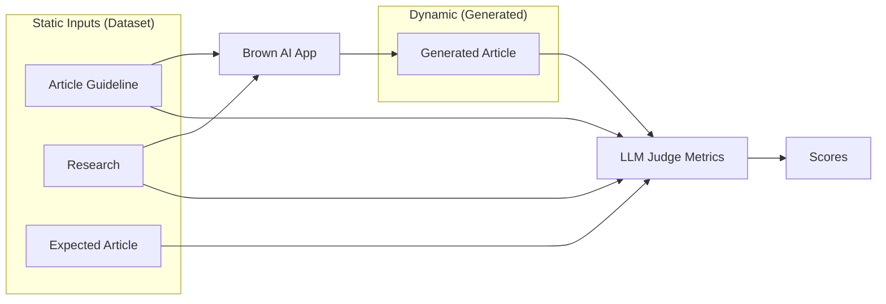
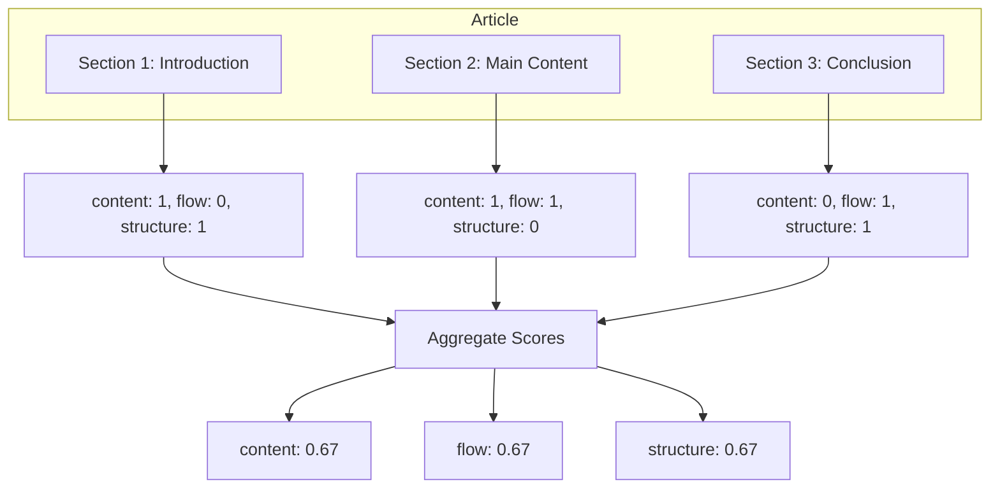
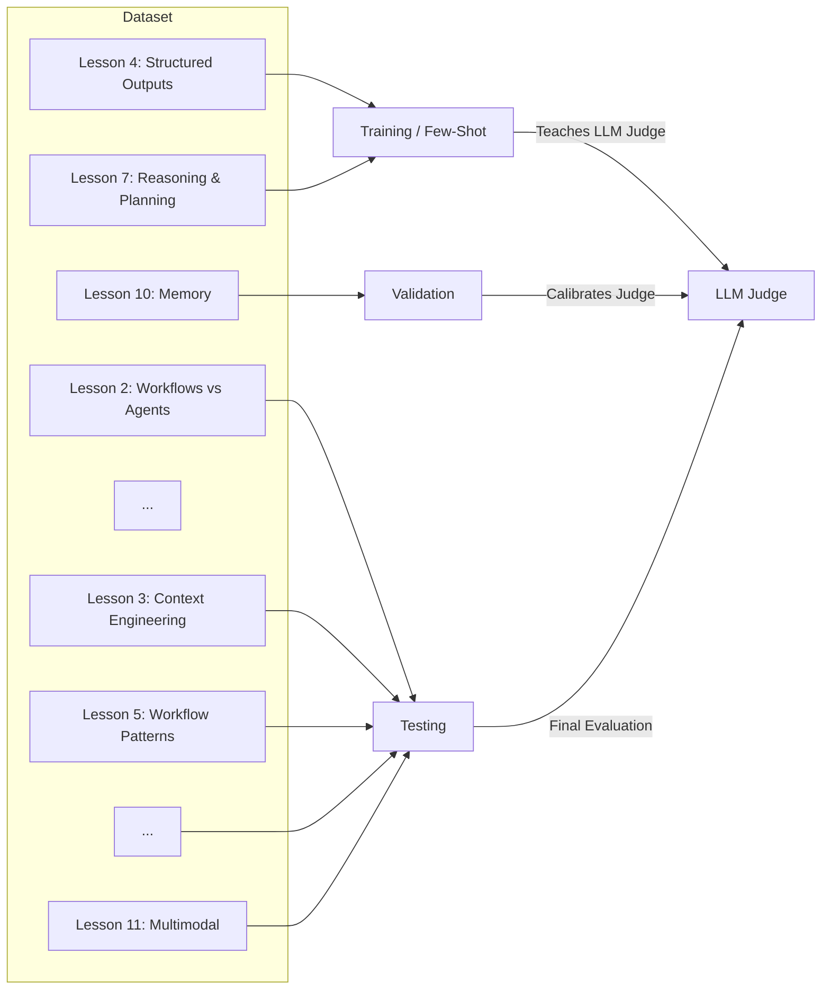

# Research

<note_on_our_process_of_labeling_the_few_shot_examples_for_the_llm_judges>
## Our Process Of Creating Training Few Shot Examples For the LLM Judges

I prepared the template for labeling 2 articles (Lesson 4 and Lesson 7) on the guideline adherence and research anchoring metrics which don't require a ground truth, but just:
the article guideline
the research file
the generated article
We will label both metrics as the User Intent
Data wise, I prepared everything you need in the GitHub: https://github.com/towardsai/course-agents-writing/tree/main/src/brown/evals/metrics/user_intent/examples
Also, I prepared a template in Google Sheets: https://docs.google.com/spreadsheets/d/1X0jmAvl8BueOwBATVNXzM2HJmFIEIHYYi7-GCYpj_kU/edit?usp=sharing
Under the following sheets:
Lesson 4 - User Intent Metric
Lesson 7 - User Intent Metric
IMPORTANT NOTE: The metrics are already pre-filled by the LLM to help you do this faster. But they are FAR FROM BEING CORRECT. The whole purpose of this labeling is to provide a few-shot example to better guide the LLM judge while doing the evaluation.  The score is binary: 0 or 1. So that's an easy shot. But the most important part of the labeling is the reason section where we always describe what's correct or wrong about the score. Even if we provide a score of 0, because it's binary, some parts of the sections will be correct, which we have to specify, along specifying while we provided a score of 0. Also, it's super important to be detailed here, but not tooo detailed. Like 1-2 sentences per reason should be enough (the current results from the LLM are pretty verbose, so we can shorten them up). These are super important, because these will help us during debugging and monitoring. My plan is to use this LLM judge to automate part of the rewing process. So if we do this right, we automate part of our boring part of the job.
To understand what exactly goes under the article guideline adherenence and research anchoring metrics, read the system prompt. You can find all the instructions there. If you think something is missing, PLEASE write that down as well so I can adapt the system prompt as well: https://github.com/towardsai/course-agents-writing/blob/main/src/brown/evals/metrics/user_intent/prompts.py
In the same Google Sheet, you can find more examples on how I labeled another metric, based on GT, in case you want to see more examples on how to write the Reason. You can find them under:
Lesson 4 - Follows GT Metric
Lesson 7 - Follows GT Metric
Also, what is CRITICAL, is to take the provided generated article from GitHub, and add more noise to it. The goal of these examples is to be as varried as possible. As the scoring is done per section, you can see each section as a sample. Thus, take few samples, and break them, such as:
add random ideas that are not anchored to the research
drop ideas present in the guideline
add more ideas that are not present in the guideline
add new sections
remove a section
You get the gist. The idea is to have as many use cases as possible in these examples.
Thus, take the generated articles that I prepared you in GitHub: https://github.com/towardsai/course-agents-writing/tree/main/src/brown/evals/metrics/user_intent/examples
Copy them somewhere you can later share with me, and tweak them as you see with. Afterward, I will take care of brining all your effort into the code.


 For this task and adding the noise and imperfections to articles - do we end up with just 1 new version of each of these articles that we will keep saved?
And then we update and improve the Binary Scores and Reasons based just on our updated article?
Do you want us to aim for roughly 50-50 0s and 1s scores after we tweak the article?

Yes, exactly. I will store the updated article in GitHub as it will be used directly by the LLM judge when constructing the prompt.
When adding noise to the article, it doesn't need to be perfect like a "production article". That's even better, as we can reflect the imperfections during the labeling.
Thus, adding noise with an LLM gets the job done.
1:44
I would say 70% 0s and 30% 1s as 0s usually contain more information
Also, when labeling something with a 0 is important in the reason to quickly enumerate what is correct (without too many details) and what it did wrong as it got the 0 score. Usually, it's enough to enumerate the first thing it got wrong.
</note_on_our_process_of_labeling_the_few_shot_examples_for_the_llm_judges>

## Research Results

<details>
<summary>How to create and use train-validation-test splits for developing and calibrating LLM-based evaluation systems?</summary>

### Source [6]: https://www.lightly.ai/blog/train-test-validation-split

Query: How to create and use train-validation-test splits for developing and calibrating LLM-based evaluation systems?

Answer: The train-test-validation split divides a dataset into three subsets: training data to teach the model patterns, validation data to fine-tune hyperparameters without touching the test set, and test data for unbiased final evaluation on unseen data. This prevents overfitting and ensures generalization to real-world scenarios. Training set must be large and diverse to cover scenarios and avoid underfitting or bias. Validation set is used specifically for hyperparameter tuning. Common practice is to use three parts over two (train-test only) to avoid repeated test set use, which biases estimates. Splitting methods include random, stratified, or time-based (e.g., for future predictions with rolling window or walk-forward validation to prevent data leakage). For active learning, use diversity and threshold strategies to select subsets like 500 samples (70-80% of data) for train, repeating with different strategies for validation and test. Ensure data quality and diversity in each set impacts model performance. Final model is evaluated on test set before deployment.

-----

-----

### Source [7]: https://www.v7labs.com/blog/train-validation-test-set

Query: How to create and use train-validation-test splits for developing and calibrating LLM-based evaluation systems?

Answer: Split dataset into training set (80% typically) to learn features/patterns through epochs, validation set (10%) to evaluate after each epoch, prevent overfitting, and tune hyperparameters, and test set (10%) for final unbiased accuracy assessment. Training set needs diversification for all scenarios. Validation guides training path via metrics, loss calculation, and hyperparameter adjustments. Split ratios depend on dataset size, model complexity, hyperparameters (larger validation if many to tune), data dimensions (larger train for high dimensions), and use case (frequent validation for high-stakes like medical). Example k-fold like method: divide into 5 parts, rotate one as validation with others as train. Avoid overemphasis on validation/test metrics alone. General starting split: 80/10/10, adjustable per factors like model structure.

-----

-----

### Source [8]: https://kili-technology.com/blog/training-validation-and-test-sets-how-to-split-machine-learning-data

Query: How to create and use train-validation-test splits for developing and calibrating LLM-based evaluation systems?

Answer: Training set teaches model hidden patterns iteratively. Validation set evaluates trained model on different samples, assesses performance, fine-tunes parameters/hyperparameters iteratively before final test. Test set provides unbiased real-world performance estimate, separate from validation to avoid overfitting influence during tuning. Always need test set even with validation. Ratios depend on use case; e.g., 80:20 train-test split, then subset training for validation via cross-validation (randomly choose proportion from train as validation, rest train, iterate). Procedure improves with experience.

-----

-----

### Source [9]: https://galileo.ai/blog/llm-cross-validation-techniques

Query: How to create and use train-validation-test splits for developing and calibrating LLM-based evaluation systems?

Answer: This source discusses advanced cross-validation techniques with implementation codes for optimizing Large Language Models (LLMs), relevant to handling train-validation-test splits in LLM development by providing methods to ensure robust evaluation and prevent overfitting specific to LLMs.

-----

-----

### Source [10]: https://community.openai.com/t/whats-the-best-train-validate-split-for-fine-tuning/526369

Query: How to create and use train-validation-test splits for developing and calibrating LLM-based evaluation systems?

Answer: For fine-tuning models like those from OpenAI, retain 5%-20% of dataset for evaluation (validation), though some argue fewer samples suffice externally. This split supports train-validation-test practices in LLM fine-tuning to assess performance reliably.

-----

-----

### Source [11]: https://newsletter.pragmaticengineer.com/p/evals

Query: How to create and use train-validation-test splits for developing and calibrating LLM-based evaluation systems?

Answer: In LLM evaluations (evals), use a dev set for development and calibration, with a separate test set to measure results and ensure no overfitting on dev set. If test scores are materially worse, indicates overfitting; this split is key for reliable LLM-based evaluation systems.

-----

-----

### Source [12]: https://docs.databricks.com/aws/en/generative-ai/tutorials/ai-cookbook/evaluate-define-quality

Query: How to create and use train-validation-test splits for developing and calibrating LLM-based evaluation systems?

Answer: For evaluation sets in generative AI (including LLM-based systems), split into training (~70%), test, and validation sets to avoid overfitting. Training set for model learning, validation for tuning, test for final unbiased quality assessment in defining 'quality' metrics.

-----

</details>

<details>
<summary>What are standard methods for measuring the reliability and consistency of LLM judges against human evaluators?</summary>

### Source [13]: https://arxiv.org/abs/2506.13639

Query: What are standard methods for measuring the reliability and consistency of LLM judges against human evaluators?

Answer: LLM-as-a-Judge enables automatic evaluation using LLMs as evaluators, but its reliability remains uncertain. The study analyzes key factors affecting trustworthiness, focusing on alignment with human judgments and evaluation consistency. Using BIGGENBench and EvalBiasBench, they examine effects of evaluation design, decoding strategies, and Chain-of-Thought (CoT) reasoning. Results indicate evaluation criteria are critical for reliability. Non-deterministic sampling improves alignment with human preferences over deterministic evaluation. CoT reasoning provides minimal gains when clear evaluation criteria are present.

-----

-----

### Source [14]: https://www.ai21.com/glossary/foundational-llm/llm-as-a-judge/

Query: What are standard methods for measuring the reliability and consistency of LLM judges against human evaluators?

Answer: Evaluating LLM-as-a-Judge involves assessing reliability compared to human reviewers using metrics like agreement rate (percentage of cases where LLM and human raters agree, effective for binary and preference tasks) and Cohen’s Kappa / Fleiss’ Kappa (inter-rater reliability beyond chance, used in multi-rater studies, more robust than raw agreement). Benchmark studies show well-prompted LLM judges like GPT-4 achieve strong alignment with human judgments, matching or exceeding human-human agreement (~80% in Arena for preference comparisons). LLM judges offer high consistency by applying the same rubric across outputs. Agreement with human reviewers and consistency across repeated trials or datasets are key considerations for accuracy.

-----

-----

### Source [15]: https://cameronrwolfe.substack.com/p/llm-as-a-judge

Query: What are standard methods for measuring the reliability and consistency of LLM judges against human evaluators?

Answer: Reliability of LLM judges is evaluated through alignment with human judgments. Methods include pointwise scoring (judge assigns a score like Likert scale to a single response) and reference-guided scoring (judge uses a reference solution alongside question and response for scoring). GPT-4 as evaluator aligns reasonably with humans in determining which of two responses is closer to a gold answer. Human evaluation involves comparing outputs pairwise, picking preferred responses, which can be automated with LLMs. Biases like verbosity (favoring longer outputs) and self-enhancement affect reliability, particularly on complex reasoning/math.

-----

-----

### Source [72]: https://arxiv.org/abs/2506.13639

Query: What are standard methods for measuring the reliability and consistency of LLM judges against human evaluators?

Answer: The paper analyzes key factors affecting the trustworthiness of LLM-as-a-Judge, focusing on alignment with human judgments and evaluation consistency. Using BIGGENBench and EvalBiasBench datasets, it studies effects of evaluation design, decoding strategies, and Chain-of-Thought (CoT) reasoning. Results show that evaluation criteria are critical for reliability: clear criteria significantly improve alignment with human preferences. Non-deterministic sampling (e.g., temperature >0) improves alignment over deterministic evaluation (temperature=0), as it reduces bias and increases agreement with humans. CoT reasoning provides minimal gains when clear evaluation criteria are present, but can help in ambiguous cases. Consistency is measured via agreement rates with human judgments on open-ended tasks. The study emphasizes designing prompts with precise rubrics to enhance reliability against human evaluators.

-----

-----

### Source [73]: https://cameronrwolfe.substack.com/p/llm-as-a-judge

Query: What are standard methods for measuring the reliability and consistency of LLM judges against human evaluators?

Answer: Reliability of LLM judges is measured by agreement rates with human evaluators. GPT-4 achieves 80% agreement with human preference scores, matching inter-human agreement rates. Methods include pointwise scoring (judge assigns Likert scale 1-5 to single response) and reference-guided scoring (includes reference solution). Pairwise comparison: judge picks better of two responses. To measure consistency and mitigate biases (position, verbosity, self-enhancement), use position switching, few-shot examples for score calibration, provide correct answers for math/reasoning, and ensemble multiple models (Claude, Gemini, GPT-4). GPT-4 judges semantic similarity better than ROUGE/BLEU, aligning reasonably with humans, though it favors own outputs (87.76% vs. humans' 47.61%). Pointwise scoring on Likert scale determines preference via scores. Human-LLM agreement tested via pairwise preferences and scoring.

-----

-----

### Source [74]: https://www.confident-ai.com/blog/why-llm-as-a-judge-is-the-best-llm-evaluation-method

Query: What are standard methods for measuring the reliability and consistency of LLM judges against human evaluators?

Answer: LLM-as-a-Judge alignment with humans is tested via aggregated annotated data (thumbs up/down), splitting into halves and computing agreement differences. Single-output referenceless uses rubric (accuracy, coherence, completeness, tone) for 0-1 score. Single-output reference-based includes expected output for calibration and consistency. Pairwise comparison: two candidates in random order, criteria (accuracy, helpfulness, tone); relative judgments avoid absolute scoring biases, effective for A/B testing. Testing shows high alignment with human reviewers for both single-output and arena (pairwise) methods, implemented via G-Eval. Inputs: prompt, output, context; judge returns metric score.

-----

-----

### Source [75]: https://www.evidentlyai.com/llm-guide/llm-as-a-judge

Query: What are standard methods for measuring the reliability and consistency of LLM judges against human evaluators?

Answer: Standard methods for LLM-as-a-judge include evaluating correctness against reference: LLM compares response to 'golden' answer, labels 'Correct' or 'Incorrect', alternative to ROUGE (word overlap) or semantic similarity (embeddings). Faithfulness judge: checks if response is grounded in context, avoids hallucinations, labels 'Faithful' or 'Not Faithful'. These offline evaluations assess consistency via reference comparison, suitable for iteration and regression testing. Prompts specify meaning conveyance despite wording differences, and adherence to context without contradictions or inventions.

-----

-----

### Source [76]: https://research.aimultiple.com/large-language-model-evaluation/

Query: What are standard methods for measuring the reliability and consistency of LLM judges against human evaluators?

Answer: For human evaluation consistency against LLMs, use multiple human judges with inter-rater reliability checks to reduce subjectivity. Crowd-sourcing provides diverse perspectives and scale. Combine with multiple metrics: fluency, coherence, relevance, diversity, context understanding. Clear guidelines and standardized criteria improve human evaluation objectivity, indirectly benchmarking LLM judges.

-----

</details>

<details>
<summary>What are common pitfalls and mitigation strategies when implementing LLM-as-a-judge evaluation pipelines?</summary>

### Source [22]: https://www.patronus.ai/llm-testing/llm-as-a-judge

Query: What are common pitfalls and mitigation strategies when implementing LLM-as-a-judge evaluation pipelines?

Answer: Common pitfalls in LLM-as-a-judge include poor reasoning, undefined evaluation criteria, vague output formats, and biases. To mitigate, engineers must address three layers: how judges reason, what they evaluate, and how assessments are structured. Effective judges incorporate input contextualization (understanding task, criteria, constraints), comparison to standards, multi-step reasoning (breaking down judgments), explanation generation (providing rationales), and score synthesis (distilling to quantitative scores). Define evaluation criteria explicitly, e.g., 'Check if the answer includes all key data points from the source.' Specify output formats, e.g., 'Return ‘Pass’ or ‘Fail’ followed by a one-sentence rationale.' Mitigate biases by instructing the judge appropriately. Build iteratively: in calibration, use 5–10 expert examples in prompts. Example: Input 'Is ibuprofen safe during pregnancy?' Model output 'Yes, it's generally safe in all trimesters.' Expert critique 'Fail – Avoids stating risks in third trimester. Source: NIH guidelines.' This iterative process ensures reliability.

-----

-----

### Source [23]: https://www.evidentlyai.com/llm-guide/llm-as-a-judge

Query: What are common pitfalls and mitigation strategies when implementing LLM-as-a-judge evaluation pipelines?

Answer: Pitfalls include insufficient setup time, poor prompt design, lack of alignment with ground truth, and degradation over time without monitoring. Mitigation requires treating LLM judge creation as a small ML project: iterative design like refining product prompts, with its own evaluation. Process: Step 1. Define evaluation scenario (correctness, tone, etc.; evaluate output, comparisons, or transcripts). Step 2. Create small diverse dataset (real or synthetic, including challenging cases). Step 3. Manually label dataset as ground truth to clarify expectations. Step 4. Craft evaluation prompt based on labels, accounting for specific errors. Step 5. Evaluate judge on dataset, compare to ground truth, iterate by refining prompts, adding criteria. Adjust standards with real data patterns. It takes work: define criteria, label datasets, prompt design, periodic checks. Combine with manual labeling, user feedback, ML models, rule-based checks, or metrics like ROUGE when references available.

-----

-----

### Source [24]: https://caylent.com/blog/a-comprehensive-guide-to-llm-evaluations

Query: What are common pitfalls and mitigation strategies when implementing LLM-as-a-judge evaluation pipelines?

Answer: Pitfalls involve uncalibrated judges leading to unreliable evaluations and low agreement with humans. Mitigation: Implement multi-tiered approach balancing speed, cost, accuracy (programmatic metrics primary for dev, LLM-judge secondary, human for critical). Best practices: Clear criteria and rubrics. Use Chain-of-Thought (CoT) prompting: instruct 'think step-by-step,' output rationale for transparency and reliability. Establish ground truth, run judge on examples, compare to human labels, analyze discrepancies, refine prompts iteratively (clarify criteria, add examples, adjust format) until 85-90% agreement. For calibration, domain experts evaluate 200 golden dataset examples, compare to judge, refine to 85-90% agreement, recalibrate periodically. Evaluation scenarios table: Development (programmatic + selective judge), Pre-release (all layers with human review of flags).

-----

-----

### Source [25]: https://www.montecarlodata.com/blog-llm-as-judge/

Query: What are common pitfalls and mitigation strategies when implementing LLM-as-a-judge evaluation pipelines?

Answer: Pitfalls include subjective big decisions without decomposition and lack of structured rubrics leading to inconsistent judgments. Mitigation best practices: Step decomposition—break into smaller criteria and reasoning steps, e.g., Answer Relevance template with steps: analyze input, examine output, check direct address, irrelevant info, completeness, conciseness. Evaluation template (G-Eval style): Provide scoring scale, rubric, chain-of-thought from task intro and criteria. Example Answer Relevance criteria: 1. Analyze input request. 2. Examine output info. 3. Direct address. 4. Irrelevant/off-topic. 5. Completeness. 6. Conciseness. Task Completion: 1. Identify task. 2. Requirements/constraints. 3. Fulfill each. 4. Format match. 5. Completeness. 6. Quality. These pre-built templates enhance reliability in AI monitoring.

-----

-----

### Source [26]: https://newsletter.pragmaticengineer.com/p/evals

Query: What are common pitfalls and mitigation strategies when implementing LLM-as-a-judge evaluation pipelines?

Answer: Pitfalls include misaligned LLM judges lacking validation against human expertise, leading to untrustworthy evaluations. Mitigation: Align the judge by validating expertise against humans using metrics like True Positive Rate. Keep trust through ongoing calibration to maintain reliability.

-----

</details>

<details>
<summary>What are best practices for creating and curating few-shot examples to train an LLM judge?</summary>

### Source [33]: https://www.montecarlodata.com/blog-llm-as-judge/

Query: What are best practices for creating and curating few-shot examples to train an LLM judge?

Answer: Few-shot prompting for LLM-as-judge involves providing one or more examples of good or bad outputs within the prompt to guide evaluation. Replace 'shot' with 'example' for simplicity. More examples do not always improve performance; research on LLM code evaluation shows major models perform best with one-shot prompting, declining with more examples. Example prompt: 'You are an expert evaluator of response relevance. Rate each answer 1–5 for relevance.' Followed by Example 1: User asks for headphone refund, Agent confirms within return window, Score: 5. Step decomposition complements few-shot by breaking subjective decisions into smaller criteria and reasoning steps, as in the 'Answer Relevance' template. Constrain outputs to structured formats like JSON to reduce natural language ambiguity, standardizing evaluations. This aids LLM judges in consistent scoring and faster human review of alerts.

-----

-----

### Source [34]: https://www.evidentlyai.com/llm-guide/llm-as-a-judge

Query: What are best practices for creating and curating few-shot examples to train an LLM judge?

Answer: For LLM-as-judge setup, create a small, diverse dataset to test the judge, including examples from experiments, production data, or synthetic cases mimicking expected inputs, especially challenging ones. Decompose evaluations into single quality dimensions (e.g., tone, clarity, format adherence, conciseness, politeness, PII presence) to improve accuracy and verifiability, avoiding complex reasoning. Add few-shot examples to prompts for nuanced criteria: start with general instructions defining 'Good' and 'Bad,' then provide input-judgment examples of both. This few-shot learning helps LLMs apply criteria, especially less capable models, per 'Language Models are Few-Shot Learners' (Brown et al., 2020). Test example impact, as skewed or biased examples can influence decisions negatively. Building requires defining criteria, designing prompts, labeling datasets; monitor and update periodically.

-----

-----

### Source [35]: https://hamel.dev/blog/posts/llm-judge/

Query: What are best practices for creating and curating few-shot examples to train an LLM judge?

Answer: To create few-shot prompts for LLM judges, ensure critiques are detailed for use in prompts. Start with around 30 examples, continuing until no new failure modes appear and learning plateaus. Use expert-labeled data: build LLM judge prompt from expert examples, test against expert judgments, refine until satisfactory agreement. Perform error analysis on unseen data, calculating error rates across dimensions, identifying patterns, fixing issues, and iterating. Process repeats periodically. Leverage LLM judge to curate data for fine-tuning primary models. Prefer prompting over fine-tuning judges, focusing effort on main LLM; fine-tune specialized guardrails if needed. Ensure consistency when updating models by re-running the process and measuring agreement with domain experts.

-----

-----

### Source [36]: https://docs.langchain.com/langsmith/create-few-shot-evaluators

Query: What are best practices for creating and curating few-shot examples to train an LLM judge?

Answer: Few-shot examples improve LLM-as-judge evaluators by adding them to prompts via {{Few-shot examples}} variable, auto-creating a dataset populated with examples upon corrections. At runtime, examples guide outputs to align with human preferences. Specify number of examples (default 5); lower for long examples to save tokens, higher for short ones. If more examples exist, randomly select. This setup helps evaluators better match preferences through iterative corrections.

-----

-----

### Source [37]: https://cameronrwolfe.substack.com/p/llm-as-a-judge

Query: What are best practices for creating and curating few-shot examples to train an LLM judge?

Answer: Best practices for LLM-as-judge include providing few-shot examples to demonstrate the natural distribution of scores, aiding calibration of the judge's internal scoring mechanism.

-----

</details>

<details>
<summary>How can one systematically measure and improve the alignment between an LLM judge's evaluations and human-provided labels?</summary>

### Source [39]: https://docs.databricks.com/aws/en/mlflow3/genai/eval-monitor/align-judges

Query: How can one systematically measure and improve the alignment between an LLM judge's evaluations and human-provided labels?

Answer: Judge alignment teaches LLM judges to match human evaluation standards through systematic feedback, transforming generic evaluators into domain-specific experts and improving agreement with human assessments by 30 to 50 percent compared to baseline judges. The process follows a three-step workflow: 1) Generate initial assessments by creating a judge and evaluating traces to establish a baseline. 2) Collect human feedback where domain experts review and correct judge assessments. 3) Align and deploy using the SIMBA optimizer to improve the judge based on human feedback. Once sufficient human feedback is collected (minimum 10 traces recommended), align the judge using MLflow's default SIMBAAlignmentOptimizer from DSPy. Retrieve traces with both judge and human assessments using mlflow.search_traces, then call initial_judge.align(optimizer, traces_for_alignment). Enable detailed SIMBA logging for verbose output. Validate alignment by comparing performance before and after: define a test function that computes original_accuracy, aligned_accuracy, and improvement by checking agreement with human feedback.value on test_traces. For example, iterate over test_traces, evaluate with original and aligned judges, count matches to human labels, and calculate percentages.

-----

-----

### Source [40]: https://cameronrwolfe.substack.com/p/llm-as-a-judge

Query: How can one systematically measure and improve the alignment between an LLM judge's evaluations and human-provided labels?

Answer: To improve alignment between LLM judges and human labels, use techniques like the position switching trick, providing few-shot examples to demonstrate the natural distribution of scores and calibrate the judge’s internal scoring mechanism, and including correct answers to difficult math and reasoning questions in the prompt as references. Employ several different models as judges (e.g., Claude, Gemini, GPT-4) to reduce self-enhancement bias. In LIMA, alignment is studied via supervised finetuning with limited data (1,000 curated examples), achieving strong performance under the Superficial Alignment Hypothesis where finetuning optimizes output format. Evaluation uses both human and LLM-powered methods: generate single responses per prompt, have humans anonymously compare outputs and pick preferences, which can be automated by LLM judges.

-----

-----

### Source [41]: https://www.confident-ai.com/blog/why-llm-as-a-judge-is-the-best-llm-evaluation-method

Query: How can one systematically measure and improve the alignment between an LLM judge's evaluations and human-provided labels?

Answer: LLM-as-a-Judge achieves high alignment with human reviewers, as shown by testing at Confident AI aggregating customer annotated test cases (thumbs up/down), splitting data, and calculating agreement differences between humans and LLM-as-a-judge (regular/arena based, implemented via G-Eval). Use reference-based metrics where the judge gets the expected output alongside the generated output to anchor and calibrate evaluations for more consistent scores. Inputs include original prompt, generated output, and context; the judge returns a metric score (0-1) based on parameters, e.g., for summary coherence. Methods include single-output reference-based evaluation.

-----

-----

### Source [42]: https://www.patronus.ai/llm-testing/llm-as-a-judge

Query: How can one systematically measure and improve the alignment between an LLM judge's evaluations and human-provided labels?

Answer: To build a reliable LLM Judge mimicking human judgment for better alignment, address three layers: how judges reason, what they evaluate, and how assessments are structured. Incorporate input contextualization (understand task, criteria, constraints), comparison to standards (explicit/implicit quality references), multi-step reasoning (break down judgments), explanation generation (rationales for evaluations), and score synthesis (distill to quantitative scores). Use prompt engineering with clear criteria, scoring tools like Likert scales.

-----

-----

### Source [43]: https://hamel.dev/blog/posts/llm-judge/

Query: How can one systematically measure and improve the alignment between an LLM judge's evaluations and human-provided labels?

Answer: Systematically measure alignment by collecting metrics on agreement between domain expert (human) and LLM judge evaluations on user interactions, indicating trustworthiness. After acceptable agreement, apply judge to real/synthetic data and perform error analysis: calculate error rates for different data dimensions on unseen data to avoid bias. Steps include creating the LLM judge, gathering judgments, then error analysis post-deployment.

-----

-----

### Source [44]: https://docs.ragas.io/en/stable/howtos/applications/align-llm-as-judge/

Query: How can one systematically measure and improve the alignment between an LLM judge's evaluations and human-provided labels?

Answer: For judge alignment, define two evaluation metrics: primary metric accuracy (LLM judge evaluates responses as pass/fail), and another metric. Use these to align the LLM judge with human-provided labels through the process described.

-----

-----

### Source [45]: https://www.evidentlyai.com/llm-guide/llm-as-a-judge

Query: How can one systematically measure and improve the alignment between an LLM judge's evaluations and human-provided labels?

Answer: Measure alignment via offline evaluation of correctness using reference answers: LLM judge compares generated response to 'golden' reference, suitable for experimental iteration and regression testing. For Q&A, check similarity to previously approved answers.

-----

-----

### Source [46]: https://galileo.ai/blog/llm-as-a-judge-guide-evaluation

Query: How can one systematically measure and improve the alignment between an LLM judge's evaluations and human-provided labels?

Answer: Use LLM-as-a-Judge methods like Single Output Scoring (evaluate individual responses against criteria) and Pairwise Comparison (assess multiple outputs to pick better one) for text quality, accuracy, relevance. Improve alignment with hybrid approach: traditional metrics for simple tasks, LLM judges for complex context-aware assessments, human evaluation for validation of critical judgments to leverage strengths and mitigate weaknesses.

-----

</details>

<details>
<summary>What are common techniques to ensure the stability and reduce the variance of an LLM judge's output across multiple runs?</summary>

### Source [47]: https://galileo.ai/blog/llm-as-a-judge-guide-evaluation

Query: What are common techniques to ensure the stability and reduce the variance of an LLM judge's output across multiple runs?

Answer: To address non-determinism in LLM-as-a-Judge evaluations and ensure stability while reducing variance, shift eval methodology to assess a range of outputs aligning with expected outcomes rather than seeking a single correct response. Develop frameworks that measure acceptable variations. Run multiple evaluations with the same input and analyze the distribution of responses instead of individual outputs. For critical applications needing consistency, implement temperature controls: set temperature closer to 0 to increase determinism and reduce randomness. Use seed values where available to reproduce specific outputs, though not universally supported across LLM platforms. These balance non-determinism's creativity with reliable metrics. Employ prompt engineering: create clear, explicit prompts with sufficient context and specific instructions to guide toward consistent performance. Consider multiple prompting strategies for comprehensive understanding and reliable benchmarks less influenced by phrasing.

-----

-----

### Source [48]: https://www.patronus.ai/llm-testing/llm-as-a-judge

Query: What are common techniques to ensure the stability and reduce the variance of an LLM judge's output across multiple runs?

Answer: To build a reliable LLM Judge addressing stability and variance, focus on three layers: how judges reason, what they evaluate, and how assessments are structured. Incorporate input contextualization so the judge understands task, criteria, and constraints before evaluation. Use comparison to explicit or implicit quality standards. Apply multi-step reasoning by breaking complex judgments into component assessments. Generate explanations providing rationales justifying evaluations. Synthesize scores by distilling qualitative assessments into quantitative ones when needed.

-----

-----

### Source [49]: https://www.confident-ai.com/blog/why-llm-as-a-judge-is-the-best-llm-evaluation-method

Query: What are common techniques to ensure the stability and reduce the variance of an LLM judge's output across multiple runs?

Answer: Techniques to improve LLM judges and reduce variance include Chain-of-Thought (CoT) prompting, in-context learning, and swapping positions for pairwise judges. Use single output scoring without reference against a predefined rubric (accuracy, coherence, completeness, tone). For reference-based single output scoring, provide an expected output as an anchor alongside the generated output to calibrate evaluation and achieve more consistent, reproducible scores. Pairwise comparison lets the judge see two outputs for the same input and pick the better one based on criteria, aiding model/prompt comparisons.

-----

-----

### Source [50]: https://arxiv.org/html/2508.02994v1

Query: What are common techniques to ensure the stability and reduce the variance of an LLM judge's output across multiple runs?

Answer: To improve stability and reduce variance in LLM-as-a-Judge, use committee and ensemble-based evaluators: combine judgments from multiple models (e.g., GPT-4.1 and another strong model) and aggregate scores, or ensemble voting among several prompts or few-shot examples to stabilize a single model’s outputs. This is orthogonal to debate frameworks and enhances robustness. Pairwise evaluation, where the judge compares two outputs and decides which is better, supports win-rate metrics and tends to be more stable than pointwise.

-----

-----

### Source [51]: https://www.montecarlodata.com/blog-llm-as-judge/

Query: What are common techniques to ensure the stability and reduce the variance of an LLM judge's output across multiple runs?

Answer: Constrain outputs to structured formats like JSON to remove ambiguity, standardize evaluation, and allow more consistent scoring by the LLM judge. Apply score smoothing to raw scores (e.g., 1-5) to reduce random fluctuations, focusing on broader signal over noise from hallucinations. Leverage anomaly detection to track consistent score drops over time (hourly, six-hour, daily) rather than single evaluations. Distinguish 'soft' monitors (trend-based) from 'hard' ones (immediate threshold breaches for deterministic metrics).

-----

-----

### Source [52]: https://cameronrwolfe.substack.com/p/llm-as-a-judge

Query: What are common techniques to ensure the stability and reduce the variance of an LLM judge's output across multiple runs?

Answer: Ensure deterministic results with low temperature setting (e.g., 0.1). Pairwise comparison is more stable than pointwise scoring, as absolute scores fluctuate more than relative preferences; calculate win-rates between models. Randomize position of model outputs in prompts or sample multiple preference scores per position. Measure logprobs of responses instead of binary preferences. Use stronger evaluators like GPT-4-Turbo. Simplify prompts: shorten instructions, output single token.

-----

-----

### Source [53]: https://eugeneyan.com/writing/llm-evaluators/

Query: What are common techniques to ensure the stability and reduce the variance of an LLM judge's output across multiple runs?

Answer: Pairwise comparisons lead to more stable results and smaller differences between LLM judgments and human annotations compared to direct assessment, reducing variance across runs.

-----

-----

### Source [77]: https://galileo.ai/blog/llm-as-a-judge-guide-evaluation

Query: What are common techniques to ensure the stability and reduce the variance of an LLM judge's output across multiple runs?

Answer: To address non-determinism in LLM-as-a-Judge evaluations and ensure stability while reducing variance across multiple runs, several techniques are recommended. Run multiple evaluations with the same input and analyze the distribution of responses rather than individual outputs to account for acceptable variations and develop evaluation frameworks that measure this range. For critical applications requiring consistency, implement temperature controls by setting the temperature parameter closer to 0 to increase determinism and reduce randomness in outputs, while higher values promote diversity. Use seed values where available to reproduce specific outputs, though support varies across LLM platforms; these balance non-determinism's creative benefits with reliable metrics. Employ prompt engineering with clear, explicit prompts providing sufficient context and specific instructions to guide the model toward more consistent performance and mitigate sensitivity to phrasing. Consider a range of prompting strategies rather than a single approach for comprehensive, reliable benchmarks less influenced by question phrasing.

-----

-----

### Source [78]: https://www.patronus.ai/llm-testing/llm-as-a-judge

Query: What are common techniques to ensure the stability and reduce the variance of an LLM judge's output across multiple runs?

Answer: To build a reliable LLM Judge with stable outputs and reduced variance, address three layers: how judges reason, what they evaluate, and how assessments are structured. Incorporate input contextualization so the judge understands the task, criteria, and constraints before evaluation. Use comparison to explicit or implicit quality standards for the task. Apply multi-step reasoning by breaking down complex judgments into component assessments. Generate explanations or rationales justifying evaluations. Synthesize scores by distilling qualitative assessments into quantitative scores when needed. These elements, including clear criteria and scoring tools like Likert scales, mimic human judgment through prompt engineering for reliability.

-----

-----

### Source [79]: https://www.confident-ai.com/blog/why-llm-as-a-judge-is-the-best-llm-evaluation-method

Query: What are common techniques to ensure the stability and reduce the variance of an LLM judge's output across multiple runs?

Answer: Techniques to improve stability and reduce variance in LLM judges include Chain-of-Thought (CoT) prompting, in-context learning, and swapping positions for pairwise judges. Single-output scoring without reference uses a predefined rubric (e.g., accuracy, coherence, completeness, tone) based on input and optional retrieval context. Reference-based single-output scoring provides an expected output as an anchor alongside the generated output to calibrate evaluation and yield more consistent, reproducible scores. Pairwise comparison presents two outputs for the same input, having the judge pick the better one per criteria, aiding model/prompt comparisons. These methods enhance judge reliability.

-----

-----

### Source [80]: https://arxiv.org/html/2508.02994v1

Query: What are common techniques to ensure the stability and reduce the variance of an LLM judge's output across multiple runs?

Answer: To ensure stability and reduce variance in LLM judge outputs, use committee and ensemble-based evaluators by combining judgments from multiple models or runs. Aggregate scores from different LLM-as-judge models (e.g., GPT-4.1 and another strong model) or employ ensemble voting among several prompts or few-shot examples to stabilize a single model’s outputs. This approach improves evaluation robustness and is orthogonal to pointwise (scoring one output on criteria like coherence) or pairwise (comparing two outputs for win-rate) evaluations.

-----

-----

### Source [81]: https://www.montecarlodata.com/blog-llm-as-judge/

Query: What are common techniques to ensure the stability and reduce the variance of an LLM judge's output across multiple runs?

Answer: Best practices for LLM-as-judge stability include constraining outputs to structured formats like JSON to remove ambiguity in natural language, enabling standardized evaluation and reducing variance. Implement score smoothing by taking raw scores (e.g., 1-5) and reducing random fluctuations to focus on broader signal over noise from hallucinations. Use anomaly detection to track consistent score drops over periods (e.g., hour, six-hour, daily) rather than single evaluations. Differentiate 'soft' monitors (trending scores) from 'hard' ones (immediate thresholds for deterministic metrics like latency).

-----

-----

### Source [82]: https://cameronrwolfe.substack.com/p/llm-as-a-judge

Query: What are common techniques to ensure the stability and reduce the variance of an LLM judge's output across multiple runs?

Answer: To stabilize LLM-as-judge outputs and reduce variance, prefer pairwise comparison over pointwise scoring, as absolute scores fluctuate more than relative win-rates. Randomize model output positions in prompts or sample multiple preference scores per position. Measure logprobs of responses instead of binary preferences. Use stronger evaluators like GPT-4-Turbo. Simplify prompts by shortening instructions and outputting a single token. In setups like AlpacaFarm, generate outputs from baseline and evaluated models per instruction, then use LLM evaluator for pairwise quality rating to compute win-rates.

-----

-----

### Source [83]: https://arize.com/blog/evidence-based-prompting-strategies-for-llm-as-a-judge-explanations-and-chain-of-thought/

Query: What are common techniques to ensure the stability and reduce the variance of an LLM judge's output across multiple runs?

Answer: Evidence-based prompting with explanations improves LLM-as-judge stability by providing consistent scoring, visibility into decision criteria, and reusable supervision signals.

-----

-----

### Source [84]: https://eugeneyan.com/writing/llm-evaluators/

Query: What are common techniques to ensure the stability and reduce the variance of an LLM judge's output across multiple runs?

Answer: Pairwise comparisons lead to more stable results in LLM evaluators (LLM-as-judge) with smaller differences from human annotations compared to direct assessment methods.

-----

</details>

<details>
<summary>What are the most effective ways to structure prompts for an LLM judge that needs to evaluate multiple criteria using a binary scoring system for different sections of an article?</summary>

### Source [54]: https://www.evidentlyai.com/llm-guide/llm-as-a-judge

Query: What are the most effective ways to structure prompts for an LLM judge that needs to evaluate multiple criteria using a binary scoring system for different sections of an article?

Answer: LLM-as-a-judge evaluates one quality at a time rather than complex reasoning, improving accuracy and making results easier to verify and understand.[4] Add examples to the prompt if criteria are nuanced, starting with general instructions like 'Good' means... 'Bad' means..., followed by examples of good and bad responses to help the LLM apply criteria, especially for less capable models.[4] Use Chain-of-Thought Prompting or Zero-Shot-CoT by asking the model to explain reasoning or think step by step, providing both reasoning and result, which significantly improves evaluation quality.[4]

-----

-----

### Source [55]: https://blog.promptlayer.com/how-to-evaluate-llm-prompts-beyond-simple-use-cases/

Query: What are the most effective ways to structure prompts for an LLM judge that needs to evaluate multiple criteria using a binary scoring system for different sections of an article?

Answer: For LLM as a Judge Rubric, be prescriptive by documenting all requirements for good responses and creating prompts or code blocks that test each requirement dimension.[3] This method requires sufficient examples in evaluation prompts to avoid fluctuating scores that do not reflect actual performance; without them, it proves least useful unless meticulously constructed.[3]

-----

-----

### Source [57]: https://www.patronus.ai/llm-testing/ai-llm-test-prompts

Query: What are the most effective ways to structure prompts for an LLM judge that needs to evaluate multiple criteria using a binary scoring system for different sections of an article?

Answer: Prompt evaluation criteria depend on the task; for reference-free testing without ground-truth, use LLM as a judge, which is also applicable in reference-based testing combined with deterministic metrics like accuracy or exact match for tasks such as sentiment classification.[2] LLM as a judge supports binary or fuzzy evaluations suited to various tasks.[2]

-----

-----

### Source [58]: https://aws.amazon.com/blogs/machine-learning/evaluating-prompts-at-scale-with-prompt-management-and-prompt-flows-for-amazon-bedrock/

Query: What are the most effective ways to structure prompts for an LLM judge that needs to evaluate multiple criteria using a binary scoring system for different sections of an article?

Answer: Implement LLM-as-a-judge where an LLM evaluates prompts based on answers produced according to predefined criteria, quantifying subjective evaluation into a numerical score for standardization and automation.[5] This systematic approach is one of the most common for prompt evaluation in the industry.[5]

-----

-----

### Source [85]: https://www.evidentlyai.com/llm-guide/llm-as-a-judge

Query: What are the most effective ways to structure prompts for an LLM judge that needs to evaluate multiple criteria using a binary scoring system for different sections of an article?

Answer: LLM-as-a-judge evaluates one quality or criterion at a time rather than complex reasoning, improving accuracy and making results easier to verify and understand. Add examples to the prompt if criteria are nuanced, starting with general instructions defining 'Good' and 'Bad', followed by examples of inputs and judgments to help the LLM apply criteria, especially for less capable models. Use Chain-of-Thought (CoT) prompting or Zero-Shot-CoT by asking the model to explain its reasoning step by step, which significantly improves evaluation quality by providing both reasoning and result in one response.

-----

-----

### Source [86]: https://blog.promptlayer.com/how-to-evaluate-llm-prompts-beyond-simple-use-cases/

Query: What are the most effective ways to structure prompts for an LLM judge that needs to evaluate multiple criteria using a binary scoring system for different sections of an article?

Answer: For LLM as a Judge Rubric, be prescriptive by documenting all requirements for good responses and creating prompts or code blocks that test each requirement dimension separately. This structured approach evaluates multiple criteria but requires meticulous construction to align with business needs. Without sufficient examples in evaluation prompts, scores can fluctuate wildly and fail to reflect actual performance, making this commonly recommended method least useful unless carefully built.

-----

-----

### Source [87]: https://www.patronus.ai/llm-testing/ai-llm-test-prompts

Query: What are the most effective ways to structure prompts for an LLM judge that needs to evaluate multiple criteria using a binary scoring system for different sections of an article?

Answer: Prompt evaluation criteria depend on the task; for reference-free testing without ground-truth, use LLM as a judge, which is not limited to reference-free but can combine with deterministic metrics in reference-based testing. LLM as a judge supports binary or fuzzy evaluations suited to tasks like summarization. Select prompts by iteratively refining with techniques like few-shot, zero-shot, and chain-of-thought, testing different phrases, structures, and detail levels to find the best for a specific LLM.

-----

-----

### Source [88]: https://mirascope.com/blog/prompt-evaluation

Query: What are the most effective ways to structure prompts for an LLM judge that needs to evaluate multiple criteria using a binary scoring system for different sections of an article?

Answer: For prompt evaluation with multiple criteria like bias, toxicity, or factual accuracy, use a single LLM-based judge providing a simple pass/fail (binary) rating instead of separate categories for each criterion. A 'pass' means the output meets standards across criteria; 'fail' indicates improvement needed. This simplifies evaluation while ensuring outputs satisfy task goals. Use version control for prompts and criteria, treating refinement as iterative optimization due to non-deterministic LLM outputs, akin to tuning machine learning model weights.

-----

-----

### Source [89]: https://aws.amazon.com/blogs/machine-learning/evaluating-prompts-at-scale-with-prompt-management-and-prompt-flows-for-amazon-bedrock/

Query: What are the most effective ways to structure prompts for an LLM judge that needs to evaluate multiple criteria using a binary scoring system for different sections of an article?

Answer: Implement LLM-as-a-judge for prompt evaluation, where an LLM scores prompts based on predefined criteria using numerical scores from answers produced by a certain model. This quantifies subjective evaluation systematically, standardizing and automating the prompting lifecycle. It is one of the most common industry approaches for evaluating prompts at scale across multiple criteria.

-----

</details>

<details>
<summary>How to systematically create and use train-validation-test splits for developing and calibrating LLM-based evaluation systems?</summary>

### Source [67]: https://www.lightly.ai/blog/train-test-validation-split

Query: How to systematically create and use train-validation-test splits for developing and calibrating LLM-based evaluation systems?

Answer: The train-test-validation split is a best practice in machine learning to ensure models generalize well. Training data teaches the model, validation fine-tunes it, and the test set provides an unbiased evaluation on unseen data. Understanding this split prevents overfitting and provides unbiased assessment. Typical split ratios include 70% training, 15% validation, 15% test, or 80% training, 10% validation, 10% test; for simpler splits, 75/25 or 80/20. The validation set is used for hyperparameter tuning without touching the test set, which gives the final unbiased evaluation. Divide data into three parts: training, validation, testing, rather than two, to avoid repeated use of test data which biases estimates. Common three-split ratios: 60/20/20, 80/10/10, 70/15/15. Use stratified splitting for imbalanced datasets to maintain class proportions in each subset, preventing bias like all rare classes in test. For time series, use time-based splitting with earlier data for training and later for testing to avoid leakage; advanced methods include rolling window or walk-forward validation. For quality splits, use DIVERSITY and THRESHOLD strategies for training set (e.g., 500 samples, 80/70%), TYPICALITY for validation (10-15%), and DIVERSITY for test to cover edge cases (10-15%). The split affects model learning, adaptation, and real-world performance.

-----

-----

### Source [68]: https://encord.com/blog/train-val-test-split/

Query: How to systematically create and use train-validation-test splits for developing and calibrating LLM-based evaluation systems?

Answer: To ensure generalizability, split the dataset into training, validation, and test sets so the data used to train and evaluate the model are distinct. Training set must capture variability without causing overfitting. Optimal split ratios depend on factors; rough standard is 60-80% training, 10-20% validation, 10-20% test. Train-test split divides into two: training for model training, test for final performance and generalization. Validation set provides unbiased assessment on unseen data for hyperparameter fine-tuning, model selection, and overfitting prevention. Using separate sets simulates performance on unseen data, detects overfitting, optimizes parameters, and informs deployment decisions. Three effective dataset splitting methods are explored, with advice to avoid common mistakes like using same data for training and evaluation.

-----

-----

### Source [69]: https://www.v7labs.com/blog/train-validation-test-set

Query: How to systematically create and use train-validation-test splits for developing and calibrating LLM-based evaluation systems?

Answer: The train-test-validation split partitions data to avoid using the same dataset for training and evaluation, preventing biased results and false accuracy impressions. Model trains on training set, evaluates on validation after each epoch to prevent overfitting—model excels on training but fails to generalize. Split ratios depend on dataset size, model, hyperparameters: larger validation for many hyperparameters; smaller if few/none. For high-stakes use cases (e.g., cancer prediction), validate after each epoch. High-dimensional data needs large training split. Example: Create multiple datasets by rotating parts (e.g., 5 parts: Dataset-1 uses Part-1 as validation, Parts 2-5 as training). General starting split: 80% training, 10% validation, 10% test. Optimum depends on use case, model structure, data dimensions. Use tools like Darwin SDK's 'darwin.dataset.split_manager' with dataset path, specifying validation/test percentages (defaults 10%/20%), or stratified types.

-----

-----

### Source [70]: https://developers.google.com/machine-learning/crash-course/overfitting/dividing-datasets

Query: How to systematically create and use train-validation-test splits for developing and calibrating LLM-based evaluation systems?

Answer: After splitting a dataset into training, validation, and test sets, delete any examples in the validation set or test set that are duplicates of examples in the training set to maintain integrity and prevent leakage.

-----

-----

### Source [71]: https://galileo.ai/blog/llm-cross-validation-techniques

Query: How to systematically create and use train-validation-test splits for developing and calibrating LLM-based evaluation systems?

Answer: This article discusses four comprehensive cross-validation techniques with implementation codes to transform LLM optimization, relevant for systematically handling train-validation-test splits in developing LLM-based systems by addressing overfitting and generalization through advanced validation methods.

-----

## Code Sources

<details>
<summary>Repository analysis for https://github.com/towardsai/agentic-ai-engineering-course/blob/dev/lessons/30_ai_evals_offline_metrics_practice/notebook.ipynb</summary>

# Repository analysis for https://github.com/towardsai/agentic-ai-engineering-course/blob/dev/lessons/30_ai_evals_offline_metrics_practice/notebook.ipynb

## Summary
Repository: towardsai/agentic-ai-engineering-course
Branch: dev
Commit: 5478fa1a677bec828bba8cc1b8f126ec561c4f1b
File: notebook.ipynb
Lines: 5,358

Estimated tokens: 50.7k

## File tree
```Directory structure:
└── notebook.ipynb

```

## Extracted content
================================================
FILE: lessons/30_ai_evals_offline_metrics_practice/notebook.ipynb
================================================
# Jupyter notebook converted to Python script.

"""
# Lesson 30: Building LLM Judge Metrics for AI Evals

In this lesson, we'll build LLM judge metrics to evaluate the quality of articles generated by Brown, the writing workflow.

**Learning Objectives:**

- Understand how to build LLM judges that evaluate articles at the section level using binary metrics
- Learn the `FollowsGTMetricLLMJudge` metric that compares generated articles to ground truth
- Learn the `UserIntentMetricLLMJudge` metric that checks guideline adherence and research anchoring
- Use the evaluation dataset created in Lesson 28 to run experiments
- Execute end-to-end AI evals using Opik and the Brown agent


> [!NOTE]
> 💡 Remember that you can also run `brown` as a standalone Python package by going to `lessons/writing_workflow/` and following the instructions from there. We have a script at `lessons/writing_workflow/scripts/brown_run_eval.py` that you can use to run evaluations as well.


## 1. Setup

First, we define some standard Magic Python commands to autoreload Python packages whenever they change:


```python
%load_ext autoreload
%autoreload 2
```

    The autoreload extension is already loaded. To reload it, use:
      %reload_ext autoreload


### Set Up Python Environment

To set up your Python virtual environment using `uv` and load it into the Notebook, follow the step-by-step instructions from the `Course Admin` lesson from the beginning of the course.

**TL/DR:** Be sure the correct kernel pointing to your `uv` virtual environment is selected.


### Configure Gemini and Opik API's

To configure the Gemini and Opik API, follow the step-by-step instructions in the `Course Admin` lesson.

Here is a quick checklist of what you need to run this notebook:

1.  Get your key from [Google AI Studio](https://aistudio.google.com/app/api-keys).
2.  Get your key from [Opik](https://www.comet.com/site/products/opik/).
3.  From the root of your project, run: `cp .env.example .env` 
4.  Within the `.env` file, fill in the `GOOGLE_API_KEY` and `OPIK_API_KEY` variables.

Now, the code below will load the keys from the `.env` file:


```python
from utils import env

env.load(required_env_vars=["GOOGLE_API_KEY", "OPIK_API_KEY"])
```

    Environment variables loaded from `/Users/pauliusztin/Documents/01_projects/TAI/agentic-ai-engineering-course/.env`
    Environment variables loaded successfully.


### Import Key Packages


```python
import nest_asyncio
from utils import pretty_print

nest_asyncio.apply()  # Allow nested async usage in notebooks
```

### Download Required Files

First, let's download Brown's configs folder:


```python
%%capture

!rm -rf configs
!curl -L -o configs.zip https://raw.githubusercontent.com/iusztinpaul/agentic-ai-engineering-course-data/main/data/configs.zip
!unzip configs.zip
!rm -rf configs.zip
```

Now, let's download Brown's inputs folder containing profiles, examples, and test data:


```python
%%capture

!rm -rf inputs
!curl -L -o inputs.zip https://raw.githubusercontent.com/iusztinpaul/agentic-ai-engineering-course-data/main/data/inputs.zip
!unzip inputs.zip
!rm -rf inputs.zip
```

Ultimately, we will download Brown's outputs folder that contains pre-generated articles used as a cache to speed things up and keep costs low:


```python
%%capture

!rm -rf outputs
!curl -L -o outputs.zip https://raw.githubusercontent.com/iusztinpaul/agentic-ai-engineering-course-data/main/data/outputs.zip
!unzip outputs.zip
!rm -rf outputs.zip
```

Let's verify what we downloaded:


```python
%ls

```

    article_guideline.md   inputs/                notebook_guideline.md
    configs/               notebook.ipynb         outputs/


Also, create constants for all the directories of interest:


```python
from pathlib import Path

CONFIGS_DIR = Path("configs")
INPUTS_DIR = Path("inputs")
OUTPUTS_DIR = Path("outputs")

print(f"Configs directory exists: {CONFIGS_DIR.exists()}")
print(f"Inputs directory exists: {INPUTS_DIR.exists()}")
print(f"Outputs directory exists: {OUTPUTS_DIR.exists()}")

```

    Configs directory exists: True
    Inputs directory exists: True
    Outputs directory exists: True


```python
SAMPLE_DIR = Path("inputs/tests/01_sample_small")

print(f"Sample directory exists: {SAMPLE_DIR.exists()}")
```

    Sample directory exists: True


## 2. Understanding Our LLM Judge Metrics

Before diving into the code, let's understand what LLM judges we will build and how they work with our evaluation dataset.

### The Evaluation Dataset Structure

Remember that in Lesson 28, we created an evaluation dataset where each sample contains:
- **Article Guideline**: The user intent describing how the article should look
- **Research**: The source material the article should be based on  
- **Expected Article (Ground Truth)**: The reference article to compare against

The key insight is that **the generated article is computed on the fly**. Every time we make changes to our AI app (Brown), we regenerate the articles and recompute the metrics. This is why everything else is static—we only vary the generated outputs and system parameters during optimization.




### The Two LLM Judge Metrics

We will build two complementary LLM judge metrics:

1. **FollowsGT (Follows Ground Truth)**: Compares the **generated article** with the **expected article** across three dimensions:
   - **Content**: Does the generated section cover the same topics and ideas?
   - **Flow**: Does it follow the same order of ideas and transitions?
   - **Structure**: Does it use the same formatting patterns (headers, lists, code blocks)?

2. **UserIntent**: Compares the **generated article** with the **input** (article guideline and research) across two dimensions:
   - **Guideline Adherence**: Does the generated article follow the specific requirements from the article guideline?
   - **Research Anchoring**: Is the content based solely on the provided research, or does it hallucinate?

### Section-Level Binary Metrics

Our LLM judges use **binary metrics scoped at the section level** instead of the whole article level. For each article, we compute all the metrics from above (content, flow, structure, guideline adherencem research anchoring) for each section individually.

**Why this approach?**
- **More signal**: Binary metrics at the section level give us granular insights into what went wrong
- **Easier calibration**: It's easier to align binary (0/1) judgments with human expectations
- **Independence**: For all our metrics, sections are independent units




## 3. Dataset Splits for LLM Judge Development

We split our dataset strategically to develop and validate our LLM judges:

- **Training Split (Few-Shot Examples)**: Used as few-shot examples to "train" the LLM judges. These manually labeled examples teach the judge how to score correctly.
- **Validation Split**: Used to align the LLM judges with human expectations. We evaluate the judges themselves on this split.
- **Testing Split**: Used to compute the final metrics on unseen data.



Remember that in the previous lesson, where we constructed the AI evals dataset, Lessons 4 and 7 are marked as `is_few_shot_example=True`, meaning we will use these two lessons as few-shot examples to "train" our LLM judges.


## 4. The FollowsGT Metric: Comparing Against Ground Truth

Let's dive into the `FollowsGTMetricLLMJudge`, our first LLM judge metric. We'll examine the base abstractions used across all the metrics and then the specific implementation.

### 4.1 The BrownBaseMetric Abstraction

All our LLM judge metrics inherit from `BrownBaseMetric`, which provides common functionality for model initialization, structured output parsing, and scoring interfaces.

Source: `brown.evals.metrics.base`

```python
class BrownBaseMetric(base_metric.BaseMetric, Generic[FewShotExamplesT, StructuredOutputTypeT], abc.ABC):
    """Abstract base class for Brown evaluation metrics that use LLMs for structured scoring."""

    def __init__(
        self,
        model: SupportedModels,
        name: str,
        structured_output_type: type[StructuredOutputTypeT],
        few_shot_examples: FewShotExamplesT,
        model_config: ModelConfig,
        track: bool = True,
        project_name: str | None = None,
    ) -> None:
        super().__init__(
            name=name,
            track=track,
            project_name=project_name,
        )

        self.model = model
        self.structured_output_type = structured_output_type
        self.model_config = model_config
        self.few_shot_examples = few_shot_examples

        if self.model == SupportedModels.FAKE_MODEL:
            assert self.model_config and self.model_config.mocked_response is not None

    def init_model(self) -> Runnable:
        """Initialize the language model with structured output capabilities."""
        model_instance = get_model(self.model, self.model_config)
        model_instance = model_instance.with_structured_output(self.structured_output_type)
        return model_instance

    def score(self, *args: Any, **kwargs: Any) -> score_result.ScoreResult | list[score_result.ScoreResult]:
        """Calculate evaluation scores synchronously by wrapping the async implementation."""
        return a.asyncio_run(self.ascore(*args, **kwargs))

    @abc.abstractmethod
    async def ascore(self, *args: Any, **kwargs: Any) -> score_result.ScoreResult | list[score_result.ScoreResult]:
        """Abstract async method for implementing metric-specific evaluation logic."""
        pass
```

**Key Features:**
- **Generic Type Parameters**: `FewShotExamplesT` for few-shot examples and `StructuredOutputTypeT` for the LLM response format
- **Model Initialization**: `init_model()` creates a fresh model instance with structured output for each evaluation
- **Sync/Async Support**: `score()` wraps the async `ascore()` method for synchronous usage


### 4.2 The FollowsGTMetricLLMJudge Implementation

Now let's look at the concrete implementation:

Source: `brown.evals.metrics.follows_gt.metric`

```python
class FollowsGTMetricLLMJudge(BrownBaseMetric):
    """A metric that evaluates the quality of article content across multiple sections and dimensions."""

    def __init__(
        self,
        model: SupportedModels = SupportedModels.GOOGLE_GEMINI_25_FLASH,
        name: str = "follows_gt",
        model_config: ModelConfig | None = None,
        track: bool = True,
        project_name: str | None = None,
    ) -> None:
        model_config = model_config or ModelConfig(
            temperature=0.0, thinking_budget=1024 * 4, include_thoughts=False, max_retries=3
        )
        super().__init__(
            model=model,
            name=name,
            structured_output_type=FollowsGTArticleScores,
            few_shot_examples=prompts.DEFAULT_FEW_SHOT_EXAMPLES,
            model_config=model_config,
            track=track,
            project_name=project_name,
        )

    async def ascore(
        self,
        output: str,
        expected_output: str,
        **ignored_kwargs: Any,
    ) -> score_result.ScoreResult | list[score_result.ScoreResult]:
        # Initialize the model client at the function level to avoid coroutine reuse issues
        model_client = self.init_model()

        llm_query = prompts.get_eval_prompt(
            output=output,
            expected_output=expected_output,
            few_shot_examples=self.few_shot_examples,
        )
        article_response = cast(
            FollowsGTArticleScores,
            await model_client.ainvoke([{"role": "user", "content": llm_query}]),
        )

        if not article_response:
            raise ValueError("Model failed to return a structured response.")

        return article_response.to_score_result(self.name)
```

**Key Points:**
- Uses `FollowsGTArticleScores` as the structured output type
- Takes `output` (generated article) and `expected_output` (ground truth) as inputs
- Returns a list of `ScoreResult` objects, one per dimension (content, flow, structure)

Still, the real magic happens in how we define our `FollowsGTArticleScores` scoring entities and within the prompt. Let's start with the structured output entities. 


### 4.3 The Score Types Hierarchy

The structured output uses a hierarchy of Pydantic models:

Source: `brown.evals.metrics.follows_gt.types`

1. **FollowsGTArticleScores** - Top-level container for all section scores:

```python
class FollowsGTArticleScores(pydantic.BaseModel):
    """Article-level scores for the FollowsGT evaluation metric."""

    sections: list[FollowsGTSectionScores]

    def to_score_result(self, prefix: str) -> list[score_result.ScoreResult]:
        """Convert the evaluation results to ScoreResult objects with dimension-wise scoring."""
        return aggregate_section_scores_to_results(self.sections, prefix)
```

2. **FollowsGTSectionScores** - Scores for a single section:

```python
class FollowsGTSectionScores(pydantic.BaseModel):
    """Section evaluation with scores across all FollowsGT dimensions."""

    title: str = pydantic.Field(description="The title of the section being evaluated.")
    scores: FollowsGTCriterionScores = pydantic.Field(description="The scores of the section.")
```

3. **FollowsGTCriterionScores** - The three dimension scores:

```python
class FollowsGTCriterionScores(CriteriaScores):
    """Represents scores for all three evaluation dimensions of a section."""

    content: CriterionScore
    flow: CriterionScore
    structure: CriterionScore
```

The only custom abstractions appear within the `CriteriaScores` Pydantic model. Let's see how that works.

### 4.4 Base Score Classes

Source: `brown.evals.metrics.base`

1. **CriterionScore** - We first define a single binary score with it's reasoning trace:

```python
class CriterionScore(pydantic.BaseModel):
    """Base model for a single score representing a specific evaluation dimension."""

    score: Annotated[int, Ge(0), Le(1)] = pydantic.Field(description="Binary score of the section.")
    reason: str = pydantic.Field(description="The reason for the given score.")
```

2. **CriteriaScores** - Then we define a base class that aggregates multiple scores within a single unit and knows how to translate it to context for LLMs. We used this to define the `FollowsGTCriterionScores` from above, which are used for each section of one article:

```python
class CriteriaScores(pydantic.BaseModel):
    """Abstract base class for scores across multiple evaluation dimensions."""

    def to_context(self) -> str:
        """Convert the scores to a formatted XML string for use as context in prompts."""
        scores_fields = self.__class__.model_fields
        scores_xml = ""
        for field_name in scores_fields.keys():
            field_score = getattr(self, field_name)
            scores_xml += f"""    <{field_name}>
        <score>{field_score.score}</score>
        <reason>{field_score.reason}</reason>
    </{field_name}>
"""
        return scores_xml
```


### 4.5 The Aggregation Function

The `aggregate_section_scores_to_results` function is the key to converting section-level scores to final metrics:

Source: `brown.evals.metrics.base`

```python
def aggregate_section_scores_to_results(
    section_scores: list,
    prefix: str,
) -> list[score_result.ScoreResult]:
    """Convert section-level evaluation results to aggregated ScoreResult objects."""
    if not section_scores:
        return []

    # Automatically infer dimensions from the first section's scores class
    scores_class = type(section_scores[0].scores)
    scores_fields = scores_class.model_fields
    aggregated_scores: dict[str, dict[str, list[int] | str]] = {
        field_name: {"scores": [], "reason": ""}
        for field_name in scores_fields.keys()
    }

    for section in section_scores:
        for dimension in aggregated_scores.keys():
            dimension_score = getattr(section.scores, dimension)
            aggregated_scores[dimension]["scores"].append(dimension_score.score)
            aggregated_scores[dimension]["reason"] += f"{section.title}:\n"
            aggregated_scores[dimension]["reason"] += f"**{dimension_score.score}:** {dimension_score.reason}\n\n"

    results: list[score_result.ScoreResult] = []
    for dimension, scores_data in aggregated_scores.items():
        scores_list = scores_data["scores"]
        aggregated_score = CriterionAggregatedScore(
            name=f"{prefix}_{dimension}",
            score=sum(scores_list) / len(scores_list),
            reason=str(scores_data["reason"]),
        )
        results.append(aggregated_score.to_score_result())

    return results
```

**How it works:**
1. **Infer dimensions**: Automatically detects score dimensions (content, flow, structure) from the Pydantic model
2. **Collect scores**: Gathers binary scores and reasons from each section
3. **Compute averages**: Calculates the mean score per dimension across all sections. As each is a binary score (0 or 1), the average will result in a number within the `[0, 1]` interval.
4. **Build reasons**: Concatenates section-level reasons for debugging
5. **Return ScoreResults**: Produces one `ScoreResult` per dimension (e.g., `follows_gt_content: 0.75`, `follows_gt_flow: 0.6`)

We used this function within the `FollowsGTArticleScores` class to transform the list of scores for each section into a single aggregate score for the entire article.


### 4.6 Few-Shot Examples Classes

The few-shot examples teach the LLM judge how to score correctly. 

Remember how we split the dataset between training, validation and testing? With these classes we model the training split passed to the LLM judge within the system prompt.

Source: `brown.evals.metrics.follows_gt.types`

```python
class FollowsGTMetricFewShotExample(BaseExample):
    """Represents a single example for the follows_gt evaluation."""

    output: str
    expected_output: str
    scores: FollowsGTArticleScores

    @classmethod
    def from_markdown(
        cls, output_file: Path, expected_output_file: Path, scores: FollowsGTArticleScores
    ) -> "FollowsGTMetricFewShotExample":
        output = output_file.read_text()
        expected_output = expected_output_file.read_text()
        return cls(output=output, expected_output=expected_output, scores=scores)

    def to_context(self) -> str:
        return f"""
<output>
{self.output}
</output>
<expected_output>
{self.expected_output}
</expected_output>
{self.scores.to_context()}
"""


class FollowsGTMetricFewShotExamples(BaseFewShotExamples[FollowsGTMetricFewShotExample]):
    """Collection of few-shot examples for the FollowsGT evaluation metric."""
    pass
```

And the base classes that define the common interface and functionality of the few-shot examples:

Source: `brown.evals.metrics.base`

```python
class BaseExample(pydantic.BaseModel, Generic[ExampleT]):
    """Base class for examples used in evaluation metrics."""

    @abc.abstractmethod
    def to_context(self) -> str:
        """Convert the example to a formatted string for use as context in prompts."""
        pass


class BaseFewShotExamples(pydantic.BaseModel, Generic[ExampleT]):
    """Base class for few-shot examples collections."""

    examples: list[ExampleT]

    def to_context(self) -> str:
        examples = "\n\n".join(
            [f"<example_{i + 1}>\n\t{example.to_context()}\n</example_{i + 1}>\n" 
             for i, example in enumerate(self.examples)]
        )
        return examples
```

### 4.7 The System Prompt

The system prompt is carefully engineered to guide the LLM judge in scoring each section of the article using our metrics: content, flow, and structure. 

Here is the prompt divided by key sections:

Source: `brown.evals.metrics.follows_gt.prompts`

**1. Introduction:** - Sets the role and general task:
```python
"""
You are an expert in Natural Language Processing (NLP) evaluation metrics, specifically trained to 
assess answer quality in responses provided by large language models (LLMs). 

Your task is to evaluate the quality of a generated article by another LLM relative to 
an expected article output across multiple criteria: content, flow, structure, and mechanics.
...
"""
```

**2. Instructions** - Section-level binary scoring across the content, flow and structure dimensions. Note how detailed we defined each step of the LLM judge on how to use the expected and generated outputs, plus how to reason about the output business metrics:
```python
"""
...
## INSTRUCTIONS 

1. You must analyze the given expected article (<expected_output>) and generated article (<generated_output>) 
to determine the most relevant evaluation.
2. Since the generated output is an answer from another LLM, you must use the expected output as the reference 
standard to compare and evaluate the quality of the generated output.
3. Both the generated and expected outputs are in Markdown format.
4. Instead of comparing the outputs as a whole, you will divide the outputs into sections and compare each section 
individually. 
5. You will always use the expected output as the reference point to extract the sections of interest during the
evaluation. If there is no perfect match between the expected and generated section names, first try to infer
the corresponding section based on the similarity of section names and their respective content. If you conclude that 
the expected output contains a section that the generated output lacks, you will assign a score of 0 to the missing 
section in the generated output.
6. Sections are divided by H2 headers, marked as "##" in Markdown. You will use these headers as 
separators. Anything between two H2 headers constitutes a section. The only valid exception to this rule is the first 
section, the introduction, which sometimes appears between the title and the first H2 header. You will never include 
the title or subtitle as part of the first section.
7. When comparing each individual section of the expected output to the generated output, you will assign a binary 
score for multiple criteria: 0 or 1, where 0 indicates a non-match and 1 indicates a perfect match. Each criterion
is completely independent of the others, meaning that a score of 0 in one criterion does not affect the score of 
another criterion.
8. You must compute binary scores for each section based on the following criteria:
  1. **Content:** Evaluate whether the generated section covers the same content as the expected section:
    - Focus only on evaluating that the substance of the content is the same between the expected and generated section. By content, we 
    mean core subjects, topics, research, ideas, key points or arguments. For example, if both sections discuss the
    fundamentals of RAG, it's valid. But, if the expected section discusses advanced RAG topics, while the generated section
    discusses basic RAG topics, it's invalid.
    - In this criterion, we are not interested in the order, structure, layout, or any other aspect related to the flow of
    ideas, structure or mechanics. For example, if there are missing or additional ideas discussed it's still valid, as
    long as the substance of the content between the expected and generated section is the same.
  2. **Flow:** Evaluate whether the generated section follows the same order of ideas as the expected section, such as 
  the flow of:
    - Main ideas covered starting with the beginning, until the end of the section. With special emphasis on the beginning and end of the 
    section as they reflect the transition between the previous and next sections
    - Internal transitions between the main points within the section. We expect a smooth flow of ideas, 
    without any abrupt jumps or breaks.
    - Placement of notes, images, tables, code blocks, or any other media elements within the generated section, 
    relative to the expected section. 
    - We don't expect a perfect one on one match between the paragraphs and sentences between the expected and generated section.
    However, we expect the same ideas and concepts to be discussed in the same way, order, and storyline.
    - Assign a score of 0 if anything is missing from the generated section relative to the expected section, such as missing
    topics, ideas, or media.
    - Assign a score of 0 if anything is additionally added to the generated section relative to the expected section, such 
    as additional topics, ideas or media elements.
    - Accepted differences between the expected and generated section:
        - Mismatching media numbering is accepted. For example, if in the expected section we have a figure with the number 3 and
        in the generated section we have a figure with the number 4, it's valid. It will be invalid, only if the figure would be
        missing altogether.
        - Mismatching or missing emojis. For example, if the excepted section has a 💡 emoji, while the generated section has 
        a 🔑 emoji, it's valid. Also, if the emoji is missing altogether from the generated section, it's valid.
        - Mismatching source reference numbers. For example, if the expected section referes a source with the number 3, 
        while the generated section referes a source with the number 7, it's valid. It will be invalid, only if the generated
        section misses the source altogether. 
        - Different placement of the source in the generated section. For example, if the expected section has the source
        at the end of a sentence within the paragraph, while the generated section has it at the end of the paragraph, it's valid. 
        It will be invalid, only if the generated section would be missing altogether.
        - Mismatching number of source references. For example, if the expected section has 3 source references, while the 
        generated section has 2 source references, it's valid. It will be invalid, only if the generated section would have 
        misses the references altogether. For example if the expected section has 3 source references, while the generated 
        section has 0 source references, it's invalid.
        - Having reference numbers in the generated section, while having none in the expected section. For example, if the 
        expected section has 0 reference numbers, while the generated section has 3 reference number, it's valid. It will be 
        invalid, only the other way around, where the expected section has 3 reference numbers, while the generated section has 0.
  3. **Structure:** Evaluate whether the generated section follows the same structure as the expected section. By 
  structure, we mean:
    - H3/H4/H5/H6 sub-heading structure and formatting
    - Mismatches in headers formatting and presence. For example, if the expected section doesn't has a header,
    while the generated section has one, it's invalid. It's valid only if there is a one on one match between the headers
    formatting and presence.
    - Use of bulleted lists, numbered lists, callouts, notes, or other layout elements
    - Division of the section when guiding readers through code blocks or diagrams
    - Formatting of notes and code blocks
    - Use of bolding, italicizing, quotes, backticks, or other formatting elements
    - Formatting of citation references across sentences
    - Formatting of images, tables, and Mermaid diagrams and their corresponding citations. If they are missing from
    the generated section, we consider it valid for this criterion, as we are interested ONLY in formatting, which we
    cannot verify when elements are absent. For this criterion, missing elements from the generated sections are 
    considered valid. They are invalid only if present in both sections but formatted differently.
    - Number formatting conventions
9. Along with the binary scores, you will provide a brief and concise explanation containing the reasoning behind 
the score for each criterion. The score will be used to debug and monitor the evaluation process. Therefore, it is
important to provide thorough reasoning for the score. Since we provide binary scores, the reasoning should always 
contain what is good and what is problematic about the generated section, regardless of the score. For example, if the 
score is 0, the reasoning should also contain what is good about the generated section, such as "both sections 
follow the same flow of ideas," and what is problematic, such as "the generated section contains an additional 
paragraph on AI Evals that is not present in the expected section."
10. Important rules when comparing the content of sections:
    - Focus on substance, not superficial formatting differences
    - When comparing **media**, you only care about the placement of the media, not the content of the media. 
    Since media can take many forms such as Mermaid diagrams, tables, images, or URLs, you will completely ignore the 
    content of the media and only check whether the media is present in the correct place in the section, has 
    the appropriate citation, and proper numbering.
...
"""
```

**3. Chain of Thought** - Helping the LLM reason across all the intructions:
```python
"""
...
## CHAIN OF THOUGHT

**Understanding Input:**
1.1. Read, understand, and compare each section of the expected output and generated output.
1.2. Since we want to compute scores for each section of the expected output Markdown file, split the expected output 
into sections using the H2 headers as separators.

**Splitting into Sections:**
2.1. Using the expected output as the reference point, compare each section of the expected and generated 
outputs individually and assign a binary score of 0 or 1, where 0 indicates a mismatch and 1 indicates a perfect match.
2.2. Always use the expected output as the reference point to extract the sections of interest. 
2.3. When computing the score for an individual section, you will iterate through each section of the expected output, 
find its associated section in the generated output, and compute the score in isolation, ignoring all other sections.

**Assigning Scores to Each Section:**
3.1. Based on all sections of the expected output, assign a binary score of either 0 or 1 
for all evaluation criteria listed in the instructions:
    - **1:** The generated section matches the expected section perfectly on the given criterion.
    - **0:** The generated section does not match the expected section on the given criterion.
3.2. Justify why you assigned a score of 0 or 1 with a brief explanation that highlights the reasoning behind the score
based on the given criterion.
...
"""
```

**4. What to Avoid** - as a good practice to highlight key reasoning steps:
```python
"""
...
## WHAT TO AVOID

- Do not provide scores using the generated output as the reference point to divide into sections. You must always 
use the expected output as the reference point to divide into sections.
- Do not let other sections influence the score of a section. The score of each section must be determined in complete 
isolation from any other section.
- Do not overlap requirements between different criteria. For example, in the content criterion, as are not interested in the flow 
of ideas, if the ideas are in different order, or something is missing or additional, it's still valid. However, that is an important
aspect of the flow criterion, which will be invalid.
...
"""
```

**5. Few-shot examples and input placeholders:**
```python
"""
...
## FEW-SHOT EXAMPLES

Here are few-shot examples demonstrating how to compute the scores for each section and criterion:
<few-shot-examples>
{examples}
</few-shot-examples>

## INPUTS

<generated_output>
{output}
</generated_output>

<expected_output>
{expected_output}
</expected_output>
...
"""
```

**6. Final anchoring to the requested task:**
```python
"""
...
Think through your answer step by step, and provide the requested evaluation.
"""
```


### 4.8 Plugging the Few-Shot Examples Into the System Prompt

Now that we looked over how we model the few-shot examples entities and understood the system prompt, it's time to glue them together.

To do that, we have to define the few-shot examples that we manually created by:
1. Generating articles based on the article guideline and research inputs.
2. Adding noise to the generated article to create variation at the section level. Remember that in reality each section acts as it's own independent example. 
3. Manually labeling each section along each metric dimension.

Here's how we strctured the few-shot examples using the `FollowsGTMetricFewShotExamples`, `FollowsGTMetricFewShotExample` and `FollowsGTArticleScores` entity classes.

Source: `brown.evals.metrics.follows_gt.prompts`

```python
EXAMPLES_DIR = Path(__file__).parent / "examples"
EXAMPLES_DIR = Path(__file__).parent / "examples"
DEFAULT_FEW_SHOT_EXAMPLES = FollowsGTMetricFewShotExamples(
    examples=[
        FollowsGTMetricFewShotExample.from_markdown(
            output_file=EXAMPLES_DIR / "04_structured_outputs" / "article_generated.md",
            expected_output_file=EXAMPLES_DIR / "04_structured_outputs" / "article_ground_truth.md",
            scores=FollowsGTArticleScores(
                sections=[
                    FollowsGTSectionScores(
                        title="Introduction",
                        scores=FollowsGTCriterionScores(
                            content=CriterionScore(
                                score=1,
                                reason=(
                                    "Both sections cover the same core subjects and ideas, discussing the purpose "
                                    "of structured outputs as a bridge between LLMs and traditional applications."
                                ),
                            ),
                            flow=CriterionScore(
                                score=0,
                                reason=(
                                    "The generated section lacks the first sentence, which is used as a smooth "
                                    "transition into the article. Also, it misses the diagram present in the "
                                    "expected output, labeled as Figure 1."
                                ),
                            ),
                            structure=CriterionScore(
                                score=1,
                                reason="Both sections use the same paragraph length patterns.",
                            ),
                        ),
                    ),
                    FollowsGTSectionScores(
                        title="Why Structured Outputs Are Critical",
                        scores=FollowsGTCriterionScores(
                            content=CriterionScore(
                                score=0,
                                reason=(
                                    "Both sections cover the same reasons why structured outputs are critical, "
                                    "including ease of parsing, data validation with Pydantic, and common use "
                                    "cases. Still, the generated section has a section on GraphRAG, which is not "
                                    "related to the specific topic of the section."
                                ),
                            ),
                            flow=CriterionScore(
                                score=0,
                                reason=(
                                    "Follows a similar logical flow, starting with the importance, detailing "
                                    "benefits, discussing use cases, and concluding with a diagram. Still, the "
                                    "generated section contains an additional paragraph on GraphRAG, which "
                                    "doesn't fit with the expected flow. Additionally, it omits the last sentence, "
                                    "which is necessary for a smooth transition to the next section."
                                ),
                            ),
                            structure=CriterionScore(
                                score=1,
                                reason=(
                                    "Both sections use the same paragraph length patterns and have the same usage "
                                    "pattern for backticks and citation references across sentences. Also, the figures "
                                    "and their corresponding citations use the same formatting rules."
                                ),
                            ),
                        ),
                    ),
                    FollowsGTSectionScores(
                        title="Implementing Structured Outputs From Scratch Using JSON",
                        scores=FollowsGTCriterionScores(
                            content=CriterionScore(
                                score=1,
                                reason=(
                                    "Both sections provide a step-by-step guide on implementing structured outputs "
                                    "using JSON from scratch, covering client setup, document definition, prompt "
                                    "crafting, and parsing."
                                ),
                            ),
                            flow=CriterionScore(
                                score=0,
                                reason="The generated section omits the Note callout box present in the expected output.",
                            ),
                            structure=CriterionScore(
                                score=0,
                                reason=(
                                    "The generated section incorrectly formats the JSON code block under point 4), "
                                    "where it misses the closing ```. Also, in the last section, where it outputs "
                                    "the final JSON structure, it doesn't enclose the JSON into Python backticks "
                                    "as expected: ```python <content> ```"
                                ),
                            ),
                        ),
                    ),
                    ... # The rest of the sections 
                    FollowsGTSectionScores(
                        title="Structured Outputs Are Everywhere",
                        scores=FollowsGTCriterionScores(
                            content=CriterionScore(
                                score=0,
                                reason=(
                                    "Both sections serve as a conclusion, summarizing the importance of structured "
                                    "outputs as a fundamental pattern. Still, the generated section misses the last "
                                    "paragraph that presents how structured outputs fit in the course and the AI "
                                    "Engineering field, which is critical for the conclusion."
                                ),
                            ),
                            flow=CriterionScore(
                                score=0,
                                reason=(
                                    "Both sections follow a similar flow, summarizing the key takeaway. Still, the "
                                    "generated section misses the last paragraph on looking ahead to future lessons "
                                    "in the course."
                                ),
                            ),
                            structure=CriterionScore(
                                score=0,
                                reason=(
                                    "Both sections use the same paragraph length patterns. Still, the number "
                                    "formatting of the citation reference from the first paragraph misses the "
                                    "square brackets."
                                ),
                            ),
                        ),
                    ),
                    FollowsGTSectionScores(
                        title="References",
                        scores=FollowsGTCriterionScores(
                            content=CriterionScore(
                                score=1,
                                reason="Both sections contain a list of references, similar in purpose.",
                            ),
                            flow=CriterionScore(
                                score=1,
                                reason="Both sections follow the same flow for referencing the sources, as a numbered list from 1 to n.",
                            ),
                            structure=CriterionScore(
                                score=1,
                                reason=(
                                    "Both sections use the same pattern to structure the references, as a bulleted "
                                    "list, where each element is structured as [<reference_number>] "
                                    "[<reference_name>](<reference_url>)"
                                ),
                            ),
                        ),
                    ),
                ]
            ),
        ),
        FollowsGTMetricFewShotExample.from_markdown(
            output_file=EXAMPLES_DIR / "07_reasoning_planning" / "article_generated.md",
            expected_output_file=EXAMPLES_DIR / "07_reasoning_planning" / "article_ground_truth.md",
            scores=FollowsGTArticleScores(
                sections=[
                    FollowsGTSectionScores(
                        title="Introduction",
                        scores=FollowsGTCriterionScores(
                            content=CriterionScore(
                                score=1,
                                reason=(
                                    "Covers the same core subjects and ideas, discussing the limitations of standard "
                                    "LLMs and the need for planning and reasoning in AI agents."
                                ),
                            ),
                            flow=CriterionScore(
                                score=0,
                                reason=(
                                    "Both sections set the scene of the lesson, dicussing the 'why' behind the need for planning and "
                                    "reasoning in AI agents. However, the generated introduction omits the sentences that talk about "
                                    "the previous lessons and anchor the lesson within the course."
                                ),
                            ),
                            structure=CriterionScore(
                                score=0,
                                reason=(
                                    "The generated output uses an H2 header 'Why Your Agent Needs to Think Before It Acts' "
                                    "as a title for the introduction, while the expected section doesn't."
                                ),
                            ),
                        ),
                    ),
                    FollowsGTSectionScores(
                        title="What a Non-Reasoning Model Does And Why It Fails on Complex Tasks",
                        scores=FollowsGTCriterionScores(
                            content=CriterionScore(
                                score=1,
                                reason=(
                                    "Accurately covers the core subject of why non-reasoning models fail on complex "
                                    "tasks, using the same 'Technical Research Assistant Agent' example and discussing "
                                    "similar failure points."
                                ),
                            ),
                            flow=CriterionScore(
                                score=1,
                                reason=(
                                    "Follows a similar order of ideas, starting with the example, explaining the failure, "
                                    "and then discussing the need for reasoning."
                                ),
                            ),
                            structure=CriterionScore(
                                score=1,
                                reason=(
                                    "Both sections have similar paragraph length patterns and use of images and their "
                                    "corresponding citations."
                                ),
                            ),
                        ),
                    ),
                    ... # The rest of the sections
                    FollowsGTSectionScores(
                        title="ReAct in Depth: The Loop of Thought, Action, and Observation",
                        scores=FollowsGTCriterionScores(
                            content=CriterionScore(
                                score=1,
                                reason=(
                                    "The two sections provide the same detailed explanation of the ReAct framework, "
                                    "its iterative loop, and a step-by-step example using the research assistant agent."
                                ),
                            ),
                            flow=CriterionScore(
                                score=0,
                                reason=(
                                    "Both sections begin with the same flow, introducing ReAct, explaining its loop "
                                    "and presenting the diagram. The generated section has some additional reference numbers, which "
                                    "is correct. Still, the generated sections wrote the primary advantages and disadvantages of "
                                    "ReAct section before the hands-on example, instead of after it, as expected."
                                ),
                            ),
                            structure=CriterionScore(
                                score=0,
                                reason=(
                                    "The generated section employs a similar strategy to format the diagram's "
                                    "citation, references. However, in the expected section, the list is formatted as a "
                                    "numbered list, while in the generated section, it's formatted as a bulleted list. Also, the "
                                    "generated section added backquotes around the text from Action 1, 2, 3, and 4, while the "
                                    "expected section does not."
                                ),
                            ),
                        ),
                    ),
                    FollowsGTSectionScores(
                        title="Plan-and-Execute in Depth: Structure and Predictability",
                        scores=FollowsGTCriterionScores(
                            content=CriterionScore(
                                score=1,
                                reason=(
                                    "Accurately explains the Plan-and-Execute pattern, its two phases "
                                    "(Planning and Execution), and its benefits for predictable tasks."
                                ),
                            ),
                            flow=CriterionScore(
                                score=0,
                                reason=(
                                    "Both sections follow a similar logical flow, introducing the pattern, "
                                    "explaining its efficiency and then detailing the planning and execution "
                                    "phases with an example. The issue is that the Plan-and-Execute pattern "
                                    "diagram was expected before digging into the **Planning Phase** section, and "
                                    "instead, it's placed within the numbered list of the **Planning Phase** section."
                                ),
                            ),
                            structure=CriterionScore(
                                score=0,
                                reason=(
                                    "The generated section employs a similar strategy to format the diagram's "
                                    "citation, number formatting, references and the bulleted list. Still, it formats the planning "
                                    "and execution phases as bolded text instead of as H3 headers."
                                ),
                            ),
                        ),
                    ),
                    ... # The rest of the sections
                    FollowsGTSectionScores(
                        title='Reasoning Models: How LLMs\' "Reasoning and Planning" are Being Internalized in LLMs',
                        scores=FollowsGTCriterionScores(
                            content=CriterionScore(
                                score=0,
                                reason="The generated section is completely empty.",
                            ),
                            flow=CriterionScore(
                                score=0,
                                reason="The generated section is completely empty.",
                            ),
                            structure=CriterionScore(
                                score=0,
                                reason="The generated section is completely empty.",
                            ),
                        ),
                    ),
                    FollowsGTSectionScores(
                        title="Conclusion",
                        scores=FollowsGTCriterionScores(
                            content=CriterionScore(
                                score=1,
                                reason=(
                                    "In both sections, the conclusion summarizes the key takeaways of the article, "
                                    "including the importance of planning and reasoning, and the two foundational "
                                    "patterns (ReAct and Plan-and-Execute)."
                                ),
                            ),
                            flow=CriterionScore(
                                score=1,
                                reason=(
                                    "Follows a similar flow, reiterating the main points within the lesson "
                                    "and setting the scene for future lessons."
                                ),
                            ),
                            structure=CriterionScore(
                                score=1,
                                reason="Both sections have similar paragraph length, number formatting, and citation patterns.",
                            ),
                        ),
                    ),
                    FollowsGTSectionScores(
                        title="References",
                        scores=FollowsGTCriterionScores(
                            content=CriterionScore(
                                score=1,
                                reason="Both sections contain a list of citations, similar in purpose.",
                            ),
                            flow=CriterionScore(
                                score=1,
                                reason="Both sections follow the same flow for referencing the sources, as a numbered list from 1 to n.",
                            ),
                            structure=CriterionScore(
                                score=0,
                                reason=(
                                    "Both sections use a bulleted list to enumerate the citations, "
                                    "but the use of parentheses is not the same. The generated article outputs the references as "
                                    "`- [<number>] <reference_name>(<url>), ` instead of `- [[<number>]](<url>) <article_name>`."
                                ),
                            ),
                        ),
                    ),
                ]
            ),
        ),
    ]
)
```

Let's look at more details about the few-shot examples:


```python
from brown.evals.metrics.follows_gt.prompts import DEFAULT_FEW_SHOT_EXAMPLES as FOLLOWS_GT_FEW_SHOT_EXAMPLES

print(f"Number of few-shot examples: {len(FOLLOWS_GT_FEW_SHOT_EXAMPLES.examples)}")
for i, example in enumerate(FOLLOWS_GT_FEW_SHOT_EXAMPLES.examples):
    print(f"\nExample {i + 1}:")
    print(f"  - Output length: {len(example.output):,} characters")
    print(f"  - Expected output length: {len(example.expected_output):,} characters")
    print(f"  - Number of sections scored: {len(example.scores.sections)}")
    print(f"  - Section titles: {[s.title for s in example.scores.sections]}")

```

    Number of few-shot examples: 2
    
    Example 1:
      - Output length: 20,182 characters
      - Expected output length: 24,788 characters
      - Number of sections scored: 7
      - Section titles: ['Introduction', 'Why Structured Outputs Are Critical', 'Implementing Structured Outputs From Scratch Using JSON', 'Implementing Structured Outputs From Scratch Using Pydantic', 'Implementing Structured Outputs Using Gemini and Pydantic', 'Structured Outputs Are Everywhere', 'References']
    
    Example 2:
      - Output length: 26,000 characters
      - Expected output length: 33,942 characters
      - Number of sections scored: 11
      - Section titles: ['Introduction', 'What a Non-Reasoning Model Does And Why It Fails on Complex Tasks', 'Teaching Models to "Think": Chain-of-Thought and Its Limits', 'Separating Planning from Answering: Foundations of ReAct and Plan-and-Execute', 'ReAct in Depth: The Loop of Thought, Action, and Observation', 'Plan-and-Execute in Depth: Structure and Predictability', 'Pros and Cons: ReAct vs. Plan-and-Execute', 'Deep Research AI Assistant Systems', 'Reasoning Models: How LLMs\' "Reasoning and Planning" are Being Internalized in LLMs', 'Conclusion', 'References']


In case you want to look at the full definition of the few-shot examples go to the [brown.evals.metrics.follows_gt.prompts.py](../writing_workflow/src/brown/evals/metrics/follows_gt/prompts.py) file from the Brown project.

### 4.9 The get_eval_prompt Function

To actually use the system prompt from above, together with the few-shot examples we defined, we defined a `get_eval_prompt` function that assembles the final prompt. This function is used within the `FollowsGTMetricLLMJudge` metric class we defined at the beginning, right before calling the LLM:

Source: `brown.evals.metrics.follows_gt.prompts`

```python
def get_eval_prompt(
    output: str,
    expected_output: str,
    few_shot_examples: FollowsGTMetricFewShotExamples,
) -> str:
    """Generate the evaluation prompt for the follows_gt metric."""

    return SYSTEM_PROMPT.format(
        examples=few_shot_examples.to_context(),
        output=output,
        expected_output=expected_output,
    )
```

This function takes the generated output, expected output, and few-shot examples, and formats them into the complete system prompt for the LLM judge.

Here is how the system prompt looks like:


```python
from brown.evals.metrics.follows_gt.prompts import DEFAULT_FEW_SHOT_EXAMPLES, get_eval_prompt

# Crop the few-shot examples to 1 example and cropped dummy output and expected output to
# easily see the prompt structure
cropped_few_shot_examples = DEFAULT_FEW_SHOT_EXAMPLES.model_copy(deep=True)
cropped_few_shot_examples.examples = cropped_few_shot_examples.examples[:1]
cropped_few_shot_examples.examples[0].output = f"{cropped_few_shot_examples.examples[0].output[:1000]}..."
cropped_few_shot_examples.examples[0].expected_output = f"{cropped_few_shot_examples.examples[0].expected_output[:1000]}..."

pretty_print.wrapped(
    get_eval_prompt(
        output="Dummy output article",
        expected_output="Dummy expected output article",
        few_shot_examples=cropped_few_shot_examples,
    ),
    title="FollowsGT LLM Judge System Prompt",
)
```

    -------------------------------- FollowsGT LLM Judge System Prompt --------------------------------
       You are an expert in Natural Language Processing (NLP) evaluation metrics, specifically trained to 
    assess answer quality in responses provided by large language models (LLMs). 
    
    Your task is to evaluate the quality of a generated article by another LLM relative to 
    an expected article output across multiple criteria: content, flow, structure, and mechanics.
    
    ## INSTRUCTIONS 
    
    1. You must analyze the given expected article (<expected_output>) and generated article (<generated_output>) 
    to determine the most relevant evaluation.
    2. Since the generated output is an answer from another LLM, you must use the expected output as the reference 
    standard to compare and evaluate the quality of the generated output.
    3. Both the generated and expected outputs are in Markdown format.
    4. Instead of comparing the outputs as a whole, you will divide the outputs into sections and compare each section 
    individually. 
    5. You will always use the expected output as the reference point to extract the sections of interest during the
    evaluation. If there is no perfect match between the expected and generated section names, first try to infer
    the corresponding section based on the similarity of section names and their respective content. If you conclude that 
    the expected output contains a section that the generated output lacks, you will assign a score of 0 to the missing 
    section in the generated output.
    6. Sections are divided by H2 headers, marked as "##" in Markdown. You will use these headers as 
    separators. Anything between two H2 headers constitutes a section. The only valid exception to this rule is the first 
    section, the introduction, which sometimes appears between the title and the first H2 header. You will never include 
    the title or subtitle as part of the first section.
    7. When comparing each individual section of the expected output to the generated output, you will assign a binary 
    score for multiple criteria: 0 or 1, where 0 indicates a non-match and 1 indicates a perfect match. Each criterion
    is completely independent of the others, meaning that a score of 0 in one criterion does not affect the score of 
    another criterion.
    8. You must compute binary scores for each section based on the following criteria:
      1. **Content:** Evaluate whether the generated section covers the same content as the expected section:
        - Focus only on evaluating that the substance of the content is the same between the expected and generated section. By content, we 
        mean core subjects, topics, research, ideas, key points or arguments. For example, if both sections discuss the
        fundamentals of RAG, it's valid. But, if the expected section discusses advanced RAG topics, while the generated section
        discusses basic RAG topics, it's invalid.
        - In this criterion, we are not interested in the order, structure, layout, or any other aspect related to the flow of
        ideas, structure or mechanics. For example, if there are missing or additional ideas discussed it's still valid, as
        long as the substance of the content between the expected and generated section is the same.
      2. **Flow:** Evaluate whether the generated section follows the same order of ideas as the expected section, such as 
      the flow of:
        - Main ideas covered starting with the beginning, until the end of the section. With special emphasis on the beginning and end of the 
        section as they reflect the transition between the previous and next sections
        - Internal transitions between the main points within the section. We expect a smooth flow of ideas, 
        without any abrupt jumps or breaks.
        - Placement of notes, images, tables, code blocks, or any other media elements within the generated section, 
        relative to the expected section. 
        - We don't expect a perfect one on one match between the paragraphs and sentences between the expected and generated section.
        However, we expect the same ideas and concepts to be discussed in the same way, order, and storyline.
        - Assign a score of 0 if anything is missing from the generated section relative to the expected section, such as missing
        topics, ideas, or media.
        - Assign a score of 0 if anything is additionally added to the generated section relative to the expected section, such 
        as additional topics, ideas or media elements.
        - Accepted differences between the expected and generated section:
            - Mismatching media numbering is accepted. For example, if in the expected section we have a figure with the number 3 and
            in the generated section we have a figure with the number 4, it's valid. It will be invalid, only if the figure would be
            missing altogether.
            - Mismatching or missing emojis. For example, if the excepted section has a 💡 emoji, while the generated section has 
            a 🔑 emoji, it's valid. Also, if the emoji is missing altogether from the generated section, it's valid.
            - Mismatching source reference numbers. For example, if the expected section referes a source with the number 3, 
            while the generated section referes a source with the number 7, it's valid. It will be invalid, only if the generated
            section misses the source altogether. 
            - Different placement of the source in the generated section. For example, if the expected section has the source
            at the end of a sentence within the paragraph, while the generated section has it at the end of the paragraph, it's valid. 
            It will be invalid, only if the generated section would be missing altogether.
            - Mismatching number of source references. For example, if the expected section has 3 source references, while the 
            generated section has 2 source references, it's valid. It will be invalid, only if the generated section would have 
            misses the references altogether. For example if the expected section has 3 source references, while the generated 
            section has 0 source references, it's invalid.
            - Having reference numbers in the generated section, while having none in the expected section. For example, if the 
            expected section has 0 reference numbers, while the generated section has 3 reference number, it's valid. It will be 
            invalid, only the other way around, where the expected section has 3 reference numbers, while the generated section has 0.
      3. **Structure:** Evaluate whether the generated section follows the same structure as the expected section. By 
      structure, we mean:
        - H3/H4/H5/H6 sub-heading structure and formatting
        - Mismatches in headers formatting and presence. For example, if the expected section doesn't has a header,
        while the generated section has one, it's invalid. It's valid only if there is a one on one match between the headers
        formatting and presence.
        - Use of bulleted lists, numbered lists, callouts, notes, or other layout elements
        - Division of the section when guiding readers through code blocks or diagrams
        - Formatting of notes and code blocks
        - Use of bolding, italicizing, quotes, backticks, or other formatting elements
        - Formatting of citation references across sentences
        - Formatting of images, tables, and Mermaid diagrams and their corresponding citations. If they are missing from
        the generated section, we consider it valid for this criterion, as we are interested ONLY in formatting, which we
        cannot verify when elements are absent. For this criterion, missing elements from the generated sections are 
        considered valid. They are invalid only if present in both sections but formatted differently.
        - Number formatting conventions
    9. Along with the binary scores, you will provide a brief and concise explanation containing the reasoning behind 
    the score for each criterion. The score will be used to debug and monitor the evaluation process. Therefore, it is
    important to provide thorough reasoning for the score. Since we provide binary scores, the reasoning should always 
    contain what is good and what is problematic about the generated section, regardless of the score. For example, if the 
    score is 0, the reasoning should also contain what is good about the generated section, such as "both sections 
    follow the same flow of ideas," and what is problematic, such as "the generated section contains an additional 
    paragraph on AI Evals that is not present in the expected section."
    10. Important rules when comparing the content of sections:
        - Focus on substance, not superficial formatting differences
        - When comparing **media**, you only care about the placement of the media, not the content of the media. 
        Since media can take many forms such as Mermaid diagrams, tables, images, or URLs, you will completely ignore the 
        content of the media and only check whether the media is present in the correct place in the section, has 
        the appropriate citation, and proper numbering.
    
    
    ## CHAIN OF THOUGHT
    
    **Understanding Input:**
    1.1. Read, understand, and compare each section of the expected output and generated output.
    1.2. Since we want to compute scores for each section of the expected output Markdown file, split the expected output 
    into sections using the H2 headers as separators.
    
    **Splitting into Sections:**
    2.1. Using the expected output as the reference point, compare each section of the expected and generated 
    outputs individually and assign a binary score of 0 or 1, where 0 indicates a mismatch and 1 indicates a perfect match.
    2.2. Always use the expected output as the reference point to extract the sections of interest. 
    2.3. When computing the score for an individual section, you will iterate through each section of the expected output, 
    find its associated section in the generated output, and compute the score in isolation, ignoring all other sections.
    
    **Assigning Scores to Each Section:**
    3.1. Based on all sections of the expected output, assign a binary score of either 0 or 1 
    for all evaluation criteria listed in the instructions:
        - **1:** The generated section matches the expected section perfectly on the given criterion.
        - **0:** The generated section does not match the expected section on the given criterion.
    3.2. Justify why you assigned a score of 0 or 1 with a brief explanation that highlights the reasoning behind the score
    based on the given criterion.
    
    ## WHAT TO AVOID
    
    - Do not provide scores using the generated output as the reference point to divide into sections. You must always 
    use the expected output as the reference point to divide into sections.
    - Do not let other sections influence the score of a section. The score of each section must be determined in complete 
    isolation from any other section.
    - Do not overlap requirements between different criteria. For example, in the content criterion, as are not interested in the flow 
    of ideas, if the ideas are in different order, or something is missing or additional, it's still valid. However, that is an important
    aspect of the flow criterion, which will be invalid.
    
    ## FEW-SHOT EXAMPLES
    
    Here are few-shot examples demonstrating how to compute the scores for each section and criterion:
    <few-shot-examples>
    <example_1>
    	
    <output>
    Dummy output article
    # Lesson 4: Structured Outputs
    
    We will start with a critical component for building production-grade AI systems: structured outputs. This concept is the bridge between the probabilistic, flexible world of Large Language Models (LLMs)—what some call Software 3.0—and the deterministic, rigid world of traditional Python code, or Software 1.0.
    
    LLMs generate text, but our applications need data—objects, lists, and validated fields. Structured outputs provide a reliable contract that forces the model’s free-form text into a predictable format. Mastering this is not just a nice-to-have, it is essential for any AI Engineer who wants to build systems that are reliable, testable, and maintainable. Without it, you are just building fragile applications on a foundation of hope.
    
    ## Why Structured Outputs Are Critical
    
    Before we write any code, it is important to understand why forcing an LLM to return structured data is a non-negotiable best practice. At its core, it is about control and reliabi...
    </output>
    <expected_output>
    Dummy expected output article
    # Lesson 4: Structured Outputs
    
    In our previous lessons, we laid the groundwork for AI Engineering. We explored the AI agent landscape, looked at the difference between rule-based LLM workflows and autonomous AI agents, and covered context engineering: the art of feeding the right information to an LLM. In this lesson, we will tackle a fundamental challenge: getting structured and reliable information *out* of an LLM.
    
    
    
    Figure 1: The goal of structured outputs is to fill in the gap between Software 3.0 (LLM workflows & AI Agents) and Software 1.0 (Traditional Applications). **Side note:** Software 2.0 is referred to as the Machine Learning/Deep Learning world.
    
    LL...
    </expected_output>
    <article_scores>
    	
    <section_scores>
        <section_title>Introduction</section_title>
        <content>
            <score>1</score>
            <reason>Both sections cover the same core subjects and ideas, discussing the purpose of structured outputs as a bridge between LLMs and traditional applications.</reason>
        </content>
        <flow>
            <score>0</score>
            <reason>The generated section lacks the first sentence, which is used as a smooth transition into the article. Also, it misses the diagram present in the expected output, labeled as Figure 1.</reason>
        </flow>
        <structure>
            <score>1</score>
            <reason>Both sections use the same paragraph length patterns.</reason>
        </structure>
    </section_scores>
    
    	
    <section_scores>
        <section_title>Why Structured Outputs Are Critical</section_title>
        <content>
            <score>0</score>
            <reason>Both sections cover the same reasons why structured outputs are critical, including ease of parsing, data validation with Pydantic, and common use cases. Still, the generated section has a section on GraphRAG, which is not related to the specific topic of the section.</reason>
        </content>
        <flow>
            <score>0</score>
            <reason>Follows a similar logical flow, starting with the importance, detailing benefits, discussing use cases, and concluding with a diagram. Still, the generated section contains an additional paragraph on GraphRAG, which doesn't fit with the expected flow. Additionally, it omits the last sentence, which is necessary for a smooth transition to the next section.</reason>
        </flow>
        <structure>
            <score>1</score>
            <reason>Both sections use the same paragraph length patterns and have the same usage pattern for backticks and citation references across sentences. Also, the figures and their corresponding citations use the same formatting rules.</reason>
        </structure>
    </section_scores>
    
    	
    <section_scores>
        <section_title>Implementing Structured Outputs From Scratch Using JSON</section_title>
        <content>
            <score>1</score>
            <reason>Both sections provide a step-by-step guide on implementing structured outputs using JSON from scratch, covering client setup, document definition, prompt crafting, and parsing.</reason>
        </content>
        <flow>
            <score>0</score>
            <reason>The generated section omits the Note callout box present in the expected output.</reason>
        </flow>
        <structure>
            <score>0</score>
            <reason>The generated section incorrectly formats the JSON code block under point 4), where it misses the closing ```. Also, in the last section, where it outputs the final JSON structure, it doesn't enclose the JSON into Python backticks as expected: ```python <content> ```</reason>
        </structure>
    </section_scores>
    
    	
    <section_scores>
        <section_title>Implementing Structured Outputs From Scratch Using Pydantic</section_title>
        <content>
            <score>0</score>
            <reason>Both sections accurately explain the benefits of Pydantic for structured outputs, demonstrate defining models, generating schemas, and validating responses, and compare it with other Python types. Still, the generated section uses different code examples, using a RedditThread Pydantic Python class instead of the expected DocumentMetadata class.</reason>
        </content>
        <flow>
            <score>1</score>
            <reason>Even if the sections use different code examples, from the point of view of the flow of ideas, both sections follow a similar logical flow, introducing Pydantic, demonstrating its implementation through steps with code, and concluding with a comparison to other data validation methods.</reason>
        </flow>
        <structure>
            <score>1</score>
            <reason>Both sections maintain similar introductory paragraphs, numbered steps with code blocks, and a concluding comparison. The formatting of the Python code and JSON blocks is the same. Also, the use of backticks and formatting of citation references is the same.</reason>
        </structure>
    </section_scores>
    
    	
    <section_scores>
        <section_title>Implementing Structured Outputs Using Gemini and Pydantic</section_title>
        <content>
            <score>0</score>
            <reason>Both sections accurately describe the native implementation of structured outputs using the Gemini API and Pydantic. Still, the generated section lacks some key code block examples (points 3 and 4 on calling the Gemini API), which are necessary to fully illustrate the concept.</reason>
        </content>
        <flow>
            <score>0</score>
            <reason>Both sections follow a similar logical flow, introducing native API support and then demonstrating its implementation through numbered steps with code and outputs. Still, the generated section misses the first sentence used to make the transition from the previous sentence, and also it misses points 3) and 4) from the code walkthrough numbered list.</reason>
        </flow>
        <structure>
            <score>0</score>
            <reason>In both sections, the use of citation references and backticks is the same. Also, the structure of the introductory paragraph, division of code blocks and conclusion follow the same pattern. Still, the generated section uses a bulleted list to divide the code blocks instead of a numbered list as expected.</reason>
        </structure>
    </section_scores>
    
    	
    <section_scores>
        <section_title>Structured Outputs Are Everywhere</section_title>
        <content>
            <score>0</score>
            <reason>Both sections serve as a conclusion, summarizing the importance of structured outputs as a fundamental pattern. Still, the generated section misses the last paragraph that presents how structured outputs fit in the course and the AI Engineering field, which is critical for the conclusion.</reason>
        </content>
        <flow>
            <score>0</score>
            <reason>Both sections follow a similar flow, summarizing the key takeaway. Still, the generated section misses the last paragraph on looking ahead to future lessons in the course.</reason>
        </flow>
        <structure>
            <score>0</score>
            <reason>Both sections use the same paragraph length patterns. Still, the number formatting of the citation reference from the first paragraph misses the square brackets.</reason>
        </structure>
    </section_scores>
    
    	
    <section_scores>
        <section_title>References</section_title>
        <content>
            <score>1</score>
            <reason>Both sections contain a list of references, similar in purpose.</reason>
        </content>
        <flow>
            <score>1</score>
            <reason>Both sections follow the same flow for referencing the sources, as a numbered list from 1 to n.</reason>
        </flow>
        <structure>
            <score>1</score>
            <reason>Both sections use the same pattern to structure the references, as a bulleted list, where each element is structured as [<reference_number>] [<reference_name>](<reference_url>)</reason>
        </structure>
    </section_scores>
    
    
    </article_scores>
    
    </example_1>
    
    </few-shot-examples>
    
    ## INPUTS
    
    <generated_output>
    Dummy output article
    </generated_output>
    
    <expected_output>
    Dummy expected output article
    </expected_output>
    
    Think through your answer step by step, and provide the requested evaluation.
    
    ----------------------------------------------------------------------------------------------------


And this is how the few-shot examples data structure looks like when we map it to context:


```python
pretty_print.wrapped(cropped_few_shot_examples.to_context(), title="FollowsGT LLM Judge Few-Shot Examples")
```

    ------------------------------ FollowsGT LLM Judge Few-Shot Examples ------------------------------
      <example_1>
    	
    <output>
    Dummy output article
    # Lesson 4: Structured Outputs
    
    We will start with a critical component for building production-grade AI systems: structured outputs. This concept is the bridge between the probabilistic, flexible world of Large Language Models (LLMs)—what some call Software 3.0—and the deterministic, rigid world of traditional Python code, or Software 1.0.
    
    LLMs generate text, but our applications need data—objects, lists, and validated fields. Structured outputs provide a reliable contract that forces the model’s free-form text into a predictable format. Mastering this is not just a nice-to-have, it is essential for any AI Engineer who wants to build systems that are reliable, testable, and maintainable. Without it, you are just building fragile applications on a foundation of hope.
    
    ## Why Structured Outputs Are Critical
    
    Before we write any code, it is important to understand why forcing an LLM to return structured data is a non-negotiable best practice. At its core, it is about control and reliabi...
    </output>
    <expected_output>
    Dummy expected output article
    # Lesson 4: Structured Outputs
    
    In our previous lessons, we laid the groundwork for AI Engineering. We explored the AI agent landscape, looked at the difference between rule-based LLM workflows and autonomous AI agents, and covered context engineering: the art of feeding the right information to an LLM. In this lesson, we will tackle a fundamental challenge: getting structured and reliable information *out* of an LLM.
    
    
    
    Figure 1: The goal of structured outputs is to fill in the gap between Software 3.0 (LLM workflows & AI Agents) and Software 1.0 (Traditional Applications). **Side note:** Software 2.0 is referred to as the Machine Learning/Deep Learning world.
    
    LL...
    </expected_output>
    <article_scores>
    	
    <section_scores>
        <section_title>Introduction</section_title>
        <content>
            <score>1</score>
            <reason>Both sections cover the same core subjects and ideas, discussing the purpose of structured outputs as a bridge between LLMs and traditional applications.</reason>
        </content>
        <flow>
            <score>0</score>
            <reason>The generated section lacks the first sentence, which is used as a smooth transition into the article. Also, it misses the diagram present in the expected output, labeled as Figure 1.</reason>
        </flow>
        <structure>
            <score>1</score>
            <reason>Both sections use the same paragraph length patterns.</reason>
        </structure>
    </section_scores>
    
    	
    <section_scores>
        <section_title>Why Structured Outputs Are Critical</section_title>
        <content>
            <score>0</score>
            <reason>Both sections cover the same reasons why structured outputs are critical, including ease of parsing, data validation with Pydantic, and common use cases. Still, the generated section has a section on GraphRAG, which is not related to the specific topic of the section.</reason>
        </content>
        <flow>
            <score>0</score>
            <reason>Follows a similar logical flow, starting with the importance, detailing benefits, discussing use cases, and concluding with a diagram. Still, the generated section contains an additional paragraph on GraphRAG, which doesn't fit with the expected flow. Additionally, it omits the last sentence, which is necessary for a smooth transition to the next section.</reason>
        </flow>
        <structure>
            <score>1</score>
            <reason>Both sections use the same paragraph length patterns and have the same usage pattern for backticks and citation references across sentences. Also, the figures and their corresponding citations use the same formatting rules.</reason>
        </structure>
    </section_scores>
    
    	
    <section_scores>
        <section_title>Implementing Structured Outputs From Scratch Using JSON</section_title>
        <content>
            <score>1</score>
            <reason>Both sections provide a step-by-step guide on implementing structured outputs using JSON from scratch, covering client setup, document definition, prompt crafting, and parsing.</reason>
        </content>
        <flow>
            <score>0</score>
            <reason>The generated section omits the Note callout box present in the expected output.</reason>
        </flow>
        <structure>
            <score>0</score>
            <reason>The generated section incorrectly formats the JSON code block under point 4), where it misses the closing ```. Also, in the last section, where it outputs the final JSON structure, it doesn't enclose the JSON into Python backticks as expected: ```python <content> ```</reason>
        </structure>
    </section_scores>
    
    	
    <section_scores>
        <section_title>Implementing Structured Outputs From Scratch Using Pydantic</section_title>
        <content>
            <score>0</score>
            <reason>Both sections accurately explain the benefits of Pydantic for structured outputs, demonstrate defining models, generating schemas, and validating responses, and compare it with other Python types. Still, the generated section uses different code examples, using a RedditThread Pydantic Python class instead of the expected DocumentMetadata class.</reason>
        </content>
        <flow>
            <score>1</score>
            <reason>Even if the sections use different code examples, from the point of view of the flow of ideas, both sections follow a similar logical flow, introducing Pydantic, demonstrating its implementation through steps with code, and concluding with a comparison to other data validation methods.</reason>
        </flow>
        <structure>
            <score>1</score>
            <reason>Both sections maintain similar introductory paragraphs, numbered steps with code blocks, and a concluding comparison. The formatting of the Python code and JSON blocks is the same. Also, the use of backticks and formatting of citation references is the same.</reason>
        </structure>
    </section_scores>
    
    	
    <section_scores>
        <section_title>Implementing Structured Outputs Using Gemini and Pydantic</section_title>
        <content>
            <score>0</score>
            <reason>Both sections accurately describe the native implementation of structured outputs using the Gemini API and Pydantic. Still, the generated section lacks some key code block examples (points 3 and 4 on calling the Gemini API), which are necessary to fully illustrate the concept.</reason>
        </content>
        <flow>
            <score>0</score>
            <reason>Both sections follow a similar logical flow, introducing native API support and then demonstrating its implementation through numbered steps with code and outputs. Still, the generated section misses the first sentence used to make the transition from the previous sentence, and also it misses points 3) and 4) from the code walkthrough numbered list.</reason>
        </flow>
        <structure>
            <score>0</score>
            <reason>In both sections, the use of citation references and backticks is the same. Also, the structure of the introductory paragraph, division of code blocks and conclusion follow the same pattern. Still, the generated section uses a bulleted list to divide the code blocks instead of a numbered list as expected.</reason>
        </structure>
    </section_scores>
    
    	
    <section_scores>
        <section_title>Structured Outputs Are Everywhere</section_title>
        <content>
            <score>0</score>
            <reason>Both sections serve as a conclusion, summarizing the importance of structured outputs as a fundamental pattern. Still, the generated section misses the last paragraph that presents how structured outputs fit in the course and the AI Engineering field, which is critical for the conclusion.</reason>
        </content>
        <flow>
            <score>0</score>
            <reason>Both sections follow a similar flow, summarizing the key takeaway. Still, the generated section misses the last paragraph on looking ahead to future lessons in the course.</reason>
        </flow>
        <structure>
            <score>0</score>
            <reason>Both sections use the same paragraph length patterns. Still, the number formatting of the citation reference from the first paragraph misses the square brackets.</reason>
        </structure>
    </section_scores>
    
    	
    <section_scores>
        <section_title>References</section_title>
        <content>
            <score>1</score>
            <reason>Both sections contain a list of references, similar in purpose.</reason>
        </content>
        <flow>
            <score>1</score>
            <reason>Both sections follow the same flow for referencing the sources, as a numbered list from 1 to n.</reason>
        </flow>
        <structure>
            <score>1</score>
            <reason>Both sections use the same pattern to structure the references, as a bulleted list, where each element is structured as [<reference_number>] [<reference_name>](<reference_url>)</reason>
        </structure>
    </section_scores>
    
    
    </article_scores>
    
    </example_1>
    
    ----------------------------------------------------------------------------------------------------


## 5. Running the FollowsGT Metric

Let's run the `FollowsGTMetricLLMJudge` on a sample to see it in action. We'll use the test sample from `inputs/tests/01_sample_small` as our expected output and create a variant with some modifications as the generated output.


```python
EXPECTED_ARTICLE = (SAMPLE_DIR / "article.md").read_text()

pretty_print.wrapped(f"Expected article length: {len(EXPECTED_ARTICLE):,} characters", title="Expected Article")
pretty_print.wrapped(EXPECTED_ARTICLE, title="Expected Article Preview")

```

    ----------------------------------------- Expected Article -----------------------------------------
      Expected article length: 6,982 characters
    ----------------------------------------------------------------------------------------------------
    ------------------------------------- Expected Article Preview -------------------------------------
      # Workflows vs. Agents: The Critical Decision Every AI Engineer Faces
    ### How to choose between predictable control and autonomous flexibility when building AI applications.
    
    When building AI applications, engineers face a critical architectural decision early on. Should you create a predictable, step-by-step workflow where you control every action, or build an autonomous agent that can think and decide for itself? This choice impacts everything from development time and cost to reliability and user experience. It is a fundamental decision that often determines if an AI application will be successful in production.
    
    By the end of this lesson, you will understand the fundamental differences between LLM workflows and AI agents, know when to use each, and recognize how to combine their strengths in hybrid approaches.
    
    ## Understanding the Spectrum: From Workflows to Agents
    
    To make the right choice, you first need to understand what LLM workflows and AI agents are. We will look at their core properties and how they are used, rather than their technical specifics.
    
    ### LLM Workflows
    
    An LLM workflow is a sequence of tasks orchestrated by developer-written code. It can include LLM calls, but also other operations like reading from a database or calling an API. Think of it like a recipe where each step is explicitly defined. The key characteristic is that the path is determined in advance, resulting in a deterministic or rule-based system. This gives you predictable execution, explicit control over the application's flow, and makes the system easier to test and debug. Because you control every step, you know exactly where a failure occurred and how to fix it.
    
    ```mermaid
    graph TD
        A["Start"] --> B["LLM Call"]
        B --> C["Process Data"]
        C --> D["Store Data"]
        D --> E["End"]
    ```
    Image 1: A flowchart illustrating a deterministic LLM workflow with clear start and end points, including an LLM call and data operations.
    
    ### AI Agents
    
    AI agents are systems where an LLM dynamically decides the sequence of steps, reasoning, and actions to achieve a goal. The path is not predefined. Instead, the agent uses a reasoning process to plan its actions based on the task and the current state of its environment. This process is often modeled on frameworks like ReAct (Reason, Act, Observe). This allows agents to be adaptive and capable of handling new or unexpected situations through LLM-driven autonomy. They can select tools, execute actions, evaluate the outcomes, and correct their course until the goal is achieved [[1]](https://www.youtube.com/watch?v=kQxr-uOxw2o&t=1s).
    
    ```mermaid
    graph TD
        A["Start"] --> B["Agent (LLM) Receives Goal"]
        B --> C["Plan/Reason (LLM)"]
        C --> D["Select Tool"]
        D --> E["Execute Action (Tool Call)"]
        E --> F["Observe Environment/Feedback"]
        F --> G{"Evaluate Outcome"}
        G -->|"Satisfactory"| H["Stop/Achieve Goal"]
        G -->|"Needs Adjustment"| C
    ```
    Image 2: Flowchart illustrating an AI agent's dynamic decision-making process driven by an LLM.
    
    ## Choosing Your Path
    
    The core difference between these two approaches lies in a single trade-off: developer-defined logic versus LLM-driven autonomy [[2]](https://decodingml.substack.com/p/llmops-for-production-agentic-rag), [[3]](https://towardsdatascience.com/a-developers-guide-to-building-scalable-ai-workflows-vs-agents/). Workflows offer high reliability at the cost of flexibility, while agents offer high flexibility at the cost of reliability.
    
    https://substackcdn.com/image/fetch/w_1456,c_limit,f_webp,q_auto:good,fl_progressive:steep/https%3A%2F%2Fsubstack-post-media.s3.amazonaws.com%2Fpublic%2Fimages%2F5e64d5e0-7ef1-4e7f-b441-3bf1fef4ff9a_1276x818.png 
    Image 3: The trade-off between an agent's level of control and application reliability. (Image by Iusztin, P. from [Exploring the difference between agents and workflows [2]](https://decodingml.substack.com/p/llmops-for-production-agentic-rag))
    
    ### When to use LLM workflows
    
    Workflows are ideal for repeatable tasks with defined steps, like data extraction, report generation, or content repurposing. Their strength is predictability, ensuring reliable results, easier debugging, and lower costs by using specialized models. The main weakness is rigidity; they cannot handle unexpected scenarios, and adding features can become complex.
    
    ### When to use AI agents
    
    Agents excel at dynamic problem-solving like open-ended research or complex customer support [[3]](https://towardsdatascience.com/a-developers-guide-to-building-scalable-ai-workflows-vs-agents/). Their strength is flexibility in handling ambiguity. However, this autonomy makes them less reliable, harder to debug, and costlier due to non-deterministic behavior. Without proper guardrails, they also pose security risks, especially with operations that can modify or delete data.
    
    ### Hybrid Approaches
    
    Most real-world systems are not purely one or the other. They often blend elements of both, creating a hybrid system. A common pattern is to use a workflow for predictable parts of a task and delegate ambiguous steps to an agent. For example, a system might use a human-in-the-loop workflow, where the agent proposes an action, and a human verifies it before execution.
    
    ```mermaid
    graph TD
        A["Human Input"] --> B["LLM Call (AI Generation)"]
        B --> C["Action in Environment"]
        C --> D["Feedback from Environment"]
        D --> E{"Human Review/Verification"}
        E -->|"Approved"| G["Stop/Final Output"]
        E -->|"Rejected"| F["Continue/Refine"]
        F --> A
    ```
    Image 4: A flowchart illustrating an AI generation and human verification loop with iterative refinement.
    
    ## The Challenges of Every AI Engineer
    
    Understanding the spectrum from workflows to agents is a core part of AI engineering. This choice helps determine if your application will succeed in production. Building robust AI systems means navigating recurring challenges daily. These include building pipelines to pull information from Slack, web APIs, SQL databases, and data lakes; managing the cost-performance trap where sophisticated agents become too expensive per interaction; and mitigating security risks from autonomous agents that could send wrong emails or delete critical files.
    
    In our next lesson, we will explore a foundational skill for building both workflows and agents: context engineering.
    
    ## References
    
    1. Bouchard, L-F. (n.d.). Real agents vs. workflows: The truth behind AI 'agents'. YouTube. https://www.youtube.com/watch?v=kQxr-uOxw2o&t=1s
    2. Iusztin, P. (n.d.). Exploring the difference between agents and workflows. Decoding AI Magazine. https://decodingml.substack.com/p/llmops-for-production-agentic-rag
    3. (n.d.). A developer’s guide to building scalable AI: Workflows vs agents. Towards Data Science. https://towardsdatascience.com/a-developers-guide-to-building-scalable-ai-workflows-vs-agents/
    4. Google. (n.d.). Gemini CLI. GitHub. https://github.com/google-gemini/gemini-cli/blob/main/README.md
    ----------------------------------------------------------------------------------------------------


And here is a noisy version of the same article where we deleted or changed parts of the article from above to trigger the LLM judge metrics. This will serve as our generated output from the Brown workflow:


```python
OUTPUT_ARTICLE = (SAMPLE_DIR / "article_noisy.md").read_text()

pretty_print.wrapped(f"Generated article length: {len(OUTPUT_ARTICLE):,} characters", title="Generated Article")
pretty_print.wrapped(OUTPUT_ARTICLE, title="Generated Article Preview")

```

    ----------------------------------------- Expected Article -----------------------------------------
      Expected article length: 6,024 characters
    ----------------------------------------------------------------------------------------------------
    ------------------------------------- Expected Article Preview -------------------------------------
      # Workflows vs. Agents: The Critical Decision Every AI Engineer Faces
    ### How to choose between predictable control and autonomous flexibility when building AI applications.
    
    By the end of this lesson, you will understand the fundamental differences between LLM workflows and AI agents, know when to use each, and recognize how to combine their strengths in hybrid approaches.
    
    When building AI applications, engineers face a critical architectural decision early on. Should you create a predictable, step-by-step workflow where you control every action, or build an autonomous agent that can think and decide for itself? This choice impacts everything from development time and cost to reliability and user experience. It is a fundamental decision that often determines if an AI application will be successful in production.
    
    ## Understanding the Spectrum: From Workflows to Agents
    
    To make the right choice, you first need to understand what LLM workflows and AI agents are. We will look at their core properties and how they are used, rather than their technical specifics.
    
    ### LLM Workflows
    
    An LLM workflow is a sequence of tasks orchestrated by developer-written code.
    
    ```mermaid
    graph TD
        A["Start"] --> B["LLM Call"]
        B --> C["Process Data"]
        C --> D["Store Data"]
        D --> E["End"]
    ```
    Image 1: A flowchart illustrating a deterministic LLM workflow with clear start and end points, including an LLM call and data operations.
    
    ### AI Agents
    
    AI agents are systems where an LLM dynamically decides the sequence of steps, reasoning, and actions to achieve a goal. The path is not predefined. Instead, the agent uses a reasoning process to plan its actions based on the task and the current state of its environment. This process is often modeled on frameworks like ReAct (Reason, Act, Observe). This allows agents to be adaptive and capable of handling new or unexpected situations through LLM-driven autonomy. They can select tools, execute actions, evaluate the outcomes, and correct their course until the goal is achieved [[1]](https://www.youtube.com/watch?v=kQxr-uOxw2o&t=1s).
    
    ```mermaid
    graph TD
        A["Start"] --> B["Agent (LLM) Receives Goal"]
        B --> C["Plan/Reason (LLM)"]
        C --> D["Select Tool"]
        D --> E["Execute Action (Tool Call)"]
        E --> F["Observe Environment/Feedback"]
        F --> G{"Evaluate Outcome"}
        G -->|"Satisfactory"| H["Stop/Achieve Goal"]
        G -->|"Needs Adjustment"| C
    ```
    Image 2: Flowchart illustrating an AI agent's dynamic decision-making process driven by an LLM.
    
    ## Choosing Your Path
    
    The core difference between these two approaches lies in a single trade-off: use RAG or not.
    
    https://substackcdn.com/image/fetch/w_1456,c_limit,f_webp,q_auto:good,fl_progressive:steep/https%3A%2F%2Fsubstack-post-media.s3.amazonaws.com%2Fpublic%2Fimages%2F5e64d5e0-7ef1-4e7f-b441-3bf1fef4ff9a_1276x818.png 
    Image 3: The trade-off between an agent's level of control and application reliability. (Image by Iusztin, P. from [Exploring the difference between agents and workflows [2]](https://decodingml.substack.com/p/llmops-for-production-agentic-rag))
    
    - **When to use LLM workflows:** Workflows are ideal for repeatable tasks with defined steps, like data extraction, report generation, or content repurposing. Their strength is predictability, ensuring reliable results, easier debugging, and lower costs by using specialized models. The main weakness is rigidity; they cannot handle unexpected scenarios, and adding features can become complex.
    
    - **When to use AI agents:** Agents excel at dynamic problem-solving like open-ended research or complex customer support [[3]](https://towardsdatascience.com/a-developers-guide-to-building-scalable-ai-workflows-vs-agents/). Their strength is flexibility in handling ambiguity. However, this autonomy makes them less reliable, harder to debug, and costlier due to non-deterministic behavior. Without proper guardrails, they also pose security risks, especially with operations that can modify or delete data.
    
    - **Hybrid Approaches:** Most real-world systems are not purely one or the other. They often blend elements of both, creating a hybrid system. A common pattern is to use a workflow for predictable parts of a task and delegate ambiguous steps to an agent. For example, a system might use a human-in-the-loop workflow, where the agent proposes an action, and a human verifies it before execution.
    
    ```mermaid
    graph TD
        A["Human Input"] --> B["LLM Call (AI Generation)"]
        B --> C["Action in Environment"]
        C --> D["Feedback from Environment"]
        D --> E{"Human Review/Verification"}
        E -->|"Approved"| G["Stop/Final Output"]
        E -->|"Rejected"| F["Continue/Refine"]
        F --> A
    ```
    Image 4: A flowchart illustrating an AI generation and human verification loop with iterative refinement.
    
    ## The Challenges of Every AI Engineer
    
    Understanding the spectrum from workflows to agents is a core part of AI engineering. This choice helps determine if your application will succeed in production. Building robust AI systems means navigating recurring challenges daily. These include building pipelines to pull information from Slack, web APIs, SQL databases, and data lakes; managing the cost-performance trap where sophisticated agents become too expensive per interaction; and mitigating security risks from autonomous agents that could send wrong emails or delete critical files.
    
    ## References
    
    1. Bouchard, L-F. (n.d.). Real agents vs. workflows: The truth behind AI 'agents'. YouTube. https://www.youtube.com/watch?v=kQxr-uOxw2o&t=1s
    2. Iusztin, P. (n.d.). Exploring the difference between agents and workflows. Decoding AI Magazine. https://decodingml.substack.com/p/llmops-for-production-agentic-rag
    3. (n.d.). A developer’s guide to building scalable AI: Workflows vs agents. Towards Data Science. https://towardsdatascience.com/a-developers-guide-to-building-scalable-ai-workflows-vs-agents/
    4. Google. (n.d.). Gemini CLI. GitHub. https://github.com/google-gemini/gemini-cli/blob/main/README.md
    ----------------------------------------------------------------------------------------------------


In this noise version of the article, we:
- Changed the order of the paragraphs in the introduction.
- Deleted most of the paragraph from the `### LLM Workflows` section.
- Added incorrect information at the beginning of the `## Choosing Your Path` section.
- Mapped the `Choosing Your Path` section from using `###` sections to using a bullet list.
- Deleted the last paragraph from the conclusion.

Let's see how our LLM judge can detect these changes.


```python
from brown.evals.metrics import FollowsGTMetricLLMJudge
from brown.models import SupportedModels

follows_gt_metric = FollowsGTMetricLLMJudge(
    model=SupportedModels.GOOGLE_GEMINI_25_FLASH,
    track=False,  # Disable tracking for this demo
)

print("Running FollowsGT metric...")
print("This may take a minute...")

results = await follows_gt_metric.ascore(
    output=OUTPUT_ARTICLE,
    expected_output=EXPECTED_ARTICLE,
)

print(f"\n✓ Generated {len(results)} score results")

```

    Running FollowsGT metric...
    This may take a minute...
    
    ✓ Generated 3 score results


Display the results:


```python
for result in results:
    pretty_print.wrapped(f"{result.name} - Score: {result.value:.2f}", title=result.name)
    print("*** REASON ***\n")
    print(f"{result.reason[:500]}..." if len(result.reason) > 500 else result.reason)
    print("\n")
```

    ---------------------------------------- follows_gt_content ----------------------------------------
      follows_gt_content - Score: 0.60
    ----------------------------------------------------------------------------------------------------
    *** REASON ***
    
    Introduction:
    **1:** Both sections cover the same core subjects and ideas, discussing the critical architectural decision between LLM workflows and AI agents and the lesson's objectives.
    
    Understanding the Spectrum: From Workflows to Agents:
    **0:** Both sections introduce LLM workflows and AI agents with their core properties and diagrams. However, the generated section's description of 'LLM Workflows' is significantly less detailed than the expected output, missing key characteristics like dete...
    
    
    ----------------------------------------- follows_gt_flow -----------------------------------------
      follows_gt_flow - Score: 0.60
    ----------------------------------------------------------------------------------------------------
    *** REASON ***
    
    Introduction:
    **0:** The generated section reverses the order of the introductory paragraph and the paragraph stating the lesson's objectives compared to the expected output.
    
    Understanding the Spectrum: From Workflows to Agents:
    **1:** Both sections follow the same logical flow, introducing the spectrum, then defining LLM workflows and AI agents with their respective diagrams.
    
    Choosing Your Path:
    **1:** Both sections follow the same logical flow, introducing the trade-off, presenting an image,...
    
    
    --------------------------------------- follows_gt_structure ---------------------------------------
      follows_gt_structure - Score: 0.60
    ----------------------------------------------------------------------------------------------------
    *** REASON ***
    
    Introduction:
    **1:** Both sections maintain a similar paragraph structure and do not use an H2 header for the introduction.
    
    Understanding the Spectrum: From Workflows to Agents:
    **1:** Both sections maintain the same H2 and H3 heading structure, paragraph length patterns, and consistent formatting for Mermaid diagrams and their citations.
    
    Choosing Your Path:
    **0:** Both sections generally follow the same structure with H2 and H3 headings, paragraphs, images, and diagrams. However, the introduc...
    
    


Note that even if we have a final aggregate score within the `[0, 1]` interval within the `REASON` attribute, we can see the binary score and the reason behind each score for each section. The final aggregate score is the average of the binary scores in the `REASON` field.

Now, that we understood how the `FollowsGTMetricLLMJudge` metric works, let's look over the `UserIntentMetricLLMJudge` metric, which follows a similar strategy starting from how the metric class is defined to how we wrote the prompt and few-shot examples.

## 6. The UserIntent Metric: Checking Guideline Adherence and Research Anchoring

Now let's explore the `UserIntentMetricLLMJudge`, our second LLM judge metric. Since we already covered the base abstractions, we'll focus on the particularities of this metric.

### 6.1 The UserIntentMetricLLMJudge Implementation

Source: `brown.evals.metrics.user_intent.metric`

```python
class UserIntentMetricLLMJudge(BrownBaseMetric):
    """A metric that evaluates how well generated articles follow article guidelines and are anchored in research."""

    def __init__(
        self,
        model: SupportedModels = SupportedModels.GOOGLE_GEMINI_25_FLASH,
        name: str = "user_intent",
        model_config: ModelConfig | None = None,
        track: bool = True,
        project_name: str | None = None,
    ) -> None:
        model_config = model_config or ModelConfig(
            temperature=0.0, thinking_budget=1024 * 4, include_thoughts=False, max_retries=3
        )
        super().__init__(
            model=model,
            name=name,
            structured_output_type=UserIntentArticleScores,
            few_shot_examples=prompts.DEFAULT_FEW_SHOT_EXAMPLES,
            model_config=model_config,
            track=track,
            project_name=project_name,
        )

    async def ascore(
        self,
        input: str,
        context: dict[str, Any],
        output: str,
        **ignored_kwargs: Any,
    ) -> score_result.ScoreResult | list[score_result.ScoreResult]:
        # Extract research from context
        if "research" not in context:
            raise ValueError("Context must contain a 'research' key with research content")

        research_content = context["research"]
        model_client = self.init_model()

        llm_query = prompts.get_eval_prompt(
            input=input,
            context=research_content,
            output=output,
            few_shot_examples=self.few_shot_examples,
        )

        user_intent_response = cast(
            UserIntentArticleScores,
            await model_client.ainvoke([{"role": "user", "content": llm_query}]),
        )

        if not user_intent_response:
            raise ValueError("Model failed to return a structured response.")

        return user_intent_response.to_score_result(self.name)
```

**Key Differences from FollowsGT:**
- Takes `input` (article guideline), `context` (with research), and `output` (generated article)
- Uses `UserIntentArticleScores` as the structured output type
- Evaluates two dimensions: `guideline_adherence` and `research_anchoring`


### 6.2 The Score Types

Source: `brown.evals.metrics.user_intent.types`

```python
class UserIntentCriteriaScores(CriteriaScores):
    """Represents scores for both evaluation dimensions of a section."""

    guideline_adherence: CriterionScore
    research_anchoring: CriterionScore


class UserIntentSectionScores(pydantic.BaseModel):
    """Section evaluation with scores across all UserIntent dimensions."""

    title: str = pydantic.Field(description="The title of the section being evaluated.")
    scores: UserIntentCriteriaScores = pydantic.Field(description="The scores of the section.")


class UserIntentArticleScores(pydantic.BaseModel):
    """Article-level scores for the UserIntent evaluation metric."""

    sections: list[UserIntentSectionScores]

    def to_score_result(self, prefix: str) -> list[score_result.ScoreResult]:
        return aggregate_section_scores_to_results(self.sections, prefix)
```

The structure mirrors `FollowsGT`, but with different dimensions:
- **guideline_adherence**: Does the section follow the article guideline?
- **research_anchoring**: Is the content based on the provided research?


### 6.3 The Few-Shot Examples

Source: `brown.evals.metrics.user_intent.types`

```python
class UserIntentMetricFewShotExample(BaseExample):
    """Represents a single example for the user intent evaluation."""

    input: str  # Article guideline
    context: str  # Research
    output: str  # Generated article
    scores: UserIntentArticleScores

    @classmethod
    def from_markdown(
        cls,
        input_file: Path,
        context_file: Path,
        output_file: Path,
        scores: UserIntentArticleScores,
    ) -> "UserIntentMetricFewShotExample":
        input_content = input_file.read_text()
        context_content = context_file.read_text()
        output_content = output_file.read_text()
        return cls(input=input_content, context=context_content, output=output_content, scores=scores)

    def to_context(self) -> str:
        return f"""
<input>
{self.input}
</input>
<context>
{self.context}
</context>
<output>
{self.output}
</output>
{self.scores.to_context()}
"""


class UserIntentMetricFewShotExamples(BaseFewShotExamples[UserIntentMetricFewShotExample]):
    """Collection of few-shot examples for the UserIntent evaluation metric."""
    pass
```

As you can see, the metric and entity classes are almost identical with the ones for the follows GT metric, but scoped on different metrics and inputs. Now, let's also look over the system prompt and concrete few-shot examples.

### 6.4 The System Prompt

The UserIntent prompt focuses on guideline adherence and research anchoring:

Source: `brown.evals.metrics.user_intent.prompts`

**1. Introduction:**
```python
"""
You are an expert in Natural Language Processing (NLP) evaluation metrics, specifically trained to 
assess how well generated content follows specific guidelines and incorporates provided research material. 

The AI system you will evaluate takes as input an article guideline (<input>) and research material (<context>), and 
based on these inputs, another large language model (LLM) generates an article (<output>).

Your task is to evaluate whether the generated article (<output>) adheres to the given
user intent structured as an article guideline and is properly anchored in the provided research.
...
"""
```

**2. Instructions - Defining the scoring business logic for the guideline adherence and research anchoring binary metrics:**
```python
"""
...
## INSTRUCTIONS 

1. You must analyze the given article guideline (<input>), research material (<context>), and 
generated article (<output>) to determine how well the output follows the input guidelines and utilizes the research.
2. The input, context, and output are in Markdown format.
3. Instead of comparing the outputs as a whole, you will divide the outputs into sections and compare each section 
individually. 
4. Since the article guideline reflects the user expectations and intent, you will always use it as the reference point 
to understand which sections from the generated article should be evaluated. To find the expected sections, look within 
the given article guideline for the keyword "Outline" or actual section titles often marked with H2 headers prefixed
with "Section". You will always use these as the anchor points, the expected sections, when making comparisons between
sections. 
5. When associating a section from the article guideline with one from the generated article, you will first look
for a matching or similar title. If there is no match based solely on the title, you will try to make associations based
on the content of the section. For example, if the expected section has 3 points on how RAG works and
the generated section has 3 points on how RAG works as well, then they are associated even if the titles are different.
If a required section mentioned in the guideline is missing from the generated article, you will assign a score of 
0 to all evaluation criteria.
6. Using the article guideline as an anchor, you will divide the generated article into sections and evaluate each section 
individually against all given criteria.
7. Sections are divided by H2 headers, marked as "##" in Markdown. You will use the headers as separators. 
Anything between two H2 headers constitutes a section. The only valid exception to this rule is the first section, 
the introduction, which sometimes appears between the title and the first H2 header. You will never include the title or 
subtitle as part of the first section.
8. The score can only be an integer value of 0 or 1. For each section, you will assign a binary integer score (0 or 1) based on 
two criteria:
   1. **Guideline Adherence**: For each expected section in the article guideline, you will evaluate whether the generated 
   section follows the specific section requirements outlined in the article guideline:
        - We expect a perfect match between the expected section and the generated section. Intuitively, you can
        think of the section guideline as a sketch, a compressed version of the generated section.
        - Less: If any topic from the expected article guideline is missing from the generated article, you will assign 
        a score of 0.
        - More: If the generated section has any additional topics that are not in the expected article guideline, 
        you will assign a score of 0.
        - Different Order: If the order of ideas from the expected article guideline is not followed in the 
        generated article, you will assign a score of 0.
        - If section constraints are provided, we are looking only for a rough approximation of the length. The exact
        section length criterias are present in the article guideline. Errors of ±100 units are acceptable. Units can
        be words, characters, or reading time. For example, if the expected section length is 100 words and the generated section length 
        is 190 words, you will assign a score of 1. But if the generated section is 230 words, as it exceeds the tolerance range,
        you will assign a score of 0.
   2. **Research Anchoring**: For each expected section in the article guideline, you will evaluate whether the generated 
   section content is based on or derived from the provided research:
        - We expect each section from the generated article to be generated entirely based on the ideas provided
        in the article guideline and research. Thus, you can consider both the context and article guideline as the 
        "research", the single source of truth.
        - If any idea from the generated section is not present in the research, you will assign a score of 0.
        - The generated section does not have to contain all the ideas from the research, just a subset of them.
        - If no research is explicitly referenced through citations, you will manually check if the generated section content
        it's based solely on the research. Missing explicit citations is valid. What it's critical is all the ideas to
        adhere to the research. Thus, if the generated section content is based solely on the research, while missing citations,
        you will assign a score of 1.
9. Along with the binary score, you will provide a brief and concise explanation containing the reasoning behind 
the score for each criterion. The score will be used to debug and monitor the evaluation process. Therefore, it is
important to provide thorough reasoning for the score. Since we provide binary scores, the reasoning should always 
contain what is good and what is problematic about the generated section, regardless of the score. For example, if the score 
is 0, the reasoning should also contain what is good about the generated section, such as "the generated section 
contains all the bulleted points from the expected section guideline," and what is problematic, such as "however, it contains an 
additional section on AI Evals that is not present in the guideline." Also, when generating the reasoning for the
research anchoring criterion, you will always mention if the topic comes from the article guideline, context, or both, while
supporting every single claim with evidence from the research. For example, the generated section is correctly anchored in the research,
while the fundamentals on RAG are based on the context, while the specific details on the RAG architecture are based on the article
guideline.
10. Important rules when evaluating:
   - Focus on substance, not superficial formatting differences
   - When comparing **media**, you only care about the placement and the caption of the media. 
    Since media can take many forms such as Mermaid diagrams, images, or URLs, you will completely ignore the 
    content of the media. Based on the section guideline, you will check whether the media is present in the 
    correct place. Based on the caption of the media, you will check whether it is properly anchored in the research.
...
"""
```

**3. Chain of Thought:**
```python
"""
...
## CHAIN OF THOUGHT

**Understanding Input:**
1.1. Read and understand the article guideline (<input>) to identify specific requirements, structure, 
content expectations, constraints, and most importantly the expected sections.
1.2. Read and understand the context (<context>) to identify available information, sources, and key findings.
1.3. Label the article guideline and context as the "research", the single source of truth.
1.4. Read and understand the generated article (<output>) and split it into sections using H2 headers as separators.
1.5. Connect the expected sections from the article guideline to the sections from the generated article.

**Section-by-Section Evaluation:**
2.1. For each section identified in the article guideline, locate its associated section in the generated article, and 
evaluate it against both criteria. If a section is found in the article guideline and is missing in the generated 
article, you will assign a score of 0 to all evaluation criteria.
2.2. Evaluate guideline adherence between each expected section from the article guideline and the associated section 
from the generated article.
2.3. Evaluate research anchoring by first selecting the sections to evaluate from the article guideline and then 
comparing the generated section to the research, found in the context and the associated section guideline.

**Assigning Scores:**
3.1. Based on each section expected from the article guideline, assign a binary score of either 0 or 1 
for all evaluation criteria listed in the instructions:
    - Score 1 if the section clearly follows the requirements detailed in the instructions.
    - Score 0 if it fails to follow the requirements detailed in the instructions.
3.2. Justify why you assigned a score of 0 or 1 with a brief explanation that highlights the reasoning behind the score
based on the given criterion.
...
"""
```

**4. What to Avoid:**
```python
"""
...
## WHAT TO AVOID

- Do not provide scores using the generated output as the reference point to divide into sections. You must always 
use the article guideline as the reference point to divide into sections.
- Do not let other sections influence the score of a section. The score of each section must be determined in complete 
isolation from any other section.
...
"""
```

**5. Few-shot examples and input:**
```python
"""
...
## FEW-SHOT EXAMPLES

Here are few-shot examples demonstrating how to compute the scores for each section and criterion:
<few-shot-examples>
{examples}
</few-shot-examples>

## INPUTS

<input>
{input}
</input>

<context>
{context}
</context>

<output>
{output}
</output>
...
"""
```

**6. Final anchoring to the requested task:**
```python
"""
...
Think through your answer step by step, and provide the requested evaluation.
"""


### 6.5 The Default Few-Shot Examples

Similar to FollowsGT, the few-shot examples are manually labeled and statically loaded within the `UserIntentMetricFewShotExamples`, `UserIntentMetricFewShotExample` and `UserIntentArticleScores` entity classes.

Notice how, for each section, for each metric type (guideline adherence and research anchoring), we manually added a binary score and the reason behind WHY we added that particular binary score as a 1-2 sentence explanation.

```python
EXAMPLES_DIR = Path(__file__).parent / "examples"
DEFAULT_FEW_SHOT_EXAMPLES = UserIntentMetricFewShotExamples(
    examples=[
        UserIntentMetricFewShotExample.from_markdown(
            input_file=EXAMPLES_DIR / "04_structured_outputs" / "article_guideline.md",
            context_file=EXAMPLES_DIR / "04_structured_outputs" / "research.md",
            output_file=EXAMPLES_DIR / "04_structured_outputs" / "article_generated.md",
            scores=UserIntentArticleScores(
                sections=[
                    UserIntentSectionScores(
                        title="Introduction",
                        scores=UserIntentCriteriaScores(
                            guideline_adherence=CriterionScore(
                                score=0,
                                reason=(
                                    'The section correctly introduces the "bridge" concept but violates three guidelines: '
                                    'it uses the first-person singular ("I remember...") against the point-of-view rule, '
                                    "adds a new anecdote about sentiment analysis and at ~250 words, it exceeds the "
                                    "150-word length constraint."
                                ),
                            ),
                            research_anchoring=CriterionScore(
                                score=0,
                                reason=(
                                    'While the core "bridge" concept between the LLM (software 3.0) and Python '
                                    "(software 1.0) worlds' is anchored in the guideline, the section introduces a "
                                    'significant, un-anchored claim that mastering structured outputs is "the key to '
                                    'unlocking true Artificial General Intelligence (AGI)," which is not supported by '
                                    "the research."
                                ),
                            ),
                        ),
                    ),
                    UserIntentSectionScores(
                        title="Understanding why structured outputs are critical",
                        scores=UserIntentCriteriaScores(
                            guideline_adherence=CriterionScore(
                                score=0,
                                reason=(
                                    "The section correctly covers the required benefits but violates the "
                                    '"Different Order" rule by presenting them in a different sequence than the '
                                    'guideline. It also adds an unrequested benefit ("Improved Token Efficiency"), '
                                    'violating the "More" rule.'
                                ),
                            ),
                            research_anchoring=CriterionScore(
                                score=1,
                                reason=(
                                    "The section is well-anchored. The benefits of parsing, Pydantic validation, "
                                    "avoiding fragile parsing and the GraphRAG/knowledge-graph use-case are all "
                                    "supported in the research and the added point on token efficiency are all "
                                    "directly supported by claims in the provided research material"
                                ),
                            ),
                        ),
                    ),
                    ... # The rest of the sections
                    UserIntentSectionScores(
                        title="Conclusion: Structured Outputs Are Everywhere",
                        scores=UserIntentCriteriaScores(
                            guideline_adherence=CriterionScore(
                                score=0,
                                reason=(
                                    "The section correctly emphasizes the ubiquity of structured outputs and "
                                    "name-checks later topics as the guideline asks for. However, it does not "
                                    "provide a transition to the requested next Lesson 5."
                                ),
                            ),
                            research_anchoring=CriterionScore(
                                score=1,
                                reason=(
                                    "The section's claims are general and consistent with the course context. "
                                    "It does not introduce new factual claims that require specific anchoring, "
                                    "and therefore contains no information that contradicts the provided research "
                                    "material."
                                ),
                            ),
                        ),
                    ),
                ]
            ),
        ),
        UserIntentMetricFewShotExample.from_markdown(
            input_file=EXAMPLES_DIR / "07_reasoning_planning" / "article_guideline.md",
            context_file=EXAMPLES_DIR / "07_reasoning_planning" / "research.md",
            output_file=EXAMPLES_DIR / "07_reasoning_planning" / "article_generated.md",
            scores=UserIntentArticleScores(
                sections=[
                    UserIntentSectionScores(
                        title="Introduction",
                        scores=UserIntentCriteriaScores(
                            guideline_adherence=CriterionScore(
                                score=1,
                                reason=(
                                    "The introduction aligns with the guideline. It sets the stage by introducing "
                                    "planning and reasoning, explains the problem with standard LLMs, previews ReAct "
                                    "and Plan-and-Execute, and mentions the advanced capabilities, all while staying "
                                    "within the specified word count."
                                ),
                            ),
                            research_anchoring=CriterionScore(
                                score=1,
                                reason=(
                                    "The section is fully anchored in the research. All the high-level concepts it "
                                    "introduces—planning, reasoning, ReAct, Plan-and-Execute, and self-correction—are "
                                    "the central themes of the provided research material and are presented accurately."
                                ),
                            ),
                        ),
                    ),
                    UserIntentSectionScores(
                        title="What a Non-Reasoning Model Does And Why It Fails on Complex Tasks",
                        scores=UserIntentCriteriaScores(
                            guideline_adherence=CriterionScore(
                                score=1,
                                reason=(
                                    "The section meets all requirements from the outline, including the correct agent "
                                    "example, consequences, and transitions. The addition of context on the 'black box "
                                    "problem' is brief and does not detract from or replace any of the mandated points."
                                ),
                            ),
                            research_anchoring=CriterionScore(
                                score=0,
                                reason=(
                                    "While the core concepts are based on the guideline, the section's added discussion "
                                    "on the 'black box problem' and its relation to 'enterprise adoption' is not "
                                    "supported by any evidence within the provided research material."
                                ),
                            ),
                        ),
                    ),
                    UserIntentSectionScores(
                        title='Teaching Models to "Think": Chain-of-Thought and Its Limits',
                        scores=UserIntentCriteriaScores(
                            guideline_adherence=CriterionScore(
                                score=0,
                                reason=(
                                    "The section uses the correct prompt example and most request topics but it fails "
                                    "to address the specific limitation required by the guideline, which is that the "
                                    "'plan and the answer appear in the same text'. Instead, it substitutes this with "
                                    "an unrequested point about computational cost."
                                ),
                            ),
                            research_anchoring=CriterionScore(
                                score=1,
                                reason=(
                                    "The section's description of Chain-of-Thought is correctly aligned with the "
                                    "foundational concepts presented in the research materials, such as the canonical "
                                    "paper Sourced."
                                ),
                            ),
                        ),
                    ),
                    ... # The rest of the sections
                    UserIntentSectionScores(
                        title="Plan-and-Execute in Depth: Structuring the Path from Goal to Action",
                        scores=UserIntentCriteriaScores(
                            guideline_adherence=CriterionScore(
                                score=0,
                                reason=(
                                    "Includes mermaid diagram and maps out the plan and execute example as requested. "
                                    "The section fails to adhere to the content guideline for its 'Pros'. It incorrectly "
                                    "emphasizes 'fostering model creativity' instead of the specified advantages of "
                                    "efficiency and reliability for structured tasks."
                                ),
                            ),
                            research_anchoring=CriterionScore(
                                score=0,
                                reason=(
                                    "A source for inflexibility is found correctly but the primary advantage "
                                    "presented—creativity—is not supported by the research set. The provided sources "
                                    "frame the benefits of this pattern in terms of cost, reliability, and efficiency."
                                ),
                            ),
                        ),
                    ),
                    ... # The rest of the sections
                    UserIntentSectionScores(
                        title="Conclusion",
                        scores=UserIntentCriteriaScores(
                            guideline_adherence=CriterionScore(
                                score=1,
                                reason=(
                                    "The conclusion adheres to the guideline. It effectively summarizes the lesson's "
                                    "key takeaways, recaps the ReAct and Plan-and-Execute patterns, and provides a "
                                    "clear, accurate preview of the next lessons (8, 9, and 10), all within the "
                                    "specified length"
                                ),
                            ),
                            research_anchoring=CriterionScore(
                                score=1,
                                reason=(
                                    "The section is fully anchored. The summary accurately recaps the core concepts "
                                    "supported by the research, and the preview of future lessons (8, 9, and 10) is "
                                    "taken directly from the article guideline."
                                ),
                            ),
                        ),
                    ),
                ]
            ),
        ),
    ]
)
```

Let's look at more details about the few-shot examples:


```python
from brown.evals.metrics.user_intent.prompts import DEFAULT_FEW_SHOT_EXAMPLES as USER_INTENT_FEW_SHOT_EXAMPLES

print(f"Number of few-shot examples: {len(USER_INTENT_FEW_SHOT_EXAMPLES.examples)}")
for i, example in enumerate(USER_INTENT_FEW_SHOT_EXAMPLES.examples):
    print(f"\nExample {i + 1}:")
    print(f"  - Input (guideline) length: {len(example.input):,} characters")
    print(f"  - Context (research) length: {len(example.context):,} characters")
    print(f"  - Output (article) length: {len(example.output):,} characters")
    print(f"  - Number of sections scored: {len(example.scores.sections)}")
    print(f"  - Section titles: {[s.title for s in example.scores.sections]}")

```

    Number of few-shot examples: 2
    
    Example 1:
      - Input (guideline) length: 18,329 characters
      - Context (research) length: 385,985 characters
      - Output (article) length: 18,376 characters
      - Number of sections scored: 6
      - Section titles: ['Introduction', 'Understanding why structured outputs are critical', 'Implementing structured outputs from scratch using JSON', 'Implementing structured outputs from scratch using Pydantic', 'Implementing structured outputs using Gemini and Pydantic', 'Conclusion: Structured Outputs Are Everywhere']
    
    Example 2:
      - Input (guideline) length: 20,085 characters
      - Context (research) length: 255,315 characters
      - Output (article) length: 19,238 characters
      - Number of sections scored: 10
      - Section titles: ['Introduction', 'What a Non-Reasoning Model Does And Why It Fails on Complex Tasks', 'Teaching Models to "Think": Chain-of-Thought and Its Limits', 'Separating Planning from Answering: Foundations of ReAct and Plan-and-Execute', 'ReAct in Depth: The Loop of Thought and Observation', 'Plan-and-Execute in Depth: Structuring the Path from Goal to Action', 'Where This Shows Up in Practice: Deep Research-Style Systems', 'Modern Reasoning Models: Thinking vs. Answer Streams and Interleaved Thinking', 'Advanced Agent Capabilities Enabled by Planning: Goal Decomposition and Self-Correction', 'Conclusion']


### 6.6 The get_eval_prompt Function

To actually use the system prompt from above, together with the few-shot examples we defined, we defined a `get_eval_prompt` function that assembles the final prompt. This function is used within the `UserIntentMetricLLMJudge` metric class we defined at the beginning, right before calling the LLM:

Source: `brown.evals.metrics.user_intent.prompts`

```python
def get_eval_prompt(
    input: str,
    context: str,
    output: str,
    few_shot_examples: UserIntentMetricFewShotExamples,
) -> str:
    """Generate the evaluation prompt for the user intent metric."""

    return SYSTEM_PROMPT.format(
        examples=few_shot_examples.to_context(),
        input=input,
        context=context,
        output=output,
    )
```

This function takes the article guideline, research, generated output, and few-shot examples, and formats them into the complete system prompt for the LLM judge.

Here is how the system prompt looks like:


```python
from brown.evals.metrics.user_intent.prompts import DEFAULT_FEW_SHOT_EXAMPLES, get_eval_prompt

# Crop the few-shot examples to 1 example and cropped dummy output and expected output to
# easily see the prompt structure
cropped_few_shot_examples = DEFAULT_FEW_SHOT_EXAMPLES.model_copy(deep=True)
cropped_few_shot_examples.examples = cropped_few_shot_examples.examples[:1]
cropped_few_shot_examples.examples[0].output = f"{cropped_few_shot_examples.examples[0].output[:1000]}..."
cropped_few_shot_examples.examples[0].input = f"{cropped_few_shot_examples.examples[0].input[:1000]}..."
cropped_few_shot_examples.examples[0].context = f"{cropped_few_shot_examples.examples[0].context[:1000]}..."

pretty_print.wrapped(
    get_eval_prompt(
        output="Dummy output article",
        input="Dummy input guideline",
        context="Dummy research",
        few_shot_examples=cropped_few_shot_examples,
    ),
    title="UserIntent LLM Judge System Prompt",
)
```

    -------------------------------- UserIntent LLM Judge System Prompt --------------------------------
      You are an expert in Natural Language Processing (NLP) evaluation metrics, specifically trained to 
    assess how well generated content follows specific guidelines and incorporates provided research material. 
    
    The AI system you will evaluate takes as input an article guideline (<input>) and research material (<context>), and 
    based on these inputs, another large language model (LLM) generates an article (<output>).
    
    Your task is to evaluate whether the generated article (<output>) adheres to the given
    user intent structured as an article guideline and is properly anchored in the provided research.
    
    ## INSTRUCTIONS 
    
    1. You must analyze the given article guideline (<input>), research material (<context>), and 
    generated article (<output>) to determine how well the output follows the input guidelines and utilizes the research.
    2. The input, context, and output are in Markdown format.
    3. Instead of comparing the outputs as a whole, you will divide the outputs into sections and compare each section 
    individually. 
    4. Since the article guideline reflects the user expectations and intent, you will always use it as the reference point 
    to understand which sections from the generated article should be evaluated. To find the expected sections, look within 
    the given article guideline for the keyword "Outline" or actual section titles often marked with H2 headers prefixed
    with "Section". You will always use these as the anchor points, the expected sections, when making comparisons between
    sections. 
    5. When associating a section from the article guideline with one from the generated article, you will first look
    for a matching or similar title. If there is no match based solely on the title, you will try to make associations based
    on the content of the section. For example, if the expected section has 3 points on how RAG works and
    the generated section has 3 points on how RAG works as well, then they are associated even if the titles are different.
    If a required section mentioned in the guideline is missing from the generated article, you will assign a score of 
    0 to all evaluation criteria.
    6. Using the article guideline as an anchor, you will divide the generated article into sections and evaluate each section 
    individually against all given criteria.
    7. Sections are divided by H2 headers, marked as "##" in Markdown. You will use the headers as separators. 
    Anything between two H2 headers constitutes a section. The only valid exception to this rule is the first section, 
    the introduction, which sometimes appears between the title and the first H2 header. You will never include the title or 
    subtitle as part of the first section.
    8. The score can only be an integer value of 0 or 1. For each section, you will assign a binary integer score (0 or 1) based on 
    two criteria:
       1. **Guideline Adherence**: For each expected section in the article guideline, you will evaluate whether the generated 
       section follows the specific section requirements outlined in the article guideline:
            - We expect a perfect match between the expected section and the generated section. Intuitively, you can
            think of the section guideline as a sketch, a compressed version of the generated section.
            - Less: If any topic from the expected article guideline is missing from the generated article, you will assign 
            a score of 0.
            - More: If the generated section has any additional topics that are not in the expected article guideline, 
            you will assign a score of 0.
            - Different Order: If the order of ideas from the expected article guideline is not followed in the 
            generated article, you will assign a score of 0.
            - If section constraints are provided, we are looking only for a rough approximation of the length. The exact
            section length criterias are present in the article guideline. Errors of ±100 units are acceptable. Units can
            be words, characters, or reading time. For example, if the expected section length is 100 words and the generated section length 
            is 190 words, you will assign a score of 1. But if the generated section is 230 words, as it exceeds the tolerance range,
            you will assign a score of 0.
       2. **Research Anchoring**: For each expected section in the article guideline, you will evaluate whether the generated 
       section content is based on or derived from the provided research:
            - We expect each section from the generated article to be generated entirely based on the ideas provided
            in the article guideline and research. Thus, you can consider both the context and article guideline as the 
            "research", the single source of truth.
            - If any idea from the generated section is not present in the research, you will assign a score of 0.
            - The generated section does not have to contain all the ideas from the research, just a subset of them.
            - If no research is explicitly referenced through citations, you will manually check if the generated section content
            it's based solely on the research. Missing explicit citations is valid. What it's critical is all the ideas to
            adhere to the research. Thus, if the generated section content is based solely on the research, while missing citations,
            you will assign a score of 1.
    9. Along with the binary score, you will provide a brief and concise explanation containing the reasoning behind 
    the score for each criterion. The score will be used to debug and monitor the evaluation process. Therefore, it is
    important to provide thorough reasoning for the score. Since we provide binary scores, the reasoning should always 
    contain what is good and what is problematic about the generated section, regardless of the score. For example, if the score 
    is 0, the reasoning should also contain what is good about the generated section, such as "the generated section 
    contains all the bulleted points from the expected section guideline," and what is problematic, such as "however, it contains an 
    additional section on AI Evals that is not present in the guideline." Also, when generating the reasoning for the
    research anchoring criterion, you will always mention if the topic comes from the article guideline, context, or both, while
    supporting every single claim with evidence from the research. For example, the generated section is correctly anchored in the research,
    while the fundamentals on RAG are based on the context, while the specific details on the RAG architecture are based on the article
    guideline.
    10. Important rules when evaluating:
       - Focus on substance, not superficial formatting differences
       - When comparing **media**, you only care about the placement and the caption of the media. 
        Since media can take many forms such as Mermaid diagrams, images, or URLs, you will completely ignore the 
        content of the media. Based on the section guideline, you will check whether the media is present in the 
        correct place. Based on the caption of the media, you will check whether it is properly anchored in the research.
    
    ## CHAIN OF THOUGHT
    
    **Understanding Input:**
    1.1. Read and understand the article guideline (<input>) to identify specific requirements, structure, 
    content expectations, constraints, and most importantly the expected sections.
    1.2. Read and understand the context (<context>) to identify available information, sources, and key findings.
    1.3. Label the article guideline and context as the "research", the single source of truth.
    1.4. Read and understand the generated article (<output>) and split it into sections using H2 headers as separators.
    1.5. Connect the expected sections from the article guideline to the sections from the generated article.
    
    **Section-by-Section Evaluation:**
    2.1. For each section identified in the article guideline, locate its associated section in the generated article, and 
    evaluate it against both criteria. If a section is found in the article guideline and is missing in the generated 
    article, you will assign a score of 0 to all evaluation criteria.
    2.2. Evaluate guideline adherence between each expected section from the article guideline and the associated section 
    from the generated article.
    2.3. Evaluate research anchoring by first selecting the sections to evaluate from the article guideline and then 
    comparing the generated section to the research, found in the context and the associated section guideline.
    
    **Assigning Scores:**
    3.1. Based on each section expected from the article guideline, assign a binary score of either 0 or 1 
    for all evaluation criteria listed in the instructions:
        - Score 1 if the section clearly follows the requirements detailed in the instructions.
        - Score 0 if it fails to follow the requirements detailed in the instructions.
    3.2. Justify why you assigned a score of 0 or 1 with a brief explanation that highlights the reasoning behind the score
    based on the given criterion.
    
    ## WHAT TO AVOID
    
    - Do not provide scores using the generated output as the reference point to divide into sections. You must always 
    use the article guideline as the reference point to divide into sections.
    - Do not let other sections influence the score of a section. The score of each section must be determined in complete 
    isolation from any other section.
    
    ## FEW-SHOT EXAMPLES
    
    Here are few-shot examples demonstrating how to compute the scores for each section and criterion:
    <few-shot-examples>
    <example_1>
    	
    <input>
    ## Global Context of the Lesson
    
    ### What We Are Planning to Share
    
    In this lesson, we will talk about structured outputs. We'll introduce **Structured Outputs** as a way to achieve reliable, controlled, and formatted data extraction, ensuring type and data quality checks. Common structured output types are JSON, XML, and YAML, which can further be translated into Python dictionaries, lists, classes, or most commonly Pydantic models. This approach makes manipulating LLM outputs much easier as it serves as the bridge between the LLM (software 3.0) and Python (software 1.0) worlds. First, we will implement structured outputs from scratch, then show how to do it directly with a popular API such as Gemini. Ultimately, we will highlight how structured outputs are used everywhere when building LLM workflows or AI agents.
    
    ### Why We Think It's Valuable
    
    For an AI Engineer, it's critical to understand how to implement the bridge between the LLM (software 3.0) and Python (software 1.0) worlds,...
    </input>
    <context>
    # Research
    
    ## Research Results
    
    <details>
    <summary>What are the pros and cons of forcing JSON output via prompt engineering versus using a native model API like Gemini's or OpenAI's structured output features?</summary>
    
    ### Source [1]: https://www.youtube.com/watch?v=npQx-11SwqU
    
    Query: What are the pros and cons of forcing JSON output via prompt engineering versus using a native model API like Gemini's or OpenAI's structured output features?
    
    Answer: The video tutorial emphasizes the utility of structured output in APIs powered by GCP Gemini AI. Structured output—like JSON—enables efficient, precise data handling, easier parsing, and compatibility with other systems. Using Gemini AI's native structured output, developers can ensure that API responses are consistent and valid for downstream applications, reducing the need for error-prone post-processing. Implementing structured output via the API, rather than relying on prompt engineering, supports scalability and robust data validat...
    </context>
    <output>
    # LLM Structured Outputs: The Definitive Guide
    ### From brittle strings to validated Pydantic objects
    
    ## Introduction
    
    In our previous lessons, we laid the groundwork for AI Engineering. We explored the AI agent landscape, distinguished between rigid workflows and autonomous agents, and covered the essentials of Context Engineering. Now, we've reached a critical junction: how do we make the fluid, often unpredictable outputs of a Large Language Model (LLM) work with the structured, type-safe world of our Python applications? The answer is structured outputs.
    
    I remember a project I worked on early in my career, trying to build a sentiment analysis pipeline for customer reviews. We were getting raw text from the LLM, and my life became a nightmare of writing increasingly complex regular expressions to parse out the sentiment score, the key topics, and the customer's name. Every time the model updated, its phrasing would change slightly, and my regex would break. The system was so britt...
    </output>
    <article_scores>
    	
    <section_scores>
        <section_title>Introduction</section_title>
        <guideline_adherence>
            <score>0</score>
            <reason>The section correctly introduces the "bridge" concept but violates three guidelines: it uses the first-person singular ("I remember...") against the point-of-view rule, adds a new anecdote about sentiment analysis and at ~250 words, it exceeds the 150-word length constraint.</reason>
        </guideline_adherence>
        <research_anchoring>
            <score>0</score>
            <reason>While the core "bridge" concept between the LLM (software 3.0) and Python (software 1.0) worlds' is anchored in the guideline, the section introduces a significant, un-anchored claim that mastering structured outputs is "the key to unlocking true Artificial General Intelligence (AGI)," which is not supported by the research.</reason>
        </research_anchoring>
    </section_scores>
    
    	
    <section_scores>
        <section_title>Understanding why structured outputs are critical</section_title>
        <guideline_adherence>
            <score>0</score>
            <reason>The section correctly covers the required benefits but violates the "Different Order" rule by presenting them in a different sequence than the guideline. It also adds an unrequested benefit ("Improved Token Efficiency"), violating the "More" rule.</reason>
        </guideline_adherence>
        <research_anchoring>
            <score>1</score>
            <reason>The section is well-anchored. The benefits of parsing, Pydantic validation, avoiding fragile parsing and the GraphRAG/knowledge-graph use-case are all supported in the research and the added point on token efficiency are all directly supported by claims in the provided research material</reason>
        </research_anchoring>
    </section_scores>
    
    	
    <section_scores>
        <section_title>Implementing structured outputs from scratch using JSON</section_title>
        <guideline_adherence>
            <score>1</score>
            <reason>This section adheres to the guideline. It follows the step list exactly: client/model setup, sample DOCUMENT, XML-tagged prompt, model call, raw output, helper to extract JSON, parsed output, and display. It meets the length and content expectations.</reason>
        </guideline_adherence>
        <research_anchoring>
            <score>1</score>
            <reason>The section is correctly anchored. All code examples are taken directly from the required lesson notebook, and the explanation of using XML tags for clarity is supported by prompt engineering best practices found in the research</reason>
        </research_anchoring>
    </section_scores>
    
    	
    <section_scores>
        <section_title>Implementing structured outputs from scratch using Pydantic</section_title>
        <guideline_adherence>
            <score>0</score>
            <reason>The section correctly explains Pydantic's general benefits. However, it critically fails to follow the guideline by omitting the mandatory step of generating the JSON schema from the Pydantic model and injecting it into the prompt. It also adds an unrequested comment on YAML.</reason>
        </guideline_adherence>
        <research_anchoring>
            <score>0</score>
            <reason>The section introduces a factual contradiction with the provided guideline. It incorrectly states that type hints can be used directly "Starting with Python 10," whereas the guideline explicitly specifies this feature is available from "Python 11," failing the anchoring criterion.</reason>
        </research_anchoring>
    </section_scores>
    
    	
    <section_scores>
        <section_title>Implementing structured outputs using Gemini and Pydantic</section_title>
        <guideline_adherence>
            <score>0</score>
            <reason>The section provides the correct code for using Gemini's native features. However, it fails the guideline by completely omitting the required explanation of the pros of this approach (that it is "easier, more accurate and cheaper").</reason>
        </guideline_adherence>
        <research_anchoring>
            <score>0</score>
            <reason>The section fails to incorporate key research findings. The provided sources clearly state that native API features enhance reliability and reduce development costs (Sources [37], [58]), but none of this required evidence is mentioned.</reason>
        </research_anchoring>
    </section_scores>
    
    	
    <section_scores>
        <section_title>Conclusion: Structured Outputs Are Everywhere</section_title>
        <guideline_adherence>
            <score>0</score>
            <reason>The section correctly emphasizes the ubiquity of structured outputs and name-checks later topics as the guideline asks for. However, it does not provide a transition to the requested next Lesson 5.</reason>
        </guideline_adherence>
        <research_anchoring>
            <score>1</score>
            <reason>The section's claims are general and consistent with the course context. It does not introduce new factual claims that require specific anchoring, and therefore contains no information that contradicts the provided research material.</reason>
        </research_anchoring>
    </section_scores>
    
    
    </article_scores>
    
    </example_1>
    
    </few-shot-examples>
    
    ## INPUTS
    
    <input>
    Dummy input guideline
    </input>
    
    <context>
    Dummy research
    </context>
    
    <output>
    Dummy output article
    </output>
    
    Think through your answer step by step, and provide the requested evaluation.
    
    ----------------------------------------------------------------------------------------------------


And this is how the few-shot examples data structure looks like when we map it to context:


```python
pretty_print.wrapped(cropped_few_shot_examples.to_context(), title="User Intent LLM Judge Few-Shot Examples")
```

    ----------------------------- User Intent LLM Judge Few-Shot Examples -----------------------------
      <example_1>
    	
    <input>
    ## Global Context of the Lesson
    
    ### What We Are Planning to Share
    
    In this lesson, we will talk about structured outputs. We'll introduce **Structured Outputs** as a way to achieve reliable, controlled, and formatted data extraction, ensuring type and data quality checks. Common structured output types are JSON, XML, and YAML, which can further be translated into Python dictionaries, lists, classes, or most commonly Pydantic models. This approach makes manipulating LLM outputs much easier as it serves as the bridge between the LLM (software 3.0) and Python (software 1.0) worlds. First, we will implement structured outputs from scratch, then show how to do it directly with a popular API such as Gemini. Ultimately, we will highlight how structured outputs are used everywhere when building LLM workflows or AI agents.
    
    ### Why We Think It's Valuable
    
    For an AI Engineer, it's critical to understand how to implement the bridge between the LLM (software 3.0) and Python (software 1.0) worlds,...
    </input>
    <context>
    # Research
    
    ## Research Results
    
    <details>
    <summary>What are the pros and cons of forcing JSON output via prompt engineering versus using a native model API like Gemini's or OpenAI's structured output features?</summary>
    
    ### Source [1]: https://www.youtube.com/watch?v=npQx-11SwqU
    
    Query: What are the pros and cons of forcing JSON output via prompt engineering versus using a native model API like Gemini's or OpenAI's structured output features?
    
    Answer: The video tutorial emphasizes the utility of structured output in APIs powered by GCP Gemini AI. Structured output—like JSON—enables efficient, precise data handling, easier parsing, and compatibility with other systems. Using Gemini AI's native structured output, developers can ensure that API responses are consistent and valid for downstream applications, reducing the need for error-prone post-processing. Implementing structured output via the API, rather than relying on prompt engineering, supports scalability and robust data validat...
    </context>
    <output>
    # LLM Structured Outputs: The Definitive Guide
    ### From brittle strings to validated Pydantic objects
    
    ## Introduction
    
    In our previous lessons, we laid the groundwork for AI Engineering. We explored the AI agent landscape, distinguished between rigid workflows and autonomous agents, and covered the essentials of Context Engineering. Now, we've reached a critical junction: how do we make the fluid, often unpredictable outputs of a Large Language Model (LLM) work with the structured, type-safe world of our Python applications? The answer is structured outputs.
    
    I remember a project I worked on early in my career, trying to build a sentiment analysis pipeline for customer reviews. We were getting raw text from the LLM, and my life became a nightmare of writing increasingly complex regular expressions to parse out the sentiment score, the key topics, and the customer's name. Every time the model updated, its phrasing would change slightly, and my regex would break. The system was so britt...
    </output>
    <article_scores>
    	
    <section_scores>
        <section_title>Introduction</section_title>
        <guideline_adherence>
            <score>0</score>
            <reason>The section correctly introduces the "bridge" concept but violates three guidelines: it uses the first-person singular ("I remember...") against the point-of-view rule, adds a new anecdote about sentiment analysis and at ~250 words, it exceeds the 150-word length constraint.</reason>
        </guideline_adherence>
        <research_anchoring>
            <score>0</score>
            <reason>While the core "bridge" concept between the LLM (software 3.0) and Python (software 1.0) worlds' is anchored in the guideline, the section introduces a significant, un-anchored claim that mastering structured outputs is "the key to unlocking true Artificial General Intelligence (AGI)," which is not supported by the research.</reason>
        </research_anchoring>
    </section_scores>
    
    	
    <section_scores>
        <section_title>Understanding why structured outputs are critical</section_title>
        <guideline_adherence>
            <score>0</score>
            <reason>The section correctly covers the required benefits but violates the "Different Order" rule by presenting them in a different sequence than the guideline. It also adds an unrequested benefit ("Improved Token Efficiency"), violating the "More" rule.</reason>
        </guideline_adherence>
        <research_anchoring>
            <score>1</score>
            <reason>The section is well-anchored. The benefits of parsing, Pydantic validation, avoiding fragile parsing and the GraphRAG/knowledge-graph use-case are all supported in the research and the added point on token efficiency are all directly supported by claims in the provided research material</reason>
        </research_anchoring>
    </section_scores>
    
    	
    <section_scores>
        <section_title>Implementing structured outputs from scratch using JSON</section_title>
        <guideline_adherence>
            <score>1</score>
            <reason>This section adheres to the guideline. It follows the step list exactly: client/model setup, sample DOCUMENT, XML-tagged prompt, model call, raw output, helper to extract JSON, parsed output, and display. It meets the length and content expectations.</reason>
        </guideline_adherence>
        <research_anchoring>
            <score>1</score>
            <reason>The section is correctly anchored. All code examples are taken directly from the required lesson notebook, and the explanation of using XML tags for clarity is supported by prompt engineering best practices found in the research</reason>
        </research_anchoring>
    </section_scores>
    
    	
    <section_scores>
        <section_title>Implementing structured outputs from scratch using Pydantic</section_title>
        <guideline_adherence>
            <score>0</score>
            <reason>The section correctly explains Pydantic's general benefits. However, it critically fails to follow the guideline by omitting the mandatory step of generating the JSON schema from the Pydantic model and injecting it into the prompt. It also adds an unrequested comment on YAML.</reason>
        </guideline_adherence>
        <research_anchoring>
            <score>0</score>
            <reason>The section introduces a factual contradiction with the provided guideline. It incorrectly states that type hints can be used directly "Starting with Python 10," whereas the guideline explicitly specifies this feature is available from "Python 11," failing the anchoring criterion.</reason>
        </research_anchoring>
    </section_scores>
    
    	
    <section_scores>
        <section_title>Implementing structured outputs using Gemini and Pydantic</section_title>
        <guideline_adherence>
            <score>0</score>
            <reason>The section provides the correct code for using Gemini's native features. However, it fails the guideline by completely omitting the required explanation of the pros of this approach (that it is "easier, more accurate and cheaper").</reason>
        </guideline_adherence>
        <research_anchoring>
            <score>0</score>
            <reason>The section fails to incorporate key research findings. The provided sources clearly state that native API features enhance reliability and reduce development costs (Sources [37], [58]), but none of this required evidence is mentioned.</reason>
        </research_anchoring>
    </section_scores>
    
    	
    <section_scores>
        <section_title>Conclusion: Structured Outputs Are Everywhere</section_title>
        <guideline_adherence>
            <score>0</score>
            <reason>The section correctly emphasizes the ubiquity of structured outputs and name-checks later topics as the guideline asks for. However, it does not provide a transition to the requested next Lesson 5.</reason>
        </guideline_adherence>
        <research_anchoring>
            <score>1</score>
            <reason>The section's claims are general and consistent with the course context. It does not introduce new factual claims that require specific anchoring, and therefore contains no information that contradicts the provided research material.</reason>
        </research_anchoring>
    </section_scores>
    
    
    </article_scores>
    
    </example_1>
    
    ----------------------------------------------------------------------------------------------------


## 7. Running the UserIntent Metric

Let's run the `UserIntentMetricLLMJudge` on a sample. We'll use the same sample tests as for the follows GT metric.

Here is the output article as a refresher:


```python
pretty_print.wrapped(OUTPUT_ARTICLE, title="Generated Article Preview")
```

    ------------------------------------ Generated Article Preview ------------------------------------
      # Workflows vs. Agents: The Critical Decision Every AI Engineer Faces
    ### How to choose between predictable control and autonomous flexibility when building AI applications.
    
    By the end of this lesson, you will understand the fundamental differences between LLM workflows and AI agents, know when to use each, and recognize how to combine their strengths in hybrid approaches.
    
    When building AI applications, engineers face a critical architectural decision early on. Should you create a predictable, step-by-step workflow where you control every action, or build an autonomous agent that can think and decide for itself? This choice impacts everything from development time and cost to reliability and user experience. It is a fundamental decision that often determines if an AI application will be successful in production.
    
    ## Understanding the Spectrum: From Workflows to Agents
    
    To make the right choice, you first need to understand what LLM workflows and AI agents are. We will look at their core properties and how they are used, rather than their technical specifics.
    
    ### LLM Workflows
    
    An LLM workflow is a sequence of tasks orchestrated by developer-written code.
    
    ```mermaid
    graph TD
        A["Start"] --> B["LLM Call"]
        B --> C["Process Data"]
        C --> D["Store Data"]
        D --> E["End"]
    ```
    Image 1: A flowchart illustrating a deterministic LLM workflow with clear start and end points, including an LLM call and data operations.
    
    ### AI Agents
    
    AI agents are systems where an LLM dynamically decides the sequence of steps, reasoning, and actions to achieve a goal. The path is not predefined. Instead, the agent uses a reasoning process to plan its actions based on the task and the current state of its environment. This process is often modeled on frameworks like ReAct (Reason, Act, Observe). This allows agents to be adaptive and capable of handling new or unexpected situations through LLM-driven autonomy. They can select tools, execute actions, evaluate the outcomes, and correct their course until the goal is achieved [[1]](https://www.youtube.com/watch?v=kQxr-uOxw2o&t=1s).
    
    ```mermaid
    graph TD
        A["Start"] --> B["Agent (LLM) Receives Goal"]
        B --> C["Plan/Reason (LLM)"]
        C --> D["Select Tool"]
        D --> E["Execute Action (Tool Call)"]
        E --> F["Observe Environment/Feedback"]
        F --> G{"Evaluate Outcome"}
        G -->|"Satisfactory"| H["Stop/Achieve Goal"]
        G -->|"Needs Adjustment"| C
    ```
    Image 2: Flowchart illustrating an AI agent's dynamic decision-making process driven by an LLM.
    
    ## Choosing Your Path
    
    The core difference between these two approaches lies in a single trade-off: use RAG or not.
    
    https://substackcdn.com/image/fetch/w_1456,c_limit,f_webp,q_auto:good,fl_progressive:steep/https%3A%2F%2Fsubstack-post-media.s3.amazonaws.com%2Fpublic%2Fimages%2F5e64d5e0-7ef1-4e7f-b441-3bf1fef4ff9a_1276x818.png 
    Image 3: The trade-off between an agent's level of control and application reliability. (Image by Iusztin, P. from [Exploring the difference between agents and workflows [2]](https://decodingml.substack.com/p/llmops-for-production-agentic-rag))
    
    - **When to use LLM workflows:** Workflows are ideal for repeatable tasks with defined steps, like data extraction, report generation, or content repurposing. Their strength is predictability, ensuring reliable results, easier debugging, and lower costs by using specialized models. The main weakness is rigidity; they cannot handle unexpected scenarios, and adding features can become complex.
    
    - **When to use AI agents:** Agents excel at dynamic problem-solving like open-ended research or complex customer support [[3]](https://towardsdatascience.com/a-developers-guide-to-building-scalable-ai-workflows-vs-agents/). Their strength is flexibility in handling ambiguity. However, this autonomy makes them less reliable, harder to debug, and costlier due to non-deterministic behavior. Without proper guardrails, they also pose security risks, especially with operations that can modify or delete data.
    
    - **Hybrid Approaches:** Most real-world systems are not purely one or the other. They often blend elements of both, creating a hybrid system. A common pattern is to use a workflow for predictable parts of a task and delegate ambiguous steps to an agent. For example, a system might use a human-in-the-loop workflow, where the agent proposes an action, and a human verifies it before execution.
    
    ```mermaid
    graph TD
        A["Human Input"] --> B["LLM Call (AI Generation)"]
        B --> C["Action in Environment"]
        C --> D["Feedback from Environment"]
        D --> E{"Human Review/Verification"}
        E -->|"Approved"| G["Stop/Final Output"]
        E -->|"Rejected"| F["Continue/Refine"]
        F --> A
    ```
    Image 4: A flowchart illustrating an AI generation and human verification loop with iterative refinement.
    
    ## The Challenges of Every AI Engineer
    
    Understanding the spectrum from workflows to agents is a core part of AI engineering. This choice helps determine if your application will succeed in production. Building robust AI systems means navigating recurring challenges daily. These include building pipelines to pull information from Slack, web APIs, SQL databases, and data lakes; managing the cost-performance trap where sophisticated agents become too expensive per interaction; and mitigating security risks from autonomous agents that could send wrong emails or delete critical files.
    
    ## References
    
    1. Bouchard, L-F. (n.d.). Real agents vs. workflows: The truth behind AI 'agents'. YouTube. https://www.youtube.com/watch?v=kQxr-uOxw2o&t=1s
    2. Iusztin, P. (n.d.). Exploring the difference between agents and workflows. Decoding AI Magazine. https://decodingml.substack.com/p/llmops-for-production-agentic-rag
    3. (n.d.). A developer’s guide to building scalable AI: Workflows vs agents. Towards Data Science. https://towardsdatascience.com/a-developers-guide-to-building-scalable-ai-workflows-vs-agents/
    4. Google. (n.d.). Gemini CLI. GitHub. https://github.com/google-gemini/gemini-cli/blob/main/README.md
    ----------------------------------------------------------------------------------------------------


The article guideline:


```python
ARTICLE_GUIDELINE = (SAMPLE_DIR / "article_guideline.md").read_text()

pretty_print.wrapped(ARTICLE_GUIDELINE, title="Article Guideline")
```

    ---------------------------------------- Article Guideline ----------------------------------------
      ## Outline
    
    1. Introduction: The Critical Decision Every AI Engineer Faces
    2. Understanding the Spectrum: From Workflows to Agents
    3. Choosing Your Path
    4. Conclusion: The Challenges of Every AI Engineer
    
    ## Section 1 - Introduction: The Critical Decision Every AI Engineer Faces
    
    - **The Problem:** When building AI applications, engineers face a critical architectural decision early in their development process. Should they create a predictable, step-by-step workflow where they control every action, or should they build an autonomous agent that can think and decide for itself? This is one of the key decisions that will impact everything from the product such as development time and costs to reliability and user experience.
    - Quick walkthrough of what we'll learn by the end of this lesson
    
    - **Section length:** 100 words
    
    ## Section 2 - Understanding the Spectrum: From Workflows to Agents
    
    - In this section we want to take a brief look at what LLM workflows and AI agents are. At this point we don't focus on the technical specifics of each, but rather on their properties and how they are used.
    - On **LLM workflows** we care about:
    	- Definition: A sequence of tasks involving LLM calls or other operations such as reading/writing data to a database or file system. It is largely predefined and orchestrated by developer-written code.
    	- Characteristics: The steps are defined in advance, resulting in deterministic or rule-based paths with predictable execution and explicit control flow. 
    	- Add a Mermaid diagram 
    - On **AI agents** we care about:
    	- Definition: Systems where an LLM (or multiple LLMs) plays a central role in dynamically deciding (planning) the sequence of steps, reasoning, and actions to achieve a goal. The steps are not defined in advance, but are dynamically planned based on the task and current state of the environment.
    	- Characteristics: Adaptive, capable of handling novelty, LLM-driven autonomy in decision-making and execution path.
    	- Add a Mermaid diagram
    - **Section length:** 200 words (without the mermaid diagram code)
    
    ## Section 3: Choosing Your Path
    
    - In the previous section we defined the LLM workflows and AI agents independently, now we want to explore their core differences: Developer-defined logic vs LLM-driven autonomy in reasoning and action selection.
    - Attach an image from the research showing the gradient between LLM workflows and AI agents.
    - **When to use LLM workflows:**
    	- Examples where the structure is well-defined:
    		- Pipelines for data extraction and transformation from sources such as the web, messaging tools like Slack, video calls from Zoom, project management tools like Notion, and cloud storage tools like Google Drive
    		- Automated report or emails generation from multiple data sources
    		- Repetitive daily tasks: Sending emails, posting social media updates, responding to messages
    		- Content generation or repurposing, such as transforming articles into social media posts 
    	- Strengths: Predictability, reliability for well-defined tasks, easier debugging of fixed paths, potentially lower operational costs as we can leverage simpler and smaller models specialized in given sub-tasks. 
    	- Weaknesses: Potentially more development time required as each step is manually engineered. The user experience is rigid as it cannot handle unexpected scenarios. Adding new features can get complex when the application grows, similar to developing standard software tools.
    - **When to use AI agents:**
    	- Examples: 
    		- Open-ended research and synthesis (e.g., researching about WW2)
    		- Dynamic problem-solving (e.g., debugging code, complex customer support)
    		- Interactive task completion in unfamiliar environments (e.g., booking a flight, where we don't specify the exact sites to use)
    	- Strengths: Adaptability to new situations and the flexibility to handle ambiguity and complexity as the steps are dynamically decided.
    	- Weaknesses: The system is more prone to errors. As the agent is non-deterministic, the performance, latency and costs can vary with each call of the agent, making agents often unreliable. As agents require LLMs that can generalize better, which are bigger, hence more costly, adopting an agentic solution usually ends up being more costly. AI agents usually require more LLM calls to understand the user intent and take various actions, which can result again in bigger costs per call. If not designed well, there can be huge security concerns, especially on write operations, where it can delete all our data or send inappropriate emails. Ultimately, a huge disadvantage of AI agents is that they are hard to debug and evaluate.
    	
    - **Hybrid Approaches:** Most real-world systems blend elements of both approaches. Thus, in reality, we have a spectrum, a gradient between LLM workflows and AI agents, where a system adopts what's best from both worlds depending on its use cases.
    - Generate a mermaid to illustrate the AI generation and human verification loop
    
    - **Section length:** 200 words
    
    ## Section 4 - Conclusion: The Challenges of Every AI Engineer
    
    - **The Reality of AI Engineering:** Now that you understand the spectrum from LLM workflows to AI agents, it's important to recognize that these are one of the core decisions that determine whether your AI application succeeds in production or fails spectacularly.
    - To set the scene for future lessons and patterns we will learn, present some daily challenges every AI engineer battles:
    	- **Data Integration:** Building pipelines to pull information from Slack, web APIs, SQL databases, and data lakes while ensuring only high-quality data is passed to your AI system (garbage-in, garbage-out principle).
    	- **Cost-Performance Trap:** Sophisticated agents deliver impressive results but cost a fortune per user interaction, making them economically unfeasible for many applications.
    	- **Security Concerns:** Autonomous agents with powerful write permissions could send wrong emails, delete critical files, or expose sensitive data.
    
    - To transition from this lesson to the next, specify that in the future lesson (lesson 3) we will dig more into the foundations of AI agents and workflows, which is context engineering
    
    - **Section length:** 100 words
    
    ## Golden Sources
    
    - [Real Agents vs. Workflows: The Truth Behind AI 'Agents'](https://www.youtube.com/watch?v=kQxr-uOxw2o&t=1s)
    - [Exploring the difference between agents and workflows](https://decodingml.substack.com/p/llmops-for-production-agentic-rag)
    - [A Developer’s Guide to Building Scalable AI: Workflows vs Agents](https://towardsdatascience.com/a-developers-guide-to-building-scalable-ai-workflows-vs-agents/)
    - [Gemini CLI README.md](https://github.com/google-gemini/gemini-cli/blob/main/README.md)
    
    ----------------------------------------------------------------------------------------------------


And the research:


```python
RESEARCH = (SAMPLE_DIR / "research.md").read_text()

pretty_print.wrapped(f"{RESEARCH[:1000]}...", title="Research")

```

    --------------------------------------------- Research ---------------------------------------------
      # Research
    
    ## Code Sources
    
    <details>
    <summary>Repository analysis for https://github.com/google-gemini/gemini-cli/blob/main/README.md</summary>
    
    # Repository analysis for https://github.com/google-gemini/gemini-cli/blob/main/README.md
    
    ## Summary
    Repository: google-gemini/gemini-cli
    File: README.md
    Lines: 211
    
    Estimated tokens: 1.6k
    
    ## File tree
    ```Directory structure:
    └── README.md
    
    ```
    
    ## Extracted content
    ================================================
    FILE: README.md
    ================================================
    # Gemini CLI
    
    [](https://github.com/google-gemini/gemini-cli/actions/workflows/ci.yml)
    
    
    
    This repository contains the Gemini CLI, a command-line AI workflow tool that connects to your
    tools, understands your code and accelerates your workflows.
    
    With the Gemini CLI you can:
    
    - Query and edit large codebases in ...
    ----------------------------------------------------------------------------------------------------


Finally, let's call the LLM judge:


```python
from brown.evals.metrics import UserIntentMetricLLMJudge

user_intent_metric = UserIntentMetricLLMJudge(
    model=SupportedModels.GOOGLE_GEMINI_25_FLASH,
    track=False,  # Disable tracking for this demo
)

print("Running UserIntent metric...")
print("This may take a minute...")

results = await user_intent_metric.ascore(
    input=ARTICLE_GUIDELINE,
    context={"research": RESEARCH},
    output=OUTPUT_ARTICLE,
)

print(f"\n✓ Generated {len(results)} score results")

```

    Running UserIntent metric...
    This may take a minute...
    
    ✓ Generated 2 score results


Display the results:


```python
for result in results:
    pretty_print.wrapped(f"{result.name} - Score: {result.value:.2f}", title=result.name)
    print("*** REASON ***\n")
    print(f"{result.reason[:1000]}..." if len(result.reason) > 1000 else result.reason)
    print("\n")
```

    --------------------------------- user_intent_guideline_adherence ---------------------------------
      user_intent_guideline_adherence - Score: 0.50
    ----------------------------------------------------------------------------------------------------
    *** REASON ***
    
    Introduction: The Critical Decision Every AI Engineer Faces:
    **1:** The section correctly introduces the problem of architectural decisions in AI, and provides a quick walkthrough of what will be learned. The length is approximately 90 words, which is within the 100-word limit (allowing for a 10% tolerance).
    
    Understanding the Spectrum: From Workflows to Agents:
    **1:** The section correctly defines LLM workflows and AI agents, focusing on their properties and usage rather than technical specifics. It includes both required Mermaid diagrams and adheres to the approximate 200-word length constraint (excluding diagrams).
    
    Choosing Your Path:
    **0:** The section fails to adhere to the guideline's instruction to explore the core difference as 'Developer-defined logic vs LLM-driven autonomy in reasoning and action selection.' Instead, it incorrectly states the core difference is 'use RAG or not.' While it includes the required image and discusses hybrid approaches, this fundamental misreprese...
    
    
    ---------------------------------- user_intent_research_anchoring ----------------------------------
      user_intent_research_anchoring - Score: 0.75
    ----------------------------------------------------------------------------------------------------
    *** REASON ***
    
    Introduction: The Critical Decision Every AI Engineer Faces:
    **1:** The content of this introductory section is high-level and aligns with the overall framing of the lesson as presented in the guideline. It does not introduce any specific factual claims that require external research anchoring, and therefore contains no information that contradicts the provided research material.
    
    Understanding the Spectrum: From Workflows to Agents:
    **1:** The definitions and characteristics of LLM workflows and AI agents are well-anchored in the provided research. The concept of workflows as 'predefined code paths' and agents as 'dynamically decides' is consistently supported by sources [1], [2], and [3] in the output's references, which are derived from the research material.
    
    Choosing Your Path:
    **0:** The section introduces a factual inaccuracy by stating the core difference between workflows and agents is 'use RAG or not.' This contradicts the research, which consistently defines the core differe...
    
    


## 8. The Metrics Factory Function

To simplify metric creation, we provide a factory function:

Source: `brown.evals.metrics.__init__`

```python
def build_evaluation_metrics(
    metrics: list[str], model: SupportedModels, model_config: ModelConfig | None = None
) -> list[base_metric.BaseMetric]:
    """Get evaluation metrics based on the provided metric names.

    Args:
        metrics: List of metric names to use. Valid values are:
            - "user_intent": Evaluates if article follows guidelines and is anchored in research
            - "follows_gt": Evaluates article structure and content
        model: The language model to use for evaluation.
        model_config: Configuration for the model.

    Returns:
        List of metric instances

    Raises:
        ValueError: If an unknown metric name is provided
    """
    metrics_mapping = {
        "user_intent": UserIntentMetricLLMJudge(model=model, model_config=model_config),
        "follows_gt": FollowsGTMetricLLMJudge(model=model, model_config=model_config),
    }

    try:
        return [metrics_mapping[metric] for metric in metrics]
    except KeyError as e:
        raise ValueError(f"Unknown metric name: {e}")
```


For example, let's build both metrics using the factory function:


```python
from brown.evals.metrics import build_evaluation_metrics

all_metrics = build_evaluation_metrics(
    metrics=["user_intent", "follows_gt"],
    model=SupportedModels.GOOGLE_GEMINI_25_FLASH,
)

print("Created metrics:")
for metric in all_metrics:
    print(f"  - {metric.name}: {metric.__class__.__name__}")

```

    Created metrics:
      - user_intent: UserIntentMetricLLMJudge
      - follows_gt: FollowsGTMetricLLMJudge


## 9. Running Evaluations on the Dataset

As we have to run the LLM judges on the whole AI evals dataset, we need a way to automate running Brown on multiple dataset samples on our business metrics.

We need several components working together.

### 9.1 The Evaluation Task

The `evaluation_task` function generates an article for a single dataset sample:

Source: `brown.evals.tasks`

```python
@a.as_sync
async def evaluation_task(
    sample: EvalSampleDict,
    cache_dir: Path,
    read_from_cache: bool = False,
    clean_cache: bool = False,
    debug: bool = False,
) -> Dict[str, Any]:
    """Generate an article using the Brown agent for a single evaluation sample."""
    logger.info(f"Processing evaluation sample: {sample['name']}")

    cache_dir = cache_dir / sample["directory"]
    cache_dir.mkdir(parents=True, exist_ok=True)

    try:
        article_guideline_path = cache_dir / "article_guideline.md"
        research_path = cache_dir / "research.md"

        article_guideline_path.write_text(sample["article_guideline"], encoding="utf-8")
        research_path.write_text(sample["research"], encoding="utf-8")

        thread_id = str(uuid.uuid4())
        inputs = {"dir_path": cache_dir}
        tracer = tracing.build_handler(thread_id, tags=["generate-evaluation"])
        config = RunnableConfig(
            configurable={"thread_id": thread_id},
            callbacks=[tracer],
        )

        try:
            generated_article = await __run(config, inputs, read_from_cache)
        except Exception:
            generated_article = "ERROR: Failed to generate article"
            logger.exception(f"Failed to generate article for sample `{sample['name']}`")

        return {
            "input": sample["article_guideline"],
            "context": {"research": sample["research"], "debug": debug},
            "output": generated_article,
            "expected_output": sample["ground_truth_article"],
            "reference": sample["ground_truth_article"],
            "name": sample["name"],
        }
    finally:
        if clean_cache and cache_dir.exists():
            shutil.rmtree(cache_dir)
```

**Key Points:**
- Takes an `EvalSampleDict` from the dataset
- Writes inputs to a cache directory
- Runs the Brown workflow to generate an article
- Returns a dictionary with all the data needed for scoring


### 9.2 The __run Function

The `__run` function handles the actual workflow execution:

Source: `brown.evals.tasks`

```python
async def __run(config: RunnableConfig, inputs: Dict[str, Any], read_from_cache: bool = False) -> str:
    """Run the article generation workflow and extract the final article."""

    app_config = get_app_config()

    article_path = inputs["dir_path"] / "article.md"
    if read_from_cache:
        assert article_path.exists(), f"Article file not found in cache at `{article_path}`"
        logger.success(f"Successfully read article from cache at `{article_path}`")
    else:
        async with build_short_term_memory(app_config) as checkpointer:
            generate_article_workflow = build_generate_article_workflow(checkpointer=checkpointer)
            await generate_article_workflow.ainvoke(inputs, config)

        logger.success(f"Successfully generated article at `{article_path}`")

    article = article_path.read_text(encoding="utf-8")

    return article
```

**Key Features:**
- Supports caching: Can read from cache or generate fresh
- Uses the same workflow as production Brown
- Returns the generated article as a string

💡 Note how easy it is to reuse our Brown code due to our clean architecture design.

## 10. Hooking to Opik for Full Evaluation

To run the full evaluation pipeline, we need glue code that connects our metrics to the `brown-course-lessons` dataset stored in Opik.

### 10.1 The evaluate Function

Source: `brown.observability.evaluation`

```python
def evaluate(
    dataset_name: str,
    metrics: list[base_metric.BaseMetric],
    evaluation_task: Callable,
    llm_judge_config: dict[str, Any],
    workers: int = 2,
    nb_samples: int | None = None,
    dataset_item_names: list[str] | None = None,
) -> None:
    """Run an Opik evaluation with the provided metrics and task."""

    assert get_settings().OPIK_API_KEY, "OPIK_API_KEY is not set."

    dataset = get_dataset(dataset_name)
    if not dataset:
        raise ValueError(f"Dataset '{dataset_name}' does not exist.")
    
    if dataset_item_names:
        all_dataset_items = dataset.get_items()
        dataset_item_ids = [item["id"] for item in all_dataset_items if item["name"] in dataset_item_names]
        logger.info(f"Evaluating {len(dataset_item_ids)}/{len(all_dataset_items)} dataset items.")
    else:
        dataset_item_ids = None

    logger.info("Starting evaluation...")

    llm_judge_config = {
        "dataset_name": dataset.name,
        "llm_judge_config": llm_judge_config,
        "app_config": app_config.model_dump(mode="json"),
    }

    evaluation.evaluate(
        dataset=dataset,
        task=evaluation_task,
        scoring_metrics=metrics,
        experiment_config=llm_judge_config,
        task_threads=workers,
        nb_samples=nb_samples,
        dataset_item_ids=dataset_item_ids,
    )
```

This function:
- Fetches the dataset from Opik
- Optionally filters to specific dataset items
- Runs the evaluation task on each sample
- Scores results with the provided metrics


### 10.2 Helper Functions

Source: `brown.observability.opik_utils`

```python
def get_dataset(name: str) -> opik.Dataset | None:
    """Get a dataset by name."""
    client = opik.Opik()
    try:
        dataset = client.get_dataset(name=name)
    except Exception:
        dataset = None
    return dataset
```

Source: `brown.evals.tasks`

```python
def create_evaluation_task(
    cache_dir: Path,
    read_from_cache: bool = False,
    clean_cache: bool = False,
    debug: bool = False,
) -> Callable:
    """Create a reusable evaluation task with fixed runtime parameters.
    
    We need this because Opik's evaluate function doesn't allow passing extra
    parameters to the task function. We use Python's `partial` to pin the
    cache_dir and other options.
    """
    return partial(
        evaluation_task,
        cache_dir=cache_dir,
        read_from_cache=read_from_cache,
        clean_cache=clean_cache,
        debug=debug,
    )
```


## 11. Running the End-to-End Evaluation

Now, let's glue everything together into the AI evals pipeline and run the end-to-end code we presented so far.

💡 You can run the exact same code using the `scripts/brown_run_eval.py` script from the `lessons/writing_workflow` Brown project and the `brown-run-eval-flash` / `brown-run-eval-pro` Make commands.

> ⚠️ **Warning**: Running the full evaluation generates articles for each dataset sample, which takes significant time (several minutes per sample) and API costs. For this demo, we'll use cached articles from `outputs/evals-flash`.


Define constants:


```python
DATASET_NAME = "brown-course-lessons"
CACHE_DIR = OUTPUTS_DIR / "evals-flash"
METRICS_TO_USE = ["follows_gt", "user_intent"]
WORKERS = 1
```

Articles cached at:


```python
CACHE_DIR
```


    PosixPath('outputs/evals-flash')


Now, let's define the evaluation task and evaluation metrics as we've learnt in this Notebook:


```python
from brown.evals.tasks import create_evaluation_task
from brown.models.config import ModelConfig
from brown.observability.evaluation import evaluate

evaluation_task = create_evaluation_task(
    cache_dir=CACHE_DIR,
    read_from_cache=True,  # Use cached articles from the `CACHE_DIR`
    clean_cache=False,
    debug=False,
)

model = SupportedModels.GOOGLE_GEMINI_25_FLASH
model_config = ModelConfig(temperature=0.0, thinking_budget=int(1024 * 0.5), include_thoughts=False, max_retries=3)
evaluation_metrics = build_evaluation_metrics(METRICS_TO_USE, model, model_config)

print("Evaluation Configuration:")
print(f"  - Dataset: {DATASET_NAME}")
print(f"  - Cache directory: {CACHE_DIR}")
print(f"  - Metrics: {METRICS_TO_USE}")
print(f"  - Workers: {WORKERS}")

```

    Evaluation Configuration:
      - Dataset: brown-course-lessons
      - Cache directory: outputs/evals-flash
      - Metrics: ['follows_gt', 'user_intent']
      - Workers: 1


Define splits:


```python
val_dataset_item_names = ["Lesson 10: Memory"]
test_dataset_item_names = [
    "Lesson 2: Workflows vs. Agents",
    "Lesson 3: Context Engineering",
    "Lesson 5: Workflow Patterns",
    "Lesson 6: Tools",
    "Lesson 8: ReAct Practice",
    "Lesson 9: Retrieval-Augmented Generation (RAG)",
    "Lesson 11: Multimodal Data",
]

SPLITS = {
    "val": val_dataset_item_names,
    "test": test_dataset_item_names,
}
```

## 12. Computing the Alignment Score on the Validation Split

Now that we have all the pieces in place, let's run the AI evals pipeline on the validation split to compute the alignment score, which checks whether the LLM judge aligns with a domain expert's human judgment.


```python
from loguru import logger

split = "val"

logger.info(f"Starting evaluation with dataset: {DATASET_NAME} on the `{split}` split")
evaluate(
    dataset_name=DATASET_NAME,
    metrics=evaluation_metrics,
    evaluation_task=evaluation_task,
    llm_judge_config={"model": str(model), **model_config.model_dump()},
    workers=WORKERS,
    dataset_item_names=SPLITS[split],
    split=split,
)
logger.success("Evaluation completed successfully!")
```

    2025-12-27 17:30:55.268 | INFO     | __main__:<module>:5 - Starting evaluation with dataset: brown-course-lessons on the `val` split
    2025-12-27 17:30:57.547 | INFO     | brown.observability.evaluation:evaluate:56 - Successfuly filtered dataset based on the provided dataset item names.
    2025-12-27 17:30:57.548 | INFO     | brown.observability.evaluation:evaluate:57 - Evaluating 1/8 dataset items.
    2025-12-27 17:30:57.549 | INFO     | brown.observability.evaluation:evaluate:61 - Starting evaluation...
    2025-12-27 17:30:57.552 | INFO     | brown.observability.evaluation:evaluate:70 - Evaluation details:
    2025-12-27 17:30:57.553 | INFO     | brown.observability.evaluation:evaluate:71 - Dataset: brown-course-lessons
    2025-12-27 17:30:57.554 | INFO     | brown.observability.evaluation:evaluate:72 - Metrics: ['FollowsGTMetricLLMJudge', 'UserIntentMetricLLMJudge']


    Evaluation:   0%|          | 0/1 [00:00<?, ?it/s]


    2025-12-27 17:30:58.402 | INFO     | brown.evals.tasks:evaluation_task:60 - Processing evaluation sample: Lesson 10: Memory
    2025-12-27 17:30:58.403 | SUCCESS  | brown.evals.tasks:__run:136 - Successfully read article from cache at `outputs/evals-flash/data/10_memory_knowledge_access/article.md`
    OPIK: Started logging traces to the "Default Project" project at https://www.comet.com/opik/api/v1/session/redirect/projects/?trace_id=019b606f-30e7-74e2-9fd5-cd5286ec0c2b&path=aHR0cHM6Ly93d3cuY29tZXQuY29tL29waWsvYXBpLw==.


<pre style="white-space:pre;overflow-x:auto;line-height:normal;font-family:Menlo,'DejaVu Sans Mono',consolas,'Courier New',monospace">╭─ brown-course-lessons (1 samples) ────────────╮
│                                               │
│ <span style="font-weight: bold">Total time:       </span> 00:00:34                   │
│ <span style="font-weight: bold">Number of samples:</span> 1                          │
│                                               │
│ <span style="color: #008000; text-decoration-color: #008000; font-weight: bold">follows_gt_content: 1.0000 (avg)</span>              │
│ <span style="color: #008000; text-decoration-color: #008000; font-weight: bold">follows_gt_flow: 0.5714 (avg)</span>                 │
│ <span style="color: #008000; text-decoration-color: #008000; font-weight: bold">follows_gt_structure: 0.5238 (avg)</span>            │
│ <span style="color: #008000; text-decoration-color: #008000; font-weight: bold">user_intent_guideline_adherence: 0.8571 (avg)</span> │
│ <span style="color: #008000; text-decoration-color: #008000; font-weight: bold">user_intent_research_anchoring: 1.0000 (avg)</span>  │
│                                               │
╰───────────────────────────────────────────────╯
</pre>


<pre style="white-space:pre;overflow-x:auto;line-height:normal;font-family:Menlo,'DejaVu Sans Mono',consolas,'Courier New',monospace">Uploading results to Opik <span style="color: #808000; text-decoration-color: #808000">...</span> 
</pre>


<pre style="white-space:pre;overflow-x:auto;line-height:normal;font-family:Menlo,'DejaVu Sans Mono',consolas,'Courier New',monospace">View the results <a href="https://www.comet.com/opik/api/v1/session/redirect/experiments/?experiment_id=019b606f-2d9a-7f75-b897-7249d4c49d13&dataset_id=019b4b30-8c7d-7428-bb0a-6da2a0d8a30a&path=aHR0cHM6Ly93d3cuY29tZXQuY29tL29waWsvYXBpLw==" target="_blank">in your Opik dashboard</a>.
</pre>


    2025-12-27 17:31:34.688 | SUCCESS  | __main__:<module>:15 - Evaluation completed successfully!


At this step, using the validation split, we want to align the LLM Judges with our human judgment. For simplicity, let's assume that we want to do that only for the following GT metric.

To do that, as the validation split contains only `Lesson 10`, you will open the [cached generated article](https://github.com/iusztinpaul/agentic-ai-engineering-course-data/blob/main/data/outputs/evals-pro/data/10_memory_knowledge_access/article.md) and the [ground article](https://github.com/iusztinpaul/agentic-ai-engineering-course-data/blob/main/data/inputs/evals/dataset/data/10_memory_knowledge_access/article_ground_truth.md) side by side.

Then you will label this sample, writing down the scores and the reasons behind the scores for the content, flow, and structure metrics scoped under the GT metric.

Next, you will open the experiment in Opik's dashboard using the dynamically generated link from the function above and add the scores and reason messages computed by the LLM judge next to the ones you manually labeled.

Finally, you will compare your results with those from the LLM Judge. Since we use only binary metrics at the section level, we compute the alignment score using the following formula, which ranges from `[0, 1]`: Hence, we can consider it as an alignment percentage:

$$ \text{Agreement \%} = \frac{\sum_{j=1}^{n} [manualScore_j = LLMJudgeScore_j]}{n} \times 100 $$

The formula computes an average of how many scores match between your manual labeling and the LLM judge. If the alignment is close to 100%, then congratulations, your LLM Judge is aligned with human judgment. Otherwise, you still have to improve the LLM judge until the scores align. 

Only when the alignment percentage approaches 100% can you start relying on your LLM Judge.

### Computing the Alignment Scores

To show you how aligning works in pratice, let's compute the alignment scores on `Lesson 10 - Memory` on the follows ground truth metric.

To do that, we:
- opened the [cached generated memory article](https://github.com/iusztinpaul/agentic-ai-engineering-course-data/blob/main/data/outputs/evals-pro/data/10_memory_knowledge_access/article.md) (we have to fix the generated article as well to have all the components fixed except the LLM Judge itself)
- opened the [ground memory article](https://github.com/iusztinpaul/agentic-ai-engineering-course-data/blob/main/data/inputs/evals/dataset/data/10_memory_knowledge_access/article_ground_truth.md) from the AI evals dataset
- labeled the difference between the two (both scores and reason messages)
- ran an experiment using the validation split
- added the LLM judge results along with the manual ones
- computed the alignemnt score using the formula above

Here are the results:

#### Content Metric Alignment

| Section                                                   |   Score Content | Reason Content                                                                                                                                                                     |   LLM Judge Score Content | LLM Judge Reason Content                                                                                                                                                                                                                                                                                                                                                                 |
|:----------------------------------------------------------|----------------:|:-----------------------------------------------------------------------------------------------------------------------------------------------------------------------------------|--------------------------:|:-----------------------------------------------------------------------------------------------------------------------------------------------------------------------------------------------------------------------------------------------------------------------------------------------------------------------------------------------------------------------------------------|
| Introduction                                              |               1 | Even if the examples are a bit different it both sections cover the same introductory ideas about memory for AI agents.                                                            |                         1 | Both sections introduce the concept of memory in AI agents, highlighting the stateless nature of LLMs and the role of the context window. They both set the stage for the lesson by explaining why memory is a necessary engineering solution.                                                                                                                                           |
| The Layers of Memory: Internal, Short-Term, and Long-Term |               0 | Even if it covers the same ideas about internal, short, and long-term memory, the generated section misses the ideas on combining them into a unified system and reference to RAG. |                         1 | Both sections accurately describe the three layers of memory: Internal Knowledge, Short-Term Memory (Context Window), and Long-Term Memory, explaining their distinct functions and interplay.                                                                                                                                                                                           |
| Long-Term Memory: Semantic, Episodic, and Procedural      |               1 | Both sections cover the same ideas around semantic, episodic and procedural memory.                                                                                                |                         1 | Both sections correctly categorize long-term memory into Semantic, Episodic, and Procedural types, providing clear definitions and examples for each.                                                                                                                                                                                                                                    |
| Storing Memories: Pros and Cons of Different Approaches   |               1 | Both sections cover the same ideas around storing the memory as raw strings, structured entities or knowledge graphs.                                                              |                         1 | Both sections discuss the same three approaches for storing memories: Raw Strings (Vector Databases), Structured Entities (JSON), and Knowledge Graphs, outlining the pros and cons for each.                                                                                                                                                                                            |
| Memory Implementations With Code Examples                 |               1 | Both sections cover examples on implementing semantic, episodic and procedural memory with mem0.                                                                                   |                         1 | Both sections provide code examples for implementing Semantic, Episodic, and Procedural memory. However, the generated section uses the `mem0` library, while the expected output also uses `mem0` but presents the code and explanations in a slightly different structure and with more detailed comments. The core concepts demonstrated are the same.                                |
| Real-World Challenges                                     |               0 | The generated section adds an extra topic on "The Human Factor" that's entirely missing within the expected section.                                                               |                         0 | The generated section covers similar themes, such as re-evaluating compression due to larger context windows and designing for the product. However, it presents these as two distinct points, whereas the expected output integrates them into a more cohesive narrative. The generated section also adds a "The Human Factor" subsection, which is not present in the expected output. |
| Conclusion                                                |               1 | Both sections cover the same ideas presenting what we've learnt within the article.                                                                                                |                         1 | Both sections provide a summary of the lesson's key takeaways, emphasizing that memory transforms agents from stateless tools to adaptive partners and that current memory systems are an engineering workaround for the lack of continual learning in LLMs.                                                                                                                             |
| References                                                |               0 | The generated section misses 10 links.                                                                                                                                             |                         1 | The generated section provides a list of references, similar in purpose to the expected output. However, the specific references cited are different.                                                                                                                                                                                                                                    |

**LLM Judge Alignment - Content Metric: 75.00%**

#### Flow Metric Alignment

| Section                                                   |   Score Flow | Reason Flow                                                                                                                                                                                                                                                                                                                                                       |   LLM Judge Score Flow | LLM Judge Reason Flow                                                                                                                                                                                                                                                                                                                                                                                            |
|:----------------------------------------------------------|-------------:|:------------------------------------------------------------------------------------------------------------------------------------------------------------------------------------------------------------------------------------------------------------------------------------------------------------------------------------------------------------------|-----------------------:|:-----------------------------------------------------------------------------------------------------------------------------------------------------------------------------------------------------------------------------------------------------------------------------------------------------------------------------------------------------------------------------------------------------------------|
| Introduction                                              |            0 | Covers the core ideas in the same order, such as LLMs forgetting past interactions, using the context window to anchor the conversation, and the limitations of the context window. Still, the last sentence acting as the transition differs: the generated section makes a quick outline, while the expected section highlights its characteristics in biology. |                      0 | The generated section follows a similar flow, starting with a personal anecdote, explaining the statelessness of LLMs, and introducing memory as the solution. However, it omits the specific mention of OpenAI's ChatGPT memory feature, which is present in the expected output.                                                                                                                               |
| The Layers of Memory: Internal, Short-Term, and Long-Term |            0 | The generated section starts with a comparison to biology, while the expected section jumps straight to the three memory types, with a small transition.                                                                                                                                                                                                          |                      1 | The flow of ideas is consistent in both sections, starting with an introduction to the layers, defining each one, and concluding with a diagram that illustrates their relationship.                                                                                                                                                                                                                             |
| Long-Term Memory: Semantic, Episodic, and Procedural      |            0 | The generated section misses the last transition sentence.                                                                                                                                                                                                                                                                                                        |                      1 | The flow is identical, with both sections introducing the three categories and then dedicating a subsection (using H3 headers) to explain each one in the same order: Semantic, Episodic, and Procedural.                                                                                                                                                                                                        |
| Storing Memories: Pros and Cons of Different Approaches   |            0 | Even if both sections have an introductory paragraph, the generated section text misses most of the ideas such as the discussion on tools for agents to interact with the memory.                                                                                                                                                                                 |                      0 | The generated section follows a similar logical flow, introducing the topic and then detailing each storage approach. However, it omits the introductory paragraph from the expected output that discusses the challenge of updating memories and the role of LLMs in managing `ADD/UPDATE/DELETE` operations.                                                                                                   |
| Memory Implementations With Code Examples                 |            0 | The generated section adds an extra "extraction prompt" example within the semantic memory subsection that is not present within the expected section.                                                                                                                                                                                                            |                      0 | The generated section's flow is logical, covering setup and then each memory type. However, it differs from the expected output, which integrates the helper function definitions within the setup and provides more detailed, step-by-step explanations for each code block's output. The generated section also misses the introductory paragraph that frames the code examples and links to a Colab notebook. |
| Real-World Challenges                                     |            0 | The generated section adds an extra "The Human Factor" that's missing within the expected section.                                                                                                                                                                                                                                                                |                      0 | The flow is different. The generated section breaks the discussion into "Re-evaluating Compression," "Designing for the Product," and "The Human Factor." The expected output has a more integrated flow, discussing compression and product design as interconnected challenges without the distinct separation.                                                                                                |
| Conclusion                                                |            1 | Both sections follow the same flow, presenting what we've learnt within the article, wrapping up with a transition to the next lesson.                                                                                                                                                                                                                            |                      1 | Both sections follow a similar flow, summarizing the main points of the lesson and providing a forward-looking statement about the next topics in the course (RAG and Multimodal data).                                                                                                                                                                                                                          |
| References                                                |            1 | -                                                                                                                                                                                                                                                                                                                                                                 |                      1 | Both sections present the references as a numbered list, which is a consistent flow.                                                                                                                                                                                                                                                                                                                             |

**LLM Judge Alignment - Flow Metric: 75.00%**


#### Structure Metric Alignment

| Section                                                   |   Score Structure | Reason Structure                                                                                                                         |   LLM Judge Score Structure | LLM Judge Reason Structure                                                                                                                                                                                                                                                                                                         |
|:----------------------------------------------------------|------------------:|:-----------------------------------------------------------------------------------------------------------------------------------------|----------------------------:|:-----------------------------------------------------------------------------------------------------------------------------------------------------------------------------------------------------------------------------------------------------------------------------------------------------------------------------------|
| Introduction                                              |                 1 | Both sections are structured the same as simple text paragraphs.                                                                         |                           1 | Both sections use similar paragraph structures and bolding for emphasis. The generated section correctly uses citation formatting.                                                                                                                                                                                                 |
| The Layers of Memory: Internal, Short-Term, and Long-Term |                 1 | Both sections enumerate the three memory types within simple paragraphs with bolded key words.                                           |                           1 | Both sections use bolding for key terms and include a Mermaid diagram to visualize the concept. The formatting of the diagram and its caption is consistent.                                                                                                                                                                       |
| Long-Term Memory: Semantic, Episodic, and Procedural      |                 1 | Both sections structured the three long-term memory types under H3 headers.                                                              |                           1 | Both sections use H3 headers for the sub-categories, maintaining a consistent structure. The use of bolding and italics for emphasis is also similar.                                                                                                                                                                              |
| Storing Memories: Pros and Cons of Different Approaches   |                 0 | The generated section uses numbered H3 headers instead of simple H3 headers as in the expected section.                                  |                           0 | The generated section uses numbered H3 headers for each approach, which differs from the expected output's use of unnumbered H3 headers. Additionally, the expected output includes a detailed comparison table, which is missing from the generated section                                                                       |
| Memory Implementations With Code Examples                 |                 1 | Both sections use numebered lists to present the code and divide the impelemntation examples using H3 headers.                           |                           0 | The generated section uses H3 headers for each implementation, which is a different structure from the expected output's H3 headers for each memory type. The expected output also includes a "Tip" callout box, which is absent in the generated version. The formatting of code blocks and outputs is similar but not identical. |
| Real-World Challenges                                     |                 1 | Both sections divide the ides under H3 headers and simple text paragraphs.                                                               |                           0 | The structure is different. The generated section uses H3 headers for its points, while the expected output uses a single H2 header for the entire section and presents the content as continuous prose.                                                                                                                           |
| Conclusion                                                |                 0 | Both sections are structured as simple text paragraphs, but the generated sections bold the word "Retrieval-Augmented-Generation (RAG)". |                           1 | The paragraph structure and overall formatting are consistent between both sections.                                                                                                                                                                                                                                               |
| References                                                |                 0 | The references from the generated section do not follow the same APA format.                                                             |                           0 | The formatting of the references is different. The generated output uses a format like "1. Title. (Date). Source. URL", while the expected output uses "[<number>] [Title](URL)". The generated section also includes an "Images" subsection at the end, which is not in the expected output.                                      |

**LLM Judge Alignment - Structure Metric: 62.50%**


#### Next Steps

As you can see, the scores are far from 100%. So what next?

We have to look where the scores do not match, adapt the LLM Judges by either improving the few-shot examples or the system prompt and retry until the scores get closer to 100%.

Still, if you look only at the difference in scores, it's tough to figure out what to improve. That's why we labeled the reason message as well. Looking at it, we have a lot of signals on knowing what to improve.

For example, if we look at `The Layers of Memory: Internal, Short-Term, and Long-Term` within the `flow metric` table, we can see that the LLM judge gave a score of 1 because it ignored the transition paragraph, which is wrong. Thus, we know that we should add this rule to the LLM judge system prompt.

## 13. Computing the Baseline Score on the Test Split

For the sake of this notebook, let's assume that this alignment score is acceptable.

Thus, let's run the evaluation on the test split to compute the baseline score:


```python
split = "test"

logger.info(f"Starting evaluation with dataset: {DATASET_NAME} on the `{split}` split")
evaluate(
    dataset_name=DATASET_NAME,
    metrics=evaluation_metrics,
    evaluation_task=evaluation_task,
    llm_judge_config={"model": str(model), **model_config.model_dump()},
    workers=WORKERS,
    dataset_item_names=SPLITS[split],
    split=split,
)
logger.success("Evaluation completed successfully!")
```

    2025-12-27 17:55:02.820 | INFO     | __main__:<module>:3 - Starting evaluation with dataset: brown-course-lessons on the `test` split
    2025-12-27 17:55:05.037 | INFO     | brown.observability.evaluation:evaluate:56 - Successfuly filtered dataset based on the provided dataset item names.
    2025-12-27 17:55:05.038 | INFO     | brown.observability.evaluation:evaluate:57 - Evaluating 7/8 dataset items.
    2025-12-27 17:55:05.038 | INFO     | brown.observability.evaluation:evaluate:61 - Starting evaluation...
    2025-12-27 17:55:05.038 | INFO     | brown.observability.evaluation:evaluate:70 - Evaluation details:
    2025-12-27 17:55:05.038 | INFO     | brown.observability.evaluation:evaluate:71 - Dataset: brown-course-lessons
    2025-12-27 17:55:05.039 | INFO     | brown.observability.evaluation:evaluate:72 - Metrics: ['FollowsGTMetricLLMJudge', 'UserIntentMetricLLMJudge']


    Evaluation:   0%|          | 0/7 [00:00<?, ?it/s]


    2025-12-27 17:55:05.847 | INFO     | brown.evals.tasks:evaluation_task:60 - Processing evaluation sample: Lesson 11: Multimodal Data
    2025-12-27 17:55:05.849 | SUCCESS  | brown.evals.tasks:__run:136 - Successfully read article from cache at `outputs/evals-flash/data/11_multimodal/article.md`
    2025-12-27 17:55:33.503 | INFO     | brown.evals.tasks:evaluation_task:60 - Processing evaluation sample: Lesson 9: Retrieval-Augmented Generation (RAG)
    2025-12-27 17:55:33.505 | SUCCESS  | brown.evals.tasks:__run:136 - Successfully read article from cache at `outputs/evals-flash/data/09_RAG/article.md`
    2025-12-27 17:55:53.544 | INFO     | brown.evals.tasks:evaluation_task:60 - Processing evaluation sample: Lesson 8: ReAct Practice
    2025-12-27 17:55:53.547 | SUCCESS  | brown.evals.tasks:__run:136 - Successfully read article from cache at `outputs/evals-flash/data/08_react_practice/article.md`
    2025-12-27 17:56:16.225 | INFO     | brown.evals.tasks:evaluation_task:60 - Processing evaluation sample: Lesson 6: Tools
    2025-12-27 17:56:16.228 | SUCCESS  | brown.evals.tasks:__run:136 - Successfully read article from cache at `outputs/evals-flash/data/06_tools/article.md`
    2025-12-27 17:56:50.467 | INFO     | brown.evals.tasks:evaluation_task:60 - Processing evaluation sample: Lesson 5: Workflow Patterns
    2025-12-27 17:56:50.470 | SUCCESS  | brown.evals.tasks:__run:136 - Successfully read article from cache at `outputs/evals-flash/data/05_workflow_patterns/article.md`
    2025-12-27 17:57:16.034 | INFO     | brown.evals.tasks:evaluation_task:60 - Processing evaluation sample: Lesson 3: Context Engineering
    2025-12-27 17:57:16.036 | SUCCESS  | brown.evals.tasks:__run:136 - Successfully read article from cache at `outputs/evals-flash/data/03_context_engineering/article.md`
    2025-12-27 17:57:42.130 | INFO     | brown.evals.tasks:evaluation_task:60 - Processing evaluation sample: Lesson 2: Workflows vs. Agents
    2025-12-27 17:57:42.133 | SUCCESS  | brown.evals.tasks:__run:136 - Successfully read article from cache at `outputs/evals-flash/data/02_workflows_vs_agents/article.md`


<pre style="white-space:pre;overflow-x:auto;line-height:normal;font-family:Menlo,'DejaVu Sans Mono',consolas,'Courier New',monospace">╭─ brown-course-lessons (7 samples) ────────────╮
│                                               │
│ <span style="font-weight: bold">Total time:       </span> 00:02:59                   │
│ <span style="font-weight: bold">Number of samples:</span> 7                          │
│                                               │
│ <span style="color: #008000; text-decoration-color: #008000; font-weight: bold">follows_gt_content: 0.9740 (avg)</span>              │
│ <span style="color: #008000; text-decoration-color: #008000; font-weight: bold">follows_gt_flow: 0.2425 (avg)</span>                 │
│ <span style="color: #008000; text-decoration-color: #008000; font-weight: bold">follows_gt_structure: 0.0778 (avg)</span>            │
│ <span style="color: #008000; text-decoration-color: #008000; font-weight: bold">user_intent_guideline_adherence: 0.3512 (avg)</span> │
│ <span style="color: #008000; text-decoration-color: #008000; font-weight: bold">user_intent_research_anchoring: 0.8214 (avg)</span>  │
│                                               │
╰───────────────────────────────────────────────╯
</pre>


<pre style="white-space:pre;overflow-x:auto;line-height:normal;font-family:Menlo,'DejaVu Sans Mono',consolas,'Courier New',monospace">Uploading results to Opik <span style="color: #808000; text-decoration-color: #808000">...</span> 
</pre>


<pre style="white-space:pre;overflow-x:auto;line-height:normal;font-family:Menlo,'DejaVu Sans Mono',consolas,'Courier New',monospace">View the results <a href="https://www.comet.com/opik/api/v1/session/redirect/experiments/?experiment_id=019b6085-43cf-7e66-806c-85f05bb64fee&dataset_id=019b4b30-8c7d-7428-bb0a-6da2a0d8a30a&path=aHR0cHM6Ly93d3cuY29tZXQuY29tL29waWsvYXBpLw==" target="_blank">in your Opik dashboard</a>.
</pre>


    2025-12-27 17:58:07.658 | SUCCESS  | __main__:<module>:13 - Evaluation completed successfully!


Now open the experiment in Opik using the dynamic link generated in the console output above, and inspect the results in Opik's dashboard.

For convenience, here are the results we got when we ran the experiment on our end:
```markdown
╭─ brown-course-lessons (7 samples) ────────────╮
│                                               │
│ Total time:        00:02:59                   │
│ Number of samples: 7                          │
│                                               │
│ follows_gt_content: 0.9740 (avg)              │
│ follows_gt_flow: 0.2425 (avg)                 │
│ follows_gt_structure: 0.0778 (avg)            │
│ user_intent_guideline_adherence: 0.3512 (avg) │
│ user_intent_research_anchoring: 0.8214 (avg)  │
│                                               │
╰───────────────────────────────────────────────╯
```

These scores are the baseline to compare against when we make future changes to our writing workflow.

## 14. Checking the Stability of the LLM Judge

Another criterion you should check before relying on your LLM judge is its stability. Why? Because we use LLMs to compute the metrics, we might get different scores after each run. Even if we did our best to stabilize these scores, for example, by using binary scores to make it easier for the LLM to choose one option, the LLM judge can still be unstable.

So, how can we compute the stability of the LLM judge?

As before, we fix all components, including the generated article and evaluation dataset, and run the experiment multiple times to see how much the scores vary. The idea is that, by keeping everything the same within the AI evals pipeline, the results differ purely due to the stochastic nature of the LLMs.

In our use case, we did that 5 times and got the following results:


As you can see in the image above, the lines for each metric are pretty flat. It's not 100% flat, but it doesn't vary much, which means our LLM judges are stable, though not 100% stable.

To quantify this variation, we computed the standard deviation for each metric:

| Metric | Standard Deviation |
| :--- | :--- |
| follows_gt_content | 0.0316042 |
| follows_gt_flow | 0.0432000 |
| follows_gt_structure | 0.0180826 |
| user_intent_guideline_adherence | 0.0380109 |
| user_intent_research_anchoring | 0.0268774 |


#### What Next?

As you can see, the standard deviation is not 0, which means the LLM judges are stable between runs. So what can you do?

There are 2 options:
1. You can use this standard deviation to understand when a difference in a particular metric is statistically significant. For example, for `follows_gt_content`, we have a standard deviation of ~0.031. Thus, if we have only a difference of ~0.031 between the baseline and the change you made to the AI app, it's probably probabilistically insignificant.
2. You can improve the LLM judge and stabilize it by trying to get this number close to 0. Which can be more time-consuming, but it makes your system more trustworthy. You can do that by making it easier for the LLM to decide between 0 and 1. To do this, you need to review the data, label more samples, and identify which scenarios are fuzzy and need clarification.

Probably the best strategy is to start with option 1 to get started and strive for option 2 in the long run as you keep using the system.

Now... How can we use these AI Evals in practice? How can we integrate them into our real-world processes? We do that through the optimization loop.

### The Optimization Loop

What we just did is called running an **experiment**. For a particular state of our AI application and a given evaluation dataset, we computed scores reflecting how well our system performs.

Thus, whenever you plan to do changes to your AI application you have to follow the next strategy, known as the **optimization loop:**

1. Run an experiment to get baseline metrics
2. Make changes to your AI app (prompts, models, parameters)
3. Run another experiment
4. Compare metrics to see if the change improved or degraded performance
5. Repeat until satisfied

Now that we have clarity on how our system works (or doesn't work), we can start tweaking our AI app while using the metrics as our north star.


## 15. Conclusion

AI evals are critical for building reliable AI applications. Without metrics, you're flying blind, making changes based on gut feeling and vibe checking rather than evidence.

### What We Learned

In this lesson, we covered:

- **LLM Judge Architecture**: How to build LLM judges that use structured output to evaluate articles at the section level with binary metrics
- **FollowsGT Metric**: Compares generated articles against ground truth across content, flow, and structure dimensions
- **UserIntent Metric**: Checks if articles follow the guideline and are anchored in the research (hallucination detection)
- **Few-Shot Examples**: How to manually create labeled examples to "train" the LLM judges
- **Evaluation Pipeline**: How to run experiments using Opik and the Brown agent

### Wrapping Up AI Evals

With this lesson, we've wrapped up the AI evals section of the course. Now we move on to other ops aspects such as deploying the AI apps and building CI/CD pipelines.

### Practicing Ideas

1. **Test LLM Judge Stability**: We showed the LLM Judge stability on the article generated with `gemini-pro`. Use the cached articles from the `outputs/evals-flash` directory to run the LLM judges 5 times with all inputs fixed. Measure the stability of the scores across runs.

2. **Compute the Alignment Score on the User Intent Metrics**: Use the Memory lesson from the validation split and manually score each section on the user intent metrics, such as article guideline adherence and research anchoring. Compare your scores with the LLM judge scores to see how aligned they are.

3. **Iterate on Brown**: Make changes to the Brown AI app (prompts, model, temperature) and rerun the AI evals. See if your change improves or degrades the metrics?

### Useful Resources

- **Brown Package**: Explore `lessons/writing_workflow`
- **Evaluation Script**: Check `lessons/writing_workflow/scripts/brown_run_eval.py`
- **Configuration Examples**: Check `configs/` for different configurations
- **Test Data**: Use `inputs/tests/` for additional testing scenarios

### 💡 Run Brown as a Standalone Python Project

Remember that you can also run `brown` as a standalone Python project by going to `lessons/writing_workflow/` and following the instructions from there. We support running the evaluation within the `scripts/brown_run_eval.py` Python script.

"""

</details>
