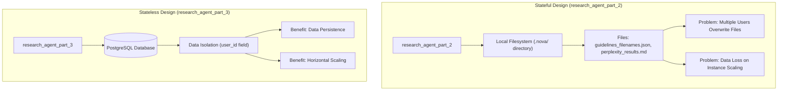
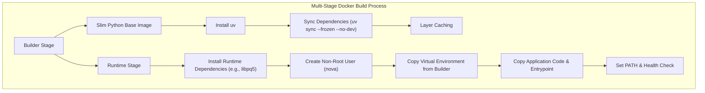
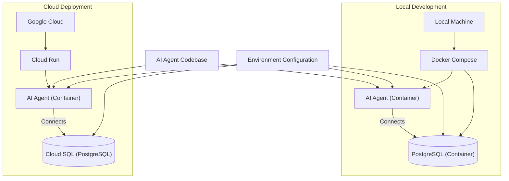

In Part 2 of this course, we built a research agent, Nova, that used the Model Context Protocol (MCP) to read and write files on a local machine. This approach was perfect for development, allowing us to quickly prototype and test our agent's capabilities. However, the jump from a local prototype to a production system is where many AI projects stumble. Production introduces a new set of constraints that a simple local setup cannot handle: security, data isolation for multiple users, and the ephemeral nature of cloud infrastructure. This transition requires a solid understanding of software engineering principles applied to AI systems.

In Lesson 31, we established a Continuous Integration (CI) pipeline to ensure our code quality is production-grade. Now, we address the next logical step: deployment infrastructure. Our target platform is Google Cloud Run, a fully managed serverless platform that lets us run containers without managing servers [[1]](https://cloud.google.com/run/docs). It handles critical production tasks like automatic scaling, health checks, and load balancing, allowing us to focus on building our application rather than managing infrastructure. While we use Cloud Run as our primary example, the architectural principles and containerization techniques we will cover are universal and apply directly to similar platforms like AWS Fargate or Azure Container Apps.

The most important constraint imposed by these serverless platforms is that their container instances are ephemeral and stateless. An instance can be created, destroyed, or replaced by the platform at any moment to handle fluctuating traffic or hardware updates. This means our agent's reliance on local file storage is a non-starter; any data written to the container's disk will be lost. To prepare our agent for the cloud, we must make four key changes to its architecture:

1.  **Stateless Data Storage:** Replace the local file system with a persistent, external database like PostgreSQL.
2.  **User Authentication:** Implement the OAuth 2.0 protocol to secure our server, identify users, and isolate their data.
3.  **File Upload/Download:** Create custom HTTP endpoints to handle file transfers, as the standard MCP specification does not cover this.
4.  **Containerization:** Package the application and all its dependencies into a portable Docker container.

This lesson will focus on implementing robust authentication and containerizing our application with Docker. We will lay the architectural groundwork for the database and file handling, which will be covered in detail in Lesson 33.

## From Stateful to Stateless Architecture

Before diving into authentication and Docker, we need to understand the fundamental architectural change required for cloud deployment: moving from a stateful to a stateless design. Serverless platforms like Cloud Run require stateless applications to enable horizontal scalability [[2]](https://www.geeksforgeeks.org/system-design/serverless-architectures/), [[3]](https://www.cloudoptimo.com/blog/serverless-computing-vs-containerization-a-comprehensive-comparison-for-modern-cloud-applications/). Each incoming request can be handled by any available container instance, as no critical state is saved locally between requests [[4]](https://www.netquall.com/blog/serverless-architecture-a-guide-for-modern-web-apps/).

Our original research agent from Part 2 was stateful. It stored all its data, including research guidelines and search results, in a local `.nova/` directory. This design is simple for local development but fails completely in a multi-user, cloud environment for several reasons:

1.  **Data Overwrites:** If two users access the agent simultaneously, they will read and write to the same files, overwriting each other's work.
2.  **Data Loss:** When Cloud Run scales down or replaces an instance, the local filesystem is wiped, and all stored data is permanently lost.
3.  **No Data Isolation:** There is no way to associate research files with the specific user who created them.

To solve these problems, `research_agent_part_3` shifts to a stateless architecture backed by a PostgreSQL database. In this model, the application itself stores no data. Instead, all state is persisted in an external database. Every piece of data, from research sessions to generated files, is associated with a `user_id`, ensuring complete data isolation.

This architectural shift, illustrated in Image 1, provides three key benefits:

*   **Data Isolation:** Each user's data is stored separately, preventing conflicts.
*   **Horizontal Scaling:** Since no state is stored on the container, we can add or remove instances seamlessly to handle traffic [[5]](https://tacnode.io/post/stateful-vs-stateless-ai-agents-practical-architecture-guide-for-developers/), [[6]](https://www.ruh.ai/blogs/stateful-vs-stateless-ai-agents).
*   **Persistence:** Data is stored safely in the database, surviving container restarts or scaling events.


Image 1: Architectural shift from a stateful, file-based research agent to a stateless, database-backed design.

We will cover the specific database schema and configuration in Lesson 33. For now, the key takeaway is that our agent must be stateless. With data now stored per-user in the database, we need a way to identify those users. Authentication provides the solution.

## Authentication with Descope

For any production AI agent, authentication is not optional. It is a fundamental requirement for security, data management, and operational control. Without it, your agent is exposed to several risks:

*   **Security:** Anyone with your server's URL could access its tools, potentially running expensive LLM calls or accessing sensitive data [[7]](https://auth0.com/blog/mitigate-excessive-agency-ai-agents/).
*   **Data Isolation:** You cannot separate one user's data from another's without a unique user identity.
*   **Usage Limits:** Implementing rate limiting or tiered access plans is impossible without knowing who is making the request.
*   **Audit Trail:** Tracking agent actions for security audits or debugging requires a clear link between an action and a user.

To secure our agent, we will use Descope, an authentication and user management platform that supports OAuth 2.0. While there are several authentication providers available for FastMCP (including WorkOS AuthKit, GitHub, Google, Azure, and others—see the [FastMCP authentication documentation](https://gofastmcp.com/servers/auth/authentication) for a complete overview), we chose Descope for its developer-friendly features, including a generous free tier, a comprehensive user management dashboard, and, most importantly, support for Dynamic Client Registration (DCR) [[8]](https://docs.descope.com/identity-federation/inbound-apps/creating-inbound-apps#method-2-dynamic-client-registration-dcr). DCR, defined in RFC 7591, allows clients like Cursor to programmatically register with our authentication server at runtime, eliminating the need for manual setup [[9]](https://datatracker.ietf.org/doc/html/rfc7591). This is essential for the dynamic, many-to-many ecosystem of AI agents and MCP servers [[10]](https://modelcontextprotocol.io/specification/2025-06-18/basic/authorization).

### Setting Up Descope

Configuring Descope for our FastMCP server involves a few simple steps in the Descope Console:

1.  **Create a Descope Account:** Sign up for a free account if you do not have one.
2.  **Create a Project:** In the console, create a new project. Each project has a unique **Project ID**, which you will need for your configuration.
3.  **Enable Dynamic Client Registration (DCR):** Navigate to `Auth Hub > Inbound Apps` and click the settings icon. Toggle on "Enable dynamic client registration." This will expose a `/register` endpoint that MCP clients can use to self-register [[8]](https://docs.descope.com/identity-federation/inbound-apps/creating-inbound-apps#method-2-dynamic-client-registration-dcr).
4.  **Configure Authentication Methods:** Descope supports various login methods like social logins, magic links, and passkeys. You can configure these in the `Auth Hub > Authentication Methods` section.

### Code Implementation

With Descope configured, integrating it into our FastMCP server is straightforward, thanks to the `DescopeProvider`. This provider, available in the `fastmcp` library, handles the complexities of OAuth 2.0, including endpoint discovery and JSON Web Token (JWT) validation [[11]](https://gofastmcp.com/integrations/descope).

1.  First, we update our `settings.py` file to load the necessary configuration from environment variables. We will set these variables in our `.env` file for local development and in Cloud Run for production.
    
    ```python
    # research_agent_part_3/src/config/settings.py
    
    from pydantic_settings import BaseSettings, SettingsConfigDict
    
    class Settings(BaseSettings):
        model_config = SettingsConfigDict(env_file=".env", env_file_encoding="utf-8")
    
        # ... other settings
    
        # Descope
        DESCOPE_PROJECT_ID: str
        DESCOPE_BASE_URL: str = "https://api.descope.com"
    
        # Server
        SERVER_URL: str = "http://localhost:8000"
    
    settings = Settings()
    ```
    
2.  Next, in `server.py`, we instantiate the `DescopeProvider` and pass it to our `FastMCP` server.
    
    ```python
    # research_agent_part_3/src/server.py
    
    from fastmcp import FastMCP
    from fastmcp.server.auth.providers.descope import DescopeProvider
    
    from src.config.settings import settings
    
    # The DescopeProvider automatically discovers Descope endpoints
    # and configures JWT token validation
    auth_provider = DescopeProvider(
        project_id=settings.DESCOPE_PROJECT_ID,
        descope_base_url=settings.DESCOPE_BASE_URL,
        base_url=settings.SERVER_URL,
    )
    
    # Create FastMCP server with auth
    mcp = FastMCP(name="Nova Research Agent", auth=auth_provider)
    
    # ... add tools and routers
    ```
    
    The provider is configured with three key parameters:
    
    *   `project_id`: Your unique Descope Project ID, which links the provider to your specific Descope configuration.
    *   `descope_base_url`: The base URL for the Descope API, which defaults to `https://api.descope.com`.
    *   `base_url`: The public URL of our own MCP server (e.g., `http://localhost:8000`). This is used to construct the correct redirect URLs required by the OAuth 2.0 flow.
    
    The authentication flow, shown in Image 2, ensures that every request to our agent's tools is validated. When a client like Cursor connects, it is redirected to Descope to log in. Upon successful authentication, Descope returns a token, which the client presents to our MCP server. The `DescopeProvider` validates this token on every request, granting access only if it is valid.
    
    ```mermaid
    sequenceDiagram
        participant User
        participant Client as "Client (e.g., Cursor)"
        participant AIAgent as "AI Agent (MCP server)"
        participant Descope
    
        Client->>AIAgent: "1. Request access to tools"
        AIAgent-->>Client: "2. Requires authentication"
        Client->>User: "3. Redirect to Descope for login"
        User->>Descope: "4. Login and authorize"
        Descope-->>User: "5. Redirect to Client with token"
        User->>Client: "6. Browser redirects with token"
        Client->>AIAgent: "7. Present token for tool access"
        activate AIAgent
        AIAgent->>AIAgent: "8. DescopeProvider validates token"
        deactivate AIAgent
        AIAgent-->>Client: "9. Tool access granted / Response"
    ```
    Image 2: OAuth 2.0 authentication flow for AI agent using Descope and FastMCP's DescopeProvider.
    
    <aside>
    💡
    
    Authentication only works when running the MCP server in HTTP transport mode. The `stdio` mode used for simple local testing does not support the redirects required for the OAuth 2.0 flow.
    
    </aside>
    
    Later in this lesson, once we have our Docker environment running, you will experience this authentication flow firsthand when connecting from Cursor. But first, we need to package our agent for deployment. Docker provides containerization, which ensures your application runs identically in development and production [[12]](https://docs.docker.com/).

## Docker for AI Agents

### What is Docker

Docker is a platform for developing, shipping, and running applications in containers. A container packages an application's code with all its dependencies, such as libraries and configuration files, into a single, portable unit [[12]](https://docs.docker.com/). For AI agents, this offers several benefits:

*   **Consistency:** The agent runs the same way on a developer's laptop as it does in the cloud, eliminating "it works on my machine" problems.
*   **Isolation:** The container isolates the agent from the host system and other containers, preventing dependency conflicts.
*   **Reproducibility:** The `Dockerfile` serves as executable documentation, defining exactly how the application environment is built.
*   **Cloud-Native:** Containers are the standard deployment unit for cloud platforms like Google Cloud Run.

### The Dockerfile

The `Dockerfile` is a text file that contains instructions for building a Docker image. Our agent uses a multi-stage build, a best practice that separates the build environment from the runtime environment. This creates smaller, more secure final images by excluding build-time dependencies like compilers or testing libraries [[13]](https://www.blacksmith.sh/blog/understanding-multi-stage-docker-builds), [[14]](https://testdriven.io/blog/docker-best-practices/).

Our build process, shown in Image 3, consists of two stages.


Image 3: A flowchart detailing the multi-stage Docker build process for an AI agent, showing the Builder and Runtime stages and their contributions to smaller, more secure images.

1.  **Stage 1: The Builder.** This stage sets up the environment and installs our Python dependencies.
    
    ```dockerfile
    # research_agent_part_3/Dockerfile
    
    # Stage 1: Builder
    FROM python:3.12-slim as builder
    
    # Install uv, the fast Python package installer
    COPY --from=ghcr.io/astral-sh/uv:0.2.10 /uv /uv
    
    WORKDIR /app
    
    # Create a virtual environment
    RUN /uv venv
    ENV VIRTUAL_ENV=/app/.venv
    ENV PATH="/app/.venv/bin:$PATH"
    
    # Copy dependency files and install them
    # This uses Docker's layer caching
    COPY pyproject.toml uv.lock ./
    RUN uv sync --frozen --no-dev
    ```
    
    We start with a slim Python base image. We then install `uv`, a fast Python package manager, by copying it from Astral's official image [[15]](https://docs.astral.sh/uv/guides/integration/docker/). A key optimization here is copying `pyproject.toml` and `uv.lock` first and running `uv sync` before copying the rest of our application code. This makes use of Docker's layer caching. If our code changes but dependencies do not, Docker reuses the cached dependency layer, making builds much faster [[16]](https://snyk.io/blog/best-practices-containerizing-python-docker/).
    
2.  **Stage 2: The Runtime.** This stage creates the final, lean image for production.
    
    ```dockerfile
    # research_agent_part_3/Dockerfile
    
    # Stage 2: Runtime
    FROM python:3.12-slim
    
    # Install runtime OS dependencies
    RUN apt-get update && apt-get install -y --no-install-recommends \
        libpq5 \
        git \
        && apt-get clean && rm -rf /var/lib/apt/lists/*
    
    # Create a non-root user for security
    RUN useradd --create-home --shell /bin/bash nova
    USER nova
    WORKDIR /home/nova/app
    
    # Configure git for non-interactive use
    RUN git config --global user.name "Nova" && \
        git config --global user.email "nova@example.com"
    
    # Copy the virtual environment from the builder stage
    COPY --from=builder /app/.venv ./.venv
    ENV VIRTUAL_ENV=/home/nova/app/.venv
    ENV PATH="/home/nova/app/.venv/bin:$PATH"
    ENV PYTHONUNBUFFERED=1
    ENV GIT_TERMINAL_PROMPT=0
    
    # Copy application code, migrations, and entrypoint script
    COPY --chown=nova:nova alembic.ini .
    COPY --chown=nova:nova src/alembic ./src/alembic
    COPY --chown=nova:nova src/ ./src
    COPY --chown=nova:nova docker-entrypoint.sh /home/nova/docker-entrypoint.sh
    RUN chmod +x /home/nova/docker-entrypoint.sh
    
    # Health check to ensure the server is responsive
    HEALTHCHECK --interval=30s --timeout=5s --start-period=10s --retries=3 \
        CMD curl -f http://localhost:8000/health || exit 1
    
    EXPOSE 8000
    
    ENTRYPOINT ["/home/nova/docker-entrypoint.sh"]
    ```
    
    In this stage, we install only necessary runtime dependencies, like `libpq5` for PostgreSQL connectivity. We create a non-root user, `nova`, as a security best practice. We then copy the virtual environment created in the builder stage, our application code, and the entrypoint script. The `HEALTHCHECK` instruction tells Docker how to test if our container is working correctly, which is essential for orchestrators like Cloud Run to manage application availability [[17]](https://lumigo.io/container-monitoring/docker-health-check-a-practical-guide/).

### Docker Compose

For local development, we use Docker Compose to define and run our multi-container application. It allows us to spin up our entire stack—the MCP server and a PostgreSQL database—with a single command [[18]](https://docs.docker.com/compose/).

```yaml
# research_agent_part_3/docker-compose.yml

services:
  db:
    image: postgres:16-alpine
    restart: always
    environment:
      - POSTGRES_USER=nova
      - POSTGRES_PASSWORD=nova
      - POSTGRES_DB=nova
    volumes:
      - postgres_data:/var/lib/postgresql/data/
    healthcheck:
      test: ["CMD-SHELL", "pg_isready -U nova"]
      interval: 5s
      timeout: 5s
      retries: 5

  mcp-server:
    build:
      context: .
      dockerfile: Dockerfile
    restart: always
    depends_on:
      db:
        condition: service_healthy
    environment:
      - DATABASE_URL=postgresql+psycopg://nova:nova@db:5432/nova
      - OPENAI_API_KEY=${OPENAI_API_KEY}
      - PERPLEXITY_API_KEY=${PERPLEXITY_API_KEY}
      - DESCOPE_PROJECT_ID=${DESCOPE_PROJECT_ID}
      - SERVER_URL=${SERVER_URL}
    ports:
      - "8000:8000"
    volumes:
      - ./src:/home/nova/app/src

volumes:
  postgres_data:
```

Our `docker-compose.yml` file defines two services:

*   **`db`:** Runs a PostgreSQL 16 server using a lightweight Alpine image. It uses a named volume, `postgres_data`, to persist database data even when the container is removed [[19]](https://earthly.dev/blog/postgres-docker/).
*   **`mcp-server`:** Builds our agent from the `Dockerfile`. The `depends_on` directive ensures the server only starts after the database is healthy. It connects to the database using the service name `db` as the hostname, which Docker's internal networking resolves. We also mount the local `src` directory into the container, allowing for live code reloading during development.

Image 4 illustrates this local development setup.

```mermaid
graph TD
    subgraph "Local Development Environment (Docker Compose)"
        PG[("PostgreSQL Database")]
        MCP["MCP Server"]

        PG -- "Uses Alpine Image"
        PG -- "Environment Variables (Credentials)"
        PG -- "Named Volume for Persistence"

        MCP -- "Builds from Dockerfile"
        MCP -- "Mounts Development Volume"

        MCP -- "Depends on & Connects via Docker Network Hostname" --> PG
    end
```
Image 4: Architecture diagram of a local development environment using Docker Compose for an AI agent, showing PostgreSQL and MCP server services and their interactions.

### The Entrypoint Script

The `docker-entrypoint.sh` script runs when the container starts. It ensures that database migrations are applied before the main application process begins.

```bash
# research_agent_part_3/docker-entrypoint.sh

#!/bin/bash
set -e

# Run database migrations
echo "Running database migrations..."
alembic upgrade head

# Start the MCP server
echo "Starting MCP server..."
exec uvicorn src.server:mcp --host 0.0.0.0 --port 8000
```

Using `exec` for the final command is important. It replaces the shell process with the `uvicorn` process, allowing application signals (like `SIGTERM` for graceful shutdown) to be handled correctly by the application instead of being swallowed by the shell.

### Local Development vs Cloud Deployment

A key goal of this setup is to use the same codebase and Docker image for both local development and cloud deployment. We achieve this through environment-based configuration, as shown in Image 5.


Image 5: High-level architecture diagram comparing local development with Docker Compose and cloud deployment on Google Cloud Run, emphasizing shared codebase and environment-based configuration.

*   **Locally:** We use Docker Compose, which provides a PostgreSQL container and sets the `DATABASE_URL` to connect to it.
*   **In the Cloud:** We will deploy the same image to Cloud Run and connect it to a managed Cloud SQL database [[20]](https://cloud.google.com/sql/docs). The connection details will be provided through environment variables in the Cloud Run service configuration. The repository also contains a `Dockerfile.cloudrun` and `docker-entrypoint-cloudrun.sh` for cloud-specific build and startup logic.

Our `settings.py` includes logic to handle the specific connection requirements for Cloud SQL.

```python
# research_agent_part_3/src/config/settings.py

class Settings(BaseSettings):
    # ...
    # Google Cloud
    GCP_PROJECT_ID: str | None = None
    GCP_REGION: str | None = None
    GCP_DB_INSTANCE_NAME: str | None = None

    @property
    def is_cloud_sql(self) -> bool:
        return all([self.GCP_PROJECT_ID, self.GCP_REGION, self.GCP_DB_INSTANCE_NAME])
```

With Docker configured, let's run the research agent on your local machine and experience the full authentication flow.

## Running the Agent Locally

This section provides a hands-on guide to running the containerized agent on your machine.

### Prerequisites

1.  **Install Docker Desktop:** Download and install Docker Desktop for your operating system.
2.  **Create the `.env` file:** In the `research_agent_part_3` directory, create a `.env` file and populate it with your API keys and Descope Project ID.
    
    ```
    # research_agent_part_3/.env
    
    OPENAI_API_KEY="sk-..."
    PERPLEXITY_API_KEY="pplx-..."
    DESCOPE_PROJECT_ID="P..."
    SERVER_URL="http://localhost:8000"
    ```
    
3.  **Generate the lock file:** If you have modified dependencies in `pyproject.toml`, regenerate the `uv.lock` file by running `uv lock`.

### Starting the Services

1.  First, build the Docker images for your services.
    
    ```bash
    docker compose build
    ```
    
2.  Next, start the services in detached mode (`-d`).
    
    ```bash
    docker compose up -d
    ```
    
3.  Verify that both containers are running and healthy.
    
    ```bash
    docker compose ps
    ```
    
    It outputs:
    
    ```
    NAME                         IMAGE                           COMMAND                  SERVICE      CREATED          STATUS                    PORTS
    research_agent_part_3-db-1   postgres:16-alpine              "docker-entrypoint.s…"   db           2 minutes ago    Up 2 minutes (healthy)    5432/tcp
    research_agent_part_3-mcp-server-1   research_agent_part_3-mcp-server   "/home/nova/docker-e…"   mcp-server   2 minutes ago    Up 2 minutes (healthy)    0.0.0.0:8000->8000/tcp
    ```
    
4.  You can tail the logs of the MCP server to see the startup messages, including the database migration output.
    
    ```bash
    docker compose logs -f mcp-server
    ```
    

### Connecting from Cursor

Now for the payoff. Open Cursor and configure it to connect to your local MCP server.

1.  Create an `mcp.json` file with the following content:
    
    ```json
    {
        "mcp_servers": {
            "local_research_agent": {
                "name": "Local Research Agent",
                "url": "http://localhost:8000/mcp"
            }
        }
    }
    ```
    
2.  **Without authentication:** If you were to comment out the `auth=auth_provider` line in `server.py` and rebuild the image, connecting in Cursor would be immediate. The tools would appear as soon as you add the server.
    
3.  **With authentication:** When you attempt to connect to the secured agent in Cursor, the authentication flow will trigger.
    
4.  Your browser will open a new tab and redirect you to the Descope login page.
    
5.  After you log in and grant consent, you will be redirected back, and Cursor will receive an authentication token.
    
6.  The agent's tools will now be available in Cursor, and you can start a research session. The token is cached, so you will not need to log in again until it expires.

### Stopping the Services

To stop the services, you have a few options:

*   `docker compose stop`: Stops the containers but preserves them and the database volume.
*   `docker compose down`: Stops and removes the containers but keeps the database volume.
*   `docker compose down -v`: Stops and removes the containers and deletes the database volume, wiping all data.

## Conclusion

You now have a containerized research agent running locally with production-grade authentication. This lesson covered the critical infrastructure needed to move an AI agent from a local prototype toward a cloud-native application. This is a significant step in escaping the "PoC purgatory" where so many AI projects get stuck. By building a solid foundation of security and portability, we are ensuring our agent is not just a clever demo, but a robust application ready for real-world use.

We addressed four key topics:

*   **Stateless Architecture:** We understood why serverless platforms demand a stateless design and shifted from local file storage to a PostgreSQL database, enabling scalability and data persistence.
*   **Authentication with Descope:** We implemented a robust OAuth 2.0 authentication flow using FastMCP's `DescopeProvider` to secure our agent, isolate user data, and prepare for production-level access control.
*   **Docker Containerization:** We created a multi-stage `Dockerfile` for lean, secure images and a `docker-compose.yml` for a reproducible local development environment, ensuring consistency from development to deployment.
*   **Environment-Based Configuration:** We designed our application to run identically in local and cloud environments by managing configuration through environment variables, a core principle of modern software development.

The research agent is now a portable, secure, and scalable application. In the next lesson, we will cover in detail the database schema and configuration, implementing Alembic migrations to manage changes over time. We will also tackle a critical missing piece: how to handle file uploads and downloads for MCP servers, since the standard protocol does not cover file transfers over HTTP. Finally, we will add user usage tracking to our database, a key feature for monitoring and monetization. Following that, in Lesson 34, we will take our fully-featured, containerized agent and deploy it to Google Cloud Run.

## References

1. Google. (n.d.). *Cloud Run documentation*. Google Cloud. https://cloud.google.com/run/docs
2. GeeksforGeeks. (n.d.). *System Design - Serverless Architectures*. https://www.geeksforgeeks.org/system-design/serverless-architectures/
3. CloudOptimo. (n.d.). *Serverless Computing vs Containerization: A Comprehensive Comparison for Modern Cloud Applications*. https://www.cloudoptimo.com/blog/serverless-computing-vs-containerization-a-comprehensive-comparison-for-modern-cloud-applications/
4. NetQuall. (n.d.). *Serverless Architecture: A Guide for Modern Web Apps*. https://www.netquall.com/blog/serverless-architecture-a-guide-for-modern-web-apps/
5. Tacnode. (2024, May 22). *Stateful vs Stateless AI Agents: A Practical Architecture Guide for Developers*. https://tacnode.io/post/stateful-vs-stateless-ai-agents-practical-architecture-guide-for-developers
6. Ruh AI. (n.d.). *Stateful vs Stateless AI Agents: Choosing the Right Architecture for Your Needs*. https://www.ruh.ai/blogs/stateful-vs-stateless-ai-agents
7. Auth0. (n.d.). *How to Mitigate Excessive Agency in AI Agents*. https://auth0.com/blog/mitigate-excessive-agency-ai-agents/
8. Descope. (n.d.). *Creating Inbound Apps*. https://docs.descope.com/identity-federation/inbound-apps/creating-inbound-apps#method-2-dynamic-client-registration-dcr
9. IETF. (2015, July). *OAuth 2.0 Dynamic Client Registration Protocol* (RFC 7591). https://datatracker.ietf.org/doc/html/rfc7591
10. Model Context Protocol. (2025, June 18). *Authorization*. https://modelcontextprotocol.io/specification/2025-06-18/basic/authorization
11. FastMCP. (n.d.). *Descope Integration*. https://gofastmcp.com/integrations/descope
12. Docker. (n.d.). *Docker Documentation*. https://docs.docker.com/
13. Blacksmith. (n.d.). *Understanding Multi-Stage Docker Builds*. https://www.blacksmith.sh/blog/understanding-multi-stage-docker-builds
14. TestDriven.io. (n.d.). *Docker Best Practices*. https://testdriven.io/blog/docker-best-practices/
15. Astral. (n.d.). *Using uv in Docker*. https://docs.astral.sh/uv/guides/integration/docker/
16. Snyk. (n.d.). *Best practices for containerizing Python applications with Docker*. https://snyk.io/blog/best-practices-containerizing-python-docker/
17. Lumigo. (n.d.). *Docker Health Check: A Practical Guide*. https://lumigo.io/container-monitoring/docker-health-check-a-practical-guide/
18. Docker. (n.d.). *Docker Compose Documentation*. https://docs.docker.com/compose/
19. Earthly. (n.d.). *Running Postgres on Docker*. https://earthly.dev/blog/postgres-docker/
20. Google. (n.d.). *Cloud SQL Documentation*. https://cloud.google.com/sql/docs