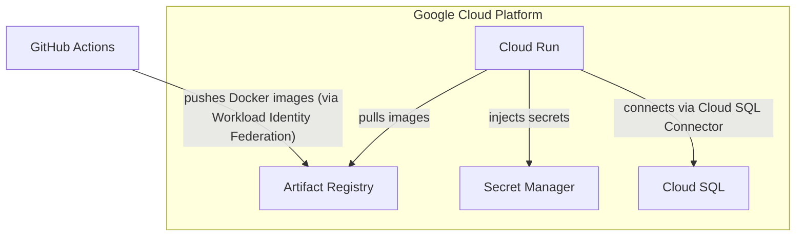
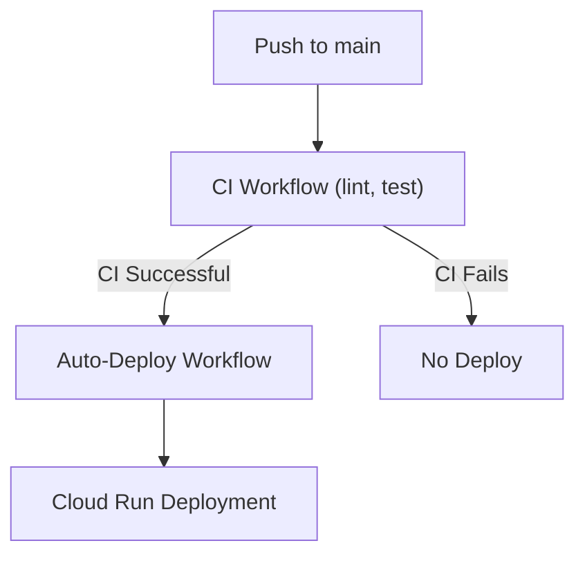
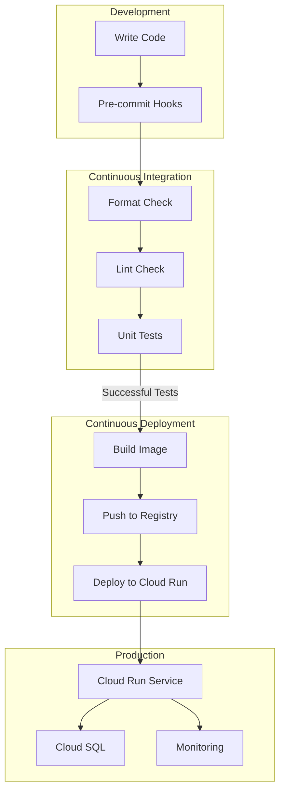

# Lesson 34: Continuous Deployment for AI Agents

In Lesson 31, we established Continuous Integration (CI) as the foundation for maintaining code quality through automated tests, linting, and formatting checks. In Lesson 32, we prepared our research agent for production by containerizing it with Docker and implementing OAuth 2.0 authentication. Then, in Lesson 33, we replaced file-based storage with PostgreSQL and added rate limiting. Now, in this lesson, we complete the DevOps journey by deploying the agent to the cloud and setting up Continuous Deployment (CD).

Continuous Deployment extends CI by automatically releasing code changes to production after they pass all tests. While CI answers the question "does this code work?", CD answers "can we ship it?". The combination creates a seamless pipeline where a developer pushes code, automated tests validate it, and minutes later, the change is live. This automated flow is the cornerstone of modern software delivery, enabling teams to release value to users faster and more reliably. Without it, even the most well-tested code can sit for days or weeks waiting for a manual release process, delaying feedback and slowing down progress.

For AI agents, CD is particularly valuable. Much of the development process, especially prompt engineering, is inherently iterative. You tweak a prompt, observe the results in a real environment, and refine it again. A manual deployment process introduces friction and slows down this important feedback loop. With CD, prompt changes can flow to production as smoothly as code changes, allowing for rapid experimentation while ensuring that quality gates like automated testing are never bypassed. This agility is what separates teams that can quickly adapt their AI systems from those that get stuck in long development cycles.

This lesson provides a comprehensive guide to building a complete deployment pipeline for our research agent. We will cover:

-   Setting up Google Cloud Platform infrastructure using `gcloud` commands.
-   Creating a manual deployment pipeline for controlled, on-demand releases.
-   Understanding core Cloud Run concepts like services, revisions, autoscaling, and zero-downtime deployments.
-   Implementing a continuous deployment pipeline that automatically triggers after CI passes.

By the end of this lesson, you will have a production-ready deployment pipeline that takes your code from a commit to a live production environment with minimal manual intervention, empowering you to iterate on your AI agents with speed and confidence.

## Section 2 — Infrastructure as Code with gcloud

Before we can deploy our agent, we need to provision the necessary cloud infrastructure: a container registry for Docker images, a database for persistent storage, a system for managing secrets, and the compute service to run our agent. On Google Cloud Platform (GCP), you can do this by clicking through the web console or by running commands with the `gcloud` CLI.

### Why Command-Line Infrastructure

The web console is intuitive for exploration and one-off tasks, but it presents major drawbacks for building and maintaining production systems:

-   **Not Reproducible:** Configuring a service through the UI is a manual process. If you need to recreate the environment for testing or disaster recovery, you have to remember every click and setting. This is error-prone and unreliable. Imagine a new team member trying to set up a staging environment; without a script, they are likely to miss a step, leading to configuration drift and hard-to-debug "it works on my machine" issues.
-   **Not Version-Controlled:** Changes made in the UI are not tracked in a version control system like Git. There is no audit trail, making it impossible to review infrastructure changes in a pull request or revert to a previous known-good state. If a change introduces a problem, you cannot easily see what was modified or by whom.
-   **Not Automatable:** Manual UI operations cannot be integrated into automated CI/CD pipelines. Every deployment would require a person to click buttons, defeating the purpose of automation and introducing the potential for human error at the most critical stage of the release process.

Using command-line tools to define infrastructure solves these problems. When you provision resources with `gcloud` commands and save those commands in a script, you create a reproducible recipe. This script can be version-controlled, reviewed by your team, and executed automatically. This practice is the foundation of **Infrastructure as Code (IaC)**, where infrastructure is managed with the same rigor as application code [[1]](https://cloud.google.com/docs/terraform).

### Infrastructure as Code and Terraform

The most advanced form of IaC uses declarative tools like **Terraform** or **Pulumi**. With these tools, you do not write imperative commands ("create this, then create that"). Instead, you declare the desired end state of your infrastructure in a configuration file ("I want these resources to exist with these settings") [[2]](https://www.terraform.io/). The tool then determines the necessary actions to achieve that state. Terraform also tracks the state of your infrastructure, handles dependencies automatically, and can generate an execution plan (`terraform plan`) to show you what will change before you apply it.

For complex production systems, Terraform is the industry standard. However, it introduces a learning curve: you need to learn its specific language (HCL), manage state files, and understand its lifecycle. For our project, we will take a pragmatic middle ground. We will document all infrastructure setup as `gcloud` commands in a deployment guide. This gives us reproducibility and documentation without the overhead of a new tool, making it an excellent starting point for an AI engineer's first deployment pipeline.

### Installing and Configuring gcloud

The `gcloud` CLI is Google Cloud's powerful command-line interface for managing resources. It is an essential tool for any automation on GCP.

**Installation:**

First, follow the official installation instructions for your operating system to install the Google Cloud CLI [[3]](https://cloud.google.com/sdk/docs/install).

**Authentication and Configuration:**

After installation, you need to authenticate your account and configure your default project and region.

1.  Run the login command, which will open a browser window for you to sign in to your Google account.
    ```bash
    # Authenticate with your Google account
    gcloud auth login
    ```
2.  Next, set your default project ID and compute region.
    ```bash
    # Set your default project
    gcloud config set project YOUR_PROJECT_ID
    
    # Set your default region (us-central1 is common)
    gcloud config set run/region us-central1
    ```
    Setting these defaults means you will not have to specify the `--project` and `--region` flags with every command. You can always verify your current configuration by running `gcloud config list`.

### Our Approach: Documented gcloud Commands

For our research agent, all infrastructure setup commands are documented in a single deployment file. This file serves as a complete, step-by-step guide to provision the entire infrastructure from scratch. This approach offers several key benefits for our learning objectives:

-   **Reproducibility:** Anyone on the team can recreate the exact same infrastructure by following the documented commands.
-   **Documentation:** The commands act as living documentation, clearly showing what infrastructure exists and how it is configured.
-   **Reviewability:** When the infrastructure needs to change, the updates to the deployment guide can be reviewed in a pull request.
-   **Simplicity:** We can achieve our goals without needing to learn an additional tool or language beyond the `gcloud` CLI.

The main tradeoff is that `gcloud` commands are imperative, not declarative. This means running a command twice might either fail or create a duplicate resource. You must be mindful of idempotency, and there is no automatic detection if the live infrastructure drifts from the configuration in your script. For the scope of this course, this is an acceptable tradeoff for simplicity.

## Section 3 — Setting Up GCP Services

With `gcloud` configured, we can now provision the infrastructure our research agent needs. This section walks through each component, explaining what it does and the commands to create it.

### Architecture Overview

The complete deployment architecture involves several GCP services working together to build, store, run, and support our agent.


Image 1: A flowchart showing the interaction between GitHub Actions and Google Cloud Platform services like Artifact Registry, Secret Manager, Cloud Run, and Cloud SQL.

### Setting Environment Variables

First, we will define some shell variables that will be reused in subsequent commands. This makes the scripts cleaner and easier to adapt.

```bash
# Replace with your values
export PROJECT_ID="your-gcp-project-id"
export REGION="us-central1"
export GITHUB_ORG="your-github-org"  # or username
export GITHUB_REPO="your-repo-name"

# Set the default project
gcloud config set project $PROJECT_ID
```

### Enabling Required APIs

By default, most GCP services are disabled to prevent accidental usage. We must explicitly enable the APIs for the services we intend to use.

```bash
gcloud services enable \
  run.googleapis.com \
  sqladmin.googleapis.com \
  artifactregistry.googleapis.com \
  secretmanager.googleapis.com \
  iam.googleapis.com \
  iamcredentials.googleapis.com \
  cloudresourcemanager.googleapis.com
```

Each of these APIs corresponds to a core service in our architecture:

-   `run.googleapis.com`: The Cloud Run API for deploying and managing containerized services.
-   `sqladmin.googleapis.com`: The Cloud SQL Admin API for managing our PostgreSQL database.
-   `artifactregistry.googleapis.com`: The Artifact Registry API for storing and managing our Docker images.
-   `secretmanager.googleapis.com`: The Secret Manager API for securely storing our API keys and credentials.
-   `iam.googleapis.com` and `iamcredentials.googleapis.com`: The Identity and Access Management APIs, which are essential for authentication and authorization.
-   `cloudresourcemanager.googleapis.com`: The API for managing project-level resources.

### Creating Artifact Registry

Artifact Registry is Google's managed container registry, designed to store and manage Docker images and other build artifacts [[4]](https://cloud.google.com/artifact-registry/docs). In our CI/CD pipeline, it acts as the bridge between the build stage and the deployment stage. When GitHub Actions successfully builds a new Docker image, it pushes that image to Artifact Registry. Later, when we deploy to Cloud Run, the service pulls the specified image from this registry.

```bash
gcloud artifacts repositories create nova-mcp \
  --repository-format=docker \
  --location=$REGION \
  --description="Nova MCP Server Docker images"
```

This command creates a new Docker repository named `nova-mcp` in our specified region. Our images will be pushed to a URL with the format: `$REGION-docker.pkg.dev/$PROJECT_ID/nova-mcp/nova-mcp-server:tag`.

### Creating Cloud SQL Instance

Cloud SQL provides a fully managed PostgreSQL database service, handling tasks like backups, security patches, and replication. For our agent, we will create a minimal instance that is suitable for development and initial production use.

1.  First, create the PostgreSQL instance.
    ```bash
    gcloud sql instances create nova-postgres \
      --database-version=POSTGRES_16 \
      --edition=ENTERPRISE \
      --tier=db-f1-micro \
      --region=$REGION \
      --storage-type=SSD \
      --storage-size=10GB \
      --availability-type=zonal \
      --backup-start-time=03:00 \
      --maintenance-window-day=SUN \
      --maintenance-window-hour=04
    ```
    This configuration specifies PostgreSQL 16 on a `db-f1-micro` tier, which is the smallest and most cost-effective option (around $10/month). We are using SSD storage for better performance and have scheduled backups and maintenance for off-peak hours.

2.  Next, create the database and a dedicated user for our application.
    ```bash
    # Create the database
    gcloud sql databases create nova_research \
      --instance=nova-postgres
    
    # Generate a secure password
    DB_PASSWORD=$(openssl rand -base64 24)
    echo "Save this password securely: $DB_PASSWORD"
    
    # Create the database user
    gcloud sql users create nova \
      --instance=nova-postgres \
      --password=$DB_PASSWORD
    ```

3.  Finally, retrieve the instance connection name. This unique identifier is used by Cloud Run to establish a secure connection to the database.
    ```bash
    gcloud sql instances describe nova-postgres \
      --format="value(connectionName)"
    ```
    The output will be in the format `PROJECT_ID:REGION:INSTANCE_NAME`.

### Creating Secrets in Secret Manager

Secret Manager is Google Cloud's centralized service for storing sensitive data like API keys, passwords, and certificates [[5]](https://cloud.google.com/secret-manager/docs). Using Secret Manager is a security best practice because it allows us to inject secrets into our Cloud Run containers at runtime, avoiding the need to hardcode them in our repository or CI/CD configuration. It also provides an audit trail of secret access and allows for easy rotation of credentials without needing to redeploy our application.

```bash
# Database credentials
echo -n "nova" | gcloud secrets create db-user --data-file=-
echo -n "$DB_PASSWORD" | gcloud secrets create db-password --data-file=-

# API Keys (replace with your actual keys)
echo -n "your-google-api-key" | gcloud secrets create google-api-key --data-file=-
echo -n "your-pplx-api-key" | gcloud secrets create pplx-api-key --data-file=-
echo -n "your-firecrawl-api-key" | gcloud secrets create firecrawl-api-key --data-file=-

# Descope authentication
echo -n "your-descope-project-id" | gcloud secrets create descope-project-id --data-file=-

# Optional secrets
echo -n "your-github-token" | gcloud secrets create github-token --data-file=-
echo -n "your-openai-api-key" | gcloud secrets create openai-api-key --data-file=-
echo -n "your-opik-api-key" | gcloud secrets create opik-api-key --data-file=-
```

We use `echo -n` to prevent adding a trailing newline to the secret value, and the `--data-file=-` flag tells the command to read the secret from stdin, which prevents it from being saved in your shell history.

### Setting Up Workload Identity Federation

Workload Identity Federation is a modern security mechanism that allows external systems like GitHub Actions to authenticate with GCP without using long-lived service account keys [[6]](https://cloud.google.com/iam/docs/workload-identity-federation). This is far more secure than the traditional method of storing a JSON key file as a GitHub secret.

The process involves two key GCP concepts: **Service Accounts**, which are special accounts for applications, and **Workload Identity Federation**, which allows an external identity provider (like GitHub) to exchange its own token for short-lived GCP credentials.

1.  First, create a Workload Identity Pool to act as a container for our external identities.
    ```bash
    gcloud iam workload-identity-pools create "github-actions-pool" \
      --location="global" \
      --display-name="GitHub Actions Pool"
    ```

2.  Next, create an OIDC provider within the pool. This configures GCP to trust OIDC tokens issued by GitHub Actions.
    ```bash
    gcloud iam workload-identity-pools providers create-oidc "github-provider" \
      --location="global" \
      --workload-identity-pool="github-actions-pool" \
      --display-name="GitHub Provider" \
      --attribute-mapping="google.subject=assertion.sub,attribute.actor=assertion.actor,attribute.repository=assertion.repository,attribute.repository_owner=assertion.repository_owner" \
      --attribute-condition="assertion.repository_owner == '${GITHUB_ORG}'" \
      --issuer-uri="https://token.actions.githubusercontent.com"
    ```
    The `--attribute-condition` is a key security feature that restricts authentication to only those repositories owned by your specified GitHub organization or user.

3.  Create the service account that GitHub Actions will impersonate to perform deployment tasks.
    ```bash
    gcloud iam service-accounts create github-actions-deployer \
      --display-name="GitHub Actions Deployer"
    
    SA_EMAIL="github-actions-deployer@${PROJECT_ID}.iam.gserviceaccount.com"
    ```

4.  Grant this service account the necessary permissions to deploy our agent.
    ```bash
    # Cloud Run Admin (to deploy and manage services)
    gcloud projects add-iam-policy-binding $PROJECT_ID \
      --member="serviceAccount:$SA_EMAIL" \
      --role="roles/run.admin"
    
    # Artifact Registry Writer (to push Docker images)
    gcloud projects add-iam-policy-binding $PROJECT_ID \
      --member="serviceAccount:$SA_EMAIL" \
      --role="roles/artifactregistry.writer"
    
    # Service Account User (to act as the Cloud Run service identity during deployment)
    gcloud projects add-iam-policy-binding $PROJECT_ID \
      --member="serviceAccount:$SA_EMAIL" \
      --role="roles/iam.serviceAccountUser"
    
    # Secret Manager Accessor (to read secrets during deployment)
    gcloud projects add-iam-policy-binding $PROJECT_ID \
      --member="serviceAccount:$SA_EMAIL" \
      --role="roles/secretmanager.secretAccessor"
    
    # Cloud SQL Client (for database connections)
    gcloud projects add-iam-policy-binding $PROJECT_ID \
      --member="serviceAccount:$SA_EMAIL" \
      --role="roles/cloudsql.client"
    ```

5.  Finally, establish the trust relationship that allows GitHub Actions from your repository to impersonate this service account.
    ```bash
    # Get the full name of the Workload Identity Pool
    POOL_ID=$(gcloud iam workload-identity-pools describe github-actions-pool \
      --location="global" \
      --format="value(name)")
    
    # Allow GitHub Actions from your specific repository to use this service account
    gcloud iam service-accounts add-iam-policy-binding $SA_EMAIL \
      --role="roles/iam.workloadIdentityUser" \
      --member="principalSet://iam.googleapis.com/${POOL_ID}/attribute.repository/${GITHUB_ORG}/${GITHUB_REPO}"
    
    # Grant the token creator role, which is required for obtaining access tokens
    gcloud iam service-accounts add-iam-policy-binding $SA_EMAIL \
      --role="roles/iam.serviceAccountTokenCreator" \
      --member="principalSet://iam.googleapis.com/${POOL_ID}/attribute.repository/${GITHUB_ORG}/${GITHUB_REPO}"
    ```
    The `principalSet` identifier ensures that only workflows running in your specified repository can assume this role.

### Configuring Cloud Run Service Account

The Cloud Run service itself also needs an identity to access other GCP resources at runtime. We will grant the necessary permissions to the default service account that Cloud Run uses.

```bash
# Get the project number, which is part of the default service account email
PROJECT_NUMBER=$(gcloud projects describe $PROJECT_ID --format="value(projectNumber)")

# Construct the email of the default Cloud Run service account
CLOUDRUN_SA="${PROJECT_NUMBER}-compute@developer.gserviceaccount.com"

# Grant the Cloud SQL Client role for database access
gcloud projects add-iam-policy-binding $PROJECT_ID \
  --member="serviceAccount:$CLOUDRUN_SA" \
  --role="roles/cloudsql.client"

# Grant Secret Manager access to read secrets at runtime
gcloud projects add-iam-policy-binding $PROJECT_ID \
  --member="serviceAccount:$CLOUDRUN_SA" \
  --role="roles/secretmanager.secretAccessor"
```

### Getting Values for GitHub Configuration

After running all the setup commands, you need to collect a few key values to configure your GitHub repository.

```bash
echo "GCP_PROJECT_ID: $PROJECT_ID"
echo "GCP_REGION: $REGION"
echo "CLOUD_SQL_INSTANCE: $(gcloud sql instances describe nova-postgres --format='value(connectionName)')"
echo "GCP_WORKLOAD_IDENTITY_PROVIDER: $(gcloud iam workload-identity-pools providers describe github-provider --location=global --workload-identity-pool=github-actions-pool --format='value(name)')"
echo "GCP_SERVICE_ACCOUNT: github-actions-deployer@${PROJECT_ID}.iam.gserviceaccount.com"
```

These values will be used as repository variables in our GitHub Actions workflow.

## Section 4 — The Manual Deployment Pipeline

With our infrastructure provisioned, we are ready to deploy the agent. We will begin with a manual deployment pipeline, which provides explicit control over when deployments occur. This is valuable for initial setup, for testing infrastructure changes before enabling automation, and for environments where fully automatic deployment is not desired.

### Configuring GitHub Repository Variables

First, you must configure the values from the previous section as GitHub repository variables. In your GitHub repository, navigate to Settings → Secrets and variables → Actions, then click on the "Variables" tab.

Table 1: GitHub repository variables for deployment.
| Variable Name | Description | Example |
|---------------|-------------|---------|
| `GCP_PROJECT_ID` | Your GCP project ID | `my-project-123` |
| `GCP_REGION` | Your preferred region | `us-central1` |
| `CLOUD_SQL_INSTANCE` | Cloud SQL connection name | `my-project:us-central1:nova-postgres` |
| `GCP_WORKLOAD_IDENTITY_PROVIDER` | Full provider resource name | `projects/123456/locations/global/workloadIdentityPools/github-actions-pool/providers/github-provider` |
| `GCP_SERVICE_ACCOUNT` | Deployer service account email | `github-actions-deployer@my-project.iam.gserviceaccount.com` |

### Understanding the Pipeline Structure

The manual deployment pipeline is defined in the file `.github/workflows/deploy-nova-mcp.yml`. Let's break down its structure and key components.

1.  The workflow is triggered manually using `workflow_dispatch`. This adds a "Run workflow" button to the GitHub Actions UI, allowing you to start a deployment on demand [[7]](https://docs.github.com/en/actions/using-workflows/events-that-trigger-workflows#workflow_dispatch). We also define environment variables that read from the GitHub repository variables we just configured.
    ```yaml
    name: Deploy Nova MCP Server
    
    on:
      workflow_dispatch:
        inputs:
          environment:
            description: "Deployment environment"
            required: true
            default: "production"
            type: choice
            options:
              - production
    
    env:
      GCP_PROJECT_ID: ${{ vars.GCP_PROJECT_ID }}
      GCP_REGION: ${{ vars.GCP_REGION || 'us-central1' }}
      SERVICE_NAME: nova-mcp-server
      ARTIFACT_REGISTRY_REPO: nova-mcp
      CLOUD_SQL_INSTANCE: ${{ vars.CLOUD_SQL_INSTANCE }}
    ```

2.  The main `deploy` job runs on an `ubuntu-latest` runner. The `permissions` block is essential for Workload Identity Federation. `id-token: write` allows the workflow to request an OIDC token from GitHub, which is then exchanged for temporary GCP credentials [[8]](https://docs.github.com/en/actions/deployment/security-hardening-your-deployments/about-security-hardening-with-openid-connect).
    ```yaml
    jobs:
      deploy:
        name: Build and Deploy to Cloud Run
        runs-on: ubuntu-latest
    
        permissions:
          contents: read
          id-token: write
    ```

3.  The first steps check out the code and authenticate to Google Cloud using the `google-github-actions/auth` action. This action handles the secure OIDC token exchange, so no static keys are needed.
    ```yaml
    steps:
      - name: Checkout repository
        uses: actions/checkout@v4

      - name: Authenticate to Google Cloud
        id: auth
        uses: google-github-actions/auth@v2
        with:
          workload_identity_provider: ${{ vars.GCP_WORKLOAD_IDENTITY_PROVIDER }}
          service_account: ${{ vars.GCP_SERVICE_ACCOUNT }}

      - name: Set up Cloud SDK
        uses: google-github-actions/setup-gcloud@v2
        with:
          project_id: ${{ env.GCP_PROJECT_ID }}
    ```

4.  Next, we configure Docker to authenticate with Artifact Registry, build the Docker image, and push it. The image is tagged with both the unique Git commit SHA for precise versioning and the `latest` tag for convenience.
    ```yaml
    - name: Configure Docker for Artifact Registry
      run: |
        gcloud auth configure-docker ${{ env.GCP_REGION }}-docker.pkg.dev --quiet

    - name: Build Docker image
      working-directory: src/nova/mcp_server
      run: |
        docker build \
          -f Dockerfile.cloudrun \
          -t ${{ env.GCP_REGION }}-docker.pkg.dev/${{ env.GCP_PROJECT_ID }}/${{ env.ARTIFACT_REGISTRY_REPO }}/${{ env.SERVICE_NAME }}:${{ github.sha }} \
          -t ${{ env.GCP_REGION }}-docker.pkg.dev/${{ env.GCP_PROJECT_ID }}/${{ env.ARTIFACT_REGISTRY_REPO }}/${{ env.SERVICE_NAME }}:latest \
          .

    - name: Push Docker image to Artifact Registry
      run: |
        docker push ${{ env.GCP_REGION }}-docker.pkg.dev/${{ env.GCP_PROJECT_ID }}/${{ env.ARTIFACT_REGISTRY_REPO }}/${{ env.SERVICE_NAME }}:${{ github.sha }}
        docker push ${{ env.GCP_REGION }}-docker.pkg.dev/${{ env.GCP_PROJECT_ID }}/${{ env.ARTIFACT_REGISTRY_REPO }}/${{ env.SERVICE_NAME }}:latest
    ```

5.  The core deployment step uses the `google-github-actions/deploy-cloudrun` action. This is where we define the service's runtime configuration.
    ```yaml
    - name: Deploy to Cloud Run
      id: deploy
      uses: google-github-actions/deploy-cloudrun@v2
      with:
        service: ${{ env.SERVICE_NAME }}
        region: ${{ env.GCP_REGION }}
        image: ${{ env.GCP_REGION }}-docker.pkg.dev/${{ env.GCP_PROJECT_ID }}/${{ env.ARTIFACT_REGISTRY_REPO }}/${{ env.SERVICE_NAME }}:${{ github.sha }}
        flags: |
          --allow-unauthenticated
          --port=8080
          --cpu=1
          --memory=512Mi
          --min-instances=0
          --max-instances=10
          --concurrency=80
          --timeout=300s
          --add-cloudsql-instances=${{ env.CLOUD_SQL_INSTANCE }}
        env_vars: |
          CLOUD_SQL_INSTANCE=${{ env.CLOUD_SQL_INSTANCE }}
          DB_NAME=nova_research
          LOG_LEVEL=INFO
          SERVER_HOST=0.0.0.0
          SERVER_URL=${{ vars.SERVICE_URL }}
          DESCOPE_BASE_URL=https://api.descope.com
        secrets: |
          DB_USER=db-user:latest
          DB_PASS=db-password:latest
          GOOGLE_API_KEY=google-api-key:latest
          PPLX_API_KEY=pplx-api-key:latest
          FIRECRAWL_API_KEY=firecrawl-api-key:latest
          GITHUB_TOKEN=github-token:latest
          OPENAI_API_KEY=openai-api-key:latest
          OPIK_API_KEY=opik-api-key:latest
          DESCOPE_PROJECT_ID=descope-project-id:latest
    ```
    The `flags` define scaling parameters (`min-instances`, `max-instances`) and resource allocation. `--allow-unauthenticated` makes the service publicly accessible, as our app handles its own authentication. `--add-cloudsql-instances` enables the secure connection to our database. The `secrets` block maps secrets from Secret Manager to environment variables in the container.

6.  Finally, the pipeline prints the deployment URL and runs a simple smoke test to confirm the service is responsive.
    ```yaml
    - name: Show deployment URL
      run: |
        echo "🚀 Deployment successful!"
        echo "Service URL: ${{ steps.deploy.outputs.url }}"

    - name: Run smoke test
      run: |
        sleep 10
        HEALTH_URL="${{ steps.deploy.outputs.url }}"
        HTTP_STATUS=$(curl -s -o /dev/null -w "%{http_code}" "${HEALTH_URL}" || echo "000")
        if [ "$HTTP_STATUS" = "200" ] || [ "$HTTP_STATUS" = "404" ]; then
          echo "✅ Service is responding (HTTP $HTTP_STATUS)"
        else
          echo "⚠️ Service returned HTTP $HTTP_STATUS - may still be starting up"
        fi
    ```

### Triggering the Manual Pipeline

Once this workflow file is committed to your repository, you can trigger a deployment from the GitHub UI:

1.  Navigate to your repository on GitHub and click the **Actions** tab.
2.  In the left sidebar, select the **Deploy Nova MCP Server** workflow.
3.  Click the **Run workflow** dropdown button that appears on the right.
4.  Ensure the correct branch (usually `main`) is selected.
5.  Click the green **Run workflow** button to start the deployment.

You can click on the running job to watch the logs in real time. A successful deployment typically completes in 2-4 minutes.

## Section 5 — Understanding Cloud Run

After your first successful deployment, the Cloud Run console becomes your primary interface for observing and managing your agent in production. Understanding its core concepts is essential for effective monitoring, debugging, and operation.

### What is a Cloud Run Service

Cloud Run is Google's fully managed serverless platform for running containers [[9]](https://cloud.google.com/run/docs). You provide a container image, and Cloud Run handles the underlying infrastructure, including server provisioning, load balancing, TLS certificates, scaling, and security patching. A **service** is the fundamental resource in Cloud Run; it represents your long-running application that responds to HTTP requests. Our research agent is deployed as a single service named `nova-mcp-server`.

### Revisions and Version Management

Every time you deploy a change to a Cloud Run service, it creates a new **revision**. A revision is an immutable, versioned snapshot of your service's complete configuration at that point in time, including the container image, environment variables, resource limits, and scaling settings. Cloud Run maintains a history of these revisions, which is what enables powerful features like instant rollbacks and gradual traffic splitting.

```mermaid
graph TD
    Service["Cloud Run Service"]

    Service -->| "100% Traffic" | R3["Revision 3"]
    Service -.->| "Available for Rollback" | R1["Revision 1"]
    Service -.->| "Available for Rollback" | R2["Revision 2"]
```
Image 2: A flowchart illustrating a Cloud Run service with multiple revisions and traffic distribution.

If a new deployment introduces a bug, you can immediately roll back to a previous, stable revision by redirecting 100% of the traffic to it. This can be done in seconds via the console or a single `gcloud` command, providing a critical safety net for production operations. This capability is also the foundation for more advanced deployment strategies like canary releases or A/B testing, where you can split traffic between multiple revisions.

### Autoscaling: From Zero to N

Cloud Run automatically scales the number of container instances up or down based on incoming traffic. This behavior is governed by a few key parameters you configure:

-   `--min-instances`: The minimum number of instances to keep running at all times. Our configuration of `0` enables **scale-to-zero**, meaning Cloud Run will terminate all instances when there is no traffic, eliminating costs during idle periods.
-   `--max-instances`: The maximum number of instances the service can scale out to. This acts as a safety rail to control costs and prevent your service from overwhelming downstream dependencies like a database.
-   `--concurrency`: The maximum number of concurrent requests each container instance can handle. When instances approach this limit, the autoscaler starts new ones to handle the load.

When a service has scaled to zero, the first request to arrive after an idle period will trigger a **cold start**. This process, which involves starting a new container instance, can add a few seconds of latency to that initial request. For many AI agent use cases with sporadic traffic, this is an acceptable tradeoff for the cost savings. For latency-sensitive applications, you can set `--min-instances=1` to keep at least one instance always warm and ready to serve requests instantly, at the cost of continuous billing for that instance [[10]](https://cloud.google.com/run/docs/about-instance-autoscaling).

### Health Checks and Startup Probes

Cloud Run uses health checks to ensure that container instances are healthy and ready to receive traffic [[11]](https://cloud.google.com/run/docs/configuring/healthchecks). There are two main types of probes:

-   **Startup Probe:** This check runs when a container first starts. An instance is not considered "ready" and will not be added to the load balancer's pool until this probe passes.
-   **Liveness Probe:** This check runs periodically on running instances. If an instance fails its liveness probe, Cloud Run assumes it is in an unrecoverable state and will restart it.

By default, Cloud Run uses a simple TCP probe that considers a container healthy as soon as it starts listening on its configured port. This works perfectly for our agent, as our application code ensures that database migrations complete *before* the web server starts listening for requests.

### The Service URL and Load Balancing

Each Cloud Run service is automatically assigned a unique, stable HTTPS URL. This URL points to a Google-managed global load balancer that distributes incoming requests across all healthy instances of your service. This managed load balancer handles several critical functions for you, including TLS termination with automatically provisioned and renewed certificates, routing requests to healthy instances, and distributing load evenly.

### Monitoring and Logging

Effective operation requires good observability. Cloud Run is built to work directly with Google's observability tools.

**Cloud Logging:** All output written to `stdout` and `stderr` by your container is automatically captured and sent to Cloud Logging [[12]](https://cloud.google.com/run/docs/logging). You can view these logs in the Google Cloud Console or stream them in real-time from your terminal using the `gcloud run services logs tail` command.

**Cloud Monitoring:** A rich set of metrics, including request count, latency percentiles (p50, p95, p99), error rates, and instance count, are automatically collected and sent to Cloud Monitoring [[13]](https://cloud.google.com/run/docs/monitoring). The Cloud Run console provides built-in dashboards that visualize these metrics, giving you an at-a-glance view of your service's health and performance.

### Zero-Downtime Deployments

When you deploy a new revision, Cloud Run orchestrates a **gradual traffic migration** to ensure there is no downtime for your users [[14]](https://cloud.google.com/run/docs/rollouts-rollbacks-traffic-migration).

```mermaid
sequenceDiagram
    participant "Load Balancer"
    participant "Old Revision"
    participant "New Revision"

    "Load Balancer" ->> "New Revision": "Deploy New Revision"
    "New Revision" ->> "New Revision": "Start Application"
    "New Revision" -->> "Load Balancer": "Health Checks Passed"

    note over "Load Balancer","Old Revision","New Revision": "Gradual Traffic Shift"

    "Load Balancer" ->> "Old Revision": "Traffic: 100%"
    "Load Balancer" ->> "New Revision": "Traffic: 0%"

    "Load Balancer" ->> "Old Revision": "Shift Traffic (e.g., 50%)"
    "Load Balancer" ->> "New Revision": "Shift Traffic (e.g., 50%)"

    "Load Balancer" ->> "Old Revision": "Traffic: 0%"
    "Load Balancer" ->> "New Revision": "Traffic: 100%"

    "Load Balancer" ->> "Old Revision": "Terminate Old Revision"
```
Image 3: A sequence diagram illustrating a zero-downtime deployment in Cloud Run with a Load Balancer, Old Revision, and New Revision, showing the deployment, health checks, gradual traffic shift, and termination of the old revision.

The process is carefully managed:
1.  Instances of the new revision are started.
2.  The system waits for the new instances to pass their startup health checks.
3.  Only then does the load balancer begin to gradually shift traffic from the old revision to the new one.
4.  Once all traffic is migrated, the old revision's instances are terminated.

If the new revision fails its health checks, the deployment is automatically aborted, and all traffic remains on the stable, old revision. This makes deployments inherently safe; a broken container cannot take down your production service.

## Section 6 — The Continuous Deployment Pipeline

The manual pipeline gives us control, but it requires human intervention for every deployment. Continuous Deployment automates this process, ensuring that every change that passes our CI checks is automatically deployed to production. This is the final and most powerful step in the CI/CD chain we began building in Lesson 31.

### The Complete Auto-Deploy Pipeline

The automatic deployment pipeline is defined in `.github/workflows/auto-deploy-nova-mcp.yml`. Let's examine its key components.

1.  The workflow is triggered by the completion of another workflow. The `on: workflow_run` configuration creates a dependency chain, ensuring this deployment pipeline only runs after the "CI" workflow succeeds on the `main` branch.
    ```yaml
    name: Auto-Deploy Nova MCP Server
    
    on:
      workflow_run:
        workflows: ["CI"]
        types: [completed]
        branches: [main]
    
    env:
      GCP_PROJECT_ID: ${{ vars.GCP_PROJECT_ID }}
      GCP_REGION: ${{ vars.GCP_REGION || 'us-central1' }}
      SERVICE_NAME: nova-mcp-server
      ARTIFACT_REGISTRY_REPO: nova-mcp
      CLOUD_SQL_INSTANCE: ${{ vars.CLOUD_SQL_INSTANCE }}
    ```

2.  The first job, `check-enabled`, acts as a gatekeeper. It checks a GitHub repository variable `AUTO_DEPLOY_ENABLED` to see if automatic deployments are turned on. This variable serves as a "kill switch" or feature flag for the entire pipeline.
    ```yaml
    jobs:
      check-enabled:
        name: Check if Auto-Deploy is Enabled
        runs-on: ubuntu-latest
        outputs:
          should_deploy: ${{ steps.check.outputs.should_deploy }}
        steps:
          - name: Check AUTO_DEPLOY_ENABLED variable
            id: check
            run: |
              if [ "${{ vars.AUTO_DEPLOY_ENABLED }}" = "true" ]; then
                echo "should_deploy=true" >> $GITHUB_OUTPUT
                echo "✅ Auto-deploy is enabled"
              else
                echo "should_deploy=false" >> $GITHUB_OUTPUT
                echo "⏸️ Auto-deploy is disabled (AUTO_DEPLOY_ENABLED != 'true')"
              fi
    
          - name: Check CI workflow result
            run: |
              echo "CI workflow conclusion: ${{ github.event.workflow_run.conclusion }}"
              if [ "${{ github.event.workflow_run.conclusion }}" != "success" ]; then
                echo "❌ CI workflow did not succeed, skipping deployment"
              else
                echo "✅ CI workflow succeeded"
              fi
    ```

3.  The `deploy` job contains the actual deployment logic, which is identical to our manual pipeline. However, it includes an `if` condition that makes it dependent on the `check-enabled` job. It will only run if the CI workflow was successful AND the `AUTO_DEPLOY_ENABLED` variable is `true`.
    ```yaml
    deploy:
      name: Build and Deploy to Cloud Run
      runs-on: ubuntu-latest
      needs: check-enabled
      if: |
        github.event.workflow_run.conclusion == 'success' &&
        needs.check-enabled.outputs.should_deploy == 'true'
    
      permissions:
        contents: read
        id-token: write
    
      steps:
        - name: Checkout repository
          uses: actions/checkout@v4
          with:
            ref: ${{ github.event.workflow_run.head_sha }}
    
        # ... (Authentication, build, push, and deploy steps are identical to the manual pipeline)
    ```

4.  A final `skipped` job runs if the conditions for deployment are not met. This provides clear visibility in the GitHub Actions UI, explaining exactly why a deployment was skipped.
    ```yaml
    skipped:
      name: Deployment Skipped
      runs-on: ubuntu-latest
      needs: check-enabled
      if: |
        github.event.workflow_run.conclusion != 'success' ||
        needs.check-enabled.outputs.should_deploy != 'true'
      steps:
        - name: Report skip reason
          run: |
            echo "Deployment was skipped."
            echo "CI workflow conclusion: ${{ github.event.workflow_run.conclusion }}"
            echo "AUTO_DEPLOY_ENABLED: ${{ vars.AUTO_DEPLOY_ENABLED }}"
    ```

### Automatic Trigger After CI

The trigger mechanism is the core of this automated pipeline.

```yaml
on:
  workflow_run:
    workflows: ["CI"]
    types: [completed]
    branches: [main]
```

The `workflow_run` event triggers this workflow whenever the specified workflow ("CI") completes on the `main` branch [[15]](https://docs.github.com/en/actions/using-workflows/events-that-trigger-workflows#workflow_run). This creates a robust dependency chain: code is only deployed after it has successfully passed all our automated quality checks.


Image 4: A flowchart illustrating a continuous deployment chain triggered by a successful Continuous Integration (CI) workflow.

### The Feature Flag: AUTO_DEPLOY_ENABLED

Continuous deployment is powerful, but there are times when you need to pause it, such as during a production incident or before a large, coordinated release. The `AUTO_DEPLOY_ENABLED` repository variable acts as a feature flag or "kill switch" for the pipeline. By setting this variable to `true` in your GitHub repository settings (Settings → Secrets and variables → Actions → Variables), you enable automatic deployments. Changing it to any other value will cause the `check-enabled` job to output `should_deploy=false`, pausing the pipeline without requiring any code changes.

### Conditional Execution

The `if` condition on the `deploy` job is what enforces our rules. It checks two things: that the conclusion of the triggering CI workflow was `success`, and that the output from our `check-enabled` job is `true`. This ensures that deployments are both safe (only tested code is deployed) and controlled (only when we want them to be). The separate `skipped` job provides explicit feedback, preventing confusion when a deployment doesn't happen.

### Referencing the Triggering Commit

It is essential that the CD pipeline deploys the exact version of the code that the CI pipeline tested. The `workflow_run` event context provides the commit SHA of the triggering workflow via `github.event.workflow_run.head_sha`.

```yaml
- name: Checkout repository
  uses: actions/checkout@v4
  with:
    ref: ${{ github.event.workflow_run.head_sha }}
```

By explicitly checking out this `ref`, we avoid a potential race condition where a newer, untested commit could be pushed to `main` while the CI workflow is running. This guarantees consistency between what was tested and what is deployed.

### Pros and Cons of Continuous Deployment

Continuous deployment is a powerful practice, but it is not suitable for every situation. It is important to understand the tradeoffs.

**Advantages:**
-   **Faster Iteration:** Changes reach production in minutes, enabling rapid feedback and experimentation, especially for iterative tasks like prompt engineering.
-   **Smaller Releases:** Each deployment contains fewer changes, making it easier to identify the cause of a bug and safer to roll back.
-   **Reduced Manual Work:** Automation eliminates the need for manual deployment steps, reducing human error and freeing up developer time.
-   **Continuous Feedback:** Issues are discovered quickly because changes are deployed frequently, shortening the feedback loop from development to production.

**Disadvantages:**
-   **Requires Strong CI:** Your test suite must be comprehensive and reliable. If your tests are flaky or have poor coverage, you will automatically deploy bugs to production.
-   **Requires Monitoring:** You must have robust monitoring and alerting in place to quickly detect issues that were not caught by automated tests.
-   **Not Suitable for All Changes:** Major changes, like breaking API updates or complex database migrations, often require manual coordination and should not be deployed automatically.
-   **Blast Radius:** A bug that passes CI will immediately affect all users. With manual deployment, there is a final human checkpoint to catch potential issues.

For our AI agent, which is in a stage of active development and iteration, the benefits of CD are immense. The `AUTO_DEPLOY_ENABLED` flag gives us the flexibility to pause automation when we need more control, providing the best of both worlds.

### Connecting from Cursor

Once your research agent is deployed to Cloud Run, you can connect to it from Cursor just as you did with the local agent in Lesson 32. The cloud agent will behave exactly the same way: it will request authentication through Descope, and once you log in, all the agent's tools will be available in Cursor.

1.  In your `mcp.json` configuration file, add the cloud agent configuration:
    
    ```json
    {
        "mcp_servers": {
            "research-agent-cloud": {
                "url": "https://nova-mcp-server-72470131094.us-central1.run.app"
            }
        }
    }
    ```
    
2.  **With authentication:** When you attempt to connect to the cloud agent in Cursor, the authentication flow will trigger automatically.
    
3.  Your browser will open a new tab and redirect you to the Descope login page.
    
4.  After you log in and grant consent, you will be redirected back, and Cursor will receive an authentication token.
    
5.  The agent's tools will now be available in Cursor, and you can start a research session. The token is cached, so you will not need to log in again until it expires.

The key difference from the local setup is that you are now connecting to the Cloud Run HTTPS endpoint instead of `http://localhost:8000`. The authentication mechanism, user experience, and available tools remain identical. Your research sessions, files, and data are stored in the Cloud SQL database and are accessible from anywhere, as long as you authenticate with the same user account.

## Section 7 — Conclusion

This lesson completes the DevOps journey for AI agents that we began in Lesson 31. We have now constructed a complete, automated pipeline that takes code from a developer's commit all the way to a scalable, monitored production environment. This end-to-end system represents the culmination of our efforts in production engineering, transforming our agent from a local prototype into a professional, deployable service.


Image 5: A comprehensive flowchart illustrating the complete CI/CD pipeline from development to production.

Over the past four lessons, we have systematically built a production-ready infrastructure for shipping intelligent systems. In Lesson 31, we laid the foundation with Continuous Integration, implementing pre-commit hooks, automated linting, and unit tests to ensure code quality. In Lesson 32, we prepared our agent for the cloud by containerizing it with Docker and securing it with OAuth 2.0 authentication. In Lesson 33, we matured our data layer by migrating to a production-grade PostgreSQL database and implementing API rate limiting. This lesson brought everything together, completing the pipeline with reproducible infrastructure provisioning, manual and automatic deployment workflows, and the operational knowledge to manage a live service on Cloud Run.

The system we have built is robust and flexible. It can scale from a single developer experimenting with prompts to a team shipping updates multiple times per day. Our command-line approach to infrastructure provides reproducibility without the steep learning curve of full IaC tools like Terraform. Workload Identity Federation ensures our pipeline is secure by eliminating the need for long-lived credentials. Cloud Run's serverless nature provides cost-effective autoscaling and safe, zero-downtime deployments. Finally, our continuous deployment pipeline, complete with its feature flag, gives us both the speed of automation and the safety of manual control.

This concludes the theory portion of the course. You now possess the end-to-end knowledge required to build, evaluate, and deploy AI agents professionally. In the final lesson, we will introduce the capstone project. This project will challenge you to apply everything you have learned across the entire course: designing an agent with a solid architecture, implementing evaluation-driven development, and deploying it to production with a full CI/CD pipeline. This is your opportunity to synthesize your skills and demonstrate mastery of the complete AI agent development lifecycle.

## References

1.  Google. (n.d.). *Infrastructure as code with Terraform on Google Cloud*. Google Cloud. https://cloud.google.com/docs/terraform
2.  HashiCorp. (n.d.). *Introduction to Terraform*. Terraform. https://www.terraform.io/
3.  Google. (n.d.). *Install the gcloud CLI*. Google Cloud. https://cloud.google.com/sdk/docs/install
4.  Google. (n.d.). *Artifact Registry documentation*. Google Cloud. https://cloud.google.com/artifact-registry/docs
5.  Google. (n.d.). *Secret Manager documentation*. Google Cloud. https://cloud.google.com/secret-manager/docs
6.  Google. (n.d.). *Workload Identity Federation*. Google Cloud. https://cloud.google.com/iam/docs/workload-identity-federation
7.  GitHub. (n.d.). *Events that trigger workflows: workflow_dispatch*. GitHub Docs. https://docs.github.com/en/actions/using-workflows/events-that-trigger-workflows#workflow_dispatch
8.  GitHub. (n.d.). *About security hardening with OpenID Connect*. GitHub Docs. https://docs.github.com/en/actions/deployment/security-hardening-your-deployments/about-security-hardening-with-openid-connect
9.  Google. (n.d.). *Cloud Run documentation*. Google Cloud. https://cloud.google.com/run/docs
10. Google. (n.d.). *About instance autoscaling*. Google Cloud. https://cloud.google.com/run/docs/about-instance-autoscaling
11. Google. (n.d.). *Configuring health checks*. Google Cloud. https://cloud.google.com/run/docs/configuring/healthchecks
12. Google. (n.d.). *Logging and viewing logs*. Google Cloud. https://cloud.google.com/run/docs/logging
13. Google. (n.d.). *Monitoring Cloud Run*. Google Cloud. https://cloud.google.com/run/docs/monitoring
14. Google. (n.d.). *Rollouts, rollbacks, and traffic migration*. Google Cloud. https://cloud.google.com/run/docs/rollouts-rollbacks-traffic-migration
15. GitHub. (n.d.). *Events that trigger workflows: workflow_run*. GitHub Docs. https://docs.github.com/en/actions/using-workflows/events-that-trigger-workflows#workflow_run