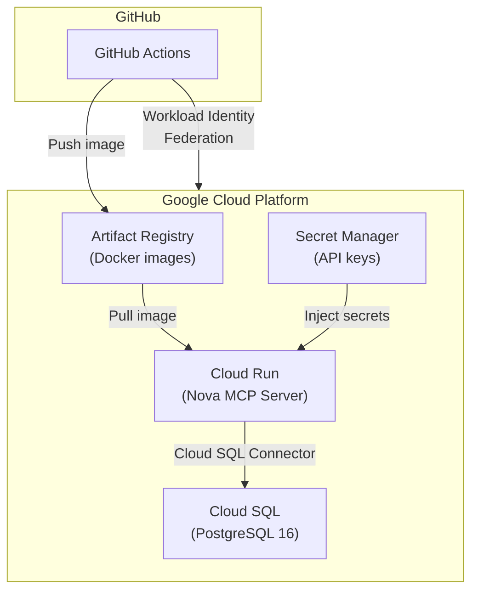
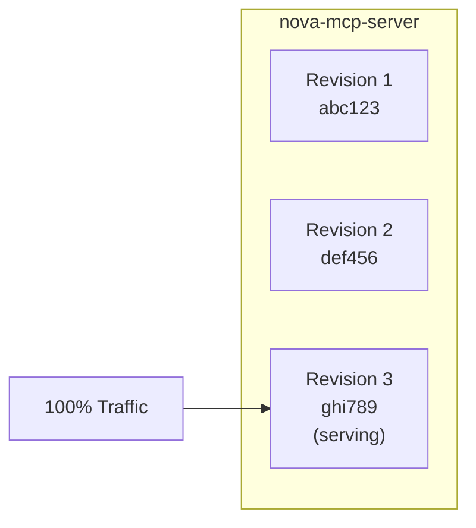
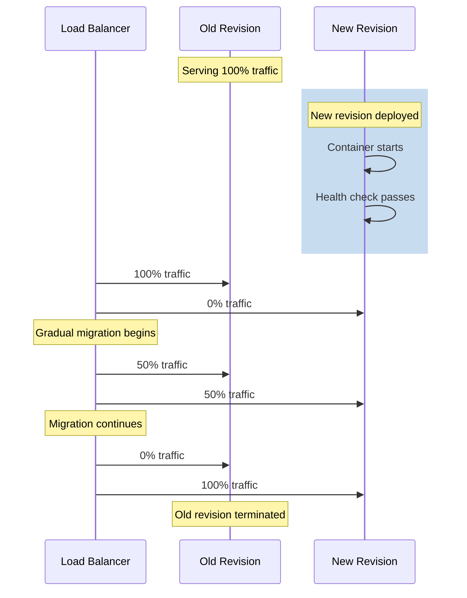
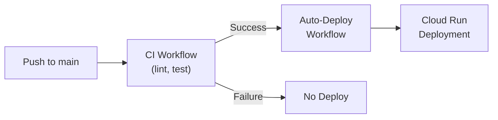
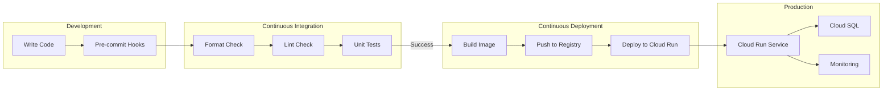

# Research

## Research Results

<details>
<summary>What are the best practices for provisioning related GCP resources like Cloud Run, Cloud SQL, and Artifact Registry using gcloud CLI commands in a single script for reproducibility?</summary>

### Source [3]: https://dev.to/devopsfundamentals/gcp-fundamentals-cloud-resource-manager-api-3ljm

Query: What are the best practices for provisioning related GCP resources like Cloud Run, Cloud SQL, and Artifact Registry using gcloud CLI commands in a single script for reproducibility?

Answer: The Cloud Resource Manager API underpins provisioning via gcloud for reproducible setups of related GCP resources. Create projects idempotently with `gcloud projects create my-new-project --name="My New Project" --organization=123456789012`. Integrate with Cloud Run for serverless deployments, Artifact Registry for managing container images, and other services within projects. Best practices include automation using gcloud or tools like Deployment Manager, strong IAM roles/service accounts, monitoring with Cloud Logging/Monitoring, regular audits for compliance, and enabling APIs. Set project and region consistently: `gcloud config set project my-example-project` and region. This foundation ensures scripts provision Cloud SQL, Cloud Run, and Artifact Registry reliably within hierarchical resource management.

-----

-----

### Source [4]: https://trendmicro.com/cloudoneconformity/knowledge-base/gcp/

Query: What are the best practices for provisioning related GCP resources like Cloud Run, Cloud SQL, and Artifact Registry using gcloud CLI commands in a single script for reproducibility?

Answer: Best practices for Cloud Run provisioning via gcloud scripting emphasize security and cost control for reproducibility. Ensure no publicly accessible Cloud Run services: configure ingress restrictions. Limit unrestricted outbound network access. Set maximum container instances to prevent uncontrolled scaling/costs, e.g., `--max-instances`. Configure minimum instances >0 for performance: `--min-instances`. Set request concurrency: `--concurrency`. Use latest runtime versions. Enable critical APIs like Security Command Center. Rotate API keys regularly. These gcloud flags in deploy/update commands like `gcloud run deploy` ensure idempotent, secure scripts for Cloud Run alongside SQL and registries.

-----

</details>

<details>
<summary>How do you configure GitHub Actions to authenticate with Google Cloud using Workload Identity Federation for deploying to Cloud Run?</summary>

### Source [6]: https://www.firefly.ai/academy/setting-up-workload-identity-federation-between-github-actions-and-google-cloud-platform

Query: How do you configure GitHub Actions to authenticate with Google Cloud using Workload Identity Federation for deploying to Cloud Run?

Answer: Workload Identity Federation (WIF) authenticates GitHub Actions with Google Cloud without service account keys, using short-lived tokens verified by Google Cloud. Configure Google Cloud by creating a Workload Identity Pool named 'github-wif' in the console. Add an identity provider with name 'github' and Issuer URL 'https://token.actions.githubusercontent.com'. In GitHub Actions workflow, use the 'google-github-actions/auth' action with 'workload_identity_provider', 'service_account' like 'github-wif@content-gen-418510.iam.gserviceaccount.com', and 'create_credentials_file: true' to authenticate. Trigger workflow by pushing to main branch to test integration.

-----

-----

### Source [7]: https://github.com/marketplace/actions/authenticate-to-google-cloud

Query: How do you configure GitHub Actions to authenticate with Google Cloud using Workload Identity Federation for deploying to Cloud Run?

Answer: The 'Authenticate to Google Cloud' GitHub Action supports Workload Identity Federation (WIF), recommended over service account keys as it avoids long-lived credentials and establishes trust delegation. For WIF through a Service Account, the Workload Identity Pool impersonates a Google Cloud Service Account with IAM permissions, exchanging GitHub's OIDC token for a Google Cloud OAuth 2.0 access token. GitHub Actions inherits the Service Account's permissions by proxy.

-----

-----

### Source [8]: https://github.com/google-github-actions/auth

Query: How do you configure GitHub Actions to authenticate with Google Cloud using Workload Identity Federation for deploying to Cloud Run?

Answer: This GitHub Action authenticates to Google Cloud via Workload Identity Federation or service account keys, with WIF preferred. Inputs include 'service_account' (optional email like 'my-service-account@my-project.iam.gserviceaccount.com') for WIF through a Service Account; without it, uses Direct WIF. Direct WIF grants the pool direct IAM permissions without intermediate service accounts, though not all resources support it. WIF through Service Account exchanges OIDC token for access token, proxying permissions.

-----

-----

### Source [9]: https://docs.cloud.google.com/iam/docs/workload-identity-federation-with-deployment-pipelines

Query: How do you configure GitHub Actions to authenticate with Google Cloud using Workload Identity Federation for deploying to Cloud Run?

Answer: To configure WIF for deployment pipelines like GitHub Actions, allow job to fetch GitHub ID token with 'permissions: id-token: write contents: read'. Add step: uses 'google-github-actions/auth@v1' with 'create_credentials_file: true' and 'workload_identity_provider: 'projects/...''. Example workflow: jobs.build runs on ubuntu-latest, checks out code, then authenticates.

-----

-----

### Source [10]: https://cloud.google.com/blog/products/identity-security/enabling-keyless-authentication-from-github-actions

Query: How do you configure GitHub Actions to authenticate with Google Cloud using Workload Identity Federation for deploying to Cloud Run?

Answer: Authenticate GitHub Actions to Google Cloud using WIF with the 'auth' action, eliminating service account keys. Set up by creating a Workload Identity Pool and Provider. Attribute mappings map GitHub Actions JWT claims (e.g., repository, username) to assertions for restricting authentication.

-----

-----

### Source [11]: https://security.googlecloudcommunity.com/community-blog-42/securing-your-ci-cd-pipeline-eliminate-long-lived-credentials-with-workload-identity-federation-2-3909

Query: How do you configure GitHub Actions to authenticate with Google Cloud using Workload Identity Federation for deploying to Cloud Run?

Answer: Use 'google-github-actions/auth' action in GitHub Actions workflows to authenticate to Google Cloud workload identity pool. This enables keyless access for CI/CD pipelines managing resources.

-----

-----

### Source [12]: https://docs.github.com/actions/deployment/security-hardening-your-deployments/configuring-openid-connect-in-google-cloud-platform

Query: How do you configure GitHub Actions to authenticate with Google Cloud using Workload Identity Federation for deploying to Cloud Run?

Answer: Guide configures GCP to trust GitHub's OIDC as federated identity for authentication. Includes workflow example using 'google-github-actions/auth'.

-----

</details>

<details>
<summary>What is the difference between workflow_dispatch and workflow_run in GitHub Actions and when should each be used?</summary>

### Source [14]: https://docs.github.com/actions/learn-github-actions/events-that-trigger-workflows

Query: What is the difference between workflow_dispatch and workflow_run in GitHub Actions and when should each be used?

Answer: This official documentation covers events that trigger workflows, including `workflow_dispatch` and `workflow_run`. `workflow_dispatch` enables manual triggering of workflows from the GitHub UI, CLI, or API, ideal for on-demand runs like deployments. `workflow_run` triggers a workflow based on the completion of another specified workflow, allowing chaining of workflows (e.g., run after a CI workflow succeeds). Use `workflow_dispatch` for manual control and `workflow_run` for automated sequencing after another workflow finishes.

-----

-----

### Source [15]: https://github.com/orgs/community/discussions/143795

Query: What is the difference between workflow_dispatch and workflow_run in GitHub Actions and when should each be used?

Answer: `workflow_dispatch` triggers a workflow manually. `workflow_run` triggers based on the completion of another workflow (e.g., `workflows: [Blah]`, `types: [completed]`). In a combined trigger (`on: workflow_dispatch: workflow_run:`), jobs may need conditional `if` logic like `${{ github.event.workflow_run.conclusion == 'success' }}` for `workflow_run` cases, but this skips manual runs. Workaround: Use `${{ github.event.workflow_run.conclusion != 'failure' }}` or OR conditions to handle both manual (`workflow_dispatch`) and automated (`workflow_run`) triggers without skipping jobs. Use `workflow_dispatch` for manual runs, `workflow_run` for post-completion automation.

-----

-----

### Source [17]: https://github.com/orgs/community/discussions/102876

Query: What is the difference between workflow_dispatch and workflow_run in GitHub Actions and when should each be used?

Answer: `workflow_dispatch` enables manual triggering. `workflow_run` (e.g., `workflows: ["Workflow A"]`, `types: [completed]`) triggers on any completion of another workflow, not just success, leading to many skipped runs. Common workaround: Use `if` conditions in jobs to filter for success (`${{ github.event.workflow_run.conclusion == 'success' }}`) or manual `workflow_dispatch` triggers. This is cumbersome with UI clutter. Feature request for `types: [success]`. Use `workflow_dispatch` for manual on-demand runs, `workflow_run` for automated follow-up after another workflow, with `if` for filtering outcomes.

-----

-----

### Source [18]: https://graphite.com/guides/github-actions-workflow-dispatch

Query: What is the difference between workflow_dispatch and workflow_run in GitHub Actions and when should each be used?

Answer: `workflow_dispatch` is designed for manual control over workflow execution, rather than automatic triggers on code changes or PRs. It allows triggering via GitHub UI (Actions tab > Run workflow), CLI, or API, with optional inputs (e.g., `environment`, `version`) for dynamic parameters. Useful for manual tasks like production deployments, database migrations requiring oversight. Configuration: `on: workflow_dispatch: inputs: {...}`. Access inputs via `${{ github.event.inputs.name }}`. No mention of `workflow_run`. Use `workflow_dispatch` when needing manual intervention and parameterization, not automation.

-----

-----

### Source [19]: https://blog.nimblepros.com/blogs/using-workflow-run-in-github-actions/

Query: What is the difference between workflow_dispatch and workflow_run in GitHub Actions and when should each be used?

Answer: `workflow_run` is used for post-build workflows, e.g., commenting on PRs after CI completes, allowing untrusted code builds safely. Example: Build workflow on `push`, `pull_request`, `workflow_dispatch`; separate workflow on `workflow_run` for PR comments, using artifacts download. Jobs use `if` for PR-only execution. `workflow_dispatch` supports manual triggering alongside event-based ones. Use `workflow_run` for secure, chained actions after primary workflows (e.g., CI → PR feedback), `workflow_dispatch` for ad-hoc manual runs.

-----

</details>

<details>
<summary>How does Cloud Run manage zero-downtime deployments when a new revision is rolled out?</summary>

### Source [21]: https://codelabs.developers.google.com/codelabs/cloud-run-deploy

Query: How does Cloud Run manage zero-downtime deployments when a new revision is rolled out?

Answer: Cloud Run manages deployments by treating each deployment as a new revision, which is brought online before traffic is redirected to it, enabling zero-downtime updates. For example, when updating the website, a new Docker image is built and deployed to Cloud Run, creating a new revision that receives traffic without interruption. Users can update concurrency settings on the current revision, which creates another revision with traffic redirected accordingly. Commands like 'gcloud run deploy --image=... --concurrency 80' demonstrate redeploying with changes while maintaining service availability. This approach allows scaling to zero when idle and simplifies management compared to VMs or Kubernetes.

-----

-----

### Source [22]: https://www.skills.google/focuses/10445?parent=catalog

Query: How does Cloud Run manage zero-downtime deployments when a new revision is rolled out?

Answer: Cloud Run enables rolling out a new version with zero downtime. It treats each deployment as a new revision. After modifying the website and building a new image, the update is applied without interrupting users. Cloud Run, based on Knative, supports scaling to zero and simplifies deployments without VM or Kubernetes overhead. The process involves deploying the container, modifying the site, and rolling out the new version seamlessly.

-----

</details>

<details>
<summary>Best practices for configuring Cloud Run autoscaling (min-instances, max-instances, concurrency) for stateful AI agent applications with spiky workloads and potential cold start issues.</summary>

### Source [34]: https://docs.cloud.google.com/run/docs/about-instance-autoscaling

Query: Best practices for configuring Cloud Run autoscaling (min-instances, max-instances, concurrency) for stateful AI agent applications with spiky workloads and potential cold start issues.

Answer: Cloud Run autoscales instances based on incoming requests, events, or CPU utilization, targeting 60% CPU utilization and 60% of maximum concurrency over a one-minute window. By default, services scale to zero instances when idle, but set **min-instances** to 1 or more for workloads with cold start latency issues or CPU usage when idle to keep instances warm. For spiky workloads, use **max-instances** to limit total instances, control costs, and prevent overloading backing services like Cloud SQL. Exceeding max-instances queues requests for up to 3.5 times average startup time or 10 seconds. Concurrency impacts scaling; the autoscaler considers current request concurrency. For stateful apps, note scaling to zero stops processing unless using wake-up requests or min-instances >0. During deployments, total instances may exceed per-revision max. Monitor instance count metrics. CPU utilization for multi-container instances sums container CPU limits. Set max-instances to avoid backing service quota issues with autoscaling.

-----

-----

### Source [35]: https://docs.cloud.google.com/run/docs/tips/general

Query: Best practices for configuring Cloud Run autoscaling (min-instances, max-instances, concurrency) for stateful AI agent applications with spiky workloads and potential cold start issues.

Answer: Optimize **concurrency** for performance: default max of 80 suits many images, but lower if the container cannot handle many simultaneous requests, or increase if it can process large volumes efficiently. Cloud Run automatically adjusts up to the configured maximum. For cold starts in spiky workloads, minimize container startup time as it impacts latency when scaling from zero; startup includes image download, entrypoint execution, and port listening. Use Cloud Run's container image streaming. Consider different execution environments for faster startups. These practices reduce latency for AI agent apps with potential cold starts.

-----

</details>

<details>
<summary>How to implement a feature flag or environment variable as a 'kill switch' in a GitHub Actions continuous deployment pipeline to control automated deployments to Cloud Run.</summary>

### Source [36]: https://developer.harness.io/docs/feature-management-experimentation/feature-management/manage-flags/use-the-kill-switch

Query: How to implement a feature flag or environment variable as a 'kill switch' in a GitHub Actions continuous deployment pipeline to control automated deployments to Cloud Run.

Answer: Use the kill switch feature in Harness to disable a feature flag without changing targeting rules or redeploying. If a feature flag negatively impacts performance or user experience, kill it to send all traffic to the default treatment. To kill a feature: Click **Kill** on the feature flag page, opening the Kill feature flag warning page. Type KILL in the warning field. Optionally add a title, comment, or approver. Click the **Kill** button. Once killed, a **Restore** button appears to reverse the decision and restore exact prior targeting rules. To restore: Click **Restore** on the feature flag page. Optionally add title, comment, approver, or change status. Click **Restore** button. For changes to targeting rules before going live, avoid Restore; edit rules and click **Review changes** instead. The Restore button then disappears. This provides emergency control without pipeline redeployment.

-----

-----

### Source [37]: https://www.youtube.com/watch?v=Quimadi3WaM

Query: How to implement a feature flag or environment variable as a 'kill switch' in a GitHub Actions continuous deployment pipeline to control automated deployments to Cloud Run.

Answer: LaunchDarkly enables building a kill switch flag to shut down flaky endpoints, risky features, or third-party APIs without redeploying. Create a kill switch flag: Click create flag, name it (e.g., 'show-avatars-in-rec'), select 'kill switch' template (preconfigured boolean). Copy the flag key from dashboard. In code (Python example), initialize LaunchDarkly client with SDK key from environment variable. Check flag: if on, use third-party API (e.g., cat API for avatars, enable recommendations); if off, fallback to static URL. Deploy code. Control via dashboard: toggle flag on/off instantly—no redeploy needed. Example: Turn off during issues, stops API calls immediately. Copy code from GitHub repo. Team members can toggle without ruining weekends. Links to LaunchDarkly docs for setup.

-----

-----

### Source [38]: https://betterprogramming.pub/feature-flag-2-0-how-to-take-your-kill-switch-to-the-next-level-643b5aa2676

Query: How to implement a feature flag or environment variable as a 'kill switch' in a GitHub Actions continuous deployment pipeline to control automated deployments to Cloud Run.

Answer: Enhance kill switches with 'Feature Flag 2.0' practices for production control. **Override the kill-switch**: Add ways to force feature functionality even when flag is off, for debugging in production (e.g., URL parameter, cookie, allow-list of logins/IPs). Balances accessibility with security. Position flags strategically early/late in flow for debugging/root cause isolation; use multiple flags in complex flows. Add 'report an issue' button near self-serve toggle to discourage non-critical use. **Notifications and Alerts**: Notify relevant people on flag changes (who, when, details) to avoid debugging confusion. Enables clients (e.g., banks) to disable urgently without escalation. Find sweet spot: accessible but not overused. Supports continuous deployment by allowing instant disable without rollback.

-----

-----

### Source [39]: https://github.com/confluentinc/vscode/discussions/353

Query: How to implement a feature flag or environment variable as a 'kill switch' in a GitHub Actions continuous deployment pipeline to control automated deployments to Cloud Run.

Answer: Use LaunchDarkly feature flags as kill switches in VS Code extension for Confluent. Example: Disable specific versions of Confluent for VS Code (kill switch) after 6 months or for vulnerabilities. Proposal: VS Code extension evaluates kill switch flag before starting sidecar. Sidecar evaluates LD flags. Use IDE-specific and CCloud-specific flags. Contexts include anonymous device IDs from sidecar, CCloud user. This controls deployment/behavior without code changes, enabling emergency disable of problematic versions.

-----

-----

### Source [40]: https://github.com/Unleash/unleash

Query: How to implement a feature flag or environment variable as a 'kill switch' in a GitHub Actions continuous deployment pipeline to control automated deployments to Cloud Run.

Answer: Unleash is an open-source feature flag solution supporting kill switches for emergency control in continuous deployment. Features include A/B testing, 2 environments, organizing flags with tags. Extends to continuous delivery/deployment pipelines.

-----

-----

### Source [41]: https://github.com/Unleash/unleash-mcp

Query: How to implement a feature flag or environment variable as a 'kill switch' in a GitHub Actions continuous deployment pipeline to control automated deployments to Cloud Run.

Answer: Unleash MCP server for feature flagging. Operational flags for system behavior (longer-lived). Kill switches for emergency controls (maintain until stable). Supports GitHub Actions-like pipelines for controlling deployments.

-----

-----

### Source [42]: https://github.com/Unleash/community-content/issues/16

Query: How to implement a feature flag or environment variable as a 'kill switch' in a GitHub Actions continuous deployment pipeline to control automated deployments to Cloud Run.

Answer: Unleash discussion on using feature flags for continuous delivery into continuous deployment. Covers kill switches to manage deployments without rollbacks.

-----

</details>

<details>
<summary>What constitutes an effective automated smoke test in a GitHub Actions workflow after deploying a new revision to a Cloud Run service that connects to a Cloud SQL database?</summary>

### Source [44]: https://www.youtube.com/watch?v=SFW7Ecj5TNE

Query: What constitutes an effective automated smoke test in a GitHub Actions workflow after deploying a new revision to a Cloud Run service that connects to a Cloud SQL database?

Answer: In a pull request workflow, run **smoke tests first** using Cypress GitHub Action with cypress-grep plugin to tag and filter smoke tests across spec files. Record results to Cypress Dashboard with group and tag for easy identification. If all smoke tests pass, proceed to run all end-to-end tests. This quickly detects if something goes terribly wrong without running the full suite, providing fast feedback in GitHub Actions.

-----

-----

### Source [45]: https://github.com/cloudfoundry/cf-smoke-tests

Query: What constitutes an effective automated smoke test in a GitHub Actions workflow after deploying a new revision to a Cloud Run service that connects to a Cloud SQL database?

Answer: Smoke tests are a suite of **basic core functionality tests** suitable as an initial test against a new or updated deployment. They test fundamental operations without extensive setup. Requires: running CF instance, $CONFIG json with credentials (org, space, admin user), use_existing_space=true for production-like environments. Run with ./bin/test (uses ginkgo), supports --keep-going, --flake-attempts, -p for parallel execution. Admin config allows creating resources automatically, ideal for CI environments.

-----

-----

### Source [46]: https://github.com/GoogleCloudPlatform/cloud-run-anthos-reference-web-app/issues/47

Query: What constitutes an effective automated smoke test in a GitHub Actions workflow after deploying a new revision to a Cloud Run service that connects to a Cloud SQL database?

Answer: An example **smoke test** after Cloud Run deployment: Run Cloud Build scripts and ensure they complete successfully; hit the frontend and confirm it responds correctly. This validates basic deployment functionality.

-----

-----

### Source [47]: https://github.com/orgs/community/discussions/175488

Query: What constitutes an effective automated smoke test in a GitHub Actions workflow after deploying a new revision to a Cloud Run service that connects to a Cloud SQL database?

Answer: After deployment, run **health checks or validations (e.g., API tests, smoke tests)**. If they fail, trigger rollback to previous version. Smoke tests verify service health post-deployment in GitHub Actions workflow.

-----

-----

### Source [67]: https://www.testmo.com/guides/how-to-launch-test-automation-in-github-actions-with-testmo/

Query: What constitutes an effective automated smoke test in a GitHub Actions workflow after deploying a new revision to a Cloud Run service that connects to a Cloud SQL database?

Answer: An effective automated smoke test in a GitHub Actions workflow includes a 'test' job that executes tests in parallel threads after a 'build' step and before a 'deploy' step. The workflow sequence is: 'build' (dummy code build), 'test-setup' (creates automation run in Testmo), 'test' (runs smoke tests), 'test-complete' (submits results to Testmo), and 'deploy' (deploys to target environment with dataset). This setup supports on-demand building, smoke testing, and deploying to a specified environment with testing data from Testmo. The workflow is configured for scenarios like 'smoke test & deploy code with data', using npx testmo commands to create test runs and report results. Automation targets in Testmo allow triggering the GitHub Actions workflow with parameters for environments or datasets, providing end-to-end visibility. Success is indicated by all steps completing green, ensuring the code is smoke-tested before deployment.

-----

-----

### Source [68]: https://github.com/cloudfoundry/cf-smoke-tests

Query: What constitutes an effective automated smoke test in a GitHub Actions workflow after deploying a new revision to a Cloud Run service that connects to a Cloud SQL database?

Answer: Smoke tests constitute a suite of basic core functionality tests suitable as an initial test against a new or updated deployment. They verify essential operations and are ideal for post-deployment validation. Tests require a running instance, configuration via $CONFIG JSON file specifying credentials (regular or admin user), and dependencies like Go, Git, CF CLI, and curl. For regular users (recommended for production), use existing spaces with OrgManager/SpaceManager roles. Admin users can create resources dynamically for CI environments. Execute with ./bin/test, supporting Ginkgo flags like -p for parallel execution, --keep-going, or --flake-attempts. This setup ensures core functionality post-deployment without extensive testing.

-----

-----

### Source [69]: https://github.com/GoogleCloudPlatform/cloud-run-anthos-reference-web-app/issues/47

Query: What constitutes an effective automated smoke test in a GitHub Actions workflow after deploying a new revision to a Cloud Run service that connects to a Cloud SQL database?

Answer: An effective automated smoke test after deploying to Cloud Run includes running Cloud Build scripts to ensure they complete successfully and hitting the frontend to verify it responds correctly. These tests gate new pull requests, requiring successful execution before merging. Smoke tests focus on basic validation of deployment artifacts and service availability.

-----

-----

### Source [70]: https://www.virtuosoqa.com/testing-guides/smoke-testing

Query: What constitutes an effective automated smoke test in a GitHub Actions workflow after deploying a new revision to a Cloud Run service that connects to a Cloud SQL database?

Answer: Smoke tests trigger automatically after build deployment in CI/CD pipelines like GitHub Actions. They execute in parallel across cloud-based environments to validate core functionality quickly post-deployment, ensuring the build is stable before further testing or production use.

-----

-----

### Source [71]: https://github.com/orgs/community/discussions/175488

Query: What constitutes an effective automated smoke test in a GitHub Actions workflow after deploying a new revision to a Cloud Run service that connects to a Cloud SQL database?

Answer: Post-deployment smoke tests in GitHub Actions involve running health checks or validations such as API tests or smoke tests. If these fail, they can trigger rollback steps to restore the previous version, confirming service health after deploying a new revision.

-----

</details>

<details>
<summary>What are the pros and cons of continuous deployment for iterative AI development workflows, such as prompt engineering, and what are the associated risks like blast radius?</summary>

### Source [48]: https://ionic.io/resources/articles/the-benefits-and-pitfalls-of-continuous-delivery

Query: What are the pros and cons of continuous deployment for iterative AI development workflows, such as prompt engineering, and what are the associated risks like blast radius?

Answer: Continuous deployment enhances code quality by enabling frequent updates, making it easier to isolate problems and mitigate risks, resulting in stable software. It streamlines workflows and makes software releases more efficient and less risky when implemented correctly through a robust CI/CD pipeline. Continuous integration merges code changes frequently, while continuous delivery ensures changes are ready for production deployment.

Challenges include the need for comprehensive testing with frequent code changes and shorter release cycles to ensure bug-free releases. Frequent code changes challenge teams, requiring well-defined processes, clear responsibilities, and deadlines. A key pitfall is the risk of deploying faulty code to production, potentially disrupting user experience. This underscores the importance of a robust release process with thorough testing, reviews, and staged deployments. Extensive automated testing, frequent changes, and a strong CD pipeline are challenging but mitigable with proper CI/CD implementation.

-----

-----

### Source [49]: https://galileo.ai/blog/cd-vs-ct-ai

Query: What are the pros and cons of continuous deployment for iterative AI development workflows, such as prompt engineering, and what are the associated risks like blast radius?

Answer: Continuous Delivery (CD) in AI accelerates delivery with deterministic, rule-based logic triggered by events like code merges or model updates, but speed depends on infrastructure. Limited test environments or slow orchestration create bottlenecks, and strict gates ensure safety but can delay releases due to approvals or resources.

CD's risk profile is visible and infrastructure-centered: failures like broken deployments, failed API endpoints, or misconfigured environments cause immediate production outages or degraded availability. Deployment regressions from improperly tested changes are detectable, with system crashes, alerts, and straightforward rollbacks. The primary risk is releasing without sufficient validation gates.

In AI contexts, CD works alongside Continuous Training (CT) for scalable systems. CT handles unpredictable real-world signals like concept drift, requiring observability, automated triggers, and version control. Together, they align operations and data science teams, creating a shared improvement cycle for technical stability and business outcomes, making AI systems more reliable and capable.

-----

-----

### Source [50]: https://devcycle.com/blog/pros-and-cons-explored-continuous-integration-deployment

Query: What are the pros and cons of continuous deployment for iterative AI development workflows, such as prompt engineering, and what are the associated risks like blast radius?

Answer: Continuous deployment (CD) automatically releases code live after passing automated tests, offering quicker updates to users without manual staging or verification. It speeds up deployment time, getting products to consumers faster—reducing cycles from days, weeks, or months—and cuts development downtime.

CI/CD benefits include increased speed of deployment, testing, and analysis; testing smaller code sections enables faster builds and easy error pinpointing; smaller backlogs; and preventing broken code shipment. CI automates building, packaging, testing (unit, integration, system), providing feedback that changes didn't break existing code. Frequent small commits improve collaboration and quality, as errors are easier to find in smaller pieces, reducing merge conflicts.

Drawbacks: Large upfront investment and new skills for developers, though recouped by productivity gains and early bug catching. Integrating big changes complicates error identification due to more code to check. Legacy systems often don't support CI/CD, requiring upgrades to stay competitive. CI standardizes processes across platforms for better collaboration.

-----

</details>

<details>
<summary>What are the step-by-step gcloud commands to provision and configure a secure connection between a Cloud Run service and a Cloud SQL for PostgreSQL instance?</summary>

### Source [51]: https://codelabs.developers.google.com/codelabs/cloud-sql-go-connector

Query: What are the step-by-step gcloud commands to provision and configure a secure connection between a Cloud Run service and a Cloud SQL for PostgreSQL instance?

Answer: To provision and configure a secure connection between Cloud Run and Cloud SQL for PostgreSQL using IAM authentication:

1. Enable APIs:
```
gcloud services enable compute.googleapis.com sqladmin.googleapis.com run.googleapis.com artifactregistry.googleapis.com cloudbuild.googleapis.com servicenetworking.googleapis.com
```

2. Create service account (assuming quickstart-service-account created earlier):
```
gcloud projects add-iam-policy-binding ${GOOGLE_CLOUD_PROJECT} \
--member="serviceAccount:quickstart-service-account@${GOOGLE_CLOUD_PROJECT}.iam.gserviceaccount.com" \
--role="roles/cloudsql.client"
```

3. Create Cloud SQL instance with IAM auth:
```
gcloud sql instances create quickstart-instance \
--database-version=POSTGRES_14 \
--cpu=1 \
--memory=4GB \
--region=us-central1 \
--database-flags=cloudsql.iam_authentication=on
```

4. Create database:
```
gcloud sql databases create quickstart_db \
--instance=quickstart-instance
```

5. Create PostgreSQL user for service account (via psql or console).

6. Deploy Cloud Run service:
```
gcloud run deploy helloworld \
--region=us-central1 \
--source=. \
--set-env-vars INSTANCE_CONNECTION_NAME="${GOOGLE_CLOUD_PROJECT}:us-central1:quickstart-instance" \
--set-env-vars DB_NAME="quickstart_db" \
--set-env-vars DB_USER="quickstart-service-account@${GOOGLE_CLOUD_PROJECT}.iam" \
--service-account="quickstart-service-account@${GOOGLE_CLOUD_PROJECT}.iam.gserviceaccount.com" \
--allow-unauthenticated
```
This uses Cloud SQL Go Connector with IAM database authentication.

-----

-----

### Source [52]: https://docs.cloud.google.com/sql/docs/postgres/connect-instance-cloud-run

Query: What are the step-by-step gcloud commands to provision and configure a secure connection between a Cloud Run service and a Cloud SQL for PostgreSQL instance?

Answer: Quickstart for connecting Cloud Run to Cloud SQL PostgreSQL using private IP or public IP with SSL:

1. Enable APIs:
```
gcloud services enable compute.googleapis.com sqladmin.googleapis.com run.googleapis.com containerregistry.googleapis.com cloudbuild.googleapis.com servicenetworking.googleapis.com
```

2. For Private IP:
- Allocate IP range:
```
gcloud compute addresses create google-managed-services-default --global --purpose=VPC_PEERING --prefix-length=16 --description="peering range for Google" --network=default
```
- Connect peering:
```
gcloud services vpc-peerings connect ...
```
- Create instance without public IP:
```
gcloud sql instances create quickstart-instance --database-version=POSTGRES_14 --cpu=1 --memory=4GB --region=us-central --root-password=DB_ROOT_PASSWORD --no-assign-ip --network=default
```
- Require SSL:
```
gcloud sql instances patch quickstart-instance --require-ssl
```

3. Deploy Cloud Run with Cloud SQL proxy or direct connect:
For Cloud SQL Auth Proxy:
```
gcloud run deploy run-sql --image gcr.io/YOUR_PROJECT_ID/run-sql --add-cloudsql-instances INSTANCE_CONNECTION_NAME --set-env-vars INSTANCE_CONNECTION_NAME="..." --set-env-vars DB_NAME="quickstart-db" --set-env-vars DB_USER="quickstart-user" --set-env-vars DB_PASS="DB_PASS"
```

For Private IP:
```
gcloud run deploy run-sql --image gcr.io/YOUR_PROJECT_ID/run-sql --add-cloudsql-instances INSTANCE_CONNECTION_NAME --vpc-egress=all-traffic --network=default --subnet=default --set-env-vars DB_NAME="quickstart-db" --set-env-vars DB_USER="quickstart-user" --set-env-vars DB_PASS="DB_PASS" --set-env-vars INSTANCE_CONNECTION_NAME="INSTANCE_CONNECTION_NAME"
```

-----

-----

### Source [53]: https://docs.cloud.google.com/sql/docs/postgres/connect-run

Query: What are the step-by-step gcloud commands to provision and configure a secure connection between a Cloud Run service and a Cloud SQL for PostgreSQL instance?

Answer: To connect Cloud Run to Cloud SQL PostgreSQL instance:

1. Get instance connection name:
```
gcloud sql instances describe INSTANCE_NAME
```

2. Get Cloud Run service account (from IAM page or default compute service account).

3. Grant Cloud SQL Client role to service account:
```
gcloud projects add-iam-policy-binding PROJECT_ID --member="serviceAccount:SERVICE_ACCOUNT" --role="roles/cloudsql.client"
```

4. For new deployment:
```
gcloud run deploy SERVICE_NAME --image=IMAGE --add-cloudsql-instances=INSTANCE_CONNECTION_NAME
```

For existing service update:
```
gcloud run services update SERVICE_NAME --add-cloudsql-instances=INSTANCE_CONNECTION_NAME
```

This enables the Cloud SQL connector which provides secure connection without needing VPC or public IP. The Cloud Run service account must have Cloud SQL Client IAM role. Use environment variables like INSTANCE_CONNECTION_NAME, DB_USER, DB_NAME in your application code.

-----

</details>

<details>
<summary>How does Cloud Run's traffic splitting mechanism work during a zero-downtime deployment, and what are the best practices for managing revisions?</summary>

### Source [54]: https://cloud.google.com/blog/products/serverless/cloud-run-now-supports-gradual-rollouts-and-rollbacks

Query: How does Cloud Run's traffic splitting mechanism work during a zero-downtime deployment, and what are the best practices for managing revisions?

Answer: Cloud Run supports gradual rollouts and rollbacks by allowing manual traffic splitting between revisions for zero-downtime deployments. You can decide to split traffic between revisions, enabling gradual rollouts or rollbacks to older versions. For example, in a staged rollout: On Day 1, deploy a new revision tagged 'green' with 0% traffic using `gcloud beta run services update-traffic myservice --to-tags green=0`. On Day 2, move 10% traffic to it: `gcloud beta run services update-traffic myservice --to-tags green=10`. On Day 3, shift to 50%: `gcloud beta run services update-traffic myservice --to-tags green=50`. On Day 4, route 100%: `gcloud beta run services update-traffic myservice --to-tags green=100`. The rollout completes with the new revision serving all traffic. Rollouts can be faster, over hours, using the same commands. This mechanism ensures controlled traffic distribution during deployments.

-----

-----

### Source [56]: https://systemdr.substack.com/p/issue-125-rolling-deployments-strategies

Query: How does Cloud Run's traffic splitting mechanism work during a zero-downtime deployment, and what are the best practices for managing revisions?

Answer: Cloud Run's traffic splitting enables percentage-based gradual rollouts without infrastructure management, supporting zero-downtime deployments. Use the command: `gcloud run services update-traffic myservice --to-revisions=new-revision=10,old-revision=90`. This directs 10% traffic to the new revision and 90% to the old one, allowing testing of new code with real traffic while maintaining stability for the majority. Best practices include leveraging this for controlled rollouts in CI/CD pipelines.

-----

-----

### Source [57]: https://www.certlibrary.com/blog/understanding-google-cloud-run-seamless-scalability-for-stateless-containers/

Query: How does Cloud Run's traffic splitting mechanism work during a zero-downtime deployment, and what are the best practices for managing revisions?

Answer: Cloud Run provides sophisticated traffic management for zero-downtime deployments, allowing gradual rollouts by splitting traffic between different revisions. New versions can be tested with a small portion of traffic while the previous version serves the majority, reducing failure risks. If issues arise, immediate rollback to a prior stable revision is supported without downtime. Advanced control enables precise traffic routing among revisions for A/B testing, gradual rollouts, and blue-green strategies. Best practices include using these for CI/CD adoption, ensuring high availability during updates. Intelligent traffic routing and load balancing distribute requests efficiently across instances.

-----

</details>

<details>
<summary>What are the practical tradeoffs of using gcloud CLI scripts versus a full IaC tool like Terraform for a project focused on teaching CI/CD fundamentals to aspiring AI engineers?</summary>

### Source [58]: https://cloud.google.com/cli

Query: What are the practical tradeoffs of using gcloud CLI scripts versus a full IaC tool like Terraform for a project focused on teaching CI/CD fundamentals to aspiring AI engineers?

Answer: The gcloud CLI supports over 8,000 commands for complete management and control over nearly all Google Cloud services and products, enabling scripting for automation. It provides data emulators for local development, testing, and validation of services like Bigtable, Cloud Datastore, Firestore, Spanner, and Pub/Sub. Refineable output verbosity allows control over command response verbosity, list page sizes, and filters for customized usage. A preview feature exports the current state of cloud resources and configurations into a Terraform-compatible text file, useful for reapplying configurations, duplicating environments, reverting to known states, or DevOps management. This export capability bridges gcloud CLI usage to Terraform, highlighting a tradeoff where gcloud offers direct, imperative resource management and scripting simplicity, while facilitating transition to declarative IaC tools like Terraform for more structured reproducibility. For teaching CI/CD fundamentals, gcloud CLI scripts provide quick, straightforward automation with broad command coverage but lack native declarative planning or state management compared to full IaC tools.

-----

-----

### Source [59]: https://docs.cloud.google.com/docs/terraform/terraform-overview

Query: What are the practical tradeoffs of using gcloud CLI scripts versus a full IaC tool like Terraform for a project focused on teaching CI/CD fundamentals to aspiring AI engineers?

Answer: Terraform is the most commonly used tool to provision and automate Google Cloud infrastructure using declarative syntax via the Google Cloud provider. Users specify the preferred end state in configuration files, enabling reproducible deployments across development, test, and production environments. Key features include generating an execution plan with `terraform plan` to preview changes and avoid surprises, and `terraform apply` which provisions infrastructure, creates a state file mapping config to real resources, and handles create/update/destroy operations based on state comparisons. Modules allow packaging and reusing code with standard interfaces, improving readability and team organization; Google publishes opinionated modules as blueprints. Tradeoffs versus gcloud CLI scripts: Terraform offers declarative end-state definition, execution plans for safe modifications, built-in state management for drift detection, and modularity for complex projects, making it ideal for teaching CI/CD reproducibility and governance. However, it requires learning configuration syntax, state file management (e.g., remote backends), and is less suited for ad-hoc, imperative tasks where gcloud's direct commands excel.

-----

-----

### Source [60]: https://dev.to/waddy/getting-started-to-using-terraform-to-manage-google-cloud-resources-o6a

Query: What are the practical tradeoffs of using gcloud CLI scripts versus a full IaC tool like Terraform for a project focused on teaching CI/CD fundamentals to aspiring AI engineers?

Answer: Terraform manages Google Cloud resources and integrates with gcloud CLI for authentication and state management. Install gcloud to create credentials via `gcloud auth login`, generating `~/.config/gcloud/application_default_credentials.json.db` used by Terraform. Use `gsutil` (part of gcloud components) to create a Cloud Storage bucket for Terraform state: `gsutil mb gs://<bucket>`. Terraform initialization with GCS backend: `terraform init -backend-config="bucket=<bucket>"`, configuring remote state storage. A Docker-based wrapper script mounts gcloud credentials for containerized Terraform runs, avoiding local installation. Tradeoffs for CI/CD teaching: gcloud CLI provides simple setup for credentials and buckets, enabling quick resource scripting but lacks declarative configs and state tracking. Terraform builds on gcloud for auth/state, adding reproducibility via plans/applies but introduces complexity in backend config, providers, and Docker integration. For aspiring AI engineers, gcloud suits basic CI/CD scripting; Terraform teaches advanced IaC practices like state management and modularity, though requiring gcloud prerequisite.

-----

-----

### Source [61]: https://cloud.google.com/blog/products/compliance/google-cloud-cli-terraform-validation-preview

Query: What are the practical tradeoffs of using gcloud CLI scripts versus a full IaC tool like Terraform for a project focused on teaching CI/CD fundamentals to aspiring AI engineers?

Answer: gcloud beta terraform vet is a client-side tool for policy validation of Terraform configurations using google/google-beta providers, providing guardrails to reduce misconfigurations. Benefits include enforcing organizational policies at any development stage, automating validation to prevent manual errors, and failing fast with pre-deployment checks. Developers validate configs against a central policy library before CI/CD submission; security teams maintain the library. Workflow: Generate `tfplan.json` via `terraform show -json`, install `gcloud components install terraform-tools`, run `gcloud beta terraform vet tfplan.json --policy-library=.` for pass/fail results. Tradeoffs versus pure gcloud scripts: gcloud CLI scripting offers direct control without IaC overhead but lacks built-in policy enforcement or declarative validation. Integrating gcloud's vet tool with Terraform adds governance to IaC workflows, ideal for teaching CI/CD security/compliance fundamentals. For simple projects, gcloud alone is faster; Terraform + gcloud vet provides robust, auditable pipelines but requires plan generation and policy setup, increasing learning curve for aspiring engineers.

-----

</details>

<details>
<summary>What are the pros and cons of implementing continuous deployment for iterative AI development workflows, such as prompt engineering, and what are the associated risks like blast radius?</summary>

### Source [62]: https://sidgs.com/ai-in-continuous-delivery-deployment-a-game-changer-for-devops/

Query: What are the pros and cons of implementing continuous deployment for iterative AI development workflows, such as prompt engineering, and what are the associated risks like blast radius?

Answer: Continuous deployment automatically deploys changes to production without human intervention, relying on robust testing, monitoring, and rollbacks for stability. AI in continuous delivery and deployment offers pros including increased speed by accelerating the delivery process and reducing time-to-market through automation of testing and deployment; improved accuracy via precise data analysis for decision-making and error detection; reduced human error by automating repetitive tasks like testing, code reviews, and deployment. AI enables predictive analytics to predict optimal release times using historical data, performance metrics, and user feedback; risk assessment to identify potential risks, conflicts, dependencies, and suggest mitigation strategies; release optimization by recommending deployment strategies based on code complexity, system performance, and user feedback. Challenges include data quality requiring high-quality, accurate data with proper collection and preprocessing; bias and ethics risks like discrimination or privacy violations, needing fair, transparent systems and regular monitoring; skillset and expertise gaps requiring training and upskilling for AI technologies.

-----

-----

### Source [63]: https://circleci.com/blog/risks-rewards-generative-ai/

Query: What are the pros and cons of implementing continuous deployment for iterative AI development workflows, such as prompt engineering, and what are the associated risks like blast radius?

Answer: Generative AI streamlines workflows and accelerates development cycles in software development. Pros include efficiency gains and accelerated time-to-market. Risks and cons encompass increased technical debt from rapid code generation leading to lower-quality design, shortcuts, reduced maintainability, and higher long-term costs if proper practices like modular design and clean code are bypassed. To mitigate, use experienced developers to guide AI, ensure adherence to standards, integrate test coverage, reporting, continuous validation in CI/CD pipelines for code quality, security, compliance, and functionality, and rapid feedback loops. Vet and test all AI-generated code for functionality, IP issues, vulnerabilities. Robust CI/CD tests allow safe AI integration without exposing to uncertainty and risk.

-----

-----

### Source [64]: https://www.devopsdigest.com/ai-powered-development-tools-benefits-introducing-complexity-risk

Query: What are the pros and cons of implementing continuous deployment for iterative AI development workflows, such as prompt engineering, and what are the associated risks like blast radius?

Answer: AI-powered development tools show benefits like 95% of engineering leaders and 98% of developers believing AI reduces burnout greatly. Cons and risks include 92% of developers reporting AI increases the blast radius from bad code reaching production; 67% spend more time debugging AI-generated code; 68% spend more time resolving AI-related security vulnerabilities; 59% experience deployment errors at least half the time when using AI tools. Shadow AI raises governance and compliance alarms.

-----

-----

### Source [65]: https://www.harness.io/blog/pros-and-cons-of-ai-in-software-delivery

Query: What are the pros and cons of implementing continuous deployment for iterative AI development workflows, such as prompt engineering, and what are the associated risks like blast radius?

Answer: AI in software delivery has pros like streamlining development cycles, enhancing quality assurance. Cons include learning curve and costs for training or hiring specialized talent; overreliance and dependency on AI without human oversight leading to risks, requiring balance between automation and human judgment with override capability; initial investment and infrastructure costs for tools and training, needing cost-benefit assessment and defined AI strategy.

-----

-----

### Source [66]: https://axify.io/blog/impact-of-ai-on-software-development

Query: What are the pros and cons of implementing continuous deployment for iterative AI development workflows, such as prompt engineering, and what are the associated risks like blast radius?

Answer: AI impacts software development by estimating delivery timelines, prioritizing backlogs, flagging risks earlier, reshaping resource allocation. In continuous deployment contexts, AI leads to faster throughput but not always better stability; generates longer, repetitive, complex code, hallucinates non-existent functions, over-engineers solutions, requiring validation to avoid maintenance issues. AI does not replace testing or reviews but shifts human judgment application. Per 2024 DORA report, AI causes 1.5% drop in delivery throughput and 7.2% reduction in delivery stability. 2025 report shows AI now improves throughput but still increases instability, indicating systems not evolved to manage AI-accelerated development safely.

-----

</details>


## Sources Scraped From Research Results

<details>
<summary>https://docs.cloud.google.com/sdk/docs/install</summary>

```markdown
# Install the Google Cloud CLI

This quickstart describes the recommended method to install and initialize the
Google Cloud CLI. After initialization, run a few core
gcloud CLI commands to view information about your installation
and verify it was successful.

## Before you begin

Sign in to your Google Cloud account. If you're new to
Google Cloud, create an account to evaluate how our products perform in
real-world scenarios. New customers also get $300 in free credits to
run, test, and deploy workloads.

In the Google Cloud console, on the project selector page,
select or create a Google Cloud project.

**Roles required to select or create a project**

- **Select a project**: Selecting a project doesn't require a specific
IAM role—you can select any project that you've been
granted a role on.

- **Create a project**: To create a project, you need the Project Creator role
(`roles/resourcemanager.projectCreator`), which contains the
`resourcemanager.projects.create` permission. Learn how to grant
roles.

Verify that billing is enabled for your Google Cloud project.

In the Google Cloud console, on the project selector page,
select or create a Google Cloud project.

**Roles required to select or create a project**

- **Select a project**: Selecting a project doesn't require a specific
IAM role—you can select any project that you've been
granted a role on.

- **Create a project**: To create a project, you need the Project Creator role
(`roles/resourcemanager.projectCreator`), which contains the
`resourcemanager.projects.create` permission. Learn how to grant
roles.

Verify that billing is enabled for your Google Cloud project.

## Install gcloud CLI version 553.0.0

LinuxDebian/UbuntuRed Hat/Fedora/CentOSmacOSWindowsChromebookMore

1. Confirm that you have a supported version of Python. The Google Cloud CLI requires
    Python 3.10 to 3.14. The x86\_64 Linux package includes
    a bundled Python interpreter that will be preferred by default. For
    information on how to choose and configure your Python interpreter, see the
    [`gcloud topic startup` documentation](https://docs.cloud.google.com/sdk/gcloud/reference/topic/startup).

2. Download one of the following:

| Platform | Package name | Size | SHA256 Checksum |
| --- | --- | --- | --- |
| Linux 64-bit <br>(x86\_64) | [google-cloud-cli-linux-x86\_64.tar.gz](https://dl.google.com/dl/cloudsdk/channels/rapid/downloads/google-cloud-cli-linux-x86_64.tar.gz) | 203.4 MB | b7b28c1d0a2e78a4b063e4f0b8ed5d4b5754fbb62cf335aa8c8003988e08bdd8 |
| Linux 64-bit <br>(Arm) | [google-cloud-cli-linux-arm.tar.gz](https://dl.google.com/dl/cloudsdk/channels/rapid/downloads/google-cloud-cli-linux-arm.tar.gz) | 58.2 MB | eea7b4a6d2fc1ee0a08e32796d9a8ff0e8e5f33aa021818229d4d25f3b7c0863 |
| Linux 32-bit <br>(x86) | [google-cloud-cli-linux-x86.tar.gz](https://dl.google.com/dl/cloudsdk/channels/rapid/downloads/google-cloud-cli-linux-x86.tar.gz) | 58.2 MB | b76abc6887925c151814953666a5db9c71158a658d9d5f2b04d3c8d40cb203f9 |

To download the Linux archive file, run the following command:

```
curl -O https://dl.google.com/dl/cloudsdk/channels/rapid/downloads/google-cloud-cli-linux-x86_64.tar.gz
```

Refer to the table above and replace google-cloud-cli-linux-x86\_64.tar.gz with the
    `*.tar.gz` package name that applies to your configuration.

3. To extract the contents of the file to your file system, run the following command:

```
tar -xf google-cloud-cli-linux-x86_64.tar.gz
```

    To replace an existing installation, delete the existing
    `google-cloud-sdk` directory and then extract the archive to the
    same location.

4. Run the installation script from the root of the folder you
    extracted:

```
./google-cloud-sdk/install.sh
```

    The script prompts you to perform the following setup actions. To accept,
    answer `Y` when prompted.

   - Add the gcloud CLI to your `PATH`.
   - Enable command completion.
   - Opt in to send [anonymous usage statistics](https://docs.cloud.google.com/sdk/docs/usage-statistics)
      to help improve the gcloud CLI.

You can also perform the installation non-interactively by providing flags.
To view available flags, run:

```
./google-cloud-sdk/install.sh --help
```

5. Optional: If you updated your `PATH` in the previous step, open a new
    terminal so that the changes take effect.

**Package contents**

The gcloud CLI is available in package format for installation on Debian and Ubuntu
systems. This package contains the `gcloud`, `gcloud alpha`,
`gcloud beta`, `gsutil`, and `bq` command-line tools only. It
doesn't include `kubectl` or the App Engine extensions required to deploy an
application using `gcloud` commands. If you want these components, you must
[install them separately](https://docs.cloud.google.com/sdk/docs/install-sdk#deb-additional).

**Before you begin**

Before you install the gcloud CLI, make sure that your operating system meets the
following requirements:

- It is an Ubuntu release that hasn't reached
[end-of-life](https://wiki.ubuntu.com/Releases) or a Debian stable
release that hasn't reached
[end-of-life](https://www.debian.org/releases).
- It has recently updated its packages. To do this now, run the following command:

```
sudo apt-get update
```

- It has `apt-transport-https`, `ca-certificates`, `gnupg`,
and `curl` installed. To install these packages, run the following command:

```
sudo apt-get install apt-transport-https ca-certificates gnupg curl
```

**Installation**

1. Import the Google Cloud public key.
   - For newer distributions (Debian 9+ or Ubuntu 18.04+) run the
      following command:

```
curl https://packages.cloud.google.com/apt/doc/apt-key.gpg | sudo gpg --dearmor -o /usr/share/keyrings/cloud.google.gpg
```

   - For older distributions, run the following command:

```
curl https://packages.cloud.google.com/apt/doc/apt-key.gpg | sudo apt-key --keyring /usr/share/keyrings/cloud.google.gpg add -
```

   - If your distribution's apt-key command doesn't support the `--keyring` argument, run the
      following command:

```
curl https://packages.cloud.google.com/apt/doc/apt-key.gpg | sudo apt-key add -
```

   - If you can't get latest updates due to an expired key,
      obtain the latest
      apt-get.gpg key file.
2. Add the gcloud CLI distribution URI as a package source.
   - For newer distributions (Debian 9+ or Ubuntu 18.04+), run the following command:

```
echo "deb [signed-by=/usr/share/keyrings/cloud.google.gpg] https://packages.cloud.google.com/apt cloud-sdk main" | sudo tee -a /etc/apt/sources.list.d/google-cloud-sdk.list
```

   - For older distributions that don't support the signed-by option, run the following command:

```
echo "deb https://packages.cloud.google.com/apt cloud-sdk main" | sudo tee -a /etc/apt/sources.list.d/google-cloud-sdk.list
```
3. Update and install the gcloud CLI:

```
sudo apt-get update && sudo apt-get install google-cloud-cli
```

    For additional `apt-get` options, such as disabling prompts or dry runs,
    refer to the [`apt-get` man pages](https://linux.die.net/man/8/apt-get).

**Docker Tip:** If installing the gcloud CLI inside a Docker image, use a
    single RUN step instead:

```
RUN echo "deb [signed-by=/usr/share/keyrings/cloud.google.gpg] https://packages.cloud.google.com/apt cloud-sdk main" | tee -a /etc/apt/sources.list.d/google-cloud-sdk.list && curl https://packages.cloud.google.com/apt/doc/apt-key.gpg | gpg --dearmor -o /usr/share/keyrings/cloud.google.gpg && apt-get update -y && apt-get install google-cloud-cli -y
```

    For older base images that do not support the `gpg --dearmor` command:

```
RUN echo "deb [signed-by=/usr/share/keyrings/cloud.google.gpg] https://packages.cloud.google.com/apt cloud-sdk main" | tee -a /etc/apt/sources.list.d/google-cloud-sdk.list && curl https://packages.cloud.google.com/apt/doc/apt-key.gpg | apt-key --keyring /usr/share/keyrings/cloud.google.gpg  add - && apt-get update -y && apt-get install google-cloud-cli -y
```

4. Optional: Install any of the following
    [additional components](https://docs.cloud.google.com/sdk/docs/components#additional_components):

   - `google-cloud-cli-anthos-auth`
   - `google-cloud-cli-app-engine-go`
   - `google-cloud-cli-app-engine-grpc`
   - `google-cloud-cli-app-engine-java`
   - `google-cloud-cli-app-engine-python`
   - `google-cloud-cli-app-engine-python-extras`
   - `google-cloud-cli-bigtable-emulator`
   - `google-cloud-cli-cbt`
   - `google-cloud-cli-cloud-build-local`
   - `google-cloud-cli-cloud-run-proxy`
   - `google-cloud-cli-config-connector`
   - `google-cloud-cli-datastore-emulator`
   - `google-cloud-cli-firestore-emulator`
   - `google-cloud-cli-gke-gcloud-auth-plugin`
   - `google-cloud-cli-kpt`
   - `google-cloud-cli-kubectl-oidc`
   - `google-cloud-cli-local-extract`
   - `google-cloud-cli-minikube`
   - `google-cloud-cli-nomos`
   - `google-cloud-cli-pubsub-emulator`
   - `google-cloud-cli-skaffold`
   - `google-cloud-cli-spanner-emulator`
   - `google-cloud-cli-terraform-validator`
   - `google-cloud-cli-tests`
   - `kubectl`

For example, the `google-cloud-cli-app-engine-java` component can be installed as
follows:

```
sudo apt-get install google-cloud-cli-app-engine-java
```

**Downgrade gcloud CLI versions**

To revert to a specific version of the gcloud CLI, where `VERSION` is of the
form `123.0.0`, run the following command:

```
sudo apt-get update && sudo apt-get install google-cloud-cli=123.0.0-0
```

The ten most recent releases are always available in the repo. For releases prior to 371.0.0,
the package name is `google-cloud-sdk`

**Package contents**

The gcloud CLI is available in package format for installation on
Red Hat Enterprise Linux 7, 8, 9, and 10; Fedora 41 and 42; and CentOS 7 and 8 systems.
This package contains the
`gcloud`, `gcloud alpha`, `gcloud beta`, `gsutil`, and
`bq` commands only. It doesn't include `kubectl` or the App Engine
extensions required to deploy an application using `gcloud` commands, which can be
installed separately as described later in this section.

**Installation**

1. Update DNF with gcloud CLI repository information.
   - The following sample command is for a Red Hat Enterprise Linux 7, 8, or 9-compatible
      installations, but make sure that you update the settings as needed for your
      configuration:

```
sudo tee -a /etc/yum.repos.d/google-cloud-sdk.repo << EOM
[google-cloud-cli]
name=Google Cloud CLI
baseurl=https://packages.cloud.google.com/yum/repos/cloud-sdk-el9-x86_64
enabled=1
gpgcheck=1
repo_gpgcheck=0
gpgkey=https://packages.cloud.google.com/yum/doc/rpm-package-key.gpg
EOM
```

   - For RHEL 10-compatible installations, use the following command with the updated
      `gpgkey`:

```
sudo tee -a /etc/yum.repos.d/google-cloud-sdk.repo << EOM
[google-cloud-cli]
name=Google Cloud CLI
baseurl=https://packages.cloud.google.com/yum/repos/cloud-sdk-el10-x86_64
enabled=1
gpgcheck=1
repo_gpgcheck=0
gpgkey=https://packages.cloud.google.com/yum/doc/rpm-package-key-v10.gpg
EOM
```
2. Install `libxcrypt-compat.x86_64`.

```
sudo dnf install libxcrypt-compat.x86_64
```

3. Install the gcloud CLI:

```
sudo dnf install google-cloud-cli
```

4. Optional: Install any of the following
    [additional components](https://docs.cloud.google.com/sdk/docs/components#additional_components):

   - `google-cloud-cli-anthos-auth`
   - `google-cloud-cli-app-engine-go`
   - `google-cloud-cli-app-engine-grpc`
   - `google-cloud-cli-app-engine-java`
   - `google-cloud-cli-app-engine-python`
   - `google-cloud-cli-app-engine-python-extras`
   - `google-cloud-cli-bigtable-emulator`
   - `google-cloud-cli-cbt`
   - `google-cloud-cli-cloud-build-local`
   - `google-cloud-cli-cloud-run-proxy`
   - `google-cloud-cli-config-connector`
   - `google-cloud-cli-datastore-emulator`
   - `google-cloud-cli-firestore-emulator`
   - `google-cloud-cli-gke-gcloud-auth-plugin`
   - `google-cloud-cli-kpt`
   - `google-cloud-cli-kubectl-oidc`
   - `google-cloud-cli-local-extract`
   - `google-cloud-cli-minikube`
   - `google-cloud-cli-nomos`
   - `google-cloud-cli-pubsub-emulator`
   - `google-cloud-cli-skaffold`
   - `google-cloud-cli-spanner-emulator`
   - `google-cloud-cli-terraform-validator`
   - `google-cloud-cli-tests`
   - `kubectl`

For example, to install the `google-cloud-cli-app-engine-java` component, run the
following command:

```
sudo dnf install google-cloud-cli-app-engine-java
```

**Downgrade gcloud CLI versions**

To revert to a specific version of gcloud CLI, run the following command. Replace
`123.0.0` with the version that you want to install:

```
sudo dnf downgrade google-cloud-cli-123.0.0
```

The ten most recent releases are available in the repository. For releases prior to 371.0.0, use
`google-cloud-sdk` as the package name.

1. Confirm that you have a supported version of Python. The Google Cloud CLI requires
    Python 3.10 to 3.14.

To check your Python version, run `python3 -V` or `python -V`.

The installation script can install Python for you if needed. This requires
    [Xcode Command Line Tools](https://developer.apple.com/library/archive/technotes/tn2339/_index.html).
    To install them, run `sudo xcode-select --install`. Alternatively, you can install a supported Python version from
    [python.org](https://www.python.org/downloads/macos/).

For more information about configuring your Python interpreter, especially if you have
    multiple versions installed, see the [`gcloud topic startup` documentation](https://docs.cloud.google.com/sdk/gcloud/reference/topic/startup).

2. Download one of the following:

| Platform | Package | Size | SHA256 Checksum |
| --- | --- | --- | --- |
| macOS 64-bit<br> <br>(x86\_64) | [google-cloud-cli-darwin-x86\_64.tar.gz](https://dl.google.com/dl/cloudsdk/channels/rapid/downloads/google-cloud-cli-darwin-x86_64.tar.gz) | 58.3 MB | 79bb12a1361422a9786502151e929c8e0c4bed8ecc911a8194220eaa990dff9e |
| macOS 64-bit<br> <br>(ARM64, Apple silicon) | [google-cloud-cli-darwin-arm.tar.gz](https://dl.google.com/dl/cloudsdk/channels/rapid/downloads/google-cloud-cli-darwin-arm.tar.gz) | 58.2 MB | cd10675f52d97946c3503190825c5ec628f8bed9a96752b9e97f489ff65f02b0 |
| macOS 32-bit<br> <br>(x86) | [google-cloud-cli-darwin-x86.tar.gz](https://dl.google.com/dl/cloudsdk/channels/rapid/downloads/google-cloud-cli-darwin-x86.tar.gz) | 56.7 MB | 6f1ffa94af5411fd931bf3574616af768aab072d66dc7ee3240fadd44579a790 |

    Alternatively, you can download the archive from the command line.
    Replace `FILE_NAME` with the package name for your
    platform from the table above.

```
curl -O https://dl.google.com/dl/cloudsdk/channels/rapid/downloads/FILE_NAME
```

3. Extract the contents of the file to your preferred location on your file
    system. A common practice is to extract it to your home directory.

    On macOS, you can do this by opening the downloaded
    `.tar.gz` file in your preferred location. Alternatively, from the command line, run:

```
tar -xf FILE_NAME
```

    To replace an existing installation, delete the existing
    `google-cloud-sdk` directory and then extract the archive to the same location.

4. Run the installation script from the root of the folder you
    extracted:

```
./google-cloud-sdk/install.sh
```

    The script prompts you to perform the following setup actions. To accept,
    answer `Y` when prompted.

   - Install Python 3.13 and recommended modules if needed.
   - Add the gcloud CLI to your `PATH` and enable command completion.
   - Opt in to send [anonymous usage statistics](https://docs.cloud.google.com/sdk/docs/usage-statistics)
      to help improve the gcloud CLI.

You can also perform the installation non-interactively by providing flags.
To view available flags, run:

```
./google-cloud-sdk/install.sh --help
```

To run the install script with screen reader mode enabled:

```
./google-cloud-sdk/install.sh --screen-reader=true
```

5. Optional: If you updated your `PATH` in the previous step, open a new
    terminal so that the changes take effect.

The Google Cloud CLI on Windows requires Windows 8.1 and later, or Windows Server 2012 and later.

1. Download the [Google Cloud CLI installer](https://dl.google.com/dl/cloudsdk/channels/rapid/GoogleCloudSDKInstaller.exe).

    Alternatively, open a PowerShell terminal and run the following PowerShell commands:

```
(New-Object Net.WebClient).DownloadFile("https://dl.google.com/dl/cloudsdk/channels/rapid/GoogleCloudSDKInstaller.exe", "$env:Temp\GoogleCloudSDKInstaller.exe")

& $env:Temp\GoogleCloudSDKInstaller.exe
```

2. Launch the installer and follow the prompts. The installer is signed by Google LLC.
   - If you're using a screen reader, check the **Turn on screen reader mode** checkbox. This
      option configures `gcloud` to use status trackers instead of unicode spinners,
      display progress as a percentage, and flatten tables. For more information, see the
      [Accessibility features guide](https://docs.cloud.google.com/sdk/docs/enabling-accessibility-features).

   - Google Cloud CLI requires Python; supported versions are Python 3.10 to 3.14. By
      default, the Windows version of Google Cloud CLI comes bundled with Python 3. To use
      Google Cloud CLI your operating system must be able to run a supported version of Python.

   - The installer installs all necessary dependencies, including the needed Python version.
      While Google Cloud CLI installs and manages Python 3 by default, you can use an existing
      Python installation if necessary by **unchecking** the option to Install Bundled Python.
      See [`gcloud topic startup`](https://docs.cloud.google.com/sdk/gcloud/reference/topic/startup) to
      learn how to use an existing Python installation.
3. After installation is complete, the installer gives you the option to create Start Menu
    and Desktop shortcuts, and start the Google Cloud CLI shell. Uncheck the option to start
    the shell. You will run and configure the gcloud CLI in the next steps.

**Troubleshooting tips**

- If your installation is unsuccessful
due to the `find` command not being recognized, ensure your `PATH`
environment variable is set to include the folder containing `find`. Usually,
this is `C:\WINDOWS\system32;`.
- If you uninstalled the gcloud CLI, you must reboot your
system before installing the gcloud CLI again.
- If unzipping fails, run the installer as an administrator.

1. [Set up the Linux development environment](https://support.google.com/chromebook/answer/9145439) on your Chromebook.
2. Add the gcloud CLI distribution URI as a package source. Run the following command:

```
echo "deb [signed-by=/usr/share/keyrings/cloud.google.gpg] https://packages.cloud.google.com/apt cloud-sdk main" | sudo tee -a /etc/apt/sources.list.d/google-cloud-sdk.list
```

3. Import the Google Cloud public key:

```
curl https://packages.cloud.google.com/apt/doc/apt-key.gpg | sudo apt-key --keyring /usr/share/keyrings/cloud.google.gpg add -
```

4. Update and install the gcloud CLI:

```
sudo apt-get update && sudo apt-get install google-cloud-cli
```

5. Optional: Install any of the following
    [additional components](https://docs.cloud.google.com/sdk/docs/components#additional_components):

   - `google-cloud-cli-anthos-auth`
   - `google-cloud-cli-app-engine-go`
   - `google-cloud-cli-app-engine-grpc`
   - `google-cloud-cli-app-engine-java`
   - `google-cloud-cli-app-engine-python`
   - `google-cloud-cli-app-engine-python-extras`
   - `google-cloud-cli-bigtable-emulator`
   - `google-cloud-cli-cbt`
   - `google-cloud-cli-cloud-build-local`
   - `google-cloud-cli-cloud-run-proxy`
   - `google-cloud-cli-config-connector`
   - `google-cloud-cli-datastore-emulator`
   - `google-cloud-cli-firestore-emulator`
   - `google-cloud-cli-gke-gcloud-auth-plugin`
   - `google-cloud-cli-kpt`
   - `google-cloud-cli-kubectl-oidc`
   - `google-cloud-cli-local-extract`
   - `google-cloud-cli-minikube`
   - `google-cloud-cli-nomos`
   - `google-cloud-cli-pubsub-emulator`
   - `google-cloud-cli-skaffold`
   - `google-cloud-cli-spanner-emulator`
   - `google-cloud-cli-terraform-validator`
   - `google-cloud-cli-tests`
   - `kubectl`

For example, to install the `google-cloud-cli-app-engine-java` component, run the
following command:

```
sudo apt-get install google-cloud-cli-app-engine-java
```

**Downgrade the gcloud CLI versions**

To revert to a specific version of gcloud CLI, run the
following command. Replace `123.0.0` with the version that you want to
install:

```
sudo apt-get update && sudo apt-get install google-cloud-cli=123.0.0-0
```

The ten most recent releases are available in the repository. For releases prior to 371.0.0, use `google-cloud-sdk` as the
package name.

## Initialize and authorize the gcloud CLI

If you are behind a proxy or firewall, see
[Proxy configuration](https://docs.cloud.google.com/sdk/docs/proxy-settings#proxy_configuration) to enable
network access for the gcloud CLI.

After you install the gcloud CLI, initialize it to authorize
access to Google Cloud and set up a default configuration. For more
information, see [`gcloud init`](https://docs.cloud.google.com/sdk/gcloud/reference/init).

1. Run `gcloud init` to initialize the gcloud CLI:

```
gcloud init
```

By default, this command opens a web browser to authorize access. To
authorize from the command line instead, add the `--console-only` flag.
For non-interactive authorization,
[create a service account](https://docs.cloud.google.com/iam/docs/service-accounts-create) with the
appropriate scopes in the [Google Cloud console](https://console.cloud.google.com/), and then
use [`gcloud auth activate-service-account`](https://docs.cloud.google.com/sdk/gcloud/reference/auth/activate-service-account)
with its JSON key file.

2. Follow the prompts to authorize and configure:

   - When prompted to sign in, accept and then sign in to your Google Account
     in your browser. Click **Allow** to grant permission to access
     resources.

   - From the list of projects for which you have **Owner**, **Editor**, or
     **Viewer** permissions, select a project. If you have only one project,
     `gcloud init` selects it for you.

     If you have more than 200 projects, you are prompted to enter a project
     ID, create a project, or list projects. If you choose to create a
     project, you must also
     [enable billing on it](https://docs.cloud.google.com/billing/docs/how-to/modify-project).

   - If you have the
     [Compute Engine API](https://docs.cloud.google.com/compute/docs/create-linux-vm-instance#before-you-begin)
     enabled, select a default Compute Engine zone.
3. Optional: For an improved screen reader experience, enable the
`accessibility/screen_reader` property with the following command:

```
gcloud config set accessibility/screen_reader true
```

For more information, see the
[Enabling accessibility features](https://docs.cloud.google.com/sdk/docs/enabling-accessibility-features)
guide.

## Run core commands

Run core commands to view information about your gcloud CLI installation:

1. List accounts whose credentials are stored on the local system:

```
gcloud auth list
```

The gcloud CLI displays a list of credentialed accounts:

```sh
Credentialed Accounts
ACTIVE             ACCOUNT
*                  example-user-1@example.com
                      example-user-2@example.com
```

2. List the properties in your active gcloud CLI configuration:

```
gcloud config list
```

The gcloud CLI displays the list of properties:

```sh
[core]
account = example-user-1@example.com
disable_usage_reporting = False
project = example-project
```

3. View information about `gcloud` commands and other topics:

```
gcloud help
```

For example, to view the help for `gcloud compute instances create`:

```
gcloud help compute instances create
```

The gcloud CLI displays a help topic that contains a
description of the command, a list of command flags and arguments, and
examples of how to use the command.

## Optional: Install additional components

To install additional components, such as the App Engine emulators, `kubectl`,
or gcloud CLI commands at the alpha or beta release level, see
[Managing gcloud CLI components](https://docs.cloud.google.com/sdk/gcloud/guide/managing-components).

## What's next

- Read the [gcloud CLI guide](https://docs.cloud.google.com/sdk/gcloud) for an overview of
the gcloud CLI, including a quick introduction to key
concepts, command conventions, and helpful tips.
- Read the [gcloud CLI reference guide](https://docs.cloud.google.com/sdk/gcloud/reference)
for detailed pages on each gcloud CLI command, including
descriptions, flags, and examples, that you can use to perform a variety of
tasks on Google Cloud.
- See the [gcloud CLI cheat sheet](https://docs.cloud.google.com/sdk/docs/cheatsheet)
for a list of commonly used commands and key concepts.
```

</details>

<details>
<summary>https://docs.cloud.google.com/iam/docs/workload-identity-federation-with-deployment-pipelines</summary>

# Configure Workload Identity Federation with deployment pipelines

This guide describes how to use Workload Identity Federation to let deployment pipelines authenticate to Google Cloud.

Depending on the CI/CD system you're using, your deployment pipelines might have access to ambient, environment-specific credentials. For example:

- Azure DevOps pipelines can use a [Microsoft Entra workload identity federation service connection](https://learn.microsoft.com/en-au/azure/devops/pipelines/library/connect-to-azure?view=azure-devops#create-an-azure-resource-manager-service-connection-that-uses-workload-identity-federation) to obtain an ID token that uniquely identifies the Azure DevOps project.
- GitHub Actions workflows can obtain a [GitHub OIDC token](https://docs.github.com/en/actions/deployment/security-hardening-your-deployments/about-security-hardening-with-openid-connect) that uniquely identifies the workflow and its repository.
- GitLab SaaS lets CI/CD jobs access an [ID token](https://docs.gitlab.com/ee/ci/secrets/id_token_authentication.html) that uniquely identifies the job and its project, environment, and repository.
- HCP Terraform can provide an [OIDC token](https://developer.hashicorp.com/terraform/cloud-docs/dynamic-provider-credentials/workload-identity-tokens) to your Terraform configuration that uniquely identifies the workspace and environment.

You can configure your deployment pipelines to use these credentials to authenticate to Google Cloud by using Workload Identity Federation. This approach eliminates the maintenance and security burden associated with [service account keys](https://docs.cloud.google.com/iam/docs/service-account-creds#key-types).

## Before you begin

### Set up authentication

Select the tab for how you plan to use the samples on this page:

### Console

When you use the Google Cloud console to access Google Cloud services and APIs, you don't need to set up authentication.

### gcloud

In the Google Cloud console, activate Cloud Shell.

At the bottom of the Google Cloud console, a [Cloud Shell](https://docs.cloud.google.com/shell/docs/how-cloud-shell-works) session starts and displays a command-line prompt. Cloud Shell is a shell environment with the Google Cloud CLI already installed and with values already set for your current project. It can take a few seconds for the session to initialize.

### Python

To use the Python samples on this page in a local development environment, install and initialize the gcloud CLI, and then set up Application Default Credentials with your user credentials.

[Install](https://docs.cloud.google.com/sdk/docs/install) the Google Cloud CLI.

If you're using an external identity provider (IdP), you must first [sign in to the gcloud CLI with your federated identity](https://docs.cloud.google.com/iam/docs/workforce-log-in-gcloud).

If you're using a local shell, then create local authentication credentials for your user account:

```
gcloud auth application-default login
```

You don't need to do this if you're using Cloud Shell.

If an authentication error is returned, and you are using an external identity provider (IdP), confirm that you have [signed in to the gcloud CLI with your federated identity](https://docs.cloud.google.com/iam/docs/workforce-log-in-gcloud).

For more information, see [Set up ADC for a local development environment](https://docs.cloud.google.com/docs/authentication/set-up-adc-local-dev-environment) in the Google Cloud authentication documentation.

### Required roles

To get the permissions that you need to configure Workload Identity Federation, ask your administrator to grant you the [Workload Identity Pool Admin](https://docs.cloud.google.com/iam/docs/roles-permissions/iam#iam.workloadIdentityPoolAdmin) (`roles/iam.workloadIdentityPoolAdmin`) IAM role on the project.

For more information about granting roles, see [Manage access to projects, folders, and organizations](https://docs.cloud.google.com/iam/docs/granting-changing-revoking-access).

You might also be able to get the required permissions through [custom roles](https://docs.cloud.google.com/iam/docs/creating-custom-roles) or other [predefined roles](https://docs.cloud.google.com/iam/docs/roles-overview#predefined).

Alternatively, the IAM Owner (`roles/owner`) basic role also includes permissions to configure identity federation.

You should not grant basic roles in a production environment, but you can grant them in a development or test environment.

## Prepare your external IdP

### Azure DevOps

To let an Azure DevOps pipeline authenticate to Google Cloud, you first configure a service connection for Azure Resource Manager. This connection lets the pipeline obtain an ID token, which it can then exchange for Google Cloud credentials.

To create a service connection for Azure Resource Manager, do the following:

1. In Azure DevOps, open your project and go to **Project Settings**.
2. Go to **Pipelines > Service connections**.
3. Click **Create service connection**.
4. Select **Azure Resource Manager**.
5. Click **Next**.
6. Configure the following settings:

   - **Identity type**: **App registration (automatic)**
   - **Credential**: **Workload identity federation**
   - **Scope level**: **Subscription**.

     You must select a subscription even if you're not planning to use the service connection to access Azure resources.

   - **Service connection name**: Enter a name such as `google-cloud`.
7. Click **Save**.

In a later step, you'll need the issuer and subject identifier of the service connection. To look up these details, do the following:

1. Click the service connection you just created.
2. Click **Manage App registration**.
3. Select **Manage > Certificate & secrets > Federated credentials**.
4. Click the federated credential.
5. On the **Edit a credential** page, find the following identifiers:

   - **Issuer**: uniquely identifies your Azure DevOps organization
   - **Subject identifier**: uniquely identifies the service connection

Azure DevOps automatically grants access on the subscription that you selected as scope to the service principal associated with your new service connection. Because you're not planning to use the service connection to access Azure resources, you can revoke this access by doing the following:

1. In the Azure portal, open the subscription that you selected as scope.
2. Go to **Access control (IAM) > Role assignments**.
3. Find the role assignment for the service connection and remove it.

### GitHub Actions

You don't need to make any configuration changes in your GitHub account.

After you [configure](https://docs.cloud.google.com/iam/docs/workload-identity-federation-with-deployment-pipelines#configure) a workload identity pool to trust your GitHub repository, you can let workflows in that repository use their GitHub OIDC token to obtain short-lived Google Cloud credentials.

### GitLab SaaS

You don't need to make any configuration changes in your GitLab account.

After you [configure](https://docs.cloud.google.com/iam/docs/workload-identity-federation-with-deployment-pipelines#configure) a workload identity pool to trust your GitLab group, you can enable Workload Identity Federation for individual CI/CD jobs.

### HCP Terraform

You don't need to make any configuration changes in your HCP Terraform account.

After you [configure](https://docs.cloud.google.com/iam/docs/workload-identity-federation-with-deployment-pipelines#configure) a workload identity pool to trust HCP Terraform, you can enable Workload Identity Federation for individual workspaces.

## Configure Workload Identity Federation

You must perform these steps for each GitHub organization, GitLab group, or HCP Terraform organization.

To start configuring Workload Identity Federation, do the following:

In the Google Cloud console, on the project selector page, select or create a Google Cloud project.

**Roles required to select or create a project**

- **Select a project**: Selecting a project doesn't require a specific IAM role—you can select any project that you've been granted a role on.
- **Create a project**: To create a project, you need the Project Creator role (`roles/resourcemanager.projectCreator`), which contains the `resourcemanager.projects.create` permission. [Learn how to grant roles](https://docs.cloud.google.com/iam/docs/granting-changing-revoking-access).

It's best to [use a dedicated project to manage workload identity pools and providers](https://docs.cloud.google.com/iam/docs/best-practices-for-using-workload-identity-federation#dedicated-project).

[Verify that billing is enabled for your Google Cloud project](https://docs.cloud.google.com/billing/docs/how-to/verify-billing-enabled#confirm_billing_is_enabled_on_a_project).

Enable the IAM, Resource Manager, Service Account Credentials, and Security Token Service APIs.

**Roles required to enable APIs**

To enable APIs, you need the Service Usage Admin IAM role (`roles/serviceusage.serviceUsageAdmin`), which contains the `serviceusage.services.enable` permission. [Learn how to grant roles](https://docs.cloud.google.com/iam/docs/granting-changing-revoking-access).

### Define an attribute mapping

The environment-specific credentials of your deployment pipeline can contain multiple attributes, and you must decide which attribute you want to use as subject identifier (`google.subject`) in Google Cloud.

Optionally, you can [map additional attributes](https://docs.cloud.google.com/iam/docs/workload-identity-federation#mapping). You can then refer to these additional attributes when you grant access to resources.

### Azure DevOps

The Azure DevOps ID token includes a `sub` claim that contains the subject identifier of your service connection. The subject identifier uses the following format:

```
sc://ORGANIZATION/PROJECT/CONNECTION
```

Use the following attribute mapping to map this identifier to `google.subject`:

```
google.subject=assertion.sub
```

### GitHub Actions

Your attribute mappings can use any of the [claims in the GitHub Actions OIDC token](https://docs.github.com/en/actions/deployment/security-hardening-your-deployments/about-security-hardening-with-openid-connect#understanding-the-oidc-token). These token claim keys and their values are controlled by GitHub. At minimum, you should map `google.subject` to `assertion.sub`, which corresponds to the GitHub Actions OIDC token subject:

```
google.subject=assertion.sub
```

The value for the GitHub Actions OIDC token subject [can vary depending on the source event](https://docs.github.com/en/actions/deployment/security-hardening-your-deployments/about-security-hardening-with-openid-connect#example-subject-claims). Other claim attributes can include:

- `repository`: Contains the owner and repository name–for example `"google/guava"`.
- `repository_id`: Contains the unique repository ID–for example `"20300177"`.
- `repository_owner`: Contains the owner, which can be a username or the name of a GitHub organization–for example `"google"`.
- `repository_owner_id`: Contains the unique owner ID–for example `"1342004"`.

This list is a subset of the possible claims–see the GitHub documentation on [example claims](https://docs.github.com/en/actions/deployment/security-hardening-your-deployments/about-security-hardening-with-openid-connect#understanding-the-oidc-token) for a complete list. Be sure to map any claims that you plan to use as attribute conditions or as part of a future `principalSet` condition.

### GitLab SaaS

Your attribute mappings can use the [claims embedded in the GitLab ID token](https://docs.gitlab.com/ee/ci/secrets/id_token_authentication.html#token-payload) as source attributes, including the following:

- `sub`: the project name and Git reference—for example, `project_path:groupname/projectname:ref_type:branch:ref:main`.
- `namespace_id`: the unique group ID.
- `project_id`: the unique project ID.
- `user_id`: the unique user ID.
- `environment`: the environment that the job applies to.
- `ref_path`: the Git reference—for example `refs/heads/main`.

The following attribute mapping sets `google.subject` to the `sub` claim from the GitLab ID token. Because the `sub` claim contains both the project name and Git reference, this mapping lets you control access by repository and branch:

```
google.subject=assertion.sub
```

Controlling access by repository and branch can be useful if certain branches (for example, `main`) need different access to resources than other branches (for example, feature branches).

In some cases, it might be sufficient to only differentiate access by project or group. The following mapping therefore includes two additional attributes that contain the GitLab `project_id` and `namespace_id`:

```
google.subject=assertion.sub
attribute.project_id=assertion.project_id
attribute.namespace_id=assertion.namespace_id
```

### HCP Terraform

Your attribute mappings can use the claims embedded in the HCP Terraform OIDC token, including the following

- `terraform_organization_id`: Contains the unique ID of the organization—for example `org-xxxxxxxxxxxxxxxx`.
- `terraform_workspace_id`: Contains the [unique ID of the workspace](https://developer.hashicorp.com/terraform/cloud-docs/workspaces/settings#id)—for example `ws-xxxxxxxxxxxxxxxx`.
- `terraform_workspace_name`: Contains the [display name of the workspace](https://developer.hashicorp.com/terraform/cloud-docs/workspaces/settings#name).
- `sub`: Contains the display name of the organization, workspace, and phase—for example `organization:example-org:workspace:example-workspace:run_phase:apply`.

The following attribute mapping sets `google.subject` to the `terraform_workspace_id` claim from the HCP Terraform OIDC token:

```
google.subject=assertion.terraform_workspace_id
```

This mapping lets you control access to Google Cloud resources by workspace.

### Define an attribute condition

[Attribute conditions](https://docs.cloud.google.com/iam/docs/workload-identity-federation#conditions) are CEL expressions that can check assertion attributes and target attributes. If the attribute condition evaluates to `true` for a given credential, the credential is accepted. Otherwise, the credential is rejected. You must have an attribute mapping for all attribute condition fields.

### Azure DevOps

Optionally, use an attribute condition to restrict access to certain service connections. For example, the following condition limits access to connections in a certain Azure DevOps project:

```
assertion.sub.startsWith('sc://ORGANIZATION/PROJECT/')
```

Replace the following:

- `ORGANIZATION`: the name of your Azure DevOps organization.
- `PROJECT`: the name of your Azure DevOps project.

### GitHub Actions

Use the following attribute condition to restrict access to tokens issued by your GitHub organization:

```
assertion.repository_owner=='ORGANIZATION'
```

Replace `ORGANIZATION` with the name of your GitHub organization.

Optionally, extend the attribute condition to restrict access to a subset of workflows or branches. For example, the following condition limits access to workflows that use the Git branch `main`:

```
assertion.repository_owner=='ORGANIZATION' && assertion.ref=='refs/heads/main'
```

### GitLab SaaS

Use the following attribute condition to restrict access to tokens issued by your GitLab [group](https://docs.gitlab.com/ee/user/namespace/)

```
assertion.namespace_id=='GROUP_ID'
```

Replace `GROUP_ID` with the group ID that's shown on your GitLab group's home page.

Optionally, extend the attribute condition to restrict access to a subset of projects, branches, or environments. For example, the following condition limits access to jobs that use the environment `production`:

```
assertion.namespace_id=='GROUP_ID' && assertion.environment=='production'
```

### HCP Terraform

Use the following attribute condition to restrict access to tokens issued by your HCP Terraform organization:

```
assertion.terraform_organization_id=='ORGANIZATION_ID'
```

Replace `ORGANIZATION_ID` with the unique ID of your organization—for example `org-xxxxxxxxxxxxxxxx`. Optionally, extend the attribute condition to restrict access to a subset of workflows or branches. For example, the following attribute condition limits access to a specific workspace:

```
assertion.terraform_organization_id=='ORGANIZATION_ID' && assertion.terraform_workspace_id=='WORKSPACE_ID'
```

### Create the workload identity pool and provider

You've now collected all the information you need to create a workload identity pool and provider:

### Console

1. In the Google Cloud console, go to the **New workload provider and pool** page.

2. Under **Create an identity pool**, enter the following:

   - **Name**: Name for the pool. The name is also used as the pool ID. You can't change the pool ID later.
   - **Description**: Text that describes the purpose of the pool.
3. Click **Continue**.

4. Configure provider settings:

### Azure DevOps

   - **Select a provider**: **OpenID Connect (OIDC)**.
   - **Provider name**: the name of the Azure DevOps project, or a custom name.
   - **Provider ID**: the name of the Azure DevOps project, or a custom ID. You cannot change the provider ID later.
   - **Issuer URL**: the service connection issuer that [you've looked up previously](https://docs.cloud.google.com/iam/docs/workload-identity-federation-with-deployment-pipelines#prepare).
   - **Audiences**: Select **Allowed audiences** and paste the following value

     ```
     api://AzureADTokenExchange
     ```

### GitHub Actions

   - **Select a provider**: **OpenID Connect (OIDC)**.
   - **Provider name**: Name for the provider.
   - **Provider ID**: ID for the provider. You cannot change the provider ID later.
   - **Issuer URL**: `https://token.actions.githubusercontent.com/`
   - **Audiences**: **Default audience**

### GitLab SaaS

   - **Select a provider**: **OpenID Connect (OIDC)**.
   - **Provider name**: Name for the provider.
   - **Provider ID**: ID for the provider. You cannot change the provider ID later.
   - **Issuer URL**: `https://gitlab.com`
   - **Audiences**: **Default audience**

### HCP Terraform

   - **Select a provider**: **OpenID Connect (OIDC)**.
   - **Provider name**: Name for the provider.
   - **Provider ID**: ID for the provider. You cannot change the provider ID later.
   - **Issuer URL**: `https://app.terraform.io`
   - **Audiences**: **Default audience**

5. Click **Continue**.

6. Under **Configure provider attributes**, add the [attribute mappings that you've identified previously](https://docs.cloud.google.com/iam/docs/workload-identity-federation-with-deployment-pipelines#mappings-and-conditions).

7. Under **Attribute conditions**, enter the [attribute condition that you've identified previously](https://docs.cloud.google.com/iam/docs/workload-identity-federation-with-deployment-pipelines#mappings-and-conditions).

8. Click **Save** to create the workload identity pool and provider.

### gcloud

1. Create a new workload identity pool:

```
gcloud iam workload-identity-pools create POOL_ID \
       --location="global" \
       --description="DESCRIPTION" \
       --display-name="DISPLAY_NAME"
```

Replace the following values:

   - `POOL_ID`: the unique ID for the pool
   - `DISPLAY_NAME`: the name of the pool
   - `DESCRIPTION`: the description of the pool. This description appears when granting access to pool identities
2. Add a workload identity pool provider:

### Azure DevOps

```
gcloud iam workload-identity-pools providers create-oidc PROVIDER_ID \
       --location="global" \
       --workload-identity-pool="POOL_ID" \
       --issuer-uri="ISSUER" \
       --allowed-audiences="api://AzureADTokenExchange" \
       --attribute-mapping="MAPPINGS" \
       --attribute-condition="CONDITIONS"
```

Replace the following values:

   - `PROVIDER_ID`: the name of the Azure DevOps project, or a custom ID for the provider.
   - `POOL_ID`: the ID of the pool
   - `ISSUER`: the service connection issuer that [you've looked up previously](https://docs.cloud.google.com/iam/docs/workload-identity-federation-with-deployment-pipelines#prepare).
   - `MAPPINGS`: a comma-separated list of [attribute mappings that you've identified previously](https://docs.cloud.google.com/iam/docs/workload-identity-federation-with-deployment-pipelines#mappings-and-conditions)
   - `CONDITIONS`: the [attribute condition that you identified previously](https://docs.cloud.google.com/iam/docs/workload-identity-federation-with-deployment-pipelines#mappings-and-conditions)

### GitHub Actions

```
gcloud iam workload-identity-pools providers create-oidc PROVIDER_ID \
    --location="global" \
    --workload-identity-pool="POOL_ID" \
    --issuer-uri="https://token.actions.githubusercontent.com/" \
    --attribute-mapping="MAPPINGS" \
    --attribute-condition="CONDITIONS"
```

Replace the following values:

   - `PROVIDER_ID`: the unique ID for the provider
   - `POOL_ID`: the ID of the pool
   - `MAPPINGS`: a comma-separated list of [attribute mappings that you've identified previously](https://docs.cloud.google.com/iam/docs/workload-identity-federation-with-deployment-pipelines#mappings-and-conditions)
   - `CONDITIONS`: the [attribute condition that you identified previously](https://docs.cloud.google.com/iam/docs/workload-identity-federation-with-deployment-pipelines#mappings-and-conditions)

### GitLab SaaS

```
gcloud iam workload-identity-pools providers create-oidc PROVIDER_ID \
    --location="global" \
    --workload-identity-pool="POOL_ID" \
    --issuer-uri="https://gitlab.com" \
    --attribute-mapping="MAPPINGS" \
    --attribute-condition="CONDITIONS"
```

Replace the following values:

   - `PROVIDER_ID`: the unique ID for the provider
   - `POOL_ID`: the ID of the pool
   - `MAPPINGS`: a comma-separated list of [attribute mappings that you've identified previously](https://docs.cloud.google.com/iam/docs/workload-identity-federation-with-deployment-pipelines#mappings-and-conditions)
   - `CONDITIONS`: the [attribute condition that you identified previously](https://docs.cloud.google.com/iam/docs/workload-identity-federation-with-deployment-pipelines#mappings-and-conditions)

### HCP Terraform

```
gcloud iam workload-identity-pools providers create-oidc PROVIDER_ID \
    --location="global" \
    --workload-identity-pool="POOL_ID" \
    --issuer-uri="https://app.terraform.io" \
    --attribute-mapping="MAPPINGS" \
    --attribute-condition="CONDITIONS"
```

Replace the following values:

   - `PROVIDER_ID`: the unique ID for the provider.
   - `POOL_ID`: the ID of the pool.
   - `MAPPINGS`: a comma-separated list of [attribute mappings that you've identified previously](https://docs.cloud.google.com/iam/docs/workload-identity-federation-with-deployment-pipelines#mappings-and-conditions).
   - `CONDITIONS`: the [attribute condition that you've identified previously](https://docs.cloud.google.com/iam/docs/workload-identity-federation-with-deployment-pipelines#mappings-and-conditions).

### Update attribute condition on a workload identity provider

This section describes how you can update the attribute condition on an existing workload identity pool provider to restrict access to tokens issued by your GitHub organization, GitLab group, or HCP Terraform organization.

To find the recommended attribute condition for your pipeline, see [Define an attribute condition](https://docs.cloud.google.com/iam/docs/workload-identity-federation-with-deployment-pipelines#conditions).

### Console

1. In the Google Cloud console, go to the **Workload Identity Pools** page.

2. Find the workload identity pool that contains the provider, and then click the arrow\_right **Expand node** icon for the pool.

3. Find the workload identity pool provider that you want to edit and click edit **Edit**.

4. In **Attribute conditions**, enter the [attribute condition that you've identified previously](https://docs.cloud.google.com/iam/docs/workload-identity-federation-with-deployment-pipelines#mappings-and-conditions).

5. To update the workload identity pool and provider, click **Save**.

### gcloud

To update the workload identity pool provider, run the following command:

```
gcloud iam workload-identity-pools providers update-oidc PROVIDER_ID \
    --location="global" \
    --workload-identity-pool="POOL_ID" \
    --attribute-condition="CONDITIONS"
```

Replace the following values:

- `PROVIDER_ID`: the unique ID for the provider
- `POOL_ID`: the ID of the pool
- `CONDITIONS`: the [attribute condition that you've identified previously](https://docs.cloud.google.com/iam/docs/workload-identity-federation-with-deployment-pipelines#mappings-and-conditions)

## Authenticate a deployment pipeline

You must perform these steps for each GitHub Actions workflow or Terraform Cloud workspace.

### Allow your external workload to access Google Cloud resources

To provide your workload with access to Google Cloud resources, we recommend that you grant direct resource access to the principal. In this case, the principal is the federated user. Some Google Cloud products have [Google Cloud API limitations](https://docs.cloud.google.com/iam/docs/federated-identity-supported-services). If your workload calls an API endpoint that has a limitation, you can instead use service account impersonation. In this case, the principal is the Google Cloud service account, which acts as the identity. You grant access to the service account on the resource.

### Direct resource access

You can grant access to a federated identity directly on resources by using the Google Cloud console or the gcloud CLI.

### Console

To use the Google Cloud console to grant IAM roles directly on a resource, you must go to the resource's page, and then grant the role. The following example shows you how to go to the Cloud Storage page and grant the role Storage Object Viewer (`roles/storage.objectViewer`) to a federated identity directly on a Cloud Storage bucket.

1. In the Google Cloud console, go to the Cloud Storage **Buckets** page.

2. In the list of buckets, click the name of the bucket for which you want to grant the role.

3. Select the **Permissions** tab near the top of the page.

4. Click the _add\_box_ **Grant access** button.

The **Add principals** dialog appears.

5. In the **New principals** field, enter one or more identities that need access to your bucket.

### By subject

```
principal://iam.googleapis.com/projects/PROJECT_NUMBER/locations/global/workloadIdentityPools/POOL_ID/subject/SUBJECT
```

Replace the following:

   - `PROJECT_NUMBER`: the project number
   - `POOL_ID`: the workload pool ID
   - `SUBJECT`: the individual subject mapped from your IdP—for example, `administrator@example.com`

### By group

```
principalSet://iam.googleapis.com/projects/PROJECT_NUMBER/locations/global/workloadIdentityPools/POOL_ID/group/GROUP
```

Replace the following:

   - `PROJECT_NUMBER`: the project number
   - `WORKLOAD_POOL_ID`: the workload pool ID
   - `GROUP`: the group mapped from your IdP—for example: `administrator-group@example.google.com`

### By attribute

```
principalSet://iam.googleapis.com/projects/PROJECT_NUMBER/locations/global/workloadIdentityPools/POOL_ID/attribute.ATTRIBUTE_NAME/ATTRIBUTE_VALUE
```

Replace the following:

   - `PROJECT_NUMBER`: the project number
   - `WORKLOAD_POOL_ID`: the workload pool ID
   - `ATTRIBUTE_NAME`: one of the attributes that was mapped from your IdP
   - `ATTRIBUTE_VALUE`: the value of the attribute

6. Select a role (or roles) from the **Select a role** drop-down menu. The roles you select appear in the pane with a short description of the permissions they grant.

7. Click **Save**.

### gcloud

To use the gcloud CLI to grant IAM roles on a resource in a project, do the following:

1. Obtain the project number of the project in which the resource is defined.

```
gcloud projects describe $(gcloud config get-value core/project) --format=value\(projectNumber\)
```

2. Grant access to the resource.

    To use the gcloud CLI to grant the role Storage Object Viewer (`roles/storage.objectViewer`) to external identities that meet certain criteria, run the following command.

### By subject

```
gcloud storage buckets add-iam-policy-binding BUCKET_ID \
       --role=roles/storage.objectViewer \
       --member="principal://iam.googleapis.com/projects/PROJECT_NUMBER/locations/global/workloadIdentityPools/POOL_ID/subject/SUBJECT"
```

### By group

```
gcloud storage buckets add-iam-policy-binding BUCKET_ID \
       --role=roles/storage.objectViewer \
       --member="principalSet://iam.googleapis.com/projects/PROJECT_NUMBER/locations/global/workloadIdentityPools/POOL_ID/group/GROUP"
```

### By attribute

```
gcloud storage buckets add-iam-policy-binding BUCKET_ID \
       --role=roles/storage.objectViewer \
       --member="principalSet://iam.googleapis.com/projects/PROJECT_NUMBER/locations/global/workloadIdentityPools/POOL_ID/attribute.ATTRIBUTE_NAME/ATTRIBUTE_VALUE"
```

Replace the following:

   - `BUCKET_ID`: the bucket on which to grant access
   - `PROJECT_NUMBER`: the [project number](https://docs.cloud.google.com/resource-manager/docs/creating-managing-projects). of the project that contains the workload identity pool
   - `POOL_ID`: the pool ID of the workload identity pool
   - `SUBJECT`: the expected value for the attribute that [you've mapped](https://docs.cloud.google.com/iam/docs/workload-identity-federation-with-deployment-pipelines#mappings-and-conditions) to `google.subject`
   - `GROUP`: the expected value for the attribute that [you've mapped](https://docs.cloud.google.com/iam/docs/workload-identity-federation-with-deployment-pipelines#mappings-and-conditions) to `google.groups`
   - `ATTRIBUTE_NAME`: the name of a custom attribute in [your attribute mapping](https://docs.cloud.google.com/iam/docs/workload-identity-federation-with-deployment-pipelines#mappings-and-conditions)
   - `ATTRIBUTE_VALUE`: the value of the custom attribute in your attribute mapping

You can grant roles on any Google Cloud resource that supports IAM allow policies.

### Service account impersonation

1. To create a service account for the external workload, do the following:

      1. Enable the IAM, Security Token Service, and Service Account Credentials APIs.

         **Roles required to enable APIs**

         To enable APIs, you need the Service Usage Admin IAM role (`roles/serviceusage.serviceUsageAdmin`), which contains the `serviceusage.services.enable` permission. [Learn how to grant roles](https://docs.cloud.google.com/iam/docs/granting-changing-revoking-access).

2. [Create a service account](https://docs.cloud.google.com/iam/docs/creating-managing-service-accounts#creating) that represents the workload. We recommend that you [use a dedicated service account for each workload](https://docs.cloud.google.com/iam/docs/best-practices-for-using-workload-identity-federation#use-dedicated-service-accounts). The service account doesn't need to be in the same project as the workload identity pool, but you must refer to the project that contains the service account.

3. [Grant the service account access](https://docs.cloud.google.com/iam/docs/granting-changing-revoking-access) to resources that you want external identities to access.
2. To let the federated identity impersonate the service account, do the following:

### Console

To use the Google Cloud console to grant IAM roles to a federated identity with service account, do the following:

### Service Account in the same project

1. To grant access using service account impersonation for a service account in the same project, do the following:

1. Go to the **Workload Identity Pools** page.

2. Select **Grant access**.

3. In the **Grant access to service account** dialog, select **Grant access using Service Account impersonation**.

4. In the **Service accounts** list, select the service account for the external identities to impersonate, and do the following:

5. To choose which identities in the pool can impersonate the service account, perform one of the following actions:

      - To allow only specific identities of the workload identity pool to impersonate the service account, select **Only identities matching the filter**.

      - In the **Attribute name** list, select the attribute that you want to filter on.

      - In the **Attribute value** field, enter the expected value of the attribute; for example, if you use an attribute mapping `google.subject=assertion.sub`, set **Attribute** name to `subject` and **Attribute value** to the value of the `sub` claim in tokens that are issued by your external identity provider.
6. To save the configuration, click **Save** and then **Dismiss**.

### Service account in a different project

1. To grant access using service account impersonation for a service account in a different project, do the following:

1. Go to the **Service Accounts** page.

2. Select the service account that you want to impersonate.

3. Click **Manage access**.

4. Click **Add principal**.

5. In the **New principal** field, enter one of the following [principal identifiers](https://docs.cloud.google.com/iam/docs/workload-identity-federation#principal-types) for the identities in your pool that will impersonate the service account.

### By subject

```
principal://iam.googleapis.com/projects/PROJECT_NUMBER/locations/global/workloadIdentityPools/POOL_ID/subject/SUBJECT
```

Replace the following:

      - `PROJECT_NUMBER`: the project number
      - `POOL_ID`: the workload pool ID
      - `SUBJECT`: the individual subject mapped from your IdP—for example, `administrator@example.com`

### By group

```
principalSet://iam.googleapis.com/projects/PROJECT_NUMBER/locations/global/workloadIdentityPools/POOL_ID/group/GROUP
```

Replace the following:

      - `PROJECT_NUMBER`: the project number
      - `WORKLOAD_POOL_ID`: the workload pool ID
      - `GROUP`: the group mapped from your IdP—for example: `administrator-group@example.com`

### By attribute

```
principalSet://iam.googleapis.com/projects/PROJECT_NUMBER/locations/global/workloadIdentityPools/POOL_ID/attribute.ATTRIBUTE_NAME/ATTRIBUTE_VALUE
```

Replace the following:

      - `PROJECT_NUMBER`: the project number
      - `WORKLOAD_POOL_ID`: the workload pool ID
      - `ATTRIBUTE_NAME`: one of the attributes that was mapped from your IdP
      - `ATTRIBUTE_VALUE`: the value of the attribute

### By pool

```
principalSet://iam.googleapis.com/projects/PROJECT_NUMBER/locations/global/workloadIdentityPools/POOL_ID/*
```

Replace the following:

      - `PROJECT_NUMBER`: the project number
      - `WORKLOAD_POOL_ID`: the workload pool ID

6. In **Select a role**, select the Workload Identity User role (`roles/iam.workloadIdentityUser`).

7. To save the configuration, click **Save**.

### gcloud

To grant the Workload Identity User role (`roles/iam.workloadIdentityUser`) to a federated principal or principal set, run the following command. To learn more about Workload Identity Federation principal identifiers, see [Principal types](https://docs.cloud.google.com/iam/docs/workload-identity-federation#principal-types).

### By subject

```
gcloud iam service-accounts add-iam-policy-binding SERVICE_ACCOUNT_EMAIL \
    --role=roles/iam.workloadIdentityUser \
    --member="principal://iam.googleapis.com/projects/PROJECT_NUMBER/locations/global/workloadIdentityPools/POOL_ID/subject/SUBJECT"
```

### By group

```
gcloud iam service-accounts add-iam-policy-binding SERVICE_ACCOUNT_EMAIL \
    --role=roles/iam.workloadIdentityUser \
    --member="principalSet://iam.googleapis.com/projects/PROJECT_NUMBER/locations/global/workloadIdentityPools/POOL_ID/group/GROUP"
```

### By attribute

```
gcloud iam service-accounts add-iam-policy-binding SERVICE_ACCOUNT_EMAIL \
    --role=roles/iam.workloadIdentityUser \
    --member="principalSet://iam.googleapis.com/projects/PROJECT_NUMBER/locations/global/workloadIdentityPools/POOL_ID/attribute.ATTRIBUTE_NAME/ATTRIBUTE_VALUE"
```

Replace the following:

- `SERVICE_ACCOUNT_EMAIL`: the email address of the service account
- `PROJECT_NUMBER`: the [project number](https://docs.cloud.google.com/resource-manager/docs/creating-managing-projects). of the project that contains the workload identity pool
- `POOL_ID`: the pool ID of the workload identity pool
- `SUBJECT`: the expected value for the attribute that [you've mapped](https://docs.cloud.google.com/iam/docs/workload-identity-federation-with-deployment-pipelines#mappings-and-conditions) to `google.subject`
- `GROUP`: the expected value for the attribute that [you've mapped](https://docs.cloud.google.com/iam/docs/workload-identity-federation-with-deployment-pipelines#mappings-and-conditions) to `google.groups`
- `ATTRIBUTE_NAME`: the name of a custom attribute in [your attribute mapping](https://docs.cloud.google.com/iam/docs/workload-identity-federation-with-deployment-pipelines#mappings-and-conditions)
- `ATTRIBUTE_VALUE`: the value of the custom attribute in your attribute mapping

### Configure the deployment pipeline

This section describes how to use Workload Identity Federation in your deployment pipeline. The instructions in this section assume that your workloads use [service account impersonation](https://docs.cloud.google.com/iam/docs/workload-identity-federation-with-deployment-pipelines#access) to access Google Cloud resources.

### Azure DevOps

Edit your `azure-pipelines.yml` file and add the following to your job configuration:

```yaml
variables:
- name: Azure.WorkloadIdentity.Connection
  value: CONNECTION
- name: GoogleCloud.WorkloadIdentity.ProjectNumber
  value: PROJECT_NUMBER
- name: GoogleCloud.WorkloadIdentity.Pool
  value: POOL_ID
- name: GoogleCloud.WorkloadIdentity.Provider
  value: PROVIDER_ID
- name: GoogleCloud.WorkloadIdentity.ServiceAccount
  value: SERVICE_ACCOUNT_EMAIL
- name: GOOGLE_APPLICATION_CREDENTIALS
  value: $(Pipeline.Workspace)/.workload_identity.wlconfig

steps:
  - task: AzureCLI@2
    inputs:
      connectedServiceNameARM: $(Azure.WorkloadIdentity.Connection)
      addSpnToEnvironment: true
      scriptType: 'bash'
      scriptLocation: 'inlineScript'
      inlineScript: |
        echo $idToken > $(Pipeline.Workspace)/.workload_identity.jwt
        cat << EOF > $GOOGLE_APPLICATION_CREDENTIALS
        {
          "type": "external_account",
          "audience": "//iam.googleapis.com/projects/$(GoogleCloud.WorkloadIdentity.ProjectNumber)/locations/global/workloadIdentityPools/$(GoogleCloud.WorkloadIdentity.Pool)/providers/$(GoogleCloud.WorkloadIdentity.Provider)",
          "subject_token_type": "urn:ietf:params:oauth:token-type:jwt",
          "token_url": "https://sts.REGION.rep.googleapis.com/v1/token",
          "credential_source": {
            "file": "$(Pipeline.Workspace)/.workload_identity.jwt"
          },
          "service_account_impersonation_url": "https://iamcredentials.googleapis.com/v1/projects/-/serviceAccounts/$(GoogleCloud.WorkloadIdentity.ServiceAccount):generateAccessToken"
        }
        EOF
```

Replace the following values:

- `CONNECTION`: The name of your service connection.
- `PROJECT_NUMBER`: The project number of the project that contains the workload identity pool.
- `POOL_ID`: The ID of the workload identity pool.
- `PROVIDER_ID`: The ID of the workload identity pool provider.
- `SERVICE_ACCOUNT_EMAIL`: The email address of the service account, if you use service account impersonation. If you use direct resource access, omit `GoogleCloud.WorkloadIdentity.ServiceAccount` and `service_account_impersonation_url`.
- `REGION`: A region for [regional STS endpoints](https://docs.cloud.google.com/iam/docs/best-practices-for-using-workload-identity-federation#sts-regional-endpoints), if they are available. If regional endpoints aren't available, you can use https://sts.googleapis.com/v1/token.

The configuration does the following:

1. Uses the [`AzureCLI` task](https://learn.microsoft.com/en-us/azure/devops/pipelines/tasks/reference/azure-cli-v2?view=azure-pipelines) to obtain an ID token for the service connection, and makes it available in a variable named `idToken`.
2. Saves the ID token to a temporary file named `.workload_identity.jwt`.
3. Creates a credential configuration file that instructs client libraries to read the ID token from `.workload_identity.jwt` and uses it to impersonate a service account.
4. Sets the environment variable `GOOGLE_APPLICATION_CREDENTIALS` to point to the credential configuration file.

### GitHub Actions

The [`google-github-actions/auth`](https://github.com/google-github-actions/auth) action lets you automatically generate a credential configuration file during workflow execution. Client libraries and tools such as `terraform` can then use this credential configuration file to automatically obtain Google credentials.

Edit your GitHub Actions YAML file and add the following:

- Allow the job to fetch a GitHub ID token by adding the following configuration:

```yaml
permissions:
    id-token: write
    contents: read
```

- Add a step to create a credentials configuration file:

```yaml
- id: 'auth'
name: 'Authenticate to Google Cloud'
uses: 'google-github-actions/auth@v1'
with:
    create_credentials_file: true
    workload_identity_provider: 'projects/PROJECT_NUMBER/locations/global/workloadIdentityPools/POOL_ID/providers/PROVIDER_ID'
    service_account: 'SERVICE_ACCOUNT_EMAIL'
```

Replace the following:

- `PROJECT_NUMBER`: The project number of the project that contains the workload identity pool.
- `POOL_ID`: The ID of the workload identity pool.
- `PROVIDER_ID`: The ID of the workload identity pool provider.
- `SERVICE_ACCOUNT_EMAIL`: The email address of the service account, if you use service account impersonation. If you use direct resource access, omit `service_account`.

The following example configures the GitHub Action:

```yaml
jobs:
build:
    # Allow the job to fetch a GitHub ID token
    permissions:
      id-token: write
      contents: read

    runs-on: ubuntu-latest

    steps:
      - uses: actions/checkout@v3

      - id: 'auth'
        name: 'Authenticate to Google Cloud'
        uses: 'google-github-actions/auth@v1'
        with:
          create_credentials_file: true
          workload_identity_provider: 'projects/PROJECT_NUMBER/locations/global/workloadIdentityPools/POOL_ID/providers/PROVIDER_ID'
          service_account: 'SERVICE_ACCOUNT_EMAIL'
```

For further details on using the `google-github-actions/auth` action, see [Setting up Workload Identity Federation](https://github.com/google-github-actions/auth#setup).

### GitLab SaaS

Edit your `.gitlab-ci.yml` file and add the following to the job configuration:

```yaml
job:
variables:
    WORKLOAD_IDENTITY_PROJECT_NUMBER: PROJECT_NUMBER
    WORKLOAD_IDENTITY_POOL: POOL_ID
    WORKLOAD_IDENTITY_PROVIDER: PROVIDER_ID
    SERVICE_ACCOUNT: SERVICE_ACCOUNT_EMAIL
    GOOGLE_APPLICATION_CREDENTIALS: $CI_BUILDS_DIR/.workload_identity.wlconfig

id_tokens:
    WORKLOAD_IDENTITY_TOKEN:
      aud: https://iam.googleapis.com/projects/PROJECT_NUMBER/locations/global/workloadIdentityPools/POOL_ID/providers/PROVIDER_ID

script:
    - |-
      echo $WORKLOAD_IDENTITY_TOKEN > $CI_BUILDS_DIR/.workload_identity.jwt
      cat << EOF > $GOOGLE_APPLICATION_CREDENTIALS
      {
        "type": "external_account",
        "audience": "//iam.googleapis.com/projects/$WORKLOAD_IDENTITY_PROJECT_NUMBER/locations/global/workloadIdentityPools/$WORKLOAD_IDENTITY_POOL/providers/$WORKLOAD_IDENTITY_PROVIDER",
        "subject_token_type": "urn:ietf:params:oauth:token-type:jwt",
        "token_url": "https://sts.REGION.rep.googleapis.com/v1/token",
        "credential_source": {
          "file": "$CI_BUILDS_DIR/.workload_identity.jwt"
        },
        "service_account_impersonation_url": "https://iamcredentials.googleapis.com/v1/projects/-/serviceAccounts/$SERVICE_ACCOUNT:generateAccessToken"
      }
      EOF
```

Replace the following values:

- `PROJECT_NUMBER`: The project number of the project that contains the workload identity pool.
- `POOL_ID`: The ID of the workload identity pool.
- `PROVIDER_ID`: The ID of the workload identity pool provider.
- `SERVICE_ACCOUNT_EMAIL`: The email address of the service account, if you use service account impersonation. If you use direct resource access, omit `SERVICE_ACCOUNT` and `service_account_impersonation_url`.
- `REGION`: A region for [regional STS endpoints](https://docs.cloud.google.com/iam/docs/best-practices-for-using-workload-identity-federation#sts-regional-endpoints), if they are available. If regional endpoints aren't available, you can use https://sts.googleapis.com/v1/token.

The configuration does the following:

1. Instructs GitLab to issue an ID token, and makes it available in the environment variable named `WORKLOAD_IDENTITY_TOKEN`. The ID token uses your workload identity pool provider as audience.
2. Saves the ID token to a temporary file named `.workload_identity.jwt`.
3. Creates a credential configuration file that instructs client libraries to read the ID token from `.workload_identity.jwt` and uses it to impersonate a service account.
4. Sets the environment variable `GOOGLE_APPLICATION_CREDENTIALS` to point to the credential configuration file.

### HCP Terraform

Configure your HCP Terraform workspace so that it uses Workload Identity Federation to authenticate to Google Cloud using service account impersonation:

1. In HCP Terraform, open your workspace and go to **Variables**.

2. Add the following variables:

| Variable category | Key | Value |
| --- | --- | --- |
| Environment variable | `TFC_GCP_PROVIDER_AUTH` | `true` |
| Environment variable | `TFC_GCP_RUN_SERVICE_ACCOUNT_EMAIL` | The email address of the service account, if you use service account impersonation—for example, `terraform@my-project-123.iam.gserviceaccount.com`. |
| Environment variable | `TFC_GCP_PROJECT_NUMBER` | The project number of the project that contains the workload identity pool |
| Environment variable | `TFC_GCP_WORKLOAD_POOL_ID` | The ID of the workload identity pool |
| Environment variable | `TFC_GCP_WORKLOAD_PROVIDER_ID` | The ID of the workload identity pool provider |

Optionally, you can add additional environment variables to let HCP Terraform use different service accounts for the `plan` and `apply` phases. For more information about using environment variables in Terraform configurations, see [Optional Environment Variables](https://developer.hashicorp.com/terraform/cloud-docs/workspaces/dynamic-provider-credentials/gcp-configuration#optional-environment-variables).

3. In the list of variables, verify that **Category** is set to `env` for the five variables that you added in the previous step.

4. Verify that your Terraform configuration uses version `4.48.0` or newer of the Google Cloud provider, and update it if necessary, as follows:

```
terraform {
     required_providers {
       google = {
         source  = "hashicorp/google"
         version = "~> 4.48.0"
       }
     }
}
```

5. Submit the changes to your source code repository.

## What's next

- Read more about [Workload Identity Federation](https://docs.cloud.google.com/iam/docs/workload-identity-federation).
- Learn about [best practices for using Workload Identity Federation in deployment pipelines](https://docs.cloud.google.com/iam/docs/best-practices-for-using-service-accounts-in-deployment-pipelines).
- See how you can [manage workload identity pools and providers](https://docs.cloud.google.com/iam/docs/manage-workload-identity-pools-providers).

</details>

<details>
<summary>https://docs.github.com/actions/learn-github-actions/events-that-trigger-workflows</summary>

The provided markdown content is a comprehensive reference document about GitHub Actions workflow events, scraped from `docs.github.com`. The `<article_guidelines>` describe a specific lesson on "Continuous Deployment Guidelines" for AI agents, which would likely *use* concepts from GitHub Actions but would not consist solely of a GitHub Actions event reference.

The guidelines repeatedly refer to a `source.md` document that contains the actual lesson content to be used. The provided markdown content is *not* that `source.md`. It is external reference material.

Therefore, the entire `markdown_content` provided is irrelevant to the specific *core textual content* of the lesson outlined in the `<article_guidelines>`, as it is a general documentation page rather than the instructional content itself.

```markdown

```

</details>

<details>
<summary>https://docs.cloud.google.com/run/docs/about-instance-autoscaling</summary>

# About instance autoscaling in Cloud Run services

This page describes the Cloud Run default autoscaling behavior. If you
need more control over your scaling behavior, learn about the alternative
scaling option, [manual scaling](https://docs.cloud.google.com/run/docs/configuring/services/manual-scaling).

By default, each Cloud Run [revision](https://docs.cloud.google.com/run/docs/resource-model#revisions)
is automatically scaled to the number of instances needed to handle
all incoming requests, events, or CPU utilization.

When a revision does not receive any traffic, by default, it is scaled to zero
instances. However, if needed, you can change this default to
specify an instance to be kept idle or "warm" using the
[minimum instances](https://docs.cloud.google.com/run/docs/configuring/min-instance) setting. If your service
is using CPU even when it's not processing requests, you should set minimum
instances equal to `1`.

In addition to the rate of incoming requests, events, or CPU utilization, the
number of instances scheduled is impacted by:

- The average CPU utilization of existing instances over a one minute window, targeting to keep scheduled instances to
a 60% CPU utilization.
- The current request concurrency, targeting to keep instance concurrency at
60% of the
[maximum concurrency](https://docs.cloud.google.com/run/docs/about-concurrency) over a one minute window.
- The [maximum number of instances setting](https://docs.cloud.google.com/run/docs/configuring/max-instances)
- The [minimum number of instances setting](https://docs.cloud.google.com/run/docs/configuring/min-instances)

The Cloud Run autoscaler evaluates these periodically.

## Instance-based billing and autoscaling

If you configure [instance-based billing](https://docs.cloud.google.com/run/docs/configuring/billing-settings)
for your Cloud Run service, you should be aware of scaling _to_ and
_from_ zero behavior.

**Scaling from zero.** Scaling from zero can only be triggered
by a request, so a service that is not processing requests cannot scale from
zero. For these workloads, you can either set minimum instances > 0, or include
a "wake-up request" in your design to restart processing after scaling to zero.

**Scaling to zero.** Given that no instance is ever at 0% CPU, looking at all
CPU usage would result in never scaling to zero. This means the decision to
scale from one to zero can only be made by checking to see if the instance is
processing a request.

## About maximum instances for services

In some cases you may want to limit the total number of instances
that can be started, for cost control reasons, or for better compatibility with
other resources used by your service. For example, your Cloud Run
service might interact with a database that can only handle a certain number of
concurrent open connections.

All services are assigned a maximum instances limit by default, even if you
don't specify your own limit. Set and monitor this limit to determine the
scaling behavior and the costs associated with your service. For more
information, see [Maximum instances limits](https://docs.cloud.google.com/run/docs/configuring/max-instances-limits).

You can use the maximum instances setting to limit the total number of
instances that can be started in parallel, as documented in
[Setting a maximum number of instances](https://docs.cloud.google.com/run/docs/configuring/max-instances).

### Exceeding maximum instances

Under normal circumstances, your revision scales out by creating new instances
to handle incoming traffic load. But when you set a maximum instances limit, in some
scenarios there will be insufficient instances to meet that traffic load. In
that case, incoming requests are queued (pending) as follows:

Requests will pend for up to 3.5 times average startup time of container instances of this service, or 10 seconds, whichever is greater.

During this time window, if an instance finishes processing requests, it becomes
available to process the queued pending requests.
If no instances become available during the window, the request fails with a
`429` error code.

### Scaling guarantees

The maximum instances limit is an upper limit per revision and it means that the
number of instances for this revision shouldn't exceed the maximum.

Under normal circumstances, Cloud Run is able to scale out to the maximum
instances limit very fast to handle all incoming requests or events. However,
setting a high limit does not mean that your revision will be able scale out to
the specified number of instances at any given moment. In exceptional
circumstances, Cloud Run can throttle scaling to ensure good service
for all customers.

### Exceeding maximum instances due to traffic spikes

In some cases, such as rapid traffic surges or system maintenance,
Cloud Run might, for a short period of time, create more
instances than are specified in the maximum instances setting. New instances can be
started in excess of the maximum instances setting to replace existing instances and to provide
a grace period for inflight requests to finish processing.

The maximum instance limit can be exceeded under normal operation a few times per
week. The grace period usually lasts up to 15 minutes, or up to
the value specified in the [request timeout](https://docs.cloud.google.com/run/docs/configuring/request-timeout) setting.
These extra instances are destroyed within 15 minutes after they become idle.

If many replacements are needed, the updates are usually spread out over many minutes
or hours, but each replacement has an excess instance for just the grace period.
Instances in excess of the maximum instance value are normally less than twice the
configured maximum instances limit, but can be much larger for sudden large traffic spikes.

Load tests experience _more_ instances exceeding the maximum instances setting because
the system may change where traffic spikes are served to preserve capacity for existing workloads
that have sustained load patterns.

If your service cannot tolerate this temporary behavior, you may want
to factor in a safety margin and set a lower maximum instances value.

### Traffic splits

Because the maximum instances limit is a limit for each revision, if the service
[splits traffic across multiple revisions](https://docs.cloud.google.com/run/docs/rollouts-rollbacks-traffic-migration#split-traffic),
the total number of instances for the service can exceed the maximum instances
per revision. This can be observed in the [Instance Count](https://docs.cloud.google.com/monitoring/api/metrics_gcp_p_z#gcp-run)
metrics.

### Deployments

When you deploy a new revision to serve 100% of the traffic,
Cloud Run starts enough instances of the new revision before directing
traffic to it. This reduces the impact of new revision deployments on request
latencies, notably when serving high levels of traffic.
Because the maximum instances limit is a limit for each revision, during a
deployment, the total number of instances for the service can exceed the maximum
instances per revision. This can be observed in the [Instance Count](https://docs.cloud.google.com/monitoring/api/metrics_gcp_p_z#gcp-run)
metrics.

## Idle instances and minimizing cold starts

Cloud Run does not immediately shut down instances once they have
handled all requests.
To minimize the impact of cold starts, Cloud Run may keep some instances
idle for a maximum of 15 minutes. Cloud Run
resources that have GPUs enabled may keep some instances idle for a maximum of
10 minutes. These instances are ready
to handle requests in case of a sudden traffic spike.

For example, when an instance has finished handling requests, it may
remain idle for a period of time in case another request needs to
be handled. An idle instance may persist resources, such as open
database connections. Note that the default billing setting is request-based
billing unless you explicitly configure your service to have
[instance-based billing](https://docs.cloud.google.com/run/docs/configuring/billing-settings).

To keep idle instances _permanently_ available, use the
[`min-instance`](https://docs.cloud.google.com/run/docs/configuring/min-instance) setting. Note that using
this feature will [incur cost](https://cloud.google.com/run/pricing) even when the service is not
actively serving requests.

## Autoscaling and pending requests

Requests will pend for up to 3.5 times average startup time of container instances of this service, or 10 seconds, whichever is greater.

## Autoscaling impact on backing services

As the number of instances automatically increases, your
Cloud Run service might encounter limits with its backing services.
For example, Cloud SQL has an [API quota limit](https://docs.cloud.google.com/sql/docs/mysql/connect-run#api-quota-limits).
Make sure these backing services have enough quota and can handle connections
from all instances of your Cloud Run service.
Consider setting a [maximum number of instances](https://docs.cloud.google.com/run/docs/configuring/max-instances)
to avoid overloading backing services.

## Autoscaling and Pub/Sub

Google recommends using push subscriptions to consume messages from a
Pub/Sub topic on Cloud Run. Pushed messages are received like
HTTP requests by the container, thus triggering the same autoscaling behavior.

## Autoscaling and multiple containers (sidecars)

Cloud Run considers the CPU utilization of _instances_ for autoscaling, where
the CPU utilization of an instance is the percentage of allocated CPU in use.

Note that you allocate CPU when you set [CPU limits](https://docs.cloud.google.com/run/docs/configuring/services/cpu) at the container level. If
you use [multiple containers per instance](https://docs.cloud.google.com/run/docs/deploying#sidecars),
the actual CPU allocation for that instance is the sum of the CPU limits you set
on each container.

## What's next

- To learn about other scaling options, see [manual scaling](https://docs.cloud.google.com/run/docs/configuring/services/manual-scaling).
- To manage the maximum number of instances of your Cloud Run services, see
[Setting a maximum number of instances](https://docs.cloud.google.com/run/docs/configuring/max-instances).
- To manage the maximum number of simultaneous requests handled by each instance, see
[Setting concurrency](https://docs.cloud.google.com/run/docs/configuring/concurrency).
- To optimize your concurrency setting, see
[development tips for tuning concurrency](https://docs.cloud.google.com/run/docs/tips#tuning-concurrency).
- To specify an idle instance to keep running to minimize latency or cold starts
on first requests, see
[Using `min-instance` to enable idle instances](https://docs.cloud.google.com/run/docs/configuring/min-instance).

</details>

<details>
<summary>https://docs.cloud.google.com/sql/docs/postgres/connect-run</summary>

Here is the cleaned markdown content, focusing solely on the core information relevant to the article guidelines:

# Connect from Cloud Run

This page contains information and examples for connecting to a
Cloud SQL instance from a service running in Cloud Run.

Cloud SQL is a fully-managed database service that helps you set up,
maintain, manage, and administer your relational databases in the cloud.

Cloud Run is
a managed compute platform that lets you run containers directly on top of
Google Cloud infrastructure.

## Set up a Cloud SQL instance

1.  Enable the Cloud SQL Admin API in the Google Cloud project that you are connecting from, if you
    haven't already done so:

    **Roles required to enable APIs**

    To enable APIs, you need the Service Usage Admin IAM
    role (`roles/serviceusage.serviceUsageAdmin`), which
    contains the `serviceusage.services.enable` permission.

    [Enable the API](https://console.cloud.google.com/flows/enableapi?apiid=sqladmin&redirect=https://console.cloud.google.com)

2.  [Create a Cloud SQL for PostgreSQL instance](https://docs.cloud.google.com/sql/docs/postgres/create-instance). We recommend that you choose a Cloud SQL [instance location](https://docs.cloud.google.com/sql/docs/postgres/locations) in the same region as your Cloud Run service for better latency, to avoid some networking costs, and to reduce
    cross region failure risks.

    By default, Cloud SQL assigns a public IP address to a new
    instance.

    You also have the option to assign a private IP address. For more
    information about the connectivity options for both, see the
    [Connecting Overview](https://docs.cloud.google.com/sql/docs/postgres/connect-overview)
    page.

3.  When you create the instance, you can choose the [server certificate (CA) hierarchy](https://docs.cloud.google.com/sql/docs/mysql/authorize-ssl#ca-hierarchies) for the instance and then configure the hierarchy
    as the `serverCaMode` for the instance. You must select the
    per-instance CA option (`GOOGLE_MANAGED_INTERNAL_CA`) as the server CA mode
    for instances that you want to connect to from
    web applications.

## Configure Cloud Run

The steps to configure Cloud Run depend on the type of IP address that
you assigned to your Cloud SQL instance. If you route all egress traffic
through Direct VPC egress or a Serverless VPC Access connector, use a
private IP address.
[Compare the two network egress methods](https://docs.cloud.google.com/run/docs/configuring/vpc-connect-comparison).

### Public IP (default)

-   Make sure that the instance has a public IP address. You can
    verify this on the **Overview** page for your instance in the
    [Google Cloud console](https://console.cloud.google.com/sql).
    If you need to add one, see the
    [Configuring public IP page](https://docs.cloud.google.com/sql/docs/postgres/configure-ip)
    for instructions.
-   Get the INSTANCE\_CONNECTION\_NAME for your instance. You can find
    this value on the **Overview** page for your instance in the
    [Google Cloud console](https://console.cloud.google.com/sql) or by running the
    following
    `gcloud sql instances describe`
    command:

    ```
    gcloud sql instances describe INSTANCE_NAME
    ```

    Replace INSTANCE\_NAME with the name of your Cloud SQL
    instance.
-   Get the CLOUD\_RUN\_SERVICE\_ACCOUNT\_NAME for your Cloud Run
    service. You can find this value on the **IAM** page of the
    project that's hosting the Cloud Run service in the
    [Google Cloud console](https://console.cloud.google.com/iam-admin/serviceaccounts) or by
    running the following
    `gcloud run services describe`
    command in the project that's hosting the Cloud Run service:

    ```
    gcloud run services describe CLOUD_RUN_SERVICE_NAME
      --region CLOUD_RUN_SERVICE_REGION --format="value(spec.template.spec.serviceAccountName)"
    ```

    Replace the following variables:

    -   CLOUD\_RUN\_SERVICE\_NAME: the name of your Cloud Run service
    -   CLOUD\_RUN\_SERVICE\_REGION: the region of your Cloud Run service
-   [Configure the service account](https://docs.cloud.google.com/run/docs/configuring/services/service-identity) for your Cloud Run service. To
    connect to Cloud SQL, make sure that the service account has the
    `Cloud SQL Client` [IAM role](https://docs.cloud.google.com/iam/docs/understanding-roles#cloud-sql-roles).
-   If you're adding a Cloud SQL connection to a new service, you need
    to have your service
    [containerized](https://docs.cloud.google.com/discover/what-are-containerized-applications)
    and uploaded to the Container Registry or Artifact Registry. If you don't
    already have a connection, then see these instructions about
    [building and deploying](https://docs.cloud.google.com/run/docs/quickstarts/build-and-deploy/deploy-python-service)
    a container image.

-   If you're connecting to
    instances that are configured with the shared certificate authority (CA)
    (`GOOGLE_MANAGED_CAS_CA`) option or the customer-managed CA
    (`CUSTOMER_MANAGED_CAS_CA`) option as the
    [server CA mode](https://docs.cloud.google.com/sql/docs/postgres/authorize-ssl#ca-hierarchies),
    then select the second generation execution environment when you
    [select the execution environment for the service](https://docs.cloud.google.com/run/docs/about-execution-environments#choose).
    Both server CA mode options require you to connect to the instance
    with the Cloud SQL Auth Proxy v2.

    If your service runs in a first generation execution environment, then
    you can connect only to Cloud SQL instances that are configured with
    the per-instance certificate authority (CA) option
    (`GOOGLE_MANAGED_INTERNAL_CA`) as the server CA mode. The first
    generation execution environment of Cloud Run embeds the Cloud SQL Auth Proxy
    v1. For more information about connection requirements to Cloud SQL
    for the Cloud SQL Auth Proxy,
    see [Requirements for using the Cloud SQL Auth Proxy](https://docs.cloud.google.com/sql/docs/postgres/sql-proxy#requirements).

    Like any configuration change, setting a new configuration
    for the Cloud SQL connection leads to the creation of a new
    Cloud Run revision. Subsequent revisions will also automatically get
    this Cloud SQL connection unless you make explicit updates to change it.

#### Command line

Before using any of the following commands, make the following replacements:

-   IMAGE with the image you're deploying
-   SERVICE\_NAME with the name of your Cloud Run service
-   INSTANCE\_CONNECTION\_NAME with the instance connection name of
    your Cloud SQL instance, or a comma delimited list of
    connection names.

If you're deploying a new container, use the following command:

```
gcloud run deploy \
    --image=IMAGE \
    --add-cloudsql-instances=INSTANCE_CONNECTION_NAME
```

If you're updating an existing service, use the following command:

```
gcloud run services update SERVICE_NAME \
    --add-cloudsql-instances=INSTANCE_CONNECTION_NAME
```

#### Terraform

The following code creates a base Cloud Run container, with a connected Cloud SQL instance.

```terraform
resource "google_cloud_run_v2_service" "default" {
  name     = "cloudrun-service"
  location = "us-central1"

  deletion_protection = false # set to "true" in production

  template {
    containers {
      image = "us-docker.pkg.dev/cloudrun/container/hello:latest" # Image to deploy

      volume_mounts {
        name       = "cloudsql"
        mount_path = "/cloudsql"
      }
    }
    volumes {
      name = "cloudsql"
      cloud_sql_instance {
        instances = [google_sql_database_instance.default.connection_name]
      }
    }
  }
  client     = "terraform"
  depends_on = [google_project_service.secretmanager_api, google_project_service.cloudrun_api, google_project_service.sqladmin_api]
}
```

1.  Apply the changes by entering `terraform apply`.

2.  Verify the changes by checking the [Cloud Run](https://docs.cloud.google.com/run) service, clicking the **Revisions** tab, and then the **Connections** tab.

If the authorizing service account belongs to a different project than the
one containing the Cloud SQL instance, do the following:

-   In both projects, enable the Cloud SQL Admin API.
-   For the service account in the project that contains the Cloud SQL instance, add the [IAM permissions](https://docs.cloud.google.com/sql/docs/mysql/roles-and-permissions#serverless-roles-permissions).

### Private IP

Direct VPC egress and connectors use private IP addresses to handle
communication to your VPC network.

To connect directly with private IP addresses using one of these egress methods,
do the following:

1.  Make sure that the Cloud SQL instance created previously has a
    private IP address. To add an internal IP address, see
    [Configure private IP](https://docs.cloud.google.com/sql/docs/postgres/configure-private-ip).
2.  [Configure your egress method](https://docs.cloud.google.com/run/docs/configuring/connecting-vpc)
    to connect to the same VPC network as your Cloud SQL
    instance.
    Note the following conditions:

    -   Direct VPC egress and Serverless VPC Access both support
        communication to VPC networks connected using [Cloud VPN](https://docs.cloud.google.com/network-connectivity/docs/vpn)
        and [VPC Network Peering](https://docs.cloud.google.com/vpc/docs/using-vpc-peering).
    -   Direct VPC egress and Serverless VPC Access don't support
        [legacy networks](https://docs.cloud.google.com/vpc/docs/legacy).
    -   Unless you're using [Shared VPC](https://docs.cloud.google.com/vpc/docs/configure-serverless-vpc-access#shared-vpc), a connector must share the same project and
        region as the resource that uses it, although the connector can send traffic
        to resources in different regions.

3.  Connect using your instance's private IP address and port `5432`.

## Connect to Cloud SQL

After you configure Cloud Run, you can connect to your
Cloud SQL instance.

### Public IP (default)

For public IP paths, Cloud Run can be set up to use the
[Cloud SQL Auth Proxy](https://docs.cloud.google.com/sql/docs/postgres/sql-proxy) for encryption
in two ways:

-   Through [Unix sockets](https://docs.cloud.google.com/sql/docs/postgres/connect-run#connect-unix-socket)
-   By using a [Cloud SQL connector](https://docs.cloud.google.com/sql/docs/postgres/connect-run#connect-connectors)

**Connect with Unix sockets**

Once correctly configured, you can connect your service to your Cloud SQL
instance's Unix domain socket accessed on the environment's filesystem
at the following path:
`/cloudsql/INSTANCE_CONNECTION_NAME`.

The INSTANCE\_CONNECTION\_NAME uses the format
`project:region:instance-id`. You can find it
on the **Overview** page for your instance in the
[Google Cloud console](https://console.cloud.google.com/sql) or by running the
following command:

`gcloud sql instances describe [INSTANCE_NAME]`

These connections are automatically encrypted without any additional
configuration.

The code samples shown below are extracts from more complete examples on
the
GitHub site. Click `View on GitHub` to see more.

#### Python

```python
import os

import sqlalchemy

def connect_unix_socket() -> sqlalchemy.engine.base.Engine:
    """Initializes a Unix socket connection pool for a Cloud SQL instance of Postgres."""
    # Note: Saving credentials in environment variables is convenient, but not
    # secure - consider a more secure solution such as
    # Cloud Secret Manager (https://cloud.google.com/secret-manager) to help
    # keep secrets safe.
    db_user = os.environ["DB_USER"]  # e.g. 'my-database-user'
    db_pass = os.environ["DB_PASS"]  # e.g. 'my-database-password'
    db_name = os.environ["DB_NAME"]  # e.g. 'my-database'
    unix_socket_path = os.environ[\
        "INSTANCE_UNIX_SOCKET"\
    ]  # e.g. '/cloudsql/project:region:instance'

    pool = sqlalchemy.create_engine(
        # Equivalent URL:
        # postgresql+pg8000://<db_user>:<db_pass>@/<db_name>
        #                         ?unix_sock=<INSTANCE_UNIX_SOCKET>/.s.PGSQL.5432
        # Note: Some drivers require the `unix_sock` query parameter to use a different key.
        # For example, 'psycopg2' uses the path set to `host` in order to connect successfully.
        sqlalchemy.engine.url.URL.create(
            drivername="postgresql+pg8000",
            username=db_user,
            password=db_pass,
            database=db_name,
            query={"unix_sock": f"{unix_socket_path}/.s.PGSQL.5432"},
        ),
        # ...
    )
    return pool
```

#### Java

```java
import com.zaxxer.hikari.HikariConfig;
import com.zaxxer.hikari.HikariDataSource;
import javax.sql.DataSource;

public class ConnectorConnectionPoolFactory extends ConnectionPoolFactory {

  // Note: Saving credentials in environment variables is convenient, but not
  // secure - consider a more secure solution such as
  // Cloud Secret Manager (https://cloud.google.com/secret-manager) to help
  // keep secrets safe.
  private static final String INSTANCE_CONNECTION_NAME =
      System.getenv("INSTANCE_CONNECTION_NAME");
  private static final String INSTANCE_UNIX_SOCKET = System.getenv("INSTANCE_UNIX_SOCKET");
  private static final String DB_USER = System.getenv("DB_USER");
  private static final String DB_PASS = System.getenv("DB_PASS");
  private static final String DB_NAME = System.getenv("DB_NAME");

  public static DataSource createConnectionPool() {
    // The configuration object specifies behaviors for the connection pool.
    HikariConfig config = new HikariConfig();

    // The following URL is equivalent to setting the config options below:
    // jdbc:postgresql:///<DB_NAME>?cloudSqlInstance=<INSTANCE_CONNECTION_NAME>&
    // socketFactory=com.google.cloud.sql.postgres.SocketFactory&user=<DB_USER>&password=<DB_PASS>
    // See the link below for more info on building a JDBC URL for the Cloud SQL JDBC Socket Factory
    // https://github.com/GoogleCloudPlatform/cloud-sql-jdbc-socket-factory#creating-the-jdbc-url

    // Configure which instance and what database user to connect with.
    config.setJdbcUrl(String.format("jdbc:postgresql:///%s", DB_NAME));
    config.setUsername(DB_USER); // e.g. "root", _postgres"
    config.setPassword(DB_PASS); // e.g. "my-password"

    config.addDataSourceProperty("socketFactory", "com.google.cloud.sql.postgres.SocketFactory");
    config.addDataSourceProperty("cloudSqlInstance", INSTANCE_CONNECTION_NAME);

    // Unix sockets are not natively supported in Java, so it is necessary to use the Cloud SQL
    // Java Connector to connect. When setting INSTANCE_UNIX_SOCKET, the connector will
    // call an external package that will enable Unix socket connections.
    // Note: For Java users, the Cloud SQL Java Connector can provide authenticated connections
    // which is usually preferable to using the Cloud SQL Proxy with Unix sockets.
    // See https://github.com/GoogleCloudPlatform/cloud-sql-jdbc-socket-factory for details.
    if (INSTANCE_UNIX_SOCKET != null) {
      config.addDataSourceProperty("unixSocketPath", INSTANCE_UNIX_SOCKET);
    }

    // cloudSqlRefreshStrategy set to "lazy" is used to perform a
    // refresh when needed, rather than on a scheduled interval.
    // This is recommended for serverless environments to
    // avoid background refreshes from throttling CPU.
    config.addDataSourceProperty("cloudSqlRefreshStrategy", "lazy");

    // ... Specify additional connection properties here.
    // ...

    // Initialize the connection pool using the configuration object.
    return new HikariDataSource(config);
  }
}
```

#### Node.js

```javascript
const Knex = require('knex');

// createUnixSocketPool initializes a Unix socket connection pool for
// a Cloud SQL instance of Postgres.
const createUnixSocketPool = async config => {
  // Note: Saving credentials in environment variables is convenient, but not
  // secure - consider a more secure solution such as
  // Cloud Secret Manager (https://cloud.google.com/secret-manager) to help
  // keep secrets safe.
  return Knex({
    client: 'pg',
    connection: {
      user: process.env.DB_USER, // e.g. 'my-user'
      password: process.env.DB_PASS, // e.g. 'my-user-password'
      database: process.env.DB_NAME, // e.g. 'my-database'
      host: process.env.INSTANCE_UNIX_SOCKET, // e.g. '/cloudsql/project:region:instance'
    },
    // ... Specify additional properties here.
    ...config,
  });
};
```

#### C#

```csharp
using Npgsql;
using System;

namespace CloudSql
{
    public class PostgreSqlUnix
    {
        public static NpgsqlConnectionStringBuilder NewPostgreSqlUnixSocketConnectionString()
        {
            // Equivalent connection string:
            // "Server=<INSTANCE_UNIX_SOCKET>;Uid=<DB_USER>;Pwd=<DB_PASS>;Database=<DB_NAME>"
            var connectionString = new NpgsqlConnectionStringBuilder()
            {
                // The Cloud SQL proxy provides encryption between the proxy and instance.
                SslMode = SslMode.Disable,

                // Note: Saving credentials in environment variables is convenient, but not
                // secure - consider a more secure solution such as
                // Cloud Secret Manager (https://cloud.google.com/secret-manager) to help
                // keep secrets safe.
                Host = Environment.GetEnvironmentVariable("INSTANCE_UNIX_SOCKET"), // e.g. '/cloudsql/project:region:instance'
                Username = Environment.GetEnvironmentVariable("DB_USER"), // e.g. 'my-db-user
                Password = Environment.GetEnvironmentVariable("DB_PASS"), // e.g. 'my-db-password'
                Database = Environment.GetEnvironmentVariable("DB_NAME"), // e.g. 'my-database'
            };
            connectionString.Pooling = true;
            // Specify additional properties here.
            return connectionString;
        }
    }
}
```

#### Go

```go
package cloudsql

import (
	"database/sql"
	"fmt"
	"log"
	"os"

	// Note: If connecting using the App Engine Flex Go runtime, use
	// "github.com/jackc/pgx/stdlib" instead, since v5 requires
	// Go modules which are not supported by App Engine Flex.
	_ "github.com/jackc/pgx/v5/stdlib"
)

// connectUnixSocket initializes a Unix socket connection pool for
// a Cloud SQL instance of Postgres.
func connectUnixSocket() (*sql.DB, error) {
	mustGetenv := func(k string) string {
		v := os.Getenv(k)
		if v == "" {
			log.Fatalf("Fatal Error in connect_unix.go: %s environment variable not set.\n", k)
		}
		return v
	}
	// Note: Saving credentials in environment variables is convenient, but not
	// secure - consider a more secure solution such as
	// Cloud Secret Manager (https://cloud.google.com/secret-manager) to help
	// keep secrets safe.
	var (
		dbUser         = mustGetenv("DB_USER")              // e.g. 'my-db-user'
		dbPwd          = mustGetenv("DB_PASS")              // e.g. 'my-db-password'
		unixSocketPath = mustGetenv("INSTANCE_UNIX_SOCKET") // e.g. '/cloudsql/project:region:instance'
		dbName         = mustGetenv("DB_NAME")              // e.g. 'my-database'
	)

	dbURI := fmt.Sprintf("user=%s password=%s database=%s host=%s",
		dbUser, dbPwd, dbName, unixSocketPath)

	// dbPool is the pool of database connections.
	dbPool, err := sql.Open("pgx", dbURI)
	if err != nil {
		return nil, fmt.Errorf("sql.Open: %w", err)
	}

	// ...

	return dbPool, nil
}
```

#### Ruby

```ruby
unix: &unix
  adapter: postgresql
  # Configure additional properties here.
  # Note: Saving credentials in environment variables is convenient, but not
  # secure - consider a more secure solution such as
  # Cloud Secret Manager (https://cloud.google.com/secret-manager) to help
  # keep secrets safe.
  username: <%= ENV["DB_USER"] %>  # e.g. "my-database-user"
  password: <%= ENV["DB_PASS"] %> # e.g. "my-database-password"
  database: <%= ENV.fetch("DB_NAME") { "vote_development" } %>
  # Specify the Unix socket path as host
  host: "<%= ENV["INSTANCE_UNIX_SOCKET"] %>"
```

#### PHP

```php
namespace Google\Cloud\Samples\CloudSQL\Postgres;

use PDO;
use PDOException;
use RuntimeException;
use TypeError;

class DatabaseUnix
{
    public static function initUnixDatabaseConnection(): PDO
    {
        try {
            // Note: Saving credentials in environment variables is convenient, but not
            // secure - consider a more secure solution such as
            // Cloud Secret Manager (https://cloud.google.com/secret-manager) to help
            // keep secrets safe.
            $username = getenv('DB_USER'); // e.g. 'your_db_user'
            $password = getenv('DB_PASS'); // e.g. 'your_db_password'
            $dbName = getenv('DB_NAME'); // e.g. 'your_db_name'
            $instanceUnixSocket = getenv('INSTANCE_UNIX_SOCKET'); // e.g. '/cloudsql/project:region:instance'

            // Connect using UNIX sockets
            $dsn = sprintf(
                'pgsql:dbname=%s;host=%s',
                $dbName,
                $instanceUnixSocket
            );

            // Connect to the database.
            $conn = new PDO(
                $dsn,
                $username,
                $password,
                # ...
            );
        } catch (TypeError $e) {
            throw new RuntimeException(
                sprintf(
                    'Invalid or missing configuration! Make sure you have set ' .
                        '$username, $password, $dbName, ' .
                        'and $instanceUnixSocket (for UNIX socket mode). ' .
                        'The PHP error was %s',
                    $e->getMessage()
                ),
                (int) $e->getCode(),
                $e
            );
        } catch (PDOException $e) {
            throw new RuntimeException(
                sprintf(
                    'Could not connect to the Cloud SQL Database. Check that ' .
                        'your username and password are correct, that the Cloud SQL ' .
                        'proxy is running, and that the database exists and is ready ' .
                        'for use. For more assistance, refer to %s. The PDO error was %s',
                    'https://cloud.google.com/sql/docs/postgres/connect-external-app',
                    $e->getMessage()
                ),
                (int) $e->getCode(),
                $e
            );
        }

        return $conn;
    }
}
```

**Connect with Cloud SQL connectors**

The [Cloud SQL connectors](https://docs.cloud.google.com/sql/docs/postgres/connect-connectors)
are language specific libraries that provide encryption and IAM-based authorization
when connecting to a Cloud SQL instance.

#### Python

```python
import os

from google.cloud.sql.connector import Connector, IPTypes
import pg8000

import sqlalchemy

def connect_with_connector() -> sqlalchemy.engine.base.Engine:
    """
    Initializes a connection pool for a Cloud SQL instance of Postgres.

    Uses the Cloud SQL Python Connector package.
    """
    # Note: Saving credentials in environment variables is convenient, but not
    # secure - consider a more secure solution such as
    # Cloud Secret Manager (https://cloud.google.com/secret-manager) to help
    # keep secrets safe.

    instance_connection_name = os.environ[\
        "INSTANCE_CONNECTION_NAME"\
    ]  # e.g. 'project:region:instance'
    db_user = os.environ["DB_USER"]  # e.g. 'my-db-user'
    db_pass = os.environ["DB_PASS"]  # e.g. 'my-db-password'
    db_name = os.environ["DB_NAME"]  # e.g. 'my-database'

    ip_type = IPTypes.PRIVATE if os.environ.get("PRIVATE_IP") else IPTypes.PUBLIC

    # initialize Cloud SQL Python Connector object
    connector = Connector(refresh_strategy="LAZY")

    def getconn() -> pg8000.dbapi.Connection:
        conn: pg8000.dbapi.Connection = connector.connect(
            instance_connection_name,
            "pg8000",
            user=db_user,
            password=db_pass,
            db=db_name,
            ip_type=ip_type,
        )
        return conn

    # The Cloud SQL Python Connector can be used with SQLAlchemy
    # using the 'creator' argument to 'create_engine'
    pool = sqlalchemy.create_engine(
        "postgresql+pg8000://",
        creator=getconn,
        # ...
    )
    return pool
```

#### Java

Note:

-   CLOUD\_SQL\_CONNECTION\_NAME should be represented as
    <MY-PROJECT>:<INSTANCE-REGION>:<INSTANCE-NAME>
-   See the JDBC socket factory version requirements for the pom.xml
    file [here](https://github.com/GoogleCloudPlatform/cloud-sql-jdbc-socket-factory/blob/main/docs/jdbc-mysql.md).

```java
import com.zaxxer.hikari.HikariConfig;
import com.zaxxer.hikari.HikariDataSource;
import javax.sql.DataSource;

public class ConnectorConnectionPoolFactory extends ConnectionPoolFactory {

  // Note: Saving credentials in environment variables is convenient, but not
  // secure - consider a more secure solution such as
  // Cloud Secret Manager (https://cloud.google.com/secret-manager) to help
  // keep secrets safe.
  private static final String INSTANCE_CONNECTION_NAME =
      System.getenv("INSTANCE_CONNECTION_NAME");
  private static final String INSTANCE_UNIX_SOCKET = System.getenv("INSTANCE_UNIX_SOCKET");
  private static final String DB_USER = System.getenv("DB_USER");
  private static final String DB_PASS = System.getenv("DB_PASS");
  private static final String DB_NAME = System.getenv("DB_NAME");

  public static DataSource createConnectionPool() {
    // The configuration object specifies behaviors for the connection pool.
    HikariConfig config = new HikariConfig();

    // The following URL is equivalent to setting the config options below:
    // jdbc:postgresql:///<DB_NAME>?cloudSqlInstance=<INSTANCE_CONNECTION_NAME>&
    // socketFactory=com.google.cloud.sql.postgres.SocketFactory&user=<DB_USER>&password=<DB_PASS>
    // See the link below for more info on building a JDBC URL for the Cloud SQL JDBC Socket Factory
    // https://github.com/GoogleCloudPlatform/cloud-sql-jdbc-socket-factory#creating-the-jdbc-url

    // Configure which instance and what database user to connect with.
    config.setJdbcUrl(String.format("jdbc:postgresql:///%s", DB_NAME));
    config.setUsername(DB_USER); // e.g. "root", _postgres"
    config.setPassword(DB_PASS); // e.g. "my-password"

    config.addDataSourceProperty("socketFactory", "com.google.cloud.sql.postgres.SocketFactory");
    config.addDataSourceProperty("cloudSqlInstance", INSTANCE_CONNECTION_NAME);

    // The ipTypes argument can be used to specify a comma delimited list of preferred IP types
    // for connecting to a Cloud SQL instance. The argument ipTypes=PRIVATE will force the
    // SocketFactory to connect with an instance's associated private IP.
    config.addDataSourceProperty("ipTypes", "PUBLIC,PRIVATE");

    // cloudSqlRefreshStrategy set to "lazy" is used to perform a
    // refresh when needed, rather than on a scheduled interval.
    // This is recommended for serverless environments to
    // avoid background refreshes from throttling CPU.
    config.addDataSourceProperty("cloudSqlRefreshStrategy", "lazy");

    // ... Specify additional connection properties here.
    // ...

    // Initialize the connection pool using the configuration object.
    return new HikariDataSource(config);
  }
}
```

#### Go

```go
package cloudsql

import (
	"context"
	"database/sql"
	"fmt"
	"log"
	"net"
	"os"

	"cloud.google.com/go/cloudsqlconn"
	"github.com/jackc/pgx/v5"
	"github.com/jackc/pgx/v5/stdlib"
)

func connectWithConnector() (*sql.DB, error) {
	mustGetenv := func(k string) string {
		v := os.Getenv(k)
		if v == "" {
			log.Fatalf("Fatal Error in connect_connector.go: %s environment variable not set.\n", k)
		}
		return v
	}
	// Note: Saving credentials in environment variables is convenient, but not
	// secure - consider a more secure solution such as
	// Cloud Secret Manager (https://cloud.google.com/secret-manager) to help
	// keep passwords and other secrets safe.
	var (
		dbUser                 = mustGetenv("DB_USER")                  // e.g. 'my-db-user'
		dbPwd                  = mustGetenv("DB_PASS")                  // e.g. 'my-db-password'
		dbName                 = mustGetenv("DB_NAME")                  // e.g. 'my-database'
		instanceConnectionName = mustGetenv("INSTANCE_CONNECTION_NAME") // e.g. 'project:region:instance'
		usePrivate             = os.Getenv("PRIVATE_IP")
	)

	dsn := fmt.Sprintf("user=%s password=%s database=%s", dbUser, dbPwd, dbName)
	config, err := pgx.ParseConfig(dsn)
	if err != nil {
		return nil, err
	}
	var opts []cloudsqlconn.Option
	if usePrivate != "" {
		opts = append(opts, cloudsqlconn.WithDefaultDialOptions(cloudsqlconn.WithPrivateIP()))
	}
	// WithLazyRefresh() Option is used to perform refresh
	// when needed, rather than on a scheduled interval.
	// This is recommended for serverless environments to
	// avoid background refreshes from throttling CPU.
	opts = append(opts, cloudsqlconn.WithLazyRefresh())
	d, err := cloudsqlconn.NewDialer(context.Background(), opts...)
	if err != nil {
		return nil, err
	}
	// Use the Cloud SQL connector to handle connecting to the instance.
	// This approach does *NOT* require the Cloud SQL proxy.
	config.DialFunc = func(ctx context.Context, network, instance string) (net.Conn, error) {
		return d.Dial(ctx, instanceConnectionName)
	}
	dbURI := stdlib.RegisterConnConfig(config)
	dbPool, err := sql.Open("pgx", dbURI)
	if err != nil {
		return nil, fmt.Errorf("sql.Open: %w", err)
	}
	return dbPool, nil
}
```

#### Node.js

```javascript
const Knex = require('knex');
const {Connector} = require('@google-cloud/cloud-sql-connector');

// In case the PRIVATE_IP environment variable is defined then we set
// the ipType=PRIVATE for the new connector instance, otherwise defaults
// to public ip type.
const getIpType = () =>
  process.env.PRIVATE_IP === '1' || process.env.PRIVATE_IP === 'true'
    ? 'PRIVATE'
    : 'PUBLIC';

// connectWithConnector initializes connection pool for a Cloud SQL instance
// of Postgres using the Cloud SQL Node.js Connector.
const connectWithConnector = async config => {
  // Note: Saving credentials in environment variables is convenient, but not
  // secure - consider a more secure solution such as
  // Cloud Secret Manager (https://cloud.google.com/secret-manager) to help
  // keep secrets safe.
  const connector = new Connector();
  const clientOpts = await connector.getOptions({
    instanceConnectionName: process.env.INSTANCE_CONNECTION_NAME,
    ipType: getIpType(),
  });
  const dbConfig = {
    client: 'pg',
    connection: {
      ...clientOpts,
      user: process.env.DB_USER, // e.g. 'my-user'
      password: process.env.DB_PASS, // e.g. 'my-user-password'
      database: process.env.DB_NAME, // e.g. 'my-database'
    },
    // ... Specify additional properties here.
    ...config,
  };
  // Establish a connection to the database.
  return Knex(dbConfig);
};
```

### Use Secret Manager

Google recommends that you use [Secret Manager](https://docs.cloud.google.com/secret-manager) to store
sensitive information such as SQL credentials. You can [pass secrets as environment variables or mount as a volume](https://docs.cloud.google.com/run/docs/configuring/secrets) with Cloud Run.

After [creating a secret](https://docs.cloud.google.com/secret-manager/docs/creating-and-accessing-secrets#create) in
Secret Manager, update an existing service, with the following command:

#### Command line

```
gcloud run services update SERVICE_NAME \
  --add-cloudsql-instances=INSTANCE_CONNECTION_NAME
  --update-env-vars=INSTANCE_CONNECTION_NAME=INSTANCE_CONNECTION_NAME_SECRET \
  --update-secrets=DB_USER=DB_USER_SECRET:latest \
  --update-secrets=DB_PASS=DB_PASS_SECRET:latest \
  --update-secrets=DB_NAME=DB_NAME_SECRET:latest
```

#### Terraform

The following creates secret resources to securely hold the database user, password, and name values using `google_secret_manager_secret` and `google_secret_manager_secret_version`. Note that you must update the project compute service account to have access to each secret.

```terraform
# Create dbuser secret
resource "google_secret_manager_secret" "dbuser" {
  secret_id = "dbusersecret"
  replication {
    auto {}
  }
  depends_on = [google_project_service.secretmanager_api]
}

# Attaches secret data for dbuser secret
resource "google_secret_manager_secret_version" "dbuser_data" {
  secret      = google_secret_manager_secret.dbuser.id
  secret_data = "secret-data" # Stores secret as a plain txt in state
}

# Update service account for dbuser secret
resource "google_secret_manager_secret_iam_member" "secretaccess_compute_dbuser" {
  secret_id = google_secret_manager_secret.dbuser.id
  role      = "roles/secretmanager.secretAccessor"
  member    = "serviceAccount:${data.google_project.project.number}-compute@developer.gserviceaccount.com" # Project's compute service account
}
```

```terraform
# Create dbpass secret
resource "google_secret_manager_secret" "dbpass" {
  secret_id = "dbpasssecret"
  replication {
    auto {}
  }
  depends_on = [google_project_service.secretmanager_api]
}

# Attaches secret data for dbpass secret
resource "google_secret_manager_secret_version" "dbpass_data" {
  secret      = google_secret_manager_secret.dbpass.id
  secret_data = "secret-data" # Stores secret as a plain txt in state
}

# Update service account for dbpass secret
resource "google_secret_manager_secret_iam_member" "secretaccess_compute_dbpass" {
  secret_id = google_secret_manager_secret.dbpass.id
  role      = "roles/secretmanager.secretAccessor"
  member    = "serviceAccount:${data.google_project.project.number}-compute@developer.gserviceaccount.com" # Project's compute service account
}
```

```terraform
# Create dbname secret
resource "google_secret_manager_secret" "dbname" {
  secret_id = "dbnamesecret"
  replication {
    auto {}
  }
  depends_on = [google_project_service.secretmanager_api]
}

# Attaches secret data for dbname secret
resource "google_secret_manager_secret_version" "dbname_data" {
  secret      = google_secret_manager_secret.dbname.id
  secret_data = "secret-data" # Stores secret as a plain txt in state
}

# Update service account for dbname secret
resource "google_secret_manager_secret_iam_member" "secretaccess_compute_dbname" {
  secret_id = google_secret_manager_secret.dbname.id
  role      = "roles/secretmanager.secretAccessor"
  member    = "serviceAccount:${data.google_project.project.number}-compute@developer.gserviceaccount.com" # Project's compute service account
}
```

Update the main Cloud Run resource to include the new secrets.

```terraform
resource "google_cloud_run_v2_service" "default" {
  name     = "cloudrun-service"
  location = "us-central1"

  deletion_protection = false # set to "true" in production

  template {
    containers {
      image = "us-docker.pkg.dev/cloudrun/container/hello:latest" # Image to deploy

      # Sets a environment variable for instance connection name
      env {
        name  = "INSTANCE_CONNECTION_NAME"
        value = google_sql_database_instance.default.connection_name
      }
      # Sets a secret environment variable for database user secret
      env {
        name = "DB_USER"
        value_source {
          secret_key_ref {
            secret  = google_secret_manager_secret.dbuser.secret_id # secret name
            version = "latest"                                      # secret version number or 'latest'
          }
        }
      }
      # Sets a secret environment variable for database password secret
      env {
        name = "DB_PASS"
        value_source {
          secret_key_ref {
            secret   = google_secret_manager_secret.dbpass.secret_id # secret name
            version = "latest"                                      # secret version number or 'latest'
          }
        }
      }
      # Sets a secret environment variable for database name secret
      env {
        name = "DB_NAME"
        value_source {
          secret_key_ref {
            secret  = google_secret_manager_secret.dbname.secret_id # secret name
            version = "latest"                                      # secret version number or 'latest'
          }
        }
      }

      volume_mounts {
        name       = "cloudsql"
        mount_path = "/cloudsql"
      }
    }
    volumes {
      name = "cloudsql"
      cloud_sql_instance {
        instances = [google_sql_database_instance.default.connection_name]
      }
    }
  }
  client     = "terraform"
  depends_on = [google_project_service.secretmanager_api, google_project_service.cloudrun_api, google_project_service.sqladmin_api]
}
```

Apply the changes by entering `terraform apply`.

The example command uses the secret version, latest; however, Google recommends
[pinning the secret](https://docs.cloud.google.com/secret-manager/docs/best-practices#administration) to a specific version, SECRET\_NAME:v1.

### Private IP

For private IP paths, your application connects directly to your
instance through a VPC network.
This method uses TCP to connect directly to the Cloud SQL
instance without using the Cloud SQL Auth Proxy.

### Connect with TCP

Connect using the private IP address of your Cloud SQL instance as the host and port `5432`.

#### Python

```python
import os
import ssl

import sqlalchemy

def connect_tcp_socket() -> sqlalchemy.engine.base.Engine:
    """Initializes a TCP connection pool for a Cloud SQL instance of Postgres."""
    # Note: Saving credentials in environment variables is convenient, but not
    # secure - consider a more secure solution such as
    # Cloud Secret Manager (https://cloud.google.com/secret-manager) to help
    # keep secrets safe.
    db_host = os.environ[\
        "INSTANCE_HOST"\
    ]  # e.g. '127.0.0.1' ('172.17.0.1' if deployed to GAE Flex)
    db_user = os.environ["DB_USER"]  # e.g. 'my-db-user'
    db_pass = os.environ["DB_PASS"]  # e.g. 'my-db-password'
    db_name = os.environ["DB_NAME"]  # e.g. 'my-database'
    db_port = os.environ["DB_PORT"]  # e.g. 5432

    pool = sqlalchemy.create_engine(
        # Equivalent URL:
        # postgresql+pg8000://<db_user>:<db_pass>@<db_host>:<db_port>/<db_name>
        sqlalchemy.engine.url.URL.create(
            drivername="postgresql+pg8000",
            username=db_user,
            password=db_pass,
            host=db_host,
            port=db_port,
            database=db_name,
        ),
        # ...
    )
    return pool
```

#### Java

Note:

-   CLOUD\_SQL\_CONNECTION\_NAME should be represented as
    <MY-PROJECT>:<INSTANCE-REGION>:<INSTANCE-NAME>
-   Using the argument ipTypes=PRIVATE will force the SocketFactory
    to connect with an instance's associated private IP
-   See the [JDBC socket factory version requirements for the pom.xml file](https://github.com/GoogleCloudPlatform/cloud-sql-jdbc-socket-factory/blob/main/docs/jdbc.md).

```java
import com.zaxxer.hikari.HikariConfig;
import com.zaxxer.hikari.HikariDataSource;
import javax.sql.DataSource;

public class TcpConnectionPoolFactory extends ConnectionPoolFactory {

  // Note: Saving credentials in environment variables is convenient, but not
  // secure - consider a more secure solution such as
  // Cloud Secret Manager (https://cloud.google.com/secret-manager) to help
  // keep secrets safe.
  private static final String DB_USER = System.getenv("DB_USER");
  private static final String DB_PASS = System.getenv("DB_PASS");
  private static final String DB_NAME = System.getenv("DB_NAME");

  private static final String INSTANCE_HOST = System.getenv("INSTANCE_HOST");
  private static final String DB_PORT = System.getenv("DB_PORT");

  public static DataSource createConnectionPool() {
    // The configuration object specifies behaviors for the connection pool.
    HikariConfig config = new HikariConfig();

    // The following URL is equivalent to setting the config options below:
    // jdbc:postgresql://<INSTANCE_HOST>:<DB_PORT>/<DB_NAME>?user=<DB_USER>&password=<DB_PASS>
    // See the link below for more info on building a JDBC URL for the Cloud SQL JDBC Socket Factory
    // https://github.com/GoogleCloudPlatform/cloud-sql-jdbc-socket-factory#creating-the-jdbc-url

    // Configure which instance and what database user to connect with.
    config.setJdbcUrl(String.format("jdbc:postgresql://%s:%s/%s", INSTANCE_HOST, DB_PORT, DB_NAME));
    config.setUsername(DB_USER); // e.g. "root", "postgres"
    config.setPassword(DB_PASS); // e.g. "my-password"

    // ... Specify additional connection properties here.
    // ...

    // Initialize the connection pool using the configuration object.
    return new HikariDataSource(config);
  }
}
```

#### Node.js

```javascript
const Knex = require('knex');
const fs = require('fs');

// createTcpPool initializes a TCP connection pool for a Cloud SQL
// instance of Postgres.
const createTcpPool = async config => {
  // Note: Saving credentials in environment variables is convenient, but not
  // secure - consider a more secure solution such as
  // Cloud Secret Manager (https://cloud.google.com/secret-manager) to help
  // keep secrets safe.
  const dbConfig = {
    client: 'pg',
    connection: {
      host: process.env.INSTANCE_HOST, // e.g. '127.0.0.1'
      port: process.env.DB_PORT, // e.g. '5432'
      user: process.env.DB_USER, // e.g. 'my-user'
      password: process.env.DB_PASS, // e.g. 'my-user-password'
      database: process.env.DB_NAME, // e.g. 'my-database'
    },
    // ... Specify additional properties here.
    ...config,
  };
  // Establish a connection to the database.
  return Knex(dbConfig);
};
```

#### Go

```go
package cloudsql

import (
	"database/sql"
	"fmt"
	"log"
	"os"

	// Note: If connecting using the App Engine Flex Go runtime, use
	// "github.com/jackc/pgx/stdlib" instead, since v5 requires
	// Go modules which are not supported by App Engine Flex.
	_ "github.com/jackc/pgx/v5/stdlib"
)

// connectTCPSocket initializes a TCP connection pool for a Cloud SQL
// instance of Postgres.
func connectTCPSocket() (*sql.DB, error) {
	mustGetenv := func(k string) string {
		v := os.Getenv(k)
		if v == "" {
			log.Fatalf("Fatal Error in connect_tcp.go: %s environment variable not set.", k)
		}
		return v
	}
	// Note: Saving credentials in environment variables is convenient, but not
	// secure - consider a more secure solution such as
	// Cloud Secret Manager (https://cloud.google.com/secret-manager) to help
	// keep secrets safe.
	var (
		dbUser    = mustGetenv("DB_USER")       // e.g. 'my-db-user'
		dbPwd     = mustGetenv("DB_PASS")       // e.g. 'my-db-password'
		dbTCPHost = mustGetenv("INSTANCE_HOST") // e.g. '127.0.0.1' ('172.17.0.1' if deployed to GAE Flex)
		dbPort    = mustGetenv("DB_PORT")       // e.g. '5432'
		dbName    = mustGetenv("DB_NAME")       // e.g. 'my-database'
	)

	dbURI := fmt.Sprintf("host=%s user=%s password=%s port=%s database=%s",
		dbTCPHost, dbUser, dbPwd, dbPort, dbName)

	// dbPool is the pool of database connections.
	dbPool, err := sql.Open("pgx", dbURI)
	if err != nil {
		return nil, fmt.Errorf("sql.Open: %w", err)
	}

	// ...

	return dbPool, nil
}
```

#### C#

```csharp
using Npgsql;
using System;

namespace CloudSql
{
    public class PostgreSqlTcp
    {
        public static NpgsqlConnectionStringBuilder NewPostgreSqlTCPConnectionString()
        {
            // Equivalent connection string:
            // "Uid=<DB_USER>;Pwd=<DB_PASS>;Host=<INSTANCE_HOST>;Database=<DB_NAME>;"
            var connectionString = new NpgsqlConnectionStringBuilder()
            {
                // Note: Saving credentials in environment variables is convenient, but not
                // secure - consider a more secure solution such as
                // Cloud Secret Manager (https://cloud.google.com/secret-manager) to help
                // keep secrets safe.
                Host = Environment.GetEnvironmentVariable("INSTANCE_HOST"),     // e.g. '127.0.0.1'
                // Set Host to 'cloudsql' when deploying to App Engine Flexible environment
                Username = Environment.GetEnvironmentVariable("DB_USER"), // e.g. 'my-db-user'
                Password = Environment.GetEnvironmentVariable("DB_PASS"), // e.g. 'my-db-password'
                Database = Environment.GetEnvironmentVariable("DB_NAME"), // e.g. 'my-database'

                // The Cloud SQL proxy provides encryption between the proxy and instance.
                SslMode = SslMode.Disable,
            };
            connectionString.Pooling = true;
            // Specify additional properties here.
            return connectionString;
        }
    }
}
```

#### Ruby

```ruby
tcp: &tcp
  adapter: postgresql
  # Configure additional properties here.
  # Note: Saving credentials in environment variables is convenient, but not
  # secure - consider a more secure solution such as
  # Cloud Secret Manager (https://cloud.google.com/secret-manager) to help
  # keep secrets safe.
  username: <%= ENV["DB_USER"] %>  # e.g. "my-database-user"
  password: <%= ENV["DB_PASS"] %> # e.g. "my-database-password"
  database: <%= ENV.fetch("DB_NAME") { "vote_development" } %>
  host: <%= ENV.fetch("INSTANCE_HOST") { "127.0.0.1" }%> # '172.17.0.1' if deployed to GAE Flex
  port: <%= ENV.fetch("DB_PORT") { 5432 }%>
```

#### PHP

```php
namespace Google\Cloud\Samples\CloudSQL\Postgres;

use PDO;
use PDOException;
use RuntimeException;
use TypeError;

class DatabaseTcp
{
    public static function initTcpDatabaseConnection(): PDO
    {
        try {
            // Note: Saving credentials in environment variables is convenient, but not
            // secure - consider a more secure solution such as
            // Cloud Secret Manager (https://cloud.google.com/secret-manager) to help
            // keep secrets safe.
            $username = getenv('DB_USER'); // e.g. 'your_db_user'
            $password = getenv('DB_PASS'); // e.g. 'your_db_password'
            $dbName = getenv('DB_NAME'); // e.g. 'your_db_name'
            $instanceHost = getenv('INSTANCE_HOST'); // e.g. '127.0.0.1' ('172.17.0.1' for GAE Flex)

            // Connect using TCP
            $dsn = sprintf('pgsql:dbname=%s;host=%s', $dbName, $instanceHost);

            // Connect to the database
            $conn = new PDO(
                $dsn,
                $username,
                $password,
                # ...
            );
        } catch (TypeError $e) {
            throw new RuntimeException(
                sprintf(
                    'Invalid or missing configuration! Make sure you have set ' .
                        '$username, $password, $dbName, and $instanceHost (for TCP mode). ' .
                        'The PHP error was %s',
                    $e->getMessage()
                ),
                $e->getCode(),
                $e
            );
        } catch (PDOException $e) {
            throw new RuntimeException(
                sprintf(
                    'Could not connect to the Cloud SQL Database. Check that ' .
                        'your username and password are correct, that the Cloud SQL ' .
                        'proxy is running, and that the database exists and is ready ' .
                        'for use. For more assistance, refer to %s. The PDO error was %s',
                    'https://cloud.google.com/sql/docs/postgres/connect-external-app',
                    $e->getMessage()
                ),
                $e->getCode(),
                $e
            );
        }

        return $conn;
    }
}
```

## Best practices and other information

You can use the [Cloud SQL Auth Proxy](https://docs.cloud.google.com/sql/docs/postgres/sql-proxy) when testing
your application locally. See the
[quickstart for using the Cloud SQL Auth Proxy](https://docs.cloud.google.com/sql/docs/mysql/connect-instance-auth-proxy)
for detailed instructions.

You can also test using the
[Cloud SQL Proxy via a docker container](https://docs.cloud.google.com/sql/docs/postgres/connect-docker).

### Connection Pools

Connections to underlying databases may be dropped, either by the database
server itself, or by the platform infrastructure. We recommend using a client
library that supports connection pools that
automatically reconnect broken client connections.

You can use Managed Connection Pooling with your Cloud SQL
instances, which lets you scale your workloads by optimizing resource
utilization and connection latency for your Cloud SQL instances using
pooling. For detailed information about Managed Connection Pooling, see
[Managed Connection Pooling overview](https://docs.cloud.google.com/sql/docs/postgres/managed-connection-pooling).

For more detailed examples on how to use connection pools, see the
[Managing database connections](https://docs.cloud.google.com/sql/docs/postgres/manage-connections) page.

### Connection Limits

Both the MySQL and PostgreSQL editions of Cloud SQL impose a maximum limit on
concurrent connections, and these limits may vary depending on the database
engine chosen (see the
[Cloud SQL Quotas and Limits](https://docs.cloud.google.com/sql/docs/quotas#fixed-limits) page).

Cloud Run container instances are limited to 100 connections to a
Cloud SQL database.
Each instance of a Cloud Run service or job can have
100 connections to the database, and as this service or job scales, the total number of
connections per deployment can grow.

You can limit the maximum number of connections used per instance by using a
connection pool. For more detailed examples on how to limit the number of
connections, see the
[Managing database connections](https://docs.cloud.google.com/sql/docs/postgres/manage-connections#count) page.

### API Quota Limits

Cloud Run provides a mechanism that connects using the Cloud SQL Auth Proxy, which uses the
Cloud SQL Admin API.
[API quota limits](https://console.cloud.google.com/iam-admin/quotas?service=sqladmin.googleapis.com) apply to the Cloud SQL Auth Proxy. The Cloud SQL Admin API quota
used is approximately two times the number of Cloud SQL instances
configured by the number of Cloud Run instances of a particular
service deployed at any one time.
You can [cap or increase the number of Cloud Run instances](https://docs.cloud.google.com/run/docs/configuring/max-instances) to modify the expected API quota
consumed.

## What's next

-   Learn more about [Cloud Run](https://docs.cloud.google.com/run/docs).
-   Learn more about [building and deploying](https://docs.cloud.google.com/run/docs/quickstarts/build-and-deploy) container images.
-   See a [complete example in Python for using Cloud Run with PostgreSQL](https://github.com/GoogleCloudPlatform/python-docs-samples/tree/master/cloud-sql/postgres/sqlalchemy).

</details>


## Code Sources

_No code sources found._


## YouTube Video Transcripts

_No YouTube video transcripts found._


## Additional Sources Scraped

<details>
<summary>https://cloud.google.com/docs/terraform</summary>

The provided markdown content is a general overview and promotional page for "Terraform on Google Cloud".
The article guidelines, however, specify the content for a lesson on "Continuous Deployment" focusing on `gcloud` CLI for provisioning and Cloud Run, with Terraform being explicitly "out of scope" except for a brief mention as an alternative.

Since the entire content of the provided markdown falls outside the specific scope and topics detailed in the `article_guidelines`, all of it is considered irrelevant.

```

```

</details>

<details>
<summary>https://www.terraform.io/</summary>


</details>

<details>
<summary>https://cloud.google.com/sdk/docs/install</summary>

```markdown
# Install the Google Cloud CLI

This quickstart describes the recommended method to install and initialize the
Google Cloud CLI. After initialization, run a few core
gcloud CLI commands to view information about your installation
and verify it was successful.

## Before you begin

In the Google Cloud console, on the project selector page,
select or create a Google Cloud project.

**Roles required to select or create a project**

- **Select a project**: Selecting a project doesn't require a specific
IAM role—you can select any project that you've been
granted a role on.

- **Create a project**: To create a project, you need the Project Creator role
(`roles/resourcemanager.projectCreator`), which contains the
`resourcemanager.projects.create` permission. [Learn how to grant\
roles](https://docs.cloud.google.com/iam/docs/granting-changing-revoking-access).


[Go to project selector](https://console.cloud.google.com/projectselector2/home/dashboard)

[Verify that billing is enabled for your Google Cloud project](https://docs.cloud.google.com/billing/docs/how-to/verify-billing-enabled#confirm_billing_is_enabled_on_a_project).

## Install gcloud CLI version 553.0.0

1. Confirm that you have a supported version of Python. The Google Cloud CLI requires
    Python 3.10 to 3.14. The x86\_64 Linux package includes
    a bundled Python interpreter that will be preferred by default. For
    information on how to choose and configure your Python interpreter, see the
    [`gcloud topic startup` documentation](https://docs.cloud.google.com/sdk/gcloud/reference/topic/startup).

2. Download one of the following:


| Platform | Package name | Size | SHA256 Checksum |
| --- | --- | --- | --- |
| Linux 64-bit <br>(x86\_64) | [google-cloud-cli-linux-x86\_64.tar.gz](https://dl.google.com/dl/cloudsdk/channels/rapid/downloads/google-cloud-cli-linux-x86_64.tar.gz) | 203.4 MB | b7b28c1d0a2e78a4b063e4f0b8ed5d4b5754fbb62cf335aa8c8003988e08bdd8 |
| Linux 64-bit <br>(Arm) | [google-cloud-cli-linux-arm.tar.gz](https://dl.google.com/dl/cloudsdk/channels/rapid/downloads/google-cloud-cli-linux-arm.tar.gz) | 58.2 MB | eea7b4a6d2fc1ee0a08e32796d9a8ff0e8e5f33aa021818229d4d25f3b7c0863 |
| Linux 32-bit <br>(x86) | [google-cloud-cli-linux-x86.tar.gz](https://dl.google.com/dl/cloudsdk/channels/rapid/downloads/google-cloud-cli-linux-x86.tar.gz) | 58.2 MB | b76abc6887925c151814953666a5db9c71158a658d9d5f2b04d3c8d40cb203f9 |


To download the Linux archive file, run the following command:


```
curl -O https://dl.google.com/dl/cloudsdk/channels/rapid/downloads/google-cloud-cli-linux-x86_64.tar.gz
```


Refer to the table above and replace google-cloud-cli-linux-x86\_64.tar.gz with the
    `*.tar.gz` package name that applies to your configuration.


3. To extract the contents of the file to your file system, run the following command:


```
tar -xf google-cloud-cli-linux-x86_64.tar.gz
```


    To replace an existing installation, delete the existing
    `google-cloud-sdk` directory and then extract the archive to the
    same location.

4. Run the installation script from the root of the folder you
    extracted:


```
./google-cloud-sdk/install.sh
```


    The script prompts you to perform the following setup actions. To accept,
    answer `Y` when prompted.


   - Add the gcloud CLI to your `PATH`.
   - Enable command completion.
   - Opt in to send [anonymous usage statistics](https://docs.cloud.google.com/sdk/docs/usage-statistics)
      to help improve the gcloud CLI.


You can also perform the installation non-interactively by providing flags.
To view available flags, run:


```
./google-cloud-sdk/install.sh --help
```

5. Optional: If you updated your `PATH` in the previous step, open a new
    terminal so that the changes take effect.


**Package contents**

The gcloud CLI is available in package format for installation on Debian and Ubuntu
systems. This package contains the `gcloud`, `gcloud alpha`,
`gcloud beta`, `gsutil`, and `bq` command-line tools only. It
doesn't include `kubectl` or the App Engine extensions required to deploy an
application using `gcloud` commands. If you want these components, you must
[install them separately](https://docs.cloud.google.com/sdk/docs/install-sdk#deb-additional).

**Before you begin**

Before you install the gcloud CLI, make sure that your operating system meets the
following requirements:

- It is an Ubuntu release that hasn't reached
[end-of-life](https://wiki.ubuntu.com/Releases) or a Debian stable
release that hasn't reached
[end-of-life](https://www.debian.org/releases).
- It has recently updated its packages. To do this now, run the following command:


```
sudo apt-get update
```

- It has `apt-transport-https`, `ca-certificates`, `gnupg`,
and `curl` installed. To install these packages, run the following command:


```
sudo apt-get install apt-transport-https ca-certificates gnupg curl
```


**Installation**

1. Import the Google Cloud public key.
   - For newer distributions (Debian 9+ or Ubuntu 18.04+) run the
      following command:


     ```
     curl https://packages.cloud.google.com/apt/doc/apt-key.gpg | sudo gpg --dearmor -o /usr/share/keyrings/cloud.google.gpg
     ```

   - For older distributions, run the following command:


     ```
     curl https://packages.cloud.google.com/apt/doc/apt-key.gpg | sudo apt-key --keyring /usr/share/keyrings/cloud.google.gpg add -
     ```

   - If your distribution's apt-key command doesn't support the `--keyring` argument, run the
      following command:


     ```
     curl https://packages.cloud.google.com/apt/doc/apt-key.gpg | sudo apt-key add -
     ```

   - If you can't get latest updates due to an expired key,
      [obtain the latest\
      apt-get.gpg key file](https://docs.cloud.google.com/compute/docs/troubleshooting/known-issues#keyexpired).
2. Add the gcloud CLI distribution URI as a package source.
   - For newer distributions (Debian 9+ or Ubuntu 18.04+), run the following command:


     ```
     echo "deb [signed-by=/usr/share/keyrings/cloud.google.gpg] https://packages.cloud.google.com/apt cloud-sdk main" | sudo tee -a /etc/apt/sources.list.d/google-cloud-sdk.list
     ```

   - For older distributions that don't support the signed-by option, run the following command:


     ```
     echo "deb https://packages.cloud.google.com/apt cloud-sdk main" | sudo tee -a /etc/apt/sources.list.d/google-cloud-sdk.list
     ```
3. Update and install the gcloud CLI:


```
sudo apt-get update && sudo apt-get install google-cloud-cli
```


    For additional `apt-get` options, such as disabling prompts or dry runs,
    refer to the [`apt-get` man pages](https://linux.die.net/man/8/apt-get).

**Docker Tip:** If installing the gcloud CLI inside a Docker image, use a
    single RUN step instead:


```
RUN echo "deb [signed-by=/usr/share/keyrings/cloud.google.gpg] https://packages.cloud.google.com/apt cloud-sdk main" | tee -a /etc/apt/sources.list.d/google-cloud-sdk.list && curl https://packages.cloud.google.com/apt/doc/apt-key.gpg | gpg --dearmor -o /usr/share/keyrings/cloud.google.gpg && apt-get update -y && apt-get install google-cloud-cli -y

```


    For older base images that do not support the `gpg --dearmor` command:


```
RUN echo "deb [signed-by=/usr/share/keyrings/cloud.google.gpg] https://packages.cloud.google.com/apt cloud-sdk main" | tee -a /etc/apt/sources.list.d/google-cloud-sdk.list && curl https://packages.cloud.google.com/apt/doc/apt-key.gpg | apt-key --keyring /usr/share/keyrings/cloud.google.gpg  add - && apt-get update -y && apt-get install google-cloud-cli -y

```

4. Optional: Install any of the following
    [additional components](https://docs.cloud.google.com/sdk/docs/components#additional_components):


   - `google-cloud-cli-anthos-auth`
   - `google-cloud-cli-app-engine-go`
   - `google-cloud-cli-app-engine-grpc`
   - `google-cloud-cli-app-engine-java`
   - `google-cloud-cli-app-engine-python`
   - `google-cloud-cli-app-engine-python-extras`
   - `google-cloud-cli-bigtable-emulator`
   - `google-cloud-cli-cbt`
   - `google-cloud-cli-cloud-build-local`
   - `google-cloud-cli-cloud-run-proxy`
   - `google-cloud-cli-config-connector`
   - `google-cloud-cli-datastore-emulator`
   - `google-cloud-cli-firestore-emulator`
   - `google-cloud-cli-gke-gcloud-auth-plugin`
   - `google-cloud-cli-kpt`
   - `google-cloud-cli-kubectl-oidc`
   - `google-cloud-cli-local-extract`
   - `google-cloud-cli-minikube`
   - `google-cloud-cli-nomos`
   - `google-cloud-cli-pubsub-emulator`
   - `google-cloud-cli-skaffold`
   - `google-cloud-cli-spanner-emulator`
   - `google-cloud-cli-terraform-validator`
   - `google-cloud-cli-tests`
   - `kubectl`

For example, the `google-cloud-cli-app-engine-java` component can be installed as
follows:


```
sudo apt-get install google-cloud-cli-app-engine-java
```

**Downgrade gcloud CLI versions**

To revert to a specific version of the gcloud CLI, where `VERSION` is of the
form `123.0.0`, run the following command:

```
sudo apt-get update && sudo apt-get install google-cloud-cli=123.0.0-0
```

The ten most recent releases are always available in the repo. For releases prior to 371.0.0,
the package name is `google-cloud-sdk`

**Package contents**

The gcloud CLI is available in package format for installation on
Red Hat Enterprise Linux 7, 8, 9, and 10; Fedora 41 and 42; and CentOS 7 and 8 systems.
This package contains the
`gcloud`, `gcloud alpha`, `gcloud beta`, `gsutil`, and
`bq` commands only. It doesn't include `kubectl` or the App Engine
extensions required to deploy an application using `gcloud` commands, which can be
installed separately as described later in this section.

**Installation**

1. Update DNF with gcloud CLI repository information.
   - The following sample command is for a Red Hat Enterprise Linux 7, 8, or 9-compatible
      installations, but make sure that you update the settings as needed for your
      configuration:


     ```
     sudo tee -a /etc/yum.repos.d/google-cloud-sdk.repo << EOM
     [google-cloud-cli]
     name=Google Cloud CLI
     baseurl=https://packages.cloud.google.com/yum/repos/cloud-sdk-el9-x86_64
     enabled=1
     gpgcheck=1
     repo_gpgcheck=0
     gpgkey=https://packages.cloud.google.com/yum/doc/rpm-package-key.gpg
     EOM
     ```

   - For RHEL 10-compatible installations, use the following command with the updated
      `gpgkey`:


     ```
     sudo tee -a /etc/yum.repos.d/google-cloud-sdk.repo << EOM
     [google-cloud-cli]
     name=Google Cloud CLI
     baseurl=https://packages.cloud.google.com/yum/repos/cloud-sdk-el10-x86_64
     enabled=1
     gpgcheck=1
     repo_gpgcheck=0
     gpgkey=https://packages.cloud.google.com/yum/doc/rpm-package-key-v10.gpg
     EOM
     ```
2. Install `libxcrypt-compat.x86_64`.


```
sudo dnf install libxcrypt-compat.x86_64
```

3. Install the gcloud CLI:


```
sudo dnf install google-cloud-cli
```

4. Optional: Install any of the following
    [additional components](https://docs.cloud.google.com/sdk/docs/components#additional_components):


   - `google-cloud-cli-anthos-auth`
   - `google-cloud-cli-app-engine-go`
   - `google-cloud-cli-app-engine-grpc`
   - `google-cloud-cli-app-engine-java`
   - `google-cloud-cli-app-engine-python`
   - `google-cloud-cli-app-engine-python-extras`
   - `google-cloud-cli-bigtable-emulator`
   - `google-cloud-cli-cbt`
   - `google-cloud-cli-cloud-build-local`
   - `google-cloud-cli-cloud-run-proxy`
   - `google-cloud-cli-config-connector`
   - `google-cloud-cli-datastore-emulator`
   - `google-cloud-cli-firestore-emulator`
   - `google-cloud-cli-gke-gcloud-auth-plugin`
   - `google-cloud-cli-kpt`
   - `google-cloud-cli-kubectl-oidc`
   - `google-cloud-cli-local-extract`
   - `google-cloud-cli-minikube`
   - `google-cloud-cli-nomos`
   - `google-cloud-cli-pubsub-emulator`
   - `google-cloud-cli-skaffold`
   - `google-cloud-cli-spanner-emulator`
   - `google-cloud-cli-terraform-validator`
   - `google-cloud-cli-tests`
   - `kubectl`

For example, to install the `google-cloud-cli-app-engine-java` component, run the
following command:


```
sudo dnf install google-cloud-cli-app-engine-java
```

**Downgrade gcloud CLI versions**

To revert to a specific version of gcloud CLI, run the following command. Replace
`123.0.0` with the version that you want to install:

```
sudo dnf downgrade google-cloud-cli-123.0.0
```

The ten most recent releases are available in the repository. For releases prior to 371.0.0, use
`google-cloud-sdk` as the package name.

1. Confirm that you have a supported version of Python. The Google Cloud CLI requires
    Python 3.10 to 3.14.

To check your Python version, run `python3 -V` or `python -V`.

The installation script can install Python for you if needed. This requires
    [Xcode Command Line Tools](https://developer.apple.com/library/archive/technotes/tn2339/_index.html).
    To install them, run `sudo xcode-select --install`. Alternatively, you can install a supported Python version from
    [python.org](https://www.python.org/downloads/macos/).

For more information about configuring your Python interpreter, especially if you have
    multiple versions installed, see the [`gcloud topic startup` documentation](https://docs.cloud.google.com/sdk/gcloud/reference/topic/startup).

2. Download one of the following:


| Platform | Package | Size | SHA256 Checksum |
| --- | --- | --- | --- |
| macOS 64-bit<br> <br>(x86\_64) | [google-cloud-cli-darwin-x86\_64.tar.gz](https://dl.google.com/dl/cloudsdk/channels/rapid/downloads/google-cloud-cli-darwin-x86_64.tar.gz) | 58.3 MB | 79bb12a1361422a9786502151e929c8e0c4bed8ecc911a8194220eaa990dff9e |
| macOS 64-bit<br> <br>(ARM64, Apple silicon) | [google-cloud-cli-darwin-arm.tar.gz](https://dl.google.com/dl/cloudsdk/channels/rapid/downloads/google-cloud-cli-darwin-arm.tar.gz) | 58.2 MB | cd10675f52d97946c3503190825c5ec628f8bed9a96752b9e97f489ff65f02b0 |
| macOS 32-bit<br> <br>(x86) | [google-cloud-cli-darwin-x86.tar.gz](https://dl.google.com/dl/cloudsdk/channels/rapid/downloads/google-cloud-cli-darwin-x86.tar.gz) | 56.7 MB | 6f1ffa94af5411fd931bf3574616af768aab072d66dc7ee3240fadd44579a790 |


    Alternatively, you can download the archive from the command line.
    Replace `FILE_NAME` with the package name for your
    platform from the table above.


```
curl -O https://dl.google.com/dl/cloudsdk/channels/rapid/downloads/FILE_NAME
```

3. Extract the contents of the file to your preferred location on your file
    system. A common practice is to extract it to your home directory.


    On macOS, you can do this by opening the downloaded
    `.tar.gz` file in your preferred location. Alternatively, from the command line, run:


```
tar -xf FILE_NAME
```


    To replace an existing installation, delete the existing
    `google-cloud-sdk` directory and then extract the archive to the same location.


4. Run the installation script from the root of the folder you
    extracted:


```
./google-cloud-sdk/install.sh
```


    The script prompts you to perform the following setup actions. To accept,
    answer `Y` when prompted.


   - Install Python 3.13 and recommended modules if needed.
   - Add the gcloud CLI to your `PATH` and enable command completion.
   - Opt in to send [anonymous usage statistics](https://docs.cloud.google.com/sdk/docs/usage-statistics)
      to help improve the gcloud CLI.


You can also perform the installation non-interactively by providing flags.
To view available flags, run:


```
./google-cloud-sdk/install.sh --help
```

To run the install script with screen reader mode enabled:


```
./google-cloud-sdk/install.sh --screen-reader=true
```

5. Optional: If you updated your `PATH` in the previous step, open a new
    terminal so that the changes take effect.


The Google Cloud CLI on Windows requires Windows 8.1 and later, or Windows Server 2012 and later.

1. Download the [Google Cloud CLI installer](https://dl.google.com/dl/cloudsdk/channels/rapid/GoogleCloudSDKInstaller.exe).


    Alternatively, open a PowerShell terminal and run the following PowerShell commands:


```
(New-Object Net.WebClient).DownloadFile("https://dl.google.com/dl/cloudsdk/channels/rapid/GoogleCloudSDKInstaller.exe", "$env:Temp\GoogleCloudSDKInstaller.exe")

& $env:Temp\GoogleCloudSDKInstaller.exe

```

2. Launch the installer and follow the prompts. The installer is signed by Google LLC.
   - If you're using a screen reader, check the **Turn on screen reader mode** checkbox. This
      option configures `gcloud` to use status trackers instead of unicode spinners,
      display progress as a percentage, and flatten tables. For more information, see the
      [Accessibility features guide](https://docs.cloud.google.com/sdk/docs/enabling-accessibility-features).

   - Google Cloud CLI requires Python; supported versions are Python 3.10 to 3.14. By
      default, the Windows version of Google Cloud CLI comes bundled with Python 3. To use
      Google Cloud CLI your operating system must be able to run a supported version of Python.

   - The installer installs all necessary dependencies, including the needed Python version.
      While Google Cloud CLI installs and manages Python 3 by default, you can use an existing
      Python installation if necessary by **unchecking** the option to Install Bundled Python.
      See [`gcloud topic startup`](https://docs.cloud.google.com/sdk/gcloud/reference/topic/startup) to
      learn how to use an existing Python installation.
3. After installation is complete, the installer gives you the option to create Start Menu
    and Desktop shortcuts, and start the Google Cloud CLI shell. Uncheck the option to start
    the shell. You will run and configure the gcloud CLI in the next steps.


**Troubleshooting tips**

- If your installation is unsuccessful
due to the `find` command not being recognized, ensure your `PATH`
environment variable is set to include the folder containing `find`. Usually,
this is `C:\WINDOWS\system32;`.
- If you uninstalled the gcloud CLI, you must reboot your
system before installing the gcloud CLI again.
- If unzipping fails, run the installer as an administrator.

1. [Set up the Linux development environment](https://support.google.com/chromebook/answer/9145439) on your Chromebook.
2. Add the gcloud CLI distribution URI as a package source. Run the following command:


```
echo "deb [signed-by=/usr/share/keyrings/cloud.google.gpg] https://packages.cloud.google.com/apt cloud-sdk main" | sudo tee -a /etc/apt/sources.list.d/google-cloud-sdk.list
```

3. Import the Google Cloud public key:


```
curl https://packages.cloud.google.com/apt/doc/apt-key.gpg | sudo apt-key --keyring /usr/share/keyrings/cloud.google.gpg add -
```

4. Update and install the gcloud CLI:


```
sudo apt-get update && sudo apt-get install google-cloud-cli
```

5. Optional: Install any of the following
    [additional components](https://docs.cloud.google.com/sdk/docs/components#additional_components):


   - `google-cloud-cli-anthos-auth`
   - `google-cloud-cli-app-engine-go`
   - `google-cloud-cli-app-engine-grpc`
   - `google-cloud-cli-app-engine-java`
   - `google-cloud-cli-app-engine-python`
   - `google-cloud-cli-app-engine-python-extras`
   - `google-cloud-cli-bigtable-emulator`
   - `google-cloud-cli-cbt`
   - `google-cloud-cli-cloud-build-local`
   - `google-cloud-cli-cloud-run-proxy`
   - `google-cloud-cli-config-connector`
   - `google-cloud-cli-datastore-emulator`
   - `google-cloud-cli-firestore-emulator`
   - `google-cloud-cli-gke-gcloud-auth-plugin`
   - `google-cloud-cli-kpt`
   - `google-cloud-cli-kubectl-oidc`
   - `google-cloud-cli-local-extract`
   - `google-cloud-cli-minikube`
   - `google-cloud-cli-nomos`
   - `google-cloud-cli-pubsub-emulator`
   - `google-cloud-cli-skaffold`
   - `google-cloud-cli-spanner-emulator`
   - `google-cloud-cli-terraform-validator`
   - `google-cloud-cli-tests`
   - `kubectl`

For example, to install the `google-cloud-cli-app-engine-java` component, run the
following command:


```
sudo apt-get install google-cloud-cli-app-engine-java
```

**Downgrade the gcloud CLI versions**

To revert to a specific version of gcloud CLI, run the
following command. Replace `123.0.0` with the version that you want to
install:

```
sudo apt-get update && sudo apt-get install google-cloud-cli=123.0.0-0
```

The ten most recent releases are available in the repository. For releases prior to 371.0.0, use `google-cloud-sdk` as the
package name.

## Initialize and authorize the gcloud CLI

If you are behind a proxy or firewall, see
[Proxy configuration](https://docs.cloud.google.com/sdk/docs/proxy-settings#proxy_configuration) to enable
network access for the gcloud CLI.

After you install the gcloud CLI, initialize it to authorize
access to Google Cloud and set up a default configuration. For more
information, see [`gcloud init`](https://docs.cloud.google.com/sdk/gcloud/reference/init).

1. Run `gcloud init` to initialize the gcloud CLI:


```
gcloud init
```


By default, this command opens a web browser to authorize access. To
authorize from the command line instead, add the `--console-only` flag.
For non-interactive authorization,
[create a service account](https://docs.cloud.google.com/iam/docs/service-accounts-create) with the
appropriate scopes in the [Google Cloud console](https://console.cloud.google.com/), and then
use [`gcloud auth activate-service-account`](https://docs.cloud.google.com/sdk/gcloud/reference/auth/activate-service-account)
with its JSON key file.

2. Follow the prompts to authorize and configure:

   - When prompted to sign in, accept and then sign in to your Google Account
     in your browser. Click **Allow** to grant permission to access
     resources.

   - From the list of projects for which you have **Owner**, **Editor**, or
     **Viewer** permissions, select a project. If you have only one project,
     `gcloud init` selects it for you.

     If you have more than 200 projects, you are prompted to enter a project
     ID, create a project, or list projects. If you choose to create a
     project, you must also
     [enable billing on it](https://docs.cloud.google.com/billing/docs/how-to/modify-project).

   - If you have the
     [Compute Engine API](https://docs.cloud.google.com/compute/docs/create-linux-vm-instance#before-you-begin)
     enabled, select a default Compute Engine zone.
3. Optional: For an improved screen reader experience, enable the
`accessibility/screen_reader` property with the following command:


```
gcloud config set accessibility/screen_reader true
```


For more information, see the
[Enabling accessibility features](https://docs.cloud.google.com/sdk/docs/enabling-accessibility-features)
guide.


## Run core commands

Run core commands to view information about your gcloud CLI installation:

1. List accounts whose credentials are stored on the local system:


```
gcloud auth list
```


The gcloud CLI displays a list of credentialed accounts:


```sh
Credentialed Accounts
ACTIVE             ACCOUNT
*                  example-user-1@example.com
                      example-user-2@example.com
```

2. List the properties in your active gcloud CLI configuration:


```
gcloud config list
```


The gcloud CLI displays the list of properties:


```sh
[core]
account = example-user-1@example.com
disable_usage_reporting = False
project = example-project
```

3. View information about `gcloud` commands and other topics:


```
gcloud help
```


For example, to view the help for `gcloud compute instances create`:


```
gcloud help compute instances create
```


The gcloud CLI displays a help topic that contains a
description of the command, a list of command flags and arguments, and
examples of how to use the command.


## Optional: Install additional components

To install additional components, such as the App Engine emulators, `kubectl`,
or gcloud CLI commands at the alpha or beta release level, see
[Managing gcloud CLI components](https://docs.cloud.google.com/sdk/gcloud/guide/managing-components).

## What's next

- Read the [gcloud CLI guide](https://docs.cloud.google.com/sdk/gcloud) for an overview of
the gcloud CLI, including a quick introduction to key
concepts, command conventions, and helpful tips.
- Read the [gcloud CLI reference guide](https://docs.cloud.google.com/sdk/gcloud/reference)
for detailed pages on each gcloud CLI command, including
descriptions, flags, and examples, that you can use to perform a variety of
tasks on Google Cloud.
- See the [gcloud CLI cheat sheet](https://docs.cloud.google.com/sdk/docs/cheatsheet)
for a list of commonly used commands and key concepts.
```

</details>

<details>
<summary>https://cloud.google.com/artifact-registry/docs</summary>

# Artifact Registry documentation

A universal package manager for all your build artifacts and dependencies.
Fast, scalable, reliable and secure.

### Guides

- [Quickstarts](https://docs.cloud.google.com/artifact-registry/docs/quickstarts)
- [Transitioning from Container Registry](https://docs.cloud.google.com/artifact-registry/docs/transition/transition-from-gcr)
- [Managing repositories](https://docs.cloud.google.com/artifact-registry/docs/repositories)
- [Configuring access control](https://docs.cloud.google.com/artifact-registry/docs/access-control)
- [Working with container images](https://docs.cloud.google.com/artifact-registry/docs/docker)
- [Working with Java packages](https://docs.cloud.google.com/artifact-registry/docs/java)
- [Working with Node.js packages](https://docs.cloud.google.com/artifact-registry/docs/nodejs)
- [Working with Python packages](https://docs.cloud.google.com/artifact-registry/docs/python)

### Reference

- [Support for the Docker Registry API](https://docs.cloud.google.com/artifact-registry/docs/reference/docker-api)
- [REST API](https://docs.cloud.google.com/artifact-registry/docs/reference/rest)
- [RPC API](https://docs.cloud.google.com/artifact-registry/docs/reference/rpc)

### Resources

- [Artifact Registry pricing](https://docs.cloud.google.com/artifact-registry/pricing)
- [Release notes](https://docs.cloud.google.com/artifact-registry/docs/release-notes)
- [Getting support](https://docs.cloud.google.com/artifact-registry/docs/getting-support)
- [Quotas and limits](https://docs.cloud.google.com/artifact-registry/quotas)

</details>

<details>
<summary>https://cloud.google.com/secret-manager/docs</summary>

The provided markdown content appears to be a general documentation page for Google Cloud's Secret Manager, rather than specific lesson content or a `source.md` file intended for integration into the course outlined in the `article_guidelines`.

The `article_guidelines` describe a lesson (Lesson 34) about Continuous Deployment, which includes a brief mention of Secret Manager setup as *part* of the GCP services. The guidelines instruct to "Explain why it's essential (runtime injection, rotation, audit trail) from `source.md` lines 218-242."

The `markdown_content` contains:
- Website navigation (skip links, logos, console links, language selectors, sign-in buttons)
- Sidebars with "Start your proof of concept" ads, "Keep exploring with 20+ always-free products" ads.
- Sidebars/tables of contents like "Get started with Secret Manager", "Regional secrets", "Reference and resources".
- Training and tutorial links.
- A "Related videos" section.
- A footer with licensing and last updated information.

The core textual content related to Secret Manager's purpose is:
`Secret Manager stores API keys, passwords, certificates, and other sensitive data. It provides convenience while improving security.`

This single sentence is the *only* piece of information in the entire `markdown_content` that directly describes *what Secret Manager is* and *why it's valuable* in a general sense, aligning with the `article_guidelines` need to "Explain why it's essential". All other content is navigation, self-promotion, calls-to-action, or detailed documentation links that would not be the "core textual content" for *our* lesson, which would typically draw from a dedicated `source.md` as per the guidelines.

Therefore, the cleaned markdown should only contain this core definition.

```markdown
# Secret Manager documentation

Secret Manager stores API keys, passwords, certificates, and other sensitive
data. It provides convenience while improving security.
```

</details>

<details>
<summary>https://cloud.google.com/iam/docs/workload-identity-federation</summary>

# Workload Identity Federation

This document provides an overview of Workload Identity Federation.
Using Workload Identity Federation, you can provide on-premises or multicloud
workloads with access to Google Cloud resources by using federated identities
instead of a service account key.

You can use Workload Identity Federation with workloads that authenticate
using
[X.509 client certificates](https://docs.cloud.google.com/iam/docs/workload-identity-federation-with-x509-certificates);
that run on
[Amazon Web Services (AWS) or Azure](https://docs.cloud.google.com/iam/docs/workload-identity-federation-with-other-clouds);
on-premises
[Active Directory](https://docs.cloud.google.com/iam/docs/workload-identity-federation-with-active-directory);
deployment services, such as
[GitHub and GitLab](https://docs.cloud.google.com/iam/docs/workload-identity-federation-with-deployment-pipelines);
and with any identity provider (IdP) that supports
[OpenID Connect (OIDC) or Security Assertion Markup Language (SAML) V2.0](https://docs.cloud.google.com/iam/docs/workload-identity-federation-with-other-providers)).

## Why Workload Identity Federation?

Applications running outside Google Cloud can use
[service account keys](https://docs.cloud.google.com/iam/docs/service-account-creds#key-types)
to access Google Cloud resources. However, service account keys are
powerful credentials, and can present a security risk if they are not managed
correctly. Workload Identity Federation eliminates the maintenance and
security burden associated with service account keys.

With Workload Identity Federation, you can use Identity and Access Management (IAM)
to grant [IAM roles](https://docs.cloud.google.com/iam/docs/overview#roles) to [principals](https://docs.cloud.google.com/iam/docs/principals-overview)
that are based on federated identities in a workload identity pool. You can
grant access to the principals on specific Google Cloud resources. This
approach is called _direct access_. Alternatively, you can grant access to a
service account, which can then access Google Cloud resources. This
approach is called _service account impersonation_.

## Workload identity pools

A _workload identity pool_ is an entity that lets you manage external
identities.

In general, we recommend creating a new pool for each non-Google Cloud
environment that needs to access Google Cloud resources, such as
development, staging, or production environments.

## Workload identity pool providers

A _workload identity pool provider_ is an entity that describes a relationship
between Google Cloud and your IdP, including the following:

- AWS
- Microsoft Entra ID
- GitHub
- GitLab
- Kubernetes clusters
- Okta
- On-premises Active Directory Federation Services (AD FS)
- Terraform

Workload Identity Federation follows the [OAuth 2.0 token exchange](https://tools.ietf.org/html/rfc8693)
specification. You provide a credential from your IdP to the [Security Token Service](https://docs.cloud.google.com/iam/docs/reference/sts/rest),
which verifies the identity on the credential, and then returns a federated
token in exchange.

### OIDC provider with local JWKs

To federate workloads that don't have a public OIDC endpoint, you can upload
OIDC JSON Web Key Sets (JWKS) directly to the pool. This is common if you have
Terraform or GitHub Enterprise hosted in your own environment or you have
regulatory requirements not to expose public URLs. For more information, see
[Manage OIDC JWKs (Optional)](https://docs.cloud.google.com/iam/docs/workload-identity-federation-with-other-providers#manage-oidc-keys).

### Attribute mappings

The tokens issued by your external IdP contain one or more
attributes. Some IdPs refer to these attributes as _claims_.

Google Security Token Service tokens also contain one or more attributes, as listed
in the following table:

| Attribute | Description |
| --- | --- |
| `google.subject` | Required. A unique identifier for the user. This attribute is used in<br> IAM `principal://` role bindings and appears in<br> Cloud Logging logs.<br> The value must be unique and can't exceed 127 characters. |
| `google.groups` | Optional. A set of groups that the identity belongs to. This attribute is<br> used in IAM `principalSet://` role bindings to<br> grant access to all members of a group. |
| `attribute.NAME` | Optional. You can define up to 50 custom attributes and use these<br> attributes in IAM `principalSet://` role<br> bindings to grant access to all identities with a certain attribute. |

An attribute mapping defines how to derive the value of the Google
Security Token Service token attribute from an external token. For each Google
Security Token Service token attribute, you can define an attribute mapping,
formatted as follows:

`TARGET_ATTRIBUTE`=`SOURCE_EXPRESSION`

Replace the following:

- `TARGET_ATTRIBUTE` is an attribute of the Google
Security Token Service token
- `SOURCE_EXPRESSION` is a [Common Expression Language (CEL)](https://github.com/google/cel-spec/blob/master/doc/intro.md#introduction)
expression that transforms one or more attributes from the tokens issued by
your external IdP

The following list provides attribute mapping examples:

- Assign the assertion attribute `sub` to `google.subject`:

```
google.subject=assertion.sub
```

- Concatenate multiple assertion attributes:

```
google.subject='myprovider::' + assertion.aud + '::' + assertion.sub
```

- Map a GUID-valued assertion attribute `workload_id`
to a name, and assign the result to a custom attribute named `attribute.my_display_name`:

```
attribute.my_display_name={
    "8bb39bdb-1cc5-4447-b7db-a19e920eb111": "Workload1",
    "55d36609-9bcf-48e0-a366-a3cf19027d2a": "Workload2"
}[assertion.workload_id]
```

- Use CEL [logical operators and functions](https://github.com/google/cel-spec/blob/master/doc/langdef.md#list-of-standard-definitions)
to set a custom attribute named `attribute.environment` to either
`prod` or `test`, depending on the identity's Amazon Resource Name (ARN):

```
attribute.environment=assertion.arn.contains(":instance-profile/Production") ? "prod" : "test"
```

- Use the [`extract` function](https://docs.cloud.google.com/iam/docs/conditions-attribute-reference#extract)
to populate a custom attribute `aws_role` with the name of the assumed role or,
if no role has been assumed, with the identity's ARN.

```
attribute.aws_role=assertion.arn.contains('assumed-role') ? assertion.arn.extract('{account_arn}assumed-role/') + 'assumed-role/' + assertion.arn.extract('assumed-role/{role_name}/') : assertion.arn
```

- Use the [`split` function](https://pkg.go.dev/github.com/google/cel-go/ext#readme-split)
splits a string on the provided separator value. For example, to extract the attribute `username` from an email address attribute by splitting its value at the `@` and using the first string, use the following attribute mapping:

```
attribute.username=assertion.email.split("@")[0]
```

- [`join` function](https://pkg.go.dev/github.com/google/cel-go/ext#readme-join)
joins a list of strings on the provided separator value. For example, to populates the custom attribute `department` by concatenating a list of strings
with `.` as a separator, use the following attribute mapping:

```
attribute.department=assertion.department.join(".")
```

When you use X.509 client certificates, Google provides default mappings from
certificate attributes.

For AWS, Google provides default mappings, which cover most common scenarios.
You can also supply custom mappings.

For OIDC providers, you supply the mappings. To construct the mapping, consult
the provider's documentation for a list of attributes on their credentials.

For more details, see the API documentation for the
[`attributeMapping` field](https://docs.cloud.google.com/iam/docs/reference/rest/v1/projects.locations.workloadIdentityPools.providers#WorkloadIdentityPoolProvider.FIELDS.attribute_mapping).

### Attribute conditions

An _attribute condition_ is a CEL expression that can check assertion attributes
and target attributes. If the attribute condition evaluates to `true` for a
given credential, the credential is accepted. Otherwise, the credential is
rejected.

You can use an attribute condition to restrict which identities can authenticate
using your workload identity pool.

Attribute conditions are useful in scenarios such as the following:

- If your workload uses an IdP that's available to the general
public, you can restrict access so only the identities you choose have access
to your workload identity pool.

- If you're using an IdP with multiple cloud platforms, you can
prevent credentials intended for use with another platform from being used
with Google Cloud, and vice-versa. This helps avoid the
[confused deputy problem](https://wikipedia.org/wiki/Confused_deputy_problem).

The attribute condition for a workload identity pool provider can use the
`assertion` keyword, which refers to a map that represents the authentication
credential issued by the IdP. You can use dot notation to access
the map's values. For example, AWS credentials include an `arn` value, which you
can access as `assertion.arn`. In addition, the attribute condition can use any
attribute that is defined in the provider's [attribute mapping](https://docs.cloud.google.com/iam/docs/workload-identity-federation#mapping).

The following example only allows requests from identities that have a specific
AWS role:

```
attribute.aws_role == "ROLE_MAPPING"
```

For more details, see the API documentation for the
[`attributeCondition` field](https://docs.cloud.google.com/iam/docs/reference/rest/v1/projects.locations.workloadIdentityPools.providers#WorkloadIdentityPoolProvider.FIELDS.attribute_condition).

## Access management

The token exchange flow returns a federated access token. You can use this
federated access token to grant your workload access on behalf of
[principal identities](https://docs.cloud.google.com/iam/docs/workload-identity-federation#principal-types) on Google Cloud resources and obtain a
[short-lived OAuth 2.0 access token](https://docs.cloud.google.com/iam/docs/creating-short-lived-service-account-credentials#sa-credentials-oauth).

You can use this access token to provide IAM access.

We recommend that you use Workload Identity Federation to provide access
[directly to a Google Cloud resource](https://docs.cloud.google.com/iam/docs/workload-identity-federation#direct-resource-access).
Although most Google Cloud APIs support Workload Identity Federation,
some APIs have [limitations](https://docs.cloud.google.com/iam/docs/federated-identity-supported-services).
As an alternative, you can use [service account impersonation](https://docs.cloud.google.com/iam/docs/workload-identity-federation#impersonation).

The short-lived access token lets you call any Google Cloud APIs that the
resource or service account has access to.

### Direct resource access

You can use _direct resource access_ to grant to your external identity access
directly on a Google Cloud resource using resource-specific roles.

### Alternative: Service account impersonation

As an alternative to providing [direct resource access](https://docs.cloud.google.com/iam/docs/workload-identity-federation#direct-resource-access) you
can use [service account impersonation](https://docs.cloud.google.com/iam/docs/workload-identity-federation-with-other-clouds#impersonation).

You must grant your service account the role Workload Identity User
(`roles/iam.workloadIdentityUser`).

### Principal scopes and security

You grant access to principals or subsets thereof by using [principal types](https://docs.cloud.google.com/iam/docs/workload-identity-federation#principal-types).

## Principal types

The following table describes how to define principals as individuals and groups
of identities:

| Identities | Identifier format |
| --- | --- |
| Single identity | `principal://iam.googleapis.com/projects/PROJECT_NUMBER/locations/global/workloadIdentityPools/POOL_ID/subject/SUBJECT_ATTRIBUTE_VALUE` |
| All identities in a group | `principalSet://iam.googleapis.com/projects/PROJECT_NUMBER/locations/global/workloadIdentityPools/POOL_ID/group/GROUP_ID` |
| All identities with a specific _attribute value_ | `principalSet://iam.googleapis.com/projects/PROJECT_NUMBER/locations/global/workloadIdentityPools/POOL_ID/attribute.ATTRIBUTE_NAME/ATTRIBUTE_VALUE` |

## What's next

- Use Workload Identity Federation to let your workloads access resources
from [AWS or Azure](https://docs.cloud.google.com/iam/docs/workload-identity-federation-with-other-clouds),
[X.509 Certificates](https://docs.cloud.google.com/iam/docs/workload-identity-federation-with-x509-certificates),
[Active Directory](https://docs.cloud.google.com/iam/docs/workload-identity-federation-with-active-directory),
[Deployment pipelines](https://docs.cloud.google.com/iam/docs/workload-identity-federation-with-deployment-pipelines), or
[OIDC or SAML providers](https://docs.cloud.google.com/iam/docs/workload-identity-federation-with-other-providers).

- Learn how to [manage workload identity pools](https://docs.cloud.google.com/iam/docs/manage-workload-identity-pools-providers)
using the Google Cloud CLI or the REST API.

</details>

<details>
<summary>https://cloud.google.com/run/docs</summary>

The provided markdown content is a general Google Cloud Run documentation page, not the specific lesson content described in the article guidelines. The article guidelines detail a lesson on Continuous Deployment of an AI agent, using specific GCP services and GitHub Actions, and reference a hypothetical `source.md` as the actual content source.

The provided `markdown_content` contains:
- Header navigation and branding.
- General product overview and marketing.
- Advertisements and call-to-actions (e.g., "$300 in free credit").
- Navigation lists for "Guides", "Reference", "Resources".
- A list of various "Training and tutorials", "Use cases", and "Code Samples" for Cloud Run.
- A footer with licensing and feedback prompts.

None of this content is the "core textual content" of the lesson described in the `article_guidelines`. The guidelines describe a very specific lesson structure, content, and narrative flow that is entirely absent from the provided markdown. Therefore, all content is considered irrelevant to the *specific article guidelines* provided.

</details>

<details>
<summary>https://cloud.google.com/run/docs/about-instance-autoscaling</summary>

# About instance autoscaling in Cloud Run services

This page describes the Cloud Run default autoscaling behavior. If you
need more control over your scaling behavior, learn about the alternative
scaling option, [manual scaling](https://docs.cloud.google.com/run/docs/configuring/services/manual-scaling).

By default, each Cloud Run [revision](https://docs.cloud.google.com/run/docs/resource-model#revisions)
is automatically scaled to the number of instances needed to handle
all incoming requests, events, or CPU utilization.

When a revision does not receive any traffic, by default, it is scaled to zero
instances. However, if needed, you can change this default to
specify an instance to be kept idle or "warm" using the
[minimum instances](https://docs.cloud.google.com/run/docs/configuring/min-instance) setting. If your service
is using CPU even when it's not processing requests, you should set minimum
instances equal to `1`.

In addition to the rate of incoming requests, events, or CPU utilization, the
number of instances scheduled is impacted by:

- The average CPU utilization of existing instances over a one minute window, targeting to keep scheduled instances to
a 60% CPU utilization.
- The current request concurrency, targeting to keep instance concurrency at
60% of the
[maximum concurrency](https://docs.cloud.google.com/run/docs/about-concurrency) over a one minute window.
- The [maximum number of instances setting](https://docs.cloud.google.com/run/docs/configuring/max-instances)
- The [minimum number of instances setting](https://docs.cloud.google.com/run/docs/configuring/min-instances)

The Cloud Run autoscaler evaluates these periodically.

## Instance-based billing and autoscaling

If you configure [instance-based billing](https://docs.cloud.google.com/run/docs/configuring/billing-settings)
for your Cloud Run service, you should be aware of scaling _to_ and
_from_ zero behavior.

**Scaling from zero.** Scaling from zero can only be triggered
by a request, so a service that is not processing requests cannot scale from
zero. For these workloads, you can either set minimum instances > 0, or include
a "wake-up request" in your design to restart processing after scaling to zero.

**Scaling to zero.** Given that no instance is ever at 0% CPU, looking at all
CPU usage would result in never scaling to zero. This means the decision to
scale from one to zero can only be made by checking to see if the instance is
processing a request.

## About maximum instances for services

In some cases you may want to limit the total number of instances
that can be started, for cost control reasons, or for better compatibility with
other resources used by your service. For example, your Cloud Run
service might interact with a database that can only handle a certain number of
concurrent open connections.

All services are assigned a maximum instances limit by default, even if you
don't specify your own limit. Set and monitor this limit to determine the
scaling behavior and the costs associated with your service. For more
information, see [Maximum instances limits](https://docs.cloud.google.com/run/docs/configuring/max-instances-limits).

You can use the maximum instances setting to limit the total number of
instances that can be started in parallel, as documented in
[Setting a maximum number of instances](https://docs.cloud.google.com/run/docs/configuring/max-instances).

### Exceeding maximum instances

Under normal circumstances, your revision scales out by creating new instances
to handle incoming traffic load. But when you set a maximum instances limit, in some
scenarios there will be insufficient instances to meet that traffic load. In
that case, incoming requests are queued (pending) as follows:

Requests will pend for up to 3.5 times average startup time of container instances of this service, or 10 seconds, whichever is greater.

During this time window, if an instance finishes processing requests, it becomes
available to process the queued pending requests.
If no instances become available during the window, the request fails with a
`429` error code.

### Scaling guarantees

The maximum instances limit is an upper limit per revision and it means that the
number of instances for this revision shouldn't exceed the maximum.

Under normal circumstances, Cloud Run is able to scale out to the maximum
instances limit very fast to handle all incoming requests or events. However,
setting a high limit does not mean that your revision will be able scale out to
the specified number of instances at any given moment. In exceptional
circumstances, Cloud Run can throttle scaling to ensure good service
for all customers.

### Exceeding maximum instances due to traffic spikes

In some cases, such as rapid traffic surges or system maintenance,
Cloud Run might, for a short period of time, create more
instances than are specified in the maximum instances setting. New instances can be
started in excess of the maximum instances setting to replace existing instances and to provide
a grace period for inflight requests to finish processing.

The maximum instance limit can be exceeded under normal operation a few times per
week. The grace period usually lasts up to 15 minutes, or up to
the value specified in the [request timeout](https://docs.cloud.google.com/run/docs/configuring/request-timeout) setting.
These extra instances are destroyed within 15 minutes after they become idle.

If many replacements are needed, the updates are usually spread out over many minutes
or hours, but each replacement has an excess instance for just the grace period.
Instances in excess of the maximum instance value are normally less than twice the
configured maximum instances limit, but can be much larger for sudden large traffic spikes.

Load tests experience _more_ instances exceeding the maximum instances setting because
the system may change where traffic spikes are served to preserve capacity for existing workloads
that have sustained load patterns.

If your service cannot tolerate this temporary behavior, you may want
to factor in a safety margin and set a lower maximum instances value.

### Traffic splits

Because the maximum instances limit is a limit for each revision, if the service
[splits traffic across multiple revisions](https://docs.cloud.google.com/run/docs/rollouts-rollbacks-traffic-migration#split-traffic),
the total number of instances for the service can exceed the maximum instances
per revision. This can be observed in the [Instance Count](https://docs.cloud.google.com/monitoring/api/metrics_gcp_p_z#gcp-run)
metrics.

### Deployments

When you deploy a new revision to serve 100% of the traffic,
Cloud Run starts enough instances of the new revision before directing
traffic to it. This reduces the impact of new revision deployments on request
latencies, notably when serving high levels of traffic.
Because the maximum instances limit is a limit for each revision, during a
deployment, the total number of instances for the service can exceed the maximum
instances per revision. This can be observed in the [Instance Count](https://docs.cloud.google.com/monitoring/api/metrics_gcp_p_z#gcp-run)
metrics.

## Idle instances and minimizing cold starts

Cloud Run does not immediately shut down instances once they have
handled all requests.
To minimize the impact of cold starts, Cloud Run may keep some instances
idle for a maximum of 15 minutes. Cloud Run
resources that have GPUs enabled may keep some instances idle for a maximum of
10 minutes. These instances are ready
to handle requests in case of a sudden traffic spike.

For example, when an instance has finished handling requests, it may
remain idle for a period of time in case another request needs to
be handled. An idle instance may persist resources, such as open
database connections. Note that the default billing setting is request-based
billing unless you explicitly configure your service to have
[instance-based billing](https://docs.cloud.google.com/run/docs/configuring/billing-settings).

To keep idle instances _permanently_ available, use the
[`min-instance`](https://docs.cloud.google.com/run/docs/configuring/min-instance) setting. Note that using
this feature will [incur cost](https://cloud.google.com/run/pricing) even when the service is not
actively serving requests.

## Autoscaling and pending requests

Requests will pend for up to 3.5 times average startup time of container instances of this service, or 10 seconds, whichever is greater.

## Autoscaling impact on backing services

As the number of instances automatically increases, your
Cloud Run service might encounter limits with its backing services.
For example, Cloud SQL has an [API quota limit](https://docs.cloud.google.com/sql/docs/mysql/connect-run#api-quota-limits).
Make sure these backing services have enough quota and can handle connections
from all instances of your Cloud Run service.
Consider setting a [maximum number of instances](https://docs.cloud.google.com/run/docs/configuring/max-instances)
to avoid overloading backing services.

## Autoscaling and Pub/Sub

Google recommends using push subscriptions to consume messages from a
Pub/Sub topic on Cloud Run. Pushed messages are received like
HTTP requests by the container, thus triggering the same autoscaling behavior.

## Autoscaling and multiple containers (sidecars)

Cloud Run considers the CPU utilization of _instances_ for autoscaling, where
the CPU utilization of an instance is the percentage of allocated CPU in use.

Note that you allocate CPU when you set [CPU limits](https://docs.cloud.google.com/run/docs/configuring/services/cpu) at the container level. If
you use [multiple containers per instance](https://docs.cloud.google.com/run/docs/deploying#sidecars),
the actual CPU allocation for that instance is the sum of the CPU limits you set
on each container.

## What's next

- To learn about other scaling options, see [manual scaling](https://docs.cloud.google.com/run/docs/configuring/services/manual-scaling).
- To manage the maximum number of instances of your Cloud Run services, see
[Setting a maximum number of instances](https://docs.cloud.google.com/run/docs/configuring/max-instances).
- To manage the maximum number of simultaneous requests handled by each instance, see
[Setting concurrency](https://docs.cloud.google.com/run/docs/configuring/concurrency).
- To optimize your concurrency setting, see
[development tips for tuning concurrency](https://docs.cloud.google.com/run/docs/tips#tuning-concurrency).
- To specify an idle instance to keep running to minimize latency or cold starts
on first requests, see
[Using `min-instance` to enable idle instances](https://docs.cloud.google.com/run/docs/configuring/min-instance).

</details>

<details>
<summary>https://cloud.google.com/run/docs/configuring/healthchecks</summary>

# Configure container health checks for services

Cloud Run health checks ensure that your container instances are running
correctly and are able to serve traffic. With Cloud Run health checks,
you can customize when your container is ready to receive requests, and
when your container should be considered unhealthy to require a restart.

## Use cases

You can configure the following types of health check probes:

- [Startup probes](https://docs.cloud.google.com/run/docs/configuring/healthchecks#startup-probes) determine whether the container has
started and is ready to accept traffic.

  - When you configure a startup probe, liveness and readiness checks are disabled until
    the startup probe determines that the container is started, to prevent
    interference with the service startup.
  - Startup probes are especially useful if you use liveness checks on slow
    starting containers, because startup probes prevents the containers from
    be shut down prematurely before the containers are up and running.
- [Liveness probes](https://docs.cloud.google.com/run/docs/configuring/healthchecks#liveness-probes) determine whether to restart a
container.

  - Restarting a container in this case can increase service availability in
    the event of bugs.
  - Liveness probes are intended to restart individual instances that can't
    be recovered in any other way. They should be used primarily for
    unrecoverable instance failures, such as catching a deadlock where a
    service is running, but is unable to make progress. You can require a
    liveness probe for every container by using [custom organization\
    policies](https://docs.cloud.google.com/run/docs/securing/custom-constraints#require-liveness-probe).
  - When a service experiences repeated probe failures, Cloud Run
    limits instance restarts to prevent uncontrolled crash loops.
- [Readiness probes](https://docs.cloud.google.com/run/docs/configuring/healthchecks#readiness-probes) (Preview)

Readiness probes determine when an instance in your Cloud Run
service should serve traffic. The readiness checks begin after the
container's startup probe successfully passes. If an instance fails its
readiness probe beyond the failure threshold value you configure,
Cloud Run stops sending new traffic to it. Cloud Run doesn't
terminate the instance and sends traffic back to
the instance when it starts passing its readiness probe again.


## Configure startup probes

Any configuration change leads to the
creation of a new revision. Subsequent revisions will also automatically get
this configuration setting unless you make explicit updates to change it.

You can configure HTTP, TCP, and gRPC probes using Google Cloud console, YAML, or
Terraform:

### Console

1. In the Google Cloud console, go to the **Cloud Run** page:

[Go to Cloud Run](https://console.cloud.google.com/run)

2. For a new service, expand **Container(s), Volumes, Networking, Security** to display the health check
options. For an existing service, click the service you want to configure,
then click **Edit and deploy** to display the health check options.

3. In the **Container(s)** section, go to **Health checks** and click
**Add health check** to open the **Add health check** configuration
panel.

4. From the **Select health check type** menu, select **Startup check**.

5. From the **Select probe type** menu, select the type of the probe
you want to use, for example, HTTP or gRPC. This displays the probe configuration
form.

6. Probe configuration varies by probe type. Configure the probe settings:

   - If you are using HTTP probes:

     - Add an HTTP/1 endpoint (the Cloud Run default, not HTTP/2) in your
       service code to respond to the probe. The endpoint name (for example, `/startup`,
       `/health` or `/are_you_ready`) must match the `path` in
       the probe configuration. HTTP health check endpoints are externally accessible
       and follow the same principles as any other externally exposed HTTP service endpoints.

     - Use the **Path** field to specify the relative path to the endpoint, for example, `/`.

     - Select the **HTTP Headers** checkbox to specify optional custom headers.
       Specify the header name in the **Name** field and header value in
       the **Value** field. Click **Add HTTP header** to specify more headers.
   - If you are using gRPC probes:

     - Ensure that your container image implements
       the [gRPC health check protocol](https://github.com/grpc/grpc/blob/master/doc/health-checking.md).
   - For **Port**, specify the [container port](https://docs.cloud.google.com/run/docs/configuring/services/containers#configure-port) used for your service.

   - For **Initial delay**, specify the number of seconds to wait after the
     container has started before performing the first probe. Specify a value from
      0 seconds to 240 seconds.
     The default value is 0 seconds.

   - For **Period**, specify the period (in seconds) at which to perform the
     probe. For example `2` to perform the probe every 2 seconds. Specify a value
     from 1 second to 240 seconds. The default value is 10 seconds.

   - For **Failure threshold**, specify the number of times to retry the probe
     before shutting down the container. The default value is 3.

   - For **Timeout**, specify the number of seconds to wait until the probe times
     out. This value cannot exceed the value specified for `periodSeconds`. Specify
     a value from 1 to 240. The default is 1.
7. Click **Add** to add the new threshold.

8. Click **Create** or **Deploy**.


To delete a probe, click the **Delete** icon for the health check you want to delete, then click **Deploy** to deploy a new revision of your Cloud Run service.

### gcloud

### TCP startup

Run the following command:

```
  gcloud run deploy SERVICE \
      --image=IMAGE_URL \
      --startup-probe tcpSocket.port=CONTAINER_PORT,initialDelaySeconds=DELAY,failureThreshold=THRESHOLD,timeoutSeconds=TIMEOUT,periodSeconds=PERIOD
```

Replace the following:

- SERVICE: the name of your Cloud Run service.
- IMAGE\_URL: a reference to the container image, for example,
`us-docker.pkg.dev/cloudrun/container/hello:latest`. If you use Artifact Registry, the repository REPO\_NAME must already be created. The URL has the shape `LOCATION-docker.pkg.dev/PROJECT_ID/REPO_NAME/PATH:TAG`.
- Optional. CONTAINER\_PORT: the [container port](https://docs.cloud.google.com/run/docs/configuring/services/containers#configure-port)
used for your service.
- DELAY: number of seconds to wait after the container
has started before performing the first probe. Specify a value from 0 seconds to 240 seconds.
The default value is 0 seconds.
- Optional. TIMEOUT: the number of seconds to wait until the probe
times out. This value cannot exceed the value specified for `periodSeconds`.
Specify a value from 1 to 240.
The default is 1.
- THRESHOLD: the number of times to retry the probe before
shutting down the container. The default value is 3.
- PERIOD: period (in seconds) at which to perform the probe.
For example `2` to perform the probe every 2 seconds. Specify a
value from 1 second to 240 seconds.
The default value is 10 seconds.

### HTTP startup

Add an HTTP/1 endpoint (the Cloud Run default, not HTTP/2) in your
service code to respond to the probe. The endpoint name (for example, `/startup`,
`/health` or `/are_you_ready`) must match the `path` in
the probe configuration. HTTP health check endpoints are externally accessible
and follow the same principles as any other externally exposed HTTP service endpoints.

Run the following command:

```
  gcloud run deploy SERVICE \
      --image=IMAGE_URL \
      --startup-probe httpGet.path=PATH,httpGet.port=CONTAINER_PORT,initialDelaySeconds=DELAY,failureThreshold=THRESHOLD,timeoutSeconds=TIMEOUT,periodSeconds=PERIOD
```

Replace the following:

- SERVICE: the name of your Cloud Run service.
- IMAGE\_URL: a reference to the container image, for example,
`us-docker.pkg.dev/cloudrun/container/hello:latest`. If you use Artifact Registry, the repository REPO\_NAME must already be created. The URL has the shape `LOCATION-docker.pkg.dev/PROJECT_ID/REPO_NAME/PATH:TAG`.
- PATH: a relative path to the HTTP endpoint, for example, `/health`.
- Optional. CONTAINER\_PORT: set to the [container port](https://docs.cloud.google.com/run/docs/configuring/services/containers#configure-port) used for your service.
- Optional. DELAY: the number of seconds to wait after the container
has started before performing the first probe. Specify a
value from 0 seconds to 240 seconds.
The default value is 0 seconds.
- Optional. THRESHOLD: the number of times to retry the probe before
shutting down the container. The default value is 3.
- Optional. TIMEOUT: the number of seconds to wait
until the probe times out. This value cannot exceed the value specified
for periodSeconds. Specify a value from 1
to 240. The default is 1.
- Optional. PERIOD: the period (in seconds) at which to perform the probe. For example `2` to perform the probe every 2 seconds. Specify a
value from 1 second to 240 seconds. The default value is 10 seconds.

### gRPC startup

Ensure that your container image implements
the [gRPC health check protocol](https://github.com/grpc/grpc/blob/master/doc/health-checking.md).

Run the following command:

```
  gcloud run deploy SERVICE \
      --image=IMAGE_URL \
      --startup-probe grpc.port=CONTAINER_PORT,grpc.service=GRPC_SERVICE,initialDelaySeconds=DELAY,failureThreshold=THRESHOLD,timeoutSeconds=TIMEOUT,periodSeconds=PERIOD
```

Replace the following:

- SERVICE: the name of your Cloud Run service.
- IMAGE\_URL: a reference to the container image, for example,
`us-docker.pkg.dev/cloudrun/container/hello:latest`. If you use Artifact Registry, the repository REPO\_NAME must already be created. The URL has the shape `LOCATION-docker.pkg.dev/PROJECT_ID/REPO_NAME/PATH:TAG`.
- Optional. GRPC\_SERVICE: If set, this is used in the
service field of the `grpc.health.v1.HealthCheckRequest` when the
`grpc.health.v1.Health.Check` rpc is called.
- Optional. CONTAINER\_PORT: the [container port](https://docs.cloud.google.com/run/docs/configuring/services/containers#configure-port) used for your service.
- Optional. DELAY: the number of seconds to wait after the container
has started before performing the first probe. Specify a
value from 0 seconds to 240 seconds.
The default value is 0 seconds.
- Optional. THRESHOLD: the number of times to retry the probe before
shutting down the container. The default value is 3.
- Optional. TIMEOUT: the number of seconds to wait
until the probe times out. This value cannot exceed the value specified
for periodSeconds. Specify a value from 1
to 240. The default is 1.
- Optional. PERIOD: the period (in seconds) at which to perform the probe. For example `2` to perform the probe every 2 seconds. Specify a
value from 1 second to 240 seconds. The default value is 10 seconds.

### YAML

### TCP startup

1. If you are creating a new service, skip this step. If you are updating an existing service, download
its [YAML configuration](https://docs.cloud.google.com/run/docs/reference/yaml/v1):

```
gcloud run services describe SERVICE --format export > service.yaml
```

2. Configure the `startupProbe` attribute as shown:

```
apiVersion: serving.knative.dev/v1
kind: Service
metadata:
    name: SERVICE
spec:
    template:
      metadata:
      spec:
        containers:
     - image: IMAGE_URL
       startupProbe:
         tcpSocket:
           port: CONTAINER_PORT
         initialDelaySeconds: DELAY
         timeoutSeconds: TIMEOUT
         failureThreshold: THRESHOLD
         periodSeconds: PERIOD
```

Replace the following:

   - SERVICE: the name of your Cloud Run service.
   - IMAGE\_URL: a reference to the container image, for example,
     `us-docker.pkg.dev/cloudrun/container/hello:latest`. If you use Artifact Registry, the repository REPO\_NAME must already be created. The URL has the shape `LOCATION-docker.pkg.dev/PROJECT_ID/REPO_NAME/PATH:TAG`.
   - Optional. CONTAINER\_PORT: the [container port](https://docs.cloud.google.com/run/docs/configuring/services/containers#configure-port)
     used for your service.
   - DELAY: number of seconds to wait after the container
     has started before performing the first probe. Specify a value from 0 seconds to 240 seconds.
     The default value is 0 seconds.
   - Optional. TIMEOUT: the number of seconds to wait until the probe
     times out. This value cannot exceed the value specified for `periodSeconds`.
     Specify a value from 1 to 240.
     The default is 1.
   - THRESHOLD: the number of times to retry the probe before
     shutting down the container. The default value is 3.
   - PERIOD: period (in seconds) at which to perform the probe.
     For example `2` to perform the probe every 2 seconds. Specify a
     value from 1 second to 240 seconds.
     The default value is 10 seconds.
3. Create or update the service using the following command:

```
gcloud run services replace service.yaml
```

### HTTP startup

Add an HTTP/1 endpoint (the Cloud Run default, not HTTP/2) in your
service code to respond to the probe. The endpoint name (for example, `/startup`,
`/health` or `/are_you_ready`) must match the `path` in
the probe configuration. HTTP health check endpoints are externally accessible
and follow the same principles as any other externally exposed HTTP service endpoints.

1. If you are creating a new service, skip this step. If you are updating an existing service, download
its [YAML configuration](https://docs.cloud.google.com/run/docs/reference/yaml/v1):

```
gcloud run services describe SERVICE --format export > service.yaml
```

2. Configure the `startupProbe` attribute as shown:

```
apiVersion: serving.knative.dev/v1
kind: Service
metadata:
     name: SERVICE
spec:
     template:
       metadata:
       spec:
         containers:
      - image: IMAGE_URL
        startupProbe:
          httpGet:
            path: PATH
            port: CONTAINER_PORT
            httpHeaders:
              - name: HEADER_NAME
                value: HEADER_VALUE
          initialDelaySeconds: DELAY
          timeoutSeconds: TIMEOUT
          failureThreshold: THRESHOLD
          periodSeconds: PERIOD
```

Replace the following:

   - SERVICE: the name of your Cloud Run service.
   - IMAGE\_URL: a reference to the container image, for example,
     `us-docker.pkg.dev/cloudrun/container/hello:latest`. If you use Artifact Registry, the repository REPO\_NAME must already be created. The URL has the shape `LOCATION-docker.pkg.dev/PROJECT_ID/REPO_NAME/PATH:TAG`.
   - PATH: a relative path to the HTTP endpoint, for example, `/health`.
   - Optional. CONTAINER\_PORT: set to the [container port](https://docs.cloud.google.com/run/docs/configuring/services/containers#configure-port) used for your service.
   - Optional. DELAY: the number of seconds to wait after the container
     has started before performing the first probe. Specify a
     value from 0 seconds to 240 seconds.
     The default value is 0 seconds.
   - Optional. THRESHOLD: the number of times to retry the probe before
     shutting down the container. The default value is 3.
   - Optional: `httpHeaders` can be used to supply
     multiple or repeated custom headers using the HEADER\_NAME and HEADER\_VALUE fields as shown.
   - Optional. TIMEOUT: the number of seconds to wait
     until the probe times out. This value cannot exceed the value specified
     for periodSeconds. Specify a value from 1
     to 240. The default is 1.
   - Optional. PERIOD: the period (in seconds) at which to perform the probe. For example `2` to perform the probe every 2 seconds. Specify a
     value from 1 second to 240 seconds. The default value is 10 seconds.
3. Create or update the service using the following command:

```
gcloud run services replace service.yaml
```

### gRPC startup

Ensure that your container image implements
the [gRPC health check protocol](https://github.com/grpc/grpc/blob/master/doc/health-checking.md).

1. If you are creating a new service, skip this step. If you are updating an existing service, download
its [YAML configuration](https://docs.cloud.google.com/run/docs/reference/yaml/v1):

```
gcloud run services describe SERVICE --format export > service.yaml
```

2. Configure the `startupProbe` attribute as shown:

```
apiVersion: serving.knative.dev/v1
kind: Service
metadata:
     name: SERVICE
spec:
     template:
       metadata:
       spec:
         containers:
      - image: IMAGE_URL
        startupProbe:
          grpc:
            service: GRPC_SERVICE
            port: CONTAINER_PORT
          initialDelaySeconds: DELAY
          timeoutSeconds: TIMEOUT
          failureThreshold: THRESHOLD
          periodSeconds: PERIOD
```

Replace the following:

   - SERVICE: the name of your Cloud Run service.
   - IMAGE\_URL: a reference to the container image, for example,
     `us-docker.pkg.dev/cloudrun/container/hello:latest`. If you use Artifact Registry, the repository REPO\_NAME must already be created. The URL has the shape `LOCATION-docker.pkg.dev/PROJECT_ID/REPO_NAME/PATH:TAG`.
   - Optional. GRPC\_SERVICE: If set, this is used in the
     service field of the `grpc.health.v1.HealthCheckRequest` when the
     `grpc.health.v1.Health.Check` rpc is called.
   - Optional. CONTAINER\_PORT: the [container port](https://docs.cloud.google.com/run/docs/configuring/services/containers#configure-port) used for your service.
   - Optional. DELAY: the number of seconds to wait after the container
     has started before performing the first probe. Specify a
     value from 0 seconds to 240 seconds.
     The default value is 0 seconds.
   - Optional. THRESHOLD: the number of times to retry the probe before
     shutting down the container. The default value is 3.
   - Optional. TIMEOUT: the number of seconds to wait
     until the probe times out. This value cannot exceed the value specified
     for periodSeconds. Specify a value from 1
     to 240. The default is 1.
   - Optional. PERIOD: the period (in seconds) at which to perform the probe. For example `2` to perform the probe every 2 seconds. Specify a
     value from 1 second to 240 seconds. The default value is 10 seconds.
3. Create or update the service using the following command:

```
gcloud run services replace service.yaml
```

### Terraform

To learn how to apply or remove a Terraform configuration, see
[Basic Terraform commands](https://docs.cloud.google.com/docs/terraform/basic-commands).

### TCP startup

Configure your Cloud Run service with `startup_probe` attribute as shown:

```
resource "google_cloud_run_v2_service" "default" {
name     = "cloudrun-service-healthcheck"
location = "us-central1"

deletion_protection = false # set to "true" in production

template {
    containers {
      image = "us-docker.pkg.dev/cloudrun/container/hello"

      startup_probe {
        failure_threshold     = 5
        initial_delay_seconds = 10
        timeout_seconds       = 3
        period_seconds        = 3

        tcp_socket {
          port = 8080
        }
      }
    }
}
}
```

### HTTP startup

Add an HTTP/1 endpoint (the Cloud Run default, not HTTP/2) in your
service code to respond to the probe. The endpoint name (for example, `/startup`,
`/health` or `/are_you_ready`) must match the `path` in
the probe configuration. HTTP health check endpoints are externally accessible
and follow the same principles as any other externally exposed HTTP service endpoints.

Configure your Cloud Run service with `startup_probe` attribute as shown:

```
resource "google_cloud_run_v2_service" "default" {
name     = "cloudrun-service-healthcheck"
location = "us-central1"

deletion_protection = false # set to "true" in production

template {
    containers {
      image = "us-docker.pkg.dev/cloudrun/container/hello"

      startup_probe {
        failure_threshold     = 5
        initial_delay_seconds = 10
        timeout_seconds       = 3
        period_seconds        = 3

        http_get {
          path = "/"
          # Custom headers to set in the request
          # https://registry.terraform.io/providers/hashicorp/google/latest/docs/resources/cloud_run_v2_service#http_headers
          http_headers {
            name  = "Access-Control-Allow-Origin"
            value = "*"
          }
        }
      }
    }
}
}
```

### gRPC startup

Ensure that your container image implements
the [gRPC health check protocol](https://github.com/grpc/grpc/blob/master/doc/health-checking.md).

Configure your Cloud Run service with `startup_probe` attribute as shown:

```
resource "google_cloud_run_v2_service" "default" {
name     = "cloudrun-service-healthcheck"
location = "us-central1"

deletion_protection = false # set to "true" in production

template {
    containers {
      # Note: Change to the name of your image
      image = "us-docker.pkg.dev/cloudrun/container/hello"

      startup_probe {
        failure_threshold     = 5
        initial_delay_seconds = 10
        timeout_seconds       = 3
        period_seconds        = 3

        grpc {
          # Note: Change to the name of your pre-existing grpc health status service
          service = "grpc.health.v1.Health"
        }
      }
    }
}
}
```

## The default TCP startup probe

If you don't explicitly configure a TCP startup probe for a new
Cloud Run service, Cloud Run automatically configures a
TCP startup probe with the following default values:

```
startupProbe:
          timeoutSeconds: 240
          periodSeconds: 240
          failureThreshold: 1
```

You can change these default values following the instructions in the
[probe configuration](https://docs.cloud.google.com/run/docs/configuring/healthchecks#startup-probes) section on this page.

## Startup probe requirements and behavior

| Probe Type | Requirements | Behavior |
| --- | --- | --- |
| TCP startup | None | By default, Cloud Run makes a TCP connection to open the TCP Socket on the specified port. If Cloud Run is unable to establish a connection, it indicates a failure.<br>If a startup probe does not succeed within the specified time (`failureThreshold` \\* `periodSeconds`), which cannot exceed 240 seconds, the container is shut down. See also [TCP defaults](https://docs.cloud.google.com/run/docs/configuring/healthchecks#tcp-startup-probe). |
| HTTP startup | Create an HTTP health check endpoint <br>Use HTTP/1 | After probe configuration, Cloud Run makes an HTTP GET request to the health check endpoint (for example, `/health`). Any `2XX` or `3XX` response is a success, everything else indicates failure.<br>If a startup probe does not succeed within the specified time (`failureThreshold` \\* `periodSeconds`), which cannot exceed 240 seconds, the container is shut down.<br>If the HTTP startup probe succeeds within the specified time, and you have configured an HTTP liveness probe, the HTTP liveness probe is started. |
| gRPC startup | Implement the [gRPC Health Checking protocol](https://github.com/grpc/grpc/blob/master/doc/health-checking.md) in your Cloud Run service | If a startup probe does not succeed within the specified time (`failureThreshold` \\* `periodSeconds`), which cannot exceed 240 seconds, the container is shut down. |

## Configure liveness probes

Any configuration change leads to the
creation of a new revision. Subsequent revisions will also automatically get
this configuration setting unless you make explicit updates to change it.

You can configure HTTP and gRPC probes using Google Cloud console, YAML, or Terraform:

### Console

1. In the Google Cloud console, go to the **Cloud Run** page:

[Go to Cloud Run](https://console.cloud.google.com/run)

2. For a new service, expand **Container(s), Volumes, Networking, Security** to display the health check
options. For an existing service, click the service you want to configure,
then click **Edit and deploy** to display the health check options.

3. In the **Container(s)** section, go to **Health checks** and click
**Add health check** to open the **Add health check** configuration
panel.

4. From the **Select health check type** menu, select **Liveness check**.

5. From the **Select probe type** menu, select the type of the probe
you want to use, for example, HTTP or gRPC. This displays the probe configuration
form.

6. Probe configuration varies by probe type. Configure the probe settings:

   - If you are using HTTP probes:

     - Add an HTTP/1 endpoint (the Cloud Run default, not HTTP/2) in your
       service code to respond to the probe. The endpoint name (for example, `/startup`,
       `/health` or `/are_you_ready`) must match the `path` in
       the probe configuration. HTTP health check endpoints are externally accessible
       and follow the same principles as any other externally exposed HTTP service endpoints.

     - Use the **Path** field to specify the relative path to the endpoint, for example, `/`.

     - Select the **HTTP Headers** checkbox to specify optional custom headers.
       Specify the header name in the **Name** field and header value in
       the **Value** field. Click **Add HTTP header** to specify more headers.
   - If you are using gRPC probes:

     - Ensure that your container image implements
       the [gRPC health check protocol](https://github.com/grpc/grpc/blob/master/doc/health-checking.md).
   - For **Port**, specify the [container port](https://docs.cloud.google.com/run/docs/configuring/services/containers#configure-port) used for your service.

   - For **Initial delay**, specify the number of seconds to wait after the
     container has started before performing the first probe. Specify a value from
      0 seconds to 240 seconds.
     The default value is 0 seconds.

   - For **Period**, specify the period (in seconds) at which to perform the
     probe. For example `2` to perform the probe every 2 seconds. Specify a value
     from 1 second to 3600 seconds. The default value is 10 seconds.

   - For **Failure threshold**, specify the number of times to retry the probe
     before shutting down the container. The default value is 3.

   - For **Timeout**, specify the number of seconds to wait until the probe times
     out. This value cannot exceed the value specified for `periodSeconds`. Specify
     a value from 1 to 3600. The default is 1.
7. Click **Add** to add the new threshold.

8. Click **Create** or **Deploy**.


To delete a probe, click the **Delete** icon for the health check you want to delete, then click **Deploy** to deploy a new revision of your Cloud Run service.

### gcloud

### HTTP liveness

Add an HTTP/1 endpoint (the Cloud Run default, not HTTP/2) in your
service code to respond to the probe. The endpoint name (for example, `/startup`,
`/health` or `/are_you_ready`) must match the `path` in
the probe configuration. HTTP health check endpoints are externally accessible
and follow the same principles as any other externally exposed HTTP service endpoints.

Run the following command:

```
  gcloud run deploy SERVICE \
      --image=IMAGE_URL \
      --liveness-probe httpGet.path=PATH,httpGet.port=CONTAINER_PORT,initialDelaySeconds=DELAY,failureThreshold=THRESHOLD,timeoutSeconds=TIMEOUT,periodSeconds=PERIOD
```

Replace the following:

- SERVICE: the name of your Cloud Run service.
- IMAGE\_URL: a reference to the container image, for example,
`us-docker.pkg.dev/cloudrun/container/hello:latest`. If you use Artifact Registry, the repository REPO\_NAME must already be created. The URL has the shape `LOCATION-docker.pkg.dev/PROJECT_ID/REPO_NAME/PATH:TAG`.
- PATH: a relative path to the HTTP endpoint, for example, `/health`.
- Optional. CONTAINER\_PORT: set to the [container port](https://docs.cloud.google.com/run/docs/configuring/services/containers#configure-port) used for your service.
- Optional. DELAY: the number of seconds to wait after the container
has started before performing the first probe. Specify a
value from 0 seconds to 240 seconds.
The default value is 0 seconds.
- Optional. THRESHOLD: the number of times to retry the probe before
shutting down the container. The default value is 3.
- Optional. TIMEOUT: the number of seconds to
wait until the probe times out. This value cannot exceed the value specified for `periodSeconds`. Specify a value from 1 to 3600.The default is 1.
- Optional. PERIOD: the period (in seconds) at which to perform the probe. For example `2` to perform the probe
every 2 seconds. Specify a value from 1 second to 3600 seconds. The default value is 10 seconds.

### gRPC liveness

Ensure that your container image implements
the [gRPC health check protocol](https://github.com/grpc/grpc/blob/master/doc/health-checking.md).

Run the following command:

```
  gcloud run deploy SERVICE \
      --image=IMAGE_URL \
      --liveness-probe grpc.port=CONTAINER_PORT,grpc.service=GRPC_SERVICE,initialDelaySeconds=DELAY,failureThreshold=THRESHOLD,timeoutSeconds=TIMEOUT,periodSeconds=PERIOD
```

Replace the following:

- SERVICE: the name of your Cloud Run service.
- IMAGE\_URL: a reference to the container image, for example,
`us-docker.pkg.dev/cloudrun/container/hello:latest`. If you use Artifact Registry, the repository REPO\_NAME must already be created. The URL has the shape `LOCATION-docker.pkg.dev/PROJECT_ID/REPO_NAME/PATH:TAG`.
- Optional. GRPC\_SERVICE: If set, this is used in the
service field of the `grpc.health.v1.HealthCheckRequest` when the
`grpc.health.v1.Health.Check` rpc is called.
- Optional. CONTAINER\_PORT: the [container port](https://docs.cloud.google.com/run/docs/configuring/services/containers#configure-port) used for your service.
- Optional. DELAY: the number of seconds to wait after the container
has started before performing the first probe. Specify a
value from 0 seconds to 240 seconds.
The default value is 0 seconds.
- Optional. THRESHOLD: the number of times to retry the probe before
shutting down the container. The default value is 3.
- Optional. TIMEOUT: the number of seconds to
wait until the probe times out. This value cannot exceed the value specified for `periodSeconds`. Specify a value from 1 to 3600.The default is 1.
- Optional. PERIOD: the period (in seconds) at which to perform the probe. For example `2` to perform the probe
every 2 seconds. Specify a value from 1 second to 3600 seconds. The default value is 10 seconds.

### YAML

### HTTP liveness

Add an HTTP/1 endpoint (the Cloud Run default, not HTTP/2) in your
service code to respond to the probe. The endpoint name (for example, `/startup`,
`/health` or `/are_you_ready`) must match the `path` in
the probe configuration. HTTP health check endpoints are externally accessible
and follow the same principles as any other externally exposed HTTP service endpoints.

1. If you are creating a new service, skip this step. If you are updating an existing service, download
its [YAML configuration](https://docs.cloud.google.com/run/docs/reference/yaml/v1):

```
gcloud run services describe SERVICE --format export > service.yaml
```

2. Configure the `livenessProbe` attribute as shown:

```
apiVersion: serving.knative.dev/v1
kind: Service
metadata:
     name: SERVICE
spec:
     template:
       metadata:
       spec:
         containers:
      - image: IMAGE_URL
        livenessProbe:
          httpGet:
            path: PATH
            port: CONTAINER_PORT
            httpHeaders:
              - name: HEADER_NAME
                value: HEADER_VALUE
          initialDelaySeconds: DELAY
          timeoutSeconds: TIMEOUT
          failureThreshold: THRESHOLD
          periodSeconds: PERIOD
```

Replace the following:

   - SERVICE: the name of your Cloud Run service.
   - IMAGE\_URL: a reference to the container image, for example,
     `us-docker.pkg.dev/cloudrun/container/hello:latest`. If you use Artifact Registry, the repository REPO\_NAME must already be created. The URL has the shape `LOCATION-docker.pkg.dev/PROJECT_ID/REPO_NAME/PATH:TAG`.
   - PATH: a relative path to the HTTP endpoint, for example, `/health`.
   - Optional. CONTAINER\_PORT: set to the [container port](https://docs.cloud.google.com/run/docs/configuring/services/containers#configure-port) used for your service.
   - Optional. DELAY: the number of seconds to wait after the container
     has started before performing the first probe. Specify a
     value from 0 seconds to 240 seconds.
     The default value is 0 seconds.
   - Optional. THRESHOLD: the number of times to retry the probe before
     shutting down the container. The default value is 3.
   - Optional: `httpHeaders` can be used to supply
     multiple or repeated custom headers using the HEADER\_NAME and HEADER\_VALUE fields as shown.
   - Optional. TIMEOUT: the number of seconds to
     wait until the probe times out. This value cannot exceed the value specified for `periodSeconds`. Specify a value from 1 to 3600.The default is 1.
   - Optional. PERIOD: the period (in seconds) at which to perform the probe. For example `2` to perform the probe
     every 2 seconds. Specify a value from 1 second to 3600 seconds. The default value is 10 seconds.
3. Create or update the service using the following command:

```
gcloud run services replace service.yaml
```

### gRPC liveness

Ensure that your container image implements
the [gRPC health check protocol](https://github.com/grpc/grpc/blob/master/doc/health-checking.md).

1. If you are creating a new service, skip this step. If you are updating an existing service, download
its [YAML configuration](https://docs.cloud.google.com/run/docs/reference/yaml/v1):

```
gcloud run services describe SERVICE --format export > service.yaml
```

2. Configure the `livenessProbe` attribute as shown:

```
apiVersion: serving.knative.dev/v1
kind: Service
metadata:
     name: SERVICE
spec:
     template:
       metadata:
       spec:
         containers:
      - image: IMAGE_URL
        livenessProbe:
          grpc:
            port: CONTAINER_PORT
            service: GRPC_SERVICE
          initialDelaySeconds: DELAY
          timeoutSeconds: TIMEOUT
          failureThreshold: THRESHOLD
          periodSeconds: PERIOD
```

Replace the following:

   - SERVICE: the name of your Cloud Run service.
   - IMAGE\_URL: a reference to the container image, for example,
     `us-docker.pkg.dev/cloudrun/container/hello:latest`. If you use Artifact Registry, the repository REPO\_NAME must already be created. The URL has the shape `LOCATION-docker.pkg.dev/PROJECT_ID/REPO_NAME/PATH:TAG`.
   - Optional. GRPC\_SERVICE: If set, this is used in the
     service field of the `grpc.health.v1.HealthCheckRequest` when the
     `grpc.health.v1.Health.Check` rpc is called.
   - Optional. CONTAINER\_PORT: the [container port](https://docs.cloud.google.com/run/docs/configuring/services/containers#configure-port) used for your service.
   - Optional. DELAY: the number of seconds to wait after the container
     has started before performing the first probe. Specify a
     value from 0 seconds to 240 seconds.
     The default value is 0 seconds.
   - Optional. THRESHOLD: the number of times to retry the probe before
     shutting down the container. The default value is 3.
   - Optional. TIMEOUT: the number of seconds to
     wait until the probe times out. This value cannot exceed the value specified for `periodSeconds`. Specify a value from 1 to 3600.The default is 1.
   - Optional. PERIOD: the period (in seconds) at which to perform the probe. For example `2` to perform the probe
     every 2 seconds. Specify a value from 1 second to 3600 seconds. The default value is 10 seconds.

3. Create or update the service using the following command:

```
gcloud run services replace service.yaml
```

### Terraform

To learn how to apply or remove a Terraform configuration, see
[Basic Terraform commands](https://docs.cloud.google.com/docs/terraform/basic-commands).

### HTTP liveness

Add an HTTP/1 endpoint (the Cloud Run default, not HTTP/2) in your
service code to respond to the probe. The endpoint name (for example, `/startup`,
`/health` or `/are_you_ready`) must match the `path` in
the probe configuration. HTTP health check endpoints are externally accessible
and follow the same principles as any other externally exposed HTTP service endpoints.

Configure your Cloud Run service with `liveness_probe` attribute as shown:

```
resource "google_cloud_run_v2_service" "default" {
name     = "cloudrun-service-healthcheck"
location = "us-central1"

deletion_protection = false # set to "true" in production

template {
    containers {
      image = "us-docker.pkg.dev/cloudrun/container/hello"

      liveness_probe {
        failure_threshold     = 5
        initial_delay_seconds = 10
        timeout_seconds       = 3
        period_seconds        = 3

        http_get {
          path = "/"
          # Custom headers to set in the request
          # https://registry.terraform.io/providers/hashicorp/google/latest/docs/resources/cloud_run_v2_service#http_headers
          http_headers {
            name  = "Access-Control-Allow-Origin"
            value = "*"
          }
        }
      }
    }
}
}
```

### gRPC liveness

Ensure that your container image implements
the [gRPC health check protocol](https://github.com/grpc/grpc/blob/master/doc/health-checking.md).

Configure your Cloud Run service with `liveness_probe` attribute as shown:

```
resource "google_cloud_run_v2_service" "default" {
name     = "cloudrun-service-healthcheck"
location = "us-central1"

deletion_protection = false # set to "true" in production

template {
    containers {
      # Note: Change to the name of your image
      image = "us-docker.pkg.dev/cloudrun/container/hello"

      liveness_probe {
        failure_threshold     = 5
        initial_delay_seconds = 10
        timeout_seconds       = 3
        period_seconds        = 3

        # Note: Change to the name of your pre-existing grpc health status service
        grpc {
          service = "grpc.health.v1.Health"
        }
      }
    }
}
}
```

## Liveness probe requirements and behavior

| Probe Type | Requirements | Behavior |
| --- | --- | --- |
| HTTP liveness | Create an HTTP health check endpoint <br>Use HTTP/1 | The liveness probe starts only after the startup probe is successful. After probe configuration, and any startup probe is successful, Cloud Run makes an HTTP GET request to the health check endpoint (for example, `/health`). Any `2XX` or `3XX` response is a success, everything else indicates failure.<br>If a liveness probe does not succeed within the specified time (`failureThreshold` \\* `periodSeconds`), the container is shut down using a `SIGKILL` signal. Any remaining requests that were still being served by the container are terminated with the HTTP status code `503`. After the container is shut down, Cloud Run autoscaling starts up a new container instance. |
| gRPC liveness | Implement the [gRPC Health Checking protocol](https://github.com/grpc/grpc/blob/master/doc/health-checking.md) in your Cloud Run service | If you configure a gRPC startup probe, the liveness probe starts only after the startup probe is successful.<br>After the liveness probe is configured, and any startup probe is successful, Cloud Run makes a health check request to the service.<br>If a liveness probe does not succeed within the specified time (`failureThreshold` \\* `periodSeconds`), the container is shut down using a `SIGKILL` signal. After the container is shut down, Cloud Run autoscaling starts up a new container instance. |

## Configure readiness probes

Any configuration change leads to the
creation of a new revision. Subsequent revisions will also automatically get
this configuration setting unless you make explicit updates to change it.

The following limitations apply to readiness probes:

- If you enable session affinity, Cloud Run continues to send
requests to the same instance, even if its readiness check fails.

- Cloud Run might send requests to a newly started instance before
the readiness probe completes for the first time.

- If you previously configured a readiness probe for your Cloud Run
service using the Cloud Run Admin API v1 before November 2025, your readiness
checks won't take effect even after you deploy a new configuration for that
service. This occurs because the service retains an older configuration.
Services you create after November 2025, or those that never used a readiness
probe, are unaffected. To enable supported readiness probes on affected
services, do the following:

1. Deploy a new revision that removes the older readiness probe definition.

2. Deploy another new revision that adds the relevant readiness probe
     definition.

These steps clear any older configuration and enable the readiness probe
functionality.

You can configure a readiness probe using the Google Cloud console, the Google Cloud CLI
or YAML:

### Console

1. In the Google Cloud console, go to the **Cloud Run** page:

[Go to Cloud Run](https://console.cloud.google.com/run)

2. For a new service, expand **Container(s), Volumes, Networking, Security** to display the health check
options. For an existing service, click the service you want to configure,
then click **Edit and deploy** to display the health check options.

3. In the **Container(s)** section, go to **Health checks** and click
**Add health check** to open the **Add health check** configuration
panel.

4. From the **Select health check type** menu, select **Readiness check**.

5. From the **Select probe type** menu, select the type of the probe
you want to use, for example, HTTP or gRPC. This displays the probe configuration
form.

6. Probe configuration varies by probe type. Configure the probe settings:

   - If you are using HTTP probes:

     - Add an HTTP/1 endpoint (the Cloud Run default, not HTTP/2) in your
       service code to respond to the probe. The endpoint name (for example, `/startup`,
       `/health` or `/are_you_ready`) must match the `path` in
       the probe configuration. HTTP health check endpoints are externally accessible
       and follow the same principles as any other externally exposed HTTP service endpoints.

     - Use the **Path** field to specify the relative path to the endpoint,
       for example, `/are_you_ready`. The default path is `/`.
   - If you are using gRPC probes:

     - Ensure that your container image implements
       the [gRPC health check protocol](https://github.com/grpc/grpc/blob/master/doc/health-checking.md).
   - For **Port**, specify the container port for your service. The default
     port is the main ingress port.

   - For **Period**, specify the period (in seconds) at which to perform
     the probe. For example `2` to perform the probe every 2 seconds.
     Specify a value from 1 to 300. The default value is 10 seconds.

   - For **Success threshold**, specify the minimum consecutive successes
     for the probe to be considered successful after failure. The default
     is 2.

   - For **Failure threshold**, specify the number of times to retry the
     probe before reporting a failure, which causes the instance to stop
     receiving traffic. The default value is
     3.

   - For **Timeout**, specify the number of seconds to wait until the
     probe times out. This value cannot exceed the value specified for
     `periodSeconds`. Specify a value from
     1 to 300. The default is 1.
7. Click **Add** to add the new threshold.

8. Click **Create** or **Deploy**.


To delete a probe, click the **Delete** icon for the health check you want to delete, then click **Deploy** to deploy a new revision of your Cloud Run service.

### gcloud

### HTTP readiness

Add an HTTP/1 endpoint (the Cloud Run default, not HTTP/2) in your
service code to respond to the probe. The endpoint name (for example, `/startup`,
`/health` or `/are_you_ready`) must match the `path` in
the probe configuration. HTTP health check endpoints are externally accessible
and follow the same principles as any other externally exposed HTTP service endpoints.

Run the following command:

```
gcloud beta run deploy SERVICE \
    --image=IMAGE_URL \
    --readiness-probe httpGet.path=PATH,httpGet.port=CONTAINER_PORT,successThreshold=SUCCESS_THRESHOLD,failureThreshold=FAILURE_THRESHOLD,timeoutSeconds=TIMEOUT,periodSeconds=PERIOD
```

Replace the following:

- SERVICE: the name of your Cloud Run service.
- IMAGE\_URL: a reference to the container image, for example,
`us-docker.pkg.dev/cloudrun/container/hello:latest`. If you use
Artifact Registry, the repository REPO\_NAME must already be created.
The URL has the shape `LOCATION-docker.pkg.dev/PROJECT_ID/REPO_NAME/PATH:TAG`.
- Optional. PATH: the relative path to the HTTP endpoint, for example, `/are_you_ready`. The default path is `/`.
- Optional. CONTAINER\_PORT: the container port used for your service. The default port
is the main ingress port.
- Optional. SUCCESS\_THRESHOLD: the minimum consecutive
successes for the probe to be considered successful after failure. The default is 2.
- Optional. FAILURE\_THRESHOLD: the number of times to retry the
probe before reporting a failure, which causes the instance to stop receiving traffic. The default is 3.
- Optional. TIMEOUT: the number of seconds to
wait until the probe times out. This value cannot exceed the value specified for `periodSeconds`. Specify a value from 1 to 300. The default is 1.
- Optional. PERIOD: the period (in seconds) at which to perform the probe.
For example `2` to perform the probe every 2 seconds. Specify a
value from 1 to 300. The default value is 10 seconds.

### gRPC readiness

Ensure that your container image implements
the [gRPC health check protocol](https://github.com/grpc/grpc/blob/master/doc/health-checking.md).

Run the following command:

```
gcloud beta run deploy SERVICE \
    --image=IMAGE_URL \
    --readiness-probe grpc.port=CONTAINER_PORT,grpc.service=GRPC_SERVICE,successThreshold=SUCCESS_THRESHOLD,failureThreshold=FAILURE_THRESHOLD,timeoutSeconds=TIMEOUT,periodSeconds=PERIOD
```

Replace the following:

- SERVICE: the name of your Cloud Run service.
- IMAGE\_URL: a reference to the container image, for example,
`us-docker.pkg.dev/cloudrun/container/hello:latest`. If you use
Artifact Registry, the repository REPO\_NAME must already be created.
The URL has the shape `LOCATION-docker.pkg.dev/PROJECT_ID/REPO_NAME/PATH:TAG`.
- Optional. CONTAINER\_PORT: the container port used for your service. The default port is the main ingress port.
- Optional. GRPC\_SERVICE: If set, this is used in the
service field of the `grpc.health.v1.HealthCheckRequest` when the
`grpc.health.v1.Health.Check` rpc is called.
- Optional. SUCCESS\_THRESHOLD: the minimum consecutive
successes for the probe to be considered successful after failure. The default is 2.
- Optional. FAILURE\_THRESHOLD: the number of times to retry the
probe before reporting a failure, which causes the instance to stop receiving traffic. The default is 3.
- Optional. TIMEOUT: the number of seconds to
wait until the probe times out. This value cannot exceed the value specified for `periodSeconds`. Specify a value from 1 to 300. The default is 1.
- Optional. PERIOD: the period (in seconds) at which to perform the probe.
For example `2` to perform the probe every 2 seconds. Specify a
value from 1 to 300. The default value is 10 seconds.

### YAML

### HTTP readiness

Add an HTTP/1 endpoint (the Cloud Run default, not HTTP/2) in your
service code to respond to the probe. The endpoint name (for example, `/startup`,
`/health` or `/are_you_ready`) must match the `path` in
the probe configuration. HTTP health check endpoints are externally accessible
and follow the same principles as any other externally exposed HTTP service endpoints.

1. If you are creating a new service, skip this step. If you are updating an existing service, download
its [YAML configuration](https://docs.cloud.google.com/run/docs/reference/yaml/v1):

```
gcloud run services describe SERVICE --format export > service.yaml
```

2. Configure the `readinessProbe` attribute as shown:

```
apiVersion: serving.knative.dev/v1
kind: Service
metadata:
     name: SERVICE
     annotations:
       run.googleapis.com/launch-stage: BETA
spec:
     template:
       metadata:
       spec:
         containers:
      - image: IMAGE_URL
        readinessProbe:
          httpGet:
            path: PATH
            port: CONTAINER_PORT
          successThreshold: SUCCESS_THRESHOLD
          failureThreshold: FAILURE_THRESHOLD
          timeoutSeconds: TIMEOUT
          periodSeconds: PERIOD
```

Replace the following:

   - SERVICE: the name of your Cloud Run service.
   - IMAGE\_URL: a reference to the container image, for example,
     `us-docker.pkg.dev/cloudrun/container/hello:latest`. If you use
     Artifact Registry, the repository REPO\_NAME must already be created.
     The URL has the shape `LOCATION-docker.pkg.dev/PROJECT_ID/REPO_NAME/PATH:TAG`.
   - Optional. PATH: the relative path to the HTTP endpoint, for example, `/are_you_ready`. The default path is `/`.
   - Optional. CONTAINER\_PORT: the container port used for your service. The default port
     is the main ingress port.
   - Optional. SUCCESS\_THRESHOLD: the minimum consecutive
     successes for the probe to be considered successful after failure. The default is 2.
   - Optional. FAILURE\_THRESHOLD: the number of times to retry the
     probe before reporting a failure, which causes the instance to stop receiving traffic. The default is 3.
   - Optional. TIMEOUT: the number of seconds to
     wait until the probe times out. This value cannot exceed the value specified for `periodSeconds`. Specify a value from 1 to 300. The default is 1.
   - Optional. PERIOD: the period (in seconds) at which to perform the probe.
     For example `2` to perform the probe every 2 seconds. Specify a
     value from 1 to 300. The default value is 10 seconds.

3. Create or update the service using the following command:

```
gcloud run services replace service.yaml
```

### gRPC readiness

Ensure that your container image implements
the [gRPC health check protocol](https://github.com/grpc/grpc/blob/master/doc/health-checking.md).

1. If you are creating a new service, skip this step. If you are updating an existing service, download
its [YAML configuration](https://docs.cloud.google.com/run/docs/reference/yaml/v1):

```
gcloud run services describe SERVICE --format export > service.yaml
```

2. Configure the `readinessProbe` attribute as shown:

```
apiVersion: serving.knative.dev/v1
kind: Service
metadata:
     name: SERVICE
     annotations:
       run.googleapis.com/launch-stage: BETA
spec:
     template:
       metadata:
       spec:
         containers:
      - image: IMAGE_URL
        readinessProbe:
          grpc:
            port: CONTAINER_PORT
            service: GRPC_SERVICE
          successThreshold: SUCCESS_THRESHOLD
          failureThreshold: FAILURE_THRESHOLD
          timeoutSeconds: TIMEOUT
          periodSeconds: PERIOD
```

Replace the following:

   - SERVICE: the name of your Cloud Run service.
   - IMAGE\_URL: a reference to the container image, for example,
     `us-docker.pkg.dev/cloudrun/container/hello:latest`. If you use
     Artifact Registry, the repository REPO\_NAME must already be created.
     The URL has the shape `LOCATION-docker.pkg.dev/PROJECT_ID/REPO_NAME/PATH:TAG`.
   - Optional. CONTAINER\_PORT: the container port used for your service. The default port is the main ingress port.
   - Optional. GRPC\_SERVICE: If set, this is used in the
     service field of the `grpc.health.v1.HealthCheckRequest` when the
     `grpc.health.v1.Health.Check` rpc is called.
   - Optional. SUCCESS\_THRESHOLD: the minimum consecutive
     successes for the probe to be considered successful after failure. The default is 2.
   - Optional. FAILURE\_THRESHOLD: the number of times to retry the
     probe before reporting a failure, which causes the instance to stop receiving traffic. The default is 3.
   - Optional. TIMEOUT: the number of seconds to
     wait until the probe times out. This value cannot exceed the value specified for `periodSeconds`. Specify a value from 1 to 300. The default is 1.
   - Optional. PERIOD: the period (in seconds) at which to perform the probe.
     For example `2` to perform the probe every 2 seconds. Specify a
     value from 1 to 300. The default value is 10 seconds.

3. Create or update the service using the following command:

```
gcloud run services replace service.yaml
```

## CPU allocation

- CPU is always allocated when probes run.
- All probes are billed for CPU and memory usage consumption, but there is no request-based charge.

## What's next

- Learn how to configure a [gRPC health check protocol](https://github.com/grpc/grpc/blob/master/doc/health-checking.md).

</details>

<details>
<summary>https://cloud.google.com/run/docs/logging</summary>

# Understanding Cloud Run

... (other content for Section 5, as per guidelines)

- **Monitoring and logging**: Cloud Run integrates seamlessly with Cloud Logging and Cloud Monitoring. Logs emitted by your service are automatically collected by Cloud Logging, allowing you to view request logs, container logs (from your application code), and system logs. Cloud Monitoring provides metrics and dashboards to observe your service's performance, health, and autoscaling behavior, crucial for ensuring your agent remains operational and responsive.

... (rest of the content for Section 5 and subsequent sections, as per guidelines)

</details>

<details>
<summary>https://cloud.google.com/run/docs/monitoring</summary>

The provided markdown content is an excerpt from Google Cloud's documentation on monitoring Cloud Run. Based on the `article_guidelines`, the lesson content should be derived *from* `source.md`, with specific instructions for each section on what to cover from `source.md` and how to structure it.

The input markdown content is *not* `source.md`. It appears to be a general Google Cloud documentation page about Cloud Run monitoring. The `article_guidelines` specifically reference `source.md` for *all* content to be included in the lesson. For example, Section 5, "Monitoring and logging," explicitly states: "Cover Cloud Logging and Cloud Monitoring from `source.md` lines 806-822."

Since the provided markdown is not `source.md` and therefore does not contain the specific content intended for the lesson as per the guidelines, *all* of it is considered irrelevant to the task of cleaning markdown based on *those specific article guidelines*.

Therefore, the cleaned markdown is empty.

</details>

<details>
<summary>https://cloud.google.com/run/docs/rollouts-rollbacks-traffic-migration</summary>

```markdown
# Rollbacks, gradual rollouts, and traffic migration

Cloud Run lets you specify which revisions should receive traffic
and to specify traffic percentages that are received by a revision. This
feature lets you rollback to a previous revision, gradually deploy a
revision, and split traffic between
multiple revisions. This page describes how to use this feature to manage
traffic to your Cloud Run revisions.

Note that traffic routing adjustments are not instantaneous. When you change traffic for
revisions, all requests being processed will continue to completion. In flight
requests won't be dropped and may be directed to either a new revision or a previous
revision during the transition period.

## Traffic splitting and session affinity

If you are splitting traffic between multiple revisions with
session affinity enabled, see [Session affinity and traffic splitting](https://docs.cloud.google.com/run/docs/configuring/session-affinity#affinity-and-traffic-splitting)
for details on the effect of session affinity on traffic splitting.

## Lifecycle of traffic splits

If you split traffic between multiple revisions or assigned traffic to a previous revision,
all subsequent deployments use that traffic split pattern going forward. To return to
just using the latest revision without traffic splitting,
[send all traffic to the latest revision](#send-to-latest).

## Required roles

To get the permissions that you need to manage Cloud Run services and
revisions, ask your administrator to grant you the following IAM
roles:

- If you are managing a service that was deployed from a container image:
  - [Cloud Run Developer](https://docs.cloud.google.com/iam/docs/understanding-roles#run.developer)
    (`roles/run.developer`) on the Cloud Run service
  - [Service Account User](https://docs.cloud.google.com/iam/docs/understanding-roles#iam.serviceAccountUser)
    (`roles/iam.serviceAccountUser`) on the service identity
  - [Artifact Registry Reader](https://docs.cloud.google.com/iam/docs/understanding-roles#artifactregistry.reader)
    (`roles/artifactregistry.reader`) on the Artifact Registry repository of the
    container images of the service (if applicable)
- If you are managing a service that was deployed from source code:
  - [Cloud Run Source Developer](https://docs.cloud.google.com/iam/docs/understanding-roles#run.sourceDeveloper)
    (`roles/run.sourceDeveloper`) on your project
  - [Service Usage Consumer](https://docs.cloud.google.com/iam/docs/understanding-roles#serviceusage.serviceUsageConsumer)
    (`roles/serviceusage.serviceUsageConsumer`) on your project
  - [Service Account User](https://docs.cloud.google.com/iam/docs/understanding-roles#iam.serviceAccountUser)
    (`roles/iam.serviceAccountUser`) on the service identity
  - Additionally, grant the
    [Cloud Run Builder](https://docs.cloud.google.com/iam/docs/understanding-roles#run.builder)
    (`roles/run.builder`) role to the Cloud Build service account on the
    project. The build service account is responsible for building your service,
    and defaults to the Compute Engine default service account.

For a list of IAM roles and permissions that are associated with
Cloud Run, see
[Cloud Run IAM roles](https://docs.cloud.google.com/run/docs/reference/iam/roles)
and [Cloud Run IAM permissions](https://docs.cloud.google.com/run/docs/reference/iam/permissions).
If your Cloud Run service interfaces with
Google Cloud APIs, such as Cloud Client Libraries, see the
[service identity configuration guide](https://docs.cloud.google.com/run/docs/configuring/services/service-identity).
For more information about granting roles, see
[deployment permissions](https://docs.cloud.google.com/run/docs/reference/iam/roles#additional-configuration)
and [manage access](https://docs.cloud.google.com/iam/docs/granting-changing-revoking-access).

## Roll back to a previous revision

To roll back to a previous revision:

More

1. In the Google Cloud console, go to the Cloud Run **Services** page:

[Go to Cloud Run](https://console.cloud.google.com/run/services)

2. Locate the service in the services list, and click it.

3. Click the _Revisions_ tab to show the list of current revisions for that
service.

4. In the list of revisions, click the ellipsis icon to the right of the
revision you are rolling back:

https://docs.cloud.google.com/static/run/docs/images/manage-traffic.png

5. Click **Manage Traffic** to display the manage traffic form:

1. Select the previous revision you want to roll back to in the drop-down
      list.
2. Set that previous revision's traffic percentage to 100.
3. Set the currently serving revision's percentage to 0.
4. Click **Save**.

Use the following command:

```
gcloud run services update-traffic SERVICE --to-revisions REVISION=100
```

- Replace SERVICE with the name of the service.
- Replace REVISION with the name of the revision you are rolling back to.

1. If you are creating a new service, skip this step.
If you are updating an existing service, download its [YAML configuration](https://docs.cloud.google.com/run/docs/reference/yaml/v1):

```
gcloud run services describe SERVICE --format export > service.yaml
```

2. Below the `spec` attribute, locate and update the `traffic` attribute to
the following:

```
apiVersion: serving.knative.dev/v1
kind: Service
metadata:
    name: SERVICE
spec:
...
     traffic:
  - revisionName: REVISION
    percent: 100
```

Replace

   - REVISION with the name of the revision you are rolling back to.
3. Replace the service with its new configuration using the following command:

   ```
   gcloud run services replace service.yaml
   ```

4. Wait for the update to complete: you should see a message that the
   revision you are rolling back _from_ has been deployed and is serving
   `0` percent of traffic.

To learn how to apply or remove a Terraform configuration, see
[Basic Terraform commands](https://docs.cloud.google.com/docs/terraform/basic-commands).

 Add the following to a
 [`google_cloud_run_v2_service`](https://registry.terraform.io/providers/hashicorp/google/latest/docs/resources/cloud_run_v2_service)
 resource in your Terraform configuration:

```
resource "google_cloud_run_v2_service" "default" {
name     = "my-service"
location = "us-central1"

deletion_protection = false # set to true to prevent destruction of the resource

template {}

traffic {
    percent = 100
    # This revision needs to already exist
    revision = "green"
    type     = "TRAFFIC_TARGET_ALLOCATION_TYPE_REVISION"

}
}
```

## Gradual roll out for revisions

To roll out a new revision gradually:

More

1. In the Google Cloud console, go to the Cloud Run **Services** page:

   [Go to Cloud Run](https://console.cloud.google.com/run/services)

2. Select a service in the services list.

3. Click **Deploy New Revision**.

4. Fill out the deploy form as needed, but make sure the checkbox labelled
   _Serve this revision immediately_ is UNCHECKED.

5. Click **Deploy**.

6. Click **Manage Traffic**.

7. The new revision is listed but with a 0 percentage set: it is currently
   not serving any traffic. In the form:

   1. Set it to the desired percentage, for
      example, 5. Note that the currently serving version's percentage is
      automatically reduced by that same amount.
   2. Click **Save**.
   3. Repeat these _Manage Traffic_ steps but with changed percentages,
      increasing the percentage as needed for the new revision. You do not
      need to redeploy to change the traffic percentages.

To deploy a service from a container image:

1. Deploy the revision you want to roll out gradually, initially setting
   it to receive no traffic:

   - To deploy a service from source code:

     ```
     gcloud run deploy --image IMAGE --no-traffic
     ```

     Replace IMAGE with the image you are deploying.

   - To deploy a service from source code:

     ```
     gcloud run deploy SERVICE --source . --no-traffic
     ```

     Replace SERVICE with the name of your service.
2. Specify the percentage of traffic you want the new revision to handle,
   for example, 5 percent:

   ```
   gcloud run services update-traffic SERVICE --to-revisions REVISION=PERCENTAGE
   ```

   - Replace SERVICE with the name of the service.
   - Replace REVISION with the name of the revision you are
     rolling out gradually. To specify the latest revision, you can use
     `LATEST`, for example, `LATEST=5`.
   - Replace PERCENTAGE with the percentage of traffic you want
     to send to the new revision, for example, `5` to send it 5% of traffic.
3. After the revision's performance is satisfactory, repeat the preceding
   `update-traffic` step, but increase the percentage value as desired.

1. If you are creating a new service, skip this step.
   If you are updating an existing service, download its [YAML configuration](https://docs.cloud.google.com/run/docs/reference/yaml/v1):

   ```
   gcloud run services describe SERVICE --format export > service.yaml
   ```

2. Make any desired configuration changes to the service, and specify the
   revision name you want for the new revision:

   ```
   apiVersion: serving.knative.dev/v1
   kind: Service
   metadata:
    name: SERVICE
   spec:
    template:
      metadata:
        annotations:
        ...
        name: REVISION-NAME
   ```

   Replace

   - REVISION-NAME with the name you want the new revision to
     have.
3. Below the `spec` attribute, locate
   and update the `traffic` attribute so that the new revision serves only a
   small amount of traffic:

   ```
   apiVersion: serving.knative.dev/v1
   kind: Service
   metadata:
    name: SERVICE
   spec:
   ...
     traffic:
  - revisionName: REVISION-NEW
    percent: PERCENT-NEW
  - revisionName: REVISION-FORMER
    percent: PERCENT-FORMER
```

Note that the percentages must add up to 100. Replace

   - REVISION-NEW with the name of the revision you are rolling out
     gradually.
   - REVISION-FORMER with the name of the currently serving revision.
   - PERCENT-NEW with the traffic percentage you want to send to the new revision,
     for example use `10` to send 10% of the traffic to that revision.
   - PERCENT-FORMER with the traffic percentage you want to send to the old revision
4. Wait for the update to complete: you should see a message that the
new revision you are gradually rolling out has been deployed and is serving
the traffic percentage value you used.

Add the following to your `.tf` file and gradually update the traffic percentage from previous revision to the [latest revision](https://registry.terraform.io/providers/hashicorp/google/latest/docs/resources/cloud_run_v2_service#latest_ready_revision).
Keep in mind that every traffic change will require another `terraform apply` to be executed.

```
resource "google_cloud_run_v2_service" "default" {
  name     = "my-service"
  location = "us-central1"

  deletion_protection = false # set to true to prevent destruction of the resource

  template {
    containers {
      # Image or image tag must be different from previous revision
      image = "us-docker.pkg.dev/cloudrun/container/hello"
    }
  }

  # Define the traffic split for each revision
  # https://registry.terraform.io/providers/hashicorp/google/latest/docs/resources/cloud_run_v2_service#traffic
  traffic {
    percent = 100
    # This revision needs to already exist
    revision = "green"
    type     = "TRAFFIC_TARGET_ALLOCATION_TYPE_REVISION"
  }

  traffic {
    # Deploy new revision with 0% traffic
    percent = 0
    type     = "TRAFFIC_TARGET_ALLOCATION_TYPE_LATEST"
  }
}
```

Apply the changes by entering `terraform apply`.

## Split traffic between multiple revisions

To split traffic between two or more revisions:

More

1. In the Google Cloud console, go to the Cloud Run **Services** page:

[Go to Cloud Run](https://console.cloud.google.com/run/services)

2. Locate the service in the services list, and click on it.

3. Click **Manage Traffic**.

4. The currently serving new revision is listed. In the form:

1. Set the currently serving revision percentage to the desired split.
2. Select one of the previous revisions using the dropdown list and set
      it to the desired percentage split.
3. To split traffic between more revisions, click **Add Revision**,
      select the desired revision, and set the percentage to the desired split.
4. Click **Save**.

Specify the revisions and the percentage of traffic for each revision in a
comma delimited list:

```
gcloud run services update-traffic SERVICE --to-revisions LIST
```

- Replace SERVICE with the name of the service.
- Replace LIST with a comma delimited list of revisions and
percentages:

REVISION1=PERCENTAGE1,REVISION2=PERCENTAGE2,REVISIONn=PERCENTAGEx

for example, `hello2-00005-red=25,hello2-00001-bod=25,hello2-00002-nan=50`.

1. If you are creating a new service, skip this step.
If you are updating an existing service, download its [YAML configuration](https://docs.cloud.google.com/run/docs/reference/yaml/v1):

```
gcloud run services describe SERVICE --format export > service.yaml
```

2. Below the `spec` attribute, locate
and update the `traffic` attribute so that the new revision serves only a
small amount of traffic:

```
apiVersion: serving.knative.dev/v1
kind: Service
metadata:
    name: SERVICE
spec:
...
     traffic:
  - revisionName: REVISION-A
    percent: PERCENT-A
  - revisionName: REVISION-B
    percent: PERCENT-B
  - revisionName: REVISION-C
    percent: PERCENT-C
```

Note that percentages must add up to 100. Replace

   - REVISION-A, REVISION-B, REVISION-C
     with the revisions you are allotting traffic to.
   - PERCENT-A, PERCENT-B, PERCENT-C with
     the percentage for the corresponding revision.
3. Replace the service with its new configuration using the following command:

   ```
   gcloud run services replace service.yaml
   ```

4. Wait for the update to complete: you should see a message that the
   new revision you are gradually rolling out has been deployed and is serving
   `5` percent (or whatever gradual value you used) of traffic.

Add the following to your `.tf` file:

```
resource "google_cloud_run_v2_service" "default" {
name     = "my-service"
location = "us-central1"

deletion_protection = false # set to true to prevent destruction of the resource

template {
    containers {
      image = "us-docker.pkg.dev/cloudrun/container/hello"
    }
    revision = "green"
}

# Define the traffic split for each revision
# https://registry.terraform.io/providers/hashicorp/google/latest/docs/resources/cloud_run_v2_service#traffic
traffic {
    percent  = 25
    revision = "green"
    type     = "TRAFFIC_TARGET_ALLOCATION_TYPE_REVISION"
}

traffic {
    percent = 75
    # This revision needs to already exist
    revision = "blue"
    type     = "TRAFFIC_TARGET_ALLOCATION_TYPE_REVISION"
}
}
```

Apply the changes by entering `terraform apply`.

## Send all traffic to the latest revision

When you deploy a new revision, you can make this revision and all future ones
serve 100% of the traffic as soon as possible, overriding any established
traffic split:

More

1. In the Google Cloud console, go to the Cloud Run **Services** page:

   [Go to Cloud Run](https://console.cloud.google.com/run/services)

2. Locate the service in the services list, and click it.

3. Click **Deploy New Revision**.

4. Fill out the deploy form as needed, making sure you check the
   checkbox labelled _Serve this revision immediately_. This will override any
   existing traffic splitting, with the new revision serving 100 percent of
   traffic.

5. Click **Deploy**.

To send all traffic to the most recently deployed revision:

```
gcloud run services update-traffic SERVICE --to-latest
```

Replace SERVICE with the name of the service.

1. If you are creating a new service, skip this step.
   If you are updating an existing service, download its [YAML configuration](https://docs.cloud.google.com/run/docs/reference/yaml/v1):

   ```
   gcloud run services describe SERVICE --format export > service.yaml
   ```

2. Below the `spec` attribute, locate
   and update the `traffic` attribute to the following

   ```
   apiVersion: serving.knative.dev/v1
   kind: Service
   metadata:
    name: SERVICE
   spec:
   ...
     traffic:
  - latestRevision: true
    percent: 100
```

3. Replace the service with its new configuration using the following command:

```
gcloud run services replace service.yaml
```

4. Wait for the update to complete: you should see a message that the
(latest) revision is deployed and is serving `100` percent of traffic.

Add the following to your `.tf` file:

```
resource "google_cloud_run_v2_service" "default" {
  name     = "my-service"
  location = "us-central1"

  deletion_protection = false # set to true to prevent destruction of the resource

  template {}

  traffic {
    percent = 100
    type    = "TRAFFIC_TARGET_ALLOCATION_TYPE_LATEST"
  }
}
```

Apply the changes by entering `terraform apply`.

## Use tags for testing, traffic migration and rollbacks

To avoid incurring billing costs for tagged revisions, use [service-level\
minimum instances](https://docs.cloud.google.com/run/docs/configuring/min-instances#setting-service-level) or
[remove tags](#remove-tags) on revisions when you don't need them anymore.

A common use case for this feature is to use it for testing and vetting of a
new service revision before it serves any traffic, in this typical sequence:

1. Run integration tests on a container during development.
2. Deploy the container to a Google Cloud project that you use only for
staging, serving no traffic, and test against a tagged revision.
3. Deploy it to production, without serving traffic, and test
against a tagged revision in production.
4. Migrate traffic to the tagged revision.

### Deploy a new tagged revision

To deploy a new revision of an existing service to production:

More

```
gcloud run deploy myservice --image IMAGE_URL  --no-traffic --tag TAG_NAME
```

Replace:

- IMAGE\_URL with the URL for your image.
- TAG\_NAME with your lowercase tag name.

The tag lets you directly test the new revision at a specific URL, without
serving traffic. The URL starts with the tag name you provided: for example
if you used the tag name `green` on the service `myservice`, you would
test the tagged revision at the URL `https://green---myservice-abcdef.a.run.app`

1. If you are creating a new service, skip this step.
If you are updating an existing service, download its [YAML configuration](https://docs.cloud.google.com/run/docs/reference/yaml/v1):

```
gcloud run services describe SERVICE --format export > service.yaml
```

2. Below the `traffic` attribute, locate and update the `tag` attribute
that corresponds to the revision that you want to add a tag to:

```
apiVersion: serving.knative.dev/v1
kind: Service
metadata:
    name: SERVICE
spec:
...
     traffic:
  - revisionName: REVISION
    percent: 100
  - revisionName: REVISION-A
    tag: TAG-A
  - revisionName: REVISION-B
    tag: TAG-B
  - revisionName: REVISION-C
    tag: TAG-C
```

Replace:

   - TAG-A, TAG-B, TAG-C with the tag
     associated to each revision.
   - REVISION with the name of an existing revision that you
     want to send all of the traffic to.
3. Create or update the service using the following command:

   ```
   gcloud run services replace service.yaml
   ```

Add the following to your `.tf` file and gradually update the traffic percentage from old revision to the newest revision with the new [tag](https://registry.terraform.io/providers/hashicorp/google/latest/docs/resources/cloud_run_v2_service#tag).
Keep in mind that every traffic change will require another `terraform apply` to be executed.

```
resource "google_cloud_run_v2_service" "default" {
name     = "my-service"
location = "us-central1"

deletion_protection = false # set to "true" in production

template {
    containers {
      # image or tag must be different from previous revision
      image = "us-docker.pkg.dev/cloudrun/container/hello"
    }
    revision = "blue"
}

# Define the traffic split for each revision
# https://registry.terraform.io/providers/hashicorp/google/latest/docs/resources/cloud_run_v2_service#traffic
traffic {
    percent = 100
    # This revision needs to already exist
    revision = "green"
    type     = "TRAFFIC_TARGET_ALLOCATION_TYPE_REVISION"
}

traffic {
    # Deploy new revision with 0% traffic
    percent  = 0
    revision = "blue"
    tag      = "tag-name"
    type     = "TRAFFIC_TARGET_ALLOCATION_TYPE_REVISION"
}
}
```

Apply the changes by entering `terraform apply`.

### Remove a tag

To remove a tag from a revision:

More

1. In the Google Cloud console, go to the Cloud Run **Services** page:

   [Go to Cloud Run](https://console.cloud.google.com/run/services)

2. Select a service in the services list.

3. Navigate to the **Revisions** section within your desired service and select the revision for which you would like to remove the existing tag.

4. Hold the pointer over the **Revision URLs (tags)** column and click the pencil icon:

   https://docs.cloud.google.com/static/run/docs/images/tag-delete.png

5. In the **Revision URLs** dialog menu, click the **Bin** icon to remove the current tag used in your revision.

6. Click **Save**.

To remove a revision tag:

```
gcloud run services update-traffic SERVICE --remove-tags TAG_NAME
```

Replace

- TAG\_NAME with the name of the tag you are migrating traffic to
- SERVICE with the name of the service you are removing the tag from

1. If you are creating a new service, skip this step.
   If you are updating an existing service, download its [YAML configuration](https://docs.cloud.google.com/run/docs/reference/yaml/v1):

   ```
   gcloud run services describe SERVICE --format export > service.yaml
   ```

2. Make any desired configuration changes to the service.

3. Below the `spec` attribute, locate
   and remove the `tag` attribute for the tagged revision:

   ```
   apiVersion: serving.knative.dev/v1
   kind: Service
   metadata:
    name: SERVICE
   spec:
   ...
     traffic:
  - revisionName: REVISION
    tag: TAG_NAME
    percent: PERCENT-NEW
```

4. Replace the service with its new configuration using the following command:

```
gcloud run services replace service.yaml
```

Add the following to your `.tf` file:

```
resource "google_cloud_run_v2_service" "default" {
  name     = "my-service"
  location = "us-central1"

  deletion_protection = false # set to true to prevent destruction of the resource

  template {}

  # Define the traffic split for each revision
  # https://registry.terraform.io/providers/hashicorp/google/latest/docs/resources/cloud_run_v2_service#traffic
  traffic {
    percent = 100
    # This revision needs to already exist
    revision = "green"
    type     = "TRAFFIC_TARGET_ALLOCATION_TYPE_REVISION"
  }

  traffic {
    # No tags for this revision
    # Keep revision at 0% traffic
    percent = 0
    # This revision needs to already exist
    revision = "blue"
    type     = "TRAFFIC_TARGET_ALLOCATION_TYPE_REVISION"
  }
}
```

Apply the changes by entering `terraform apply`.

### Migrating traffic to a tagged revision

After confirming that the new revision works properly, you can start migrating
traffic to it using the Google Cloud console, the gcloud
command line, Terraform, or a YAML file:

More

1. In the Google Cloud console, go to the Cloud Run **Services** page:

[Go to Cloud Run](https://console.cloud.google.com/run/services)

2. Locate the service in the services list, and click it:

3. Select the tagged revision you want to send traffic to:

https://docs.cloud.google.com/static/run/docs/images/manage-traffic-tags.png

4. Click **Manage Traffic**.

5. Locate the tagged revision name: it is listed but with a 0 percentage set:
it is currently not serving any traffic. In the _Manage traffic_\* form:

1. Set it to the desired percentage, for
      example, 5. Note that the currently serving version's percentage is
      automatically reduced by that same amount.
2. Click **Save**.
3. Over a period of hours or days, as needed, repeat these
      _Manage Traffic_ steps but with changed percentages,
      increasing the percentage as needed for the tagged revision. You do not
      need to redeploy to change the traffic percentages.

To migrate traffic to a specific revision tag:

```
gcloud run services update-traffic myservice --to-tags TAG_NAME=TRAFFIC_PERCENT
```

Replace

- TAG\_NAME with the name of the tag you are migrating traffic to
- TRAFFIC\_PERCENT with the percentage of traffic you want to
the tagged revision to serve, for example, `1`.

1. If you are creating a new service, skip this step.
If you are updating an existing service, download its [YAML configuration](https://docs.cloud.google.com/run/docs/reference/yaml/v1):

```
gcloud run services describe SERVICE --format export > service.yaml
```

2. Make any chosen configuration changes to the service.

3. Below the `spec` attribute, locate
and update the `traffic` attribute for the tagged revision so that the tagged
revision serves only a small amount of traffic:

```
apiVersion: serving.knative.dev/v1
kind: Service
metadata:
    name: SERVICE
spec:
...
     traffic:
  - revisionName: REVISION
    tag: TAG_NAME
    percent: PERCENT-NEW
  - revisionName: REVISION-FORMER
    percent: PERCENT-FORMER
```

Note that the percentages must add up to 100. Replace

   - REVISION with the name of the tagged revision.
   - TAG\_NAME with the name of the tag you are rolling out
     gradually.
   - PERCENT-NEW with the traffic percentage you want to send to
     the tagged revision, for example use `10` to send 10% of the traffic to that revision.
   - REVISION-FORMER with the name of the currently serving revision.
   - PERCENT-FORMER with the traffic percentage you want to send to the old revision
4. Replace the service with its new configuration using the following command:

   ```
   gcloud run services replace service.yaml
   ```

5. Wait for the update to complete: you should see a message that the
   new revision you are gradually rolling out has been deployed and is serving
   the traffic percentage value you used.

Add the following to your `.tf` file:

```
resource "google_cloud_run_v2_service" "default" {
name     = "my-service"
location = "us-central1"

deletion_protection = false # set to true to prevent destruction of the resource

template {}

# Define the traffic split for each revision
# https://registry.terraform.io/providers/hashicorp/google/latest/docs/resources/cloud_run_v2_service#traffic
traffic {
    # Update revision to 50% traffic
    percent = 50
    # This revision needs to already exist
    revision = "green"
    type     = "TRAFFIC_TARGET_ALLOCATION_TYPE_REVISION"
}

traffic {
    # Update tag to 50% traffic
    percent = 50
    # This tag needs to already exist
    tag = "tag-name"
}
}
```

Over a period of hours or days, as needed, gradually update from one tag to the other, increasing the percentage as needed for the tagged revision.

Apply by entering `terraform apply` after every change.

## What's next

- Learn about
  [using Cloud Deploy to set up a continuous-delivery pipeline to deploy to Cloud Run](https://docs.cloud.google.com/build/docs/deploying-builds/deploy-cloud-run).
```

</details>

## Local Files

<details>
<summary>source.md</summary>

# Continuous Deployment for AI Agents

In Lesson 31, we established Continuous Integration (CI) as the foundation for maintaining code quality: automated tests, linting, and formatting checks that run on every commit. In Lesson 32, we prepared our research agent for production by containerizing it with Docker and implementing OAuth 2.0 authentication with Descope. In Lesson 33, we replaced file-based storage with PostgreSQL and implemented rate limiting. Now we complete the DevOps journey by deploying the agent to the cloud and setting up Continuous Deployment (CD).

Continuous Deployment extends CI by automatically releasing code changes to production after they pass all tests. While CI answers "does this code work?", CD answers "can we ship it?". The combination creates a pipeline where a developer pushes code, automated tests validate it, and minutes later the change is live in production.

For AI agents, CD provides particular value. Prompt engineering is inherently iterative; you tweak a prompt, observe the results, and refine again. A manual deployment process creates friction that slows this iteration cycle. With CD, prompt changes flow to production as smoothly as code changes, enabling rapid experimentation while maintaining quality gates.

This lesson covers the complete deployment pipeline for our research agent:

-   Setting up Google Cloud Platform infrastructure using `gcloud` commands.
-   Creating a manual deployment pipeline for controlled releases.
-   Understanding Cloud Run concepts: services, revisions, autoscaling, and zero-downtime deployments.
-   Implementing continuous deployment that triggers automatically after CI passes.

By the end, you will have a production-ready deployment pipeline that takes code from commit to production with minimal manual intervention.

## Section 1 — Infrastructure as Code with gcloud

Before deploying our agent, we need to provision cloud infrastructure: a container registry to store Docker images, a database for persistent storage, secrets management for API keys, and the Cloud Run service itself. Google Cloud Platform (GCP) offers two approaches: clicking through the web console UI, or running commands with the `gcloud` CLI.

### Why Command-Line Infrastructure

The web console is convenient for exploration and one-off tasks, but it has significant drawbacks for production systems:

-   **Not Reproducible:** If you configure a service through the UI, recreating that exact configuration requires remembering every click and dropdown selection.
-   **Not Version-Controlled:** UI changes leave no audit trail. You cannot review infrastructure changes in a pull request or revert to a previous state.
-   **Not Automatable:** Manual UI operations cannot be integrated into CI/CD pipelines or scheduled scripts.

Command-line infrastructure solves these problems. When you provision resources with `gcloud` commands, you create a reproducible recipe that can be version-controlled, reviewed, and automated. This approach is the foundation of **Infrastructure as Code (IaC)**, a practice where infrastructure configuration is treated with the same rigor as application code [[1]](https://cloud.google.com/docs/terraform).

### Infrastructure as Code and Terraform

The most sophisticated form of IaC uses declarative languages like **Terraform** or **Pulumi**. Instead of writing imperative commands ("create this, then create that"), you declare the desired end state ("I want these resources to exist"), and the tool figures out what actions to take [[2]](https://www.terraform.io/). Terraform tracks state, handles dependencies automatically, and can show you a plan of changes before applying them.

For production systems with complex infrastructure, Terraform is the industry standard. However, it adds significant complexity: you need to learn HashiCorp Configuration Language (HCL), manage state files, and understand the Terraform lifecycle.

For our research agent, we take a pragmatic middle ground: we document all infrastructure setup as `gcloud` commands in a deployment guide. This provides reproducibility and documentation without the overhead of learning Terraform. The commands can be run manually during initial setup and serve as authoritative documentation for the infrastructure configuration.

### Installing and Configuring gcloud

The `gcloud` CLI is Google Cloud's command-line interface for managing GCP resources. It provides commands for virtually every GCP service and is essential for automation.

**Installation:**

Follow the official installation instructions for your operating system at [[3]](https://cloud.google.com/sdk/docs/install).

**Authentication and Configuration:**

After installation, authenticate and configure the CLI:

```bash
# Authenticate with your Google account
gcloud auth login

# Set your default project
gcloud config set project YOUR_PROJECT_ID

# Set your default region (us-central1 is common)
gcloud config set run/region us-central1
```

The `gcloud config set` commands establish defaults so you do not need to specify `--project` and `--region` flags on every command. You can verify your configuration with:

```bash
gcloud config list
```

### Our Approach: Documented gcloud Commands

All infrastructure setup commands for our research agent are documented in a dedicated deployment file. This file contains every `gcloud` command needed to provision the complete infrastructure from scratch. The approach provides several benefits:

-   **Reproducibility:** Anyone can recreate the infrastructure by running the documented commands.
-   **Documentation:** The commands serve as living documentation of what infrastructure exists and how it is configured.
-   **Reviewability:** Changes to infrastructure are visible in code review when the deployment guide is updated.
-   **Simplicity:** No additional tools or languages to learn beyond the `gcloud` CLI.

The tradeoff is that `gcloud` commands are imperative, not declarative. Running a command twice might fail or create duplicate resources. You must be careful about idempotency, and there is no automatic drift detection. For our scope, this tradeoff is acceptable.

## Section 2 — Setting Up GCP Services

With `gcloud` configured, we can provision the infrastructure our research agent needs. This section walks through each component, explaining what it does and the commands to create it.

### Architecture Overview

The complete deployment architecture involves several GCP services working together:



Image 1: Architecture diagram showing how GitHub Actions deploys to Cloud Run via Workload Identity Federation, with Cloud SQL for the database and Secret Manager for credentials.

### Setting Environment Variables

First, define variables that will be used throughout the setup:

```bash
# Replace with your values
export PROJECT_ID="your-gcp-project-id"
export REGION="us-central1"
export GITHUB_ORG="your-github-org"  # or username
export GITHUB_REPO="your-repo-name"

# Set the default project
gcloud config set project $PROJECT_ID
```

### Enabling Required APIs

GCP services are disabled by default and must be explicitly enabled. The following command enables all APIs needed for our deployment:

```bash
gcloud services enable \
  run.googleapis.com \
  sqladmin.googleapis.com \
  artifactregistry.googleapis.com \
  secretmanager.googleapis.com \
  iam.googleapis.com \
  iamcredentials.googleapis.com \
  cloudresourcemanager.googleapis.com
```

Each API corresponds to a service:

-   `run.googleapis.com`: Cloud Run for running containers.
-   `sqladmin.googleapis.com`: Cloud SQL for managed PostgreSQL.
-   `artifactregistry.googleapis.com`: Artifact Registry for Docker images.
-   `secretmanager.googleapis.com`: Secret Manager for API keys and credentials.
-   `iam.googleapis.com` and `iamcredentials.googleapis.com`: Identity and Access Management for authentication.
-   `cloudresourcemanager.googleapis.com`: Project-level resource management.

### Creating Artifact Registry

Artifact Registry is Google's managed container registry for storing Docker images. It replaces the older Container Registry with better security and regional storage [[4]](https://cloud.google.com/artifact-registry/docs).

In our deployment pipeline, Artifact Registry serves as the bridge between our build process and Cloud Run deployment. When GitHub Actions builds a new Docker image from our code, it pushes that image to Artifact Registry. Cloud Run then pulls the image from the registry when deploying or scaling instances. This separation allows us to build once and deploy multiple times without rebuilding, and provides a versioned history of all deployed images for rollback if needed.

```bash
gcloud artifacts repositories create nova-mcp \
  --repository-format=docker \
  --location=$REGION \
  --description="Nova MCP Server Docker images"
```

This creates a Docker repository named `nova-mcp` in your specified region. Images will be tagged with the format: `$REGION-docker.pkg.dev/$PROJECT_ID/nova-mcp/nova-mcp-server:tag`.

### Creating Cloud SQL Instance

Cloud SQL provides managed PostgreSQL with automatic backups, security patches, and high availability options. We create a minimal instance suitable for development:

```bash
gcloud sql instances create nova-postgres \
  --database-version=POSTGRES_16 \
  --edition=ENTERPRISE \
  --tier=db-f1-micro \
  --region=$REGION \
  --storage-type=SSD \
  --storage-size=10GB \
  --availability-type=zonal \
  --backup-start-time=03:00 \
  --maintenance-window-day=SUN \
  --maintenance-window-hour=04
```

The configuration options:

-   `--database-version=POSTGRES_16`: Uses PostgreSQL 16, the latest stable version.
-   `--edition=ENTERPRISE` and `--tier=db-f1-micro`: The smallest and cheapest configuration, approximately $10/month.
-   `--storage-type=SSD`: SSD storage for better performance.
-   `--availability-type=zonal`: Single-zone deployment (use `regional` for production high availability).
-   `--backup-start-time` and `--maintenance-window-*`: Schedule backups and maintenance during low-traffic hours.

Next, create the database and user:

```bash
# Create the database
gcloud sql databases create nova_research \
  --instance=nova-postgres

# Generate a secure password
DB_PASSWORD=$(openssl rand -base64 24)
echo "Save this password securely: $DB_PASSWORD"

# Create the database user
gcloud sql users create nova \
  --instance=nova-postgres \
  --password=$DB_PASSWORD
```

Finally, retrieve the instance connection name, which Cloud Run needs to connect:

```bash
gcloud sql instances describe nova-postgres \
  --format="value(connectionName)"

# Output format: PROJECT_ID:REGION:INSTANCE_NAME
# Example: my-project:us-central1:nova-postgres
```

### Creating Secrets in Secret Manager

Secret Manager is Google Cloud's secure, centralized service for storing and managing sensitive data like API keys, passwords, and certificates [[5]](https://cloud.google.com/secret-manager/docs). Instead of hardcoding secrets in your application code or storing them in environment variables that might be logged or exposed, Secret Manager encrypts secrets at rest using Google's Key Management Service and provides fine-grained access control through IAM policies.

For our research agent, Secret Manager is essential for several reasons. First, it allows us to inject API keys and database credentials into our Cloud Run containers at runtime without exposing them in our repository or CI/CD pipeline configuration. Second, it enables secret rotation without redeploying the application—we can update a secret value in Secret Manager, and the next container instance will automatically receive the new value. Finally, it provides an audit trail of who accessed which secrets and when, critical for security compliance.

```bash
# Database credentials
echo -n "nova" | gcloud secrets create db-user --data-file=-
echo -n "$DB_PASSWORD" | gcloud secrets create db-password --data-file=-

# API Keys (replace with your actual keys)
echo -n "your-google-api-key" | gcloud secrets create google-api-key --data-file=-
echo -n "your-pplx-api-key" | gcloud secrets create pplx-api-key --data-file=-
echo -n "your-firecrawl-api-key" | gcloud secrets create firecrawl-api-key --data-file=-

# Descope authentication
echo -n "your-descope-project-id" | gcloud secrets create descope-project-id --data-file=-

# Optional secrets
echo -n "your-github-token" | gcloud secrets create github-token --data-file=-
echo -n "your-openai-api-key" | gcloud secrets create openai-api-key --data-file=-
echo -n "your-opik-api-key" | gcloud secrets create opik-api-key --data-file=-
```

The `echo -n` prevents adding a trailing newline to the secret value. The `--data-file=-` reads from stdin, avoiding the secret appearing in shell history.

### Setting Up Workload Identity Federation

Workload Identity Federation enables GitHub Actions to authenticate with GCP without storing long-lived service account keys [[6]](https://cloud.google.com/iam/docs/workload-identity-federation). This is significantly more secure than the traditional approach of storing a JSON key file as a GitHub secret.

To understand this setup, we need to first understand two key concepts in GCP's identity and access management:

**Service Accounts** are special Google accounts that represent applications or services rather than individual users. When our Cloud Run service needs to access Cloud SQL or read secrets from Secret Manager, it uses a service account identity. Service accounts can be granted specific permissions through IAM roles, following the principle of least privilege. In our setup, we create two service accounts: one for GitHub Actions to perform deployments (`github-actions-deployer`), and another that Cloud Run uses at runtime to access database and secrets.

**Workload Identity Federation** allows external identity providers (like GitHub) to authenticate to GCP by exchanging their own tokens for short-lived GCP credentials. Instead of storing a long-lived JSON key that could be compromised, GitHub Actions obtains a temporary OIDC token from GitHub's identity provider, and GCP validates this token and grants temporary access to impersonate our service account.

The setup involves three components: a workload identity pool (a container for external identities), a provider that trusts GitHub's OIDC tokens, and a service account that GitHub can impersonate.

**Create the Workload Identity Pool:**

```bash
gcloud iam workload-identity-pools create "github-actions-pool" \
  --location="global" \
  --display-name="GitHub Actions Pool"
```

This command creates a logical container for external identities. The `--location="global"` makes the pool available across all regions.

**Create the OIDC Provider:**

```bash
gcloud iam workload-identity-pools providers create-oidc "github-provider" \
  --location="global" \
  --workload-identity-pool="github-actions-pool" \
  --display-name="GitHub Provider" \
  --attribute-mapping="google.subject=assertion.sub,attribute.actor=assertion.actor,attribute.repository=assertion.repository,attribute.repository_owner=assertion.repository_owner" \
  --attribute-condition="assertion.repository_owner == '${GITHUB_ORG}'" \
  --issuer-uri="https://token.actions.githubusercontent.com"
```

This command configures GCP to trust tokens issued by GitHub Actions. The `--attribute-mapping` extracts claims from GitHub's OIDC token (like repository name and actor) and maps them to GCP attributes. The `--attribute-condition` restricts authentication to repositories owned by your GitHub organization or user, preventing other GitHub users from impersonating your service account. The `--issuer-uri` points to GitHub's OIDC token endpoint, which GCP uses to validate tokens.

**Create the Deployer Service Account:**

```bash
gcloud iam service-accounts create github-actions-deployer \
  --display-name="GitHub Actions Deployer"

SA_EMAIL="github-actions-deployer@${PROJECT_ID}.iam.gserviceaccount.com"
```

This creates the service account that GitHub Actions will impersonate. The email format follows GCP's convention: `{account-name}@{project-id}.iam.gserviceaccount.com`.

**Grant Required Permissions:**

The deployer service account needs permissions to push images, deploy services, and access secrets:

```bash
# Cloud Run Admin (deploy services)
gcloud projects add-iam-policy-binding $PROJECT_ID \
  --member="serviceAccount:$SA_EMAIL" \
  --role="roles/run.admin"

# Artifact Registry Writer (push images)
gcloud projects add-iam-policy-binding $PROJECT_ID \
  --member="serviceAccount:$SA_EMAIL" \
  --role="roles/artifactregistry.writer"

# Service Account User (to use the Cloud Run service account)
gcloud projects add-iam-policy-binding $PROJECT_ID \
  --member="serviceAccount:$SA_EMAIL" \
  --role="roles/iam.serviceAccountUser"

# Secret Manager Accessor (to read secrets during deployment)
gcloud projects add-iam-policy-binding $PROJECT_ID \
  --member="serviceAccount:$SA_EMAIL" \
  --role="roles/secretmanager.secretAccessor"

# Cloud SQL Client (for database connections)
gcloud projects add-iam-policy-binding $PROJECT_ID \
  --member="serviceAccount:$SA_EMAIL" \
  --role="roles/cloudsql.client"
```

Each `add-iam-policy-binding` command grants a specific IAM role to the service account. The `--member` flag identifies the service account, and the `--role` specifies the permissions being granted.

**Allow GitHub to Impersonate the Service Account:**

```bash
# Get the Workload Identity Pool ID
POOL_ID=$(gcloud iam workload-identity-pools describe github-actions-pool \
  --location="global" \
  --format="value(name)")

# Allow GitHub Actions from your repository to use this service account
gcloud iam service-accounts add-iam-policy-binding $SA_EMAIL \
  --role="roles/iam.workloadIdentityUser" \
  --member="principalSet://iam.googleapis.com/${POOL_ID}/attribute.repository/${GITHUB_ORG}/${GITHUB_REPO}"

# Grant token creator role (required for obtaining access tokens)
gcloud iam service-accounts add-iam-policy-binding $SA_EMAIL \
  --role="roles/iam.serviceAccountTokenCreator" \
  --member="principalSet://iam.googleapis.com/${POOL_ID}/attribute.repository/${GITHUB_ORG}/${GITHUB_REPO}"
```

These final commands establish the trust relationship. The first `describe` command retrieves the full resource name of the workload identity pool. The two `add-iam-policy-binding` commands then grant our GitHub repository the ability to impersonate the service account (`workloadIdentityUser`) and create access tokens (`serviceAccountTokenCreator`). The `principalSet` format specifies that only GitHub Actions workflows running in the specified repository can use this service account.

The repository name must exactly match your GitHub repository, including case. Verify with `git remote -v` before running these commands.

### Configuring Cloud Run Service Account

The Cloud Run service itself needs permissions to access Cloud SQL and read secrets at runtime:

```bash
# Get the project number
PROJECT_NUMBER=$(gcloud projects describe $PROJECT_ID --format="value(projectNumber)")

# The default Cloud Run service account
CLOUDRUN_SA="${PROJECT_NUMBER}-compute@developer.gserviceaccount.com"

# Grant Cloud SQL Client role
gcloud projects add-iam-policy-binding $PROJECT_ID \
  --member="serviceAccount:$CLOUDRUN_SA" \
  --role="roles/cloudsql.client"

# Grant Secret Manager access
gcloud projects add-iam-policy-binding $PROJECT_ID \
  --member="serviceAccount:$CLOUDRUN_SA" \
  --role="roles/secretmanager.secretAccessor"
```

### Getting Values for GitHub Configuration

After running all commands, retrieve the values needed for GitHub repository configuration:

```bash
echo "GCP_PROJECT_ID: $PROJECT_ID"
echo "GCP_REGION: $REGION"
echo "CLOUD_SQL_INSTANCE: $(gcloud sql instances describe nova-postgres --format='value(connectionName)')"
echo "GCP_WORKLOAD_IDENTITY_PROVIDER: $(gcloud iam workload-identity-pools providers describe github-provider --location=global --workload-identity-pool=github-actions-pool --format='value(name)')"
echo "GCP_SERVICE_ACCOUNT: github-actions-deployer@${PROJECT_ID}.iam.gserviceaccount.com"
```

These values will be configured as GitHub repository variables in the next section.

## Section 3 — The Manual Deployment Pipeline

With infrastructure provisioned, we can deploy our agent. We start with a manual deployment pipeline that gives us explicit control over when deployments happen. This is valuable during initial setup, for testing changes before enabling automatic deployments, and for deploying to environments where automatic deployment is not desired.

### Configuring GitHub Repository Variables

Before the pipeline can run, configure the values from the previous section as GitHub repository variables. Navigate to your GitHub repository, then Settings → Secrets and variables → Actions → Variables tab.

Add the following variables:

| Variable Name | Description | Example |
|---------------|-------------|---------|
| `GCP_PROJECT_ID` | Your GCP project ID | `my-project-123` |
| `GCP_REGION` | Your preferred region | `us-central1` |
| `CLOUD_SQL_INSTANCE` | Cloud SQL connection name | `my-project:us-central1:nova-postgres` |
| `GCP_WORKLOAD_IDENTITY_PROVIDER` | Full provider resource name | `projects/123456/locations/global/workloadIdentityPools/github-actions-pool/providers/github-provider` |
| `GCP_SERVICE_ACCOUNT` | Deployer service account email | `github-actions-deployer@my-project.iam.gserviceaccount.com` |

### Understanding the Pipeline Structure

The manual deployment pipeline is defined in `.github/workflows/deploy-nova-mcp.yml`. Let's first examine the complete pipeline file:

```yaml
# .github/workflows/deploy-nova-mcp.yml

name: Deploy Nova MCP Server

on:
  workflow_dispatch:
    inputs:
      environment:
        description: "Deployment environment"
        required: true
        default: "production"
        type: choice
        options:
          - production

env:
  GCP_PROJECT_ID: ${{ vars.GCP_PROJECT_ID }}
  GCP_REGION: ${{ vars.GCP_REGION || 'us-central1' }}
  SERVICE_NAME: nova-mcp-server
  ARTIFACT_REGISTRY_REPO: nova-mcp
  CLOUD_SQL_INSTANCE: ${{ vars.CLOUD_SQL_INSTANCE }}

jobs:
  deploy:
    name: Build and Deploy to Cloud Run
    runs-on: ubuntu-latest

    permissions:
      contents: read
      id-token: write

    steps:
      - name: Checkout repository
        uses: actions/checkout@v4

      - name: Authenticate to Google Cloud
        id: auth
        uses: google-github-actions/auth@v2
        with:
          workload_identity_provider: ${{ vars.GCP_WORKLOAD_IDENTITY_PROVIDER }}
          service_account: ${{ vars.GCP_SERVICE_ACCOUNT }}

      - name: Set up Cloud SDK
        uses: google-github-actions/setup-gcloud@v2
        with:
          project_id: ${{ env.GCP_PROJECT_ID }}

      - name: Configure Docker for Artifact Registry
        run: |
          gcloud auth configure-docker ${{ env.GCP_REGION }}-docker.pkg.dev --quiet

      - name: Build Docker image
        working-directory: src/nova/mcp_server
        run: |
          docker build \
            -f Dockerfile.cloudrun \
            -t ${{ env.GCP_REGION }}-docker.pkg.dev/${{ env.GCP_PROJECT_ID }}/${{ env.ARTIFACT_REGISTRY_REPO }}/${{ env.SERVICE_NAME }}:${{ github.sha }} \
            -t ${{ env.GCP_REGION }}-docker.pkg.dev/${{ env.GCP_PROJECT_ID }}/${{ env.ARTIFACT_REGISTRY_REPO }}/${{ env.SERVICE_NAME }}:latest \
            .

      - name: Push Docker image to Artifact Registry
        run: |
          docker push ${{ env.GCP_REGION }}-docker.pkg.dev/${{ env.GCP_PROJECT_ID }}/${{ env.ARTIFACT_REGISTRY_REPO }}/${{ env.SERVICE_NAME }}:${{ github.sha }}
          docker push ${{ env.GCP_REGION }}-docker.pkg.dev/${{ env.GCP_PROJECT_ID }}/${{ env.ARTIFACT_REGISTRY_REPO }}/${{ env.SERVICE_NAME }}:latest

      - name: Deploy to Cloud Run
        id: deploy
        uses: google-github-actions/deploy-cloudrun@v2
        with:
          service: ${{ env.SERVICE_NAME }}
          region: ${{ env.GCP_REGION }}
          image: ${{ env.GCP_REGION }}-docker.pkg.dev/${{ env.GCP_PROJECT_ID }}/${{ env.ARTIFACT_REGISTRY_REPO }}/${{ env.SERVICE_NAME }}:${{ github.sha }}
          flags: |
            --allow-unauthenticated
            --port=8080
            --cpu=1
            --memory=512Mi
            --min-instances=0
            --max-instances=10
            --concurrency=80
            --timeout=300s
            --add-cloudsql-instances=${{ env.CLOUD_SQL_INSTANCE }}
          env_vars: |
            CLOUD_SQL_INSTANCE=${{ env.CLOUD_SQL_INSTANCE }}
            DB_NAME=nova_research
            LOG_LEVEL=INFO
            SERVER_HOST=0.0.0.0
            SERVER_URL=${{ vars.SERVICE_URL }}
            DESCOPE_BASE_URL=https://api.descope.com
          secrets: |
            DB_USER=db-user:latest
            DB_PASS=db-password:latest
            GOOGLE_API_KEY=google-api-key:latest
            PPLX_API_KEY=pplx-api-key:latest
            FIRECRAWL_API_KEY=firecrawl-api-key:latest
            GITHUB_TOKEN=github-token:latest
            OPENAI_API_KEY=openai-api-key:latest
            OPIK_API_KEY=opik-api-key:latest
            DESCOPE_PROJECT_ID=descope-project-id:latest

      - name: Show deployment URL
        run: |
          echo "🚀 Deployment successful!"
          echo "Service URL: ${{ steps.deploy.outputs.url }}"

      - name: Run smoke test
        run: |
          sleep 10
          HEALTH_URL="${{ steps.deploy.outputs.url }}"
          HTTP_STATUS=$(curl -s -o /dev/null -w "%{http_code}" "${HEALTH_URL}" || echo "000")
          if [ "$HTTP_STATUS" = "200" ] || [ "$HTTP_STATUS" = "404" ]; then
            echo "✅ Service is responding (HTTP $HTTP_STATUS)"
          else
            echo "⚠️ Service returned HTTP $HTTP_STATUS - may still be starting up"
          fi
```

Now let's examine the key components of this pipeline:

**Workflow Trigger:**

```yaml
on:
  workflow_dispatch:
    inputs:
      environment:
        description: "Deployment environment"
        required: true
        default: "production"
        type: choice
        options:
          - production
```

The `workflow_dispatch` trigger makes this a manual pipeline. Unlike `push` or `pull_request` triggers that run automatically, `workflow_dispatch` workflows only run when explicitly triggered from the GitHub UI or API [[7]](https://docs.github.com/en/actions/using-workflows/events-that-trigger-workflows#workflow_dispatch). The `inputs` section defines parameters that can be configured when triggering the workflow.

**Environment Variables:**

```yaml
env:
  GCP_PROJECT_ID: ${{ vars.GCP_PROJECT_ID }}
  GCP_REGION: ${{ vars.GCP_REGION || 'us-central1' }}
  SERVICE_NAME: nova-mcp-server
  ARTIFACT_REGISTRY_REPO: nova-mcp
  CLOUD_SQL_INSTANCE: ${{ vars.CLOUD_SQL_INSTANCE }}
```

The `vars` context accesses repository variables configured in GitHub. The `|| 'us-central1'` syntax provides a default value if the variable is not set.

**Job Configuration:**

```yaml
jobs:
  deploy:
    name: Build and Deploy to Cloud Run
    runs-on: ubuntu-latest

    permissions:
      contents: read
      id-token: write
```

The `permissions` block is critical for Workload Identity Federation. The `id-token: write` permission allows the workflow to request an OIDC token from GitHub, which is exchanged for GCP credentials [[8]](https://docs.github.com/en/actions/deployment/security-hardening-your-deployments/about-security-hardening-with-openid-connect).

### Pipeline Steps Explained

**Step 1: Authenticate with GCP:**

```yaml
- name: Authenticate to Google Cloud
  id: auth
  uses: google-github-actions/auth@v2
  with:
    workload_identity_provider: ${{ vars.GCP_WORKLOAD_IDENTITY_PROVIDER }}
    service_account: ${{ vars.GCP_SERVICE_ACCOUNT }}
```

This step uses the `google-github-actions/auth` action to authenticate using Workload Identity Federation. No service account keys are stored in GitHub; authentication happens through OIDC token exchange.

**Step 2: Configure Docker:**

```yaml
- name: Configure Docker for Artifact Registry
  run: |
    gcloud auth configure-docker ${{ env.GCP_REGION }}-docker.pkg.dev --quiet
```

This configures Docker to authenticate with Artifact Registry, allowing `docker push` commands to upload images.

**Step 3: Build Docker Image:**

```yaml
- name: Build Docker image
  working-directory: src/nova/mcp_server
  run: |
    docker build \
      -f Dockerfile.cloudrun \
      -t ${{ env.GCP_REGION }}-docker.pkg.dev/${{ env.GCP_PROJECT_ID }}/${{ env.ARTIFACT_REGISTRY_REPO }}/${{ env.SERVICE_NAME }}:${{ github.sha }} \
      -t ${{ env.GCP_REGION }}-docker.pkg.dev/${{ env.GCP_PROJECT_ID }}/${{ env.ARTIFACT_REGISTRY_REPO }}/${{ env.SERVICE_NAME }}:latest \
      .
```

The image is tagged with both the Git commit SHA (for traceability) and `latest` (for convenience). The `Dockerfile.cloudrun` is a Cloud Run-specific Dockerfile that may differ from the local development Dockerfile.

**Step 4: Push to Artifact Registry:**

```yaml
- name: Push Docker image to Artifact Registry
  run: |
    docker push ${{ env.GCP_REGION }}-docker.pkg.dev/${{ env.GCP_PROJECT_ID }}/${{ env.ARTIFACT_REGISTRY_REPO }}/${{ env.SERVICE_NAME }}:${{ github.sha }}
    docker push ${{ env.GCP_REGION }}-docker.pkg.dev/${{ env.GCP_PROJECT_ID }}/${{ env.ARTIFACT_REGISTRY_REPO }}/${{ env.SERVICE_NAME }}:latest
```

**Step 5: Deploy to Cloud Run:**

```yaml
- name: Deploy to Cloud Run
  id: deploy
  uses: google-github-actions/deploy-cloudrun@v2
  with:
    service: ${{ env.SERVICE_NAME }}
    region: ${{ env.GCP_REGION }}
    image: ${{ env.GCP_REGION }}-docker.pkg.dev/${{ env.GCP_PROJECT_ID }}/${{ env.ARTIFACT_REGISTRY_REPO }}/${{ env.SERVICE_NAME }}:${{ github.sha }}
    flags: |
      --allow-unauthenticated
      --port=8080
      --cpu=1
      --memory=512Mi
      --min-instances=0
      --max-instances=10
      --concurrency=80
      --timeout=300s
      --add-cloudsql-instances=${{ env.CLOUD_SQL_INSTANCE }}
    env_vars: |
      CLOUD_SQL_INSTANCE=${{ env.CLOUD_SQL_INSTANCE }}
      DB_NAME=nova_research
      LOG_LEVEL=INFO
      SERVER_HOST=0.0.0.0
      SERVER_URL=${{ vars.SERVICE_URL }}
      DESCOPE_BASE_URL=https://api.descope.com
    secrets: |
      DB_USER=db-user:latest
      DB_PASS=db-password:latest
      GOOGLE_API_KEY=google-api-key:latest
      PPLX_API_KEY=pplx-api-key:latest
      FIRECRAWL_API_KEY=firecrawl-api-key:latest
      GITHUB_TOKEN=github-token:latest
      OPENAI_API_KEY=openai-api-key:latest
      OPIK_API_KEY=opik-api-key:latest
      DESCOPE_PROJECT_ID=descope-project-id:latest
```

The `deploy-cloudrun` action handles the deployment. Key configuration:

-   `--allow-unauthenticated`: Makes the service publicly accessible. Our application handles its own authentication with Descope.
-   `--min-instances=0`: Enables scale-to-zero for cost savings.
-   `--max-instances=10`: Limits scaling to control costs.
-   `--add-cloudsql-instances`: Enables the Cloud SQL Auth Proxy for secure database connections.
-   `secrets`: Injects Secret Manager secrets as environment variables at runtime.

**Step 6: Smoke Test:**

```yaml
- name: Run smoke test
  run: |
    sleep 10
    HEALTH_URL="${{ steps.deploy.outputs.url }}"
    HTTP_STATUS=$(curl -s -o /dev/null -w "%{http_code}" "${HEALTH_URL}" || echo "000")
    if [ "$HTTP_STATUS" = "200" ] || [ "$HTTP_STATUS" = "404" ]; then
      echo "✅ Service is responding (HTTP $HTTP_STATUS)"
    else
      echo "⚠️ Service returned HTTP $HTTP_STATUS - may still be starting up"
    fi
```

A basic health check verifies the service is responding after deployment.

### Triggering the Manual Pipeline

Once the workflow file is pushed to your repository, it appears in the GitHub Actions UI:

1.  Navigate to your repository on GitHub.
2.  Click the **Actions** tab.
3.  Select **Deploy Nova MCP Server** from the workflow list on the left.
4.  Click the **Run workflow** dropdown button on the right.
5.  Select the branch (usually `main`).
6.  Click the green **Run workflow** button.

The workflow will start, and you can click on the running job to watch the logs in real time. A successful deployment typically takes 2-4 minutes.

## Section 4 — Understanding Cloud Run

After your first deployment, the Cloud Run console becomes your window into the production system. Understanding Cloud Run's concepts helps you monitor, debug, and operate your agent effectively.

### What is a Cloud Run Service

Cloud Run is Google's fully managed container platform [[9]](https://cloud.google.com/run/docs). You provide a container image, and Cloud Run handles everything else: provisioning servers, load balancing, TLS certificates, scaling, and operating system updates.

A **service** is the fundamental unit in Cloud Run. It represents a long-running application that responds to HTTP requests. Our research agent runs as a single service named `nova-mcp-server`. You can view your services in the Google Cloud Console under Cloud Run, or list them with:

```bash
gcloud run services list --region=$REGION
```

### Revisions and Version Management

Every deployment creates a new **revision**. A revision is an immutable snapshot of your service configuration: the container image, environment variables, resource limits, and scaling settings. Cloud Run maintains a history of revisions, enabling instant rollbacks.



Image 2: A Cloud Run service maintains multiple revisions. Traffic routes to the serving revision, but previous revisions remain available for rollback.

To list revisions:

```bash
gcloud run revisions list --service=nova-mcp-server --region=$REGION
```

To roll back to a previous revision, route all traffic to it:

```bash
gcloud run services update-traffic nova-mcp-server \
  --region=$REGION \
  --to-revisions=REVISION_NAME=100
```

This instant rollback capability is invaluable when a deployment introduces bugs. Within seconds, you can restore the previous working version while investigating the problem.

### Autoscaling: From Zero to N

Cloud Run automatically scales the number of container instances based on incoming traffic. The scaling behavior is controlled by several parameters:

-   `--min-instances`: The minimum number of instances to keep running. Setting this to `0` enables **scale-to-zero**, where no instances run when there is no traffic. This dramatically reduces costs for low-traffic services.
-   `--max-instances`: The upper limit on scaling. This controls costs and prevents runaway scaling during traffic spikes.
-   `--concurrency`: The maximum number of concurrent requests each instance handles. Cloud Run scales out when instances approach this limit.

Our configuration uses `--min-instances=0` and `--max-instances=10`:

```yaml
flags: |
  --min-instances=0
  --max-instances=10
  --concurrency=80
```

**Cold Starts:**

When `min-instances=0` and traffic arrives after an idle period, Cloud Run must start a new instance. This **cold start** adds latency to the first request, typically 1-10 seconds depending on container size and initialization time. For AI agents that may have sporadic usage patterns, this tradeoff between cost and latency is often acceptable.

To eliminate cold starts for latency-sensitive applications, set `--min-instances=1`. This keeps at least one instance always running, ready to handle requests immediately, at the cost of continuous billing.

**Scaling Logic:**

Cloud Run's autoscaler monitors request queue depth and instance CPU utilization. When requests queue up or CPU exceeds thresholds, new instances start. When load decreases, excess instances are terminated. The scaling is rapid, typically adding new instances within seconds of detecting load [[10]](https://cloud.google.com/run/docs/about-instance-autoscaling).

### Health Checks and Startup Probes

Cloud Run performs health checks to ensure instances are ready to receive traffic [[11]](https://cloud.google.com/run/docs/configuring/healthchecks):

-   **Startup Probe:** Checks if the container has started successfully. An instance is not added to the load balancer until the startup probe passes.
-   **Liveness Probe:** Periodically checks if a running instance is healthy. Failed liveness probes cause the instance to be restarted.

By default, Cloud Run considers a container healthy when it begins listening on the configured port. For applications with longer initialization (like loading ML models), you can configure explicit health check endpoints.

Our research agent runs database migrations on startup before accepting traffic, which the default health check handles correctly since the HTTP server only starts after migrations complete.

### The Service URL and Load Balancing

Each Cloud Run service receives a unique HTTPS URL in the format:

```
https://SERVICE_NAME-PROJECT_HASH.REGION.run.app
```

For example: `https://nova-mcp-server-abc123xyz.us-central1.run.app`

This URL points to a Google-managed load balancer that distributes requests across healthy instances. The load balancer handles:

-   **TLS Termination:** All traffic is encrypted with automatically managed certificates.
-   **Request Routing:** Distributes requests across instances using round-robin with connection affinity.
-   **Geographic Routing:** For multi-region deployments, routes users to the nearest region.

You can retrieve your service URL with:

```bash
gcloud run services describe nova-mcp-server \
  --region=$REGION \
  --format="value(status.url)"
```

### Monitoring and Logging

Cloud Run integrates with Google Cloud's observability tools:

**Cloud Logging:** All container stdout and stderr output is automatically captured in Cloud Logging [[12]](https://cloud.google.com/run/docs/logging). View logs in the console or stream them:

```bash
gcloud run services logs tail nova-mcp-server --region=$REGION
```

**Cloud Monitoring:** Metrics like request count, latency, instance count, and memory usage are automatically collected [[13]](https://cloud.google.com/run/docs/monitoring). The Cloud Run console provides built-in dashboards showing:

-   Request rate and latency percentiles (p50, p95, p99).
-   Error rate and status code distribution.
-   Instance count over time.
-   CPU and memory utilization.

These metrics are essential for understanding your agent's behavior in production. Latency spikes might indicate slow LLM responses, while memory growth could signal a leak.

### Zero-Downtime Deployments

When you deploy a new revision, Cloud Run performs a **gradual traffic migration** to ensure zero downtime [[14]](https://cloud.google.com/run/docs/rollouts-rollbacks-traffic-migration):



Image 3: Zero-downtime deployment sequence. The new revision starts and passes health checks before receiving traffic. Traffic gradually shifts from old to new, ensuring no requests are dropped.

The process:

1.  The new revision's container starts and passes health checks.
2.  The load balancer begins routing a portion of traffic to the new revision.
3.  Traffic gradually shifts entirely to the new revision.
4.  The old revision's instances are terminated after draining existing connections.

If the new revision fails health checks, the deployment stops, and all traffic remains on the old revision. This makes deployments safe; a broken container cannot take down your production service.

## Section 5 — The Continuous Deployment Pipeline

The manual pipeline requires human intervention for every deployment. Continuous Deployment automates this: every change that passes CI is automatically deployed to production. This is the final step in the CI/CD chain we started building in Lesson 31.

### The Complete Auto-Deploy Pipeline

The automatic deployment pipeline is defined in `.github/workflows/auto-deploy-nova-mcp.yml`. Here is the full pipeline:

```yaml
# .github/workflows/auto-deploy-nova-mcp.yml

name: Auto-Deploy Nova MCP Server

on:
  workflow_run:
    workflows: ["CI"]
    types: [completed]
    branches: [main]

env:
  GCP_PROJECT_ID: ${{ vars.GCP_PROJECT_ID }}
  GCP_REGION: ${{ vars.GCP_REGION || 'us-central1' }}
  SERVICE_NAME: nova-mcp-server
  ARTIFACT_REGISTRY_REPO: nova-mcp
  CLOUD_SQL_INSTANCE: ${{ vars.CLOUD_SQL_INSTANCE }}

jobs:
  check-enabled:
    name: Check if Auto-Deploy is Enabled
    runs-on: ubuntu-latest
    outputs:
      should_deploy: ${{ steps.check.outputs.should_deploy }}
    steps:
      - name: Check AUTO_DEPLOY_ENABLED variable
        id: check
        run: |
          if [ "${{ vars.AUTO_DEPLOY_ENABLED }}" = "true" ]; then
            echo "should_deploy=true" >> $GITHUB_OUTPUT
            echo "✅ Auto-deploy is enabled"
          else
            echo "should_deploy=false" >> $GITHUB_OUTPUT
            echo "⏸️ Auto-deploy is disabled (AUTO_DEPLOY_ENABLED != 'true')"
          fi

      - name: Check CI workflow result
        run: |
          echo "CI workflow conclusion: ${{ github.event.workflow_run.conclusion }}"
          if [ "${{ github.event.workflow_run.conclusion }}" != "success" ]; then
            echo "❌ CI workflow did not succeed, skipping deployment"
          else
            echo "✅ CI workflow succeeded"
          fi

  deploy:
    name: Build and Deploy to Cloud Run
    runs-on: ubuntu-latest
    needs: check-enabled
    if: |
      github.event.workflow_run.conclusion == 'success' &&
      needs.check-enabled.outputs.should_deploy == 'true'

    permissions:
      contents: read
      id-token: write

    steps:
      - name: Checkout repository
        uses: actions/checkout@v4
        with:
          ref: ${{ github.event.workflow_run.head_sha }}

      # Authentication, Docker configuration, and deployment steps
      # are identical to the manual pipeline, so omitted here for brevity

  skipped:
    name: Deployment Skipped
    runs-on: ubuntu-latest
    needs: check-enabled
    if: |
      github.event.workflow_run.conclusion != 'success' ||
      needs.check-enabled.outputs.should_deploy != 'true'
    steps:
      - name: Report skip reason
        run: |
          echo "Deployment was skipped."
          echo "CI workflow conclusion: ${{ github.event.workflow_run.conclusion }}"
          echo "AUTO_DEPLOY_ENABLED: ${{ vars.AUTO_DEPLOY_ENABLED }}"
```

Now let's examine the key differences from the manual deployment pipeline:

### Automatic Trigger After CI

The trigger is fundamentally different from the manual pipeline:

```yaml
on:
  workflow_run:
    workflows: ["CI"]
    types: [completed]
    branches: [main]
```

The `workflow_run` trigger activates when another workflow completes [[15]](https://docs.github.com/en/actions/using-workflows/events-that-trigger-workflows#workflow_run). In this case, it triggers when the "CI" workflow (from Lesson 31) completes on the `main` branch. This creates a dependency chain: code is only deployed after it passes all CI checks.



Image 4: The deployment chain. Pushing to main triggers CI. Only if CI succeeds does the auto-deploy workflow run.

### The Feature Flag: AUTO_DEPLOY_ENABLED

Continuous deployment is powerful but not always desired. The pipeline includes a feature flag for control:

```yaml
jobs:
  check-enabled:
    name: Check if Auto-Deploy is Enabled
    runs-on: ubuntu-latest
    outputs:
      should_deploy: ${{ steps.check.outputs.should_deploy }}
    steps:
      - name: Check AUTO_DEPLOY_ENABLED variable
        id: check
        run: |
          if [ "${{ vars.AUTO_DEPLOY_ENABLED }}" = "true" ]; then
            echo "should_deploy=true" >> $GITHUB_OUTPUT
            echo "✅ Auto-deploy is enabled"
          else
            echo "should_deploy=false" >> $GITHUB_OUTPUT
            echo "⏸️ Auto-deploy is disabled (AUTO_DEPLOY_ENABLED != 'true')"
          fi
```

The `AUTO_DEPLOY_ENABLED` repository variable acts as a kill switch. When set to `true`, deployments proceed automatically. Any other value pauses automatic deployments. Configure this in Settings → Secrets and variables → Actions → Variables in your GitHub repository.

### Conditional Execution

The deploy job only runs when both conditions are met: CI succeeded and auto-deploy is enabled:

```yaml
deploy:
  name: Build and Deploy to Cloud Run
  runs-on: ubuntu-latest
  needs: check-enabled
  if: |
    github.event.workflow_run.conclusion == 'success' &&
    needs.check-enabled.outputs.should_deploy == 'true'
```

A separate `skipped` job provides visibility when deployment does not occur, making it clear in the GitHub Actions UI why deployment was skipped.

### Referencing the Triggering Commit

The auto-deploy workflow must deploy the exact code that CI tested. The `workflow_run` event provides the triggering workflow's commit SHA:

```yaml
- name: Checkout repository
  uses: actions/checkout@v4
  with:
    ref: ${{ github.event.workflow_run.head_sha }}
```

Without this explicit `ref`, the checkout would default to the latest commit on the branch, which might differ if additional commits were pushed during CI. Using `head_sha` ensures consistency between what was tested and what is deployed. The same SHA is used for image tagging throughout the pipeline.

### Pros and Cons of Continuous Deployment

Continuous deployment is not universally appropriate. Consider the tradeoffs:

**Advantages:**

-   **Faster Iteration:** Changes reach production within minutes of merging, enabling rapid experimentation with prompts and agent behavior.
-   **Smaller Releases:** Each deployment contains fewer changes, making issues easier to diagnose and roll back.
-   **Reduced Manual Work:** No human needs to remember to deploy or click buttons. The process is automatic and consistent.
-   **Continuous Feedback:** You discover production issues quickly because deployments happen frequently.

**Disadvantages:**

-   **Requires Strong CI:** Your test suite must be comprehensive enough to catch issues before they reach production. Weak tests mean buggy deployments.
-   **Requires Monitoring:** You must actively monitor production to catch issues that tests miss. Without observability, problems go unnoticed.
-   **Not Suitable for All Changes:** Some changes (database migrations, breaking API changes) require coordination and should not be deployed automatically.
-   **Blast Radius:** A bug that passes CI immediately affects all users. With manual deployment, you have a chance to catch issues during the deployment process.

**When to Use Continuous Deployment:**

CD works well when:

-   Your CI pipeline has comprehensive test coverage.
-   You have monitoring and alerting for production issues.
-   Your team is small and moves quickly.
-   The cost of a production bug is relatively low (you can roll back quickly).

CD may not be appropriate when:

-   Your product serves critical infrastructure where outages have severe consequences.
-   Regulatory requirements mandate manual approval before releases.
-   Your test coverage is insufficient to catch common issues.

For AI agents in development and early production, CD accelerates iteration while the `AUTO_DEPLOY_ENABLED` flag provides an escape hatch when you need more control.

## Conclusion

This lesson completes the DevOps journey for AI agents that we began in Lesson 31. We now have a complete pipeline from code commit to production deployment:



Image 5: The complete CI/CD pipeline. Code flows from development through automated quality checks to production deployment with monitoring.

Over the past four lessons, we built a production-ready infrastructure for AI agents that transforms how we ship intelligent systems. In Lesson 31, we established Continuous Integration as the quality foundation with pre-commit hooks, Ruff for linting and formatting, unit tests with mocked LLMs, and automated CI pipelines. We introduced the three-tier testing model: fast checks on every commit, deterministic tests on every pull request, and AI evaluations before releases. In Lesson 32, we prepared our research agent for the cloud by containerizing it with Docker and implementing OAuth 2.0 authentication with Descope. In Lesson 33, we replaced file-based storage with PostgreSQL, implemented database migrations with Alembic, and added rate limiting for API protection. This lesson completed the pipeline with GCP infrastructure provisioning using gcloud commands, manual and automatic deployment workflows, Cloud Run concepts for operating containerized agents, and the tools to monitor and manage production systems.

The infrastructure we built scales from a single developer experimenting with prompts to a team shipping updates multiple times per day. The command-line approach to infrastructure provisioning provides reproducibility without the complexity of full infrastructure-as-code tools like Terraform. Workload Identity Federation eliminates the security risks of storing service account keys. Cloud Run's autoscaling and zero-downtime deployments ensure our agent remains available and cost-effective. The continuous deployment pipeline with its feature flag gives us both automation and control, enabling rapid iteration while maintaining the ability to pause deployments when needed.

This concludes the theory portion of the course. You now have the knowledge to build, evaluate, and deploy AI agents professionally. In the next and final lesson, we will introduce the capstone project that you will complete to finish the course. The project will challenge you to apply everything you have learned: building an agent with proper architecture, implementing evaluation-driven development, and deploying to production with CI/CD. This is your opportunity to demonstrate mastery of the complete AI agent development lifecycle.

## References

1. Google. (n.d.). *Infrastructure as code with Terraform on Google Cloud*. Google Cloud. https://cloud.google.com/docs/terraform

2. HashiCorp. (n.d.). *Introduction to Terraform*. Terraform. https://www.terraform.io/

3. Google. (n.d.). *Install the gcloud CLI*. Google Cloud. https://cloud.google.com/sdk/docs/install

4. Google. (n.d.). *Artifact Registry documentation*. Google Cloud. https://cloud.google.com/artifact-registry/docs

5. Google. (n.d.). *Secret Manager documentation*. Google Cloud. https://cloud.google.com/secret-manager/docs

6. Google. (n.d.). *Workload Identity Federation*. Google Cloud. https://cloud.google.com/iam/docs/workload-identity-federation

7. GitHub. (n.d.). *Events that trigger workflows: workflow_dispatch*. GitHub Docs. https://docs.github.com/en/actions/using-workflows/events-that-trigger-workflows#workflow_dispatch

8. GitHub. (n.d.). *About security hardening with OpenID Connect*. GitHub Docs. https://docs.github.com/en/actions/deployment/security-hardening-your-deployments/about-security-hardening-with-openid-connect

9. Google. (n.d.). *Cloud Run documentation*. Google Cloud. https://cloud.google.com/run/docs

10. Google. (n.d.). *About instance autoscaling*. Google Cloud. https://cloud.google.com/run/docs/about-instance-autoscaling

11. Google. (n.d.). *Configuring health checks*. Google Cloud. https://cloud.google.com/run/docs/configuring/healthchecks

12. Google. (n.d.). *Logging and viewing logs*. Google Cloud. https://cloud.google.com/run/docs/logging

13. Google. (n.d.). *Monitoring Cloud Run*. Google Cloud. https://cloud.google.com/run/docs/monitoring

14. Google. (n.d.). *Rollouts, rollbacks, and traffic migration*. Google Cloud. https://cloud.google.com/run/docs/rollouts-rollbacks-traffic-migration

15. GitHub. (n.d.). *Events that trigger workflows: workflow_run*. GitHub Docs. https://docs.github.com/en/actions/using-workflows/events-that-trigger-workflows#workflow_run

</details>