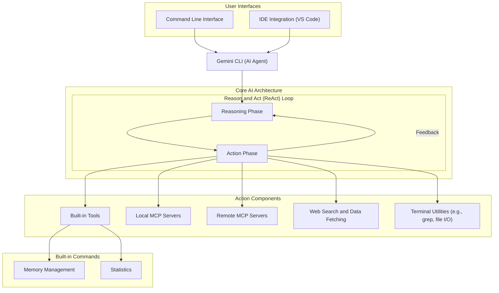

# The Architecture of Modern AI Coding Assistants
### A look under the hood of agentic tools like Gemini CLI

## Introduction: The Critical Decision Every AI Engineer Faces

When building AI applications, one of the first and most critical decisions you face is architectural. Do you build a predictable, step-by-step workflow, or do you need an autonomous agent that can reason and decide for itself? This choice impacts everything from development time and cost to reliability and user experience.

Choose the wrong path, and you might build a rigid system that fails with unexpected user inputs. Or, you could create an unpredictable agent that works brilliantly 80% of the time but fails spectacularly when it counts. This isn't just a theoretical problem. It’s a decision that separates prototypes from production-ready AI systems.

To understand how state-of-the-art systems solve this, we need to look under the hood. In this article, we will dissect the architectural patterns of modern AI coding assistants, using Google's open-source Gemini CLI as our primary example. We will explore how these tools balance structured execution with dynamic reasoning to create powerful, reliable assistants for developers.

## Understanding the Spectrum: From Workflows to Agents

Modern AI coding assistants are not simple, single-prompt systems. They are sophisticated AI agents designed to understand a developer's intent, reason about a problem, and take concrete actions to solve it. According to Google's official documentation, tools like Gemini CLI operate as open-source AI agents built around a core architectural pattern: the **Reason and Act (ReAct) loop**.

This loop allows the agent to iteratively cycle between two phases:
1.  **Reasoning:** The agent analyzes the problem, its current context (like the codebase), and the available tools to form a plan.
2.  **Acting:** The agent executes a step from its plan by calling a tool, such as running a command, reading a file, or searching the web.

The output of the action phase provides new information that feeds back into the next reasoning step, allowing the agent to refine its plan and adapt to new developments. This architecture is what enables the agent to perform complex tasks like fixing bugs, adding features, or running tests autonomously.

To support this loop, the agent relies on a set of integrated components. It has built-in tools for memory management and statistics, access to terminal utilities like `grep` and file I/O, and the ability to perform web searches to ground its outputs in external information.

Critically, its architecture is extensible through **Model Context Protocol (MCP) servers**, which allow it to connect to both local and remote tools, expanding its capabilities. This entire system powers both the command-line and IDE-integrated experiences, ensuring a consistent architecture across different user interfaces [[1]](https://blog.google/technology/developers/introducing-gemini-cli-open-source-ai-agent/).

Image 1: A flowchart illustrating the architectural patterns of the Gemini CLI, an AI coding assistant, focusing on the Reason and Act (ReAct) loop and its interactions with various components and user interfaces.

This agentic design sits at the autonomous end of the spectrum. But when building your own systems, you must decide if this level of complexity is necessary.

## Choosing Your Path

The decision to build an agent versus a simpler workflow is guided by the problem you are trying to solve. An agentic architecture like Gemini CLI's is powerful but also complex and potentially less predictable than a fixed workflow.

You should consider an agentic path when:
*   **The task is open-ended:** Problems like "refactor this module for better readability" or "find the root cause of this bug" do not have a clear, predefined set of steps. An agent is needed to explore, reason, and devise a solution dynamically.
*   **Adaptability is required:** The system needs to react to unexpected outcomes. If a test fails or a file is not found, an agent can analyze the error and adjust its plan, whereas a rigid workflow would simply fail.
*   **The solution requires multiple, varied tools:** When a task involves searching the web, reading files, executing code, and analyzing results, an agent can orchestrate these tools intelligently.

Conversely, a simpler, predefined workflow is often better when:
*   **The task is deterministic and repeatable:** For example, summarizing a document, extracting structured data from a file, or generating boilerplate code.
*   **Predictability and cost are primary concerns:** Workflows have consistent latency and token usage, making them easier to manage in production. Agents can be non-deterministic, with costs varying from run to run.
*   **Simplicity is key:** Workflows are easier to build, debug, and maintain. Agents introduce more moving parts and potential points of failure.

For most production use cases, the best approach is often a hybrid one. Start with structured workflows for predictable tasks and introduce agentic loops only where true autonomy is required.

## Exploring Common Patterns

The architecture of Gemini CLI highlights several key patterns that are becoming standard in production-grade AI agents. Understanding these patterns is essential for any engineer looking to build similar systems.

The **ReAct loop** is the central engine. It transforms the LLM from a simple text generator into a problem-solver that can interact with an environment. By breaking down a large goal into a series of thought-action-observation cycles, the agent can tackle complex problems that would be impossible to solve in a single LLM call.

**Tool integration** is what makes the "Act" part of the loop meaningful. An agent is only as powerful as the tools it can use. The use of MCP servers provides a standardized way to expose capabilities to the agent, whether they are running locally on the user's machine or remotely on a server. MCP is the USB-C protocol for AI agents. It provides a universal standard for connecting tools.

Finally, **grounding through external data** is a pattern for improving reliability and accuracy. By enabling the agent to perform web searches or fetch data from external sources, its responses are not limited to the knowledge baked into the model. This allows it to work with up-to-date information, access documentation, and validate its own outputs.

## Zooming In on Our Favorite Examples

Let's connect these architectural patterns back to the concrete functionality of a coding assistant like Gemini CLI.

When you ask it to **fix a bug**, the agent initiates a ReAct loop.
*   **Reason:** It might first decide it needs more context and form a plan to read the relevant source files and run the tests to reproduce the error.
*   **Act:** It uses its file I/O and terminal tools to execute this plan.
*   **Observe:** It analyzes the test output and the code.
*   **Reason:** Based on the error message, it hypothesizes a fix and plans to modify the code.
*   **Act:** It uses its file-writing tool to apply the change.
*   **Observe:** It reruns the tests. If they pass, the loop concludes. If not, it iterates again.

When asked to **add a new feature**, the process is similar but might involve more web search actions to look up API documentation or best practices. The key is that the agent is not following a hardcoded script. It is dynamically planning and executing steps based on the goal and the feedback it receives from its environment.

The fact that this same core architecture powers both the command-line tool and the VS Code extension is a testament to its robustness. It separates the agent's core logic from the user interface, allowing for a consistent and powerful experience no matter how the developer chooses to interact with it.

## The Challenges of Every AI Engineer

Building a sophisticated AI coding assistant is not a simple task. While the architectural patterns we have discussed provide a solid foundation, implementing them in production comes with its own set of challenges. Reliability, cost management, and debugging are constant concerns when working with autonomous agents.

Reliability is a constant challenge. An agent that works perfectly on ten test cases might fail on the eleventh in a completely unexpected way. Ensuring robustness requires extensive testing, careful prompt engineering, and building in safeguards like human-in-the-loop validation steps.

The path forward as an AI engineer is about mastering these realities. The choice is not a binary one between rigid workflows and total autonomy. Instead, it’s about understanding the spectrum and knowing how to design hybrid systems that use the right level of autonomy for the right task. The key takeaway is that while fully autonomous agents are impressive, the most robust and practical solutions often blend predictable workflows with agentic components. Learning from these advanced architectures helps us make informed decisions and build reliable, efficient, and production-ready AI systems.